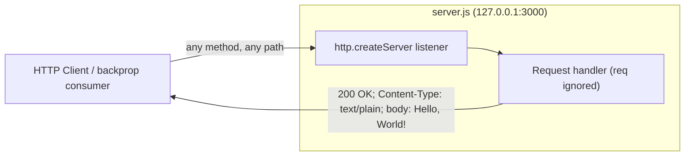
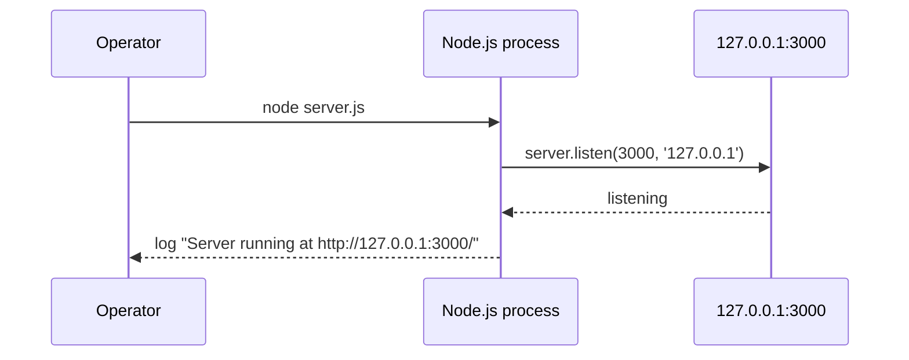

# hao-backprop-test

A minimal, single-file **Node.js HTTP server** that always returns a static `Hello, World!` response — purpose-built as a deterministic test fixture for an external **backprop integration** workflow. `Source: server.js:L1-L14`

---

## Table of Contents

- [Overview](#overview)
- [Architecture](#architecture)
- [Prerequisites](#prerequisites)
- [Installation](#installation)
- [Configuration](#configuration)
- [Running the Server](#running-the-server)
- [API Documentation](#api-documentation)
- [Deployment Guide](#deployment-guide)
- [Code Explanation](#code-explanation)
- [Project Structure](#project-structure)
- [Testing](#testing)
- [License & Author](#license--author)

---

## Overview

`hao-backprop-test` is a deliberately tiny project whose entire runtime lives in a single
file, `server.js`. It starts a Node.js HTTP server and answers **every** request — regardless
of method, path, query string, headers, or body — with one fixed plain-text response. `Source: server.js:L6-L10`

The project exists to serve as a **deterministic fixture** for a "backprop integration"
workflow: because the server's externally observable behavior never varies, an integrating
consumer can rely on a constant, predictable response contract when exercising its own
pipeline. `Source: server.js:L1-L14`

Key characteristics:

- **Single-file runtime.** All logic is in `server.js`; there are no other source modules. `Source: server.js:L1-L14`
- **Zero dependencies.** The server uses only Node's built-in `http` module — no third-party framework. `Source: server.js:L1`
- **Fully deterministic.** The request handler is branchless and ignores the request entirely, so the response is byte-identical for every call. `Source: server.js:L6-L10`

---

## Architecture

The architecture is intentionally trivial: a single HTTP listener bound to the loopback
interface forwards every inbound request to one branchless handler, which writes the same
static response and ends the exchange. There is no router, middleware stack, or business
logic between the listener and the response. `Source: server.js:L6-L10,L12-L14`

### Request / Response Flow

Any request that reaches the listener is passed to the request handler, which never inspects
the request and always emits the same `200 OK` plain-text reply. `Source: server.js:L6-L10`



### Startup Sequence

When an operator launches the process, the server binds to `127.0.0.1:3000` and, once
listening, logs a single human-readable startup line. `Source: server.js:L12-L14`



---

## Prerequisites

- **Node.js 22.x LTS** — the runtime used to validate this project (verified version `v22.22.2`). The built-in `http` module the server relies on ships with Node.js, so no additional runtime is required. `Source: server.js:L1`
- **npm** — bundled with Node.js (verified version `11.1.0`). It is needed only for the optional, no-op install described below; it is **not** required to run the server.

No other tooling, framework, compiler, or build step is needed. `Source: package.json:L1-L11`

---

## Installation

This project has **zero dependencies**, so there is nothing to install. From the root of your checked-out repository, you can optionally run `npm install` (it is a no-op — see the note below):

```bash
# From the root of your checked-out repository (the directory containing server.js).
# Optional: this is a no-op for this project because there are zero dependencies.
npm install
```

> **`npm install` is an optional no-op.** The project declares **zero dependencies** — `package.json` lists no `dependencies` or `devDependencies`, and `package-lock.json` contains only a root package entry with no dependency tree. Running `npm install` therefore installs nothing and **does not create a `node_modules` directory**. You can skip it entirely and run the server directly. `Source: package-lock.json:L6-L11`, `package.json:L1-L11`

---

## Configuration

All configuration is expressed as two **hardcoded compile-time constants** in `server.js`.
There are **no environment-variable overrides** and no configuration file — to change the
host or port you must edit the source directly. `Source: server.js:L3-L4`

| Constant   | Value         | How it is set                       | Override mechanism | Source            |
|------------|---------------|-------------------------------------|--------------------|-------------------|
| `hostname` | `127.0.0.1`   | Hardcoded `const` (loopback address)| None               | `server.js:L3`    |
| `port`     | `3000`        | Hardcoded `const` (TCP port)        | None               | `server.js:L4`    |

---

## Running the Server

Start the server with the Node.js CLI, pointing it at `server.js`:

```bash
$ node server.js
Server running at http://127.0.0.1:3000/
```

The exact startup log line — `Server running at http://127.0.0.1:3000/` — confirms the
server is bound and listening. `Source: server.js:L12-L14`

### Entry-point note: run `server.js`, not `index.js`

`package.json` declares `"main": "index.js"`, **but no `index.js` file exists in this
repository** — the actual runtime module is `server.js`. In addition, `package.json` defines
**no `start` script** (only a placeholder `test` script). Consequently:

- `npm start` **works** — although no explicit `start` script is defined, npm falls back to
  its built-in default and runs `node server.js` (npm applies this default because a
  `server.js` file exists in the package root).
- `node .` / `node index.js` will **fail** (the `main` target does not exist).
- The correct, supported launch command is **`node server.js`**.

This `main: index.js` discrepancy is documented here as a known characteristic of the
repository; it is intentionally left **as-is** and is not corrected by this project. `Source: package.json:L5`

---

## API Documentation

The server exposes a **single catch-all endpoint**. The request handler does not inspect the
method, path, query, headers, or body, so every request that reaches it — on every route, with
every **standard HTTP method** (and Node-recognized extension methods such as the WebDAV verbs)
— receives the identical response. Node's HTTP parser rejects unrecognized method tokens (for
example `FOOBAR`) with `400 Bad Request` before the handler runs, so they never reach the
handler; this is transport-level behavior outside the handler's control. `Source: server.js:L6-L10`

| Property        | Value                                                  | Source            |
|-----------------|--------------------------------------------------------|-------------------|
| Method          | ANY (`GET`, `POST`, `PUT`, `DELETE`, …)                | `server.js:L6-L10`|
| Path            | ANY (`/`, `/any/path`, `/foo?x=1`, …)                  | `server.js:L6-L10`|
| Status code     | `200 OK`                                               | `server.js:L7`    |
| `Content-Type`  | `text/plain`                                           | `server.js:L8`    |
| Response body   | `Hello, World!\n` (exactly **14 bytes**)               | `server.js:L9`    |

Node.js automatically adds the `Date`, `Connection: keep-alive`, `Keep-Alive: timeout=5`, and
`Content-Length: 14` response headers; these are framework-level additions rather than values
set by the handler. `Source: server.js:L7-L9`

### Example: `GET /`

```bash
$ curl -i http://127.0.0.1:3000/
HTTP/1.1 200 OK
Content-Type: text/plain
Date: <RFC-1123 date>
Connection: keep-alive
Keep-Alive: timeout=5
Content-Length: 14

Hello, World!
```

> The `Date` header is shown as `<RFC-1123 date>` because it changes on every request; all
> other lines are fixed and reproducible. `Source: server.js:L7-L9`

### Example: catch-all confirmation (any method / any path)

Every **standard HTTP method** on every path returns the same 14-byte body, confirming the
branchless contract (Node's HTTP parser rejects unrecognized method tokens with `400` before
the handler runs):

```bash
$ curl -s -X POST http://127.0.0.1:3000/any/path   # -> Hello, World!
$ curl -s -X DELETE "http://127.0.0.1:3000/foo?x=1" # -> Hello, World!
```

`Source: server.js:L6-L10`

---

## Deployment Guide

This fixture is designed for local, single-process use. Operators should be aware of the
following deployment characteristics:

- **Loopback-only binding.** The server binds to `127.0.0.1`, so it is reachable **only from
  the local machine**. It is **not** accessible from other hosts on the network; remote
  clients cannot connect. To expose it externally you would have to change the hardcoded host
  in the source. `Source: server.js:L3`
- **Single-process operation.** The script starts exactly one HTTP server in a single Node.js
  process; there is no clustering, worker pool, or process manager. `Source: server.js:L12-L14`
- **Port-collision behavior (`EADDRINUSE`).** The server listens on port `3000`. If that port
  is already in use, `server.listen` emits an `EADDRINUSE` error. Because the code registers
  **no `error` listener**, the process will terminate with an unhandled exception in that
  case. `Source: server.js:L4,L12`
- **Shutdown.** Stop the server with `Ctrl+C` (SIGINT) in the terminal where it runs. There is
  **no built-in graceful-shutdown logic** — in-flight connections are not drained on exit. `Source: server.js:L12-L14`
- **No built-in error handling.** The request handler performs no validation and has no
  `try`/`catch`; the listener registers no error handling. The server is intended as a
  deterministic fixture, not a hardened production service. `Source: server.js:L6-L10,L12`

---

## Code Explanation

The entire runtime is 14 lines of `server.js`. The walkthrough below is keyed to the
**original** source line numbers; the source file also carries in-code JSDoc blocks and
per-line `//` comments that mirror these explanations. `Source: server.js:L1-L14`

- **Line 1 — Import the HTTP module.** `const http = require('http');` loads Node's built-in
  `http` module, which provides the server API. No third-party framework is involved. `Source: server.js:L1`
- **Line 3 — Host constant.** `const hostname = '127.0.0.1';` fixes the bind address to the
  loopback interface (local-only reachability). `Source: server.js:L3`
- **Line 4 — Port constant.** `const port = 3000;` fixes the TCP port the server listens on. `Source: server.js:L4`
- **Lines 6–10 — Request handler.** `http.createServer((req, res) => { … })` registers the
  branchless handler. It sets `res.statusCode = 200` (L7), sets the `Content-Type: text/plain`
  header (L8), and writes the body `Hello, World!\n` while ending the response with
  `res.end(...)` (L9). The `req` argument is never read, which is what makes the response
  deterministic. `Source: server.js:L6-L10`
- **Lines 12–14 — Start listening.** `server.listen(port, hostname, () => { … })` binds the
  server to `127.0.0.1:3000` and, once listening, runs the callback that logs
  `Server running at http://127.0.0.1:3000/` to stdout. `Source: server.js:L12-L14`

---

## Project Structure

The repository contains exactly five files and no subdirectories:

```text
hao-backprop-test/
├── server.js          # Runtime: the sole executable module (HTTP server)
├── package.json       # Manifest: name, version, scripts, main, license
├── package-lock.json  # Lockfile: confirms a zero-dependency tree
├── README.md          # This developer guide
└── TESTING.md         # Testing strategy and manual validation commands
```

| File                | Role                                                                 | Source                  |
|---------------------|----------------------------------------------------------------------|-------------------------|
| `server.js`         | The runtime HTTP server (only executable module).                    | `server.js:L1-L14`      |
| `package.json`      | Package manifest (`hello_world` v`1.0.0`, scripts, `main`, license). | `package.json:L1-L11`   |
| `package-lock.json` | Dependency lockfile confirming zero dependencies.                    | `package-lock.json:L6-L11` |
| `README.md`         | This comprehensive developer guide.                                  | —                       |
| `TESTING.md`        | Testing strategy and manual validation commands.                     | —                       |

---

## Testing

This project ships **no automated tests**. The `test` script in `package.json` is only a
placeholder — `npm test` runs `echo "Error: no test specified" && exit 1`, which prints the
message and exits with a non-zero status. `Source: package.json:L7`

For the full testing strategy — including unit, integration, and API-scenario
recommendations, edge-case validations, coverage-improvement opportunities, and a
risk-based prioritization — see **[./TESTING.md](./TESTING.md)**.

---

## License & Author

- **License:** MIT. `Source: package.json:L10`
- **Author:** `hxu`. `Source: package.json:L9`
