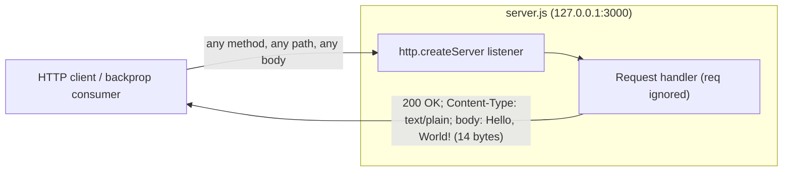

# Testing Strategy

A testing strategy for **`hao-backprop-test`** — a minimal, single-file Node.js HTTP
server that returns a static `Hello, World!` response and serves as a deterministic
test fixture for an external *backprop integration* workflow.

> **This document is a written strategy, not an executable test suite.** It analyzes the
> codebase and recommends what to test and how, prioritized by business impact and risk.
> Every tool, framework, and refactor mentioned here is **advisory only**. The project
> intentionally keeps its **zero-dependency, zero-install** posture, and nothing in this
> document adds a dependency, a test runner, a configuration file, or CI.
> _Source: `package.json:L1-L11`, `package-lock.json:L6-L11`._

---

## Table of Contents

1. [Overview](#1-overview)
2. [Current State](#2-current-state)
3. [Testing Philosophy for a Deterministic Fixture](#3-testing-philosophy-for-a-deterministic-fixture)
4. [Unit Test Recommendations](#4-unit-test-recommendations)
5. [Integration Test Recommendations](#5-integration-test-recommendations)
6. [API Test Scenarios](#6-api-test-scenarios)
7. [Edge Case Validations](#7-edge-case-validations)
8. [Coverage Improvement Opportunities](#8-coverage-improvement-opportunities)
9. [Test Prioritization by Business Impact and Risk](#9-test-prioritization-by-business-impact-and-risk)
10. [Recommended Tooling (Advisory)](#10-recommended-tooling-advisory)
11. [Manual Validation Commands](#11-manual-validation-commands)

---

## 1. Overview

The **system under test (SUT)** is a single module, `server.js`, which starts a Node.js
HTTP server bound to the loopback interface `127.0.0.1` on port `3000` using only the
built-in `http` module — no third-party framework is involved.
_Source: `server.js:L1`, `server.js:L3`, `server.js:L4`._

Its entire externally observable behavior is one HTTP **response contract**:

| Property        | Value                          |
|-----------------|--------------------------------|
| Status code     | `200 OK`                       |
| `Content-Type`  | `text/plain`                   |
| Response body   | `Hello, World!\n` (14 bytes)   |
| Startup log     | `Server running at http://127.0.0.1:3000/` |

_Source: `server.js:L6-L10` (handler), `server.js:L12-L14` (startup log)._

Because the server is tiny and fully deterministic, the goal of this strategy is **not**
broad coverage of complex logic — there is none — but **high-confidence verification of the
invariant response contract** that the backprop consumer depends on. The recommendations
below describe unit, integration, API-scenario, edge-case, and coverage approaches, then
rank them by business impact and risk. They are framed so a developer can act on them
without changing the project's zero-dependency posture, and they include
[manual validation commands](#11-manual-validation-commands) that work **today**, with no
framework installed.

---

## 2. Current State

There is currently **no automated test suite and no test framework** in the repository.
The only test-related artifact is a placeholder npm script:

```json
"scripts": {
  "test": "echo \"Error: no test specified\" && exit 1"
}
```

_Source: `package.json:L7`._

Running it confirms the placeholder fails by design — it prints an error and exits with a
non-zero status code, so any CI step that runs `npm test` will currently report failure:

```console
$ npm test

> hello_world@1.0.0 test
> echo "Error: no test specified" && exit 1

Error: no test specified
$ echo $?
1
```

Key facts about the current state:

- **Automated coverage is 0%.** No unit, integration, or end-to-end tests exist.
- **No test runner, assertion library, mocking library, coverage tool, or CI workflow** is
  present or configured.
- **Zero dependencies.** The lockfile records only the root package with no installed
  packages, so `npm install` is effectively a no-op and produces no `node_modules`.
  _Source: `package-lock.json:L6-L11`._
- The recommendations in this document **preserve** this state: they explain how testing
  *could* be added and provide manual checks that need nothing beyond an already-installed
  Node.js runtime.

---

## 3. Testing Philosophy for a Deterministic Fixture

`hao-backprop-test` is a **deterministic fixture**: the request handler is *branchless*. It
never inspects the request method, URL/path, query string, headers, or body, and it always
writes the same status, the same header, and the same body for every request.
_Source: `server.js:L6-L10`._



This determinism shapes the entire strategy:

- **The contract *is* the product.** The fixture's only job is to return a known, stable
  response so the backprop consumer has something predictable to integrate against. The
  highest-value testing therefore verifies that **invariant response contract** at the HTTP
  level, exactly as a real client observes it.
- **Behavioral (black-box) testing beats white-box testing here.** Because there are no
  branches, there is no decision logic to cover with many unit tests. One HTTP request that
  asserts status + header + body validates essentially the whole behavior.
- **Invariance is itself a property to test.** Rather than testing many *different* outputs,
  the suite should assert that *different inputs produce the same output* — i.e., that the
  catch-all behavior holds across methods, paths, query strings, and bodies.
- **Boot reliability matters as much as response correctness.** A fixture that does not start
  is useless to the consumer, so verifying the process boots, logs its readiness line, and
  binds the expected host/port is a first-class concern. _Source: `server.js:L12-L14`._
- **Failure modes are narrow but real.** The most realistic failure is not a wrong response;
  it is the process refusing to start because the port is already in use. That edge case
  deserves explicit attention (see [Edge Case Validations](#7-edge-case-validations)).

In short: **prioritize HTTP-level integration/API tests of the invariant contract and the
boot sequence; treat unit tests as a lower-priority enhancement that first requires a small
testability refactor** (next section).

---

## 4. Unit Test Recommendations

**What could be unit-tested.** The only unit-testable logic is the request handler itself —
the three statements that set the status code, set the `Content-Type` header, and end the
response with the static body. _Source: `server.js:L6-L10`._ A unit test would invoke the
handler with mock `req`/`res` objects and assert that:

- `res.statusCode` is set to `200`; _Source: `server.js:L7`._
- `res.setHeader` is called with `('Content-Type', 'text/plain')`; _Source: `server.js:L8`._
- `res.end` is called with the payload `Hello, World!\n` (14 bytes). _Source: `server.js:L9`._

**The testability barrier (must-read).** `server.js` **does not export anything** — it has no
`module.exports`. The request handler is defined inline as an anonymous arrow function passed
directly to `http.createServer`, and the file begins listening as a *side effect* of being
required or run. _Source: `server.js:L6-L14`._ Consequently, a unit test cannot import the
handler in isolation, and merely `require()`-ing the module would start a real listening
socket — turning every "unit" test into an integration test (and risking port conflicts).

> ### Recommended testability refactor (ADVISORY — not part of this task)
>
> The following refactor would make true unit testing possible. **It is a future
> recommendation only.** This task does not modify `server.js`, and the strategy here works
> against the code as it exists today.
>
> 1. **Extract and export the handler** so it can be imported without starting a server:
>
>    ```js
>    // Advisory illustration only — NOT applied by this task.
>    function requestHandler(req, res) {
>      res.statusCode = 200;
>      res.setHeader('Content-Type', 'text/plain');
>      res.end('Hello, World!\n');
>    }
>    module.exports = { requestHandler };
>    ```
>
> 2. **Guard the listen call** so importing the module does not open a socket:
>
>    ```js
>    // Advisory illustration only — NOT applied by this task.
>    if (require.main === module) {
>      http.createServer(requestHandler).listen(port, hostname, () => {
>        console.log(`Server running at http://${hostname}:${port}/`);
>      });
>    }
>    ```
>
> With the handler exported, a unit test could drive it with lightweight mock objects — for
> example, a fake `res` that records `statusCode`, captures `setHeader(name, value)` calls,
> and captures the `end(payload)` argument — and assert the three invariants above. No
> network socket, no port, no timing concerns.

**Priority note.** Until the refactor lands, unit tests provide little additional confidence
beyond what an HTTP integration test already gives (the surface is three lines with no
branches). Unit tests are therefore ranked **lower** than integration/API tests in
[Section 9](#9-test-prioritization-by-business-impact-and-risk).

---

## 5. Integration Test Recommendations

Integration testing is the **most valuable** approach for this fixture because it exercises
the real, unmodified `server.js` exactly as the backprop consumer will: boot the process,
let it bind the socket, send a real HTTP request, and assert the response. This needs **no
code change** and validates the handler, the listen call, and the host/port binding together.

Recommended integration flow:

1. **Boot the process.** Spawn `node server.js` as a child process.
   _Source: `server.js:L12-L14`._
2. **Wait for readiness.** Detect the listening state either by watching stdout for the exact
   startup line `Server running at http://127.0.0.1:3000/`, or by polling
   `http://127.0.0.1:3000/` until the first successful response. _Source: `server.js:L13`._
3. **Probe with an HTTP request.** Issue a request (e.g., `GET /`) using the built-in `http`
   client (or `fetch`) and capture the status code, the `Content-Type` header, and the body.
4. **Assert the contract.** Status `200`, `Content-Type: text/plain`, body `Hello, World!\n`
   (14 bytes), and `Content-Length: 14`. _Source: `server.js:L6-L10`._
5. **Verify the startup log.** Assert the process emitted exactly
   `Server running at http://127.0.0.1:3000/` on stdout. _Source: `server.js:L13`._
6. **Tear down cleanly.** Kill the child process and confirm the port is released so repeated
   test runs do not collide on port `3000` (see [EADDRINUSE](#7-edge-case-validations)).

Practical guidance:

- **Readiness over fixed sleeps.** Prefer waiting for the startup log line or a successful
  probe over a hard-coded `sleep`; it is faster and far less flaky.
- **One process per scenario group.** Boot once, run the whole API matrix
  ([Section 6](#6-api-test-scenarios)) against the live process, then shut down — rather than
  restarting the server for every assertion.
- **Deterministic teardown.** Always stop the spawned process in a `finally`/`afterAll` step,
  even when assertions fail, to avoid leaking a listener that blocks the next run.

---

## 6. API Test Scenarios

Because the handler is a catch-all, the central API property to verify is **invariance**: the
same response for every method and every path. The matrix below was **executed live** against
`node server.js` and each row produced the identical contract. _Source: `server.js:L6-L10`._

For **every** scenario, the expected response is:

- **Status:** `200`
- **`Content-Type`:** `text/plain`
- **Body:** `Hello, World!\n`
- **`Content-Length`:** `14`

| # | Method   | Path                    | Request body        | Expected status | Expected `Content-Type` | Expected body     | Expected `Content-Length` |
|---|----------|-------------------------|---------------------|-----------------|-------------------------|-------------------|---------------------------|
| 1 | `GET`    | `/`                     | _(none)_            | `200`           | `text/plain`            | `Hello, World!\n` | `14`                      |
| 2 | `POST`   | `/any/path`             | _(ignored)_         | `200`           | `text/plain`            | `Hello, World!\n` | `14`                      |
| 3 | `PUT`    | `/`                     | _(ignored)_         | `200`           | `text/plain`            | `Hello, World!\n` | `14`                      |
| 4 | `DELETE` | `/foo?x=1`              | _(none)_            | `200`           | `text/plain`            | `Hello, World!\n` | `14`                      |
| 5 | `PATCH`  | `/%E2%9C%93/long/path…` | _(none)_            | `200`           | `text/plain`            | `Hello, World!\n` | `14`                      |

Assertion notes:

- **Assert the body exactly**, including the trailing newline — the body is precisely the
  14-byte string `Hello, World!\n`. _Source: `server.js:L9`._
- **Only `Content-Type` is set by application code.** `Content-Length` is computed by Node
  from the body, and `Date`, `Connection: keep-alive`, and `Keep-Alive` are added
  automatically by the Node `http` module; assert `Content-Type` strictly and treat the
  auto-generated headers as present-but-variable (the `Date` value changes per request).
  _Source: `server.js:L8`._
- **Invariance is the assertion.** Tests should explicitly confirm that rows 1–5 produce
  byte-identical bodies and identical status/`Content-Type`, proving the catch-all behavior.


---

## 7. Edge Case Validations

Even a deterministic fixture has edge cases worth asserting — most of them confirm that the
catch-all behavior really *is* unconditional, plus one genuine failure mode (port in use).

| Edge case | What to send / do | Expected behavior | Source |
|-----------|-------------------|-------------------|--------|
| **Very long URL path** | A path with hundreds of characters | `200`, `text/plain`, `Hello, World!\n` (14 bytes) — unchanged | `server.js:L6-L10` |
| **Odd / encoded path** | Percent-encoded or unusual characters (e.g. `/%E2%9C%93/…`) | `200`, `text/plain`, `Hello, World!\n` — path is ignored | `server.js:L6-L10` |
| **Query strings** | `/foo?x=1&y=2` | `200`, `text/plain`, `Hello, World!\n` — query ignored | `server.js:L6-L10` |
| **Unusual / non-standard methods** | `PATCH`, `OPTIONS`, or a custom verb | `200`, `text/plain`, `Hello, World!\n` (14 bytes) — the handler ignores the method, so every verb yields the identical response | `server.js:L6-L10` |
| **Request with a body** | `POST`/`PUT` with a payload | Request body is **not inspected or consumed by application code**; the response is unchanged (`200`, `text/plain`, `Hello, World!\n`) | `server.js:L6-L10` |
| **Many concurrent requests** | Fire N requests in parallel | Every response is identical (`200`, `text/plain`, 14 bytes) — determinism under load | `server.js:L6-L10` |
| **Repeated requests (idempotency)** | Same request many times | Byte-identical responses every time (aside from the variable `Date` header) | `server.js:L6-L10` |
| **Port already in use (`EADDRINUSE`)** | Start a second instance while `3000` is occupied | The process throws an **unhandled** `'error'` event and **crashes** (see below) | `server.js:L12` |
| **Loopback-only reachability** | Connect from a non-local host | **Not reachable** — the server binds `127.0.0.1`, so only local clients can connect | `server.js:L3` |

> **Note on request bodies:** the handler never attaches `data`/`end` listeners and never reads
> `req`, so request bodies are **not consumed by application code**. The response is written and
> ended immediately and is byte-identical regardless of any payload. For very large request
> bodies, client-observed behavior can vary depending on whether the client finishes sending the
> body before the response is received and the connection is closed — this is Node/transport
> behavior, not application logic. _Source: `server.js:L6-L10`._

### Port-in-use (`EADDRINUSE`) — a real failure mode

This is the one edge case that produces a hard failure rather than the happy-path response.
`server.listen(...)` is called **without** an attached `'error'` listener.
_Source: `server.js:L12-L14`._ When port `3000` is already bound, Node emits an unhandled
`'error'` event and the process terminates with a non-zero exit code. Observed output when a
second instance is started while the first is running:

```text
Error: listen EADDRINUSE: address already in use 127.0.0.1:3000
    at Server.setupListenHandle [as _listen2] (node:net:...)
    ...
  code: 'EADDRINUSE',
  errno: -98,
  syscall: 'listen',
  address: '127.0.0.1',
  port: 3000
```

**Testing implication:** a boot/integration test should treat a clean startup (the readiness
log line) as success and an `EADDRINUSE` crash as a detectable, expected failure when the
port is occupied. It also reinforces the **deterministic teardown** requirement from
[Section 5](#5-integration-test-recommendations): always release port `3000` between runs.

> **Hardening note (advisory):** attaching a `server.on('error', …)` handler would convert
> this hard crash into a graceful, logged failure. This is a future recommendation only and
> is **not** applied by this task.

---

## 8. Coverage Improvement Opportunities

**Current automated coverage: 0%** — there are no tests, so no lines, branches, or functions
are exercised by any suite. _Source: `package.json:L7`._

The meaningful coverage targets are small and well-defined:

| Coverage target | Location | How to cover it |
|-----------------|----------|-----------------|
| Request handler (status / header / body writes) | `server.js:L6-L10` | One HTTP integration request asserting the contract, **or** a unit test after the testability refactor |
| Listen callback (startup log side effect) | `server.js:L12-L14` | Assert the startup log line is emitted during the boot/integration test |

Because the executable surface is tiny and branchless, a single **HTTP integration test** of
the response contract plus a **boot/startup-log assertion** would exercise essentially the
entire runtime path — bringing functional coverage to **~100% of the meaningful surface**
with very little effort. Adding the [testability refactor](#4-unit-test-recommendations)
would additionally allow line-level unit coverage of the handler in isolation.

**Coverage tooling (advisory only).** If line/branch coverage *numbers* are desired (for
example, to gate a future CI step), Node's **built-in** coverage can be produced with
`node --experimental-test-coverage`, which is **zero-dependency** — it ships with Node and
installs nothing, so it does **not** add a devDependency. Third-party tools such as
[`c8`](https://www.npmjs.com/package/c8) or [`nyc`](https://www.npmjs.com/package/nyc) can
also produce coverage reports, but **adopting `c8` or `nyc` would add a devDependency, which
is out of scope for this project today**; those third-party options are mentioned for
completeness only.

---

## 9. Test Prioritization by Business Impact and Risk

Tests are ranked below by **business impact** (how central the behavior is to the fixture's
contract with the backprop consumer) and **risk** (likelihood and severity of failure). The
fixture's entire purpose is to return a known response on a known address, so the
response-contract integration test is the single most important test to have.

| Priority | Test category | Business impact | Risk addressed | Rationale |
|----------|---------------|-----------------|----------------|-----------|
| **P0** | **API response-contract integration test** (`GET /` → `200`, `text/plain`, `Hello, World!\n`, 14 bytes) | **Critical** — this *is* the fixture's whole contract with the backprop consumer | A regression here silently breaks every consumer | If only one test exists, it must be this one. _Source: `server.js:L6-L10`._ |
| **P1** | **Startup / boot verification** (process starts, binds `127.0.0.1:3000`, logs the readiness line) | High — a fixture that never starts is unusable | Boot/bind failures; missing or changed startup log | Readiness is a precondition for every other interaction. _Source: `server.js:L12-L14`._ |
| **P1** | **Port-collision handling (`EADDRINUSE`)** | High — the most realistic real-world failure mode | Unhandled crash when port `3000` is busy | Common in CI and shared dev environments; explicitly verify the failure is detectable. _Source: `server.js:L12`._ |
| **P2** | **API invariance matrix** (POST/PUT/DELETE/odd methods & paths all identical) | Medium — confirms the catch-all guarantee | Accidental introduction of routing/branching | Cheap to run once the server is booted; strengthens confidence in determinism. _Source: `server.js:L6-L10`._ |
| **P2** | **Edge cases** (long/encoded paths, bodies not consumed, concurrency, idempotency) | Medium — robustness and determinism under varied input/load | Subtle non-determinism | Valuable but lower-yield given the branchless handler. _Source: `server.js:L6-L10`._ |
| **P3** | **Unit tests of the handler** (mock `req`/`res`) | Low (today) — gated behind the testability refactor | Logic regressions in the 3-line handler | Adds little beyond the P0 integration test until `module.exports` is added. _Source: `server.js:L6-L14`._ |

**Reading the ranking:** start at **P0** and only invest further down as time allows. For
this fixture, P0 + P1 already deliver almost all of the achievable confidence; P2/P3 are
incremental hardening.


---

## 10. Recommended Tooling (Advisory)

All tooling below is **advisory**. The project ships with zero dependencies and this document
does not change that. _Source: `package.json:L1-L11`, `package-lock.json:L6-L11`._

### Preferred: zero-dependency, built into Node.js

Node.js includes everything needed to write the recommended tests **without installing
anything**:

- **`node:test`** — the built-in test runner (stable in current Node.js LTS lines). Run tests
  with `node --test`.
- **`node:assert`** — the built-in assertion library for status/header/body checks.
- **`node:http`** (or the global `fetch`) — to issue the integration/API requests, and to
  spawn/probe the server via `node:child_process`.

This combination can express the entire P0–P2 strategy (boot the process, probe it, assert
the contract, tear it down) with **no devDependencies and no config file**, which is why it is
the recommended path for this project.

### Popular alternatives (would add devDependencies — out of scope)

These are widely used and perfectly reasonable in larger projects, but adopting any of them
**adds devDependencies and a configuration surface**, which is out of scope here:

- **[`supertest`](https://www.npmjs.com/package/supertest) + [`jest`](https://www.npmjs.com/package/jest)** —
  ergonomic HTTP assertions with a full-featured runner.
- **Coverage:** [`c8`](https://www.npmjs.com/package/c8) or
  [`nyc`](https://www.npmjs.com/package/nyc) (see
  [Section 8](#8-coverage-improvement-opportunities)).

> **Recommendation:** if/when tests are added, start with the **zero-dependency** Node
> built-ins. Reach for `supertest`/`jest` only if the project later grows beyond a single
> static fixture and the richer ergonomics justify the added dependencies.

---

## 11. Manual Validation Commands

Until automated tests are added, a developer can validate the fixture **today** with `curl`
and an already-installed Node.js runtime — no framework required. The commands below were
**executed live** against `node server.js` and their outputs reproduced exactly (validated on
the installed Node.js runtime; the contract is identical across the Node.js 20.x and 22.x LTS
lines because the server uses only the stable built-in `http` module).

```bash
# 1) Start the server (in one terminal). Note: run server.js directly — package.json's
#    "main" points at index.js, which does not exist, and there is no "start" script.
#    Source: package.json:L5.
$ node server.js
Server running at http://127.0.0.1:3000/

# 2) In another terminal — baseline GET with response headers (-i).
$ curl -i http://127.0.0.1:3000/
HTTP/1.1 200 OK
Content-Type: text/plain
Date: <varies>                 # auto-added by Node; changes every request
Connection: keep-alive         # auto-added by Node
Keep-Alive: timeout=5          # auto-added by Node
Content-Length: 14

Hello, World!

# 3) Confirm the catch-all contract across methods and paths — every call returns the
#    same 14-byte body "Hello, World!\n".  Source: server.js:L6-L10.
$ curl -s -X POST   http://127.0.0.1:3000/any/path
Hello, World!
$ curl -s -X PUT    http://127.0.0.1:3000/
Hello, World!
$ curl -s -X DELETE "http://127.0.0.1:3000/foo?x=1"
Hello, World!

# 4) Confirm the exact body size is 14 bytes (includes the trailing newline).
$ curl -s http://127.0.0.1:3000/ | wc -c
14

# 5) (Optional) Confirm status/content-type/length succinctly for any request.
$ curl -s -o /dev/null -w "status=%{http_code} type=%{content_type} len=%{size_download}\n" \
    -X PATCH http://127.0.0.1:3000/anything
status=200 type=text/plain len=14
```

Notes:

- The **only** application-set header is `Content-Type: text/plain`; `Content-Length` is
  computed by Node from the body, and `Date`, `Connection`, and `Keep-Alive` are added
  automatically by the Node `http` module. Assert `Content-Type` strictly and treat `Date` as
  variable. _Source: `server.js:L8`._
- The body is exactly `Hello, World!\n` — 14 bytes including the trailing newline.
  _Source: `server.js:L9`._
- To verify the current placeholder test behavior described in
  [Section 2](#2-current-state), run `npm test`; it prints `Error: no test specified` and
  exits with status `1`. _Source: `package.json:L7`._

---

### Summary

The fixture's value is its **deterministic response contract**. Verify that contract at the
HTTP level (P0), confirm the server **boots and logs readiness** and handles a **busy port**
(P1), then add **invariance/edge-case** checks (P2) and, after a small testability refactor,
**unit tests** (P3). All of this can be done with **zero new dependencies** using Node's
built-in tooling, and can be exercised manually today with the `curl` commands above.

