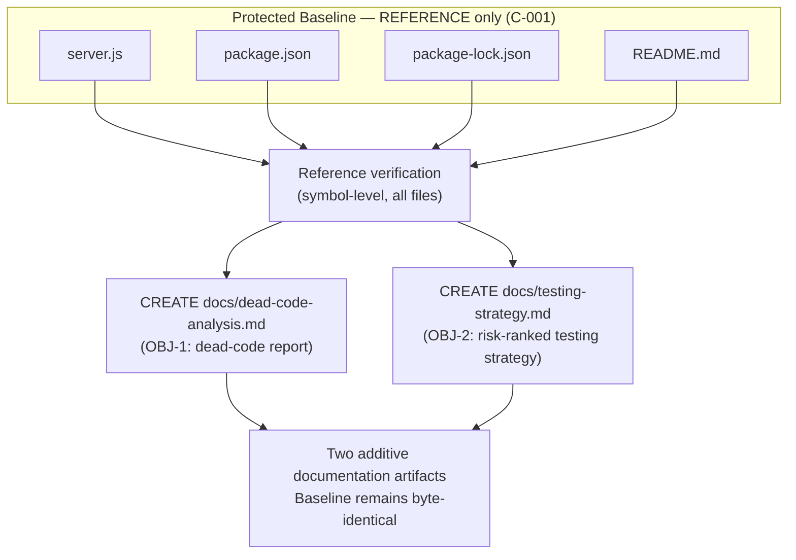

# Technical Specification

# 0. Agent Action Plan

## 0.1 Intent Clarification

Based on the provided requirements, the Blitzy platform understands that the objective is to perform a **whole-repository static analysis** of the `hao-backprop-test` project that produces two complementary, evidence-backed deliverables: (1) a **dead/unused code report** requested by the user's prompt, and (2) a **risk-prioritized testing strategy** mandated by the user-specified rule "Add Testing Rule IW". Both deliverables are analysis and documentation artifacts; neither requires altering the executable behavior of the system.

A defining characteristic of this engagement, established up front so it governs every downstream decision, is that the repository is an intentionally minimal, immutability-governed test fixture. The repository contains exactly four files totaling 39 lines [server.js:L1-L14], [package.json:L1-L11], [package-lock.json:L1-L14], [README.md:L1-L3], and its documentation carries an explicit governance directive: "test project for backprop integration. Do not touch!" [README.md:L2]. This directive is formalized as constraint **C-001** (all files must remain unchanged from the committed baseline) in the Technical Specification [§2.6.2]. Consequently, both deliverables are produced as **new, additive documentation** that leaves the four protected baseline files byte-identical.

### 0.1.1 Core Objective

The engagement decomposes into two co-equal core objectives, each restated with technical precision:

- **OBJ-1 — Dead/Unused Code Identification and Reporting (from the prompt):** Statically analyze the entire codebase to detect dead or unused code across six categories — unused functions, unused classes, unused variables, unused imports, unused/orphan files, and unreachable code — verifying every reference before flagging any element, and emitting a structured report whose per-finding rows carry a file path, supporting evidence, a confidence level, and a recommended cleanup action.

- **OBJ-2 — Testing Strategy Generation (from rule "Add Testing Rule IW"):** Analyze the codebase and produce a testing strategy containing five recommendation classes — unit-test recommendations, integration-test recommendations, API test scenarios, edge-case validations, and coverage-improvement opportunities — with all recommendations prioritized by business impact and risk.

Implicit requirements surfaced during analysis:

- A **confidence taxonomy** must be defined, because the prompt requires confidence levels but does not specify a scale. The report will use a High / Medium / Low taxonomy.
- **Reference verification is mandatory** before any element is marked unused. This has been performed via symbol-level reference checks across all source files.
- The pre-existing **metadata inconsistency** — `package.json` declares `"main": "index.js"` [package.json:L5] while no `index.js` file exists in the repository — must be surfaced as a finding, with its remediation status correctly reported as constrained by immutability (assumption A-004 in [§2.6.1] states the inconsistency cannot be corrected under the README directive).
- The **absence of any test infrastructure** (the `test` script is the npm-default placeholder `echo "Error: no test specified" && exit 1` [package.json:L7]) means the testing strategy is a recommendations deliverable; each recommendation must be annotated with how it interacts with the project's constraints.

Dependencies and prerequisites: the only runtime prerequisite is a Node.js installation (assumption A-001 in [§2.6.1]); the environment already provides Node v22.22.2. There are zero third-party dependencies to resolve [package-lock.json:L6-L12], no build step, and no external services.

### 0.1.2 Task Categorization

- **Primary task type:** Mixed — predominantly **Documentation/Reporting** built on a **code-analysis** core. A latent Refactor/Cleanup dimension (acting on "recommended cleanup actions") exists but is deliberately suppressed by the immutability directive [README.md:L2], [§2.6.2].
- **Secondary aspects:** static dead-code analysis; testing/QA strategy planning; package-metadata consistency review (the `main` field versus the actual entry point).
- **Scope classification:** Isolated, additive-documentation change. No modification to any existing baseline file; the only new artifacts are analysis documents.

### 0.1.3 Special Instructions and Constraints

- **User prompt (preserved verbatim):** "This is a software project. Could you analyze the codebase and identify dead or unused code? Please find unused functions, classes, variables, imports, files, and unreachable code. Verify all references before marking code as unused, and provide a report with file paths, evidence, confidence levels, and recommended cleanup actions."
- **User rule "Add Testing Rule IW" (preserved verbatim):** "Analyze the codebase and create a testing strategy. Generate: - Unit test recommendations - Integration test recommendations - API test scenarios - Edge case validations - Coverage improvement opportunities. Prioritize tests based on business impact and risk."
- **Critical directive — "Verify all references before marking code as unused":** No element may be reported as unused without an explicit, documented reference check. This has been honored.
- **Methodological directive — risk-based prioritization:** Testing recommendations must be ordered by business impact and risk, not enumerated arbitrarily.
- **Governing repository constraint — source immutability (C-001):** The `README.md` "Do not touch!" directive [README.md:L2] forbids editing or deleting the four baseline files. The deliverables therefore add documentation rather than mutate source.
- **Web search requirements:** Background research into JavaScript/Node.js dead-code detection tooling and risk-based testing practices was attempted; the external search facility returned no substantive results in this environment, so the analysis is grounded in established engineering knowledge without fabricated external citations.

### 0.1.4 Technical Interpretation

These requirements translate to the following technical implementation strategy:

- To **satisfy OBJ-1**, we will create a new dead-code analysis report (`docs/dead-code-analysis.md`) by performing symbol-level reference verification across the four files and tabulating every element with its evidence, confidence, and recommended action — concluding, honestly and with evidence, that the repository contains essentially **zero removable dead code**, with one idiomatic unused parameter (`req`) recommended for retention and one dangling metadata reference (`main: "index.js"`) recorded as report-only.
- To **satisfy OBJ-2**, we will create a new testing strategy document (`docs/testing-strategy.md`) that enumerates unit, integration, API, edge-case, and coverage recommendations ranked by business impact and risk, annotating each with its constraint interaction (zero-dependency-feasible via Node's built-in `node:test`, requires-source-refactor, or forbidden by C-001/C-005).
- To **honor the governing constraints**, we will deliver both artifacts additively so that `server.js`, `package.json`, `package-lock.json`, and `README.md` remain byte-identical, and we will flag the single genuine ambiguity (whether the user wants analysis-only or actual cleanup execution) for confirmation, defaulting to analysis-only because the prompt requests a *report* with *recommended* actions rather than execution of those actions.

## 0.2 Repository Scope Discovery

A complete enumeration of the repository was performed. The project is fully self-contained in four files at the root with no subdirectories, so an exhaustive analysis is tractable and has been completed in full — nothing is deferred or left "to be discovered."

### 0.2.1 Comprehensive File Analysis

The repository's complete file inventory is the analysis surface for both deliverables:

| File | Lines | Role | Relevance to This Task |
|------|-------|------|------------------------|
| `server.js` | 14 | Sole runtime executable; built-in `http` server [server.js:L1-L14] | Primary dead-code target; primary subject of the testing strategy |
| `package.json` | 10 | npm manifest: name `hello_world` v1.0.0, `main` `index.js`, placeholder `test` script [package.json:L2-L7] | Source of the dangling `main` finding and the placeholder-test observation |
| `package-lock.json` | 13 | Lockfile v3; single root `""` package entry [package-lock.json:L6-L12] | Confirms zero dependencies (no unused-dependency findings possible) |
| `README.md` | 2 | Title plus governance directive [README.md:L1-L2] | Source of the C-001 "Do not touch!" immutability constraint |

**Dead-code reference-verification matrix.** Every declared symbol and structural element was checked for references before any verdict was assigned, directly satisfying the prompt's "verify all references" directive:

| Element | Location | Reference Check | Verdict | Confidence |
|---------|----------|-----------------|---------|------------|
| `http` import | server.js:L1 | Used by `http.createServer` [server.js:L6] | Used | High |
| `hostname` const | server.js:L3 | Used by `server.listen` [server.js:L12] and log template [server.js:L13] | Used | High |
| `port` const | server.js:L4 | Used by `server.listen` [server.js:L12] and log template [server.js:L13] | Used | High |
| `server` const | server.js:L6 | Used by `server.listen` [server.js:L12] | Used | High |
| `res` handler param | server.js:L6 | Used by `res.statusCode`/`setHeader`/`end` [server.js:L7-L9] | Used | High |
| `req` handler param | server.js:L6 | No read anywhere; handler is branchless | Unused (idiomatic) | High |
| Request-handler arrow fn | server.js:L6-L10 | Passed to `http.createServer` | Used | High |
| Listen-callback arrow fn | server.js:L12-L14 | Passed to `server.listen` | Used | High |
| `"main": "index.js"` | package.json:L5 | No `index.js` file exists; entry is `node server.js` | Dangling reference | High |

The categories the prompt enumerates resolve as follows: **unused functions — none**; **unused classes — none** (no classes are declared); **unused variables — none** (all four `const` declarations are referenced); **unused imports — none** (the single `http` import is used); **unused/orphan files — none** (all four files have an active role); **unreachable code — none** (the 14 lines execute on startup, and the handler is branchless, confirmed by [§6.6.7.1]). The net result is **zero removable dead code**, with the lone `req` parameter recommended for retention as an idiomatic callback placeholder and the `main`/`index.js` mismatch recorded as a report-only metadata finding.

### 0.2.2 Web Search Research Conducted

Research was directed at two areas; the external search facility returned no substantive results in this environment, so the findings below reflect established engineering knowledge applied to the repository's specifics:

- **Dead-code detection tooling for Node.js (CommonJS):** ESLint rules `no-unused-vars` (variables/imports) and `no-unreachable` (unreachable code); `depcheck` (unused/missing dependencies); `knip` (unused files, exports, dependencies); `ts-prune` (TypeScript exports — not applicable to this plain-JS project); and the built-in `node --check` for syntax. A relevant nuance: ESLint's default `no-unused-vars` setting `args: "after-used"` would not even flag `req`, because the later parameter `res` is used; only `args: "all"` would flag it. For a zero-dependency, 14-line, branchless, export-less module, automated scanners add little over the manual reference verification already performed.
- **Risk-based testing practices:** the test pyramid (more unit, fewer integration, fewer end-to-end) and risk-based prioritization (business impact × failure likelihood). The pivotal finding for this project is that **Node.js v22 ships a built-in test runner (`node:test`) with `node:assert` and a global `fetch`/`node:http` client**, which makes API and integration tests achievable with **zero third-party dependencies** — the only path that respects the zero-dependency constraints C-005/C-006 [§2.6.2].

### 0.2.3 Existing Infrastructure Assessment

- **Project structure and organization:** flat layout — four files, no `src/`, `lib/`, `test/`, or `docs/` directories.
- **Conventions to follow:** CommonJS modules (`require`) [server.js:L1]; `server.js` uses two-space indentation, single quotes, `const` declarations, and arrow-function callbacks; `package.json` and `package-lock.json` use four-space indentation. New documentation should respect these conventions where it shows examples.
- **Build and deployment configuration:** none — no build/transpile step, no bundler, no TypeScript, no Dockerfile, no CI/CD workflow files anywhere in the repository.
- **Entry point:** the application is launched via `node server.js`; there is no `start` script, and the `main` field points at the non-existent `index.js` [package.json:L5].
- **Testing infrastructure present:** none — no test runner, no test files or directories, no coverage tool, and the `test` script is the npm-default placeholder returning exit code 1 [package.json:L7]. The Technical Specification documents this as the deliberate, normative posture for the fixture [§6.6.1.1].
- **Documentation system in use:** a single two-line `README.md` [README.md:L1-L2]; no generated docs, no docs toolchain.

## 0.3 Scope Boundaries

The scope is deliberately narrow and additive: it covers the analysis of all existing files and the creation of two new documentation artifacts, while explicitly excluding any change to the protected baseline.

### 0.3.1 Exhaustively In Scope

- **Source code analyzed (read-only, REFERENCE):**
  - `server.js` — full dead-code and testability analysis [server.js:L1-L14]
  - `package.json` — metadata, `main` field, and `test` script analysis [package.json:L1-L11]
  - `package-lock.json` — dependency-tree confirmation [package-lock.json:L1-L14]
  - `README.md` — governance/constraint extraction [README.md:L1-L2]
- **Documentation artifacts created (CREATE):**
  - `docs/dead-code-analysis.md` — the dead/unused code report satisfying OBJ-1, including the per-finding table (path, evidence, confidence, recommended action), the High/Medium/Low confidence taxonomy, the verification methodology, and the two findings (`req` unused parameter → keep; `main`/`index.js` dangling reference → report-only)
  - `docs/testing-strategy.md` — the risk-prioritized testing strategy satisfying OBJ-2, covering unit, integration, API, edge-case, and coverage recommendations, each annotated with its constraint interaction
- **Analytical deliverable elements:** the confidence taxonomy definition; the dead-code methodology description; and the risk-ranked ordering of all testing recommendations by business impact and failure likelihood.

### 0.3.2 Explicitly Out of Scope

- **Modifying or deleting any of the four baseline files** — forbidden by constraint C-001, sourced from the README "Do not touch!" directive [README.md:L2], [§2.6.2].
- **Implementing actual test files or editing the `package.json` `test` script** — these appear only as recommendations inside `docs/testing-strategy.md`; executing them is gated by C-001/C-005/C-006 and would require explicit user confirmation [§2.6.2].
- **Installing any third-party dependency** — including dead-code scanners (`knip`, `depcheck`, `ts-prune`) and test/coverage tooling (Jest, Mocha, Vitest, supertest, `c8`, `nyc`) — forbidden by the zero-dependency constraints C-005/C-006 [package-lock.json:L6-L12], [§2.6.2].
- **Correcting the `main`/`index.js` mismatch** — reported only; correction is precluded by assumption A-004 and constraint C-001 [§2.6.1], [§2.6.2].
- **Removing the idiomatic `req` parameter** [server.js:L6] — out of scope as a destructive change; recommended action is to keep it.
- **Any feature work, unrelated refactoring, performance optimization, security hardening, CI/CD setup, containerization, or build/transpile configuration** — none of these are requested by the prompt or the rule, and the Technical Specification enumerates them as out of scope for the fixture [§1.3.2].

## 0.4 Dependency Inventory

### 0.4.1 Key Packages

The project has **zero runtime dependencies and zero development dependencies**. `package.json` omits both the `dependencies` and `devDependencies` fields entirely [package.json:L1-L11], and `package-lock.json` (lockfile version 3) contains only the single root `""` package entry with no nested packages [package-lock.json:L6-L12] — a cryptographic confirmation of the empty dependency tree corroborated by [§3.4.1] and [§3.4.3]. The only software the system relies on is the Node.js runtime itself (built-in `http` module) [server.js:L1], and no `engines` field pins a version [package.json:L1-L11].

| Registry | Package Name | Version | Purpose |
|----------|--------------|---------|---------|
| n/a | (none) | n/a | The project intentionally uses no third-party packages; only the Node.js built-in `http` module is consumed |

### 0.4.2 Dependency Updates

There are **no dependency changes** in this plan. The deliverables are pure-Markdown analysis documents that introduce no runtime or build-time code.

- New dependencies to add: none.
- Dependencies to update: none.
- Dependencies to remove: none.
- Import/reference updates: none — no source files are modified, so no import statements change.

For completeness, the testing strategy's preferred implementation path deliberately uses Node v22's **built-in** `node:test` runner specifically so that no third-party dependency would ever be required, preserving constraints C-005 and C-006 [§2.6.2]. Any third-party test or coverage tooling is explicitly **not** adopted by this plan.

## 0.5 Implementation Design

### 0.5.1 Technical Approach

The approach is non-destructive analysis followed by documentation authoring. The four baseline files are read as references and never modified, honoring C-001 [README.md:L2], [§2.6.2].

- **Achieve OBJ-1** by creating `docs/dead-code-analysis.md` from the symbol-level reference verification already completed across all four files, presenting each element with evidence, confidence, and a recommended action. The rationale for an analysis-only outcome is twofold: the codebase contains no removable dead code, and any deletion would violate the immutability directive.
- **Achieve OBJ-2** by creating `docs/testing-strategy.md` containing unit, integration, API, edge-case, and coverage recommendations ranked by business impact and risk, each tagged with its constraint interaction.

Logical implementation flow (sequence, not schedule):

- First, **establish the analysis baseline** by reading `server.js`, `package.json`, `package-lock.json`, and `README.md` and verifying every symbol reference (completed during discovery).
- Next, **author the dead-code report** capturing the verdict matrix, confidence taxonomy, methodology, and the two findings.
- Next, **author the testing strategy** capturing the risk-ranked recommendations and their constraint annotations.
- Finally, **guarantee baseline preservation** by confirming no transformation touches the four protected files, and surface the analysis-only-versus-execution ambiguity for confirmation.

### 0.5.2 Component Impact Analysis

- **Direct modifications required:** none. No existing component is edited; `server.js`, `package.json`, `package-lock.json`, and `README.md` are read-only references [server.js:L1-L14], [package.json:L1-L11], [package-lock.json:L1-L14], [README.md:L1-L2].
- **Indirect impacts and dependencies:** none. Because no source changes occur, there are no interface changes, no dependency changes, and no behavioral ripple effects; the running server is entirely unaffected.
- **New components introduced:**
  - `docs/dead-code-analysis.md` — created to hold the dead-code report. Rationale: the prompt explicitly requests a report deliverable.
  - `docs/testing-strategy.md` — created to hold the testing strategy. Rationale: rule "Add Testing Rule IW" explicitly requests a testing strategy.
  - A `docs/` directory is implied by the two files above; it is the only structural addition.

### 0.5.3 User-Provided Examples Integration

The user supplied no code examples, sample outputs, or attachments. The two structured shapes the user did specify are honored directly:

- The prompt's required report fields ("file paths, evidence, confidence levels, and recommended cleanup actions") map one-to-one onto the columns of the dead-code report table in `docs/dead-code-analysis.md`.
- The rule's five enumerated recommendation classes ("Unit test recommendations, Integration test recommendations, API test scenarios, Edge case validations, Coverage improvement opportunities") map one-to-one onto the sections of `docs/testing-strategy.md`, all ordered by business impact and risk.

### 0.5.4 Critical Implementation Details

- **Confidence taxonomy (design pattern for the report):** High = reference status verified across all files with no plausible dynamic/string-based reference; Medium = strong evidence with a residual edge case; Low = heuristic only. Every finding in this 14-line, export-less, branchless module resolves to High confidence.
- **Dead-code methodology:** manual symbol-level reference verification (declaration-to-usage tracing across all files) is the primary technique, appropriate because the module declares no exports [§6.6.3.1] and has no dynamic dispatch; automated scanners are noted as optional corroboration but are not run (they would require dependencies, violating C-005).
- **User Interface Design:** not applicable — the system is a loopback HTTP endpoint returning `text/plain` with no UI surface [server.js:L7-L9], [§1.3.2].
- **Risk-prioritized testing recommendations (the core of `docs/testing-strategy.md`):**

| Priority | Class | Recommendation | Business-Impact / Risk Rationale | Constraint Interaction |
|----------|-------|----------------|----------------------------------|------------------------|
| P0 | API scenario | `GET /` returns HTTP 200, `Content-Type: text/plain`, body exactly `Hello, World!\n` (14 bytes) [server.js:L7-L9] | This is the fixture's core contract that the external backprop consumer relies on [§6.6.1.3] | Zero-dependency feasible via `node:test` + `fetch` against a spawned server |
| P0 | Edge case | Any method (POST/PUT/DELETE/OPTIONS) and arbitrary paths/bodies yield an identical response | Verifies the branchless determinism invariant F-002-RQ-004 [§6.6.1.2] | Zero-dependency feasible |
| P1 | Integration | Server binds `127.0.0.1:3000` and emits the startup log line [server.js:L12-L13] | Confirms process lifecycle and observable readiness signal | Zero-dependency feasible (spawn process, probe, read stdout) |
| P1 | Edge case | Startup fails with `EADDRINUSE` when port 3000 is occupied (assumption A-002) [§2.6.1] | Documents the only failure mode of an error-handler-free server | Zero-dependency feasible |
| P2 | Unit | Exercise the request handler in isolation | Highest granularity, but lowest marginal value for a branchless handler | Blocked — `server.js` has no `module.exports` [§6.6.3.1]; would require a source refactor that violates C-001 |
| P2 | Coverage | Establish a baseline (currently 0% automated) and measure it | Quantifies test adequacy over time | Use Node `--experimental-test-coverage` (zero-dependency); `c8`/`nyc`/Jest coverage are excluded by C-005 |

- **Integration and data-flow considerations:** no data flow is modified; the analysis consumes file contents and produces Markdown. The testing recommendations, if ever implemented, would spawn the server as a child process and probe it over loopback, matching the manual validation pattern the Technical Specification already documents [§6.6.2.3].
- **Error handling and edge cases (for the analysis itself):** the principal edge case is a false positive in dead-code detection; this is mitigated by the mandatory reference-verification step. The principal honesty risk is over-reporting; it is mitigated by reporting the true result — zero removable dead code.
- **Security and performance considerations:** none introduced; documentation artifacts have no runtime footprint, and the loopback-only, zero-dependency posture is unchanged [§3.4.5].

## 0.6 File Transformation Mapping

### 0.6.1 File-by-File Execution Plan

Every file involved in this engagement is listed below with its transformation mode. The two `CREATE` rows are the only files written; the four baseline files are `REFERENCE` only and remain byte-identical, honoring C-001 [README.md:L2], [§2.6.2]. There are no `UPDATE` or `DELETE` rows.

| Target File | Transformation | Source File/Reference | Purpose/Changes |
|-------------|----------------|-----------------------|-----------------|
| `docs/dead-code-analysis.md` | CREATE | `server.js`, `package.json`, `package-lock.json` | Dead/unused code report (OBJ-1): per-finding table (path, evidence, confidence, recommended action), High/Medium/Low confidence taxonomy, methodology, and the two findings (`req` unused param → keep; `main`/`index.js` dangling → report-only). Headline conclusion: zero removable dead code |
| `docs/testing-strategy.md` | CREATE | `server.js`, `package.json` | Risk-prioritized testing strategy (OBJ-2): unit, integration, API, edge-case, and coverage recommendations ordered by business impact and risk, each annotated with constraint interaction |
| `server.js` | REFERENCE | `server.js` | Primary analysis target and style/pattern anchor (CommonJS, branchless handler, no exports) [server.js:L1-L14] — not modified |
| `package.json` | REFERENCE | `package.json` | Metadata source for the `main`/`index.js` finding and the placeholder `test` script [package.json:L5], [package.json:L7] — not modified |
| `package-lock.json` | REFERENCE | `package-lock.json` | Zero-dependency confirmation (single root `""` entry) [package-lock.json:L6-L12] — not modified |
| `README.md` | REFERENCE | `README.md` | Source of the C-001 "Do not touch!" governance directive [README.md:L2] — not modified |

### 0.6.2 New Files Detail

- `docs/dead-code-analysis.md` — the dead/unused code report.
  - Content type: documentation (Markdown).
  - Based on: the reference-verification matrix derived from `server.js`, `package.json`, and `package-lock.json`.
  - Key sections: Methodology and confidence taxonomy; Findings table across all six prompt categories (functions, classes, variables, imports, files, unreachable code); Detailed finding for the unused `req` parameter [server.js:L6] with a keep recommendation; Detailed finding for the `main`/`index.js` dangling reference [package.json:L5] flagged report-only per A-004/C-001; Summary stating zero removable dead code.
- `docs/testing-strategy.md` — the risk-prioritized testing strategy.
  - Content type: documentation (Markdown).
  - Based on: the behavioral contract in `server.js` and the manual-validation precedent in [§6.6.2.3].
  - Key sections: Risk model (business impact × failure likelihood); Unit test recommendations (with the `module.exports` refactor blocker called out); Integration test recommendations; API test scenarios; Edge-case validations (determinism, `EADDRINUSE`); Coverage-improvement opportunities; and a Constraint-Compatibility note distinguishing zero-dependency-feasible recommendations from those forbidden by C-001/C-005/C-006.

### 0.6.3 Cross-File Dependencies

- **Import/reference updates required:** none — no source file is modified, so no `require` statements or references change.
- **Configuration sync requirements:** none — neither `package.json` nor `package-lock.json` is altered, so manifest and lockfile remain in sync at version `1.0.0` [package.json:L3], [package-lock.json:L3].
- **Documentation consistency needs:** the two new documents should cross-reference each other (the testing strategy notes that no dead code blocks test authoring; the dead-code report notes the absence of test infrastructure) and should both reference the governing constraints so the immutability rationale is consistent across artifacts.

## 0.7 Rules

The following rules and directives govern execution. They originate from the user-specified rule, the prompt, and the repository's own governance constraints.

- **User-specified rule "Add Testing Rule IW" (verbatim, mandatory):** "Analyze the codebase and create a testing strategy. Generate: - Unit test recommendations - Integration test recommendations - API test scenarios - Edge case validations - Coverage improvement opportunities. Prioritize tests based on business impact and risk." This rule is treated as in-scope work co-equal with the prompt and is fulfilled by `docs/testing-strategy.md`. Per rule-driven scope, all five recommendation classes plus the risk-based prioritization must appear in that document.
- **Prompt directive — verify before flagging:** "Verify all references before marking code as unused." No element is reported as unused without a documented reference check [server.js:L1-L14].
- **Prompt directive — required report shape:** the report must include file paths, evidence, confidence levels, and recommended cleanup actions; these are the mandatory columns of the dead-code report.
- **Repository constraint C-001 — source immutability (highest precedence):** the four baseline files must remain unchanged from the committed baseline, per the README "Do not touch!" directive [README.md:L2], [§2.6.2]. No `UPDATE` or `DELETE` is performed on them.
- **Repository constraints C-005 / C-006 — zero dependencies, no install step:** no third-party package may be added; the project must remain runnable without `npm install` [§2.6.2]. The testing strategy's preferred path uses only Node's built-in `node:test`.
- **Repository constraints C-002 / C-003 / C-004 — behavioral invariants:** hostname `127.0.0.1`, port `3000`, and the byte-identical response must be preserved [server.js:L3-L4], [server.js:L7-L9], [§2.6.2]; the analysis does not alter any of them.
- **Follow existing conventions:** any illustrative code in the new documents should match the repository's CommonJS style and two-space indentation in `server.js` [server.js:L1-L14].
- **Maintain MIT licensing (C-007):** all repository contents are MIT-licensed [package.json:L10]; new documentation inherits that posture.

## 0.8 Special Instructions

### 0.8.1 Special Execution Instructions

- **Documentation-only execution:** the engagement produces analysis documents and performs no source edits, no deletions, no dependency installs, and no build or deployment steps.
- **Honest-result mandate:** the dead-code report must state the true finding — that the repository contains zero removable dead code — rather than manufacturing findings to fill the report. The two real observations (the idiomatic `req` parameter and the `main`/`index.js` dangling reference) are reported with their correct, conservative recommended actions.
- **Reference-verification evidence:** each unused/not-unused verdict carries explicit evidence (declaration line and usage line) so the report is independently auditable [server.js:L1-L14], [package.json:L5].
- **No external tooling executed:** automated scanners and test/coverage frameworks are described as options but are not installed or run, preserving the zero-dependency posture [§3.4.1].
- **Flagged ambiguity for clarification:** the prompt requests "recommended cleanup actions," which could be read as either (a) a report of recommendations or (b) execution of cleanup. Because the prompt asks to "provide a report" and the README forbids touching the files [README.md:L2], the default interpretation is **analysis-only (option a)**. If the user intends actual cleanup, that would conflict with C-001 and must be explicitly confirmed before any baseline file is modified.

### 0.8.2 Constraints and Boundaries

- **Technical constraints:** zero third-party dependencies (C-005); runnable without `npm install` (C-006); Node.js runtime assumed present (A-001) [§2.6.1], [§2.6.2].
- **Process constraints:** do not modify or delete `server.js`, `package.json`, `package-lock.json`, or `README.md` (C-001); do not alter the hardcoded host/port or the response payload (C-002/C-003/C-004) [§2.6.2].
- **Output constraints:** produce exactly two Markdown documents under `docs/`; do not introduce source code, configuration, or build artifacts.
- **Compatibility requirements:** preserve the package identity and version `1.0.0` and the MIT license; keep `package.json` and `package-lock.json` in sync by not editing either [package.json:L2-L3], [package.json:L10], [package-lock.json:L2-L3].
- **Dependency/sequencing constraints:** the dead-code report and the testing strategy are independent and can be authored in either order; both depend only on the completed read-only analysis.

## 0.9 Attachments

No attachments were provided with this project. There are no PDF, image, or document attachments, and no Figma frames or design files. Accordingly, no design-system or visual analysis applies, and no attachment-derived requirements feed into this plan. All requirements originate solely from the user prompt and the user-specified rule "Add Testing Rule IW", both reproduced verbatim in sections 0.1.3 and 0.7.

