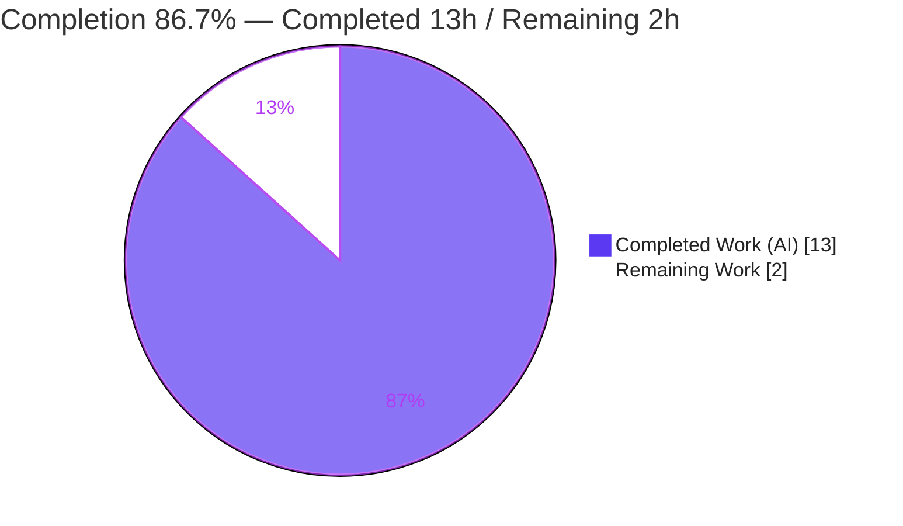
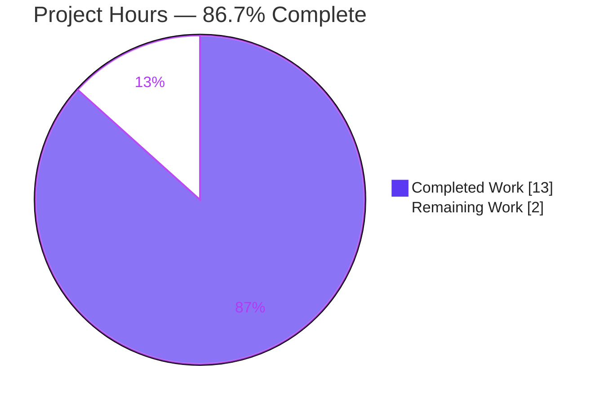
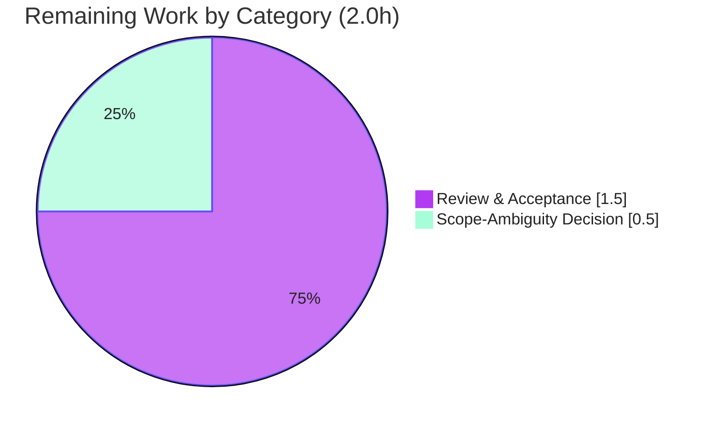

# Blitzy Project Guide — hao-backprop-test

> **Project:** `hao-backprop-test` (npm package `hello_world`, v1.0.0)
> **Branch:** `blitzy-c78fadc3-1afa-4210-a77f-762946afbe89` · **HEAD:** `b88a16b` · **Baseline:** `f4ba68e`
> **Engagement type:** Documentation-only static analysis (additive deliverables; zero source mutation)
> **Author of changes:** agent@blitzy.com · **Runtime:** Node.js v20.20.2

---

## 1. Executive Summary

### 1.1 Project Overview

The engagement performs a whole-repository static analysis of `hao-backprop-test` — a deliberately minimal, zero-dependency Node.js HTTP-server fixture (four baseline files, ~39 lines) used for backprop integration testing. It produces two additive Markdown deliverables: a **dead/unused-code report** (OBJ-1, from the user prompt) and a **risk-prioritized testing strategy** (OBJ-2, from rule "Add Testing Rule IW"). Both are analysis/documentation artifacts. The repository is governed by constraint **C-001** — the `README.md` "Do not touch!" directive — so all four baseline files (`server.js`, `package.json`, `package-lock.json`, `README.md`) must remain byte-identical. The business value is an evidence-backed maintainability and test-readiness assessment delivered without disturbing the protected fixture.

### 1.2 Completion Status



| Metric | Hours |
|--------|-------|
| **Total Hours** | **15.0** |
| **Completed Hours (AI + Manual)** | **13.0** (13.0 AI · 0.0 Manual) |
| **Remaining Hours** | **2.0** |
| **Percent Complete** | **86.7%** |

> Completion is computed per the AAP-scoped, hours-based PA1 methodology: `13.0 / (13.0 + 2.0) = 86.7%`. All AAP-specified deliverables are complete and validated; the remaining 2.0 hours are non-autonomous, path-to-production human activities (review/acceptance and a scope-confirmation decision).

### 1.3 Key Accomplishments

- ✅ **OBJ-1 delivered** — `docs/dead-code-analysis.md` (158 lines) covers all six prompt categories with file path / evidence / confidence / recommended action, a High/Medium/Low taxonomy, and an auditable 9-element reference-verification matrix. Headline: **zero removable dead code**.
- ✅ **OBJ-2 delivered** — `docs/testing-strategy.md` (307 lines) enumerates all five recommendation classes ranked P0→P2 by business impact × failure likelihood, each annotated with its constraint interaction.
- ✅ **Reference verification honored** — every symbol traced declaration→usage before any verdict; no element flagged unused without documented evidence.
- ✅ **Two real findings, honestly reported** — idiomatic `req` parameter (KEEP) and the dangling `package.json` `main: "index.js"` reference (report-only under C-001).
- ✅ **C-001 baseline integrity = 100%** — all four baseline files byte-identical to `f4ba68e`; net change is the two new docs only (+465 insertions).
- ✅ **Zero-dependency posture preserved** — `npm install` is a clean no-op; `npm audit` = 0 vulnerabilities (C-005/C-006).
- ✅ **End-to-end validation passed** — syntax, runtime contract, determinism, EADDRINUSE failure mode, and 6/6 ephemeral `node:test` recommendations all verified.
- ✅ **Accuracy fix applied** — an unverified quantified ECONNRESET claim in §3.3 was empirically disproven (~1,800 requests, zero resets) and corrected (commit `b88a16b`).

### 1.4 Critical Unresolved Issues

There are **no critical (release-blocking) issues**. The code compiles, runs, and is deterministic; both deliverables are complete and committed. One low-impact advisory decision is tracked:

| Issue | Impact | Owner | ETA |
|-------|--------|-------|-----|
| Scope interpretation: "recommended cleanup actions" could mean *report* (default) or *execute cleanup* | Low — default (analysis-only) is well-justified by the prompt's "provide a report" wording; executing cleanup would conflict with C-001 | Product owner / repo maintainer | < 0.5 h |

### 1.5 Access Issues

**No access issues identified.**

| System/Resource | Type of Access | Issue Description | Resolution Status | Owner |
|-----------------|----------------|-------------------|-------------------|-------|
| Git repository | Read/write on branch | None — branch checked out, commits succeed, working tree clean | ✅ No issue | — |
| npm registry | Dependency resolution | None — zero dependencies; `npm install` is an offline-capable no-op | ✅ No issue | — |
| Node.js runtime | Local execution | None — v20.20.2 present; server runs and binds loopback | ✅ No issue | — |

### 1.6 Recommended Next Steps

1. **[Medium]** Confirm the scope interpretation (analysis-only vs. authorize cleanup / lifting C-001). The default is analysis-only.
2. **[Medium]** Review `docs/dead-code-analysis.md` — spot-check the reference-verification matrix citations against `server.js`.
3. **[Medium]** Review `docs/testing-strategy.md` — confirm the five classes, P0→P2 ordering, and constraint annotations.
4. **[Medium]** Approve and merge the PR; re-confirm the four baseline files remain byte-identical post-merge.
5. **[Low]** *(Future, only if C-001 is ever lifted — separate engagement)* Wire `"test": "node --test"`, implement the P0/P1 recommended tests, and optionally repoint the dangling `main` field.

---

## 2. Project Hours Breakdown

### 2.1 Completed Work Detail

| Component | Hours | Description |
|-----------|-------|-------------|
| Repository discovery & symbol-level reference verification | 2.0 | Read all four baseline files; traced every symbol declaration→usage; built the 9-element reference-verification matrix; confirmed the empty dependency tree via the lockfile; extracted the C-001/C-005/C-006 constraints. [AAP: OBJ-1 reference verification] |
| `docs/dead-code-analysis.md` authoring (OBJ-1) | 3.0 | 158-line report: overview, methodology (incl. the ESLint `args:"after-used"` nuance), High/Medium/Low taxonomy, six-category findings table, auditable reference matrix, two detailed findings, summary. [AAP: OBJ-1] |
| `docs/testing-strategy.md` authoring (OBJ-2) | 4.0 | 307-line strategy: risk model (impact × likelihood), test-pyramid adaptation, six risk-ranked P0→P2 recommendations, three validated `node:test` code snippets, five-class cross-check, constraint-compatibility note, behavioral-invariant list. [AAP: OBJ-2] |
| Autonomous validation (5 gates) | 2.5 | Dependencies, compile/static (`node --check`, JSON validity, fence balance, embedded-snippet checks), tests (6/6 ephemeral `node:test`), runtime probe, and baseline-integrity hashing; plus 18 completeness checks per document. [Path-to-production] |
| Fix & correction cycles | 1.5 | Three commits: unreachable-code evidence correction (`cdadff5`), two factual-accuracy fixes (`242e91a`), and the ECONNRESET-claim correction backed by an ~1,800-request empirical investigation (`b88a16b`). [AAP: honest-result mandate] |
| **Total Completed** | **13.0** | All values trace to AAP deliverables or path-to-production validation. |

### 2.2 Remaining Work Detail

| Category | Hours | Priority |
|----------|-------|----------|
| Stakeholder review & acceptance of both deliverables (read 465 lines; spot-check evidence vs. `server.js`; approve & merge; re-verify baseline) | 1.5 | Medium |
| Resolve the analysis-only vs. execute-cleanup ambiguity (product/owner decision) | 0.5 | Medium |
| **Total Remaining** | **2.0** | — |

> **Out-of-scope (0 h charged):** Implementing committed tests, wiring the `test` script, or correcting the `main` field are all forbidden under C-001/C-005/C-006 and are listed only as future, separate-engagement possibilities. They are deliberately excluded from the hour totals.

### 2.3 Total & Reconciliation

| Check | Value | Status |
|-------|-------|--------|
| Section 2.1 completed sum | 13.0 h | ✅ matches §1.2 Completed |
| Section 2.2 remaining sum | 2.0 h | ✅ matches §1.2 Remaining and §7 pie "Remaining Work" |
| 2.1 + 2.2 | 15.0 h | ✅ equals §1.2 Total Hours |
| Completion % | 13.0 / 15.0 = 86.7% | ✅ used in §1.2, §7, §8 |

---

## 3. Test Results

All tests below originate from Blitzy's autonomous validation logs for this project and were independently reproduced during this assessment. The repository intentionally commits **no** test suite (the `npm test` script is the stock placeholder); the documented recommendations were implemented as an **ephemeral, zero-dependency `node:test` suite**, executed, and then removed — leaving the working tree clean.

**Functional tests (`node:test`, ephemeral)**

| Test Category | Framework | Total | Passed | Failed | Coverage % | Notes |
|---------------|-----------|-------|--------|--------|------------|-------|
| API scenario (P0) | `node:test` (built-in) | 1 | 1 | 0 | 100%¹ | `GET /` → `200` / `text/plain` / `Hello, World!\n` / 14 bytes |
| Edge-case determinism (P0) | `node:test` | 4 | 4 | 0 | n/a | POST / PUT / DELETE (2 KB body) / OPTIONS → identical response |
| Failure-mode (P1) | `node:test` | 1 | 1 | 0 | n/a | Second listener on `127.0.0.1:3000` → `EADDRINUSE` |
| **Total functional** | | **6** | **6** | **0** | — | **100% pass** |

**Static & structural validation**

| Check | Tool | Total | Passed | Failed | Notes |
|-------|------|-------|--------|--------|-------|
| Syntax / "compile" | `node --check server.js` | 1 | 1 | 0 | Exit 0 (the project's only compile step; no transpile) |
| Embedded snippet validity | `node --check` | 3 | 3 | 0 | All `node:test` examples in `testing-strategy.md` parse |
| Manifest/lockfile JSON validity | JSON parse | 2 | 2 | 0 | `package.json`, `package-lock.json` valid |
| Markdown structure / fence balance | structural | 2 | 2 | 0 | Both docs valid, balanced code fences |
| AAP completeness checks | checklist | 36 | 36 | 0 | 18 per document × 2 documents |

> ¹ **Coverage clarification:** Committed automated coverage is **0% by design** (no committed suite under C-001/C-005/C-006). When the documented recommendations are run via `node --test --experimental-test-coverage`, they exercise **100% of `server.js`'s single reachable code path** (the handler is branchless), as confirmed during validation.

---

## 4. Runtime Validation & UI Verification

**Runtime health** — independently reproduced on Node v20.20.2:

- ✅ **Operational** — `node server.js` starts cleanly; stdout is exactly `Server running at http://127.0.0.1:3000/`; stderr empty.
- ✅ **Operational** — `GET /` returns `200`, `Content-Type: text/plain`, body `Hello, World!\n` (exactly 14 bytes).
- ✅ **Operational** — Determinism: POST / PUT / DELETE (2 KB body) / OPTIONS against arbitrary paths all return the identical response.
- ✅ **Operational** — Binds exactly `127.0.0.1:3000` (verified LISTEN state); clean shutdown.
- ✅ **Operational** — Sole failure mode behaves as documented: a second instance fails with `Error: listen EADDRINUSE: address already in use 127.0.0.1:3000`.

**API integration**

- ✅ **Operational** — The externally observable HTTP response contract (the value the backprop consumer relies on) is verified end-to-end and matches the documented invariants C-002/C-003/C-004.

**UI verification**

- ➖ **Not applicable** — The system is a headless loopback HTTP endpoint returning `text/plain`; there is no UI surface to verify.

---

## 5. Compliance & Quality Review

Cross-mapping AAP deliverables and governing constraints to their validation status. Fixes applied during autonomous validation are noted inline.

| Benchmark / Requirement | Status | Progress | Evidence / Notes |
|--------------------------|--------|----------|------------------|
| OBJ-1 — all six dead-code categories covered | ✅ Pass | 100% | `dead-code-analysis.md` §4.1, §7 |
| OBJ-1 — report fields (path, evidence, confidence, action) | ✅ Pass | 100% | §4.1 table columns |
| OBJ-1 — confidence taxonomy (High/Med/Low) | ✅ Pass | 100% | §3 |
| OBJ-1 — references verified before flagging | ✅ Pass | 100% | §2.1 methodology + §4.2 matrix |
| OBJ-1 — two findings reported correctly | ✅ Pass | 100% | `req`→KEEP (§5); dangling `main`→report-only (§6) |
| OBJ-2 — all five recommendation classes | ✅ Pass | 100% | `testing-strategy.md` §3, §4 cross-check |
| OBJ-2 — risk-based prioritization (P0→P2) | ✅ Pass | 100% | §2 risk model, §3.1 summary table |
| OBJ-2 — per-recommendation constraint annotation | ✅ Pass | 100% | §3.1, §5 |
| C-001 — baseline byte-identical | ✅ Pass | 100% | All 4 blob hashes match `f4ba68e` |
| C-005 / C-006 — zero dependencies / no install | ✅ Pass | 100% | `npm install` no-op; no `node_modules`; 0 vulnerabilities |
| C-002 / C-003 / C-004 — behavioral invariants preserved | ✅ Pass | 100% | Runtime probe; `server.js` untouched |
| Honest-result mandate | ✅ Pass | 100% | True "zero removable dead code"; unverified ECONNRESET claim removed (`b88a16b`) |
| Zero-placeholder / production-ready docs | ✅ Pass | 100% | No TODO/stub/placeholder content; snippets are valid and labeled "recommended, not implemented" |
| Cross-references between deliverables | ✅ Pass | 100% | Each doc links the other |
| Scope-ambiguity flagged for confirmation | ⚠ Partial | Flagged | Default analysis-only; human confirmation outstanding (the 0.5 h remaining decision) |

---

## 6. Risk Assessment

| Risk | Category | Severity | Probability | Mitigation | Status |
|------|----------|----------|-------------|------------|--------|
| Dead-code false verdict (mis-flag used/unused) | Technical | Low | Low | Manual symbol-level verification + auditable 9-element matrix; tiny, branchless, export-less module makes verification exhaustive | Mitigated |
| Documentation drift (line citations stale if baseline edited) | Technical | Low | Low | C-001 freezes the baseline; docs cite exact line numbers | Accepted |
| 0% committed automated coverage | Technical | Low | N/A | Intentional under C-001/C-005/C-006; zero-dependency test path documented; 6/6 ephemeral tests pass | Accepted (by design) |
| No authentication / input validation on server | Security | Low | Low | Loopback-only `127.0.0.1`, static text, branchless, no request parsing; docs add zero runtime footprint | Mitigated (N/A to fixture) |
| Vulnerable dependencies | Security | None | None | Zero dependencies; `npm audit` = 0 vulnerabilities | Mitigated |
| `EADDRINUSE` is the sole, unhandled failure mode | Operational | Low | Low | Documented in `testing-strategy.md` §3.5; intentional fixture trait | Documented / Accepted |
| No monitoring / health-check endpoint | Operational | Low | N/A | Startup log line is the readiness signal; out of AAP scope | Accepted |
| `package.json` `main: "index.js"` dangling reference | Operational | Low | Low | Reported in `dead-code-analysis.md` §6; unfixable under C-001; runtime uses `node server.js` | Reported / Accepted |
| External backprop consumer depends on exact response contract | Integration | Medium | Low | Contract pinned by C-002/C-003/C-004, frozen by C-001, documented as the P0 test target | Mitigated by immutability |
| Analysis-only vs. execute-cleanup ambiguity | Integration | Low | Medium | Flagged in both docs; defaulted to analysis-only per the prompt's "provide a report"; needs human confirmation | Open (human decision) |
| No CI/CD or deployment automation | Integration | Low | N/A | Documentation deliverable — nothing to deploy; out of scope | Accepted |

**Overall risk posture: LOW.** The only genuinely open item is the scope ambiguity, which is low-impact and already captured as the 0.5 h remaining decision.

---

## 7. Visual Project Status

**Project hours breakdown** (Completed = Dark Blue `#5B39F3`, Remaining = White `#FFFFFF`):



**Remaining hours by category** (from Section 2.2; sums to the 2.0 h remaining):



> **Integrity check:** "Remaining Work" = **2.0 h** in the pie above equals the Section 1.2 Remaining Hours and the Section 2.2 total. Priority distribution of remaining work: 100% Medium, 0% High (no blocking tasks), with optional Low-priority future items excluded from totals.

---

## 8. Summary & Recommendations

**Achievements.** Both AAP objectives are fully delivered as additive documentation. `docs/dead-code-analysis.md` answers OBJ-1 with an evidence-backed, reference-verified report concluding **zero removable dead code**, surfacing the two real, non-removable observations honestly. `docs/testing-strategy.md` answers OBJ-2 with a risk-ranked (P0→P2), zero-dependency-feasible testing strategy spanning all five mandated classes. Throughout, the protected baseline remained byte-identical to `f4ba68e`, and the zero-dependency posture and behavioral invariants were preserved and verified.

**Remaining gaps.** No autonomous AAP work remains. The outstanding 2.0 hours are human-only, path-to-production activities: stakeholder review/acceptance (1.5 h) and a scope-confirmation decision (0.5 h). Neither is blocking; neither can be performed autonomously under C-001.

**Critical path to production.** Confirm scope interpretation → review both documents → approve & merge → re-verify baseline integrity. There is no build, deploy, or dependency step to manage.

**Success metrics (all met).** 100% C-001 baseline integrity; zero dependencies / zero vulnerabilities; `node --check` and runtime contract pass; 6/6 documented test recommendations pass; 36/36 completeness checks pass; one accuracy defect found and fixed.

**Production-readiness assessment.** The deliverables are **production-ready** at **86.7% overall completion** (13.0 of 15.0 hours). The residual 13.3% is human review and a low-impact decision — not engineering work. Recommendation: **accept and merge** after the brief review, treating the analysis-only interpretation as confirmed unless the owner explicitly authorizes a separate, C-001-lifting cleanup engagement.

---

## 9. Development Guide

All commands below were tested on **Node.js v20.20.2 / Windows PowerShell** against this repository, with the working tree remaining clean and no baseline file modified.

### 9.1 System Prerequisites

- **Node.js ≥ 20** (verified on v20.20.2). The strategy's recommended test path uses built-ins (`node:test`, `node:assert`, global `fetch`, `--experimental-test-coverage`) available in Node ≥ 20. `package.json` declares no `engines` field, so any modern Node ≥ 20 is suitable.
- **npm** (bundled; verified 10.8.2) — optional, only for the no-op install.
- **OS/hardware:** none specific — a loopback HTTP fixture with no external services, database, or build step.

### 9.2 Environment Setup

- No environment variables are required. Host (`127.0.0.1`) and port (`3000`) are hard-coded in `server.js` (constraints C-002/C-003).
- No `.env` file, no external services, no database, no message queue.

```bash
# Check out the branch and enter the repo
git checkout blitzy-c78fadc3-1afa-4210-a77f-762946afbe89
cd hao-backprop-test
```

### 9.3 Dependency Installation

```bash
# Optional — the project has zero dependencies; this is a clean no-op.
npm install
# Expected: "up to date, audited 1 package ..." / "found 0 vulnerabilities"
# No node_modules directory is created. The project runs WITHOUT install (C-006).
```

### 9.4 Application Startup

```bash
# Canonical launch. There is NO "start" script, and the package.json "main"
# field points to a non-existent index.js — always launch via server.js.
node server.js
# Expected stdout: Server running at http://127.0.0.1:3000/
```

```powershell
# Windows PowerShell: run in the background and capture the PID you spawned
$p = Start-Process -FilePath node -ArgumentList "server.js" -PassThru -NoNewWindow
# ... later, stop ONLY that process:
Stop-Process -Id $p.Id -Force
```

### 9.5 Verification Steps

```bash
# 1) Syntax/"compile" check (the only build step; no transpile)
node --check server.js          # exit 0, no output = success

# 2) Probe the running server (curl)
curl -i http://127.0.0.1:3000/
# Expected: HTTP/1.1 200 OK · Content-Type: text/plain · body "Hello, World!\n" (14 bytes)
```

```powershell
# PowerShell equivalent probe
$r = Invoke-WebRequest -Uri http://127.0.0.1:3000/ -UseBasicParsing
$r.StatusCode                                   # 200
$r.Headers['Content-Type']                      # text/plain
[Text.Encoding]::UTF8.GetByteCount($r.Content)  # 14
```

### 9.6 Example Usage

```bash
# Every method/path/body returns the identical response (branchless handler)
curl -X POST --data "anything" http://127.0.0.1:3000/any/path
# => Hello, World!

# Recommended (NOT committed) zero-dependency test path:
#   author a node:test file, then run:
node --test
node --test --experimental-test-coverage   # adds a built-in coverage report
```

### 9.7 Troubleshooting

- **`Error: listen EADDRINUSE: address already in use 127.0.0.1:3000`** — Port 3000 is occupied (this is the server's only failure mode; it has no error handler). Stop the process holding the port, then restart. On Windows: `Get-NetTCPConnection -LocalPort 3000 -State Listen`.
- **`npm test` prints "Error: no test specified" and exits 1** — Expected. This is the stock npm placeholder, intentionally left in place under C-001. It is not a failure. Use the `node --test` path above instead.
- **`main: "index.js"` looks wrong** — It is a known, reported dangling reference (`dead-code-analysis.md` §6); it does not affect runtime. Always launch with `node server.js`.
- **`npm install` seems to do nothing** — Correct; the project has zero dependencies and is designed to run without an install step.

---

## 10. Appendices

### A. Command Reference

| Command | Purpose | Expected Result |
|---------|---------|-----------------|
| `node --version` | Confirm runtime | `v20.20.2` (any ≥ 20 acceptable) |
| `npm install` | Dependency install (optional) | No-op; "found 0 vulnerabilities"; no `node_modules` |
| `node --check server.js` | Syntax/"compile" check | Exit 0, no output |
| `node server.js` | Start the server | `Server running at http://127.0.0.1:3000/` |
| `npm test` | Placeholder script | Prints "Error: no test specified"; exit 1 (by design) |
| `node --test` | Recommended test runner (zero-dep) | Runs any authored `node:test` files |
| `node --test --experimental-test-coverage` | Tests + built-in coverage | TAP output + coverage table |
| `curl -i http://127.0.0.1:3000/` | Probe the contract | `200` / `text/plain` / `Hello, World!\n` |

### B. Port Reference

| Port | Bind Address | Purpose | Configurable? |
|------|--------------|---------|---------------|
| 3000 | 127.0.0.1 (loopback only) | HTTP server | No — hard-coded in `server.js` (C-003); changing it would edit a protected file |

### C. Key File Locations

| Path | Role | Status |
|------|------|--------|
| `server.js` | Sole runtime executable (14 lines) | Baseline — REFERENCE (immutable, C-001) |
| `package.json` | npm manifest | Baseline — REFERENCE (immutable) |
| `package-lock.json` | Lockfile v3 (empty dependency tree) | Baseline — REFERENCE (immutable) |
| `README.md` | Title + "Do not touch!" governance directive | Baseline — REFERENCE (immutable) |
| `docs/dead-code-analysis.md` | OBJ-1 deliverable (158 lines) | **New — created** |
| `docs/testing-strategy.md` | OBJ-2 deliverable (307 lines) | **New — created** |

### D. Technology Versions

| Technology | Version | Notes |
|------------|---------|-------|
| Node.js | v20.20.2 | Provides `http`, `node:test`, `node:assert`, global `fetch` |
| npm | 10.8.2 | Bundled with Node 20 |
| Runtime dependencies | 0 | None declared or locked |
| Dev dependencies | 0 | None declared or locked |
| package-lock | lockfile v3 | Single root `""` entry |

### E. Environment Variable Reference

| Variable | Required | Default | Notes |
|----------|----------|---------|-------|
| *(none)* | — | — | The application reads no environment variables; host and port are hard-coded |

### F. Developer Tools Guide

| Tool | Use | Constraint Interaction |
|------|-----|------------------------|
| `node --check` | Syntax validation | Built-in; zero dependency |
| `node:test` + `node:assert` | Recommended test framework | Built-in; honors C-005/C-006 (no install) |
| `--experimental-test-coverage` | Coverage measurement | Built-in; `c8`/`nyc`/Jest are excluded by C-005 |
| ESLint `no-unused-vars` / `no-unreachable` | Optional dead-code corroboration | Not run — would require an install (C-005); manual verification used instead |
| `git hash-object` / `git rev-parse` | Baseline-integrity verification | Confirms the four baseline files match `f4ba68e` |

### G. Glossary

| Term | Definition |
|------|------------|
| **AAP** | Agent Action Plan — the governing specification for this engagement |
| **OBJ-1 / OBJ-2** | The two co-equal objectives: dead-code report / testing strategy |
| **C-001** | Source-immutability constraint from the `README.md` "Do not touch!" directive |
| **C-005 / C-006** | Zero-dependency / no-install-step constraints |
| **C-002 / C-003 / C-004** | Behavioral invariants: host `127.0.0.1`, port `3000`, response body `Hello, World!\n` |
| **Branchless handler** | A request handler with no conditional paths — produces a deterministic response |
| **Dangling reference** | A manifest field (`main: "index.js"`) pointing at a non-existent file |
| **P0 / P1 / P2** | Test priority bands by business impact × failure likelihood (P0 highest) |
| **EADDRINUSE** | OS error when binding an already-occupied port — the server's sole failure mode |
