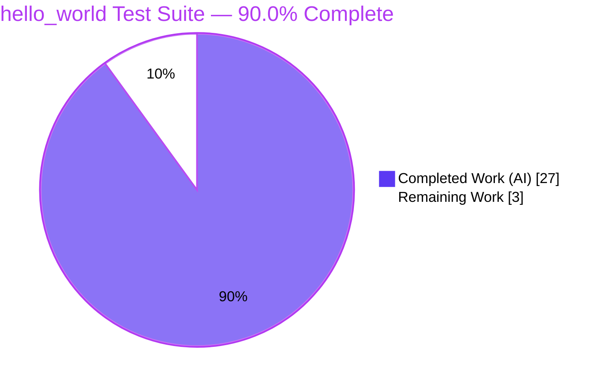
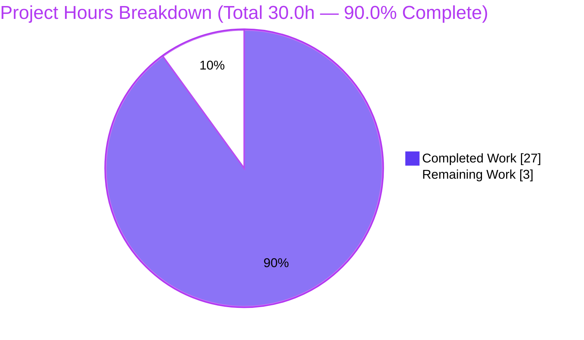
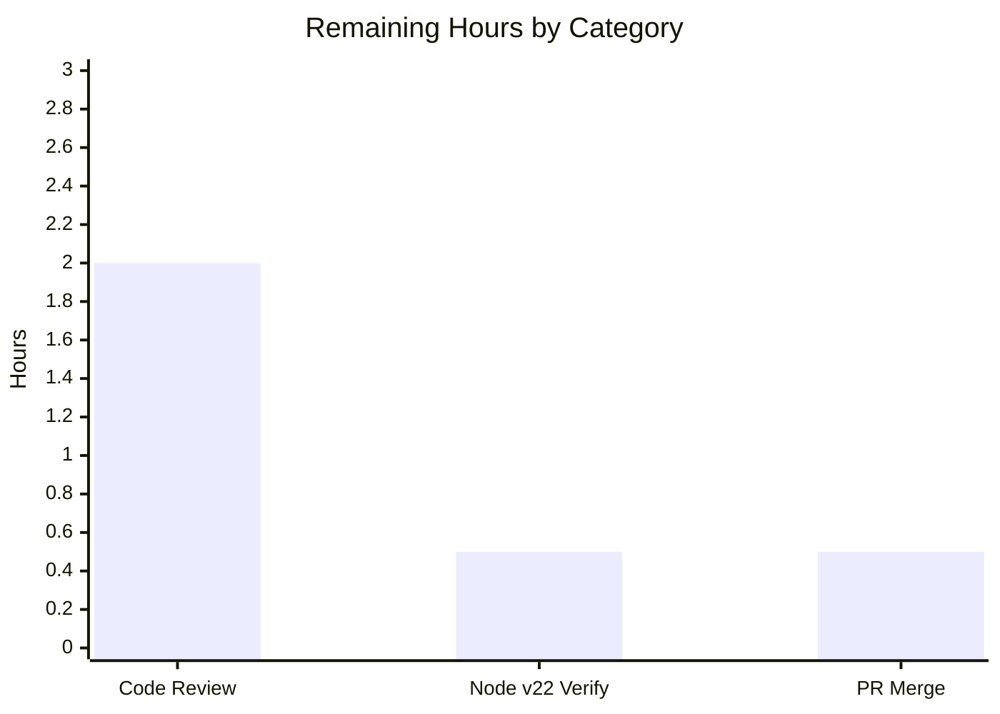

# Blitzy Project Guide — hello_world Test Suite

> **Engagement:** Greenfield automated test suite for `server.js` (Jest + supertest)
> **Branch:** `blitzy-12d03d26-2843-485b-81c7-0a98f23d9e28`  •  **HEAD:** `995a62a`
> **Status:** ✅ Production-ready (autonomous scope complete) — pending human review & merge

---

## 1. Executive Summary

### 1.1 Project Overview

`hello_world` is a single-module Node.js fixture whose `server.js` is a 14-line HTTP server that binds `127.0.0.1:3000` and answers every request with `200`, `Content-Type: text/plain`, and the body `Hello, World!\n`. This engagement introduced the project's **first automated test suite** — it previously had zero tests, no runner, and a placeholder `test` script. The technical scope was to author a comprehensive Jest + supertest suite verifying the server's externally observable behavioral contract (responses, status codes, headers, startup/shutdown lifecycle, error handling, and edge cases) **while leaving `server.js` byte-for-byte unchanged**. The business impact is a strict 0% → 100% coverage improvement and a durable regression guard for any future change to the fixture.

### 1.2 Completion Status



| Metric | Value |
|--------|-------|
| **Total Hours** | 30.0 |
| **Completed Hours (AI + Manual)** | 27.0 (27.0 AI + 0.0 Manual) |
| **Remaining Hours** | 3.0 |
| **Percent Complete** | **90.0%** |

> Completion is computed strictly over AAP-scoped work plus standard path-to-production activities: `27.0 / 30.0 = 90.0%`. Every AAP-specified deliverable is 100% complete; the remaining 10% is the human review-and-merge gate an autonomous agent cannot self-approve.

### 1.3 Key Accomplishments

- ✅ **32 automated tests** across 2 suites — **32/32 passing**, deterministic across multiple runs (`npm test`).
- ✅ **100% coverage** of `server.js` (statements, branches, functions, lines), enforced by a `coverageThreshold` gate (0% → 100%).
- ✅ **Hybrid test architecture** implemented: in-process `require()` contract suite (for coverage) + black-box child-process spawn lifecycle suite (for real startup/shutdown).
- ✅ **Custom Jest sequencer** orders the lifecycle suite before the contract suite, eliminating port-3000 contention; serialized execution (`--runInBand`, `maxWorkers: 1`).
- ✅ **Reusable harness** (`server-harness.js`) built on Node core only — spawn + stdout readiness detection, idempotent teardown, TCP port probes, and an `agent: false` HTTP client.
- ✅ **Source immutability preserved (C-001):** `server.js` and `README.md` byte-identical; `package.json` changes strictly additive.
- ✅ **Zero dependency vulnerabilities** (`npm audit`), with `jest@30.4.2` + `supertest@7.2.2` pinned and a proactive `js-yaml@4.2.0` override.
- ✅ **All 5 mandated test classes** delivered (unit, integration, API, edge-case, coverage-improvement) plus error handling (`EADDRINUSE`).

### 1.4 Critical Unresolved Issues

| Issue | Impact | Owner | ETA |
|-------|--------|-------|-----|
| _None_ — no defects, no failing tests, no compilation/runtime errors. | None — autonomous validation found zero blocking issues. | — | — |

> There are **no critical unresolved issues**. The two items below are non-blocking and documented for completeness only: (a) `package.json` `"main": "index.js"` is a dangling reference (report-only, out of scope per C-001); (b) tests were validated on Node v20.20.2 while the AAP referenced v22.x — a recommended verification, not a defect (both versions are supported by the stack).

### 1.5 Access Issues

| System/Resource | Type of Access | Issue Description | Resolution Status | Owner |
|-----------------|----------------|-------------------|-------------------|-------|
| _None_ | — | No access issues identified. The repository, branch, runtime (Node/npm), and npm registry dependencies were all accessible; tests require no external services, credentials, databases, or network resources. | N/A | — |

**No access issues identified.**

### 1.6 Recommended Next Steps

1. **[High]** Perform human code review & sign-off of the autonomously generated test suite (8 files, ~804 lines); independently run `npm install && npm test && npm run test:coverage` to confirm 32/32 pass and 100% coverage.
2. **[Medium]** Run a one-time runtime-parity check on the AAP-target **Node v22.x** (validation ran on v20.20.2; both are supported by Jest 30.4.2 + supertest 7.2.2).
3. **[Low]** Approve the PR, merge `blitzy-12d03d26-2843-485b-81c7-0a98f23d9e28` into the target branch, and delete the feature branch.
4. **[Low]** _(Optional, out of AAP scope)_ Add a CI workflow running `npm ci && npm test` on push/PR to catch future regressions.
5. **[Low]** _(Optional, report-only)_ Resolve the dangling `package.json` `"main": "index.js"` reference if the package is ever published or imported.

---

## 2. Project Hours Breakdown

### 2.1 Completed Work Detail

| Component | Hours | Description |
|-----------|------:|-------------|
| Test framework selection & version research | 2.0 | Jest-vs-Mocha evaluation; Node compatibility validation; npm-registry version check; proof-of-concept install/run (maps to AAP R1). |
| Jest configuration — `jest.config.js` | 1.5 | `testEnvironment: node`, `collectCoverageFrom: ['server.js']`, `coverageThreshold` global 100, `forceExit`, `maxWorkers: 1`, custom `testSequencer` registration (R2). |
| Dependency manifests — `package.json` + `package-lock.json` | 1.5 | Additive devDeps (`jest@30.4.2`, `supertest@7.2.2`), `test`/`test:coverage` scripts, lockfile regeneration, proactive `js-yaml@4.2.0` security override (R3, R4). |
| Repository housekeeping — `.gitignore` | 0.5 | Ignore `node_modules/` and `coverage/` (R5). |
| Shared constants — `test/helpers/constants.js` | 1.0 | Single source of truth: `HOST`, `PORT`, `EXPECTED_BODY`, `EXPECTED_BYTES`, `CONTENT_TYPE`, `READY_LOG`, `SERVER_PATH` (R6). |
| Black-box harness — `test/helpers/server-harness.js` | 5.0 | 234-line Node-core harness: `startServer` (spawn + stdout readiness), `stopServer` (idempotent SIGTERM + await exit), `waitForPort`, `isPortFree`, `httpRequest` (`agent: false`) (R7). |
| Custom test sequencer — `test/testSequencer.js` | 2.0 | Extends `@jest/test-sequencer`; orders `lifecycle` → `contract` with deterministic tie-break to prevent port-3000 contention (R8). |
| In-process contract suite — `test/server.contract.test.js` | 7.0 | 282 lines / 29 tests: full contract, standard headers, 5 verbs + HEAD, 8 extension methods, 3 unsupported tokens (→400 boundary), 3 paths, 3 bodies, statelessness, in-process `EADDRINUSE` (R9). |
| Black-box lifecycle suite — `test/server.lifecycle.test.js` | 3.0 | 140 lines / 3 tests: startup bind+serve+readiness-log-once, SIGTERM termination + port release, `EADDRINUSE` (R10). |
| Coverage to 100% + determinism validation | 2.0 | Achieved & gated 100% coverage; verified determinism across repeated runs; full-suite debug. |
| QA edge-case remediation (Issue 1) | 1.5 | Arbitrary/custom HTTP method coverage; discovery/documentation of Node llhttp protocol-level 400 boundary. |
| **Total Completed** | **27.0** | All work performed autonomously by Blitzy agents (0.0 manual hours required). |

### 2.2 Remaining Work Detail

| Category | Hours | Priority |
|----------|------:|----------|
| Human code review & sign-off of the test suite (8 files / ~804 lines; re-run install/test/coverage) | 2.0 | High |
| Runtime parity verification on Node v22.x (validated on v20.20.2; confirm 32/32 + 100% on v22) | 0.5 | Medium |
| PR approval, merge to target branch & feature-branch cleanup | 0.5 | Low |
| **Total Remaining** | **3.0** | — |

### 2.3 Hours Reconciliation

| Bucket | Hours |
|--------|------:|
| Completed (Section 2.1) | 27.0 |
| Remaining (Section 2.2) | 3.0 |
| **Total Project Hours** | **30.0** |
| **Percent Complete** | 27.0 / 30.0 = **90.0%** |

> _Out-of-scope items intentionally excluded from the hours universe (per AAP 0.8.2): `server.js`/`README.md` edits, `index.js` creation, `docs/*` edits, runtime dependencies, CI/CD, and containerization._

---

## 3. Test Results

All results below originate from Blitzy's autonomous validation runs and were independently re-verified for this guide (`npm test` and `npm run test:coverage`).

| Test Category | Framework | Total Tests | Passed | Failed | Coverage % | Notes |
|---------------|-----------|------------:|-------:|-------:|-----------:|-------|
| Unit / API Contract (in-process) | Jest 30.4.2 + supertest 7.2.2 | 3 | 3 | 0 | 100% (server.js) | `GET /` status+headers+body (14 bytes); standard `Date`/`Connection` headers; readiness log emitted once. |
| Edge Cases & Determinism (in-process) | Jest + supertest + `node:http` | 25 | 25 | 0 | 100% (server.js) | 5 verbs + HEAD; 8 extension methods (M-SEARCH/PROPFIND/MKCOL/REPORT/PURGE/NOTIFY/SEARCH/MKCALENDAR) → 200; 3 unsupported tokens (BREW/FOO/CUSTOM) → protocol-level 400; 3 paths; 3 bodies (empty/~1MB/JSON); 5 sequential + 10 concurrent. |
| Error Handling — `EADDRINUSE` (in-process) | Jest + `node:net` | 1 | 1 | 0 | 100% (server.js) | Second listener on the occupied port fails with `EADDRINUSE`. |
| Integration / Lifecycle (black-box spawn) | Jest + `node:child_process` + `node:net` | 2 | 2 | 0 | n/a (out-of-process) | Spawned `node server.js` binds + serves + logs readiness once; SIGTERM terminates and releases port 3000 (re-bindable). |
| Error Handling — `EADDRINUSE` (black-box) | Jest + `node:http` | 1 | 1 | 0 | n/a (out-of-process) | While the spawned server holds port 3000, a second listener fails with `EADDRINUSE`. |
| **TOTAL** | **Jest 30.4.2** | **32** | **32** | **0** | **100% (server.js)** | 2 suites; deterministic across multiple runs; `coverageThreshold` gate exits 0. |

**Coverage detail (`npm run test:coverage`):**

| File | % Stmts | % Branch | % Funcs | % Lines | Uncovered |
|------|--------:|---------:|--------:|--------:|-----------|
| `server.js` | 100 | 100 | 100 | 100 | — |
| **All files** | **100** | **100** | **100** | **100** | — |

---

## 4. Runtime Validation & UI Verification

**Runtime health** (verified by launching `node server.js` and issuing live HTTP requests):

- ✅ **Operational** — Server starts and logs exactly `Server running at http://127.0.0.1:3000/`.
- ✅ **Operational** — `GET /` returns `200`, `Content-Type: text/plain`, body `Hello, World!\n` (exactly **14 bytes**).
- ✅ **Operational** — Contract is identical across methods (GET/POST/PUT/DELETE/PATCH/OPTIONS + extension methods), arbitrary/encoded/deep paths, query strings, and empty/large/JSON bodies (statelessness confirmed).
- ✅ **Operational** — Graceful shutdown: SIGTERM terminates the process and **releases port 3000** (verified free afterward; a fresh listener can re-bind).
- ✅ **Operational** — Error path: a second listener on the occupied port deterministically raises `EADDRINUSE`.
- ✅ **Operational** — Dependency install is clean and idempotent (`npm install` → up to date, **0 vulnerabilities**); all 7 JS files pass `node --check`.

**API integration outcomes:**

- ✅ **Operational** — supertest drives the in-process server over loopback HTTP; the raw `node:http` client (`agent: false`) exercises non-standard method tokens a client like `curl` would send.
- ✅ **Operational** — Documented protocol boundary: unsupported method tokens are rejected by Node's llhttp parser with a `400` **before** the handler runs (a Node runtime behavior, not a `server.js` defect).

**UI verification:**

- ⚠ **Not applicable** — `server.js` is a headless HTTP server with no web UI, frontend assets, or rendered pages. There is no user interface to verify; runtime validation is exercised entirely at the HTTP layer above.

---

## 5. Compliance & Quality Review

Cross-mapping of AAP deliverables and constraints to quality/compliance benchmarks. "Fix applied" denotes work performed during autonomous validation.

| Deliverable / Benchmark | Requirement (AAP) | Status | Evidence / Notes |
|-------------------------|-------------------|--------|------------------|
| `jest.config.js` | Node env, coverage from `server.js`, 100% threshold, forceExit, serial, sequencer | ✅ Pass | Matches spec exactly; coverage gate exits 0. |
| `test/testSequencer.js` | Order lifecycle before contract | ✅ Pass | `npx jest --listTests` confirms order. |
| `test/helpers/constants.js` | Shared contract constants | ✅ Pass | 7 exports mirror `server.js` values. |
| `test/helpers/server-harness.js` | Spawn/readiness/stop/port/HTTP helpers | ✅ Pass | Node-core only; sockets/children cleaned up. |
| `test/server.contract.test.js` | In-process contract + edge cases | ✅ Pass | 29 tests; full-contract assertion density. |
| `test/server.lifecycle.test.js` | Black-box startup/shutdown + `EADDRINUSE` | ✅ Pass | 3 tests; per-test port release. |
| `package.json` (additive) | devDeps + `test`/`test:coverage` scripts | ✅ Pass | Placeholder script replaced; deps pinned. |
| `package-lock.json` | Regenerated by `npm install` | ✅ Pass | lockfileVersion 3, in sync. |
| `.gitignore` | Ignore `node_modules/`, `coverage/` | ✅ Pass | Present. |
| 5 mandated test classes | Unit / Integration / API / Edge / Coverage | ✅ Pass | All present, prioritized P0→P2. |
| Coverage target | 100% statements/functions/lines | ✅ Pass | 100% across all metrics. |
| **C-001 source immutability** | `server.js` + `README.md` byte-identical | ✅ Pass | Confirmed unchanged since original upload. |
| Repository conventions | CommonJS, 2-space, single-quote, `const`, arrow fns | ✅ Pass | Mirrored in all test code. |
| Test isolation/determinism | Serial, `agent: false`, explicit teardown | ✅ Pass | Deterministic across multiple runs. |
| Dependency security | No known vulnerabilities | ✅ Pass | **Fix applied:** proactive `js-yaml@4.2.0` override → `npm audit` 0 vulnerabilities. |
| Static/syntax validation | Source parses cleanly | ✅ Pass | `node --check` 7/7 JS files. |
| `package.json` `"main"` | Dangling `index.js` reference | ⚠ Observation | Report-only / out of scope (C-001); non-blocking. |
| Runtime parity | AAP referenced Node v22.x | ⚠ Outstanding | Validated on v20.20.2 (supported); v22 confirmation recommended (Section 2.2). |

**Outstanding compliance items:** none blocking. The two ⚠ rows are non-blocking (one report-only by design, one a recommended verification).

---

## 6. Risk Assessment

| Risk | Category | Severity | Probability | Mitigation | Status |
|------|----------|----------|-------------|------------|--------|
| Hardcoded port 3000 contention — both suites fail with `EADDRINUSE` if 3000 is already bound; port is not overridable (`server.js` immutable) | Technical | Medium | Low | Custom sequencer (lifecycle→contract); serial execution; per-test child teardown in `finally`; TCP port probes | Mitigated |
| `forceExit: true` could mask unrelated async open handles (required because `server.js` never `.close()`s) | Technical | Low | Low | Harness destroys every probe socket and SIGTERM-kills every child; no leak symptoms across repeated runs | Mitigated |
| Runtime version drift — validated on Node v20.20.2, AAP referenced v22.x; no `engines`/`.nvmrc` pin | Technical | Low | Low | Jest 30.4.2 + supertest 7.2.2 declare Node 22 support; one-time v22 confirmation scheduled (Section 2.2) | Open (low) |
| `server.js` exposes no `module.exports` — prevents true isolated unit testing | Technical | Low | N/A | Hybrid in-process + black-box strategy reaches 100% coverage without a source change; documented | Accepted (by design) |
| Dev-dependency supply chain — Jest pulls ~333 transitive packages; CVEs can emerge over time | Security | Low | Low | `npm audit` 0 vulnerabilities now; `js-yaml@4.2.0` override; exact pins; `node_modules` gitignored; periodic audit advised | Mitigated |
| No production attack surface — loopback-only, no auth/secrets/data; tests add no runtime surface | Security | Negligible | N/A | Nothing to secure; stateless static responder on `127.0.0.1` | N/A |
| No CI/CD wiring — tests are not run by any pipeline, so future regressions aren't auto-caught | Operational | Low | Medium (over time) | Out of AAP scope; recommended future enhancement (GitHub Actions `npm ci && npm test`) | Deferred (out of scope) |
| Fresh-clone setup — `node_modules` gitignored, so `npm install` must precede `npm test` | Integration | Low | Low | Documented prominently in the Development Guide (Section 9); standard Node workflow | Mitigated |

**Overall risk posture: LOW.** No High/Critical risks; nothing blocks release. The most material items (port contention, runtime parity) are already mitigated or covered by the 3.0h of remaining path-to-production work. Zero security vulnerabilities at present.

---

## 7. Visual Project Status

**Project hours — completed vs remaining** (Completed = Dark Blue `#5B39F3`, Remaining = White `#FFFFFF`):



**Remaining work by category** (hours, from Section 2.2 — sums to 3.0h):



| Category | Hours | Priority | % of Remaining |
|----------|------:|----------|---------------:|
| Human code review & sign-off | 2.0 | High | 66.7% |
| Node v22.x parity verification | 0.5 | Medium | 16.7% |
| PR approval, merge & cleanup | 0.5 | Low | 16.7% |
| **Total Remaining** | **3.0** | — | 100% |

> Integrity: pie "Remaining Work" (3) = Section 1.2 Remaining Hours (3.0) = Section 2.2 total (3.0). Pie "Completed Work" (27) = Section 1.2 Completed Hours (27.0) = Section 2.1 total (27.0).

---

## 8. Summary & Recommendations

**Achievements.** This engagement delivered the project's first automated test suite from a zero-coverage baseline: **32 passing tests across 2 suites with 100% coverage** of `server.js`, enforced by a coverage-threshold gate. A hybrid in-process + black-box architecture, a reusable Node-core harness, and a custom test sequencer together verify the complete behavioral contract, the real process lifecycle, edge cases, and the `EADDRINUSE` error path — all while keeping `server.js` byte-identical (constraint C-001) and adding zero runtime dependencies.

**Remaining gaps & critical path to production.** The project is **90.0% complete** (27.0 of 30.0 hours). The remaining 3.0 hours is entirely the human-in-the-loop gate: (1) code review & sign-off of the ~804-line suite, (2) a runtime-parity confirmation on Node v22.x, and (3) PR approval & merge. None of these are engineering defects; they are the standard path-to-production steps an autonomous agent cannot complete on its own behalf.

**Success metrics.**

| Metric | Target | Actual | Status |
|--------|--------|--------|--------|
| Tests passing | All | 32 / 32 | ✅ |
| `server.js` coverage | 100% | 100% | ✅ |
| Source immutability (C-001) | Byte-identical | Byte-identical | ✅ |
| Dependency vulnerabilities | 0 | 0 | ✅ |
| Mandated test classes | 5 | 5 (+ error handling) | ✅ |
| Completion (AAP-scoped) | — | 90.0% | ◐ pending human review |

**Production readiness.** The autonomous deliverables are **production-ready as committed** — clean install, 100% green tests, 100% coverage, validated runtime, and zero outstanding errors. Recommended sequence: human review & sign-off → Node v22 parity check → merge. Optionally, wire CI (`npm ci && npm test`) to guard against future regressions.

---

## 9. Development Guide

All commands below were executed and verified on this environment (Node **v20.20.2**, npm **10.8.2**, Windows). Run every command **from the repository root** (relative `require('../server.js')` and `collectCoverageFrom: ['server.js']` resolve from there).

### 9.1 System Prerequisites

- **Node.js** — v20.x verified; **v22.x is the AAP target** (both supported by the stack). Confirm with:
  ```bash
  node --version
  npm --version
  ```
- **No** environment variables, services, databases, or secrets are required.
- **Git** (to clone). Nothing else beyond Node + npm.

### 9.2 Environment Setup

```bash
# Clone and enter the repository
git clone <repository-url>
cd hello_world   # repository root — all commands run from here
```

There is nothing to configure: the server uses a hardcoded host/port (`127.0.0.1:3000`) and the tests need no env files.

### 9.3 Dependency Installation

```bash
# Installs jest@30.4.2, supertest@7.2.2 and ~333 transitive packages.
# node_modules/ is gitignored, so this is REQUIRED after a fresh clone.
npm install
# Expected tail: "found 0 vulnerabilities"

# Deterministic, CI-equivalent install (installs exactly from package-lock.json):
npm ci
```

### 9.4 Running the Test Suite

```bash
# Full suite (resolves to: jest --runInBand)
npm test
# Expected: "Test Suites: 2 passed, 2 total"  /  "Tests: 32 passed, 32 total"

# With coverage (resolves to: jest --coverage --runInBand)
npm run test:coverage
# Expected: server.js + All files 100% Stmts/Branch/Funcs/Lines; exit 0

# Confirm suite ordering (lifecycle must list BEFORE contract)
npx jest --listTests

# Run a single test by name
npx jest test/server.contract.test.js -t "GET / returns 200"

# Debug
node --inspect-brk node_modules/.bin/jest --runInBand
```

> **Do not use `--watch` in automation** — it hangs non-interactively. The configured scripts use `--runInBand` and never watch.

### 9.5 Running the Server

```bash
# Start the server (foreground)
node server.js
# Logs exactly: Server running at http://127.0.0.1:3000/
```

In another terminal:

```bash
# Verify the contract over live HTTP
curl -i http://127.0.0.1:3000/
# HTTP/1.1 200 OK
# Content-Type: text/plain
# (body) Hello, World!

# PowerShell equivalent
# Invoke-WebRequest -Uri http://127.0.0.1:3000/ -UseBasicParsing
```

Stop the server with **Ctrl+C**, or send SIGTERM to the `node` PID. The process exits cleanly and **releases port 3000**.

### 9.6 Verification Checklist

- `node --version` prints a v20.x (or v22.x) version.
- `npm install` ends with `found 0 vulnerabilities`.
- `npm test` → `2 passed` suites, `32 passed` tests, exit 0.
- `npm run test:coverage` → `server.js` 100% across all metrics, exit 0.
- `node server.js` prints the readiness line; `GET /` returns `200` + `text/plain` + `Hello, World!\n` (14 bytes).

### 9.7 Troubleshooting

| Symptom | Cause | Resolution |
|---------|-------|------------|
| `Cannot find module 'jest'` / `'supertest'` / `'../server.js'` | `npm install` not run, or not in repo root (`node_modules` is gitignored) | `cd` to the repository root and run `npm install`. |
| `EADDRINUSE` on port 3000 | A stray `node server.js` (or another process) holds port 3000; the port is hardcoded and not overridable (C-001) | Stop the other process. The suites serialize + sequence to avoid self-contention. |
| `Force exiting Jest …` message | Expected & benign — `server.js` never calls `.close()`, so `forceExit: true` ends the run | No action; this is by design. |
| Tests appear to hang | A `--watch` invocation was used | Use the provided scripts (`npm test`); never `--watch` in automation. |

---

## 10. Appendices

### Appendix A — Command Reference

| Command | Purpose |
|---------|---------|
| `npm install` | Install devDependencies (jest, supertest) + transitive packages |
| `npm ci` | Deterministic install from `package-lock.json` |
| `npm test` | Run the full suite (`jest --runInBand`) — 32 tests |
| `npm run test:coverage` | Run with coverage (`jest --coverage --runInBand`) — 100% |
| `npx jest --listTests` | Print suites in execution order (lifecycle → contract) |
| `npx jest <file> -t "<name>"` | Run a single test by name |
| `node --inspect-brk node_modules/.bin/jest --runInBand` | Debug the suite |
| `node server.js` | Start the HTTP server on `127.0.0.1:3000` |
| `node --check <file.js>` | Syntax-check a JS file |
| `npm audit` | Report dependency vulnerabilities (currently 0) |

### Appendix B — Port Reference

| Port | Bound by | Host | Notes |
|------|----------|------|-------|
| 3000 | `server.js` | `127.0.0.1` (loopback) | Hardcoded & not configurable (C-001). Tests serialize to avoid contention; release the port before re-running. |

### Appendix C — Key File Locations

| Path | Role |
|------|------|
| `server.js` | Subject under test (immutable, 14 lines, no exports) |
| `jest.config.js` | Jest configuration + coverage gate + sequencer registration |
| `test/testSequencer.js` | Custom sequencer (lifecycle → contract) |
| `test/helpers/constants.js` | Shared behavioral-contract constants |
| `test/helpers/server-harness.js` | Spawn / readiness / teardown / port-probe / HTTP helpers |
| `test/server.contract.test.js` | In-process contract + edge-case suite (29 tests) |
| `test/server.lifecycle.test.js` | Black-box spawn lifecycle suite (3 tests) |
| `package.json` / `package-lock.json` | Manifests (additive devDeps + scripts; regenerated lock) |
| `.gitignore` | Ignores `node_modules/`, `coverage/` |
| `docs/testing-strategy.md`, `docs/dead-code-analysis.md` | Reference inputs (not modified) |

### Appendix D — Technology Versions

| Component | Version | Notes |
|-----------|---------|-------|
| Node.js | v20.20.2 (validated) | AAP target v22.x; both supported (no `engines` pin) |
| npm | 10.8.2 | — |
| jest | 30.4.2 | Pinned (exact) |
| supertest | 7.2.2 | Pinned (exact) |
| js-yaml | 4.2.0 | `overrides` entry (security) |
| package-lock | lockfileVersion 3 | ~333 packages |

### Appendix E — Environment Variable Reference

| Variable | Required? | Purpose |
|----------|-----------|---------|
| _None_ | — | The server and test suite require **no** environment variables, secrets, or service configuration. |

### Appendix F — Developer Tools Guide

- **Test runner:** Jest (`jest --runInBand`, serialized; `maxWorkers: 1`; `forceExit`).
- **HTTP assertions:** supertest against the in-process loopback server; raw `node:http` (`agent: false`) for non-standard method tokens.
- **Coverage:** Jest's built-in V8/Istanbul coverage, scoped to `server.js`, gated at 100% via `coverageThreshold.global`.
- **Sequencer:** custom class extending `@jest/test-sequencer`, registered through `jest.config.js`.
- **Black-box harness:** Node-core `child_process.spawn` + `node:net` TCP probes + stdout readiness parsing (no fixed sleeps).

### Appendix G — Glossary

| Term | Definition |
|------|------------|
| In-process suite | Tests that `require('../server.js')` in the Jest process so the module is instrumented for coverage. |
| Black-box suite | Tests that spawn `node server.js` as a separate OS process and observe it externally. |
| `EADDRINUSE` | OS error when binding a port already in use — the server's only reachable failure mode. |
| Readiness log | The line `Server running at http://127.0.0.1:3000/` emitted by the `listen` callback; used for deterministic readiness detection. |
| C-001 | Constraint requiring `server.js` (and `README.md`) to remain byte-identical. |
| `forceExit` | Jest option that terminates the run even with open handles — required because `server.js` never closes its listener. |
| llhttp | Node's HTTP parser; rejects unrecognized method tokens with a protocol-level `400` before the handler runs. |
| Extension method | A non-standard but parser-recognized HTTP method (e.g., PROPFIND, M-SEARCH) routed to the handler like any verb. |

---

*Generated by the Blitzy Platform • Completion measured strictly over AAP-scoped + path-to-production work • Completed = `#5B39F3`, Remaining = `#FFFFFF`.*