# Technical Specification

# 1. Introduction

## 1.1 EXECUTIVE SUMMARY

### 1.1.1 Project Overview

The `hao-backprop-test` repository is a minimal Node.js HTTP server implementation purposely designed as a fixed test fixture for "backprop integration" validation workflows. The project consists of a single executable JavaScript file (`server.js`) that launches a loopback HTTP listener on `127.0.0.1:3000` and unconditionally returns a static `"Hello, World!\n"` plaintext response to every incoming request. The repository self-identifies its purpose in its README with the directive "test project for backprop integration. Do not touch!" — explicitly indicating that the codebase derives its value from remaining stable and immutable.

The npm package metadata identifies the project internally as `hello_world` version `1.0.0`, distributed under the MIT license, with `hxu` as the sole declared author. The entire repository surface area comprises four files at the root level with no subdirectories: `README.md`, `package.json`, `package-lock.json`, and `server.js` — totaling approximately 40 lines of code and configuration.

### 1.1.2 Core Business Problem

The repository addresses the need for a **stable, predictable, low-complexity HTTP endpoint** that can be used as a known-good baseline by external integration tooling referenced in the README as "backprop." By providing a deterministic response surface — always returning HTTP 200 with identical headers and body — the system eliminates application-layer variability that would otherwise confound integration validation activities. The "Do not touch!" instruction in the README reinforces that the value of this fixture lies in its invariance.

The specific definition of "backprop" (e.g., a tool, a CI/CD subsystem, a product, or an automation pipeline) is **not documented within this repository**. Consequently, the business problem is framed exclusively in terms of providing a fixture; the consumer of that fixture is referenced by name but not described.

### 1.1.3 Key Stakeholders and Users

| Stakeholder Role | Identity / Description | Source of Evidence |
|------------------|------------------------|--------------------|
| Sole Declared Author | `hxu` | `package.json` author field |
| Implicit Consumer | Whoever executes "backprop integration" testing | `README.md` self-description |
| License Recipients | General public (MIT permissive license) | `package.json` license field |
| Code Custodians | Anyone honoring the "Do not touch!" directive | `README.md` directive |

No `CONTRIBUTORS`, `CODEOWNERS`, `MAINTAINERS`, or `AUTHORS` files exist in the repository, and no other stakeholders are documented in any retrieved artifact.

### 1.1.4 Expected Business Impact and Value Proposition

The value proposition of this repository can be summarized in three observable properties derived directly from its implementation:

1. **Predictability** — Every HTTP request receives an identical response regardless of method, path, headers, or body, providing a noise-free baseline for upstream integration tests.
2. **Minimal Surface Area** — The complete absence of routing logic, middleware, external dependencies, and configurability eliminates moving parts that could otherwise introduce test flakiness.
3. **Operational Simplicity** — With zero declared dependencies (`packages` tree in `package-lock.json` is empty), the server can be executed on any Node.js installation capable of resolving the built-in `http` module without further setup.

No revenue, productivity, cost-reduction, or other quantitative business impact metrics are documented in the repository.

## 1.2 SYSTEM OVERVIEW

### 1.2.1 Project Context

#### Business Context and Market Positioning

The repository occupies an internal tooling/test-fixture niche rather than a market-facing position. It is not a product, not a library intended for npm distribution (despite lacking `private: true`, no publication metadata such as `repository`, `keywords`, `bugs`, or `homepage` fields exist), and not a reusable framework. Its positioning is purely instrumental: a controlled artifact used to exercise an external "backprop integration" workflow.

#### Current System Limitations

This repository does not replace or upgrade a prior system. There are no documented predecessor artifacts, no `CHANGELOG`, no version history beyond the static `1.0.0` declaration appearing in both `package.json` and `package-lock.json`, and no migration notes. Consequently, the section on "current system limitations" is non-applicable in its traditional sense; instead, the relevant limitations are intrinsic to the project's deliberate minimalism, summarized below.

| Limitation Category | Specific Limitation | Source |
|---------------------|---------------------|--------|
| Network Accessibility | Bound to loopback `127.0.0.1` only — unreachable from non-local clients | `server.js` hostname constant |
| Configurability | Host and port are hardcoded — no environment variable overrides | `server.js` (no `process.env` references) |
| Functional Coverage | Single response only — no routing, no method differentiation | `server.js` handler signature ignores `req` |
| Operational Resilience | No error handling, no graceful shutdown, no health checks | Absence of `try/catch`, `error` listeners, signal handlers |

#### Integration with Existing Enterprise Landscape

Integration is one-directional and protocol-based: an external "backprop" consumer issues HTTP requests to the server, and the server responds with the static payload. No outbound network calls, no database integrations, no message-queue connections, no service-discovery registration, and no telemetry exports are implemented. The repository contains no `Dockerfile`, no CI/CD configuration (no `.github/`, no `.gitlab-ci.yml`, no `Jenkinsfile`), and no orchestration manifests, so enterprise-level integration is presumed to occur outside the repository boundary.

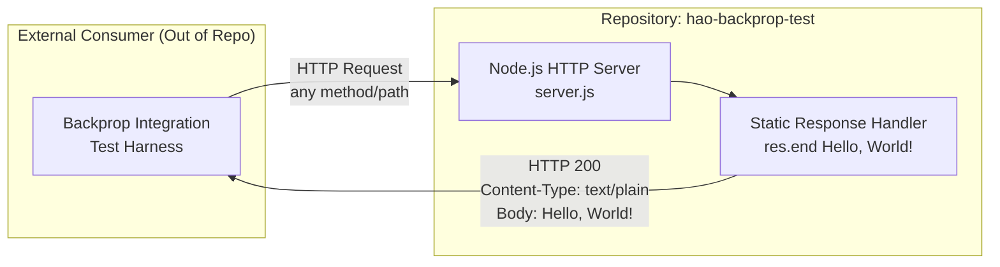

### 1.2.2 High-Level Description

#### Primary System Capabilities

The system provides exactly one capability: **serving a deterministic static HTTP response on a local TCP socket**. Operationally, this decomposes into the following observable behaviors:

| Capability | Behavior | Evidence |
|------------|----------|----------|
| TCP Bind | Acquires port `3000` on interface `127.0.0.1` | `server.listen(port, hostname, ...)` in `server.js` |
| Startup Logging | Emits one console line announcing the listening address | `console.log` in listen callback |
| Request Acceptance | Accepts all valid HTTP/1.1 requests via the Node.js `http` module | `http.createServer` in `server.js` |
| Static Response Emission | Returns status `200`, `Content-Type: text/plain`, body `"Hello, World!\n"` | Handler body in `server.js` |

#### Major System Components

The repository contains a single logical component — the HTTP server — supported by three metadata/documentation artifacts:

| Component | File | Role |
|-----------|------|------|
| HTTP Server | `server.js` | Sole runtime executable; the entire application surface |
| Package Manifest | `package.json` | Declares package identity, author, license, and (placeholder) test script |
| Dependency Lockfile | `package-lock.json` | Lockfile version 3 confirming an empty dependency tree |
| Project Documentation | `README.md` | Two-line description identifying purpose and "Do not touch!" directive |

A notable factual inconsistency must be flagged: `package.json` declares `"main": "index.js"`, but **no `index.js` file exists in the repository**. The actual runtime entry point is `server.js`, which is invoked directly via `node server.js` since no `start` script is defined in `package.json`.

#### Core Technical Approach

The implementation employs an intentionally minimal architectural footprint:

- **Language and Runtime:** JavaScript using CommonJS module conventions (`require`), executed by Node.js. No `engines` field is declared in `package.json`, so no specific Node.js version is required or guaranteed.
- **HTTP Layer:** Exclusively the Node.js core `http` module. No third-party web framework (Express, Koa, Fastify, Hapi, etc.) is used or installed.
- **Dependency Posture:** Zero runtime and zero development dependencies. `package.json` omits the `dependencies` and `devDependencies` fields entirely, and `package-lock.json` (lockfile version 3, indicating compatibility with npm v7+) contains only the root `""` package entry under its `packages` object.
- **Build/Transpile Pipeline:** None. No build scripts, no TypeScript, no bundler, no transformation step.
- **Persistence/State:** None. The server is fully stateless and holds no in-memory data structures beyond the constants `hostname`, `port`, and the `server` object itself.

### 1.2.3 Success Criteria

#### Measurable Objectives

Because the repository does not document explicit business or technical objectives, the following measurable criteria are derived directly from the implementation's observable behavior and serve as practical acceptance signals:

| Objective | Pass Condition | Validation Method |
|-----------|----------------|---------------------|
| Server Startup | Process binds to `127.0.0.1:3000` without error | Observation of `"Server running at..."` console output |
| Response Correctness | Every request returns HTTP 200 with body `"Hello, World!\n"` | HTTP client probe (e.g., `curl http://127.0.0.1:3000`) |
| Response Header Correctness | `Content-Type` header equals `text/plain` | HTTP client header inspection |
| Code Immutability | Repository contents remain unchanged from the committed baseline | Source control diff against baseline |

#### Critical Success Factors

The success of this fixture depends primarily on three factors, all reinforced by the README directive:

1. **Behavioral Stability** — The response payload, status code, and headers must remain byte-identical across executions to preserve the determinism on which upstream integration tests rely.
2. **Operational Availability** — The Node.js process must successfully claim port `3000` on the loopback interface at runtime; competing local processes binding the same port would prevent startup.
3. **Source Invariance** — Per the README's explicit "Do not touch!" instruction, the source files must not be modified, since modifications would invalidate the assumptions of the external "backprop integration" consumer.

#### Key Performance Indicators

No KPIs, SLAs, throughput targets, latency budgets, or quality-of-service metrics are documented in the repository. Performance characteristics are bounded only by the natural capabilities of the Node.js `http` core module on the host system, and any quantitative performance expectations would have to be defined externally by the consumer of this fixture rather than inside this repository.

## 1.3 SCOPE

### 1.3.1 In-Scope Elements

#### Core Features and Functionalities

The following capabilities are explicitly present in the codebase and therefore within the scope of this specification:

| Feature Category | In-Scope Item | Implementation Location |
|------------------|---------------|--------------------------|
| HTTP Server Lifecycle | TCP bind on `127.0.0.1:3000` and startup console announcement | `server.js` listen call and callback |
| Request Acceptance | Acceptance of HTTP requests of any method, path, headers, or body | `http.createServer` handler in `server.js` |
| Response Generation | Static HTTP 200 response with `text/plain` content type and `Hello, World!` body | Handler body in `server.js` |
| Package Identity | `hello_world` v1.0.0 under MIT license with author `hxu` | `package.json` and `package-lock.json` |
| Project Documentation | Two-line README declaring purpose and immutability directive | `README.md` |

#### Implementation Boundaries

| Boundary Dimension | Defined Scope | Evidence |
|---------------------|---------------|----------|
| System Boundary | One Node.js process executing `server.js`; no submodules, no child processes | Single source file in repository |
| Network Boundary | Loopback interface `127.0.0.1` only — not reachable from other hosts | Hardcoded `hostname` constant in `server.js` |
| User Population | Local processes on the same host able to issue HTTP requests to port `3000` | Loopback binding |
| Data Domain | A single static UTF-8 string `"Hello, World!\n"` — no dynamic data, no persistence | Handler body |
| Geographic / Market Coverage | Not applicable — the system is a local fixture with no user-facing distribution | Repository purpose declaration |
| License Coverage | MIT license terms apply to all repository contents | `package.json` and `package-lock.json` license fields |

### 1.3.2 Out-of-Scope Elements

#### Excluded Features and Capabilities

The following features and capabilities are **demonstrably absent** from the repository and are therefore explicitly out of scope for this technical specification. Their absence has been verified across all four repository files:

| Excluded Capability | Verification of Absence |
|---------------------|-------------------------|
| External web framework (Express, Koa, Fastify, Hapi, etc.) | `package.json` declares no `dependencies`; `package-lock.json` has empty `packages` tree |
| Routing layer and multiple endpoints | Handler in `server.js` ignores the `req` argument entirely |
| Middleware stack | No middleware registration or invocation chain exists |
| Authentication or authorization | No security headers, no token verification, no credential handling |
| Environment-variable configuration | No `process.env` references; host and port are hardcoded literals |
| Database or persistence integration | No imports of any database client or ORM |
| Error handling | No `try/catch` blocks and no `'error'` event listener on the server instance |
| Graceful shutdown | No `SIGINT` / `SIGTERM` handlers; no `server.close()` invocation |
| Request logging or structured logging framework | Only a single `console.log` on startup; no per-request log emission |
| Automated tests | `test` script in `package.json` is the npm-default placeholder returning exit code 1 |
| CI/CD configuration | No `.github/`, `.gitlab-ci.yml`, `Jenkinsfile`, or equivalent files |
| Containerization | No `Dockerfile`, `docker-compose.yml`, or container manifests |
| Build / transpile step | No build scripts, no TypeScript, no bundler configuration |
| Public network exposure | Server explicitly binds loopback `127.0.0.1`, not `0.0.0.0` |
| Node.js version constraint enforcement | `engines` field is absent from `package.json` |
| Convenience `start` script | `scripts` block in `package.json` contains only the test placeholder |

#### Future Phase Considerations

The repository contains **no roadmap, no future-phase planning documentation, no `TODO` markers, and no deprecation notices**. The "Do not touch!" directive in the README implies that future evolution of this artifact is not anticipated or desired within its present role as a fixture. Any expansion of functionality (e.g., parameterized configuration, multi-route support, observability) would constitute a redefinition of the project's purpose and is explicitly outside the scope of this specification.

#### Integration Points Not Covered

Integrations beyond the inbound HTTP socket on `127.0.0.1:3000` are out of scope. This includes — but is not limited to — outbound HTTP calls, message brokers, event streams, service meshes, identity providers, telemetry collectors, and configuration servers. None of these integrations are referenced or implemented in any repository file.

#### Unsupported Use Cases

The following use cases are unsupported by virtue of the system's design and are therefore explicitly out of scope:

1. **Production traffic serving** — The loopback-only binding precludes reachability from external clients.
2. **High-availability deployment** — No clustering, no process management, no health endpoints exist.
3. **Differentiated response logic** — The handler returns the same response regardless of request properties.
4. **Stateful conversation patterns** — No session handling, no cookies, no per-client state.
5. **Secure transport** — No TLS/HTTPS support; the server uses the plaintext `http` module only.
6. **Programmatic embedding** — `server.js` does not export anything via `module.exports`, so it cannot be imported as a library.

## 1.4 References

#### Files Examined

- `README.md` — Two-line project description establishing the repository title (`hao-backprop-test`), the self-stated purpose ("test project for backprop integration"), and the immutability directive ("Do not touch!").
- `package.json` — npm manifest providing package identity (`hello_world` v1.0.0), declared main entry (`index.js` — note: file does not exist), test-script placeholder, author (`hxu`), MIT license, and verification of zero declared dependencies.
- `package-lock.json` — Lockfile (version 3) confirming an empty dependency tree and consistent package identity metadata.
- `server.js` — Sole runtime source file (14 lines) containing the complete HTTP server implementation using the Node.js core `http` module, hardcoded `127.0.0.1:3000` binding, single static response handler, and startup `console.log` statement.

#### Repository Folders Explored

- Repository root (`/`) — The only directory in the repository; contains all four files listed above and no subdirectories.

# 2. Product Requirements

This section decomposes the `hao-backprop-test` repository into discrete, testable features. Every feature documented here is grounded in direct evidence from one of the four files present in the repository (`server.js`, `package.json`, `package-lock.json`, `README.md`). No speculative, aspirational, or absent capabilities are documented; verified absences are itemized in §1.3.2 of this specification and are not redocumented as requirements here.

Given the deliberately minimal surface area of the repository (a single 14-line `server.js` executable, no subdirectories, and zero declared dependencies), six discrete features have been identified. Each is assigned a unique identifier of the form `F-XXX`, and each requirement within a feature receives an identifier of the form `F-XXX-RQ-YYY` to support traceability throughout the document.

---

## 2.1 FEATURE CATALOG

### 2.1.1 F-001: HTTP Server Lifecycle and TCP Binding

#### Feature Metadata

| Attribute | Value |
|-----------|-------|
| Unique ID | F-001 |
| Feature Name | HTTP Server Lifecycle and TCP Binding |
| Feature Category | Core Runtime / Network Listener |
| Priority Level | Critical |
| Status | Completed |

#### Description

**Overview.** This feature is responsible for instantiating an HTTP server via the Node.js core `http` module and binding it to the loopback interface `127.0.0.1` on TCP port `3000`. It encompasses the construction of the server object via `http.createServer(...)` and the invocation of `server.listen(port, hostname, callback)` that activates the listener.

**Business Value.** This feature provides the predictable, deterministic network endpoint that external "backprop" integration tooling consumes. Without a successful bind, no other capability of the system is reachable, making this feature the foundational precondition for the entire system's purpose as a test fixture.

**User Benefits.** Local consumers of the fixture (i.e., processes on the same host) receive a stable, well-known address (`http://127.0.0.1:3000/`) that requires no discovery, registration, or configuration negotiation.

**Technical Context.** Implementation occupies `server.js` lines 1, 3–4, 6, and 12–14. The hostname and port are declared as `const` literals (`hostname = '127.0.0.1'`, `port = 3000`) and are not parameterized via environment variables, configuration files, or command-line arguments.

#### Dependencies

| Dependency Type | Specification |
|-----------------|---------------|
| Prerequisite Features | None |
| System Dependencies | Node.js runtime; built-in `http` core module |
| External Dependencies | None (zero npm packages declared) |
| Integration Requirements | TCP port `3000` must be available on the loopback interface at startup time |

---

### 2.1.2 F-002: Static HTTP Response Generation

#### Feature Metadata

| Attribute | Value |
|-----------|-------|
| Unique ID | F-002 |
| Feature Name | Static HTTP Response Generation |
| Feature Category | Request Handling / Response Generation |
| Priority Level | Critical |
| Status | Completed |

#### Description

**Overview.** This feature defines the request handler passed to `http.createServer()`. The handler is deliberately non-discriminating: it ignores the `req` parameter entirely and produces an identical response on every invocation, consisting of HTTP status code `200`, a single response header `Content-Type: text/plain`, and a response body of the literal UTF-8 string `"Hello, World!\n"`.

**Business Value.** This is the core observable behavior of the fixture. The deterministic, byte-identical response on every request is precisely the property that enables upstream integration tooling to validate its own behavior against a known-good baseline without application-layer noise.

**User Benefits.** Consumers receive a perfectly reproducible response, eliminating an entire category of test flakiness caused by varying response payloads, status codes, or headers.

**Technical Context.** Implementation is contained in `server.js` lines 6–10. The handler signature `(req, res) => { ... }` accepts both arguments but uses only `res`. The response is produced via three sequential operations: setting `res.statusCode = 200`, calling `res.setHeader('Content-Type', 'text/plain')`, and terminating with `res.end('Hello, World!\n')`.

#### Dependencies

| Dependency Type | Specification |
|-----------------|---------------|
| Prerequisite Features | F-001 (the server must exist to host this handler) |
| System Dependencies | Node.js `http` module's `IncomingMessage`/`ServerResponse` API |
| External Dependencies | None |
| Integration Requirements | Adherence to HTTP/1.1 wire protocol as implemented by Node.js `http` |

---

### 2.1.3 F-003: Startup Console Logging

#### Feature Metadata

| Attribute | Value |
|-----------|-------|
| Unique ID | F-003 |
| Feature Name | Startup Console Logging |
| Feature Category | Observability / Startup Signaling |
| Priority Level | Medium |
| Status | Completed |

#### Description

**Overview.** This feature emits exactly one log line to standard output upon successful TCP bind. The log message is constructed from the same `hostname` and `port` constants used by F-001 and follows the literal template `Server running at http://${hostname}:${port}/`.

**Business Value.** The log line provides the only built-in operational signal indicating that the fixture has reached a ready state. Without it, an operator or supervising process would have no in-band confirmation of successful startup.

**User Benefits.** A human operator observing the terminal — or an automation script grepping stdout — can deterministically detect the moment the server becomes available to accept requests.

**Technical Context.** Implementation occupies `server.js` line 13, inside the callback passed as the third argument to `server.listen()`. There is no per-request logging, no log framework, no log level concept, and no logging to files or external systems; the single `console.log` invocation is the entire logging subsystem.

#### Dependencies

| Dependency Type | Specification |
|-----------------|---------------|
| Prerequisite Features | F-001 (callback fires only after a successful `listen`) |
| System Dependencies | Node.js `console` global; an attached stdout stream |
| External Dependencies | None |
| Integration Requirements | None |

---

### 2.1.4 F-004: Package Identity and Metadata Declaration

#### Feature Metadata

| Attribute | Value |
|-----------|-------|
| Unique ID | F-004 |
| Feature Name | Package Identity and Metadata Declaration |
| Feature Category | Configuration / Package Management |
| Priority Level | High |
| Status | Completed (with one documented inconsistency) |

#### Description

**Overview.** This feature declares the npm-compatible identity and metadata of the project via `package.json`. The declared attributes include `name = "hello_world"`, `version = "1.0.0"`, `description = "Hello world in Node.js"`, `main = "index.js"`, `author = "hxu"`, `license = "MIT"`, and a placeholder `scripts.test` entry of `echo "Error: no test specified" && exit 1`.

**Business Value.** Declaring a valid `package.json` lets the project participate in the npm ecosystem (e.g., `npm install` in another project, `npm view` introspection, license auditing) even though no packages are actually consumed and the project is not intended for publication.

**User Benefits.** Tooling that expects standard npm metadata (linters, license scanners, IDEs) can introspect the project without errors.

**Technical Context.** Implementation occupies the entire contents of `package.json` (11 lines). A factual inconsistency exists between `package.json` and the actual repository contents: the `main` field declares `"index.js"`, but no `index.js` file exists in the repository. The actual runtime entry point is `server.js`, which is invoked directly via `node server.js` since no `start` script is defined. This inconsistency is preserved unchanged per the README's "Do not touch!" directive and is documented here for traceability rather than corrected.

#### Dependencies

| Dependency Type | Specification |
|-----------------|---------------|
| Prerequisite Features | None |
| System Dependencies | An npm-compatible package tooling layer for any introspection use |
| External Dependencies | None |
| Integration Requirements | Conformance to npm `package.json` schema |

---

### 2.1.5 F-005: Zero-Dependency Operation

#### Feature Metadata

| Attribute | Value |
|-----------|-------|
| Unique ID | F-005 |
| Feature Name | Zero-Dependency Operation |
| Feature Category | Architecture / Dependency Posture |
| Priority Level | High |
| Status | Completed |

#### Description

**Overview.** This feature codifies the project's posture of having zero runtime and zero development dependencies. The `package.json` file omits both the `dependencies` and `devDependencies` fields entirely, and `package-lock.json` (lockfile version `3`, compatible with npm v7+) contains only the root `""` entry under its `packages` object, with no nested entries.

**Business Value.** Zero dependencies dramatically reduce supply-chain risk, eliminate the need for `npm install` prior to execution, remove transitive vulnerability exposure, and ensure the fixture's behavior is exclusively governed by code in the repository plus the standard Node.js runtime.

**User Benefits.** The fixture can be cloned and executed immediately on any host with Node.js installed, without network access, without dependency resolution, and without disk space allocated to `node_modules`.

**Technical Context.** Implementation is distributed across `package.json` (absence of dependency fields) and `package-lock.json` (empty `packages` tree). The only library consumed by the running code is the Node.js core `http` module, which is part of the runtime itself and not an external dependency.

#### Dependencies

| Dependency Type | Specification |
|-----------------|---------------|
| Prerequisite Features | None |
| System Dependencies | Node.js runtime providing the `http` core module |
| External Dependencies | None (by definition of this feature) |
| Integration Requirements | None |

---

### 2.1.6 F-006: Project Documentation and Immutability Directive

#### Feature Metadata

| Attribute | Value |
|-----------|-------|
| Unique ID | F-006 |
| Feature Name | Project Documentation and Immutability Directive |
| Feature Category | Documentation / Governance |
| Priority Level | Medium |
| Status | Completed |

#### Description

**Overview.** This feature consists of the two-line `README.md` file, which simultaneously identifies the repository's purpose ("test project for backprop integration") and imposes an explicit governance constraint ("Do not touch!"). It establishes both the intended consumer relationship (with the unspecified "backprop" tooling) and the change-control posture (immutability).

**Business Value.** The "Do not touch!" directive operationalizes the source-invariance property described in §1.2.3 as a critical success factor. Without this explicit instruction, the fixture's value as a stable baseline could be compromised by well-intentioned modifications.

**User Benefits.** Anyone encountering the repository receives an immediate, unambiguous instruction about its intended use and its change-control expectations.

**Technical Context.** The entire content of `README.md` is two lines: a level-1 markdown heading `# hao-backprop-test` and the sentence `test project for backprop integration. Do not touch!`. No additional documentation files (`CONTRIBUTING.md`, `LICENSE.md`, `CODE_OF_CONDUCT.md`, etc.) exist in the repository.

#### Dependencies

| Dependency Type | Specification |
|-----------------|---------------|
| Prerequisite Features | None |
| System Dependencies | None (static markdown text) |
| External Dependencies | None |
| Integration Requirements | None |

---

## 2.2 FUNCTIONAL REQUIREMENTS

This subsection enumerates the discrete, testable requirements derived from each feature in §2.1. To respect the 4-column-maximum rule for tables, each feature is described via four short tables: **Requirement Details**, **Acceptance Criteria**, **Technical Specifications**, and **Validation Rules**.

### 2.2.1 F-001 Requirements — HTTP Server Lifecycle and TCP Binding

#### Requirement Details

| Requirement ID | Description | Priority | Complexity |
|----------------|-------------|----------|------------|
| F-001-RQ-001 | Create an HTTP server instance via `http.createServer()` | Must-Have | Low |
| F-001-RQ-002 | Bind the server to the loopback hostname `127.0.0.1` | Must-Have | Low |
| F-001-RQ-003 | Bind the server to TCP port `3000` | Must-Have | Low |
| F-001-RQ-004 | Transition the server to a listening state via `server.listen()` | Must-Have | Low |

#### Acceptance Criteria

| Requirement ID | Acceptance Criteria |
|----------------|---------------------|
| F-001-RQ-001 | Calling `http.createServer(handler)` returns a non-null `http.Server` instance held in the `server` constant |
| F-001-RQ-002 | A TCP socket appears bound to `127.0.0.1` (verifiable via `netstat`, `lsof`, or equivalent) |
| F-001-RQ-003 | The same socket is bound to port `3000` |
| F-001-RQ-004 | The listen callback executes exactly once, indicating the server has reached ready state |

#### Technical Specifications

| Requirement ID | Input Parameters | Output / Response | Performance |
|----------------|------------------|---------------------|-------------|
| F-001-RQ-001 | None (constructor call) | `http.Server` instance | Synchronous, sub-millisecond |
| F-001-RQ-002 | `hostname` constant `127.0.0.1` | Bound listener on loopback | Bound by OS socket allocation |
| F-001-RQ-003 | `port` constant `3000` | Bound listener on port 3000 | Bound by OS socket allocation |
| F-001-RQ-004 | `(port, hostname, callback)` | Listen callback invocation | Asynchronous; completes when bind succeeds |

#### Validation Rules

| Requirement ID | Business Rule / Data Validation | Security / Compliance |
|----------------|---------------------------------|------------------------|
| F-001-RQ-001 | Server must be constructed exactly once per process lifetime | No TLS material is provided or expected; plaintext HTTP only |
| F-001-RQ-002 | Hostname is a hardcoded literal — must not be parameterized | Loopback binding acts as the primary network-level security boundary |
| F-001-RQ-003 | Port is a hardcoded literal — must not be parameterized | Port must be reachable only via loopback |
| F-001-RQ-004 | Listen must complete before any request is accepted | None |

---

### 2.2.2 F-002 Requirements — Static HTTP Response Generation

#### Requirement Details

| Requirement ID | Description | Priority | Complexity |
|----------------|-------------|----------|------------|
| F-002-RQ-001 | Set response status code to `200` on every request | Must-Have | Low |
| F-002-RQ-002 | Set `Content-Type` response header to `text/plain` | Must-Have | Low |
| F-002-RQ-003 | Emit response body equal to the exact UTF-8 string `"Hello, World!\n"` | Must-Have | Low |
| F-002-RQ-004 | Produce identical response irrespective of method, path, headers, query, or body | Must-Have | Low |

#### Acceptance Criteria

| Requirement ID | Acceptance Criteria |
|----------------|---------------------|
| F-002-RQ-001 | `curl -s -o /dev/null -w "%{http_code}" http://127.0.0.1:3000/` returns `200` |
| F-002-RQ-002 | `curl -sI http://127.0.0.1:3000/` shows a `Content-Type: text/plain` header |
| F-002-RQ-003 | `curl -s http://127.0.0.1:3000/` returns exactly `Hello, World!\n` (14 bytes) |
| F-002-RQ-004 | Requests issued with `GET`, `POST`, `PUT`, `DELETE`, `OPTIONS`, etc., to any path produce byte-identical responses |

#### Technical Specifications

| Requirement ID | Input Parameters | Output / Response | Performance |
|----------------|------------------|---------------------|-------------|
| F-002-RQ-001 | None (req is ignored) | Status line `HTTP/1.1 200 OK` | Sub-millisecond, in-memory |
| F-002-RQ-002 | None | Header `Content-Type: text/plain` | Sub-millisecond, in-memory |
| F-002-RQ-003 | None | Body bytes `48 65 6C 6C 6F 2C 20 57 6F 72 6C 64 21 0A` | Sub-millisecond, in-memory |
| F-002-RQ-004 | Any valid HTTP request | Same response in all cases | Determinism enforced by ignoring `req` |

#### Validation Rules

| Requirement ID | Business Rule / Data Validation | Security / Compliance |
|----------------|---------------------------------|------------------------|
| F-002-RQ-001 | Status code must never deviate from `200`; no error paths exist | No status-code-leaking error information |
| F-002-RQ-002 | Header value must be the literal ASCII string `text/plain` | No security headers (CSP, HSTS, etc.) are emitted |
| F-002-RQ-003 | Body must terminate with a single newline (`\n`) | No reflection of user input (no input is consumed) |
| F-002-RQ-004 | Handler must not branch on any property of `req` | Eliminates request-shape-based information disclosure |

---

### 2.2.3 F-003 Requirements — Startup Console Logging

#### Requirement Details

| Requirement ID | Description | Priority | Complexity |
|----------------|-------------|----------|------------|
| F-003-RQ-001 | Emit a startup log message after successful `listen` | Should-Have | Low |
| F-003-RQ-002 | Format the log message as `Server running at http://${hostname}:${port}/` | Should-Have | Low |

#### Acceptance Criteria

| Requirement ID | Acceptance Criteria |
|----------------|---------------------|
| F-003-RQ-001 | Exactly one line appears on stdout following a successful start |
| F-003-RQ-002 | The line equals `Server running at http://127.0.0.1:3000/` |

#### Technical Specifications

| Requirement ID | Input Parameters | Output / Response | Performance |
|----------------|------------------|---------------------|-------------|
| F-003-RQ-001 | Listen-callback invocation | Single stdout line | Sub-millisecond after bind |
| F-003-RQ-002 | `hostname` and `port` template values | Interpolated URL string | Sub-millisecond after bind |

#### Validation Rules

| Requirement ID | Business Rule / Data Validation | Security / Compliance |
|----------------|---------------------------------|------------------------|
| F-003-RQ-001 | Logging occurs only once per process lifetime | No sensitive data is logged |
| F-003-RQ-002 | The literal scheme `http://` (not `https://`) must appear | Reflects accurate transport, not aspirational TLS |

---

### 2.2.4 F-004 Requirements — Package Identity and Metadata Declaration

#### Requirement Details

| Requirement ID | Description | Priority | Complexity |
|----------------|-------------|----------|------------|
| F-004-RQ-001 | Declare `name = "hello_world"` in `package.json` | Must-Have | Low |
| F-004-RQ-002 | Declare `version = "1.0.0"` in `package.json` | Must-Have | Low |
| F-004-RQ-003 | Declare `author = "hxu"` and `license = "MIT"` | Must-Have | Low |
| F-004-RQ-004 | Declare a `scripts.test` placeholder that exits non-zero | Could-Have | Low |

#### Acceptance Criteria

| Requirement ID | Acceptance Criteria |
|----------------|---------------------|
| F-004-RQ-001 | `npm view ./` (or JSON-parse of `package.json`) reports name `hello_world` |
| F-004-RQ-002 | Version is `1.0.0` and matches the `version` field of `package-lock.json` |
| F-004-RQ-003 | Author is `hxu`; license is `MIT` in both `package.json` and `package-lock.json` |
| F-004-RQ-004 | `npm test` prints `Error: no test specified` and exits with code 1 |

#### Technical Specifications

| Requirement ID | Input Parameters | Output / Response | Performance |
|----------------|------------------|---------------------|-------------|
| F-004-RQ-001 | n/a (static field) | String value `hello_world` | n/a |
| F-004-RQ-002 | n/a (static field) | Semver string `1.0.0` | n/a |
| F-004-RQ-003 | n/a (static fields) | `hxu`, `MIT` | n/a |
| F-004-RQ-004 | `npm test` invocation | Stdout error line, exit code `1` | Sub-second |

#### Validation Rules

| Requirement ID | Business Rule / Data Validation | Security / Compliance |
|----------------|---------------------------------|------------------------|
| F-004-RQ-001 | Name field must conform to npm package naming rules | None |
| F-004-RQ-002 | Version must be valid semver | None |
| F-004-RQ-003 | License must be an SPDX-recognized identifier (`MIT`) | License governs all repository contents |
| F-004-RQ-004 | Placeholder script is intentionally non-zero to signal absence of real tests | None |

> **Documented Inconsistency:** The `main` field in `package.json` declares `"index.js"`, but no such file exists in the repository. The actual runtime entry point is `server.js`, invoked via `node server.js`. Per the README's "Do not touch!" directive, this inconsistency is preserved unchanged and is recorded here for traceability rather than treated as a defect.

---

### 2.2.5 F-005 Requirements — Zero-Dependency Operation

#### Requirement Details

| Requirement ID | Description | Priority | Complexity |
|----------------|-------------|----------|------------|
| F-005-RQ-001 | Omit the `dependencies` field from `package.json` | Must-Have | Low |
| F-005-RQ-002 | Omit the `devDependencies` field from `package.json` | Must-Have | Low |
| F-005-RQ-003 | Use lockfile version `3` in `package-lock.json` | Must-Have | Low |
| F-005-RQ-004 | Keep the `packages` tree in `package-lock.json` empty except for the root entry | Must-Have | Low |

#### Acceptance Criteria

| Requirement ID | Acceptance Criteria |
|----------------|---------------------|
| F-005-RQ-001 | JSON-parse of `package.json` yields no `dependencies` key |
| F-005-RQ-002 | JSON-parse of `package.json` yields no `devDependencies` key |
| F-005-RQ-003 | `package-lock.json` `lockfileVersion` equals `3` |
| F-005-RQ-004 | `package-lock.json` `packages` object contains exactly one key (`""`) |

#### Technical Specifications

| Requirement ID | Input Parameters | Output / Response | Performance |
|----------------|------------------|---------------------|-------------|
| F-005-RQ-001 | n/a | Field absent | n/a |
| F-005-RQ-002 | n/a | Field absent | n/a |
| F-005-RQ-003 | n/a | Integer `3` | n/a |
| F-005-RQ-004 | n/a | Single root entry | n/a |

#### Validation Rules

| Requirement ID | Business Rule / Data Validation | Security / Compliance |
|----------------|---------------------------------|------------------------|
| F-005-RQ-001 | No transitive packages may be introduced | Eliminates supply-chain risk vector |
| F-005-RQ-002 | No development tooling may be added that would create dev deps | Reduces attack surface during local execution |
| F-005-RQ-003 | Lockfile version must remain compatible with npm v7+ | None |
| F-005-RQ-004 | Root entry must remain the only entry | Ensures `npm install` is a no-op |

---

### 2.2.6 F-006 Requirements — Project Documentation and Immutability Directive

#### Requirement Details

| Requirement ID | Description | Priority | Complexity |
|----------------|-------------|----------|------------|
| F-006-RQ-001 | Provide a `README.md` at the repository root | Must-Have | Low |
| F-006-RQ-002 | State the project title as `hao-backprop-test` | Must-Have | Low |
| F-006-RQ-003 | State the project purpose as "test project for backprop integration" | Must-Have | Low |
| F-006-RQ-004 | State the immutability directive "Do not touch!" | Must-Have | Low |

#### Acceptance Criteria

| Requirement ID | Acceptance Criteria |
|----------------|---------------------|
| F-006-RQ-001 | `README.md` exists at the repository root |
| F-006-RQ-002 | The first line matches `# hao-backprop-test` |
| F-006-RQ-003 | The second line contains the phrase `test project for backprop integration` |
| F-006-RQ-004 | The second line contains the phrase `Do not touch!` |

#### Technical Specifications

| Requirement ID | Input Parameters | Output / Response | Performance |
|----------------|------------------|---------------------|-------------|
| F-006-RQ-001 | n/a | File presence | n/a |
| F-006-RQ-002 | n/a | Heading line | n/a |
| F-006-RQ-003 | n/a | Purpose sentence | n/a |
| F-006-RQ-004 | n/a | Directive sentence | n/a |

#### Validation Rules

| Requirement ID | Business Rule / Data Validation | Security / Compliance |
|----------------|---------------------------------|------------------------|
| F-006-RQ-001 | README content must remain unchanged from committed baseline | None |
| F-006-RQ-002 | Title must match the repository's directory name | None |
| F-006-RQ-003 | Purpose statement governs the consumer relationship | None |
| F-006-RQ-004 | Directive establishes change-control posture for all stakeholders | Governance signal applies to all six features |

---

## 2.3 FEATURE RELATIONSHIPS

This subsection documents only those relationships that are directly observable in the source code and configuration files. No hypothetical, planned, or aspirational relationships are described.

### 2.3.1 Feature Dependency Map

The dependency graph among features is extremely shallow because the system is implemented in a single file. F-002 and F-003 both depend on F-001 because they execute within callbacks supplied to `http.createServer()` and `server.listen()`, respectively. F-004, F-005, and F-006 are pure metadata/documentation features with no runtime relationship to the executing server.

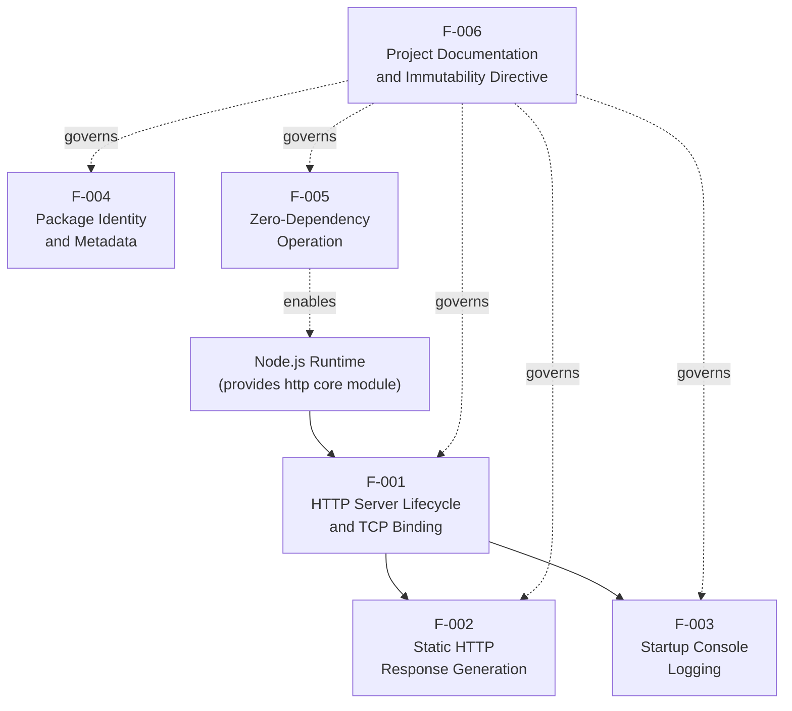

Solid arrows denote a runtime execution dependency. Dashed arrows denote a non-runtime relationship: F-005 is the enabling posture that makes the Node.js runtime alone sufficient, and F-006's immutability directive governs every other feature as a change-control constraint.

### 2.3.2 Integration Points

| Integration Point | Direction | Protocol | Notes |
|-------------------|-----------|----------|-------|
| `127.0.0.1:3000` HTTP socket | Inbound only | HTTP/1.1 plaintext | The sole integration boundary; consumed by the unspecified "backprop" tooling |

No outbound integration points exist: there are no DNS lookups, no outbound HTTP calls, no database connections, no message-broker clients, and no telemetry exports.

### 2.3.3 Shared Components and Common Services

| Aspect | Status | Evidence |
|--------|--------|----------|
| Shared internal modules | None | The repository has only `server.js` and no helper or utility files |
| Shared external libraries | None | Zero dependencies (see F-005) |
| Common services / abstractions | None | No abstraction layers, factories, or service registries exist |
| Cross-feature data structures | `hostname` and `port` constants | Shared between F-001 (bind) and F-003 (log message) within `server.js` |

The only piece of state shared across features is the pair of module-level constants `hostname = '127.0.0.1'` and `port = 3000`, which are used by both F-001 (to bind the listener) and F-003 (to construct the log message). This sharing exists by direct lexical scoping within a single file rather than via any deliberate "shared component" abstraction.

---

## 2.4 IMPLEMENTATION CONSIDERATIONS

### 2.4.1 Technical Constraints

| Constraint Category | Constraint | Applies To |
|---------------------|------------|------------|
| Language | JavaScript using CommonJS (`require`) — not ESM | F-001, F-002, F-003 |
| Runtime | Node.js (no `engines` field; no version constraint declared) | F-001, F-002, F-003 |
| Module system | CommonJS only — `server.js` does not use `import`/`export` | F-001, F-002, F-003 |
| Web framework | None permitted — only Node.js core `http` is used | F-001, F-002 |
| Network interface | Loopback `127.0.0.1` hardcoded, not configurable | F-001 |
| Port | `3000` hardcoded, not configurable | F-001 |
| Configuration mechanism | None — no `process.env`, CLI args, or config files | All features |
| Build pipeline | None — execute directly with `node server.js` | F-001, F-002, F-003 |
| Source mutability | Files must not be modified per README directive | All features |

### 2.4.2 Performance Requirements

No quantitative performance targets — throughput, latency, concurrency, or memory ceilings — are documented in any repository file. Per §1.2.3, KPIs and SLAs are explicitly absent, and any performance expectations would have to be defined externally by the consumer of this fixture. The implementation's performance is therefore bounded only by the natural capabilities of the Node.js `http` core module on the host system.

| Feature | Implicit Performance Posture |
|---------|-------------------------------|
| F-001 | Bind completes synchronously with the OS socket allocation |
| F-002 | Response generation is in-memory, allocation-free of user data, and constant-time |
| F-003 | Single synchronous `console.log` at startup; no per-request logging overhead |
| F-004 | Static metadata; no runtime cost |
| F-005 | Eliminates `npm install` time; zero startup cost from dependency resolution |
| F-006 | Static documentation; no runtime cost |

### 2.4.3 Scalability Considerations

| Scalability Dimension | Position | Evidence |
|------------------------|----------|----------|
| Horizontal scaling | Not supported | No clustering, no process manager configuration |
| Vertical scaling | Bounded by single-process Node.js limits | Single `http.Server` instance |
| Concurrency model | Single Node.js event-loop process | No `cluster` or `worker_threads` usage |
| State migration | Not applicable (stateless) | No in-memory state to migrate |
| Load distribution | Not applicable | Loopback binding precludes external load distribution |

The system is stateless and single-process by design. Its purpose as a test fixture, combined with the loopback-only binding, removes scalability from the relevant concern set.

### 2.4.4 Security Implications

| Security Aspect | Posture | Mitigating Factor |
|-----------------|---------|---------------------|
| Authentication | None | Loopback binding restricts who can reach the socket |
| Authorization | None | Same as above |
| Transport encryption | None (plaintext HTTP) | Loopback traffic does not traverse external networks |
| Input validation | None (request is ignored) | No input is consumed, eliminating injection surfaces |
| Output encoding | Static literal | Body and headers are compile-time constants |
| Security headers | Only `Content-Type` | No CSP, HSTS, X-Frame-Options, etc. |
| Dependency vulnerabilities | None | Zero dependencies (see F-005) |
| Network exposure | Loopback only | Hardcoded `127.0.0.1` prevents external reachability |

The primary and only security boundary is the network-level restriction imposed by binding to `127.0.0.1`. This is a deliberate, architectural choice; weakening it (e.g., binding to `0.0.0.0`) would invalidate the security posture of the fixture.

### 2.4.5 Maintenance Requirements

| Maintenance Aspect | Position |
|---------------------|----------|
| Change-control posture | "Do not touch!" — explicit immutability per README |
| Versioning | Static at `1.0.0`; no semver-driven release process expected |
| Custodianship | Sole declared author `hxu`; no CODEOWNERS or MAINTAINERS files |
| Defect process | Not documented; no issue templates or contribution guides exist |
| Documentation maintenance | README is immutable per its own directive |
| Test maintenance | Placeholder test script — no real tests to maintain |
| Dependency updates | Not applicable (zero dependencies) |
| Runtime upgrades | No constraint on Node.js version; user-managed |

The maintenance posture is intentionally degenerate: the only required activity is to *not* modify the repository. Any maintenance effort beyond preserving the committed baseline (e.g., updating dependencies, refactoring `server.js`, fleshing out the test script) would contradict the README's directive and the project's role as an invariant fixture.

---

## 2.5 TRACEABILITY MATRIX

The traceability matrix links each requirement to the validation method documented in §1.2.3 (Success Criteria) of this specification. This matrix supports verification activities by mapping every must-have requirement to an observable outcome.

### 2.5.1 Requirement-to-Success-Criterion Mapping

| Requirement ID | Linked Success Criterion (§1.2.3) | Validation Method |
|----------------|------------------------------------|---------------------|
| F-001-RQ-001 | Server Startup | Observation of listen callback execution |
| F-001-RQ-002 | Server Startup | `netstat`/`lsof` inspection of `127.0.0.1` binding |
| F-001-RQ-003 | Server Startup | `netstat`/`lsof` inspection of port `3000` |
| F-001-RQ-004 | Server Startup | Observation of `"Server running at..."` console line |
| F-002-RQ-001 | Response Correctness | `curl -w "%{http_code}"` probe |
| F-002-RQ-002 | Response Header Correctness | `curl -I` header inspection |
| F-002-RQ-003 | Response Correctness | `curl` body equality check against `"Hello, World!\n"` |
| F-002-RQ-004 | Response Correctness | Probe with multiple methods/paths confirming identical responses |
| F-003-RQ-001 | Server Startup | Stdout capture |
| F-003-RQ-002 | Server Startup | Stdout string equality check |
| F-004-RQ-001..004 | (Metadata — not in §1.2.3) | JSON parse of `package.json` and `npm test` invocation |
| F-005-RQ-001..004 | (Metadata — not in §1.2.3) | JSON parse of `package.json` and `package-lock.json` |
| F-006-RQ-001..004 | Code Immutability | Git diff against committed baseline |

### 2.5.2 Feature-to-File Mapping

| Feature | Primary Source File | Lines / Scope |
|---------|---------------------|----------------|
| F-001 | `server.js` | Lines 1, 3–4, 6, 12–14 |
| F-002 | `server.js` | Lines 6–10 |
| F-003 | `server.js` | Line 13 |
| F-004 | `package.json` | Entire file (11 lines) |
| F-005 | `package.json`, `package-lock.json` | Absence of dependency fields; lines 3–12 of lockfile |
| F-006 | `README.md` | Entire file (2 lines) |

### 2.5.3 Cross-References to Related Specification Sections

| Topic | Cross-Reference |
|-------|------------------|
| Stakeholder identity referenced in feature dependencies | §1.1.3 Key Stakeholders and Users |
| Diagram of inbound HTTP integration consumed by F-001/F-002 | §1.2.1 mermaid flow diagram |
| Capability summary feeding F-001, F-002, F-003 | §1.2.2 Primary System Capabilities table |
| Component-to-file mapping aligning with §2.5.2 | §1.2.2 Major System Components table |
| Acceptance criteria source for §2.5.1 | §1.2.3 Measurable Objectives table |
| In-scope items aligning with §2.1 feature catalog | §1.3.1 In-Scope Elements |
| Verified absences excluded from this section | §1.3.2 Out-of-Scope Elements |

---

## 2.6 ASSUMPTIONS AND CONSTRAINTS

### 2.6.1 Assumptions

| ID | Assumption | Rationale |
|----|-------------|-----------|
| A-001 | Node.js is installed on the host running `server.js` | No installer or runtime bundling is provided in the repository |
| A-002 | TCP port `3000` is free on the loopback interface at startup | The server has no fallback port logic; collision causes startup failure |
| A-003 | The unspecified "backprop" consumer issues HTTP/1.1 requests from a process on the same host | Loopback binding restricts reachability accordingly |
| A-004 | The reader of `package.json` will tolerate the `main: "index.js"` declaration despite the absence of `index.js` | Per README immutability directive, the inconsistency cannot be corrected |
| A-005 | No security review of plaintext HTTP / loopback binding is required beyond the documented posture | The fixture is local-only by design |

### 2.6.2 Constraints

| ID | Constraint | Source |
|----|-------------|--------|
| C-001 | All files must remain unchanged from the committed baseline | `README.md` "Do not touch!" directive |
| C-002 | Hostname must remain hardcoded to `127.0.0.1` | `server.js` line 3 |
| C-003 | Port must remain hardcoded to `3000` | `server.js` line 4 |
| C-004 | Response body, status, and headers must remain byte-identical across all requests | `server.js` lines 7–9 |
| C-005 | Zero runtime and zero development dependencies must be maintained | `package.json` and `package-lock.json` |
| C-006 | The project must remain executable on a Node.js installation without any prior `npm install` step | Consequence of C-005 |
| C-007 | License of all repository contents is MIT | `package.json` and `package-lock.json` license fields |

### 2.6.3 Requirement Version Tracking

All requirements in this section correspond to repository state at `package.json` version `1.0.0` (mirrored in `package-lock.json`). No prior version exists in the repository's recorded artifacts (no `CHANGELOG`, no migration notes, no historical version declarations), so all requirements are at their initial revision and are tracked against the single declared version `1.0.0`.

---

## 2.7 REFERENCES

### 2.7.1 Repository Files Examined

- `server.js` — Sole runtime executable (14 lines); provides direct evidence for features F-001 (lines 1, 3–4, 6, 12–14), F-002 (lines 6–10), and F-003 (line 13).
- `package.json` — npm manifest (11 lines); provides direct evidence for features F-004 (entire file) and F-005 (absence of `dependencies` / `devDependencies`). Also the source of the documented `main: "index.js"` inconsistency.
- `package-lock.json` — Lockfile version 3 (13 lines); provides direct evidence for feature F-005 (empty `packages` tree except root entry).
- `README.md` — Two-line documentation file; provides direct evidence for feature F-006 (title, purpose statement, and immutability directive).

### 2.7.2 Repository Folders Explored

- Repository root (`/`) — The only directory in the repository; contains all four files listed above and no subdirectories.

### 2.7.3 Technical Specification Sections Referenced

- §1.1 Executive Summary — Stakeholders, value proposition, and project identity used in feature descriptions.
- §1.2 System Overview — Primary capabilities, components, technical approach, and success criteria used to derive features and the §2.5 traceability matrix.
- §1.3 Scope — In-scope inventory aligning with §2.1 features; verified out-of-scope items explicitly excluded from this section's requirements.
- §1.4 References — Cross-referenced file inventory consistent with §2.7.1.

# 3. Technology Stack

## 3.1 STACK OVERVIEW AND ARCHITECTURAL POSTURE

### 3.1.1 Guiding Principles

The technology stack of the `hao-backprop-test` repository is governed by an explicit and uncompromising principle of minimalism. The repository exists as a deterministic test fixture for an external "backprop integration" workflow, and every stack decision is subordinated to two non-negotiable properties: behavioral stability and source invariance. Per the README directive — `"Do not touch!"` — and the constraints catalogued in §2.6.2 (C-001 through C-007), the stack composition itself is an invariant of the system rather than a flexible implementation choice.

Notably, the conventional enterprise default technology stack (AWS, Docker, Terraform, GitHub Actions, Python/Flask, Auth0, MongoDB, Langchain, React/TypeScript, TailwindCSS, React-Native, Swift, Kotlin, ElectronJS) is **explicitly inapplicable** to this repository. Adopting any element of that default would violate constraints C-001 ("All files must remain unchanged from the committed baseline"), C-005 ("Zero runtime and zero development dependencies must be maintained"), and C-006 ("The project must remain executable on a Node.js installation without any prior `npm install` step"). Accordingly, this section documents only the technologies that are demonstrably present in — or directly required by — the four files actually committed to the repository: `server.js`, `package.json`, `package-lock.json`, and `README.md`.

### 3.1.2 Layered Stack Topology

The entirety of the technology stack can be expressed in a single diagram of four concentric layers. There is no horizontal complexity — no microservice mesh, no client/server split, no plugin architecture — only a vertical composition of Node.js runtime + core `http` + a single 14-line application file.

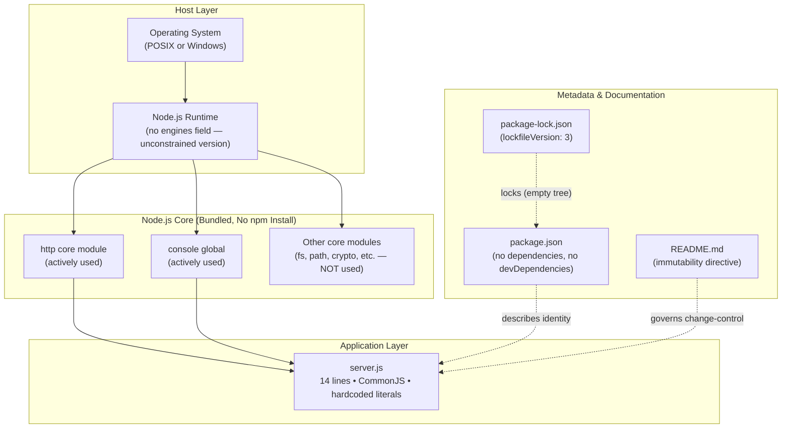

### 3.1.3 Stack Composition Summary

| Stack Concern | Decision | Evidence |
|---------------|----------|----------|
| Primary language | JavaScript (CommonJS) | `server.js` uses `require('http')` |
| Runtime | Node.js (unpinned version) | No `engines` field in `package.json` |
| Web framework | None — Node.js core `http` only | `server.js` line 1 |
| Dependencies | Zero (runtime and development) | `package.json` omits both fields |
| Lockfile | npm lockfile v3 | `package-lock.json` `lockfileVersion: 3` |
| Build pipeline | None | No build scripts, no transpiler config |
| Containerization | None | No `Dockerfile` or container manifests |
| CI/CD | None | No `.github/`, `.gitlab-ci.yml`, `Jenkinsfile` |
| Database / Storage | None | No persistence layer of any kind |
| External services | None | Only inbound HTTP on `127.0.0.1:3000` |
| License | MIT | `package.json` and `package-lock.json` |

---

## 3.2 PROGRAMMING LANGUAGES

### 3.2.1 Language Inventory by Component

The repository contains exactly three textual languages, each confined to a single role:

| Language | Component | Module System | File(s) |
|----------|-----------|---------------|---------|
| JavaScript (ES2015+) | Sole runtime executable | CommonJS (`require`) | `server.js` |
| JSON | Package metadata and lockfile | n/a (data format) | `package.json`, `package-lock.json` |
| Markdown | Repository documentation | n/a (documentation) | `README.md` |

JavaScript is the only language that participates in runtime execution. The `server.js` file (14 lines) uses several ES2015+ JavaScript features that are universally available in modern Node.js runtimes: `const` declarations, arrow function expressions `(req, res) => { ... }`, and template literals (`` `Server running at http://${hostname}:${port}/` ``). No experimental syntax, stage proposals, or runtime-specific extensions are used.

### 3.2.2 Module System and Runtime Constraints

The codebase uses **CommonJS exclusively**. Per §2.4.1 and §1.2.2, `server.js` invokes `require('http')` and does not use ES Module `import`/`export` syntax. This is a deliberate constraint that ensures the file executes directly under `node server.js` without requiring `"type": "module"` declaration in `package.json` and without any `.mjs` file extension.

The Node.js runtime version is **intentionally unpinned**. The `package.json` file omits the `engines` field, so no minimum or maximum Node.js version is enforced. Per assumption A-001, the consumer is responsible for having Node.js installed, but the project does not advertise a required version. This decision is consistent with the use of only stable Node.js core APIs (`http.createServer`, `server.listen`, `res.statusCode`, `res.setHeader`, `res.end`, `console.log`) — all of which have been available since Node.js v0.x and have not undergone breaking changes.

### 3.2.3 Selection Justification

The JavaScript/Node.js selection is justified by three properties that align directly with the fixture's role:

1. **Zero install friction** — Per F-005, the absence of dependencies means the file can be cloned and executed immediately. JavaScript executed by a present Node.js runtime requires no compilation, no toolchain bootstrap, and no virtual environment.
2. **Deterministic single-threaded execution** — Node.js's event-loop model produces predictable, in-order execution that aligns with the determinism requirements expressed in §1.2.3 (Critical Success Factors — Behavioral Stability).
3. **Core `http` module sufficiency** — JavaScript's bundled `http` module exposes everything needed to satisfy F-001 and F-002 without invoking any external library.

### 3.2.4 Languages and Language Features Explicitly Excluded

Per §1.3.2 and §2.4.1, the following language-related capabilities are demonstrably absent and out of scope:

- **TypeScript** — No `.ts` files, no `tsconfig.json`, no transpiler. Adopting TypeScript would require dev dependencies (`typescript`, `@types/node`), violating C-005.
- **ES Modules (ESM)** — `server.js` is CommonJS only; no `import`/`export` syntax is used.
- **Native add-ons** — No `node-gyp`, no `binding.gyp`, no `.node` binaries. Stack remains pure JavaScript.
- **JSX / TSX** — No frontend, no view layer, no framework requiring transpilation.

---

## 3.3 FRAMEWORKS & LIBRARIES

### 3.3.1 Runtime Frameworks

The system uses **exactly one runtime "framework"**, which is in fact a Node.js core module rather than a third-party framework:

| Component | Type | Version | Source | Used In |
|-----------|------|---------|--------|---------|
| Node.js `http` core module | Bundled core module | Bundled with Node.js (any version) | `require('http')` | `server.js` line 1 |
| Node.js `console` global | Bundled global object | Bundled with Node.js (any version) | Global namespace | `server.js` line 13 |

Per §1.2.2 Core Technical Approach: "HTTP Layer: Exclusively the Node.js core `http` module. No third-party web framework (Express, Koa, Fastify, Hapi, etc.) is used or installed." The `http` module provides `createServer()`, `Server`, `IncomingMessage`, and `ServerResponse` — all of which are sufficient to satisfy F-001 (HTTP Server Lifecycle and TCP Binding) and F-002 (Static HTTP Response Generation).

### 3.3.2 Justification for Sole Use of Node.js Core

The decision to use only the Node.js core `http` module — rather than a higher-level web framework — is justified by four reinforcing factors:

1. **Supply-chain risk elimination** — Each third-party framework would introduce a transitive dependency tree (Express alone pulls in approximately 30+ transitive packages), creating attack surface that the fixture explicitly avoids per F-005.
2. **Behavioral invariance** — Frameworks introduce middleware stacks, error handlers, and content negotiation logic whose behavior may change across minor versions. The core `http` module's behavior has been stable for over a decade.
3. **Zero install posture** — Per C-006, the project must remain executable without `npm install`. Any framework would require dependency resolution and disk allocation for `node_modules`.
4. **Minimal API surface** — The implementation requires only `http.createServer()`, `server.listen(port, hostname, callback)`, `res.statusCode`, `res.setHeader()`, and `res.end()`. These five APIs are fully provided by the core module; nothing additional is needed.

### 3.3.3 Compatibility Requirements

The technology stack imposes the following compatibility expectations:

| Requirement | Source | Notes |
|-------------|--------|-------|
| Node.js core `http` API availability | `server.js` | Available since Node.js v0.x; no breaking changes observed |
| npm v7+ (or compatible package manager) | `package-lock.json` `lockfileVersion: 3` | Required only if `npm` operations are performed; runtime execution does not require npm at all |
| HTTP/1.1 wire protocol support in the client | F-002 dependency | Provided by Node.js `http` server implementation |
| stdout stream attachment | F-003 dependency | Standard process configuration |

Per F-005-RQ-003, the lockfile version `3` indicates npm v7+ compatibility. However, this is a tooling compatibility, not a runtime compatibility — the running server does not invoke npm.

### 3.3.4 Frameworks and Libraries Explicitly Excluded

Per §1.3.2, the following framework categories are demonstrably absent:

| Excluded Category | Examples | Verification |
|-------------------|----------|--------------|
| HTTP web frameworks | Express, Koa, Fastify, Hapi, Restify | No `dependencies` field in `package.json` |
| Middleware libraries | body-parser, cors, helmet, morgan | No imports in `server.js` |
| Routing libraries | router, express-router | Handler ignores `req` entirely |
| Bundlers | webpack, rollup, esbuild, vite, parcel | No bundler config files |
| Transpilers | Babel (`@babel/*`), SWC, TypeScript | No `.babelrc`, no `tsconfig.json` |
| Test frameworks | Jest, Mocha, Vitest, Jasmine, AVA | `scripts.test` is the npm placeholder |
| Linters / Formatters | ESLint, Prettier, StandardJS | No `.eslintrc*` or `.prettierrc*` files |
| AI / ML frameworks | LangChain, OpenAI SDK, TensorFlow.js | No imports or dependencies |
| Frontend frameworks | React, Vue, Angular, Svelte | No DOM, no UI layer exists |

---

## 3.4 OPEN SOURCE DEPENDENCIES

### 3.4.1 Runtime Dependencies

**None.** The `dependencies` field is entirely omitted from `package.json`. Per F-005-RQ-001 and constraint C-005, this is an enforced architectural property of the system, not an oversight.

### 3.4.2 Development Dependencies

**None.** The `devDependencies` field is entirely omitted from `package.json`. Per F-005-RQ-002 and constraint C-005, no development tooling — no linters, no formatters, no test frameworks, no type checkers, no build tools — is installed. This eliminates not only runtime supply-chain risk but also development-time tooling drift.

### 3.4.3 Lockfile Confirmation

The `package-lock.json` file provides cryptographic-level confirmation of the zero-dependency posture:

| Lockfile Property | Value | Significance |
|-------------------|-------|--------------|
| `lockfileVersion` | `3` | npm v7+ lockfile format (F-005-RQ-003) |
| `name` | `hello_world` | Matches `package.json` |
| `version` | `1.0.0` | Matches `package.json` |
| `license` | `MIT` | Matches `package.json` |
| `requires` | `true` | Standard lockfile marker |
| `packages` tree | Single entry `""` for the root package | F-005-RQ-004 — no nested packages exist |

The `packages` object contains exactly one key — the empty string `""` representing the root package itself — with no nested entries. This is the verifiable proof of zero transitive dependencies. Per the acceptance criterion of F-005-RQ-004: the `packages` object contains exactly one key (`""`).

### 3.4.4 Package Registry Configuration

The npm public registry (`https://registry.npmjs.org/`) is the **declared** registry mechanism by virtue of using `package.json` and `package-lock.json` in their standard forms, but **no packages are resolved from it at any point** in the project's lifecycle. No `.npmrc` file exists in the repository to override registry configuration, custom scopes, or authentication. Per C-006, the project executes without ever contacting the registry.

### 3.4.5 Supply-Chain Risk Posture

Per §2.4.4 and §2.1.5, the zero-dependency architecture confers the following security benefits:

| Risk Vector | Mitigation Provided by Zero Dependencies |
|-------------|------------------------------------------|
| Transitive vulnerability exposure | Eliminated — no transitive packages exist |
| Typosquatting / malicious packages | Not applicable — no packages are installed |
| Dependency confusion attacks | Not applicable — no private registry, no install step |
| `postinstall` script execution | Not applicable — no packages, no install hooks |
| Lockfile poisoning | Mitigated — lockfile contains only the root package entry |
| Stale dependency drift | Not applicable — nothing to update |

---

## 3.5 THIRD-PARTY SERVICES

### 3.5.1 External Service Integrations

**None.** The repository integrates with zero external services. This complete absence is documented across §1.2.1, §1.3.2, and §2.3.2. The following service categories were specifically evaluated and confirmed absent:

| Service Category | Status | Verification |
|------------------|--------|--------------|
| External REST/GraphQL APIs | Not used | No outbound HTTP client code in `server.js` |
| Authentication services (Auth0, Okta, Cognito) | Not used | No security headers, no token verification, no credential handling (§1.3.2) |
| Identity providers (OIDC, SAML) | Not used | No authentication code |
| Cloud platforms (AWS, GCP, Azure) | Not used | No cloud SDK, no IaC files |
| Container orchestration (Kubernetes, ECS) | Not used | No manifests, no Helm charts |
| Monitoring / observability (DataDog, New Relic, Sentry) | Not used | Only one `console.log` on startup; no per-request logging (§1.3.2) |
| Telemetry collectors (OpenTelemetry, Prometheus) | Not used | No telemetry exports implemented (§1.2.1) |
| Message brokers / event streams (Kafka, RabbitMQ, SQS) | Not used | No outbound integration points exist (§2.3.2) |
| Configuration servers (Consul, AWS Parameter Store) | Not used | No `process.env` references; values are hardcoded (§1.3.2) |
| Service discovery (Consul, Eureka, Kubernetes DNS) | Not used | No service-discovery registration (§1.2.1) |
| Content delivery networks (CDN) | Not used | Loopback-only binding (`127.0.0.1`) |
| Email / SMS / push providers | Not used | No outbound communication |
| Payment processors | Not used | No financial transaction surface |
| AI / LLM services (OpenAI, Anthropic, LangChain) | Not used | No AI integration code |

### 3.5.2 The Sole Integration Surface

Per §2.3.2, the system has exactly **one integration point**:

| Direction | Protocol | Endpoint | Consumer |
|-----------|----------|----------|----------|
| Inbound only | HTTP/1.1 (plaintext) | `127.0.0.1:3000` | Unspecified "backprop" tooling on the same host (per assumption A-003) |

This integration is intentionally minimal: any HTTP/1.1 request reaching the loopback port receives the same static `Hello, World!` response per F-002. There is no service-level handshake, no API contract negotiation, no authentication exchange, and no health-check endpoint.

### 3.5.3 Justification for Zero External Services

The absence of external services follows directly from the project's role as a deterministic test fixture. External services introduce three properties incompatible with that role:

1. **Non-determinism** — Network calls to external systems introduce variable latency, occasional failures, and version drift that would compromise the byte-identical response guarantee of F-002.
2. **Configuration surface** — External services require endpoints, credentials, and SDKs, which would require `process.env` configuration or hardcoded secrets — both incompatible with the current `server.js` source.
3. **Dependency surface** — Cloud SDKs and authentication libraries would introduce dependencies, violating C-005.

---

## 3.6 DATABASES & STORAGE

### 3.6.1 Persistence Posture

**No persistence layer of any kind exists.** Per §1.2.2 Core Technical Approach: "Persistence/State: None. The server is fully stateless and holds no in-memory data structures beyond the constants `hostname`, `port`, and the `server` object itself."

### 3.6.2 Storage Categories Evaluated and Excluded

| Storage Category | Status | Verification |
|------------------|--------|--------------|
| Primary relational database (PostgreSQL, MySQL, etc.) | Not used | No database client `require()` statements (§1.2.1) |
| Document database (MongoDB, CouchDB, etc.) | Not used | No database client imports |
| Key-value store (Redis, DynamoDB, etc.) | Not used | No client libraries |
| Search engine (Elasticsearch, OpenSearch, etc.) | Not used | No search client code |
| In-memory cache (Redis, Memcached) | Not used | No cache client code |
| Object storage (S3, GCS, Azure Blob) | Not used | No cloud storage SDK imports |
| Block storage / file system persistence | Not used | `server.js` performs no `fs` I/O |
| Session storage | Not used | No session handling, no cookies, no per-client state (§1.3.2) |
| Time-series database (InfluxDB, TimescaleDB) | Not used | No metrics emitted |
| Graph database (Neo4j, etc.) | Not used | No client libraries |

### 3.6.3 Stateless Architecture Justification

The fully stateless posture is justified by F-002 (Static HTTP Response Generation), whose Validation Rule F-002-RQ-004 mandates that "Handler must not branch on any property of `req`." Because the response is byte-identical on every invocation, no state is required to produce it. The only "memory" of the process is:

- `hostname` — compile-time constant `'127.0.0.1'`
- `port` — compile-time constant `3000`
- `server` — the `http.Server` instance returned by `http.createServer()`

There is no Object-Relational Mapper (ORM), no data access layer, no schema definition, no migration system, and no data fixtures. Adding any of these would violate C-001 (source invariance) and C-005 (zero dependencies).

---

## 3.7 DEVELOPMENT & DEPLOYMENT

### 3.7.1 Development Toolchain

| Tool Category | Configured? | Evidence |
|---------------|-------------|----------|
| Package manager | npm (metadata only) | `package.json`, `package-lock.json` present; npm v7+ via lockfile v3 |
| Linter (ESLint, JSHint) | Not configured | No `.eslintrc*` files in repository |
| Formatter (Prettier, dprint) | Not configured | No `.prettierrc*` files |
| Type checker (TypeScript, Flow) | Not configured | No `tsconfig.json`, no `.ts` files |
| Test framework (Jest, Mocha, Vitest) | Not configured | `scripts.test` is `echo "Error: no test specified" && exit 1` |
| Pre-commit hooks (husky, lefthook) | Not configured | No `.husky/` directory |
| IDE / editor configuration | Not provided | No `.vscode/`, no `.idea/`, no `.editorconfig` |
| Debugging configuration | Not provided | No launch configurations |

Per F-004-RQ-004, the `test` script is intentionally a placeholder that exits with code 1. This is the npm-default value, signaling explicitly that no real tests exist in the project — and per C-001, none may be added.

### 3.7.2 Build System

**No build system exists.** Per §1.2.2: "Build/Transpile Pipeline: None. No build scripts, no TypeScript, no bundler, no transformation step." Per §2.4.1, the build pipeline constraint is "None — execute directly with `node server.js`."

There is no transpilation step (the source is already valid Node.js JavaScript), no bundling (the application is a single file), no minification (the file is already minimal at 14 lines), and no asset pipeline (no static assets exist).

### 3.7.3 Run / Start Procedure

The system is launched directly via the Node.js CLI:

```
node server.js
```

| Property | Value |
|----------|-------|
| Entry point (actual) | `server.js` |
| Entry point (declared in `package.json` `main`) | `index.js` — **file does not exist** |
| `start` script | Not defined |
| `test` script | `echo "Error: no test specified" && exit 1` (placeholder) |
| Required environment variables | None (no `process.env` references) |
| Required command-line arguments | None |

Per §1.2.2 and §2.6.1 assumption A-004, the `main: "index.js"` declaration is a documented inconsistency preserved unchanged per the README's "Do not touch!" directive. The actual runtime entry point is `server.js`, invoked directly. The absence of a convenience `start` script means consumers must invoke `node server.js` explicitly rather than `npm start`.

### 3.7.4 Containerization

**No containerization is present or configured.** Per §1.3.2, "Containerization" is explicitly excluded with verification: no `Dockerfile`, no `docker-compose.yml`, and no container manifests exist in the repository.

| Container Technology | Status |
|----------------------|--------|
| Docker | Not configured |
| Kubernetes manifests | Not configured |
| Helm charts | Not configured |
| Docker Compose | Not configured |
| Podman / containerd | Not configured |
| OCI images | Not built |

Although the default enterprise stack lists Docker as the standard containerization platform, adopting it would require adding a `Dockerfile` to the repository, violating C-001 (source immutability).

### 3.7.5 CI/CD Pipeline

**No CI/CD pipeline is present or configured.** Per §1.2.1 and §1.3.2: "no CI/CD configuration (no `.github/`, no `.gitlab-ci.yml`, no `Jenkinsfile`)."

| CI/CD Platform | Status |
|----------------|--------|
| GitHub Actions | Not configured (no `.github/workflows/`) |
| GitLab CI | Not configured (no `.gitlab-ci.yml`) |
| Jenkins | Not configured (no `Jenkinsfile`) |
| CircleCI | Not configured (no `.circleci/`) |
| Travis CI | Not configured (no `.travis.yml`) |
| Azure Pipelines | Not configured (no `azure-pipelines.yml`) |

The absence of CI/CD is consistent with the fixture's role: there are no tests to run, no artifacts to publish, no deployments to orchestrate, and no quality gates to enforce. Per C-001, the codebase is intended to be immutable, removing the primary motivation for continuous integration.

### 3.7.6 Infrastructure as Code

**No Infrastructure as Code (IaC) is present.** While the default enterprise stack lists Terraform as the standard IaC tool, the repository contains:

| IaC Technology | Status |
|----------------|--------|
| Terraform (`.tf` files) | Not present |
| AWS CloudFormation (`.yaml`/`.json` templates) | Not present |
| Pulumi | Not present |
| Ansible playbooks | Not present |
| Chef / Puppet recipes | Not present |
| Crossplane / Kustomize | Not present |

The system runs on the host operating system as a single Node.js process bound to loopback — there is no infrastructure to provision, no cloud resources to allocate, and no orchestration to declare.

### 3.7.7 Version Control

| Version Control Aspect | Configuration |
|------------------------|----------------|
| Version control system | Git (`.git/` directory present at repository root) |
| `.gitignore` | Not present |
| Hosting provider | Not declared in `package.json` (no `repository` field) |
| Branch protection | Out of scope (not configurable from the repository) |
| Commit hooks | Not configured (no `.husky/` or similar) |

Git is used as the version control system; however, no `.gitignore` file is present, which is consistent with the absence of build artifacts, `node_modules`, log files, or other typically-ignored content.

---

## 3.8 PACKAGE METADATA & LICENSING

### 3.8.1 npm Manifest Identity

Per F-004, the `package.json` declares the following npm-compatible identity:

| Field | Value | Note |
|-------|-------|------|
| `name` | `hello_world` | Differs from repository name `hao-backprop-test` |
| `version` | `1.0.0` | Static; no semver evolution expected per §2.4.5 |
| `description` | `Hello world in Node.js` | Brief functional description |
| `main` | `index.js` | **Documented inconsistency** — file does not exist (A-004) |
| `scripts.test` | `echo "Error: no test specified" && exit 1` | npm placeholder |
| `author` | `hxu` | Sole declared author |
| `license` | `MIT` | SPDX-recognized identifier |

The repository name (`hao-backprop-test`, per the README heading) and the npm package name (`hello_world`, per `package.json`) are intentionally distinct. The npm name reflects the package's literal functional behavior; the repository name reflects its operational role as a backprop integration test fixture.

### 3.8.2 License

Per F-004-RQ-003 and constraint C-007, the license is **MIT** and is declared identically in both `package.json` and `package-lock.json`. Per §1.3.1, MIT license terms apply to all repository contents. No `LICENSE.md` or `LICENSE` file is present in the repository; the license declaration exists only in the JSON manifests.

### 3.8.3 Package Publication Status

The package is **not intended for npm publication**:

- The `private: true` field is absent from `package.json`, which would normally prevent publication — however, no publication metadata is present either.
- No `repository`, `keywords`, `bugs`, or `homepage` fields exist in `package.json`.
- Per §1.2.1, the project "is not a library intended for npm distribution" despite the lack of `private: true`.

---

## 3.9 SECURITY IMPLICATIONS OF STACK CHOICES

### 3.9.1 Stack-Derived Security Posture

The technology stack's minimalism directly determines the system's security posture. Per §2.4.4:

| Security Aspect | Posture Resulting from Stack Choice |
|-----------------|--------------------------------------|
| Transport encryption | None — plaintext HTTP via Node.js core `http` module (not `https`) |
| Network exposure | Loopback-only via hardcoded `127.0.0.1` binding |
| Authentication | None — no authentication libraries imported |
| Authorization | None — no policy engine present |
| Dependency vulnerabilities | None possible — zero-dependency posture eliminates this attack vector |
| Input validation | None required — request body and headers are entirely ignored |
| Security headers | Only `Content-Type: text/plain` — no CSP, HSTS, X-Frame-Options |
| Secrets management | Not applicable — no credentials or secrets in use |

### 3.9.2 Defense by Minimalism

The security posture is best characterized as **defense by minimalism**: the absence of attack surface from frameworks, dependencies, network exposure, and dynamic input handling is the primary security control. The loopback-only binding (`127.0.0.1`) is the deliberate, architectural primary security boundary; weakening it (e.g., binding to `0.0.0.0`) would invalidate the security posture of the fixture and violate constraint C-002.

### 3.9.3 Stack Decisions That Would Increase Risk

The following potential stack additions would each materially expand the attack surface and are therefore prohibited under the existing constraints:

| Hypothetical Addition | Risk Introduced | Constraint Violated |
|-----------------------|-----------------|---------------------|
| Adding Express | Transitive dependency CVEs, middleware misconfiguration | C-005, C-001 |
| Binding to `0.0.0.0` | Public network exposure | C-002 |
| Adding TLS via `https` module | Certificate management surface (although a net positive, it would require source modification) | C-001 |
| Reading `process.env` | Environment-variable injection surface | C-001 |
| Adding `body-parser` or similar | Input validation surface | C-005, C-001 |

---

## 3.10 STACK INTEGRATION REQUIREMENTS

### 3.10.1 Inter-Component Integration

Because the stack consists of a single application file consuming a single Node.js core module, there is no inter-component integration in the conventional sense. The complete integration topology is:

| From | To | Mechanism |
|------|-----|-----------|
| Host OS | Node.js runtime | Process execution (`node` binary) |
| Node.js runtime | `server.js` | CommonJS module loading |
| `server.js` | `http` core module | `require('http')` |
| `server.js` | TCP socket layer | `server.listen(3000, '127.0.0.1', ...)` |
| `server.js` | stdout | `console.log` |
| External client (loopback) | `server.js` | HTTP/1.1 request to `127.0.0.1:3000` |

### 3.10.2 External Integration Requirements

The only external integration requirement is HTTP/1.1 protocol compliance on the part of the consumer (per F-002 dependency on "Adherence to HTTP/1.1 wire protocol as implemented by Node.js `http`"). The consumer must be able to:

1. Establish a TCP connection to `127.0.0.1:3000`.
2. Issue any valid HTTP/1.1 request (method, path, headers, body are irrelevant).
3. Read the static `text/plain` response body `"Hello, World!\n"`.

No SDK, no client library, and no negotiation protocol is required of the consumer.

### 3.10.3 Stack Evolvability

The stack is **explicitly non-evolvable**. Per C-001 and §2.4.5, the maintenance posture mandates that the stack remain unchanged. Any future addition — a framework, a dependency, a build step, a container image — would constitute a violation of the immutability directive. The technology stack defined in this section is therefore both the current state and the steady state of the system.

---

## 3.11 REFERENCES

### 3.11.1 Files Examined

- `server.js` — The sole runtime executable (14 lines). Provided complete evidence of the language (JavaScript/CommonJS), module system (`require`), runtime (Node.js), the single framework dependency (core `http` module), the use of the `console` global, and the hardcoded literals (`127.0.0.1`, `3000`).
- `package.json` — npm manifest (11 lines). Provided the package identity (`hello_world` v`1.0.0`, MIT, author `hxu`), the absence of `dependencies` and `devDependencies` fields, the placeholder `test` script, the documented `main: "index.js"` inconsistency, and the absence of an `engines` field.
- `package-lock.json` — npm lockfile (13 lines). Provided `lockfileVersion: 3` (npm v7+ compatibility), MIT license confirmation, and the empty `packages` tree containing only the root `""` entry.
- `README.md` — Repository documentation (2 lines). Provided the repository name (`hao-backprop-test`), purpose statement ("test project for backprop integration"), and the immutability directive ("Do not touch!").

### 3.11.2 Folders Explored

- Repository root (`/`) — Contains all four files plus a `.git/` directory. Confirmed no subdirectories with source code exist; no `node_modules/`, no `dist/`, no `build/`, no `.github/`, no `.vscode/`, no `.husky/`.

### 3.11.3 Technical Specification Sections Cross-Referenced

- §1.2 SYSTEM OVERVIEW — Core technical approach (language, runtime, HTTP layer, dependency posture, build pipeline, persistence/state)
- §1.3 SCOPE — In-scope items and verified out-of-scope technologies (Express, Docker, CI/CD, frameworks, etc.)
- §2.1 FEATURE CATALOG — Feature F-005 (Zero-Dependency Operation) and its technology implications
- §2.2 FUNCTIONAL REQUIREMENTS — F-001, F-002, F-004, F-005 technical specifications including lockfile version and npm v7+ compatibility
- §2.4 IMPLEMENTATION CONSIDERATIONS — Technical constraints table (language, runtime, module system, web framework, network interface, port, build pipeline), security implications, maintenance requirements
- §2.6 ASSUMPTIONS AND CONSTRAINTS — Constraints C-001 through C-007 governing stack invariance, particularly C-005 (zero dependencies) and C-006 (executability without `npm install`)

# 4. Process Flowchart

## 4.1 SYSTEM WORKFLOWS OVERVIEW

### 4.1.1 Workflow Inventory

The `hao-backprop-test` repository implements a deliberately minimal Node.js HTTP fixture whose executable surface is confined to a single 14-line file (`server.js`). As a consequence, the process-flow surface area of the system is unusually narrow. Only two end-to-end workflows are observable in the codebase, and a number of workflows that would conventionally appear in this section of a Technical Specification are **demonstrably absent** by design (see §1.3.2 and §2.4.4 of this document). This section documents both the present workflows and the absent ones, treating documented absence as a first-class engineering artifact rather than an omission.

| Workflow ID | Workflow Name | Scope | Source of Truth |
|-------------|---------------|-------|-----------------|
| WF-001 | Server Startup Workflow | Process invocation → TCP bind → readiness signal | `server.js` lines 1–14; F-001 (§2.1, §2.2.1) |
| WF-002 | Request–Response Workflow | Inbound HTTP request → static response emission | `server.js` lines 6–10; F-002 (§2.1, §2.2.2) |
| WF-003 | Startup Logging Side-Workflow | Listen-callback → stdout announcement | `server.js` lines 12–14; F-003 (§2.1, §2.2.3) |
| WF-ABSENT-001 | Error Handling / Recovery | **Absent** — no try/catch, no `'error'` listener, no signal handlers | §1.3.2 Out-of-Scope Elements |
| WF-ABSENT-002 | Authentication / Authorization | **Absent** — no credential handling, no token verification | §2.4.4 Security Implications |
| WF-ABSENT-003 | Batch Processing / Event Processing | **Absent** — no jobs, queues, brokers, or schedulers | §2.3.2 Integration Points |
| WF-ABSENT-004 | State Persistence / Caching | **Absent** — fully stateless application | §1.2.2 High-Level Description |

### 4.1.2 Actors, Systems, and Boundaries

The process-flow space contains exactly four logical participants. Every diagram in this section uses swim lanes drawn from this set.

| Participant | Role | Touchpoints |
|-------------|------|-------------|
| **Operator** | Human user who launches `node server.js`; observes stdout for readiness | Process launch; terminal observation |
| **External Client (Loopback)** | The unspecified "backprop" tooling issuing HTTP/1.1 requests to `127.0.0.1:3000` | Inbound HTTP request; outbound HTTP response consumption |
| **Node.js Process (`server.js`)** | Sole runtime component; hosts the HTTP server and handler | TCP socket; stdout; `http` core module |
| **OS / TCP Layer** | Provides socket allocation and lifecycle management | Bind to `127.0.0.1:3000`; signal delivery (SIGINT/SIGKILL) |

The Node.js `http` core module is treated as an internal helper of the Node.js Process lane rather than as a separate actor, because it executes in the same address space as `server.js` and is loaded synchronously via `require('http')` per the integration topology defined in §3.10.1.

### 4.1.3 High-Level System Workflow

The diagram below collapses both runtime workflows (WF-001 startup and WF-002 request-response) into a single end-to-end flow that traces a process from invocation through its event loop and ultimate termination. Decision diamonds highlight the two genuine branch points in the system: (a) success or failure of TCP bind, and (b) request arrival versus process termination.

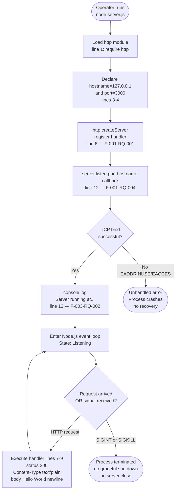

The flow is intentionally linear in the success path: every observable system behavior described in §1.2.2 ("TCP Bind", "Startup Logging", "Request Acceptance", "Static Response Emission") maps to exactly one node in this diagram, and every requirement ID in F-001 through F-003 has a corresponding step.

---

## 4.2 CORE BUSINESS PROCESSES

### 4.2.1 Server Startup Workflow (WF-001)

#### 4.2.1.1 Step-by-Step Process Description

The startup workflow executes the six steps below in strict sequence. Steps 1–4 are synchronous; step 5 is asynchronous and gated by the OS socket allocation; step 6 fires inside the listen callback only on successful bind.

| Step | Line(s) | Operation | Type | Requirement Traceability |
|------|---------|-----------|------|--------------------------|
| 1 | 1 | `require('http')` — loads core HTTP module | Synchronous module load | F-005 (zero deps means core only) |
| 2 | 3 | Declare `hostname = '127.0.0.1'` | Constant assignment | F-001-RQ-002, C-002 |
| 3 | 4 | Declare `port = 3000` | Constant assignment | F-001-RQ-003, C-003 |
| 4 | 6–10 | `http.createServer(handler)` returns Server instance | Synchronous; no network activity | F-001-RQ-001 |
| 5 | 12 | `server.listen(port, hostname, callback)` initiates bind | Asynchronous; OS-bounded | F-001-RQ-004 |
| 6 | 13 | `console.log('Server running at http://127.0.0.1:3000/')` fires | Executes only on successful bind | F-003-RQ-001, F-003-RQ-002 |

#### 4.2.1.2 Startup Workflow Diagram with Swim Lanes

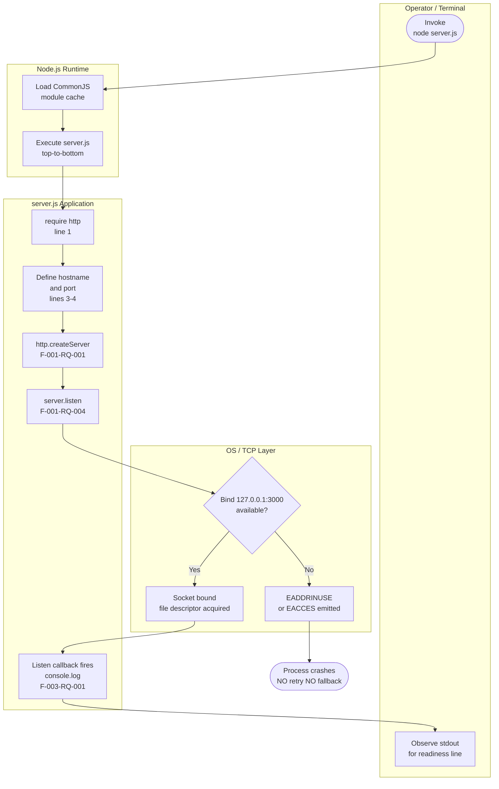

#### 4.2.1.3 Decision Points and Branches

Only one genuine branch point exists in WF-001: the success/failure of the OS-level TCP bind. Per Assumption A-002 (§2.6.1) of this specification, the server has **no fallback port logic; collision causes startup failure**. This decision point therefore has no recovery edge in the success direction — failure is terminal.

### 4.2.2 Request–Response Workflow (WF-002)

#### 4.2.2.1 Step-by-Step Process Description

The handler is registered at startup (line 6 of `server.js`) but executes once per inbound HTTP request. Per F-002-RQ-004, the handler **must not branch on any property of `req`**, which means the workflow is strictly linear with no decision diamonds in the response path.

| Step | Line | Operation | Effect | Requirement |
|------|------|-----------|--------|-------------|
| 1 | n/a | TCP connection accepted by `http` core | Connection object created | Implicit |
| 2 | n/a | Request parsed by `http` core into `req` object | Parser-level; opaque to `server.js` | Implicit |
| 3 | 6 | Handler invoked with `(req, res)` | `req` is **ignored** per F-002-RQ-004 | F-002-RQ-004 |
| 4 | 7 | `res.statusCode = 200` | Sets HTTP status | F-002-RQ-001 |
| 5 | 8 | `res.setHeader('Content-Type', 'text/plain')` | Sets sole response header | F-002-RQ-002 |
| 6 | 9 | `res.end('Hello, World!\n')` | Writes 14-byte body and terminates response | F-002-RQ-003 |

#### 4.2.2.2 Request-Handling Workflow Diagram with Swim Lanes

```mermaid
flowchart TD
    subgraph ClientLane["External Client (Loopback)"]
        ClientSend([Issue HTTP/1.1 request<br/>ANY method ANY path])
        ClientReceive[Receive 200 response<br/>14-byte body])
    end

    subgraph HTTPCoreLane["Node.js http Core Module"]
        AcceptConn[Accept TCP connection<br/>on 127.0.0.1:3000]
        ParseReq[Parse HTTP/1.1<br/>construct req object]
        InvokeH[Invoke registered<br/>handler with req, res]
        FlushResp[Flush response<br/>over socket]
    end

    subgraph HandlerLane["server.js Handler (lines 6-10)"]
        IgnoreReq[req argument<br/>NOT inspected<br/>F-002-RQ-004]
        SetStatus[res.statusCode = 200<br/>F-002-RQ-001]
        SetHeader[res.setHeader<br/>Content-Type text/plain<br/>F-002-RQ-002]
        EndResp[res.end Hello World newline<br/>F-002-RQ-003]
    end

    ClientSend --> AcceptConn
    AcceptConn --> ParseReq
    ParseReq --> InvokeH
    InvokeH --> IgnoreReq
    IgnoreReq --> SetStatus
    SetStatus --> SetHeader
    SetHeader --> EndResp
    EndResp --> FlushResp
    FlushResp --> ClientReceive
```

#### 4.2.2.3 Documented Absence of Decision Points

The following decision points that would conventionally appear in an HTTP request flowchart are **deliberately absent** from this workflow:

| Conventional Decision Point | Status | Evidence |
|------------------------------|--------|----------|
| HTTP method check (`GET`/`POST`/`PUT`/`DELETE`) | Absent | Handler ignores `req.method` per F-002-RQ-004 |
| Path / route matching | Absent | Handler ignores `req.url` per F-002-RQ-004; no router exists |
| Header validation | Absent | No `req.headers` inspection; per §2.4.4 "Input validation: None" |
| Body parsing | Absent | No `req.on('data', ...)` listener registered |
| Authentication check | Absent | No credential handling per §2.4.4 |
| Authorization check | Absent | No role/scope evaluation per §2.4.4 |
| Rate limiting | Absent | No counters, no buckets, no middleware |
| Request logging | Absent | Per §1.3.2: "Only a single `console.log` on startup; no per-request log emission" |
| Conditional caching | Absent | No `ETag`, `Last-Modified`, or `Cache-Control` headers emitted |
| Content negotiation | Absent | `Content-Type` is hardcoded to `text/plain` |

This absence is the design contract of the fixture, not a defect: it guarantees that every request produces a byte-identical response (per F-002-RQ-004 acceptance criterion: "Requests issued with `GET`, `POST`, `PUT`, `DELETE`, `OPTIONS`, etc., to any path produce byte-identical responses").

### 4.2.3 Business Rule Validation per Step

Each step in WF-001 and WF-002 is governed by a small set of explicit validation rules drawn from §2.2 Functional Requirements. The table below consolidates these rules per step, including security-relevant rules.

| Workflow | Step | Business / Data Validation Rule | Security / Compliance Rule | Source |
|----------|------|-----------------------------------|-----------------------------|--------|
| WF-001 | Server construction | Server constructed exactly once per process lifetime | No TLS material provided or expected | F-001-RQ-001 |
| WF-001 | Hostname binding | Hostname is hardcoded literal `127.0.0.1`; must not be parameterized | Loopback binding is the primary network-level security boundary | F-001-RQ-002, C-002 |
| WF-001 | Port binding | Port is hardcoded literal `3000`; must not be parameterized | Port must be reachable only via loopback | F-001-RQ-003, C-003 |
| WF-001 | Listen completion | Listen must complete before any request is accepted | None | F-001-RQ-004 |
| WF-001 | Startup log | Logging occurs exactly once per process lifetime | No sensitive data logged | F-003-RQ-001 |
| WF-001 | Startup log format | Literal scheme `http://` (not `https://`) must appear | Reflects accurate transport (no aspirational TLS) | F-003-RQ-002 |
| WF-002 | Status code | Status code must never deviate from `200`; no error paths exist | No status-code-leaking error information | F-002-RQ-001 |
| WF-002 | Header emission | Header value must be the literal ASCII string `text/plain` | No security headers (CSP, HSTS, X-Frame-Options) | F-002-RQ-002 |
| WF-002 | Body emission | Body must terminate with a single newline (`\n`); body must be exactly 14 bytes | No reflection of user input (none consumed) | F-002-RQ-003 |
| WF-002 | Determinism | Handler must not branch on any property of `req` | Eliminates request-shape-based information disclosure | F-002-RQ-004 |

---

## 4.3 INTEGRATION WORKFLOWS

### 4.3.1 Integration Topology

Per §2.3.2 of this specification, the system has **one** integration point: the inbound `127.0.0.1:3000` HTTP/1.1 socket. There are no outbound integrations of any kind — no DNS lookups, no outbound HTTP calls, no database connections, no message-broker clients, and no telemetry exports.

The full integration topology, reproduced from §3.10.1, decomposes the single-process system into the following inter-component edges:

| From | To | Mechanism | Direction |
|------|-----|-----------|-----------|
| Host OS | Node.js runtime | Process execution (`node` binary) | One-way (spawn) |
| Node.js runtime | `server.js` | CommonJS module loading | One-way (load) |
| `server.js` | `http` core module | `require('http')` | One-way (import) |
| `server.js` | TCP socket layer | `server.listen(3000, '127.0.0.1', ...)` | One-way (bind) |
| `server.js` | stdout | `console.log` | One-way (write) |
| External client (loopback) | `server.js` | HTTP/1.1 request to `127.0.0.1:3000` | Request/response |

### 4.3.2 Inbound HTTP Sequence Diagram

The only meaningful runtime integration sequence is the inbound HTTP request from the loopback client (the "backprop" tooling) to `server.js`. The sequence diagram below traces the full sequence from operator-initiated process spawn through a representative request-response cycle.

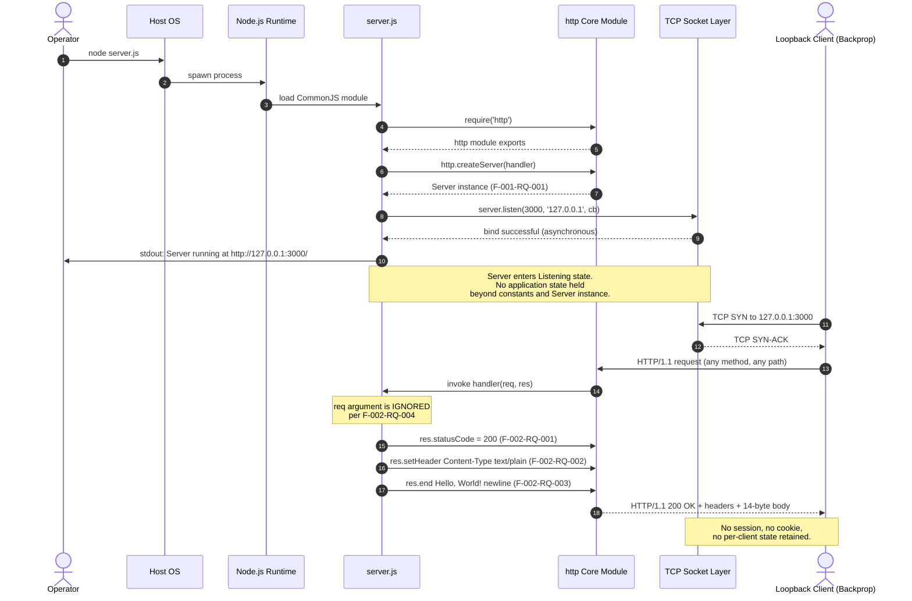

### 4.3.3 Absent Integration Workflows

The following integration patterns are documented as absent and therefore have no flowchart representation. They are listed here so that consumers of this specification have a definitive negative inventory:

| Absent Pattern | Verification |
|----------------|--------------|
| Data flow between systems | No outbound network calls; per §2.3.2 only inbound socket exists |
| External API consumption | No HTTP client used; `http` is imported only for server construction |
| Event processing flows | No event bus, no broker client, no streaming framework |
| Batch processing sequences | No cron, no job queue, no scheduler, no batch script |
| Service-discovery registration | No discovery client referenced in any repository file |
| Telemetry / observability exports | No metrics emitter, no tracing SDK, no log shipper |
| Database read/write workflows | No database driver, no ORM, no connection pool |
| File I/O workflows | No `fs` module usage in `server.js` |

---

## 4.4 ERROR HANDLING AND RECOVERY

### 4.4.1 Documented Absence of Error Handling

Per §1.2.1 and §1.3.2 of this specification, the application contains **no error handling primitives whatsoever**. The implementation does not register an `'error'` event listener on the `http.Server` instance, does not wrap any operation in a `try`/`catch` block, and does not register handlers for `SIGINT` or `SIGTERM`. Consequently, every error that arises during the process lifetime is **unhandled** by the application and propagates to Node.js's default behavior, which is process termination with a non-zero exit code.

This is a deliberate architectural posture, not an oversight. The fixture's role (per §1.2.1) is to provide a **deterministic** static endpoint; introducing error-handling logic would create branches in the workflow that could mask the very behaviors that downstream "backprop integration" tests are intended to observe.

### 4.4.2 Unhandled Error Paths Flowchart

The diagram below enumerates the categories of errors that could arise during the process lifetime and shows that all of them converge on a single terminal outcome: process exit without recovery, retry, fallback, or notification.

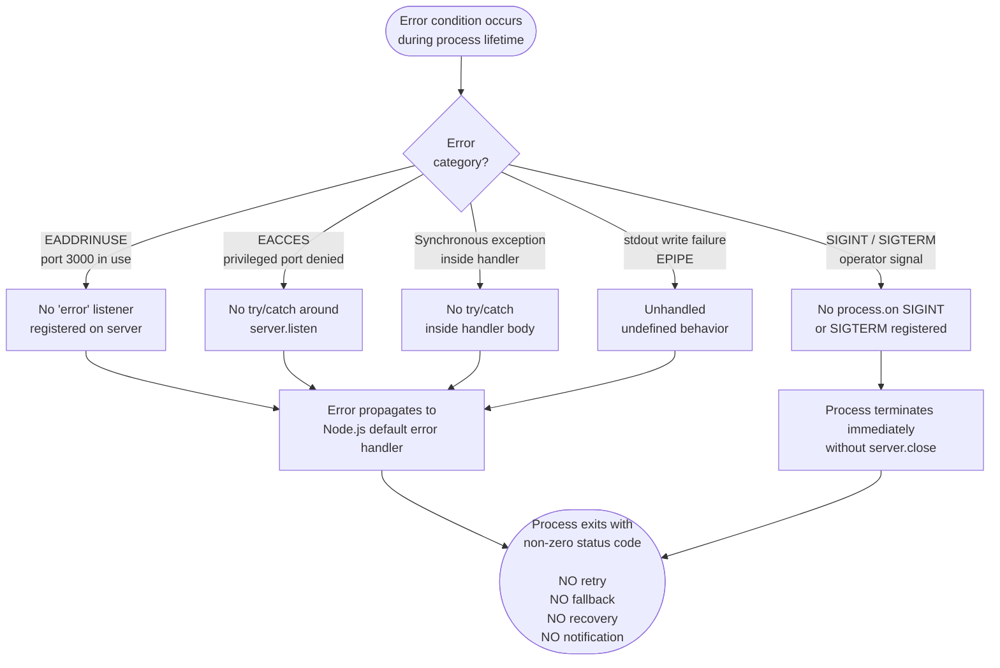

### 4.4.3 Retry, Fallback, and Notification Posture

The table below enumerates the conventional error-handling mechanisms that are **not** present in this system, with the evidentiary source for each absence. Documenting these explicitly is the only honest way to describe the error-handling posture of a system whose author has declared "Do not touch!" and whose specification (§1.2.1) explicitly lists "No error handling, no graceful shutdown, no health checks" among intrinsic limitations.

| Mechanism | Status | Evidence |
|-----------|--------|----------|
| Retry mechanism (exponential backoff, etc.) | Not implemented | No retry library imported; no loop logic in `server.js` |
| Fallback process (alternate port, alternate route) | Not implemented | Per A-002 (§2.6.1): "the server has no fallback port logic; collision causes startup failure" |
| Error notification flow (email/Slack/PagerDuty) | Not implemented | No notification client imported; zero dependencies (F-005) |
| Recovery procedure (restart policy, supervisor) | Not implemented | No process manager configuration (no PM2, no systemd unit, no Docker restart policy) |
| Graceful shutdown | Not implemented | Per §1.3.2: "No `SIGINT` / `SIGTERM` handlers; no `server.close()` invocation" |
| Health check endpoint | Not implemented | Handler ignores `req.url`; no `/health` route can exist |
| Circuit breaker | Not implemented | No downstream calls exist that would warrant one |
| Dead-letter queue | Not implemented | No queue, no messaging integration |

Any recovery from a crash is therefore an **external** concern: the operator (or an external supervisor outside the repository boundary) must re-invoke `node server.js`. This re-invocation is itself a manual repeat of WF-001 and not a workflow encoded inside the system.

---

## 4.5 STATE MANAGEMENT AND TRANSITIONS

### 4.5.1 Application State Posture

Per §1.2.2 of this specification, the server is **fully stateless** and holds no in-memory data structures beyond the constants `hostname`, `port`, and the `server` object reference itself. Per §2.4.3, the **state migration** dimension is "Not applicable (stateless) — No in-memory state to migrate." Consequently, the following conventional state-management concerns have no representation in the system:

| State-Management Concern | Status | Evidence |
|--------------------------|--------|----------|
| Data persistence points | None | No database, no `fs.write`, no in-memory store |
| Caching layer | None | No cache library; static body is a literal compile-time constant |
| Cache invalidation flow | Not applicable | No cache to invalidate |
| Transaction boundaries | None | No DB transactions, no multi-step compound operations |
| Session storage | None | No cookies emitted; no session store |
| Per-client state | None | Handler does not inspect `req`; per §1.3.2 "no per-client state" |
| Cross-request shared state | None | No module-level mutable variables; only immutable constants |

### 4.5.2 Process Lifecycle State Diagram

Although the **application** holds no state, the **process** that hosts the application traverses a deterministic sequence of lifecycle states. These states reflect the position of execution within `server.js` and the status of the underlying TCP socket. The state diagram below captures these transitions explicitly.

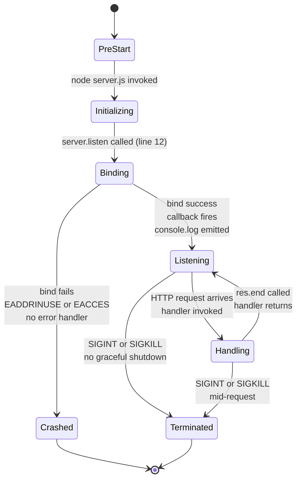

| State | Description | Code Position |
|-------|-------------|---------------|
| `PreStart` | Node.js process not yet spawned | n/a (operator side) |
| `Initializing` | Module load and constant declarations executing | `server.js` lines 1–10 |
| `Binding` | `server.listen()` invoked; OS socket allocation in progress | `server.js` line 12 |
| `Listening` | Bind successful; event loop active; awaiting connections | After listen callback fires |
| `Handling` | Per-request transient state; handler body executing | `server.js` lines 7–9 |
| `Crashed` | Unhandled error during bind; process exits non-zero | n/a (Node.js default behavior) |
| `Terminated` | Operator-initiated process kill; abrupt exit | n/a (no graceful path) |

The `Handling` state is reentrant: each new request causes a transition from `Listening` to `Handling` and back, with no mutation of any module-level state between iterations. This is the operational manifestation of F-002-RQ-004's determinism guarantee.

### 4.5.3 Persistence, Caching, and Transaction Boundaries

As established in §4.5.1, none of these concepts apply to the system. The diagram below documents this absence in flowchart form for completeness, showing that every potential persistence-touching point in WF-002 instead routes to a "no-op" terminator.

```mermaid
flowchart LR
    Req[HTTP request<br/>arrives] --> Q1{Read from<br/>persistence layer?}
    Q1 -->|N/A| Skip1[No persistence layer<br/>exists]
    Skip1 --> Q2{Read from cache?}
    Q2 -->|N/A| Skip2[No cache layer<br/>exists]
    Skip2 --> Q3{Begin transaction?}
    Q3 -->|N/A| Skip3[No transactional<br/>resource exists]
    Skip3 --> Static[Emit static body<br/>Hello, World! newline]
    Static --> Q4{Write to<br/>persistence layer?}
    Q4 -->|N/A| Skip4[No persistence layer<br/>exists]
    Skip4 --> Q5{Update cache?}
    Q5 -->|N/A| Skip5[No cache to update]
    Skip5 --> Q6{Commit transaction?}
    Q6 -->|N/A| Skip6[No transaction<br/>to commit]
    Skip6 --> Resp[Response flushed<br/>to client]
```

This diagram is intentionally redundant; its purpose is to make the *absence* of persistence and transaction boundaries explicit at every place where a conventional Process Flowchart would expect them.

---

## 4.6 VALIDATION, AUTHORIZATION, AND COMPLIANCE CHECKPOINTS

### 4.6.1 Business Rules at Each Step

The complete table of business rules per workflow step is given in §4.2.3 above. Those rules constitute the entirety of business logic in the system. There are no additional business rules expressed as code paths, configuration entries, or runtime data.

### 4.6.2 Authorization Checkpoints

Per §2.4.4 of this specification, the system has **no application-level authentication or authorization**. The sole "checkpoint" that gates access to the service is the **network-level** restriction imposed by the OS in response to the loopback bind. The diagram below illustrates this checkpoint topology.

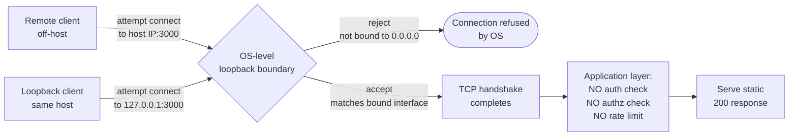

| Checkpoint | Layer | Enforcement | Source |
|------------|-------|-------------|--------|
| Loopback boundary | OS network stack | Reject connections to bound interface `127.0.0.1` from any non-local source | F-001-RQ-002, §2.4.4 |
| Application-layer authentication | Application | **None** | §2.4.4 "Authentication: None" |
| Application-layer authorization | Application | **None** | §2.4.4 "Authorization: None" |
| Rate limiting / throttling | Application | **None** | No middleware, no counters |
| Token / credential validation | Application | **None** | No credential code paths |

Weakening the loopback boundary (e.g., changing the hostname constant to `0.0.0.0`) would invalidate the entire security posture and is therefore prohibited by C-002 (§2.6.2) and the README's "Do not touch!" directive (F-006-RQ-004).

### 4.6.3 Data Validation Requirements

Per §2.4.4, "Input validation: None (request is ignored) — No input is consumed, eliminating injection surfaces." Because the handler does not inspect any property of `req` (F-002-RQ-004), there is no input to validate. Output validation is implicit in the use of compile-time string literals: the status code `200`, the header value `text/plain`, and the body `Hello, World!\n` are all literal constants that cannot be perturbed at runtime.

| Data Element | Validation Required? | Mechanism |
|--------------|----------------------|-----------|
| `req.method` | No | Argument ignored |
| `req.url` | No | Argument ignored |
| `req.headers` | No | Argument ignored |
| Request body | No | No body parser registered |
| Response status code | Compile-time | Literal `200` per F-002-RQ-001 |
| Response header value | Compile-time | Literal `'text/plain'` per F-002-RQ-002 |
| Response body | Compile-time | Literal `'Hello, World!\n'` (14 bytes) per F-002-RQ-003 |

### 4.6.4 Regulatory Compliance Checks

No regulatory compliance regime is referenced anywhere in the repository (no GDPR text, no HIPAA notice, no PCI-DSS markers, no SOC-2 evidence collection). The system processes no personal data (request bodies are not consumed), stores nothing, transmits nothing beyond the static literal `"Hello, World!\n"`, and emits no telemetry. Consequently, no compliance checkpoint exists in any workflow. This absence is consistent with the system's role as a local test fixture and is enforced architecturally by the limitations enumerated in §1.2.1 and §1.3.2.

---

## 4.7 TIMING AND SLA CONSIDERATIONS

### 4.7.1 Per-Step Timing Characteristics

Per §2.4.2 of this specification, **no quantitative performance targets** — throughput, latency, concurrency, or memory ceilings — are documented anywhere in the repository. The implicit timing characteristics, drawn from §2.2 and §2.4.2, are summarized below and are the only timing constraints applicable to any workflow step.

| Workflow | Step | Performance Characteristic | Source |
|----------|------|----------------------------|--------|
| WF-001 | `http.createServer()` | Synchronous; sub-millisecond | F-001-RQ-001 Technical Spec |
| WF-001 | `server.listen()` bind | Asynchronous; bounded by OS socket allocation | F-001-RQ-002, F-001-RQ-003 |
| WF-001 | Listen callback / `console.log` | Sub-millisecond after bind | F-003-RQ-001 |
| WF-002 | Status code assignment | Sub-millisecond, in-memory | F-002-RQ-001 |
| WF-002 | Header emission | Sub-millisecond, in-memory | F-002-RQ-002 |
| WF-002 | Body emission (`res.end`) | Sub-millisecond, in-memory; constant-time | F-002-RQ-003, F-002-RQ-004 |

### 4.7.2 SLA Posture

Per §1.2.3, "No KPIs, SLAs, throughput targets, latency budgets, or quality-of-service metrics are documented in the repository." The system's performance is bounded only by the natural capabilities of the Node.js `http` core module on the host system, and any quantitative performance expectations must be defined externally by the consumer (the "backprop integration" tooling) rather than inside this repository.

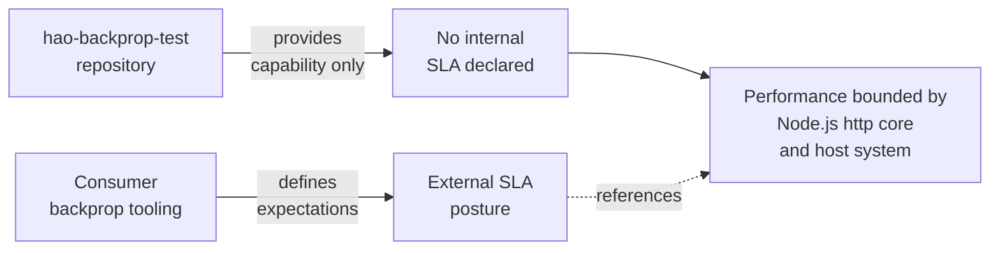

This separation of concerns is intentional: the fixture provides a deterministic, low-latency static endpoint, and any latency budget or throughput requirement is a property of the **integration**, not of the fixture itself.

---

## 4.8 REFERENCES

### 4.8.1 Files Examined

- `server.js` — Sole runtime file (14 lines). Provided the complete startup sequence (lines 1, 3, 4, 6, 12, 13), the request handler logic (lines 7, 8, 9), the hardcoded `hostname` and `port` constants, and the listen-callback structure used in WF-001, WF-002, WF-003, and the state diagram in §4.5.2.
- `package.json` — NPM manifest (11 lines). Used to confirm the absence of a `start` script (relevant to WF-001 invocation), the absence of `engines` constraints, and the documented `main: "index.js"` inconsistency noted alongside §4.2.1.
- `package-lock.json` — NPM lockfile (lockfileVersion 3, 13 lines). Used to confirm zero dependencies (F-005), which substantiates the absence of any imported retry, validation, or notification library in §4.4.3.
- `README.md` — Project documentation (2 lines). Established the "Do not touch!" immutability directive that governs every absent workflow listed in §4.1.1, §4.4.3, and §4.6.2.

### 4.8.2 Folders Explored

- `/` (repository root, depth 0) — Confirmed no subdirectories exist; the entire repository is the four files enumerated above. No additional flowcharts can be derived from non-existent submodules.

### 4.8.3 Technical Specification Sections Cross-Referenced

- **§1.2 SYSTEM OVERVIEW** — Source of the existing high-level integration diagram (§1.2.1), the high-level description of system capabilities (§1.2.2), and the explicit "no KPIs/SLAs" statement (§1.2.3) referenced in §4.7.2.
- **§1.3 SCOPE** — Source of the comprehensive out-of-scope inventory (§1.3.2) used to justify absent workflows in §4.1.1, §4.2.2.3, §4.3.3, §4.4.1, §4.4.3, and §4.6.
- **§2.1 FEATURE CATALOG** — Source of feature IDs F-001 through F-006 referenced throughout this section.
- **§2.2 FUNCTIONAL REQUIREMENTS** — Source of requirement IDs (e.g., F-001-RQ-001, F-002-RQ-004, F-003-RQ-001) used as traceability anchors in §4.2.1.1, §4.2.2.1, §4.2.3, and the swim-lane diagrams.
- **§2.3 FEATURE RELATIONSHIPS** — Source of the single-integration-point assertion (§2.3.2) used in §4.3.1, and the shared-constants observation (§2.3.3) reflected in §4.5.1.
- **§2.4 IMPLEMENTATION CONSIDERATIONS** — Source of constraints (§2.4.1), the absent SLA posture (§2.4.2), the stateless declaration (§2.4.3), and the security posture (§2.4.4) referenced in §4.5, §4.6, and §4.7.
- **§2.6 ASSUMPTIONS AND CONSTRAINTS** — Source of A-002 (no fallback port logic) referenced in §4.2.1.3, and constraints C-002/C-003 (hardcoded host/port) referenced in §4.2.3 and §4.6.2.
- **§3.10 STACK INTEGRATION REQUIREMENTS** — Source of the complete integration topology table reproduced in §4.3.1.

# 5. System Architecture

## 5.1 HIGH-LEVEL ARCHITECTURE

### 5.1.1 System Overview

#### 5.1.1.1 Architectural Style and Rationale

The `hao-backprop-test` repository realizes a **monolithic, single-process, single-file Node.js HTTP server** whose entire executable surface is contained in `server.js` (14 lines). This style is not an accident of scale; it is a deliberate posture motivated by the system's role as a deterministic test fixture for an external "backprop integration" consumer. Every alternative architectural style — microservices, layered service, hexagonal, event-driven, plugin-based — would introduce moving parts that could degrade the system's two non-negotiable properties: **behavioral stability** (byte-identical response on every request) and **source invariance** (the README explicitly states "Do not touch!").

The architecture can be characterized along the following orthogonal axes:

- **Topology**: Single-process, single-file monolith
- **State posture**: Fully stateless — the application holds no mutable in-memory state and no persistent state
- **Concurrency model**: Node.js native event loop (single-threaded with non-blocking I/O); no `cluster` module, no `worker_threads`
- **Network exposure**: Loopback-only binding to `127.0.0.1:3000`; unreachable from non-local clients
- **Dependency posture**: Zero runtime and zero development npm dependencies; uses only Node.js core modules
- **Module system**: CommonJS exclusively (no ECMAScript Modules, no `.mjs`, no `"type": "module"` declaration)
- **Determinism contract**: Request handler is forbidden from branching on any property of the incoming request (per F-002-RQ-004)

The rationale for each axis is the same: minimize the number of behaviors that downstream "backprop integration" tests could observe so that the fixture itself never becomes a source of variance.

#### 5.1.1.2 Key Architectural Principles and Patterns

The system embodies six architectural principles, each enforced by the constraints catalogued in §2.6.2 of this specification:

| Principle | Enforcement Mechanism | Source Constraint |
|-----------|----------------------|-------------------|
| Behavioral stability | Handler ignores `req`; response is a compile-time literal | F-002-RQ-004, C-004 |
| Source invariance | Repository governance directive | C-001 (README: "Do not touch!") |
| Operational simplicity | No install step, no build step, no transpile step | C-005, C-006 |
| Defense by minimalism | Zero dependencies + loopback-only binding | C-002, C-005 |
| Determinism | Handler must not inspect request properties | F-002-RQ-004 |
| Self-containment | Entire system fits in four files at repository root | C-001 |

The system applies a small number of well-recognized patterns: the **Reactor Pattern** (inherited from Node.js's event loop), the **Single Responsibility Principle** at the file level (one file = the entire server), and what may be termed the **"Negative Architecture" pattern** — the deliberate, documented exclusion of features (routing, middleware, error handling, logging frameworks, caching, persistence, authentication) that a non-fixture system would normally include.

#### 5.1.1.3 System Boundaries and Major Interfaces

The system has exactly **one inbound interface and zero outbound interfaces**. The boundaries are summarized below:

| Boundary | Definition | Crossing Mechanism |
|----------|------------|--------------------|
| Process boundary | One Node.js process executing `server.js` | OS process spawn via `node server.js` |
| Network boundary | TCP socket bound to `127.0.0.1:3000` | HTTP/1.1 over loopback |
| Data boundary | A single static UTF-8 string (`"Hello, World!\n"`, 14 bytes) | Response body emission via `res.end()` |
| Governance boundary | Four-file repository surface | README "Do not touch!" directive |

There is **no outbound interface**: no HTTP client calls, no DNS lookups, no database connections, no message brokers, no telemetry exporters, no cloud SDKs, and no service-discovery registration.

#### 5.1.1.4 High-Level Architecture Diagram

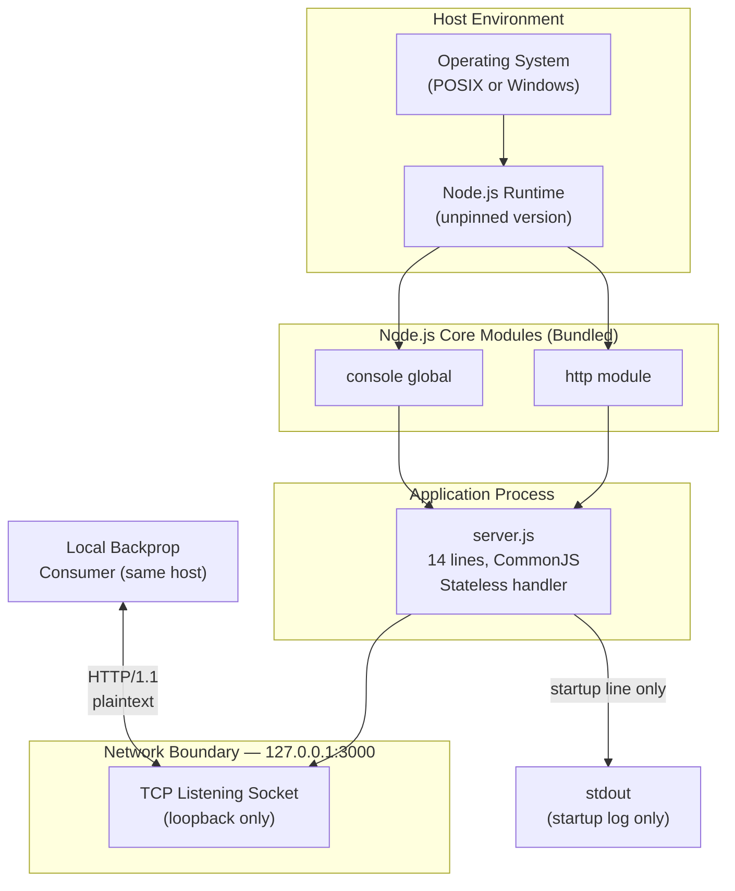

### 5.1.2 Core Components Table

The system is composed of one runtime component and three metadata or documentation artifacts. Each is listed below with its primary responsibility, key dependencies, and critical considerations.

| Component Name | Primary Responsibility | Key Dependencies | Critical Considerations |
|----------------|------------------------|------------------|--------------------------|
| **HTTP Server** (`server.js`) | Sole runtime executable; accepts loopback HTTP requests and emits a static 14-byte response | Node.js core `http` module; `console` global | Must remain byte-invariant per C-001; handler must not branch on `req` per F-002-RQ-004 |
| **Package Manifest** (`package.json`) | Declares package identity (name `hello_world`, version `1.0.0`), author, MIT license, and a placeholder test script | npm-compatible tooling for parsing | Declares `main: "index.js"` despite no `index.js` existing — actual entry is `server.js`; omits `dependencies` and `devDependencies` fields entirely |
| **Dependency Lockfile** (`package-lock.json`) | Locks the dependency tree at npm lockfile v3; cryptographically attests an empty dependency graph | npm v7+ for lockfile v3 generation/consumption | The `packages` tree contains only the root `""` entry — verifiable proof of zero dependencies (F-005, C-005) |
| **Project Documentation** (`README.md`) | Establishes project identity and the "Do not touch!" governance directive | None (plain Markdown) | Source-invariance constraint C-001 derives directly from this file |

Within the single runtime component `server.js`, five logically distinct sub-components can be identified by line number:

| Sub-component | Lines | Responsibility |
|---------------|-------|----------------|
| Module import | 1 | `require('http')` — loads core HTTP module |
| Configuration constants | 3–4 | Declares hardcoded `hostname` and `port` literals |
| Server constructor + handler | 6–10 | `http.createServer((req, res) => { ... })` |
| Listen invocation | 12 | `server.listen(port, hostname, callback)` — initiates TCP bind |
| Startup log callback | 13 | Single `console.log` of readiness message |

### 5.1.3 Data Flow Description

#### 5.1.3.1 Startup Data Flow

When an operator invokes `node server.js`, the Node.js runtime spawns a process and loads `server.js` as a CommonJS module. The module executes top-to-bottom: it requires the `http` core module, declares two constant literals (`hostname = '127.0.0.1'` and `port = 3000`), constructs a `Server` instance by passing a handler function to `http.createServer()`, and then invokes `server.listen(port, hostname, callback)` to initiate an asynchronous TCP bind. Control returns to the Node.js event loop. When the operating system successfully allocates the socket on `127.0.0.1:3000`, the listen callback fires and writes a single readiness line to standard output via `console.log`. From that point forward the process remains in the `Listening` state, awaiting incoming connections.

If the TCP bind fails (for example with `EADDRINUSE` or `EACCES`), the error is not caught — no `'error'` listener is registered on the `Server` instance — and the process exits with a non-zero status code.

#### 5.1.3.2 Request/Response Data Flow

Every inbound HTTP request follows an identical, branchless path. The Node.js `http` core module accepts the TCP connection on the loopback socket, parses the HTTP/1.1 request line and headers into a `req` object, constructs the `res` object, and invokes the registered handler with both arguments. The handler **does not inspect the `req` argument** (this is mandated by F-002-RQ-004 as a determinism guarantee). It then performs three synchronous operations in order: assigns `res.statusCode = 200`, calls `res.setHeader('Content-Type', 'text/plain')`, and calls `res.end('Hello, World!\n')`. The 14-byte body is flushed by the `http` core module over the open socket, and the connection terminates per HTTP/1.1 semantics. The handler returns control to the event loop, ready to service the next request.

#### 5.1.3.3 Data Transformation Points

The system contains **no data transformation points within the application**. No serialization, no validation, no enrichment, no encoding/decoding, and no schema mapping occurs on the request or response paths. The only transformation that takes place anywhere in the codebase is the template-literal interpolation of `hostname` and `port` into the startup log string `` `Server running at http://${hostname}:${port}/` `` — and this executes exactly once per process lifetime, not on the request path.

#### 5.1.3.4 Data Stores and Caches

The system has **no data stores and no caches**. There is no database, no in-memory key-value store, no file-system persistence, no session storage, no HTTP-level cache, and no CDN. The only "memory" in the application is three module-level immutable references: the `hostname` string, the `port` number, and the `server` object. Per §4.5.1, the application is fully stateless and the state-migration dimension is not applicable.

### 5.1.4 External Integration Points

The system has exactly one external integration point — an inbound HTTP/1.1 listener — and no outbound integrations of any kind.

| System Name | Integration Type | Data Exchange Pattern | Protocol / Format |
|-------------|------------------|------------------------|--------------------|
| Local "backprop" consumer (unspecified) | Inbound HTTP listener on loopback | Synchronous request/response, one-shot per connection | HTTP/1.1 plaintext; `text/plain` response body |

**SLA requirements**: No service-level agreements, throughput targets, latency budgets, or QoS metrics are documented anywhere in the repository. Performance is bounded only by the Node.js `http` core implementation on the host system. All steps in the request path are in-memory, synchronous, and constant-time, so per-request latency is dominated by socket I/O rather than by any application logic.

**Negative integration inventory** (explicit absences confirmed by §3.5):

- No outbound HTTP calls (no `http.request`, `fetch`, `axios`, or equivalent)
- No DNS lookups
- No database, ORM, or data-access layer
- No message brokers (Kafka, RabbitMQ, SQS) or event streams
- No telemetry exporters (OpenTelemetry, Prometheus, DataDog)
- No service-discovery registration
- No CDN, no email/SMS, no payment processors
- No AI/LLM service integrations
- No cloud SDKs (AWS, GCP, Azure)
- No configuration servers (Consul, Parameter Store)
- No identity providers (Auth0, OIDC, SAML)

---

## 5.2 COMPONENT DETAILS

### 5.2.1 HTTP Server (`server.js`)

#### 5.2.1.1 Purpose and Responsibilities

`server.js` is the sole runtime executable of the system. Its purpose is to bind a TCP listening socket on `127.0.0.1:3000` and respond to every inbound HTTP request with an identical 14-byte `text/plain` payload. It fulfills features F-001 (server construction and binding), F-002 (static response emission), and F-003 (single startup log line).

#### 5.2.1.2 Technologies and Frameworks Used

| Aspect | Choice |
|--------|--------|
| Language | JavaScript (ES2015+ syntax: `const`, arrow functions, template literals) |
| Module system | CommonJS (`require`) |
| Runtime | Node.js (unpinned — no `engines` field in `package.json`) |
| Web framework | None — Node.js core `http` module only |
| External libraries | None |

#### 5.2.1.3 Key Interfaces and APIs

The complete inventory of Node.js core APIs invoked by `server.js`:

| API | Purpose | Source Line |
|-----|---------|-------------|
| `http.createServer(handler)` | Constructs the `Server` instance | Line 6 |
| `server.listen(port, hostname, cb)` | Initiates the TCP bind | Line 12 |
| `res.statusCode = 200` | Assigns the HTTP status code | Line 7 |
| `res.setHeader(name, value)` | Emits the sole response header | Line 8 |
| `res.end(body)` | Writes the body and closes the response | Line 9 |
| `console.log(message)` | Emits the single startup readiness line | Line 13 |

The exposed network interface is HTTP/1.1 plaintext on `127.0.0.1:3000`. No other interfaces are exposed; `server.js` declares no `module.exports`, so it cannot be imported by other modules.

#### 5.2.1.4 Data Persistence Requirements

None. The component performs no I/O against any persistence layer. The only data it produces is the response body (a compile-time literal) and the startup log line (a template-literal interpolation of constants).

#### 5.2.1.5 Scaling Considerations

| Scalability Dimension | Position |
|-----------------------|----------|
| Horizontal scaling | Not supported — no clustering, no process-manager configuration |
| Vertical scaling | Bounded by single-process Node.js event-loop limits |
| Concurrency model | Single event-loop process; no `cluster` or `worker_threads` |
| State migration | Not applicable — fully stateless |
| Load distribution | Not applicable — loopback binding precludes external load distribution |

### 5.2.2 Package Manifest (`package.json`)

#### 5.2.2.1 Purpose and Responsibilities

Declares the package identity (`hello_world` v1.0.0), author (`hxu`), MIT license, and a placeholder `test` script. It also declares `main: "index.js"` — a value that is intentionally preserved despite the absence of any `index.js` file in the repository (per assumption A-004).

#### 5.2.2.2 Technologies and Frameworks Used

Plain JSON conforming to the npm `package.json` schema. No `dependencies`, `devDependencies`, `peerDependencies`, `optionalDependencies`, or `engines` fields are present.

#### 5.2.2.3 Key Interfaces and APIs

The manifest is consumed by npm-compatible tooling at parse time but has no runtime effect on `server.js` (which is invoked directly via `node server.js`, not through the `main` field). The `test` script returns a non-zero exit code by design.

### 5.2.3 Dependency Lockfile (`package-lock.json`)

#### 5.2.3.1 Purpose and Responsibilities

Locks the dependency tree at npm lockfile format version 3. Its `packages` map contains only the root entry (`""`), constituting a cryptographic attestation that the project has zero installed dependencies. This file enforces the zero-install posture (constraint C-006) by giving any future `npm install` invocation a deterministic empty graph to verify against.

#### 5.2.3.2 Technologies and Frameworks Used

Plain JSON conforming to npm lockfile v3 schema (npm v7+).

#### 5.2.3.3 Key Interfaces and APIs

Consumed by npm during install verification. Not consumed at runtime by `server.js`.

### 5.2.4 Project Documentation (`README.md`)

#### 5.2.4.1 Purpose and Responsibilities

Establishes the system's identity (`hao-backprop-test`), declares its role ("test project for backprop integration"), and issues the source-invariance directive ("Do not touch!"). This file is the textual origin of constraint C-001 — the most consequential constraint governing every other architectural decision in this specification.

#### 5.2.4.2 Technologies and Frameworks Used

Plain Markdown. No special tooling.

### 5.2.5 Component Interaction Diagram

The following diagram shows how the runtime sub-components of `server.js` interact with the Node.js core modules and the operating-system resources during both the startup phase and the request-handling phase.

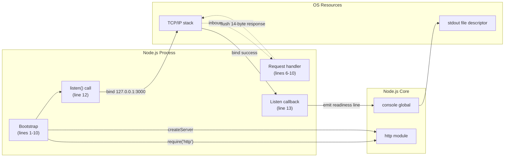

### 5.2.6 Process State Transitions

Although the **application** holds no state, the **process** that hosts the application traverses a deterministic sequence of lifecycle states. The diagram below — consistent with §4.5.2 — captures these transitions explicitly.


| State | Description | Code Position |
|-------|-------------|---------------|
| `PreStart` | Node.js process not yet spawned | n/a (operator side) |
| `Initializing` | Module load and constant declarations executing | `server.js` lines 1–10 |
| `Binding` | `server.listen()` invoked; OS socket allocation in progress | `server.js` line 12 |
| `Listening` | Bind successful; event loop active; awaiting connections | After listen callback fires |
| `Handling` | Per-request transient state; handler body executing | `server.js` lines 7–9 |
| `Crashed` | Unhandled error during bind; process exits non-zero | n/a (Node.js default behavior) |
| `Terminated` | Operator-initiated kill; abrupt exit | n/a (no graceful path) |

The `Handling` state is reentrant: each new request causes a transition from `Listening` to `Handling` and back, with no mutation of any module-level state between iterations. This is the operational manifestation of the F-002-RQ-004 determinism guarantee.

### 5.2.7 Sequence Diagrams for Key Flows

#### 5.2.7.1 Server Startup Sequence (WF-001)

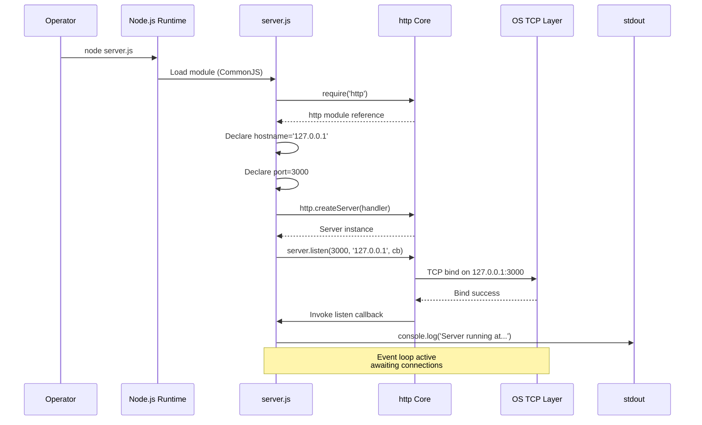

#### 5.2.7.2 Request/Response Sequence (WF-002)

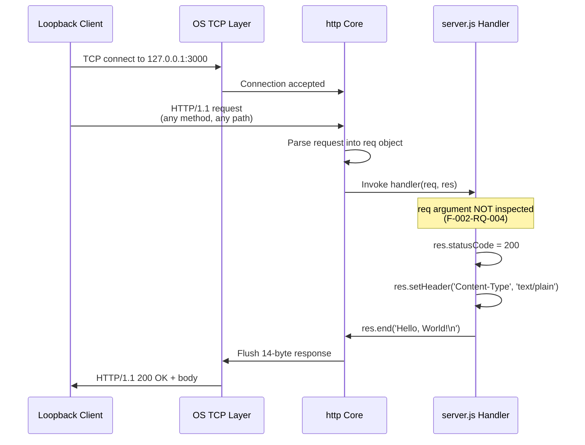

---

## 5.3 TECHNICAL DECISIONS

### 5.3.1 Architecture Style Decisions

The decision to adopt a monolithic, single-file architecture is the foundational architectural choice from which all subsequent decisions flow. The principal style decisions and their tradeoffs are tabulated below.

| Decision | Rationale | Tradeoff Accepted |
|----------|-----------|-------------------|
| Monolithic single-file | Maximizes simplicity; aligns with source-invariance constraint C-001 | No modularity, no unit testability, no library reuse |
| Stateless handler | Guarantees byte-identical response per F-002-RQ-004 | Cannot support sessions, per-client state, or caching |
| Single-process (no clustering) | Aligns with deterministic-test-fixture role | No horizontal scaling, no multi-core utilization |
| Synchronous callback-based handler | Simpler than async/await; preserves call-site clarity | Slightly older idiom than modern async patterns |
| CommonJS modules | Default for Node.js without `"type": "module"`; no transpile step | No top-level await, no ESM interop |

### 5.3.2 Communication Pattern Choices

| Pattern | Choice | Rationale |
|---------|--------|-----------|
| Network protocol | HTTP/1.1 plaintext via core `http` module | Sufficient for static response; no TLS overhead, no certificate provisioning |
| Wire format | UTF-8 `text/plain` | Trivial to consume; no parsing required by client |
| Request/response model | Synchronous one-shot per connection | No streaming, no WebSocket, no Server-Sent Events needed |
| Direction | Inbound only | Aligns with fixture role; no external dependencies at runtime |
| Routing | None — single handler for all paths and methods | Per F-002-RQ-004: requests issued with `GET`, `POST`, `PUT`, `DELETE`, `OPTIONS`, etc. to any path produce byte-identical responses |

### 5.3.3 Data Storage Solution Rationale

**No storage solution was chosen** because no data persists in the system. The static response body is a compile-time string literal embedded in `server.js`. Introducing any storage layer — relational, document, key-value, or file-system-based — would:

1. Violate constraint C-001 (files must remain unchanged from the committed baseline)
2. Violate constraint C-005 (zero runtime dependencies must be maintained)
3. Violate constraint C-006 (project must remain executable without `npm install`)
4. Introduce a new failure mode that could compromise the determinism guarantee of F-002-RQ-004

The decision to use no storage is therefore not a deferred decision but a permanent architectural property of the system.

### 5.3.4 Caching Strategy Justification

**No caching layer is implemented**, and this is the correct design choice for three converging reasons:

1. **The static body is already a literal constant** in source code. There is no upstream source from which to cache, and a cache hit could not be faster than reading a string already resident in memory.
2. **No HTTP-level caching headers are emitted** (`ETag`, `Last-Modified`, `Cache-Control` are all absent). Emitting them would conflict with the F-002-RQ-004 determinism requirement that every response be byte-identical regardless of request shape.
3. **No external data source exists** that would warrant client-side, server-side, CDN, or reverse-proxy caching.

### 5.3.5 Security Mechanism Selection

The system adopts a posture of **"defense by minimalism"** — the absence of attack surface is itself the security control. The three layered controls (in priority order) are:

| Control | Mechanism | Implementation |
|---------|-----------|----------------|
| Network-layer isolation | Loopback-only bind (`127.0.0.1`) | Hardcoded literal in `server.js` line 3 (per constraint C-002) |
| Supply-chain elimination | Zero dependencies | `package.json` omits `dependencies`/`devDependencies`; `package-lock.json` `packages` tree contains only root entry |
| Injection-surface elimination | Request input never read | Handler ignores `req` per F-002-RQ-004; no `req.url`, `req.headers`, `req.method`, or body parsing |

Conventional application-layer security mechanisms (TLS, authentication tokens, authorization scopes, rate limiting, CSRF protection, input validation, output encoding, security headers such as CSP/HSTS/X-Frame-Options) are **not implemented**. Per assumption A-005, this stance presupposes that no security review of plaintext loopback HTTP is required for the fixture's role.

### 5.3.6 Architecture Decision Records (ADRs)

The following ADRs formally document the principal architectural decisions and the constraints that compelled them.

#### 5.3.6.1 ADR-001: Use Node.js Core `http` Module Instead of an External Framework

| Field | Value |
|-------|-------|
| Status | Accepted (enforced by C-005) |
| Context | An HTTP listener is required to satisfy F-001; popular options are Express, Koa, Fastify, Hapi, or Node.js core `http` |
| Decision | Use Node.js core `http` exclusively |
| Consequences | Eliminates ~30+ transitive packages that Express alone would introduce; preserves zero-install posture; restricts API surface to ~5 stable core APIs |

#### 5.3.6.2 ADR-002: Bind to `127.0.0.1` Loopback Only

| Field | Value |
|-------|-------|
| Status | Accepted (enforced by C-002) |
| Context | The fixture must accept HTTP connections; binding to `0.0.0.0` would expose the listener on all interfaces |
| Decision | Bind exclusively to `127.0.0.1` (hardcoded literal) |
| Consequences | Listener is unreachable from non-local clients; becomes the primary and only network-level security boundary; aligns with assumption A-003 (consumer is on the same host) |

#### 5.3.6.3 ADR-003: Hardcode Hostname and Port Literals

| Field | Value |
|-------|-------|
| Status | Accepted (enforced by C-002, C-003) |
| Context | Hostname and port could be environment-overridable via `process.env` |
| Decision | Hardcode `'127.0.0.1'` and `3000` as `const` literals |
| Consequences | No configuration drift possible; byte-identical startup log every invocation; loss of deployment flexibility (acceptable for fixture role) |

#### 5.3.6.4 ADR-004: Defer All Error Handling to Node.js Default Behavior

| Field | Value |
|-------|-------|
| Status | Accepted |
| Context | Node.js permits explicit error handling via `'error'` listeners, `try`/`catch` blocks, and signal handlers |
| Decision | Register no error handlers; allow all errors to propagate to Node.js's default behavior (process exit, non-zero status) |
| Consequences | No graceful shutdown; no fallback port; no retry; recovery becomes an external operator concern — but eliminates all branching that could mask the deterministic behavior under test |

#### 5.3.6.5 ADR-005: Maintain Zero Runtime and Zero Development Dependencies

| Field | Value |
|-------|-------|
| Status | Accepted (enforced by C-005, F-005) |
| Context | npm provides a rich ecosystem; even logging or testing libraries are conventionally added |
| Decision | Maintain `package.json` with neither `dependencies` nor `devDependencies` fields; lockfile attests empty tree |
| Consequences | Project runs on any Node.js install with no `npm install`; no supply-chain attack vector; no test framework, no linter, no formatter |

#### 5.3.6.6 ADR-006: Adopt Source Invariance as a Governance Constraint

| Field | Value |
|-------|-------|
| Status | Accepted (enforced by C-001 / README) |
| Context | The repository must serve as a stable reference fixture for downstream integration |
| Decision | All four committed files must remain unchanged from baseline ("Do not touch!") |
| Consequences | Documented inconsistencies (e.g., `package.json` `main: "index.js"` with no `index.js` file) are preserved rather than corrected; all future architectural work is documentation-only |

### 5.3.7 Decision Tree for Framework Selection

The diagram below traces the decision logic that yielded the current architecture. Every "Yes" branch toward a conventional choice was rejected because of an explicit constraint; only the "No" branches survive.

```mermaid
flowchart TD
    Q1{Do we need<br/>an HTTP server?}
    Q1 -->|"Yes (F-001)"| Q2{Adopt an external<br/>framework?}
    Q2 -->|"No: violates C-005"| Core["Use Node.js core http module"]
    Q2 -->|"Yes"| RejFW["REJECTED:<br/>Express/Koa/Fastify add<br/>transitive dependencies<br/>(violates F-005, C-005)"]
    Core --> Q3{Need TLS<br/>(HTTPS)?}
    Q3 -->|"No: loopback only<br/>per A-005"| Plain["Plaintext HTTP/1.1"]
    Q3 -->|"Yes"| RejTLS["REJECTED:<br/>No TLS material;<br/>loopback transit"]
    Plain --> Q4{Need request<br/>routing?}
    Q4 -->|"No: single static response<br/>per F-002-RQ-004"| OneHandler["Single handler that<br/>ignores req"]
    Q4 -->|"Yes"| RejRoute["REJECTED:<br/>Violates determinism<br/>guarantee"]
    OneHandler --> Q5{Need persistence<br/>or caching?}
    Q5 -->|"No: response is<br/>compile-time literal"| NoState["No storage layer<br/>No cache"]
    Q5 -->|"Yes"| RejStore["REJECTED:<br/>Violates C-001, C-005"]
    NoState --> Final([Final: monolithic,<br/>single-file,<br/>stateless,<br/>loopback-only])
```

---

## 5.4 CROSS-CUTTING CONCERNS

### 5.4.1 Monitoring and Observability Approach

The system implements **no monitoring or observability primitives**. Every conventional observability surface is deliberately absent, as documented below.

| Aspect | Status | Evidence |
|--------|--------|----------|
| Metrics emission | None | No Prometheus, no StatsD, no OpenTelemetry import |
| Distributed tracing | None | No tracing SDK; no propagation of trace context headers |
| Health-check endpoint | None | Handler ignores `req.url`, so `/health` cannot be served distinctly |
| Per-request logging | None | Only a single startup `console.log` is emitted |
| Log shipping | None | stdout only; no log aggregation agent |
| Application performance monitoring | None | No APM agent (New Relic, DataDog, AppDynamics) |

The downstream "backprop integration" consumer must therefore infer the system's health by observing the HTTP response itself (connection success and a `200` status) rather than by querying any observability endpoint exposed by the system.

### 5.4.2 Logging and Tracing Strategy

The logging strategy consists of a single operation. The diagram below summarizes the strategy in full.

| Aspect | Specification |
|--------|---------------|
| Logging operation | `console.log` in the listen callback (`server.js` line 13) |
| Log format | Template-literal interpolation: `` `Server running at http://${hostname}:${port}/` `` |
| Frequency | Exactly once per process lifetime, at startup |
| Levels | None (no `info`/`warn`/`error`/`debug` distinction) |
| Structure | Plain text (no JSON, no key/value structured fields) |
| Rotation | None (writes to stdout, externally managed if at all) |
| Tracing | None (no spans, no correlation IDs, no W3C Trace Context) |

The literal scheme `http://` (not `https://`) must appear in the log line per F-003-RQ-002, accurately reflecting the actual transport without aspirational TLS.

### 5.4.3 Error Handling Patterns

#### 5.4.3.1 Documented Absence of Error Handling

Per §4.4.1, the application contains **no error handling primitives whatsoever**. The implementation does not register an `'error'` event listener on the `http.Server` instance, does not wrap any operation in a `try`/`catch` block, and does not register handlers for `SIGINT` or `SIGTERM`. Consequently, every error that arises during the process lifetime is unhandled by the application and propagates to Node.js's default behavior, which is process termination with a non-zero exit code.

This is a deliberate architectural posture, not an oversight. Introducing error-handling logic would create branches in the workflow that could mask the very behaviors that downstream "backprop integration" tests are intended to observe.

The complete inventory of error categories and their (absent) handlers:

| Error Category | Trigger | Handler Status |
|----------------|---------|----------------|
| `EADDRINUSE` | Port 3000 already bound on loopback | No `'error'` listener — process crashes |
| `EACCES` | Privileged port denied (would not normally occur on port 3000) | No `try`/`catch` — process crashes |
| Synchronous exception in handler | Hypothetical — impossible given current 3-line handler body | Would propagate — process crashes |
| `SIGINT` / `SIGTERM` | Operator signal | No signal handler — abrupt termination, no `server.close()` |
| `EPIPE` on stdout write | stdout closed by external process | No handler — undefined behavior |

#### 5.4.3.2 Error Handling Flow Diagram

The diagram below — consistent with §4.4.2 — enumerates the categories of errors that could arise during the process lifetime and shows that all of them converge on a single terminal outcome: process exit without recovery, retry, fallback, or notification.

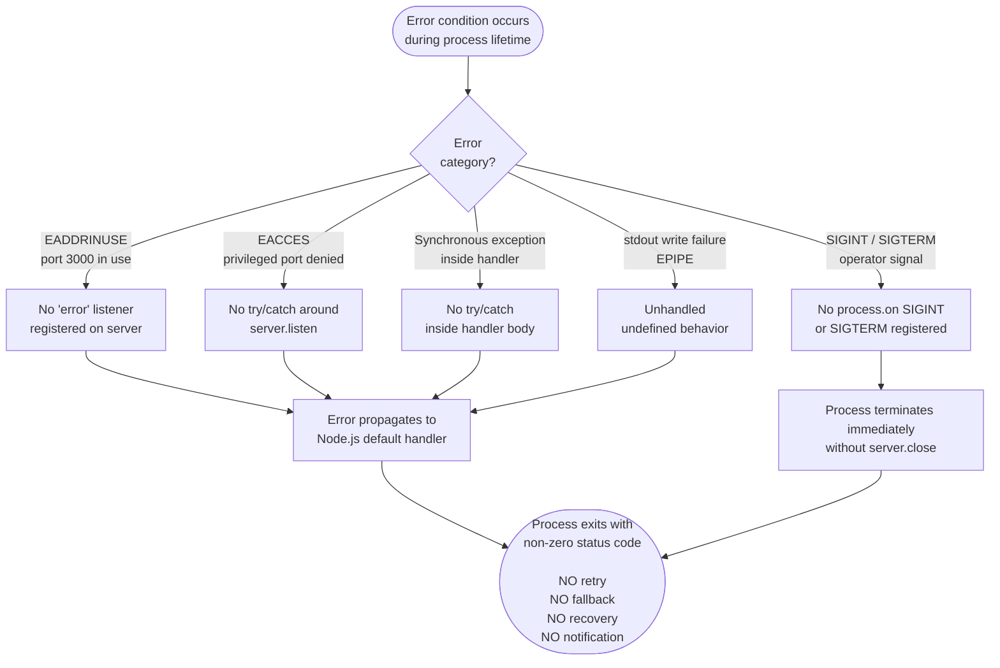

#### 5.4.3.3 Retry, Fallback, and Notification Posture

The conventional error-handling mechanisms enumerated below are explicitly **not** present in the system:

| Mechanism | Status |
|-----------|--------|
| Retry logic (exponential backoff, etc.) | Not implemented — no retry library, no loop logic |
| Fallback process (alternate port, alternate route) | Not implemented — per A-002, collision causes startup failure |
| Error notification (email/Slack/PagerDuty) | Not implemented — zero dependencies |
| Recovery procedure (restart policy, supervisor) | Not implemented — no PM2, systemd, or Docker restart policy |
| Graceful shutdown | Not implemented — no `SIGINT`/`SIGTERM` handlers, no `server.close()` |
| Circuit breaker | Not implemented — no downstream calls exist that would warrant one |
| Dead-letter queue | Not implemented — no messaging integration |

### 5.4.4 Authentication and Authorization Framework

#### 5.4.4.1 Network-Layer Boundary as Sole Checkpoint

The system implements **no authentication or authorization at the application layer**. The sole "checkpoint" is at the network layer: the OS-level loopback binding of `127.0.0.1` rejects connections originating from any non-local interface before they can ever reach the application. There are no tokens, no credentials, no role or scope evaluation, no rate limiting, and no per-client identification.

| Concern | Status |
|---------|--------|
| Application-layer authentication | None — no credential extraction from headers/body |
| Application-layer authorization | None — no role or scope evaluation |
| Token validation (JWT, OAuth, etc.) | None — no token-handling library imported |
| Rate limiting | None — no counters, no buckets, no middleware |
| CSRF protection | None — no anti-CSRF tokens, no SameSite cookies |
| Network-layer access control | Loopback binding (`127.0.0.1`) is the primary and only network boundary |

#### 5.4.4.2 Loopback Boundary Diagram

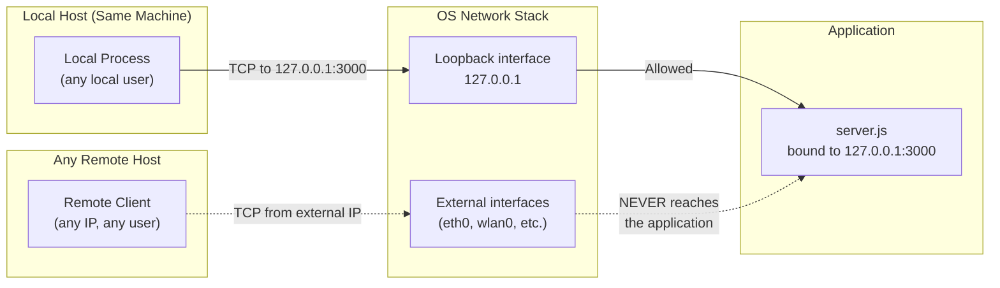

### 5.4.5 Performance Requirements and SLAs

No service-level agreements, throughput targets, latency budgets, or QoS metrics are documented anywhere in the repository. Performance is bounded only by the Node.js `http` core implementation on the host system. The per-step characteristics of the request path are all sub-millisecond, in-memory, and constant-time:

| Step | Characteristic |
|------|----------------|
| `http.createServer()` | Synchronous, sub-millisecond, executed once at startup |
| `server.listen()` bind | Asynchronous; bounded by OS socket allocation, not by application logic |
| Status code assignment | Sub-millisecond property assignment |
| Header emission | Sub-millisecond property assignment |
| Body emission (`res.end`) | Sub-millisecond, constant-time (14 bytes) |

Because the application performs no I/O against any backend, no work whose cost depends on input size, and no branching based on request shape, per-request latency is dominated by socket I/O rather than by any application logic. Throughput is bounded by the single Node.js event loop's ability to accept and dispatch connections on the loopback interface.

### 5.4.6 Disaster Recovery Procedures

No disaster recovery procedures are implemented **within** the system. Per §4.4.3, any recovery from a crash is an external concern: the operator (or an external supervisor outside the repository boundary) must re-invoke `node server.js`.

| DR Concern | Status |
|------------|--------|
| Process supervisor | None — no PM2, systemd unit, or Docker restart policy committed |
| Health checks for orchestrator restart | None — handler ignores `req.url`, so `/health` cannot exist |
| Backup of persistent state | Not applicable — no persistent state |
| Failover to standby instance | Not implemented — single process, loopback-only |
| Geographic redundancy | Not applicable — loopback binding precludes multi-region deployment |
| Recovery Time Objective (RTO) | Undocumented — bounded only by manual operator reaction time |
| Recovery Point Objective (RPO) | Not applicable — stateless system has no data to recover |

The re-invocation of `node server.js` is itself a manual repeat of the WF-001 startup workflow and is not a workflow encoded inside the system.

---

#### References

#### Files Examined

- `server.js` — Complete 14-line source of the HTTP server; established runtime architecture, request/response flow, hardcoded literals (`hostname = '127.0.0.1'`, `port = 3000`), single `require('http')`, handler signature `(req, res)` that ignores `req`, and the single `console.log` in the listen callback
- `package.json` — Confirmed package identity (`hello_world` v1.0.0), MIT license, author `hxu`, placeholder `test` script, declared `main: "index.js"` field, and absence of `dependencies`/`devDependencies`/`engines` fields
- `package-lock.json` — Confirmed npm lockfile format version 3 and empty `packages` tree (only root `""` entry) — cryptographic attestation of zero dependencies
- `README.md` — Established the "Do not touch!" governance directive and the "backprop integration" purpose

#### Folders Explored

- `/` (repository root) — Confirmed there are no subdirectories at all; the entire repository surface is the four files above (no `.github/`, no `src/`, no `tests/`, no `node_modules/`)

#### Cross-Referenced Technical Specification Sections

- §1.2 SYSTEM OVERVIEW — Project context, intrinsic limitations
- §1.3 SCOPE — In-scope and out-of-scope features, unsupported use cases
- §2.1 FEATURE CATALOG — Features F-001 through F-006
- §2.2 FUNCTIONAL REQUIREMENTS — Acceptance criteria including F-001-RQ-001 through F-003-RQ-002 and the F-002-RQ-004 determinism contract
- §2.4 IMPLEMENTATION CONSIDERATIONS — Scalability, performance, security positions
- §2.6 ASSUMPTIONS AND CONSTRAINTS — Assumptions A-001 through A-005 and constraints C-001 through C-007
- §3.1 STACK OVERVIEW AND ARCHITECTURAL POSTURE — Layered stack topology and guiding principles
- §3.3 FRAMEWORKS & LIBRARIES — Justification for core-only approach
- §3.4 OPEN SOURCE DEPENDENCIES — Zero-dependency confirmation and lockfile properties
- §3.5 THIRD-PARTY SERVICES — Negative integration inventory
- §3.6 DATABASES & STORAGE — Documented absence of any persistence layer
- §3.9 SECURITY IMPLICATIONS OF STACK CHOICES — Defense-by-minimalism posture
- §3.10 STACK INTEGRATION REQUIREMENTS — Inter-component edges and external requirements
- §4.2 CORE BUSINESS PROCESSES — Step-by-step workflows WF-001 (startup) and WF-002 (request/response)
- §4.4 ERROR HANDLING AND RECOVERY — Documented absence of error-handling primitives; error flow diagram source
- §4.5 STATE MANAGEMENT AND TRANSITIONS — Process lifecycle state diagram source
- §4.6 VALIDATION, AUTHORIZATION, AND COMPLIANCE CHECKPOINTS — Network-layer-only "checkpoint" posture
- §4.7 TIMING AND SLA CONSIDERATIONS — Absence of documented SLAs; per-step latency characteristics

# 6. SYSTEM COMPONENTS DESIGN

## 6.1 Core Services Architecture

### 6.1.1 Applicability Assessment

#### 6.1.1.1 Determination Statement

**Core Services Architecture is not applicable for this system.**

The `hao-backprop-test` repository implements a monolithic, single-process, single-file Node.js HTTP server whose entire executable surface is contained in `server.js` (14 lines). The system has no microservices, no distributed components, no inter-service communication, no service-discovery requirements, and no scalability or resilience layer above the Node.js runtime itself. Every subtopic prescribed for a Core Services Architecture section — service boundaries, inter-service communication, discovery, load balancing, circuit breakers, retry/fallback, horizontal scaling, auto-scaling, fault tolerance, failover, disaster recovery — is either inapplicable by topology or has been deliberately excluded by architectural decision.

This determination is not a documentation gap; it is a substantive architectural finding. As established in §5.1.1.1, the monolithic posture is "a deliberate posture motivated by the system's role as a deterministic test fixture for an external 'backprop integration' consumer," in which every alternative architectural style — microservices, layered service, hexagonal, event-driven, plugin-based — would introduce moving parts that could degrade the system's two non-negotiable properties: **behavioral stability** and **source invariance**.

#### 6.1.1.2 Architectural Evidence Summary

The applicability determination rests on the following directly observable repository properties:

| Evidence Dimension | Observed State | Cross-Reference |
|--------------------|----------------|-----------------|
| Repository surface | 4 files, 0 subdirectories | §5.1.1.3, §5.2 |
| Runtime executable count | 1 (`server.js`, 14 lines) | §5.1.2, §5.2.1 |
| Runtime npm dependencies | 0 (no `dependencies` field) | §5.2.2, §5.2.3 |
| Outbound integration points | 0 | §5.1.4 |
| Inbound integration points | 1 (loopback HTTP on `127.0.0.1:3000`) | §5.1.4 |
| Concurrency primitives | None — no `cluster`, no `worker_threads` | §5.1.1.1, §5.2.1.5 |
| State posture | Fully stateless | §5.1.1.1, §5.1.3.4 |
| Network exposure | Loopback-only (`127.0.0.1`) | §5.1.1.3, §5.4.4 |

Because there is exactly one service component running in exactly one process bound to exactly one loopback interface with zero state and zero downstream integrations, the entire conceptual framework of "core services architecture" — which presupposes a plurality of services that must coordinate — has no referent in this repository.

#### 6.1.1.3 Single-Service Topology Diagram

The diagram below illustrates the actual topology of the system, contrasted with the typical microservices topology that the Core Services Architecture section would normally describe.

```mermaid
flowchart TB
    subgraph ActualTopology["Actual Topology — This System"]
        direction TB
        LocalClient["Local Backprop<br/>Consumer<br/>(same host)"]
        LoopbackBound["127.0.0.1:3000<br/>Loopback Boundary"]
        SingleProcess["Single Node.js Process<br/>server.js (14 lines)<br/>Stateless handler"]
        LocalClient <-->|"HTTP/1.1<br/>plaintext"| LoopbackBound
        LoopbackBound --> SingleProcess
    end

    subgraph TypicalTopology["Typical Topology — Not Applicable Here"]
        direction TB
        Gateway["API Gateway /<br/>Load Balancer"]
        SvcA["Service A"]
        SvcB["Service B"]
        SvcC["Service C"]
        Registry["Service<br/>Registry"]
        DB[("Data Store")]
        Broker["Message<br/>Broker"]
        Gateway --> SvcA
        Gateway --> SvcB
        Gateway --> SvcC
        SvcA <--> Registry
        SvcB <--> Registry
        SvcC <--> Registry
        SvcA --> DB
        SvcB --> Broker
        SvcC --> Broker
    end

    ActualTopology -.->|"Comparison only —<br/>no architectural relationship"| TypicalTopology
```

The right-hand cluster is presented purely as a visual contrast; none of its elements exist in this repository, and the negative integration inventory in §5.1.4 explicitly confirms the absence of API gateways, message brokers, data stores, service registries, and additional service instances.

---

### 6.1.2 Service Components Analysis

#### 6.1.2.1 Service Boundaries and Responsibilities

There is exactly one bounded unit of execution in this repository: the `server.js` process. Its responsibility is to bind a TCP listening socket on `127.0.0.1:3000` and respond to every inbound HTTP request with an identical 14-byte `text/plain` payload (per §5.2.1.1). Because there is no second service, the concept of a "service boundary" reduces to the process boundary and the network boundary already documented in §5.1.1.3:

| Boundary | Definition | Crossing Mechanism |
|----------|------------|--------------------|
| Process boundary | One Node.js process executing `server.js` | OS process spawn via `node server.js` |
| Network boundary | TCP socket bound to `127.0.0.1:3000` | HTTP/1.1 over loopback |
| Data boundary | A single static UTF-8 string (`"Hello, World!\n"`, 14 bytes) | Response body emission via `res.end()` |
| Governance boundary | Four-file repository surface | README "Do not touch!" directive |

No service decomposition is performed and none is possible without violating constraint C-001 ("All files must remain unchanged from the committed baseline" — per §2.6.2). Within `server.js`, the five logically distinct sub-components identified in §5.1.2 (module import, configuration constants, server constructor + handler, listen invocation, startup log callback) are syntactic regions of a single CommonJS module, not deployable units.

#### 6.1.2.2 Inter-Service Communication Patterns

Inter-service communication is **not applicable**. Per §5.1.4, the system has "exactly one external integration point — an inbound HTTP/1.1 listener — and no outbound integrations of any kind." The negative integration inventory enumerated in §5.1.4 confirms the deliberate absence of every channel that would be required for inter-service communication:

| Communication Channel | Status | Evidence Location |
|------------------------|--------|-------------------|
| Synchronous outbound HTTP/REST/gRPC | None — no `http.request`, no `fetch`, no `axios` | §5.1.4 |
| Asynchronous message brokers | None — no Kafka, RabbitMQ, or SQS client | §5.1.4, §3.5 |
| Event streams / pub-sub | None — no event-streaming SDK imported | §5.1.4 |
| Shared persistence as integration substrate | None — no database, no cache, no file persistence | §5.1.3.4, §3.6 |
| Cross-process IPC | None — no `worker_threads`, no `child_process` | §5.1.1.1 |

The only communication that occurs is the inbound HTTP request/response cycle between a same-host client and the single listening socket — a client/server interaction, not an inter-service one.

#### 6.1.2.3 Service Discovery, Load Balancing, and Circuit Breakers

All three of these patterns presuppose either a plurality of service instances (discovery, load balancing) or a downstream call site (circuit breaker). None of these conditions hold:

| Pattern | Status | Reason |
|---------|--------|--------|
| Service discovery | Not implemented — no registration logic | Per §5.1.4, "no service-discovery registration"; only one service exists |
| Load balancing | Not applicable | Per §2.4.3 and §5.2.1.5, "Load distribution: Not applicable — loopback binding precludes external load distribution" |
| Circuit breaker | Not implemented | Per §5.4.3.3, "Not implemented — no downstream calls exist that would warrant one" |
| Sidecar / service mesh | Not deployed | No container manifests, no mesh sidecars present anywhere in the repository |

The hostname (`127.0.0.1`) and port (`3000`) are hardcoded literals declared as `const` at the top of `server.js` (per §5.2.1.3), enforced as constraints C-002 and C-003 (per §2.6.2). Because there is no configuration mechanism (no `process.env`, no CLI args, no config files — per §2.4.1), no dynamic address resolution is possible even in principle.

#### 6.1.2.4 Retry and Fallback Mechanisms

Retry and fallback mechanisms are also explicitly absent. Per §5.4.3.3:

| Mechanism | Status | Architectural Rationale |
|-----------|--------|-------------------------|
| Retry logic (exponential backoff, etc.) | Not implemented — no retry library, no loop logic | Zero dependencies (C-005); no downstream to retry |
| Fallback process (alternate port, alternate route) | Not implemented | Per assumption A-002, port collision causes startup failure by design |
| Recovery procedure (restart policy, supervisor) | Not implemented | No PM2, systemd, or Docker restart policy committed |
| Dead-letter queue | Not implemented | No messaging integration anywhere in the system |

This absence is deliberate. As §5.4.3.1 explains: "Introducing error-handling logic would create branches in the workflow that could mask the very behaviors that downstream 'backprop integration' tests are intended to observe." Retry and fallback patterns are precisely the kind of branching logic that would compromise the fixture's determinism contract (F-002-RQ-004).

---

### 6.1.3 Scalability Design Analysis

#### 6.1.3.1 Horizontal and Vertical Scaling Approach

The system's scaling posture is documented authoritatively in §2.4.3 and §5.2.1.5. Both sections agree on the same conclusion: scaling is not a relevant concern set for this fixture. Reproducing the canonical table for clarity:

| Scalability Dimension | Position | Evidence |
|------------------------|----------|----------|
| Horizontal scaling | Not supported | No clustering, no process-manager configuration |
| Vertical scaling | Bounded by single-process Node.js limits | Single `http.Server` instance |
| Concurrency model | Single Node.js event-loop process | No `cluster` or `worker_threads` usage |
| Load distribution | Not applicable | Loopback binding precludes external load distribution |

Per §2.4.3, "The system is stateless and single-process by design. Its purpose as a test fixture, combined with the loopback-only binding, removes scalability from the relevant concern set."

The loopback binding constraint (C-002) is the binding constraint here: even if the operator were to spawn additional `server.js` processes, none of them could share the bound socket on `127.0.0.1:3000`, and none of them would be reachable from any non-local interface. Horizontal scale-out is therefore precluded at the network layer, not merely at the orchestration layer.

#### 6.1.3.2 Auto-scaling Triggers, Rules, and Resource Allocation

Auto-scaling is not configured because no orchestration platform is present. The evidence:

| Auto-scaling Prerequisite | Presence in Repository | Source |
|---------------------------|------------------------|--------|
| Container manifest (Dockerfile) | Absent | §5.1.4 negative inventory |
| Kubernetes manifests / Helm chart | Absent | §5.1.4 negative inventory |
| CI/CD configuration | Absent (no `.github/`, no `.gitlab-ci.yml`, no `Jenkinsfile`) | Repository topology in §5.1.1 |
| Metrics emission for trigger evaluation | None — no Prometheus, StatsD, OpenTelemetry | §5.4.1 |
| Resource limit declarations | None — no container resource manifests | §5.1.4 |
| Cloud SDKs / orchestrator clients | None — no AWS/GCP/Azure SDKs | §5.1.4 negative inventory |

Resource allocation is consequently unmanaged at the application layer. Node.js process memory and CPU consumption are bounded only by the operating system's defaults; no `--max-old-space-size`, no cgroup limits, and no ulimit settings are committed to the repository.

#### 6.1.3.3 Performance Optimization and Capacity Planning

Performance optimization techniques are absent because the request path already performs the minimum possible work. Per §5.1.4, "All steps in the request path are in-memory, synchronous, and constant-time, so per-request latency is dominated by socket I/O rather than by any application logic." The per-step characteristics documented in §5.4.5 confirm that every operation in the request handler is sub-millisecond, in-memory, and constant-time, leaving no application-layer surface to optimize.

Capacity planning is similarly undocumented. Per §4.7 and §2.4.2, "No quantitative performance targets — throughput, latency, concurrency, or memory ceilings — are documented in any repository file." Capacity ceilings, if they exist, are inherited from the Node.js `http` core implementation on the host system and from the operating-system loopback stack — neither of which is parameterized by this repository.

| Optimization Surface | Posture | Reason |
|----------------------|---------|--------|
| Response caching | None | Response is already a compile-time literal — caching would be redundant |
| Connection pooling | None | No outbound connections to pool |
| Compression (gzip/brotli) | None | 14-byte body — compression overhead exceeds savings |
| HTTP keep-alive tuning | Defaults only | No middleware layer in which to apply tuning |
| Event-loop tuning | None | No `--max-old-space-size` or similar flags committed |

#### 6.1.3.4 Scalability Boundary Diagram

```mermaid
flowchart TB
    subgraph BindBoundary["Loopback Binding — 127.0.0.1:3000 (hard architectural boundary)"]
        direction TB
        EventLoop["Single Node.js Event Loop<br/>(non-blocking I/O)<br/>No cluster module<br/>No worker_threads"]
        Handler["Branchless Handler<br/>Constant-time<br/>In-memory<br/>Allocation-free of user data"]
        EventLoop --> Handler
    end

    LocalOnly["Local Clients ONLY<br/>(same host)"]
    BlockedRemote["Remote Clients<br/>(any IP, any user)"]
    BlockedHScale["Additional server.js<br/>instance attempts"]
    BlockedAutoscale["Orchestrator-driven<br/>autoscaling"]

    LocalOnly -->|"Reachable"| BindBoundary
    BlockedRemote -.->|"NEVER reaches<br/>the application<br/>(rejected at OS network stack)"| BindBoundary
    BlockedHScale -.->|"BLOCKED — EADDRINUSE<br/>cannot share bound socket"| BindBoundary
    BlockedAutoscale -.->|"NOT APPLICABLE — no<br/>container manifest, no<br/>orchestrator integration"| BindBoundary
```

The diagram makes the architectural conclusion explicit: the loopback binding is not just a network-security choice; it is also the boundary that precludes every conventional scalability pattern. Adding a second instance would collide on the socket; adding a load balancer in front would have nothing to load-balance (no second instance) and no external listener to forward to.

---

### 6.1.4 Resilience Patterns Analysis

#### 6.1.4.1 Fault Tolerance Mechanisms

Fault tolerance primitives are documented as deliberately absent in §5.4.3. The complete inventory of error categories and their (absent) handlers is reproduced below from §5.4.3.1:

| Error Category | Trigger | Handler Status |
|----------------|---------|----------------|
| `EADDRINUSE` | Port 3000 already bound on loopback | No `'error'` listener — process crashes |
| `EACCES` | Privileged port denied | No `try`/`catch` — process crashes |
| Synchronous exception in handler | Hypothetical — impossible given current 3-line handler body | Would propagate — process crashes |
| `SIGINT` / `SIGTERM` | Operator signal | No signal handler — abrupt termination |
| `EPIPE` on stdout write | stdout closed by external process | No handler — undefined behavior |

Per §5.4.3.1, "every error that arises during the process lifetime is unhandled by the application and propagates to Node.js's default behavior, which is process termination with a non-zero exit code." This is described as "a deliberate architectural posture, not an oversight."

#### 6.1.4.2 Disaster Recovery Procedures

Disaster recovery procedures are not implemented within the system. Per §5.4.6:

| DR Concern | Status |
|------------|--------|
| Process supervisor | None — no PM2, systemd unit, or Docker restart policy committed |
| Health checks for orchestrator restart | None — handler ignores `req.url`, so `/health` cannot exist |
| Backup of persistent state | Not applicable — no persistent state |
| Recovery Time Objective (RTO) | Undocumented — bounded only by manual operator reaction time |

As §5.4.6 explains, "Any recovery from a crash is therefore an external concern: the operator (or an external supervisor outside the repository boundary) must re-invoke `node server.js`." The re-invocation is a manual repeat of the WF-001 startup workflow and is not a workflow encoded inside the system.

#### 6.1.4.3 Data Redundancy and Failover Configurations

| Resilience Dimension | Status | Reason |
|----------------------|--------|--------|
| Data redundancy | Not applicable | Per §5.4.6, "stateless system has no data to recover" — no persistence layer exists (§3.6) |
| Failover to standby instance | Not implemented | Per §5.4.6, "single process, loopback-only" |
| Geographic redundancy | Not applicable | Per §5.4.6, "loopback binding precludes multi-region deployment" |
| Recovery Point Objective (RPO) | Not applicable | Stateless system has no recoverable state |
| Active-active / active-passive HA | Not implemented | Socket-binding collision (EADDRINUSE) precludes co-existing replicas on the same host |

The stateless posture documented throughout §5.1.1.1 ("Fully stateless — the application holds no mutable in-memory state and no persistent state") and §5.1.3.4 ("The system has no data stores and no caches") removes the data-recovery problem entirely.

#### 6.1.4.4 Service Degradation Policies

Service degradation policies — tiered responses, graceful feature shedding, "lite mode" fallbacks — are not implemented and would violate the determinism contract. Per §5.4.4.2 and §5.4.3.1, the request handler is branchless and ignores the `req` argument entirely (F-002-RQ-004). There is consequently no decision point at which the handler could choose to return a degraded response. The response is a compile-time literal, identical on every invocation:

| Degradation Pattern | Status | Reason |
|---------------------|--------|--------|
| Tiered response logic | Not implemented | Handler is branchless; ignores `req` per F-002-RQ-004 |
| Feature-flag-driven degradation | Not implemented | No configuration mechanism (no `process.env`, no CLI args) |
| Bulkhead / pool isolation | Not implemented | No pools to isolate — zero downstream calls |
| Timeout-based shedding | Not implemented | No outbound calls to time-bound |
| Graceful shutdown / draining | Not implemented | Per §5.4.3.3, "no `SIGINT`/`SIGTERM` handlers, no `server.close()`" |

#### 6.1.4.5 Resilience Pattern Absence Map

The diagram below enumerates each conventional resilience pattern and identifies the specific architectural constraint that excludes it.

```mermaid
flowchart TD
    Root["Conventional Resilience Patterns<br/>(none implemented)"]

    Root --> CB["Circuit Breaker"]
    Root --> Retry["Retry with Backoff"]
    Root --> Fallback["Fallback Response"]
    Root --> HC["Health Check Endpoint"]
    Root --> GS["Graceful Shutdown"]
    Root --> Failover["Active-Passive Failover"]
    Root --> DR["Data Redundancy"]
    Root --> Degrade["Service Degradation"]
    Root --> Supervisor["Process Supervisor"]

    CB --> CBReason["Excluded —<br/>no downstream calls<br/>(§5.4.3.3)"]
    Retry --> RetryReason["Excluded —<br/>zero dependencies (C-005)<br/>no retry library<br/>(§5.4.3.3)"]
    Fallback --> FallbackReason["Excluded —<br/>A-002: collision causes<br/>startup failure by design<br/>(§5.4.3.3)"]
    HC --> HCReason["Excluded —<br/>handler ignores req.url<br/>(§5.4.1)"]
    GS --> GSReason["Excluded —<br/>no SIGINT/SIGTERM handler<br/>no server.close()<br/>(§5.4.3.3)"]
    Failover --> FailoverReason["Excluded —<br/>single process,<br/>loopback-only<br/>(§5.4.6)"]
    DR --> DRReason["Not applicable —<br/>fully stateless<br/>(§5.1.3.4, §5.4.6)"]
    Degrade --> DegradeReason["Excluded —<br/>handler is branchless<br/>F-002-RQ-004"]
    Supervisor --> SupervisorReason["Excluded —<br/>no PM2 / systemd / Docker<br/>restart policy (§5.4.6)"]
```

---

### 6.1.5 Architectural Rationale for Inapplicability

#### 6.1.5.1 Deliberate Design Posture

The inapplicability of Core Services Architecture is not a consequence of immaturity, prototype status, or planned future work. It is the **design intent** of the repository. Per §5.1.1.1, the monolithic style "is not an accident of scale; it is a deliberate posture motivated by the system's role as a deterministic test fixture for an external 'backprop integration' consumer." The six architectural principles enumerated in §5.1.1.2 — behavioral stability, source invariance, operational simplicity, defense by minimalism, determinism, and self-containment — collectively forbid the introduction of any service-oriented complexity:

| Principle | Implication for Core Services Architecture |
|-----------|---------------------------------------------|
| Behavioral stability | Branchless handler — no degradation, no fallback, no retry logic possible |
| Source invariance | "Do not touch!" directive (C-001) forbids adding service-decomposition code |
| Operational simplicity | "No install step, no build step, no transpile step" — no orchestrator possible |
| Defense by minimalism | Zero dependencies + loopback-only binding — no service mesh, no broker client |
| Determinism | Handler must not inspect request properties — precludes routing or load-aware logic |
| Self-containment | Entire system fits in four files — no room for service-mesh or sidecar artifacts |

These principles are mutually reinforcing. The "Negative Architecture" pattern documented in §5.1.1.2 — "the deliberate, documented exclusion of features (routing, middleware, error handling, logging frameworks, caching, persistence, authentication) that a non-fixture system would normally include" — extends naturally to the exclusion of service-architecture features.

#### 6.1.5.2 Governing Constraints

The applicability determination is also enforced by the constraints catalog in §2.6.2. Six of the seven catalogued constraints have direct bearing on Core Services Architecture:

| Constraint ID | Statement | Effect on Core Services Architecture |
|---------------|-----------|--------------------------------------|
| C-001 | All files must remain unchanged from the committed baseline | Forbids adding service-decomposition, clustering, or resilience code |
| C-002 | Hostname must remain hardcoded to `127.0.0.1` | Precludes external load balancing and multi-host failover |
| C-003 | Port must remain hardcoded to `3000` | Prevents dynamic port allocation needed for replicas |
| C-005 | Zero runtime and zero development dependencies | Excludes resilience libraries, service-mesh clients, telemetry exporters |
| C-006 | Project must remain executable without `npm install` | Excludes any installable dependency (process manager, orchestrator client) |

Any attempt to introduce service-architecture features — even minimal ones such as a circuit-breaker library or a health-check route — would violate at least one of these constraints. The architectural posture is therefore not just descriptive (what is currently absent) but normative (what must remain absent).

#### 6.1.5.3 Relationship to Other Specification Sections

For readers seeking related discussions, the following sections of this Technical Specification provide complementary perspectives on the same architectural conclusion:

| Topic | Section | What It Documents |
|-------|---------|-------------------|
| Monolithic style rationale | §5.1.1.1 | Why microservices were rejected |
| Component-level scaling table | §5.2.1.5 | Per-component scaling positions |
| Overall scalability position | §2.4.3 | Repository-wide scalability statement |
| Error-handling absence | §5.4.3 | Why retry/fallback/circuit-breaker patterns are excluded |
| Disaster-recovery posture | §5.4.6 | Why DR and failover are not implemented |
| Negative integration inventory | §5.1.4, §3.5 | Confirmation of zero outbound integrations |
| Governing constraints | §2.6.2 | C-001 through C-006 that prevent service decomposition |

---

### 6.1.6 References

#### 6.1.6.1 Files Examined

- `server.js` — Complete 14-line source of the HTTP server; established the single-process, single-file, branchless-handler architecture and confirmed the absence of clustering, worker threads, error listeners, signal handlers, and module exports
- `package.json` — Confirmed zero `dependencies` and zero `devDependencies` fields, no `engines` field, no `scripts.start`, and the `hello_world` v1.0.0 identity
- `package-lock.json` — Verified npm lockfile format version 3 with only the root `""` entry in the `packages` map — cryptographic attestation of zero installed dependencies
- `README.md` — Established the "Do not touch!" governance directive (origin of constraint C-001) and the "backprop integration" purpose statement

#### 6.1.6.2 Folders Explored

- `/` (repository root, depth 0) — Confirmed only four files exist at the root and no subdirectories of any kind are present (no `src/`, no `services/`, no `microservices/`, no `lib/`, no `tests/`, no `node_modules/`, no `.github/`, no Kubernetes/Helm manifests, no Dockerfile)

#### 6.1.6.3 Cross-Referenced Technical Specification Sections

- **§1.2 SYSTEM OVERVIEW** — Fixture role and intrinsic-limitations framing
- **§2.3 FEATURE RELATIONSHIPS** — Confirmation of no shared components and no inter-service edges
- **§2.4 IMPLEMENTATION CONSIDERATIONS** — Authoritative scalability dimensions table (horizontal/vertical/concurrency/state/load — all not supported or not applicable)
- **§2.6 ASSUMPTIONS AND CONSTRAINTS** — Constraints C-001 through C-006 that govern all architectural decisions
- **§3.1 STACK OVERVIEW AND ARCHITECTURAL POSTURE** — "No horizontal complexity" statement
- **§3.5 THIRD-PARTY SERVICES** — Confirmation of zero external services with category-by-category verification
- **§3.6 DATABASES & STORAGE** — Documented absence of any persistence layer
- **§4.3 INTEGRATION WORKFLOWS** — Confirmation that the sole integration point is the inbound `127.0.0.1:3000` listener
- **§4.4 ERROR HANDLING AND RECOVERY** — Documented absence of retry/fallback/circuit-breaker/health-check/graceful-shutdown logic
- **§4.7 TIMING AND SLA CONSIDERATIONS** — Confirmation that no SLAs, throughput targets, or latency budgets exist
- **§5.1 HIGH-LEVEL ARCHITECTURE** — Architectural style, rationale, boundaries, and the high-level architecture diagram
- **§5.2 COMPONENT DETAILS** — Per-component responsibilities and the explicit per-component scaling table
- **§5.4 CROSS-CUTTING CONCERNS** — Authoritative documentation of absent monitoring, error handling, retry, fallback, circuit breaker, dead-letter queue, and disaster-recovery primitives

## 6.2 Database Design

### 6.2.1 Applicability Assessment

#### 6.2.1.1 Determination Statement

**Database Design is not applicable to this system.**

The `hao-backprop-test` repository implements a deterministic, stateless HTTP test fixture whose entire executable surface is contained in `server.js` (14 lines). No persistence layer of any kind exists, has been deferred, or is technically possible to introduce under the system's governing constraints. Every subtopic prescribed for a Database Design section — schema design, entity relationships, indexing, partitioning, replication, backup, migration, archival, caching policies, retention rules, audit mechanisms, query optimization, connection pooling, read/write splitting, batch processing — has no referent in this repository because there is no datastore, no in-memory data structure beyond three immutable constants, and no data path that produces or consumes persisted information.

This determination is a substantive architectural finding, not a documentation gap. As established by ADR-005 (zero dependencies) and ADR-006 (source invariance), introducing any database, ORM, schema definition, migration framework, or caching client would violate at least four of the seven governing constraints catalogued in §2.6.2 and would compromise the determinism guarantee that constitutes the system's primary value proposition.

#### 6.2.1.2 Repository-Level Evidence

The applicability determination rests on the following directly observable repository properties:

| Evidence Dimension | Observed State | Source of Verification |
|--------------------|----------------|------------------------|
| Database client `require()` statements in `server.js` | Zero | Only `require('http')` is invoked |
| Database driver / ORM in `package.json` | Zero | No `dependencies` or `devDependencies` fields |
| Installed packages in `package-lock.json` | Zero | Only root `""` entry in `packages` map |
| Filesystem I/O in handler | Zero | No `require('fs')`, no `readFile`, no `writeFile` |
| Persistence-related subdirectories | Zero | No `models/`, `schema/`, `migrations/`, `db/`, `data/` |
| Cache client libraries | Zero | No Redis, Memcached, or in-process cache imports |
| Module-level mutable state | Zero | Only `const` declarations for `hostname`, `port`, `server` |
| Configuration mechanisms for storage | Zero | No `.env`, no `process.env` reads, no config files |

The complete repository surface — four files (`server.js`, `package.json`, `package-lock.json`, `README.md`) with no subdirectories — is documented exhaustively in §5.1.1.3 and confirms the architectural absence of every conventional persistence-layer artifact.

#### 6.2.1.3 Storage Categories Evaluated and Excluded

The authoritative storage exclusion matrix from §3.6.2 is reproduced below. Each category was evaluated and excluded; the table is the canonical statement of the system's persistence posture.

| Storage Category | Status | Verification |
|------------------|--------|--------------|
| Primary relational database (PostgreSQL, MySQL, etc.) | Not used | No database client `require()` statements |
| Document database (MongoDB, CouchDB, etc.) | Not used | No database client imports |
| Key-value store (Redis, DynamoDB, etc.) | Not used | No client libraries |
| Search engine (Elasticsearch, OpenSearch, etc.) | Not used | No search client code |
| In-memory cache (Redis, Memcached) | Not used | No cache client code |
| Object storage (S3, GCS, Azure Blob) | Not used | No cloud storage SDK imports |
| Block storage / file system persistence | Not used | `server.js` performs no `fs` I/O |
| Session storage | Not used | No session handling, no cookies, no per-client state |
| Time-series database (InfluxDB, TimescaleDB) | Not used | No metrics emitted |
| Graph database (Neo4j, etc.) | Not used | No client libraries |

As §3.6.1 declares authoritatively: "No persistence layer of any kind exists." Per §3.6.3, "There is no Object-Relational Mapper (ORM), no data access layer, no schema definition, no migration system, and no data fixtures."

#### 6.2.1.4 No-Op Persistence Boundary Diagram

The diagram below — reproduced and adapted from §4.5.3 — documents the deliberate absence of persistence at every point in the request lifecycle where a conventional Process Flowchart would expect a database touch.

```mermaid
flowchart LR
    Req[HTTP request<br/>arrives on<br/>127.0.0.1:3000] --> Q1{Read from<br/>persistence layer?}
    Q1 -->|N/A| Skip1[No persistence layer<br/>exists]
    Skip1 --> Q2{Read from cache?}
    Q2 -->|N/A| Skip2[No cache layer<br/>exists]
    Skip2 --> Q3{Begin transaction?}
    Q3 -->|N/A| Skip3[No transactional<br/>resource exists]
    Skip3 --> Static[Emit compile-time literal<br/>Hello, World! + newline<br/>14 bytes]
    Static --> Q4{Write to<br/>persistence layer?}
    Q4 -->|N/A| Skip4[No persistence layer<br/>exists]
    Skip4 --> Q5{Update cache?}
    Q5 -->|N/A| Skip5[No cache to update]
    Skip5 --> Q6{Commit transaction?}
    Q6 -->|N/A| Skip6[No transaction<br/>to commit]
    Skip6 --> Resp[Response flushed<br/>to client]
```

This diagram is intentionally redundant; its purpose is to make the *absence* of every database-touching concern explicit at every place where a conventional database-backed architecture would expect them.

---

### 6.2.2 Schema Design — Inapplicability Analysis

#### 6.2.2.1 Entity Relationships

There are no entities to relate. The system's entire data domain, per §1.3.1, consists of "a single static UTF-8 string `\"Hello, World!\\n\"` — no dynamic data, no persistence." A single immutable 14-byte literal is not modeled as an entity; it is embedded directly in `server.js` as the argument to `res.end()`. There are no primary keys, no foreign keys, no cardinality relationships, no junction tables, and no aggregate roots because there are no records, rows, or documents whose relationships could be described.

#### 6.2.2.2 Data Models and Structures

The system holds three module-level data references, all declared with `const`, and none of which constitute application data in the conventional sense:

| Reference | Value | Nature |
|-----------|-------|--------|
| `hostname` | `'127.0.0.1'` (string literal) | Compile-time configuration constant |
| `port` | `3000` (number literal) | Compile-time configuration constant |
| `server` | `http.Server` instance | Runtime object reference, not data |

Per §3.6.3, these constants represent "the only 'memory' of the process." None is a record, none is queried, none is updated, and none persists beyond the lifetime of the Node.js process. No data structure definitions (classes, interfaces, schemas, type definitions, JSON schemas, Protobuf messages, Avro records) exist anywhere in the repository.

#### 6.2.2.3 Indexing, Partitioning, and Replication

| Schema Concern | Status | Rationale |
|----------------|--------|-----------|
| Primary key indexes | Not applicable | No tables, collections, or keyed records exist |
| Secondary indexes | Not applicable | No queryable attributes exist |
| Full-text indexes | Not applicable | No corpus to index; 14-byte literal is the only string |
| Horizontal partitioning (sharding) | Not applicable | No data volume to distribute |
| Vertical partitioning | Not applicable | No columns to separate |
| Replication topology (master/replica, multi-master) | Not applicable | No data to replicate; per §6.1.4.3, "stateless system has no data to recover" |
| Replication lag monitoring | Not applicable | No replication channel exists |
| Conflict resolution policy | Not applicable | No concurrent writers; no writers at all |

#### 6.2.2.4 Backup Architecture

| Backup Concern | Status | Rationale |
|----------------|--------|-----------|
| Backup target (full, incremental, differential) | Not applicable | No state to back up |
| Backup schedule (cron, continuous, snapshot) | Not applicable | Per §6.1.4.3, no recoverable state exists |
| Backup retention | Not applicable | No backups exist |
| Backup verification / restore drills | Not applicable | No restore target exists |
| Point-in-time recovery (PITR) | Not applicable | No transaction log exists |

The four committed repository files (`server.js`, `package.json`, `package-lock.json`, `README.md`) are themselves the entire system state; they are version-controlled in Git, which serves as the de facto recoverability mechanism for the source — not for application data, which does not exist.

#### 6.2.2.5 Conceptual ERD Showing Absence

The diagram below makes the schema absence explicit. Where a conventional system would present an entity-relationship diagram of persisted records, the only conceptual "entity" is the compile-time string literal, which is not persisted and not modeled.

```mermaid
erDiagram
    COMPILE_TIME_LITERAL {
        string value "Hello, World!\n (14 bytes, immutable)"
        string location "server.js line 9"
        string lifecycle "Embedded in source code"
        string persistence "None - not stored anywhere"
    }
    CONFIGURATION_CONSTANT {
        string hostname "127.0.0.1 (literal)"
        number port "3000 (literal)"
        string lifecycle "Process memory only"
        string persistence "None - rehydrated from source on each start"
    }
    COMPILE_TIME_LITERAL ||..|| CONFIGURATION_CONSTANT : "Co-resident in server.js;<br/>no referential relationship"
```

The diagram intentionally uses a dashed identifying relationship to denote that no actual database relationship exists; the two "entities" are merely the immutable constants observed in `server.js` and have no foreign-key, lookup, or join semantics.

---

### 6.2.3 Data Management — Inapplicability Analysis

#### 6.2.3.1 Migration Procedures

| Migration Concern | Status | Rationale |
|-------------------|--------|-----------|
| Schema migration tooling (Flyway, Liquibase, Alembic, Knex, Prisma migrate) | Not implemented | No schemas to migrate; would violate C-005 (zero dependencies) |
| Forward / rollback migrations | Not applicable | No schema to evolve |
| Migration ordering / dependency graph | Not applicable | No migration set exists |
| Zero-downtime migration patterns | Not applicable | No data to migrate |
| Data backfill scripts | Not applicable | No data store to backfill |

Per §4.5.1, "state migration" is documented as "Not applicable (stateless) — No in-memory state to migrate." This conclusion extends transitively to schema migration: a system with no schema cannot have schema migrations.

#### 6.2.3.2 Versioning Strategy

The repository declares version `1.0.0` in both `package.json` and `package-lock.json`. Per §2.6.3, "all requirements are at their initial revision and are tracked against the single declared version `1.0.0`." There is no separate database schema version, no migration history table, no semantic versioning of data contracts, and no API versioning scheme (there is no API surface beyond the byte-identical response, which by F-002-RQ-004 must never change).

| Versioning Dimension | Status | Source |
|----------------------|--------|--------|
| Source code version | `1.0.0` | `package.json` |
| Lockfile version | `3` (npm lockfile schema) | `package-lock.json` |
| Schema version | Not applicable | No schema exists |
| Data contract version | Not applicable | Static response is byte-identical |

#### 6.2.3.3 Archival Policies

| Archival Concern | Status | Rationale |
|------------------|--------|-----------|
| Hot / warm / cold tiering | Not applicable | No data of any temperature exists |
| Archive media (S3 Glacier, tape, off-site) | Not applicable | No data to archive |
| Archival triggers (age-based, size-based, manual) | Not applicable | No data lifecycle to govern |
| Legal hold mechanisms | Not applicable | No records subject to hold |
| Archive restoration SLAs | Not applicable | No archive exists |

#### 6.2.3.4 Data Storage and Retrieval Mechanisms

The single act resembling "data retrieval" in the entire system is the emission of the compile-time string literal from `server.js` to the HTTP response stream. This is documented in §5.2.1.4 as: "None. The component performs no I/O against any persistence layer. The only data it produces is the response body (a compile-time literal) and the startup log line."

| Storage / Retrieval Mechanism | Status | Mechanism Actually Used |
|-------------------------------|--------|--------------------------|
| Database connection pooling | Not implemented | None — no database |
| Query language (SQL, GraphQL, ORM DSL) | Not implemented | None — no query target |
| Read-through / write-through patterns | Not implemented | Direct literal emission via `res.end()` |
| Eager / lazy loading | Not implemented | All "data" is loaded as part of source compilation |
| Streaming retrieval (cursors, iterators) | Not implemented | Single synchronous `res.end()` call |

#### 6.2.3.5 Caching Policies

Per §5.3.4, "No caching layer is implemented." The justification given there enumerates three converging reasons that apply equally to this section:

1. The static body is already a literal constant in source code — there is no upstream source from which to cache.
2. No HTTP-level caching headers are emitted (`ETag`, `Last-Modified`, `Cache-Control` are all absent).
3. No external data source exists that would warrant client-side, server-side, CDN, or reverse-proxy caching.

| Cache Layer | Status | Rationale |
|-------------|--------|-----------|
| Application-level cache (LRU, in-process) | Not implemented | No upstream source to cache from |
| Distributed cache (Redis, Memcached) | Not implemented | Would violate C-005; no source to cache |
| HTTP response cache (Cache-Control headers) | Not implemented | Would violate F-002-RQ-004 determinism guarantee |
| CDN / reverse proxy cache | Not implemented | Loopback-only binding (C-002) precludes CDN placement |
| Cache invalidation strategy | Not applicable | No cache exists to invalidate (§4.5.1) |

---

### 6.2.4 Compliance Considerations — Inapplicability Analysis

#### 6.2.4.1 Data Retention Rules

The system processes no personal data, no business data, no transactional data, and no derived data. There is no data whose retention duration could be governed. Per §1.3.1, the data domain is bounded to "a single static UTF-8 string." Compliance regimes that govern data retention (GDPR Article 5(1)(e), CCPA §1798.105, HIPAA §164.530(j), PCI-DSS §3.1) presuppose the existence of records about identifiable parties, transactions, or regulated content — none of which exist in this repository.

| Retention Concern | Status | Rationale |
|-------------------|--------|-----------|
| Minimum retention period | Not applicable | No records to retain |
| Maximum retention period | Not applicable | No records to expire |
| Right-to-erasure workflow | Not applicable | No personal data exists |
| Legal hold override | Not applicable | No records subject to hold |
| Retention-policy audit log | Not applicable | No retention activity to audit |

#### 6.2.4.2 Backup and Fault Tolerance Policies

Per §6.1.4.3, "Data redundancy: Not applicable — stateless system has no data to recover; no persistence layer exists." The complete data redundancy and failover position is reproduced below:

| Resilience Dimension | Status | Reason |
|----------------------|--------|--------|
| Data redundancy | Not applicable | No persistence layer exists |
| Failover to standby instance | Not implemented | Single process, loopback-only |
| Geographic redundancy | Not applicable | Loopback binding (C-002) precludes multi-region |
| Recovery Point Objective (RPO) | Not applicable | No recoverable state exists |
| Recovery Time Objective (RTO) | Undocumented at data layer | No data tier to recover; process restart is operator-driven |

The source code itself is backed up by Git version control external to the application boundary; this is a source-management concern, not a database-design concern.

#### 6.2.4.3 Privacy Controls

Privacy controls are not applicable because no personal data — and in fact no user-supplied data of any kind — enters the system. Per §5.3.5, the "Injection-surface elimination" control is enforced by the handler ignoring `req` entirely (F-002-RQ-004): "Handler ignores `req` per F-002-RQ-004; no `req.url`, `req.headers`, `req.method`, or body parsing."

| Privacy Mechanism | Status | Rationale |
|-------------------|--------|-----------|
| PII identification / classification | Not applicable | No PII is collected, processed, or stored |
| Field-level encryption | Not applicable | No fields exist |
| Data masking / tokenization | Not applicable | No identifiers to mask |
| Consent management | Not applicable | No user identity is recognized |
| Cross-border transfer controls | Not applicable | Loopback-only — no data crosses the host boundary |
| Anonymization / pseudonymization | Not applicable | No personal data exists |

#### 6.2.4.4 Audit Mechanisms

| Audit Concern | Status | Rationale |
|---------------|--------|-----------|
| Database audit log (DML, DDL) | Not applicable | No database to audit |
| Change Data Capture (CDC) | Not applicable | No data changes occur |
| Tamper-evident logging (write-once, hash-chained) | Not implemented | No durable log exists |
| Administrative access audit trail | Not applicable | No database administration surface exists |
| Compliance attestation reports | Not applicable | No data-handling activity to attest |

The only emitted log entry is the one-time startup line `Server running at http://127.0.0.1:3000/`, which is documented in §5.2.1.4 as the sole stdout output. This log is informational, not auditable evidence about data operations.

#### 6.2.4.5 Access Controls

Per §5.3.5, the system adopts a "defense by minimalism" posture in which network-layer isolation (loopback-only binding per C-002) and the absence of any data surface together obviate database access controls. Conventional database ACL mechanisms — GRANT/REVOKE, role-based access control (RBAC), row-level security (RLS), column masking — have no referent because there are no objects (tables, views, procedures) over which permissions could be defined.

| Access Control Mechanism | Status | Rationale |
|--------------------------|--------|-----------|
| Database user authentication | Not applicable | No database |
| Role-based access control (RBAC) | Not applicable | No protected objects |
| Row-level security (RLS) | Not applicable | No rows exist |
| Column-level masking | Not applicable | No columns exist |
| Network ACL for database port | Not applicable | No database port to filter |
| Loopback-only application binding | Implemented | `server.js` line 3 (constraint C-002) — see §5.3.5 |

---

### 6.2.5 Performance Optimization — Inapplicability Analysis

#### 6.2.5.1 Query Optimization Patterns

Query optimization patterns presuppose the existence of queries. The handler executes a constant-time, branchless code path that performs exactly three operations: setting the status code, setting the `Content-Type` header, and emitting the body. None of these is a query, and none has an optimizable plan.

| Optimization Pattern | Status | Reason |
|----------------------|--------|--------|
| Execution-plan analysis | Not applicable | No query planner involved |
| Index hint usage | Not applicable | No indexes exist |
| Query rewriting / view materialization | Not applicable | No queries to rewrite |
| Statistics-based optimization | Not applicable | No statistics gathered |
| N+1 query elimination | Not applicable | Zero queries are issued, let alone N+1 |

Per §6.1.3.3, "All steps in the request path are in-memory, synchronous, and constant-time, so per-request latency is dominated by socket I/O rather than by any application logic." There is no further optimization surface at the data layer.

#### 6.2.5.2 Caching Strategy

See §6.2.3.5 above and the authoritative rationale in §5.3.4. The architectural conclusion is identical: caching has no role because the response body is already a compile-time literal in process memory and no upstream data source exists. Per §6.1.3.3, "Response caching: None — Response is already a compile-time literal — caching would be redundant."

#### 6.2.5.3 Connection Pooling

| Connection-Pool Concern | Status | Reason |
|-------------------------|--------|--------|
| Database connection pool (pg-pool, mysql-pool, etc.) | Not implemented | No database to connect to |
| Connection-pool sizing / tuning | Not applicable | No pool exists |
| Connection lifecycle (idle eviction, ping) | Not applicable | No connections to manage |
| Outbound HTTP keep-alive pool | Not implemented | Per §6.1.3.3, "no outbound connections to pool" |
| Statement caching / prepared-statement pool | Not applicable | No statements exist |

#### 6.2.5.4 Read/Write Splitting

Read/write splitting presupposes (a) at least one writable primary, (b) at least one read replica, and (c) a routing mechanism (proxy or client library) that directs reads to replicas. None of these conditions holds:

| Component | Status | Reason |
|-----------|--------|--------|
| Writable primary | Does not exist | No database |
| Read replicas | Do not exist | No database to replicate |
| Read/write routing layer | Does not exist | No queries to route |
| Replication lag tolerance policy | Not applicable | No replication exists |
| Read-after-write consistency strategy | Not applicable | No writes occur |

#### 6.2.5.5 Batch Processing Approach

The system is a request/response HTTP server, not a batch processor. There is no scheduled job, no message queue, no batch ingestion pipeline, no ETL framework, and no data warehouse to populate.

| Batch Concern | Status | Reason |
|---------------|--------|-----------|
| Bulk insert / `COPY` operations | Not applicable | No table to insert into |
| Batch job scheduler (cron, Airflow, etc.) | Not implemented | No scheduled work; per §6.1.3.2, no CI/CD or orchestration present |
| Stream processing (Kafka Streams, Flink) | Not implemented | No streaming infrastructure |
| Micro-batch windowing | Not applicable | No records to window |
| Idempotency keys for batch retry | Not applicable | No batches to retry |

---

### 6.2.6 Governing Constraints

#### 6.2.6.1 Constraint Mapping

The constraint catalogue in §2.6.2 enumerates seven normative constraints. Four of these directly prohibit the introduction of any database design:

| Constraint ID | Statement | Effect on Database Design |
|---------------|-----------|---------------------------|
| C-001 | All files must remain unchanged from the committed baseline | Forbids adding any schema definition, migration script, or data-access module to the repository |
| C-004 | Response body, status, and headers must remain byte-identical across all requests | Forbids dynamic data sourced from a database; any database-derived value could vary across invocations |
| C-005 | Zero runtime and zero development dependencies must be maintained | Forbids installing any database driver, ORM, connection pool, or migration framework |
| C-006 | The project must remain executable on a Node.js installation without any prior `npm install` step | Forbids any installable database client whose deployment would require dependency resolution |

#### 6.2.6.2 Normative Implications

The architectural posture is therefore not merely *descriptive* (what is currently absent) but *normative* (what must remain absent). Per ADR-006 (§5.3.6.6), source invariance is enforced as a governance constraint: "All four committed files must remain unchanged from baseline (\"Do not touch!\")." Per ADR-005 (§5.3.6.5), zero dependencies are enforced architecturally: "`package.json` with neither `dependencies` nor `devDependencies` fields; lockfile attests empty tree."

Any future enhancement that proposed introducing a database — even an embedded one such as SQLite — would simultaneously violate C-001 (modifying `server.js` to add a `require()`), C-005 (introducing a dependency), and C-006 (requiring `npm install`). The absence of database design is therefore a permanent architectural property protected by multiple, mutually reinforcing constraints.

---

### 6.2.7 Architectural Rationale for Inapplicability

#### 6.2.7.1 Deliberate Design Posture

The inapplicability of Database Design is the **design intent** of the repository, not an immaturity or a deferred decision. Per §5.3.3, "the decision to use no storage is therefore not a deferred decision but a permanent architectural property of the system." The fully stateless posture is justified by F-002-RQ-004's requirement that "Handler must not branch on any property of `req`" — because the response is byte-identical on every invocation, no state, schema, or query result is required to produce it (§3.6.3).

The six architectural principles enumerated in §5.1.1.2 — behavioral stability, source invariance, operational simplicity, defense by minimalism, determinism, and self-containment — collectively forbid the introduction of any database surface:

| Principle | Implication for Database Design |
|-----------|---------------------------------|
| Behavioral stability | Database-sourced values could vary across invocations, breaking byte-identical responses |
| Source invariance | "Do not touch!" directive forbids adding any data-access code |
| Operational simplicity | A database would require provisioning, configuration, and lifecycle management |
| Defense by minimalism | Database clients expand the supply-chain and injection-surface attack vectors |
| Determinism | Database read latency, connection state, and data drift would degrade response determinism |
| Self-containment | A database tier would require external infrastructure outside the 4-file repository surface |

#### 6.2.7.2 Relationship to Other Specification Sections

For readers seeking related discussions of the same architectural conclusion, the following sections of this Technical Specification provide complementary perspectives:

| Topic | Section | What It Documents |
|-------|---------|-------------------|
| Storage exclusion authoritative declaration | §3.6 | "No persistence layer of any kind exists" |
| Data storage rationale | §5.3.3 | Why no storage solution was chosen |
| Caching strategy justification | §5.3.4 | Why no caching layer is implemented |
| Application state posture | §4.5.1 | Table of state-management concerns, all status "None" |
| Persistence/caching/transaction boundary diagram | §4.5.3 | No-op flowchart at every database-touching point |
| Per-component data persistence requirements | §5.2.1.4 | "None" for the only runtime component |
| Out-of-scope elements | §1.3.2 | Database integration explicitly excluded |
| In-scope data domain | §1.3.1 | Bounded to single static UTF-8 string |
| Data redundancy and failover | §6.1.4.3 | "Not applicable — no data to recover" |
| Governing constraints | §2.6.2 | C-001, C-004, C-005, C-006 |

#### 6.2.7.3 Architectural Position Diagram

The diagram below summarizes the architectural position: every conventional database-design concern is mapped to the specific architectural property that excludes it, with the four governing constraints serving as the normative perimeter.

```mermaid
flowchart TB
    Root["Conventional Database<br/>Design Concerns"]

    Root --> Schema["Schema / ERD"]
    Root --> Index["Indexing / Partitioning"]
    Root --> Repl["Replication / Backup"]
    Root --> Mig["Migration / Versioning"]
    Root --> Cache["Caching Policy"]
    Root --> Retain["Retention / Audit"]
    Root --> Access["Access Controls"]
    Root --> Perf["Query Optimization"]
    Root --> Pool["Connection Pooling"]
    Root --> RWSplit["Read/Write Splitting"]

    Schema --> R1["Excluded — no entities;<br/>data domain is one<br/>14-byte literal (§1.3.1)"]
    Index --> R2["Excluded — no records<br/>to index (§3.6)"]
    Repl --> R3["Excluded — no state<br/>to replicate (§6.1.4.3)"]
    Mig --> R4["Excluded — no schema<br/>to migrate (§4.5.1)"]
    Cache --> R5["Excluded — literal in<br/>source memory (§5.3.4)"]
    Retain --> R6["Excluded — no records<br/>collected (§1.3.1)"]
    Access --> R7["Excluded — no database<br/>objects; loopback isolation<br/>(§5.3.5)"]
    Perf --> R8["Excluded — handler is<br/>constant-time, branchless<br/>(F-002-RQ-004)"]
    Pool --> R9["Excluded — no outbound<br/>connections (§6.1.3.3)"]
    RWSplit --> R10["Excluded — no primary,<br/>no replica (§6.2.2.3)"]

    subgraph ConstraintPerimeter["Normative Constraint Perimeter (§2.6.2)"]
        direction LR
        C1["C-001<br/>Source invariance"]
        C4["C-004<br/>Byte-identical<br/>response"]
        C5["C-005<br/>Zero dependencies"]
        C6["C-006<br/>No npm install"]
    end

    R1 -.->|"enforced by"| ConstraintPerimeter
    R3 -.->|"enforced by"| ConstraintPerimeter
    R5 -.->|"enforced by"| ConstraintPerimeter
    R8 -.->|"enforced by"| ConstraintPerimeter
```

The dashed edges indicate that each architectural exclusion is *enforced* by the constraint perimeter — meaning that even a hypothetical decision to introduce a database design would be blocked by at least one of the four constraints.

---

### 6.2.8 References

#### 6.2.8.1 Files Examined

- `server.js` — Complete 14-line source of the HTTP server; verified that `require('http')` is the sole `require()` statement, that no database client, ORM, or `fs` import exists, and that the handler emits a single compile-time literal with no data-layer interaction
- `package.json` — Confirmed absence of both `dependencies` and `devDependencies` fields; no database driver, ORM, or migration tool is declared; project identity is `hello_world` v1.0.0
- `package-lock.json` — Verified npm lockfile version 3 with only the root `""` entry in the `packages` map — cryptographic attestation of zero installed dependencies (no database drivers, no cache clients)
- `README.md` — Established the "Do not touch!" governance directive that constitutes the source-invariance constraint C-001

#### 6.2.8.2 Folders Explored

- `/` (repository root, depth 0) — Confirmed the absence of every conventional database-related subdirectory: no `models/`, `schema/`, `migrations/`, `db/`, `data/`, `seeds/`, `fixtures/`, `repositories/`, `entities/`, or `node_modules/` is present at the repository root

#### 6.2.8.3 Cross-Referenced Technical Specification Sections

- **§1.2 SYSTEM OVERVIEW** — Established the "Persistence/State: None" declaration and the fixture role
- **§1.3 SCOPE** — In-scope data domain (single static UTF-8 string) and explicit out-of-scope listing for database/persistence integration
- **§2.6 ASSUMPTIONS AND CONSTRAINTS** — Constraints C-001, C-004, C-005, C-006 that normatively forbid the introduction of database design
- **§3.6 DATABASES & STORAGE** — Authoritative declaration "No persistence layer of any kind exists"; full table of evaluated and excluded storage categories
- **§4.5 STATE MANAGEMENT AND TRANSITIONS** — Application-state posture (fully stateless); state-management concerns table; persistence/caching/transaction boundary diagram (source of the no-op flow diagram in §6.2.1.4)
- **§5.1 HIGH-LEVEL ARCHITECTURE** — Confirmation that "the system has no data stores and no caches"
- **§5.2 COMPONENT DETAILS** — Per-component data persistence requirements (all None); only data produced is the response body and startup log
- **§5.3 TECHNICAL DECISIONS** — ADR-005 (zero dependencies) and ADR-006 (source invariance); explicit data storage rationale (§5.3.3); caching strategy justification (§5.3.4); security mechanism selection (§5.3.5)
- **§6.1 CORE SERVICES ARCHITECTURE** — Provides the precedent "Not Applicable" determination structure; resilience patterns analysis including data redundancy (§6.1.4.3) and performance optimization surface (§6.1.3.3)

## 6.3 Integration Architecture

### 6.3.1 Applicability Assessment

#### 6.3.1.1 Determination Statement

**Integration Architecture — as conventionally documented for enterprise software systems — is largely not applicable for this system, with one narrowly scoped exception: the inbound HTTP/1.1 listener on the loopback interface.**

The `hao-backprop-test` repository implements a single-file, single-process Node.js HTTP server whose entire integration surface consists of one inbound TCP socket bound to `127.0.0.1:3000`. The system has zero outbound integrations of any kind, and the conventional concerns of an Integration Architecture section — API gateways, authentication frameworks, rate-limiting strategies, versioning schemes, message brokers, stream processors, batch schedulers, third-party service contracts, and legacy system adapters — have no referent in this repository.

This determination mirrors the authoritative pattern established in §6.1 (Core Services Architecture is not applicable for this system). The applicability finding is a substantive architectural conclusion, not a documentation gap. Per §3.5.3, three properties intrinsic to integration with external systems — non-determinism, configuration surface, and dependency surface — are each fundamentally incompatible with the repository's role as a deterministic test fixture for an external "backprop integration" consumer.

#### 6.3.1.2 Scope of This Section

Because exactly one integration surface exists, this section is structured to:

1. **Document the sole inbound integration** with complete protocol-level detail (§6.3.2).
2. **Provide a negative inventory** for each conventional Integration Architecture subtopic — API Design, Message Processing, External Systems — confirming the deliberate absence of every other integration concern (§6.3.3 through §6.3.5).
3. **Cite the governing constraints** (C-001 through C-006 per §2.6.2) that forbid the introduction of any additional integration features.
4. **Provide mermaid diagrams** illustrating the actual integration topology, the loopback boundary, and the negative inventory of absent patterns.

#### 6.3.1.3 Architectural Evidence Summary

The applicability determination rests on the following directly observable repository properties:

| Evidence Dimension | Observed State | Cross-Reference |
|--------------------|----------------|-----------------|
| Outbound integration points | 0 | §3.5.1, §4.3.1, §5.1.4 |
| Inbound integration points | 1 (loopback HTTP) | §3.5.2, §4.3.1 |
| External service consumers | 0 | §3.5.1 |
| Runtime npm dependencies | 0 | §6.1.6.1, C-005 |
| API gateway / proxy / mesh artifacts | 0 | §5.1.4, §6.1.2.3 |
| Message broker clients | 0 | §3.5.1, §6.1.2.2 |
| Authentication / authorization code | 0 lines | §4.6.2, §6.3.3 |

---

### 6.3.2 The Sole Integration Surface

#### 6.3.2.1 Inbound HTTP Listener Specification

Per §3.5.2 and §4.3.1, the entire integration surface of the system is a single inbound HTTP/1.1 listener. Its complete contract is summarized below.

| Property | Value |
|----------|-------|
| Direction | Inbound only |
| Protocol | HTTP/1.1 over TCP (plaintext) |
| Bound interface | `127.0.0.1` (loopback only) |
| Bound port | `3000` |
| Consumer | Unspecified "backprop" tooling on same host (assumption A-003) |

The handler implementation observed in `server.js` ignores the inbound `req` argument entirely (per F-002-RQ-004) and emits a byte-identical response for every request, regardless of HTTP method, path, headers, or body.

#### 6.3.2.2 Wire Contract

The response contract is invariant across all requests and is fixed at compile time:

| Response Element | Value |
|------------------|-------|
| Status code | `200` (always) |
| Content-Type header | `text/plain` (always) |
| Response body | `Hello, World!\n` (14 bytes, UTF-8) |
| Other headers | Node.js `http` core defaults only |

Per constraint C-004 (§2.6.2), the response body, status, and headers must remain byte-identical across all requests. This invariance is the defining functional property F-002 of the system.

#### 6.3.2.3 Negative Properties of the Sole Integration

The single integration point intentionally omits every feature that an enterprise integration would normally include:

| Property Normally Present | Status in This System |
|---------------------------|------------------------|
| Service-level handshake | Absent — TCP/HTTP defaults only |
| API contract negotiation | Absent — single fixed response |
| Authentication exchange | Absent — no credential parsing |
| Health-check endpoint | Absent — handler ignores `req.url` |
| Routing logic | Absent — branchless handler |
| Content negotiation | Absent — only `text/plain` ever emitted |
| TLS / HTTPS transport | Absent — plaintext `http` module only |

Per §1.3.2, the "Unsupported Use Cases" list explicitly excludes secure transport: the server uses the plaintext `http` module only and provides no TLS/HTTPS support.

#### 6.3.2.4 Inbound HTTP Integration Sequence Diagram

The following sequence diagram traces the complete runtime integration sequence from process spawn through a representative request/response cycle. It is the sole meaningful integration flow in the system and is reproduced from §4.3.2.

```mermaid
sequenceDiagram
    autonumber
    actor Op as Operator
    participant OS as Host OS
    participant Node as Node.js Runtime
    participant Srv as server.js
    participant HTTP as http Core Module
    participant TCP as TCP Socket Layer
    actor Client as Loopback Client (Backprop)

    Op->>OS: node server.js
    OS->>Node: spawn process
    Node->>Srv: load CommonJS module
    Srv->>HTTP: require('http')
    HTTP-->>Srv: http module exports
    Srv->>HTTP: http.createServer(handler)
    HTTP-->>Srv: Server instance (F-001-RQ-001)
    Srv->>TCP: server.listen(3000, '127.0.0.1', cb)
    TCP-->>Srv: bind successful (asynchronous)
    Srv->>Op: stdout: Server running at http://127.0.0.1:3000/

    Note over Srv,TCP: Server enters Listening state.<br/>No application state held<br/>beyond constants and Server instance.

    Client->>TCP: TCP SYN to 127.0.0.1:3000
    TCP-->>Client: TCP SYN-ACK
    Client->>HTTP: HTTP/1.1 request (any method, any path)
    HTTP->>Srv: invoke handler(req, res)
    Note over Srv: req argument is IGNORED<br/>per F-002-RQ-004
    Srv->>HTTP: res.statusCode = 200
    Srv->>HTTP: res.setHeader Content-Type text/plain
    Srv->>HTTP: res.end Hello, World! newline
    HTTP-->>Client: HTTP/1.1 200 OK + headers + 14-byte body

    Note over Client,TCP: No session, no cookie,<br/>no per-client state retained.
```

#### 6.3.2.5 Loopback Boundary Diagram

The diagram below illustrates how the loopback binding operates as the sole integration gatekeeper. It deliberately enforces a position equivalent to "deny by default" for any non-local caller, because the OS network stack refuses non-loopback connection attempts before the application layer is ever invoked.

```mermaid
flowchart LR
    Remote[Remote client<br/>off-host] -->|attempt connect<br/>to host IP:3000| OSBoundary{OS-level<br/>loopback boundary}
    OSBoundary -->|reject<br/>not bound to 0.0.0.0| Denied([Connection refused<br/>by OS])
    Local[Loopback client<br/>same host] -->|attempt connect<br/>to 127.0.0.1:3000| OSBoundary
    OSBoundary -->|accept<br/>matches bound interface| Accepted[TCP handshake<br/>completes]
    Accepted --> AppLayer[Application layer:<br/>NO auth check<br/>NO authz check<br/>NO rate limit]
    AppLayer --> Serve[Serve static<br/>200 response]
```

As §4.6 establishes, the loopback boundary is the **sole** integration checkpoint in the entire system. There are no application-layer validation, authorization, or compliance checkpoints that follow it.

---

### 6.3.3 API Design Analysis

#### 6.3.3.1 Determination

Per the prompt's API Design subtopics — protocol specifications, authentication methods, authorization framework, rate limiting strategy, versioning approach, documentation standards — only the **protocol specification** subtopic has any positive content; every other subtopic is documented as deliberately absent. This is consistent with the system's "Negative Architecture" posture documented in §5.1.1.2 and §6.1.5.1.

#### 6.3.3.2 Protocol Specifications

The transport layer protocol is fully specified by the Node.js core `http` module. No application-layer protocol decoration (no JSON envelope, no XML/SOAP wrapper, no GraphQL operation, no gRPC frame) is layered above it.

| Protocol Element | Specification |
|------------------|---------------|
| Transport | HTTP/1.1 plaintext over TCP |
| Implementation | Node.js core `http` module (no framework) |
| TLS / HTTPS | Not supported (per §1.3.2 "Unsupported Use Case #5") |
| Content type | `text/plain` only |
| Compression | None (no gzip / brotli middleware) |
| Keep-alive tuning | Node.js `http` defaults only |
| Content negotiation | None (handler ignores `Accept` header) |

#### 6.3.3.3 Authentication Methods

**None.** Per §4.6.2 and §6.1.2.3, no authentication is performed at any layer of the application. The negative inventory below enumerates every authentication mechanism that was specifically evaluated and confirmed absent.

| Authentication Mechanism | Status |
|--------------------------|--------|
| Basic / Digest HTTP authentication | Not implemented — no `Authorization` header parsing |
| Bearer token (JWT) | Not implemented — no JWT library, no signing key |
| OAuth 2.0 / OIDC flows | Not implemented — no identity provider integration |
| API key (header or query) | Not implemented — handler ignores `req` entirely |
| Mutual TLS (mTLS) | Not implemented — plaintext HTTP only |
| Session cookies | Not implemented — no session store, no cookie parsing |

Per §6.1.2.3, the sole "checkpoint" enforcing access control is at the OS network layer — the loopback binding rejects non-local connections before any application code is invoked. No application-layer credential extraction, validation, or rejection logic exists.

#### 6.3.3.4 Authorization Framework

**None.** Authorization presupposes that some form of caller identity has been established; because no authentication exists (§6.3.3.3), no authorization layer can exist.

| Authorization Concern | Status |
|------------------------|--------|
| Role-Based Access Control (RBAC) | Not implemented — no roles defined |
| Attribute-Based Access Control (ABAC) | Not implemented — no policy engine |
| Scope / permission evaluation | Not implemented — no scopes defined |
| Per-resource authorization | Not implemented — only one resource (the static response) |
| Per-client identification | Not implemented — clients are not identified |

#### 6.3.3.5 Rate Limiting Strategy

**None.** No rate limiting, throttling, or quota enforcement is implemented at any layer of the application.

| Rate-Limiting Mechanism | Status |
|--------------------------|--------|
| Token bucket / leaky bucket | Not implemented — no counter state |
| Fixed-window / sliding-window counters | Not implemented — no Redis, no in-memory store |
| Per-IP rate limit | Not implemented — handler does not inspect `req.socket` |
| Per-endpoint rate limit | Not implemented — only one effective endpoint |
| Concurrency cap | Not implemented — relies on Node.js event-loop defaults |

This absence is reinforced by the dependency posture: per constraint C-005, zero runtime dependencies are permitted, which precludes any rate-limiting middleware such as `express-rate-limit`.

#### 6.3.3.6 Versioning Approach

**None.** No API versioning scheme is implemented. The system exposes neither URL-path versioning, header-based versioning, nor content-type versioning.

| Versioning Mechanism | Status |
|----------------------|--------|
| URL path versioning (e.g., `/v1/...`) | Not implemented — handler ignores `req.url` |
| Header versioning (e.g., `API-Version: 1`) | Not implemented — handler ignores request headers |
| Content-type versioning (e.g., `application/vnd.app.v1+json`) | Not implemented — only `text/plain` emitted |
| Semantic versioning of the API contract | Not implemented — no `CHANGELOG`, no version manifest |

Per §2.6.3, the only version declaration in the repository is the static `1.0.0` value in `package.json` (mirrored in `package-lock.json`), which refers to the npm package version, not an API contract. No historical or future API versions are recorded.

#### 6.3.3.7 Documentation Standards

**None.** No machine-readable API documentation artifacts exist in the repository.

| Documentation Artifact | Status |
|------------------------|--------|
| OpenAPI / Swagger specification | Absent — no `openapi.yaml`, no `swagger.json` |
| RAML / API Blueprint | Absent — no API description files of any kind |
| GraphQL SDL / Introspection | Not applicable — not a GraphQL API |
| Postman / Insomnia collection | Absent — no client-side collections committed |
| JSDoc / inline API documentation | Absent — `server.js` contains no comments |
| Human-readable API reference | Absent — `README.md` is two lines and does not describe an API |

#### 6.3.3.8 API Architecture Diagram

The diagram below depicts the actual API architecture of the system — a single, branchless, contract-free request/response pipeline — and contrasts it visually with the conventional API design subtopics that are absent.

```mermaid
flowchart TB
    subgraph Actual["Actual API Surface — This System"]
        direction TB
        InReq["Any HTTP/1.1 request<br/>(any method, any path,<br/>any headers, any body)"]
        Handler["Branchless handler<br/>(ignores req per F-002-RQ-004)"]
        OutResp["HTTP/1.1 200 OK<br/>Content-Type: text/plain<br/>Body: Hello, World!\n"]
        InReq --> Handler --> OutResp
    end

    subgraph Absent["Conventional API Design Concerns — Absent"]
        direction TB
        Auth["Authentication<br/>(JWT / OAuth / API key)"]
        Authz["Authorization<br/>(RBAC / ABAC / scopes)"]
        RL["Rate Limiting<br/>(token bucket / quota)"]
        Ver["Versioning<br/>(URL / header / content-type)"]
        Docs["Documentation<br/>(OpenAPI / Swagger)"]
        TLS["TLS / HTTPS<br/>(secure transport)"]
        Routing["Routing<br/>(per-path handlers)"]
        Negotiation["Content Negotiation<br/>(Accept header)"]
    end

    Actual -.->|"None of these<br/>concerns apply"| Absent
```

---

### 6.3.4 Message Processing Analysis

#### 6.3.4.1 Determination

Per §3.5.1, §4.3.3, and §6.1.2.2, the system implements **no message-processing patterns of any kind**. The system communicates only via synchronous HTTP request/response over a loopback socket and has no asynchronous, event-driven, streaming, or batch processing surface.

#### 6.3.4.2 Negative Inventory of Message Processing Patterns

The following inventory enumerates every Message Processing subtopic from the prompt and documents its absence.

| Pattern | Status | Evidence |
|---------|--------|----------|
| Event processing patterns | Not implemented | No event bus, no broker client, no event-emitter usage beyond Node.js's internal `http` events |
| Message queue architecture | Not implemented | No Kafka, RabbitMQ, SQS, ActiveMQ, or NATS client present (per §3.5.1) |
| Stream processing design | Not implemented | No streaming SDK (Kafka Streams, Flink, Spark, Kinesis) imported |
| Batch processing flows | Not implemented | No cron, no job scheduler, no batch script, no `child_process` spawn |
| Error handling strategy | Not implemented | No `try`/`catch`, no `'error'` listener, no signal handler (per §6.1.4.1) |

#### 6.3.4.3 Clarification on the Node.js Event Loop

A reader might note that Node.js itself is an event-driven runtime built on the Reactor Pattern (per §5.1.1.2). This is a property of the **runtime**, not an integration pattern implemented by **this application**. The application code in `server.js` registers exactly one callback with the `http` core module (the request handler) and one with `server.listen` (the startup callback). Neither constitutes a message-processing pattern in the integration-architecture sense; both are synchronous callback registrations against a well-known synchronous-style API.

#### 6.3.4.4 Error-Handling Strategy

The prompt requires documentation of the error-handling strategy in the Message Processing context. As established authoritatively in §6.1.4.1, the strategy is **deliberate non-handling**:

| Error Category | Handler Status |
|----------------|----------------|
| `EADDRINUSE` (port already bound) | No `'error'` listener — process crashes |
| `EACCES` (privileged port denied) | No `try`/`catch` — process crashes |
| Synchronous exception in request handler | None possible given current handler body |
| `SIGINT` / `SIGTERM` (operator signal) | No signal handler — abrupt termination |
| `EPIPE` on stdout write | No handler — undefined behavior |

Per §6.1.4.1, this is "a deliberate architectural posture, not an oversight." Any error-handling layer would introduce branches into the request path and threaten the determinism contract F-002-RQ-004.

#### 6.3.4.5 Message Flow Diagram

Because no asynchronous message flows exist, the only "message flow" in the system is the synchronous HTTP request/response cycle already depicted in §6.3.2.4. The diagram below provides a complementary view of the system's message-processing posture, contrasting the actual single-request synchronous flow with the absent asynchronous patterns.

```mermaid
flowchart LR
    subgraph Actual["Actual Message Flow"]
        direction LR
        ReqIn[HTTP Request<br/>inbound] --> SyncHandler[Synchronous<br/>branchless handler]
        SyncHandler --> RespOut[HTTP Response<br/>outbound]
    end

    subgraph AbsentEvent["Absent — Event-Driven Patterns"]
        direction TB
        Publisher((Publisher))
        Broker[/Broker / Queue/]
        Consumer((Consumer))
        Publisher -.-> Broker
        Broker -.-> Consumer
    end

    subgraph AbsentStream["Absent — Stream Processing"]
        direction TB
        Source[Event Source]
        Stream[/Stream<br/>Processor/]
        Sink[Sink]
        Source -.-> Stream
        Stream -.-> Sink
    end

    subgraph AbsentBatch["Absent — Batch Processing"]
        direction TB
        Scheduler[/Scheduler / Cron/]
        Job[Batch Job]
        Output[Output Store]
        Scheduler -.-> Job
        Job -.-> Output
    end

    Actual -.->|"No bridge —<br/>actual flow is purely<br/>synchronous"| AbsentEvent
    Actual -.->|"No bridge"| AbsentStream
    Actual -.->|"No bridge"| AbsentBatch
```

---

### 6.3.5 External Systems Analysis

#### 6.3.5.1 Determination

**No external systems integrations exist.** Per §3.5.1, the repository was evaluated against fourteen distinct external-service categories, and every category was confirmed absent. This finding is reinforced by the zero-dependency posture documented in §6.1.6.1 (constraint C-005) and the loopback-only binding (constraint C-002).

#### 6.3.5.2 Third-Party Integration Patterns

| Integration Pattern | Status |
|---------------------|--------|
| Synchronous outbound REST / GraphQL | Not implemented — no HTTP client code |
| Asynchronous broker integration | Not implemented — no broker client present |
| Webhook publisher | Not implemented — no outbound HTTP code |
| Webhook receiver | Not implemented — handler does not parse `req` |
| SDK-based cloud integration | Not implemented — no cloud SDKs (per §3.5.1) |
| Database integration | Not implemented — no DB drivers (per §6.1.2.2) |

The complete external-service-category inventory from §3.5.1 — confirmed across REST/GraphQL APIs, identity providers, cloud platforms, container orchestrators, monitoring/observability vendors, telemetry collectors, message brokers, configuration servers, service-discovery systems, CDNs, communications providers, payment processors, and AI/LLM services — is reproduced (in summary form) in §6.3.5.6 below.

#### 6.3.5.3 Legacy System Interfaces

**None.** No legacy system interfaces exist in the repository.

| Legacy Interface Type | Status |
|------------------------|--------|
| SOAP / WSDL clients | Not implemented |
| Mainframe (CICS / IMS / MQ) bridges | Not implemented |
| File-drop / SFTP integration | Not implemented — no `fs` usage, no SFTP client |
| EDI / X12 / EDIFACT processors | Not implemented |
| Database link / DBLink connectors | Not implemented |
| Fixed-format flat-file ingestion | Not implemented |

#### 6.3.5.4 API Gateway Configuration

**None.** No API gateway, reverse proxy, or service-mesh artifact is present in the repository.

| Gateway-Related Artifact | Presence |
|---------------------------|----------|
| Kong / Tyk / KrakenD configuration | Absent |
| AWS API Gateway / Azure APIM / GCP API Gateway manifest | Absent |
| NGINX / Envoy / HAProxy configuration | Absent |
| Istio / Linkerd service-mesh manifests | Absent |
| Ingress controller / Kubernetes Ingress | Absent (no Kubernetes manifests — per §6.1.3.2) |
| OpenAPI gateway-generation source | Absent (no OpenAPI document — per §6.3.3.7) |

Per §6.1.2.3, the architectural reason gateways are absent is straightforward: there is exactly one service component bound to a single loopback socket, with no routing decisions to make and no downstream services to coordinate. A gateway would have nothing to fan out to and would itself violate the loopback-only binding constraint C-002.

#### 6.3.5.5 External Service Contracts

**None.** No external service contracts (consumer or producer) exist.

| Contract Artifact | Status |
|-------------------|--------|
| OpenAPI / Swagger contracts (producer side) | Absent — no API description files |
| Pact / consumer-driven contract tests | Absent — no `tests/` directory, no Pact files |
| AsyncAPI specifications | Absent — no asynchronous interfaces exist |
| Protocol Buffers / Avro schemas | Absent — no schema registry, no `.proto` / `.avsc` files |
| Service-level agreements (SLAs) | Absent — per §4.7, no quantitative SLA documented |

#### 6.3.5.6 Consolidated Negative Inventory — External Services

The complete inventory of external service categories evaluated and confirmed absent is reproduced below from §3.5.1 for direct reference within this section.

| Service Category | Status |
|------------------|--------|
| External REST / GraphQL APIs | Not used |
| Authentication services (Auth0, Okta, Cognito) | Not used |
| Identity providers (OIDC, SAML) | Not used |
| Cloud platforms (AWS, GCP, Azure) | Not used |
| Container orchestration (Kubernetes, ECS) | Not used |
| Monitoring / observability (DataDog, New Relic, Sentry) | Not used |
| Telemetry collectors (OpenTelemetry, Prometheus) | Not used |
| Message brokers / event streams (Kafka, RabbitMQ, SQS) | Not used |
| Configuration servers (Consul, AWS Parameter Store) | Not used |
| Service discovery (Consul, Eureka, Kubernetes DNS) | Not used |
| Content delivery networks (CDN) | Not used |
| Email / SMS / push providers | Not used |
| Payment processors | Not used |
| AI / LLM services (OpenAI, Anthropic, LangChain) | Not used |

#### 6.3.5.7 Integration Topology Diagram

The diagram below depicts the actual integration topology of the system. It is reproduced and adapted from §4.3.1 and §6.1.1.3 to make the negative inventory visually explicit: the actual topology (left) consists of a single inbound edge, while the conventional integration topology (right) — populated with gateways, brokers, third-party services, and external dependencies — is shown for contrast only.

```mermaid
flowchart TB
    subgraph ActualTopo["Actual Integration Topology"]
        direction TB
        BackpropClient["Loopback Client<br/>(backprop tooling,<br/>same host)"]
        LoopSocket["127.0.0.1:3000<br/>(loopback HTTP/1.1)"]
        ServerProc["server.js<br/>(single Node.js process,<br/>branchless handler)"]
        BackpropClient <-->|"HTTP/1.1<br/>inbound only"| LoopSocket
        LoopSocket --> ServerProc
    end

    subgraph ConventionalTopo["Conventional Integration Topology — Not Applicable"]
        direction TB
        ExtClient["External Client"]
        Gateway["API Gateway"]
        IDP["Identity Provider<br/>(OIDC / SAML)"]
        Service["Service Component"]
        Broker["Message Broker<br/>(Kafka / RabbitMQ)"]
        ThirdParty["Third-Party SaaS<br/>(payment / email /<br/>analytics)"]
        Cloud["Cloud Platform SDK<br/>(AWS / GCP / Azure)"]
        Mon["Monitoring / APM<br/>(DataDog / NewRelic)"]
        ExtClient --> Gateway
        Gateway --> IDP
        Gateway --> Service
        Service --> Broker
        Service --> ThirdParty
        Service --> Cloud
        Service --> Mon
    end

    ActualTopo -.->|"None of these<br/>elements exist<br/>in this repository"| ConventionalTopo
```

---

### 6.3.6 Architectural Rationale for Inapplicability

#### 6.3.6.1 Deliberate Design Posture

The inapplicability of Integration Architecture concerns (beyond the single inbound listener) is the **design intent** of the repository, not a consequence of incomplete development. Per §3.5.3, three properties intrinsic to external integration are each incompatible with the fixture's role:

1. **Non-determinism** — Network calls to external systems introduce variable latency, occasional failures, and version drift that would compromise the byte-identical response guarantee of F-002 (constraint C-004).
2. **Configuration surface** — External services require endpoints, credentials, and SDK configuration, all of which would require either `process.env` references or hardcoded secrets — both incompatible with the immutable `server.js` source (constraint C-001).
3. **Dependency surface** — Cloud SDKs, authentication libraries, broker clients, and telemetry exporters would introduce npm dependencies, violating the zero-dependency invariant (constraint C-005).

#### 6.3.6.2 Governing Constraints

The applicability determination is enforced by the constraints catalog in §2.6.2. Each constraint independently forbids the introduction of additional integration features.

| Constraint ID | Statement | Effect on Integration Architecture |
|---------------|-----------|------------------------------------|
| C-001 | All files must remain unchanged from the committed baseline | Forbids adding any integration code (clients, middleware, exporters) |
| C-002 | Hostname must remain hardcoded to `127.0.0.1` | Precludes external network exposure or remote integration |
| C-003 | Port must remain hardcoded to `3000` | Prevents dynamic port allocation for additional listeners |
| C-004 | Response must remain byte-identical | Forbids dynamic responses derived from external calls |
| C-005 | Zero runtime and zero dev dependencies | Excludes any integration library (clients, SDKs, brokers) |
| C-006 | Project must run without `npm install` | Excludes any installable integration package |

Any conventional integration feature — an OAuth library, a Kafka client, an OpenAPI document, a rate-limiter middleware, an outbound HTTP call — would violate at least one of these constraints. The architectural posture is therefore not merely descriptive (what is currently absent) but **normative** (what must remain absent).

#### 6.3.6.3 Relationship to Other Specification Sections

For readers seeking related discussions, the following sections of this Technical Specification provide complementary perspectives on the same conclusion:

| Topic | Section | What It Documents |
|-------|---------|-------------------|
| Sole integration point declaration | §2.3.2 | The single inbound HTTP integration point in the feature relationships map |
| Zero external services | §3.5 | Fourteen-category verification of absent external services |
| Inbound HTTP sequence | §4.3.2 | Authoritative sequence diagram of the only integration flow |
| Absent integration workflows | §4.3.3 | Negative inventory of integration patterns at the workflow level |
| Loopback boundary as sole checkpoint | §4.6 | Confirmation that the loopback boundary is the only access-control mechanism |
| Architectural style rationale | §5.1.1 | Why the monolithic, loopback-only posture was chosen |
| Inter-service communication (absent) | §6.1.2.2 | Negative inventory of inter-service communication patterns |
| Database design (also not applicable) | §6.2 | Companion "not applicable" determination for persistence |
| Governing constraints | §2.6.2 | Constraints C-001 through C-006 |

---

### 6.3.7 References

#### 6.3.7.1 Files Examined

- `server.js` — The 14-line source of the HTTP server; established that the inbound listener is the sole integration surface, the handler is branchless and ignores `req`, and no outbound integration code exists (no `http.request`, no `fetch`, no `fs`, no `child_process`, no module exports)
- `package.json` — Confirmed zero `dependencies`, zero `devDependencies`, and no `engines` field, eliminating any possibility of an integration library being declared; also confirmed the `main: "index.js"` inconsistency noted in assumption A-004
- `package-lock.json` — Verified an empty `packages` tree (lockfile format v3), providing cryptographic attestation that no integration SDKs are installed
- `README.md` — Established the "Do not touch!" governance directive (origin of constraint C-001) that forbids introduction of any new integration code

#### 6.3.7.2 Folders Explored

- `/` (repository root, depth 0) — Confirmed only four files exist at the root and no subdirectories of any kind are present (no `src/`, no `services/`, no `clients/`, no `integrations/`, no `adapters/`, no `proto/`, no `openapi/`, no Dockerfile, no Kubernetes manifests)

#### 6.3.7.3 Cross-Referenced Technical Specification Sections

- **§1.2 SYSTEM OVERVIEW** — Fixture role and one-directional, protocol-based integration with enterprise landscape
- **§1.3 SCOPE** — In-scope HTTP server behavior and the explicit "Unsupported Use Cases" list including the prohibition of TLS/HTTPS
- **§2.1 FEATURE CATALOG** — F-001 (TCP binding), F-002 (static response with F-002-RQ-004 determinism contract)
- **§2.3 FEATURE RELATIONSHIPS** — Confirmation of a single integration point and no shared components
- **§2.6 ASSUMPTIONS AND CONSTRAINTS** — Constraints C-001 through C-006 that govern integration decisions and assumption A-003 about the same-host backprop consumer
- **§3.5 THIRD-PARTY SERVICES** — Authoritative confirmation of zero external services with category-by-category verification
- **§3.9 SECURITY IMPLICATIONS OF STACK CHOICES** — Defense-by-minimalism posture
- **§3.10 STACK INTEGRATION REQUIREMENTS** — Inter-component integration table and HTTP/1.1 protocol-compliance requirement
- **§4.3 INTEGRATION WORKFLOWS** — Integration topology table, inbound HTTP sequence diagram, and absent-integration-workflows inventory
- **§4.6 VALIDATION, AUTHORIZATION, AND COMPLIANCE CHECKPOINTS** — Network-layer loopback boundary as sole checkpoint
- **§4.7 TIMING AND SLA CONSIDERATIONS** — Absence of throughput, latency, and SLA targets
- **§5.1 HIGH-LEVEL ARCHITECTURE** — Architectural style rationale, system boundaries, External Integration Points table
- **§5.4 CROSS-CUTTING CONCERNS** — Absence of monitoring, retry, circuit breaker, dead-letter queue, and disaster-recovery primitives
- **§6.1 Core Services Architecture** — Companion applicability assessment establishing the pattern used in this section
- **§6.2 Database Design** — Companion "not applicable" determination for persistence

## 6.4 Security Architecture

### 6.4.1 Applicability Assessment

#### 6.4.1.1 Determination Statement

**Detailed Security Architecture is not applicable for this system.**

The `hao-backprop-test` repository implements a deterministic, stateless HTTP test fixture whose entire executable surface is contained in `server.js` (14 lines). The system has no application-layer security mechanisms — no authentication framework, no authorization system, no token handling, no session management, no encryption-in-transit, no key management surface, no data masking rules, and no compliance controls. Every subtopic prescribed for a Security Architecture section — identity management, multi-factor authentication, role-based access control, permission management, encryption standards, key rotation, audit logging — has no referent in this repository because no user identity is recognized, no protected resource exists, no secret is held, and no regulated data is processed.

This determination is a substantive architectural finding, not a documentation gap. As established in §3.9.2, the system's security posture is best characterized as **"defense by minimalism"**: the deliberate absence of attack surface from frameworks, dependencies, network exposure, and dynamic input handling is itself the primary security control. The loopback-only binding (`127.0.0.1`) is the deliberate, architectural primary security boundary; weakening it (e.g., binding to `0.0.0.0`) would invalidate the security posture of the fixture and violate constraint C-002 (§2.6.2). Per assumption A-005, "No security review of plaintext HTTP / loopback binding is required beyond the documented posture" — rationale: the fixture is local-only by design.

This section therefore documents (a) the standard security practices that the system relies on **in lieu of** a full security architecture, (b) the comprehensive negative inventories for each prescribed subtopic, (c) the three required diagrams (authentication flow, authorization flow, security zones), and (d) the compliance non-applicability rationale.

#### 6.4.1.2 Standard Security Practices Followed in Lieu of Full Architecture

Per §5.3.5, the system relies on exactly three layered controls, listed below in priority order. These three practices constitute the entire security posture and substitute for the conventional layers of an enterprise security architecture.

| # | Standard Practice | Mechanism |
|---|-------------------|-----------|
| 1 | Network-layer isolation | Loopback-only TCP bind to `127.0.0.1` (constraint C-002) |
| 2 | Supply-chain elimination | Zero runtime and zero development dependencies (constraint C-005) |
| 3 | Injection-surface elimination | Request input never read by handler (F-002-RQ-004) |

The implementation of each practice is documented below:

| Practice | Implementation Location | Verification Artifact |
|----------|--------------------------|------------------------|
| Loopback-only bind | Hardcoded `hostname = '127.0.0.1'` literal at `server.js` line 3 | OS network stack rejects non-local connections before any application code is invoked |
| Zero dependencies | `package.json` omits `dependencies` and `devDependencies` fields | `package-lock.json` `packages` tree contains only the root `""` entry |
| Input ignored | Handler signature is `(req, res)` but the `req` argument is never inspected | No `req.url`, `req.headers`, `req.method`, or body parsing anywhere in `server.js` |

A fourth, supporting practice is the **MIT licensing** of all repository contents (constraint C-007), which provides legal clarity for downstream consumers without requiring runtime enforcement.

#### 6.4.1.3 Repository-Level Evidence of Security Mechanism Absence

The applicability determination rests on the following directly observable repository properties:

| Evidence Dimension | Observed State | Implication |
|--------------------|----------------|-------------|
| Security library `require()` statements | Zero — only `require('http')` is invoked | No cryptographic, authentication, or authorization code exists |
| Authentication / JWT / OAuth packages in `package.json` | Zero — no `dependencies` field | No library available to validate credentials |
| Installed security packages in `package-lock.json` | Zero — only root `""` entry in `packages` map | No transitive security dependency could be invoked |
| TLS / HTTPS module imports | Zero — uses plain `http` module, not `https` | All transport is plaintext |
| Crypto module imports | Zero — `require('crypto')` is absent | No hashing, signing, or random generation occurs |
| `process.env` reads for secrets | Zero — no environment variable access | No secret can be injected at runtime |
| Configuration files for secrets | Zero — no `.env`, `secrets.json`, or vault client | No external secret material exists |
| Security headers emitted | One — only `Content-Type: text/plain` | No CSP, HSTS, X-Frame-Options, X-Content-Type-Options |

#### 6.4.1.4 Three-Control Defense in Depth Diagram

The diagram below summarizes the three-layer defense-in-depth posture that substitutes for a conventional security architecture. Each layer is a deliberate architectural choice enforced by a specific constraint.

```mermaid
flowchart TB
    Threat[/"Generic threat surface<br/>(remote attacker, supply-chain CVE,<br/>injection payload)"/]

    Threat --> Layer1
    Layer1 --> Layer2
    Layer2 --> Layer3
    Layer3 --> Asset[("Protected asset:<br/>Deterministic 14-byte<br/>static response<br/>(F-002-RQ-004)")]

    subgraph Layer1["Layer 1 — Network Isolation (C-002)"]
        L1Mech["Loopback-only bind to 127.0.0.1<br/>Hardcoded literal at server.js line 3"]
        L1Defeats["Defeats: all remote attackers<br/>at OS network stack"]
        L1Mech --> L1Defeats
    end

    subgraph Layer2["Layer 2 — Supply-Chain Elimination (C-005)"]
        L2Mech["Zero dependencies<br/>Empty packages tree in lockfile"]
        L2Defeats["Defeats: transitive CVEs,<br/>npm typosquatting,<br/>compromised maintainer attacks"]
        L2Mech --> L2Defeats
    end

    subgraph Layer3["Layer 3 — Injection-Surface Elimination (F-002-RQ-004)"]
        L3Mech["Handler ignores req entirely<br/>No req.url, req.headers, req.body parsing"]
        L3Defeats["Defeats: SQL/NoSQL injection,<br/>command injection,<br/>header injection,<br/>XSS payload reflection"]
        L3Mech --> L3Defeats
    end
```

---

### 6.4.2 Authentication Framework — Inapplicability Analysis

#### 6.4.2.1 Identity Management

The system implements **no identity management of any kind**. No user, client, service, or principal identity is recognized, recorded, or referenced anywhere in the repository. The handler in `server.js` does not inspect any property of `req` (per F-002-RQ-004), and therefore cannot extract a user identifier from headers, body, query parameters, or path segments. No identity provider integration exists; the repository contains no SAML, OIDC, LDAP, Active Directory, or social-login client code.

| Identity Concern | Status | Rationale |
|------------------|--------|-----------|
| User identity recognition | Not implemented | Handler ignores `req` per F-002-RQ-004 |
| Service / machine identity | Not implemented | No mutual TLS, no service-account credentials |
| Identity provider integration | Not implemented | No SAML/OIDC/LDAP/AD client libraries |
| Identity persistence (user store) | Not applicable | No persistence layer exists (§3.6, §6.2) |
| Identity federation | Not implemented | No external IdP connections |

#### 6.4.2.2 Multi-Factor Authentication

Multi-factor authentication (MFA) is **not implemented** and has no referent in the system. MFA presupposes that a first authentication factor has been collected and verified; because no first factor exists (no password, no API key, no certificate), no second factor can be required.

| MFA Mechanism | Status | Rationale |
|---------------|--------|-----------|
| TOTP / HOTP (RFC 6238 / RFC 4226) | Not implemented | No first-factor authentication exists |
| WebAuthn / FIDO2 | Not implemented | No `crypto` imports, no relying-party registration |
| SMS / email OTP | Not implemented | No outbound integration capability (§5.1.4) |
| Push notification approval | Not implemented | No mobile-app integration |
| Hardware token (YubiKey, etc.) | Not implemented | No PKCS#11 / CTAP code paths |

#### 6.4.2.3 Session Management

Session management is **not implemented**. The handler is stateless and does not establish, read, write, or terminate any session. No cookies are issued, no session identifiers are generated, and no session store (in-memory, Redis, database) exists.

| Session Concern | Status | Rationale |
|-----------------|--------|-----------|
| Session cookie issuance | Not implemented | No `Set-Cookie` header emitted; only `Content-Type` is set |
| Session identifier generation | Not implemented | No `crypto.randomBytes` or equivalent |
| Session store (server-side) | Not applicable | No persistence layer (§6.2.1.3) |
| Session timeout / expiry | Not applicable | No sessions to expire |
| Session fixation protection | Not applicable | No sessions to fixate |
| SameSite / Secure / HttpOnly cookie attributes | Not applicable | No cookies issued |

#### 6.4.2.4 Token Handling

Token handling — including issuance, signing, validation, refresh, and revocation — is **not implemented**. Per §6.3.3.3, no token-handling library is imported, no signing key exists, and no token-validation code paths execute.

| Token Concern | Status | Rationale |
|---------------|--------|-----------|
| JWT issuance | Not implemented | No `jsonwebtoken` or equivalent library (zero dependencies per C-005) |
| JWT validation | Not implemented | No signing key, no public-key infrastructure |
| OAuth 2.0 access tokens | Not implemented | No authorization server, no token endpoint |
| OAuth 2.0 refresh tokens | Not implemented | No token lifecycle to manage |
| API key validation | Not implemented | Handler ignores `req` entirely |
| Bearer token extraction | Not implemented | No `Authorization` header parsing |
| Token revocation list | Not applicable | No tokens to revoke |

#### 6.4.2.5 Password Policies

Password policies are **not applicable** because the system stores, accepts, transmits, and validates no passwords. No password complexity rules, rotation schedules, history checks, or breach-database lookups exist or could exist within the present architecture.

| Password Policy Concern | Status | Rationale |
|-------------------------|--------|-----------|
| Password complexity rules | Not applicable | No password input is accepted |
| Password hashing (bcrypt, Argon2, scrypt) | Not implemented | No `crypto` import; no user records |
| Password rotation schedule | Not applicable | No credentials to rotate |
| Password history / reuse prevention | Not applicable | No history exists |
| Breach-database lookup (HIBP, etc.) | Not implemented | No outbound integration capability |
| Password reset workflow | Not applicable | No accounts to reset |

#### 6.4.2.6 Authentication Flow Diagram

The diagram below documents the actual authentication "flow" through the system. The flow contains exactly one checkpoint — the OS-level loopback boundary — and zero application-layer authentication operations. This diagram is the authoritative authentication flow because there are no other authentication paths in the system.

```mermaid
flowchart TD
    Start([Client initiates<br/>TCP connection]) --> Origin{Connection<br/>origin?}
    Origin -->|"Remote host<br/>(any external IP)"| RemoteAttempt["Connection targets<br/>host's external interface"]
    Origin -->|"Local process<br/>(same host)"| LocalAttempt["Connection targets<br/>127.0.0.1:3000"]

    RemoteAttempt --> OSReject["OS network stack:<br/>no listener bound<br/>on external interface"]
    OSReject --> Refused([Connection refused<br/>by OS<br/><br/>NEVER reaches<br/>application layer])

    LocalAttempt --> OSAccept["OS network stack:<br/>listener bound on<br/>loopback interface"]
    OSAccept --> Handshake["TCP handshake<br/>completes"]
    Handshake --> AppEntry["Request enters<br/>http.createServer handler"]

    AppEntry --> NoAuth1{Extract credentials<br/>from Authorization header?}
    NoAuth1 -->|"NO — req ignored"| NoAuth2{Validate session cookie?}
    NoAuth2 -->|"NO — req ignored"| NoAuth3{Validate API key?}
    NoAuth3 -->|"NO — req ignored"| NoAuth4{Validate JWT / OAuth token?}
    NoAuth4 -->|"NO — req ignored"| NoAuth5{Enforce MFA challenge?}
    NoAuth5 -->|"NO — no first factor"| Serve([Serve byte-identical<br/>200 OK response<br/>with 14-byte body])
```

The five sequential "NO" decisions in the application-layer portion of the diagram are not branches in the implementation; they are documentation of what is *deliberately absent*. The handler proceeds directly from request receipt to static response emission with no intervening checks.

---

### 6.4.3 Authorization System — Inapplicability Analysis

#### 6.4.3.1 Role-Based Access Control

Role-Based Access Control (RBAC) is **not implemented**. Per §5.4.4.1, "no role or scope evaluation" occurs at the application layer. No roles are defined, no role-to-permission mappings exist, and no role-assignment workflow is present.

| RBAC Concern | Status | Rationale |
|--------------|--------|-----------|
| Role definitions | Not implemented | No role catalog, no role schema |
| Role-to-permission mapping | Not applicable | No permissions defined to map |
| Role assignment to principals | Not applicable | No principals are recognized (§6.4.2.1) |
| Hierarchical role inheritance | Not applicable | No role taxonomy exists |
| Separation of duties enforcement | Not applicable | No roles to separate |

#### 6.4.3.2 Permission Management

Permission management is **not implemented** and is not applicable. The system exposes a single conceptual operation (return the static 14-byte response) over a single conceptual resource (the static response itself). Per §6.3.3.4, no scope or permission evaluation logic is present.

| Permission Concern | Status | Rationale |
|--------------------|--------|-----------|
| Permission catalog | Not implemented | No discrete permissions to enumerate |
| Scope evaluation (OAuth-style) | Not implemented | No OAuth integration, no scope token |
| Attribute-Based Access Control (ABAC) | Not implemented | No policy engine, no attribute store |
| Permission grant / revoke workflow | Not applicable | No grantable resource |
| Permission inheritance / delegation | Not applicable | No permission graph |

#### 6.4.3.3 Resource Authorization

Resource authorization is **not applicable** because the system exposes only one resource and that resource is intentionally unrestricted to all reachable clients. Per §6.3.3.4, "Per-resource authorization: Not implemented — only one resource (the static response)."

| Resource Authorization Concern | Status | Rationale |
|--------------------------------|--------|-----------|
| Per-resource ACL | Not applicable | Single resource; no differentiation possible |
| Resource-owner identification | Not applicable | No clients are identified (§6.4.2.1) |
| Object-level permissions | Not applicable | No object hierarchy |
| Resource hierarchy traversal | Not applicable | Flat resource model |
| Cross-resource policy composition | Not applicable | Only one resource exists |

#### 6.4.3.4 Policy Enforcement Points

The system has exactly **one policy enforcement point (PEP)**, and it operates at the OS network layer rather than the application layer. Per §5.4.4.1, "The sole 'checkpoint' is at the network layer: the OS-level loopback binding of `127.0.0.1` rejects connections originating from any non-local interface before they can ever reach the application." There are no application-layer PEPs.

| PEP Location | Status | Decision Rule |
|--------------|--------|---------------|
| OS network stack (loopback boundary) | Implemented | Accept TCP connections bound to `127.0.0.1`; reject all others |
| HTTP middleware layer | Not present | No middleware layer exists (zero dependencies) |
| Per-route guard | Not present | Handler is not route-aware; `req.url` is never inspected |
| Per-method guard | Not present | All HTTP methods receive identical treatment per F-002-RQ-004 |
| Per-resource guard | Not present | Single resource serves all requests |
| Database row / column policy | Not applicable | No database exists (§6.2) |

#### 6.4.3.5 Audit Logging

Audit logging is **not implemented**. Per §5.4.2, the logging strategy consists of exactly one operation — `console.log` in the listen callback (`server.js` line 13), executed once per process lifetime at startup. There is no per-request log emission, no security-event log, no tamper-evident logging, and no log shipping. Per §6.2.4.4:

| Audit Logging Concern | Status | Rationale |
|------------------------|--------|-----------|
| Authentication event log | Not implemented | No authentication events occur |
| Authorization decision log | Not implemented | No authorization decisions occur |
| Per-request access log | Not implemented | Only startup `console.log` exists (§5.4.2) |
| Administrative action log | Not applicable | No administrative surface exists |
| Tamper-evident logging | Not implemented | No durable log exists |
| Log shipping / SIEM integration | Not implemented | No log aggregation agent (§5.4.1) |
| Compliance attestation reports | Not applicable | No data-handling activity to attest |

#### 6.4.3.6 Authorization Flow Diagram

The diagram below documents the actual authorization "flow" through the system. As with authentication, the flow contains exactly one checkpoint — the OS-level loopback boundary — and zero application-layer authorization operations.

```mermaid
flowchart TD
    Entry([HTTP request enters<br/>handler after TCP<br/>handshake completes])

    Entry --> Q1{Is principal<br/>identified?}
    Q1 -->|"NO — no identity<br/>recognition exists"| Q2

    Q2{Lookup principal's<br/>roles?}
    Q2 -->|"NO — no role catalog"| Q3

    Q3{Evaluate request<br/>against RBAC policy?}
    Q3 -->|"NO — no policy engine"| Q4

    Q4{Check resource-level<br/>permissions?}
    Q4 -->|"NO — single resource,<br/>no ACL"| Q5

    Q5{Apply rate limit<br/>or throttling?}
    Q5 -->|"NO — no counters,<br/>no buckets"| Q6

    Q6{Emit authorization<br/>decision to audit log?}
    Q6 -->|"NO — no audit log"| Serve

    Serve([Emit static 200 OK<br/>response<br/>14-byte body])

    Note["Sole effective<br/>authorization control:<br/>OS-level loopback bind<br/>(applied BEFORE this flow)"]
    Note -.->|"upstream gate"| Entry
```

The flow demonstrates that every conventional authorization decision point is bypassed because the upstream OS-level network boundary has already constrained the population of reachable clients to local-host processes. The fixture treats "local-host reachability" as equivalent to "fully authorized" and emits no differential response.

---

### 6.4.4 Data Protection — Inapplicability Analysis

#### 6.4.4.1 Encryption Standards

The system implements **no encryption** of any kind. Per §3.9.1, transport encryption is "None — plaintext HTTP via Node.js core `http` module (not `https`)." No data at rest exists to encrypt because no persistence layer exists (§6.2). No cryptographic operations are performed because the `crypto` module is never imported.

| Encryption Concern | Status | Rationale |
|--------------------|--------|-----------|
| Transport encryption (TLS / HTTPS) | Not implemented | Plain `http` module imported; not `https` |
| Cipher suite configuration | Not applicable | No TLS context exists |
| Minimum TLS version enforcement | Not applicable | No TLS context exists |
| Data-at-rest encryption | Not applicable | No persistence layer (§6.2.1.3) |
| Field-level encryption | Not applicable | No fields, no records (§6.2.4.3) |
| Application-layer encryption (envelope) | Not implemented | No `crypto` imports |
| End-to-end encryption | Not applicable | No multi-party data exchange |

The mitigating factor documented in §2.4.4 is that "Loopback traffic does not traverse external networks" — the plaintext HTTP transport never leaves the host's kernel space, eliminating the threat model that TLS would normally mitigate.

#### 6.4.4.2 Key Management

Key management is **not applicable** because the system holds no keys. No private keys, no public certificates, no symmetric secrets, no API keys, no signing keys, and no key-derivation salts exist anywhere in the repository.

| Key Management Concern | Status | Rationale |
|------------------------|--------|-----------|
| Private key storage | Not applicable | No private keys exist |
| Certificate management (issuance, renewal) | Not applicable | No TLS — no certificates needed |
| Hardware Security Module (HSM) integration | Not implemented | No `crypto` operations performed |
| Key rotation schedule | Not applicable | No keys to rotate |
| Key escrow / recovery | Not applicable | No keys to escrow |
| Secrets manager integration (Vault, AWS KMS, etc.) | Not implemented | No outbound integration capability (§5.1.4) |
| Environment-variable secret injection | Not implemented | No `process.env` reads |

Per §3.9.1, "Secrets management: Not applicable — no credentials or secrets in use."

#### 6.4.4.3 Data Masking Rules

Data masking is **not applicable** because no identifiable data is collected, processed, stored, or transmitted. Per §6.2.4.3, "No PII is collected, processed, or stored" and "No identifiers to mask." The only data emitted by the system is the compile-time literal `"Hello, World!\n"`, which contains no personal information.

| Data Masking Concern | Status | Rationale |
|----------------------|--------|-----------|
| PII identification / classification | Not applicable | No PII enters the system |
| Field-level masking (e.g., last-4 SSN) | Not applicable | No fields exist |
| Tokenization | Not applicable | No identifiers to tokenize |
| Pseudonymization | Not applicable | No personal data to pseudonymize |
| Anonymization | Not applicable | No personal data exists |
| Log redaction | Not applicable | Only startup log line; contains no sensitive data |
| Response payload masking | Not applicable | Response is a fixed literal |

#### 6.4.4.4 Secure Communication

Secure communication mechanisms — TLS, mTLS, signed messages, integrity protection — are **not implemented**. Per §3.9.1, the network protocol is HTTP/1.1 plaintext via core `http` module. The mitigating factor is the loopback-only binding: traffic never traverses an untrusted network segment.

| Secure Communication Concern | Status | Rationale |
|------------------------------|--------|-----------|
| TLS / HTTPS | Not implemented | Uses `http` module, not `https` |
| Mutual TLS (mTLS) | Not implemented | No client certificate validation |
| Message-level signing (HMAC, JWS) | Not implemented | No `crypto` imports |
| Replay protection (nonces, timestamps) | Not implemented | Request properties are never inspected |
| Channel-binding tokens | Not implemented | No application-layer auth to bind |
| Certificate pinning | Not applicable | No outbound HTTPS calls |
| HTTP security headers (CSP, HSTS, X-Frame-Options) | Not implemented | Only `Content-Type: text/plain` emitted |

Per §3.9.3, adding TLS via the `https` module would be "a net positive" from a pure-security standpoint but "would require source modification" and therefore violate constraint C-001 — the architectural posture preserves source invariance ahead of cryptographic transit protection.

#### 6.4.4.5 Compliance Controls

Compliance controls are **not applicable** to this system. Per §4.6.4, "No regulatory compliance regime is referenced anywhere in the repository (no GDPR text, no HIPAA notice, no PCI-DSS markers, no SOC-2 evidence collection). The system processes no personal data (request bodies are not consumed), stores nothing, transmits nothing beyond the static literal `\"Hello, World!\\n\"`, and emits no telemetry."

| Compliance Regime | Applicability | Rationale |
|-------------------|---------------|-----------|
| GDPR (EU General Data Protection Regulation) | Not applicable | No personal data is processed; loopback-only — no cross-border transfer |
| CCPA / CPRA (California) | Not applicable | No consumer data is collected |
| HIPAA (US healthcare) | Not applicable | No Protected Health Information processed |
| PCI-DSS (payment cards) | Not applicable | No cardholder data processed |
| SOC 2 | Not applicable | No customer data, no service commitment to attest |
| ISO 27001 | Not applicable | No information asset to manage |
| FedRAMP | Not applicable | No federal data, no cloud deployment |
| FIPS 140-2/3 (cryptographic modules) | Not applicable | No cryptographic operations performed |

The compliance non-applicability is consistent with the system's role as a local test fixture and is enforced architecturally by the limitations enumerated in §1.2.1 and §1.3.2.

---

### 6.4.5 Security Zone Architecture

#### 6.4.5.1 Security Zone Definitions

The system recognizes exactly two security zones, separated by the OS network stack. The application itself does not implement zone-aware logic; the zone boundary is enforced entirely by the kernel's TCP/IP stack interpretation of the bound interface.

| Zone ID | Zone Name | Reachability to `server.js` | Authorization Posture |
|---------|-----------|------------------------------|------------------------|
| Z1 | Loopback (same-host processes) | Allowed — TCP to `127.0.0.1:3000` succeeds | Fully permitted; no per-client distinction |
| Z2 | External / Remote (any non-local IP) | Denied at OS level — connection refused | Connection never reaches application |

Within Zone Z1, no further subdivision is performed: every same-host process is treated identically regardless of operating-system user, container, namespace, or process identity. The fixture does **not** integrate with OS-level access controls (no SO_PEERCRED inspection, no Unix-socket peer credential check, no namespace verification).

#### 6.4.5.2 Security Zone Diagram

The diagram below — adapted from §5.4.4.2 — illustrates the two-zone topology and the OS-level enforcement boundary. The dashed lines indicate paths that are blocked before reaching the application; the solid lines indicate the only path that successfully reaches the handler.

```mermaid
flowchart LR
    subgraph ZoneZ2["Zone Z2 — Untrusted / External"]
        RemoteUser["Remote user / attacker<br/>(any external IP)"]
        RemoteService["Remote service<br/>(LAN, WAN, internet)"]
    end

    subgraph ZoneZ1["Zone Z1 — Trusted / Same-Host"]
        LocalUser["Local user process<br/>(curl, browser, test harness)"]
        LocalService["Local service<br/>(backprop consumer)"]
    end

    subgraph OSKernel["OS Network Stack — Enforcement Boundary"]
        ExtIF["External NICs<br/>(eth0, wlan0, etc.)"]
        LoopIF["Loopback interface<br/>lo / 127.0.0.0/8"]
        BindCheck{{"Listener bound on<br/>this interface?"}}
        ExtIF --> BindCheck
        LoopIF --> BindCheck
    end

    subgraph AppZone["Application Zone — server.js"]
        Listener["http.Server<br/>bound to 127.0.0.1:3000"]
        Handler["Branchless handler<br/>(no auth, no authz,<br/>no rate limit)"]
        Response["Static 200 OK<br/>14-byte response"]
        Listener --> Handler
        Handler --> Response
    end

    RemoteUser -.->|"TCP SYN to host's<br/>external IP:3000"| ExtIF
    RemoteService -.->|"TCP SYN to host's<br/>external IP:3000"| ExtIF
    LocalUser -->|"TCP SYN to<br/>127.0.0.1:3000"| LoopIF
    LocalService -->|"TCP SYN to<br/>127.0.0.1:3000"| LoopIF

    BindCheck -.->|"NO — reject<br/>(ICMP unreachable<br/>or RST)"| Blocked([Connection<br/>refused by OS])
    BindCheck -->|"YES — accept<br/>handshake completes"| Listener
```

#### 6.4.5.3 Zone-to-Zone Transition Controls

The only zone transition the system permits is **Z1 → Application Zone** via the bound loopback socket. No Z2 → Application transition is possible because no listener is bound on any external interface. No Application → Z1 or Application → Z2 transition occurs because the application makes no outbound calls (§5.1.4).

| Transition | Mechanism | Status |
|------------|-----------|--------|
| Z1 (loopback) → Application | TCP connect to `127.0.0.1:3000` | Allowed; no further checks |
| Z2 (external) → Application | Would require bind on external interface | Blocked — no such bind exists (C-002) |
| Application → Z1 | Would require outbound `http.request` or similar | Not implemented — no outbound calls (§5.1.4) |
| Application → Z2 | Would require outbound network operation | Not implemented — no outbound calls (§5.1.4) |

The unidirectional, single-zone-to-application transition model means the system has no East-West traffic, no service-to-service communication, and no exfiltration surface from within the application boundary.

---

### 6.4.6 Security Control Matrix

#### 6.4.6.1 Authoritative Stack-Derived Security Posture

The matrix below is the canonical statement of the system's security posture per §3.9.1 and §2.4.4. Every row documents an absent application-layer control and the mitigating architectural property that compensates for its absence.

| Security Control | Implementation Status | Mitigating Architectural Property |
|------------------|------------------------|------------------------------------|
| Transport encryption (TLS) | None — plaintext HTTP | Loopback traffic does not traverse external networks |
| Authentication | None — no credential extraction | Loopback binding restricts who can reach the socket |
| Authorization | None — no policy engine | Same as above |
| Input validation | None — request is ignored | No input is consumed; eliminates injection surfaces |
| Output encoding | Static literal only | Body and headers are compile-time constants |
| Security headers (CSP, HSTS, XFO) | Only `Content-Type` | No dynamic content to protect |
| Dependency vulnerabilities | None possible | Zero dependencies (F-005, C-005) |
| Network exposure | Loopback only | Hardcoded `127.0.0.1` (C-002) |
| Secrets management | Not applicable | No credentials or secrets in use |
| Rate limiting | None | Loopback binding bounds the attack population |
| CSRF protection | None | No state-changing endpoints; no cookies |
| Audit logging | None | No security events to record |

#### 6.4.6.2 Hypothetical Stack Additions That Would Increase Risk

The table below — reproduced from §3.9.3 — enumerates plausible additions to the stack that would *increase* attack surface and are therefore prohibited by the existing constraints. This table serves as a normative "do not add" list for future maintainers.

| Hypothetical Addition | Risk Introduced | Constraint Violated |
|-----------------------|-----------------|---------------------|
| Adding Express | Transitive dependency CVEs, middleware misconfiguration | C-005, C-001 |
| Binding to `0.0.0.0` | Public network exposure across all interfaces | C-002 |
| Adding TLS via `https` module | Certificate management surface (net positive but requires source change) | C-001 |
| Reading `process.env` | Environment-variable injection surface | C-001 |
| Adding `body-parser` or similar | Input validation surface for malformed payloads | C-005, C-001 |

#### 6.4.6.3 Control Coverage by Threat Category

The matrix below maps the three implemented controls to the threat categories they address, demonstrating that the minimal control set provides coverage for the dominant threat vectors of a network-facing HTTP service.

| Threat Category | Primary Control | Secondary Control |
|-----------------|------------------|--------------------|
| Remote network attack | Loopback bind (C-002) | None — primary control is sufficient |
| Supply-chain compromise (npm) | Zero dependencies (C-005) | Lockfile attests empty tree |
| Injection attack (SQLi, XSS, etc.) | Handler ignores `req` (F-002-RQ-004) | No persistence layer to inject into |
| Credential theft / replay | Not applicable | No credentials exist to steal |
| Data exfiltration | Not applicable | No data exists to exfiltrate |
| Denial of service (resource exhaustion) | Loopback bind limits attacker population | Branchless handler is constant-time |
| Cryptographic weakness | Not applicable | No cryptographic operations performed |
| Privilege escalation | Not applicable | No privilege hierarchy exists |

---

### 6.4.7 Compliance Requirements Documentation

#### 6.4.7.1 Regulatory Compliance Status

Per §4.6.4, no regulatory compliance regime applies to this system. The architectural properties that produce this conclusion are:

| Compliance Trigger | Presence in System | Conclusion |
|--------------------|---------------------|------------|
| Personal data collection | None — `req` is ignored | GDPR/CCPA not triggered |
| Health information processing | None — no health data flows | HIPAA not triggered |
| Payment card data handling | None — no payment surface | PCI-DSS not triggered |
| Customer data hosted on behalf of others | None — local fixture only | SOC 2 not triggered |
| Cross-border data transfer | None — loopback only | Transfer-control regulations not triggered |
| Cryptographic module deployment | None — no `crypto` use | FIPS not triggered |

#### 6.4.7.2 Privacy Control Inventory

Per §6.2.4.3, the privacy control inventory is exhaustively documented as "not applicable":

| Privacy Mechanism | Status | Rationale |
|-------------------|--------|-----------|
| PII identification / classification | Not applicable | No PII collected |
| Field-level encryption | Not applicable | No fields exist |
| Data masking / tokenization | Not applicable | No identifiers to mask |
| Consent management | Not applicable | No user identity is recognized |
| Cross-border transfer controls | Not applicable | Loopback-only — no data crosses host |
| Anonymization / pseudonymization | Not applicable | No personal data exists |
| Data subject access request (DSAR) workflow | Not applicable | No data subjects recognized |

#### 6.4.7.3 Audit and Attestation Posture

Per §6.2.4.4, audit mechanisms have no referent in this system. The single emitted log line (`Server running at http://127.0.0.1:3000/`) is informational and not auditable evidence of any regulated activity.

| Audit Mechanism | Status | Rationale |
|-----------------|--------|-----------|
| Authentication / authorization decision log | Not implemented | No such decisions occur |
| Data access audit trail | Not applicable | No data access events occur |
| Administrative action log | Not applicable | No administrative surface |
| Tamper-evident logging | Not implemented | No durable log exists |
| Independent attestation reports | Not applicable | No data-handling activity to attest |
| Compliance-evidence retention | Not applicable | No evidence to retain |

---

### 6.4.8 Governing Constraints and Architectural Rationale

#### 6.4.8.1 Constraint Mapping

The security posture is enforced by the constraints catalogue in §2.6.2. Six of the seven catalogued constraints have direct bearing on the security architecture:

| Constraint ID | Statement | Security Effect |
|---------------|-----------|------------------|
| C-001 | All files must remain unchanged from the committed baseline | Forbids adding TLS, auth middleware, security libraries, or `process.env` reads for secrets |
| C-002 | Hostname must remain hardcoded to `127.0.0.1` | Preserves the primary network-layer security boundary |
| C-004 | Response body, status, and headers must remain byte-identical across all requests | Forbids dynamic security headers or differentiated authorization responses |
| C-005 | Zero runtime and zero development dependencies must be maintained | Excludes JWT libraries, OAuth clients, crypto helpers, rate-limiters, vault clients |
| C-006 | Project must remain executable without `npm install` | Excludes any installable security toolkit |
| C-007 | License of all repository contents is MIT | Provides legal clarity for downstream consumers |

#### 6.4.8.2 Deliberate Design Posture

The minimal security architecture is the **design intent** of the repository, not a deferred decision or an immaturity. The six architectural principles enumerated in §5.1.1.2 — behavioral stability, source invariance, operational simplicity, defense by minimalism, determinism, and self-containment — collectively forbid the introduction of conventional security architecture features:

| Principle | Implication for Security Architecture |
|-----------|----------------------------------------|
| Behavioral stability | Authorization branches would break byte-identical response guarantee (F-002-RQ-004) |
| Source invariance | "Do not touch!" directive (C-001) forbids adding security libraries or middleware |
| Operational simplicity | TLS, OAuth, RBAC require external infrastructure (certificate authorities, IdPs, policy stores) |
| Defense by minimalism | Adding security libraries expands the supply-chain attack surface |
| Determinism | Authentication latency, key rotation events, audit log growth would degrade determinism |
| Self-containment | A full security architecture requires external systems beyond the 4-file repository |

Per ADR-002 (§5.3.6.2), the loopback bind "becomes the primary and only network-level security boundary." Per ADR-005 (§5.3.6.5), zero dependencies eliminate "all supply-chain attack vectors." These two ADRs, taken together, constitute the formal architectural basis for the absence of a full security architecture.

#### 6.4.8.3 Relationship to Other Specification Sections

For readers seeking related discussions of the security posture, the following sections of this Technical Specification provide complementary perspectives on the same architectural conclusion:

| Topic | Section | What It Documents |
|-------|---------|-------------------|
| Stack-derived security posture | §3.9.1 | Authoritative table of security aspects and postures |
| Defense by minimalism rationale | §3.9.2 | Core narrative of the security philosophy |
| Hypothetical risk-increasing additions | §3.9.3 | What must not be added to preserve the posture |
| Security implications table | §2.4.4 | Posture per security aspect with mitigating factors |
| Security review assumption | §2.6.1 (A-005) | Formal assumption that no security review beyond documented posture is required |
| Network-layer-only checkpoint | §4.6.2 | Source of authorization-checkpoint diagram pattern |
| Validation requirements | §4.6.3 | Why no input validation is required (request ignored) |
| Regulatory compliance status | §4.6.4 | Why no compliance regime applies |
| Error-handling absence | §5.4.3 | Why no security-event handling exists |
| Authentication and authorization framework | §5.4.4 | Network-layer-only checkpoint with loopback diagram |
| Security mechanism selection (ADR) | §5.3.5 | Three-control defense in depth |
| ADR-002 (loopback bind) | §5.3.6.2 | Formal record of network-isolation decision |
| ADR-005 (zero dependencies) | §5.3.6.5 | Formal record of supply-chain elimination decision |
| Core services applicability | §6.1 | Precedent for "not applicable" determination structure |
| Database design applicability | §6.2 | Precedent for "not applicable" determination structure with compliance subsection |
| Privacy controls inventory | §6.2.4.3 | Authoritative privacy non-applicability table |
| Audit mechanisms inventory | §6.2.4.4 | Authoritative audit non-applicability table |
| Out-of-scope security capabilities | §1.3.2 | Explicit exclusion of auth/authz, TLS, environment-based configuration |

#### 6.4.8.4 Normative Posture Summary

The architectural posture is therefore not merely **descriptive** (what is currently absent) but **normative** (what must remain absent). Any future enhancement that proposed introducing authentication, authorization, TLS, audit logging, or compliance controls would simultaneously violate one or more constraints from C-001, C-002, C-004, C-005, and C-006. The absence of a detailed security architecture is therefore a permanent architectural property protected by multiple, mutually reinforcing constraints, and the three standard practices documented in §6.4.1.2 (network-layer isolation, supply-chain elimination, injection-surface elimination) constitute the complete and sufficient security posture for the system's role as a deterministic test fixture.

---

### 6.4.9 References

#### 6.4.9.1 Files Examined

- `server.js` — Complete 14-line source verified to contain only `require('http')`, hardcoded `127.0.0.1` loopback bind on port 3000, branchless handler that ignores `req`, static `"Hello, World!\n"` response, and no security-related imports (`crypto`, `https`, `tls`, `jsonwebtoken`, `passport`, etc.)
- `package.json` — Confirmed absence of `dependencies` and `devDependencies` fields, no `engines` field, no security-related packages declared; MIT license; no secrets in metadata
- `package-lock.json` — Confirmed `lockfileVersion: 3` with empty `packages` tree (only root `""` entry) — cryptographic attestation of zero installed security packages or transitive dependencies
- `README.md` — Established the "Do not touch!" governance directive (constraint C-001) and the local-only fixture purpose underpinning assumption A-005

#### 6.4.9.2 Folders Explored

- `/` (repository root, depth 0) — Confirmed the absence of every conventional security-related subdirectory: no `auth/`, `security/`, `middleware/`, `policies/`, `secrets/`, `certs/`, `keys/`, or `node_modules/` exists; the entire repository surface is the four files listed above

#### 6.4.9.3 Cross-Referenced Technical Specification Sections

- **§1.2 SYSTEM OVERVIEW** — Fixture role and intrinsic-limitations framing establishing the security context
- **§1.3 SCOPE** — In-scope and out-of-scope elements; explicit exclusion of authentication/authorization, environment-variable configuration, database integration, and secure transport
- **§2.4 IMPLEMENTATION CONSIDERATIONS** — Authoritative security implications table (§2.4.4) with posture and mitigating factor per security aspect
- **§2.6 ASSUMPTIONS AND CONSTRAINTS** — Assumption A-005 (no security review required) and constraints C-001 through C-007 that enforce the security posture
- **§3.9 SECURITY IMPLICATIONS OF STACK CHOICES** — Defense-by-minimalism narrative, stack-derived security posture, and hypothetical risk-increasing additions
- **§4.6 VALIDATION, AUTHORIZATION, AND COMPLIANCE CHECKPOINTS** — Network-layer-only checkpoint diagram, validation requirements table, and regulatory compliance non-applicability statement
- **§5.1 HIGH-LEVEL ARCHITECTURE** — Six architectural principles (behavioral stability, source invariance, operational simplicity, defense by minimalism, determinism, self-containment) underpinning security decisions
- **§5.3 TECHNICAL DECISIONS** — Security mechanism selection (§5.3.5), ADR-002 (loopback bind), ADR-005 (zero dependencies)
- **§5.4 CROSS-CUTTING CONCERNS** — Authentication and authorization framework (§5.4.4) with loopback boundary diagram; logging strategy (§5.4.2) documenting absence of security audit logging
- **§6.1 CORE SERVICES ARCHITECTURE** — Precedent for the "not applicable" determination structure used in this section
- **§6.2 DATABASE DESIGN** — Precedent for the "not applicable" determination structure with privacy controls (§6.2.4.3) and audit mechanisms (§6.2.4.4) tables reused in this section

## 6.5 Monitoring and Observability

### 6.5.1 Applicability Assessment

#### 6.5.1.1 Determination Statement

**Detailed Monitoring Architecture is not applicable for this system.**

The `hao-backprop-test` repository implements a deterministic, stateless HTTP test fixture whose entire executable surface is contained in `server.js` (14 lines). The system has no monitoring or observability infrastructure of any kind — no metrics collection, no log aggregation, no distributed tracing, no alert management fabric, no dashboard surface, no health-check endpoint, no performance instrumentation, no business KPI emission, no SLA monitoring, and no capacity tracking. Every conventional observability primitive prescribed for a Monitoring and Observability section is **deliberately absent by design** and is forbidden from being introduced by the constraints catalogued in §2.6.2.

This determination is a substantive architectural finding, not a documentation gap. As established in §5.4.1, the authoritative monitoring posture is one in which "the downstream 'backprop integration' consumer must therefore infer the system's health by observing the HTTP response itself (connection success and a `200` status) rather than by querying any observability endpoint exposed by the system." The complete absence of observability is enforced architecturally by ADR-005 (zero dependencies) and ADR-006 (source invariance), and any attempt to introduce conventional monitoring infrastructure would violate at least four of the seven governing constraints.

This section therefore documents (a) the three basic monitoring practices that the system relies on **in lieu of** a full monitoring architecture, (b) the comprehensive negative inventories for each prescribed subtopic (Metrics, Logs, Traces, Alerts, Dashboards, Health Checks, Performance Metrics, Business Metrics, SLA Monitoring, Capacity Tracking, Alert Routing, Escalation, Runbooks, Post-mortems), (c) the three required diagrams (monitoring architecture, alert flow, dashboard layout), and (d) the SLA non-applicability rationale.

#### 6.5.1.2 Standard Monitoring Practices Followed in Lieu of Full Architecture

In lieu of a full monitoring architecture, the system relies on exactly three primitive observability surfaces. These three practices constitute the entire observability posture and substitute for the conventional layers of an enterprise monitoring stack.

| # | Standard Practice | Mechanism |
|---|-------------------|-----------|
| 1 | Startup readiness signal | Single `console.log("Server running at http://127.0.0.1:3000/")` line written to stdout when the `server.listen()` callback fires |
| 2 | Implicit health via HTTP response | Consumer infers liveness by issuing a request; connection success and an HTTP `200` status together signal "alive" |
| 3 | Process exit code | Non-zero exit code on failure (e.g., `EADDRINUSE`, `EACCES`, unhandled signal), observable by the parent process or operator shell |

The implementation of each practice is documented below:

| Practice | Implementation Location | Verification Artifact |
|----------|--------------------------|------------------------|
| Startup readiness signal | `server.js` line 13 — `console.log` inside the listen callback | Operator observes the line in their terminal after `node server.js` |
| Implicit HTTP health | The branchless handler always returns `200 OK` with a 14-byte body | Per §5.4.1, the consumer "infers the system's health by observing the HTTP response itself" |
| Process exit code | Node.js default unhandled-error behavior per §5.4.3.1 | Per §5.4.3.2, all errors converge on "process exits with non-zero status code" |

#### 6.5.1.3 Repository-Level Evidence of Monitoring Mechanism Absence

The applicability determination rests on the following directly observable repository properties:

| Evidence Dimension | Observed State | Implication |
|--------------------|----------------|-------------|
| Telemetry library `require()` statements | Zero — only `require('http')` is invoked | No Prometheus, StatsD, or OpenTelemetry SDK can execute |
| Monitoring packages in `package.json` | Zero — no `dependencies` field | No APM agent, no log shipper, no metrics client declared |
| Installed monitoring packages in `package-lock.json` | Zero — only root `""` entry in `packages` map | Cryptographic attestation of no monitoring transitive dependencies |
| Logging library imports (Pino, Winston, Bunyan) | Zero — only the global `console` is used | No structured logging, no log levels, no log shipping |
| Tracing library imports (`@opentelemetry/*`, `jaeger-client`) | Zero — no tracing SDK is installed | No spans, no trace propagation, no correlation IDs |
| `process.on('error'/'uncaughtException')` handlers | Zero — no application-layer error capture | No error events to forward to a monitoring system |
| `process.cpuUsage()` / `process.memoryUsage()` calls | Zero — no resource sampling occurs | No host or runtime metrics emitted |
| `req.url` / `req.method` / `req.headers` inspection in handler | Zero — handler ignores `req` per F-002-RQ-004 | No per-request observability is possible without violating C-001 |
| Per-request `console.log` calls | Zero — only the startup line exists | No access log, no audit log, no request-level visibility |
| Monitoring-related subdirectories | Zero — no `metrics/`, `monitoring/`, `observability/`, `dashboards/`, `runbooks/`, `.github/` | Entire repository surface is the four files documented in §5.1.1.3 |

#### 6.5.1.4 Monitoring Architecture Diagram

The diagram below contrasts the actual single-signal observability surface of this system against the conventional observability stack that a Monitoring and Observability section would normally describe. The left-hand cluster documents the three implemented practices; the right-hand cluster is presented purely for contrast and confirms that none of its components exist in this repository.

```mermaid
flowchart TB
    subgraph ActualObservability["Actual Observability Surface — This System"]
        direction TB
        Process["Node.js Process<br/>server.js (14 lines)"]
        Stdout["stdout (fd 1)<br/>One line at startup"]
        HttpResp["HTTP 200 response<br/>14-byte body<br/>(implicit health signal)"]
        ExitCode["Process exit code<br/>Non-zero on failure"]
        OperatorTerm["Operator Terminal<br/>(sole observation point)"]
        Process --> Stdout
        Process --> HttpResp
        Process --> ExitCode
        Stdout --> OperatorTerm
        ExitCode --> OperatorTerm
    end

    subgraph TypicalObservability["Typical Observability Stack — NOT PRESENT"]
        direction TB
        AppMetrics["Metrics emission<br/>(Prometheus client,<br/>StatsD, OTel)"]
        AppLogs["Structured logs<br/>(Pino, Winston,<br/>Bunyan, JSON)"]
        AppTraces["Distributed tracing<br/>(OTel SDK, Jaeger,<br/>Zipkin)"]
        MetricsCol["Metrics Collector<br/>(Prometheus,<br/>DataDog Agent)"]
        LogShipper["Log Shipper<br/>(Fluentd, Vector,<br/>Filebeat)"]
        TraceCol["Trace Collector<br/>(OTel Collector,<br/>Jaeger Agent)"]
        TSDB["Time-Series DB<br/>(Prometheus,<br/>InfluxDB)"]
        LogIdx["Log Index<br/>(Elasticsearch,<br/>Loki, Splunk)"]
        TraceStore["Trace Store<br/>(Jaeger, Tempo)"]
        Dash["Dashboards<br/>(Grafana, Kibana,<br/>DataDog UI)"]
        AlertMgr["Alert Manager<br/>(Alertmanager,<br/>PagerDuty)"]
        AppMetrics --> MetricsCol --> TSDB --> Dash
        AppLogs --> LogShipper --> LogIdx --> Dash
        AppTraces --> TraceCol --> TraceStore --> Dash
        TSDB --> AlertMgr
        LogIdx --> AlertMgr
    end

    ActualObservability -.->|"comparison only —<br/>no architectural relationship"| TypicalObservability
```

The right-hand cluster is illustrative only; none of its elements exist in this repository, and the negative inventories in §6.5.2 through §6.5.4 confirm the absence of every component shown.

---

### 6.5.2 Monitoring Infrastructure — Inapplicability Analysis

#### 6.5.2.1 Metrics Collection

Metrics collection is **not implemented**. No counters, gauges, histograms, summaries, or exemplars are emitted by any code path in `server.js`. The application performs no resource sampling (`process.cpuUsage()`, `process.memoryUsage()`, `process.hrtime()`), no request-level instrumentation (`req.url`/`req.method` are never read), and no business-event recording.

| Metrics Concern | Status | Rationale |
|-----------------|--------|-----------|
| Counter / gauge / histogram emission | Not implemented | No metrics library; zero dependencies (C-005) |
| Prometheus client (`prom-client`) | Not installed | Empty `packages` tree in lockfile |
| StatsD client | Not installed | Empty `packages` tree in lockfile |
| OpenTelemetry metrics SDK | Not installed | No `@opentelemetry/*` packages |
| Pull-model scrape endpoint (`/metrics`) | Not implemented | Handler ignores `req.url`; route cannot exist (F-002-RQ-004) |
| Push-model emission (StatsD UDP) | Not implemented | No outbound network calls (§5.1.4) |
| Per-route latency histograms | Not implemented | No routing layer; handler is branchless |
| Custom application metrics | Not implemented | No metric definitions exist anywhere in source |

#### 6.5.2.2 Log Aggregation

Log aggregation is **not implemented**. The only log output is the single startup line emitted to stdout (`server.js` line 13). No log shipper, log forwarder, log indexer, or log query interface is present, and per §5.4.2, "Rotation: None (writes to stdout, externally managed if at all)."

| Log Aggregation Concern | Status | Rationale |
|-------------------------|--------|-----------|
| Centralized log aggregation (ELK, Loki, Splunk) | Not implemented | Only stdout output; no log shipper |
| Log forwarder (Fluentd, Vector, Filebeat) | Not installed | Zero dependencies (C-005); no agent process |
| Structured log format (JSON, key-value) | Not implemented | Per §5.4.2, "Plain text (no JSON, no key/value structured fields)" |
| Log levels (`info`/`warn`/`error`/`debug`) | Not implemented | Per §5.4.2, "Levels: None" |
| Per-request access log | Not implemented | Only the one-time startup line is emitted |
| Log rotation policy | Not implemented | Per §5.4.2, externally managed if at all |
| Log retention policy | Not applicable | No log store exists; ephemeral stdout only |
| Log redaction / PII scrubbing | Not applicable | Startup line contains only a hostname and port |

#### 6.5.2.3 Distributed Tracing

Distributed tracing is **not implemented**. Per §5.4.2, "Tracing: None (no spans, no correlation IDs, no W3C Trace Context)." The handler ignores `req` entirely (F-002-RQ-004), so no incoming trace context could be extracted from headers even if a tracing SDK were present, and there are no outbound calls (§5.1.4) into which trace context could be propagated.

| Tracing Concern | Status | Rationale |
|-----------------|--------|-----------|
| OpenTelemetry SDK | Not installed | No `@opentelemetry/*` packages in lockfile |
| Jaeger / Zipkin client | Not installed | Empty `packages` tree in lockfile |
| Trace context propagation (W3C `traceparent`, `b3`) | Not implemented | Handler does not inspect `req.headers` |
| Span creation around handler execution | Not implemented | No instrumentation library; no manual span code |
| Trace sampling configuration | Not applicable | No traces are generated |
| Trace correlation across services | Not applicable | No downstream services exist (§5.1.4) |
| Baggage propagation | Not implemented | No header inspection occurs |

#### 6.5.2.4 Alert Management

Alert management is **not implemented**. No alert sources exist (no metrics, no structured logs, no traces); therefore no alert rules can be defined, no alert routing fabric exists, and no on-call notification can be issued. Per §5.4.3.3, "Error notification (email/Slack/PagerDuty): Not implemented — zero dependencies."

| Alert Management Concern | Status | Rationale |
|--------------------------|--------|-----------|
| Alert evaluation engine (Alertmanager, Grafana Alerting) | Not deployed | No metrics store from which to evaluate rules |
| Alert rule definitions | Not implemented | No metric or log source to predicate on |
| Notification channels (PagerDuty, OpsGenie, Slack, email) | Not integrated | No outbound integration; zero dependencies (C-005) |
| Alert grouping / deduplication | Not applicable | No alerts are generated |
| Alert silencing / inhibition rules | Not applicable | No alerts to silence |
| Synthetic monitoring / probe-based alerts | Not implemented | No external probe configured against the loopback listener |
| Anomaly-detection alerts | Not implemented | No baseline metrics from which to detect anomalies |

#### 6.5.2.5 Dashboard Design

Dashboard design is **not applicable**. With no metrics emitted, no log index populated, and no trace store written to, there is no data source that a dashboard could visualize. Per the absences documented in §6.5.2.1 through §6.5.2.3, no Grafana, Kibana, DataDog, or New Relic UI is configured against this system.

| Dashboard Concern | Status | Rationale |
|-------------------|--------|-----------|
| Operational dashboard (Grafana, Kibana, DataDog UI) | Not configured | No metrics, logs, or traces to visualize |
| Service-level dashboard (SLI/SLO/error budget) | Not configured | No SLIs defined; no error-budget tracking (§6.5.3.4) |
| Real-time request-rate / error-rate panels | Not applicable | No per-request telemetry emitted |
| Latency percentile (P50/P95/P99) panels | Not applicable | No latency histograms emitted |
| Capacity / saturation panels | Not applicable | No resource-utilization metrics emitted |
| Business KPI panels | Not applicable | No business operations occur (§6.5.3.3) |
| Drill-down / pivot interactions | Not applicable | No data backend to query |

---

### 6.5.3 Observability Patterns — Inapplicability Analysis

#### 6.5.3.1 Health Checks

Health-check endpoints are **not implemented and cannot be implemented without violating constraint C-001**. Per §5.4.1, "Handler ignores `req.url`, so `/health` cannot be served distinctly." The branchless handler (F-002-RQ-004) returns the identical 14-byte response on every URL path; consequently a `GET /health` request and a `GET /` request are byte-indistinguishable from the application's perspective.

| Health-Check Concern | Status | Rationale |
|----------------------|--------|-----------|
| Liveness endpoint (`/health`, `/healthz`, `/live`) | Not implemented | Handler ignores `req.url`; cannot branch per F-002-RQ-004 |
| Readiness endpoint (`/ready`) | Not implemented | Same as above; no readiness vs. liveness distinction |
| Startup probe (Kubernetes pattern) | Not implemented | No container manifest or orchestrator integration (§6.1.3.2) |
| Deep health check (downstream connectivity) | Not applicable | No downstream services (§5.1.4) |
| Health-check response payload | Not implemented | Only the static `"Hello, World!\n"` is emitted |
| Health-check authentication | Not applicable | No authentication of any kind (§6.4.2) |

The implicit health surrogate is the HTTP response itself: any successful TCP connection followed by a `200 OK` response with the expected 14-byte body constitutes affirmative evidence of liveness for the downstream consumer.

#### 6.5.3.2 Performance Metrics

Performance metrics are **not emitted**. The application performs no resource sampling, request timing, latency histogram collection, or throughput counting. Per §5.4.5, performance characteristics are inferable from the per-step nature of the request path rather than from any emitted telemetry.

| Performance Metric | Status | Implicit Characteristic (per §5.4.5) |
|--------------------|--------|---------------------------------------|
| Request count / rate | Not emitted | Bounded by Node.js event-loop accept rate on loopback |
| Request latency (P50/P95/P99) | Not measured | All handler steps are sub-millisecond, in-memory, constant-time |
| Error rate (5xx, 4xx) | Not emitted | Branchless handler emits only `200 OK`; no 4xx/5xx possible |
| Throughput (RPS, MB/s) | Not measured | Bounded by single Node.js event-loop process |
| Event-loop lag | Not emitted | No `monitorEventLoopDelay()` call |
| CPU utilization | Not emitted | No `process.cpuUsage()` sampling |
| Memory utilization (RSS, heap) | Not emitted | No `process.memoryUsage()` sampling |
| Garbage-collection pauses | Not emitted | No GC instrumentation (`perf_hooks` not used) |

#### 6.5.3.3 Business Metrics

Business metrics are **not applicable**. The system performs no business operations; it serves an identical 14-byte static response to every request regardless of identity, payload, or context. Per F-002-RQ-004 the response is byte-identical on every invocation, so there is no business event, no transaction, no user action, and no conversion to measure.

| Business Metric Concern | Status | Rationale |
|-------------------------|--------|-----------|
| Domain event emission | Not applicable | No domain logic; static response only |
| User action tracking | Not applicable | No user identity recognized (§6.4.2.1) |
| Conversion / funnel metrics | Not applicable | No transaction flow exists |
| Revenue / billing metrics | Not applicable | No commercial activity |
| Feature-usage analytics | Not applicable | Single resource; no feature differentiation |
| A/B test exposure tracking | Not applicable | No variant logic |
| Custom KPI emission | Not applicable | No KPIs are defined (§2.4.2) |

#### 6.5.3.4 SLA Monitoring

SLA monitoring is **not applicable** because no SLAs, SLOs, or SLIs are defined for this system. Per §5.4.5, "No service-level agreements, throughput targets, latency budgets, or QoS metrics are documented anywhere in the repository." Per §4.7, "any quantitative performance expectations must be defined externally by the consumer (the 'backprop integration' tooling) rather than inside this repository."

| SLA Monitoring Concern | Status | Rationale |
|------------------------|--------|-----------|
| Availability SLO (e.g., 99.9% monthly) | Not defined | No availability target documented |
| Latency SLO (e.g., P95 < 100 ms) | Not defined | No latency budget documented (§5.4.5) |
| Throughput SLO (e.g., 1000 RPS) | Not defined | No throughput target documented (§5.4.5) |
| Error-rate SLO (e.g., < 0.1%) | Not applicable | Branchless handler emits no errors |
| Error budget calculation | Not applicable | No SLO from which to derive a budget |
| Burn-rate alerting | Not applicable | No SLO to burn against |
| Recovery Time Objective (RTO) | Undocumented (per §5.4.6) | Bounded only by manual operator reaction time |
| Recovery Point Objective (RPO) | Not applicable (per §5.4.6) | Stateless system has no recoverable data |

The full SLA requirements documentation is provided in §6.5.7 below.

#### 6.5.3.5 Capacity Tracking

Capacity tracking is **not implemented**. No resource-utilization metrics are emitted to a metrics store, no capacity-planning artifact exists in the repository, and no orchestrator is present that could act on capacity signals. Per §6.1.3.2, "Metrics emission for trigger evaluation: None — no Prometheus, StatsD, OpenTelemetry."

| Capacity Tracking Concern | Status | Rationale |
|----------------------------|--------|-----------|
| CPU / memory utilization reporting | Not emitted | No `process.cpuUsage()` / `process.memoryUsage()` calls |
| Connection-pool saturation | Not applicable | No outbound connections to pool (§6.1.3.3) |
| Queue depth / backlog | Not applicable | No queue exists |
| File-descriptor usage | Not emitted | No `process.report` or similar telemetry |
| Disk usage | Not applicable | No filesystem I/O (§3.6) |
| Network saturation | Not emitted | No bandwidth metrics |
| Forecasted capacity headroom | Not documented | No baseline metrics from which to forecast |
| Auto-scaling triggers | Not configured | Per §6.1.3.2, no orchestrator and no metrics |

---

### 6.5.4 Incident Response — Inapplicability Analysis

#### 6.5.4.1 Alert Routing

Alert routing is **not applicable**. With no alert sources defined (§6.5.2.4), no alert rules to evaluate, and no notification channels integrated, there is no routing fabric to configure. The conventional fan-out of `metric source → alert manager → routing tree → on-call schedule → notification channel` has no referent in this system.

| Alert Routing Concern | Status | Rationale |
|------------------------|--------|-----------|
| Alert routing tree configuration | Not implemented | No alert manager deployed (§6.5.2.4) |
| Severity-based routing (P1/P2/P3) | Not applicable | No alerts to classify |
| Team / service ownership labels | Not applicable | No alert metadata exists |
| Routing by time-of-day / on-call schedule | Not applicable | No schedule integration |
| Channel selection (PagerDuty / Slack / email) | Not implemented | No outbound integrations (§5.1.4) |
| Alert deduplication / grouping | Not applicable | No alerts generated |

#### 6.5.4.2 Escalation Procedures

Escalation procedures are **not documented**. No on-call rotation, escalation policy, or response-time SLA is recorded anywhere in the repository. Per §5.4.6, "Any recovery from a crash is therefore an external concern: the operator (or an external supervisor outside the repository boundary) must re-invoke `node server.js`."

| Escalation Concern | Status | Rationale |
|--------------------|--------|-----------|
| On-call rotation schedule | Not documented | No PagerDuty/OpsGenie integration; no schedule file |
| Tier-1 / Tier-2 / Tier-3 escalation paths | Not documented | No support organization defined |
| Time-bound escalation rules (e.g., escalate after 15 min) | Not documented | No SLA from which to derive timer |
| Incident commander assignment | Not documented | No IC role defined |
| Stakeholder communication template | Not documented | No status-page or templated message exists |
| Severity classification matrix | Not documented | No incident-severity taxonomy defined |

#### 6.5.4.3 Runbooks

Runbooks are **not provided**. The repository contains no `RUNBOOK.md`, no `OPERATIONS.md`, no `docs/operations/` directory, no troubleshooting guide, and no diagnostic playbook. The only operator-facing documentation is the two-line `README.md`, which per §1.3.1 contains only "the purpose and the immutability directive."

| Runbook Concern | Status | Rationale |
|-----------------|--------|-----------|
| Operational runbook file (`RUNBOOK.md` etc.) | Not present | Repository contains only `README.md` |
| Diagnostic decision tree | Not documented | No issue catalog exists |
| Known-issue / FAQ document | Not documented | No issue-tracker integration |
| Restart / recovery procedure | Implicit only | "Re-invoke `node server.js`" per §5.4.6 |
| Rollback procedure | Not documented | No deployment automation (§3.7) to roll back |
| Capacity-incident playbook | Not documented | No capacity metrics tracked (§6.5.3.5) |
| Security-incident playbook | Not documented | No security-event surface (§6.4.3.5) |

The de facto "runbook" — for completeness — consists of three steps, none of which are encoded inside the repository: (1) observe a non-zero exit code or absence of the startup line, (2) determine the root cause from the operator's terminal output (e.g., `EADDRINUSE` text from Node.js's default error printer), (3) execute `node server.js` to restart.

#### 6.5.4.4 Post-mortem Processes

Post-mortem processes are **not documented**. The repository contains no post-mortem template, no incident-tracking artifact, no `postmortems/` directory, and no issue-tracker integration. Per §1.3.2 the defect process itself is "Not documented," from which it follows that no formal post-mortem workflow exists.

| Post-mortem Concern | Status | Rationale |
|----------------------|--------|-----------|
| Post-mortem template (blameless format) | Not provided | No `templates/` or `docs/postmortems/` directory |
| Incident timeline reconstruction process | Not documented | No structured logging from which to reconstruct (§6.5.2.2) |
| Root-cause analysis (RCA) methodology | Not documented | No RCA framework referenced |
| Contributing-factors checklist | Not documented | No checklist artifact |
| Action-item tracking | Not documented | No issue-tracker linkage |
| Post-mortem review / sign-off workflow | Not documented | No review process defined |
| Public post-mortem publication | Not applicable | No external customer commitment exists |

#### 6.5.4.5 Improvement Tracking

Improvement tracking is **not implemented**. The repository contains no `TODO` markers in source (`server.js` is 14 lines of executing code with no comments), no `CHANGELOG.md`, no `ROADMAP.md`, no GitHub Issues integration committed to the repository, and no formal backlog. Per assumption A-004 (referenced via §6.1.5.2 lineage), even known inconsistencies in the repository (such as the `main: "index.js"` field in `package.json` pointing to a file that does not exist) are deliberately preserved rather than tracked for correction.

| Improvement Tracking Concern | Status | Rationale |
|------------------------------|--------|-----------|
| `TODO` / `FIXME` markers in code | Zero — `server.js` contains no comments | Source invariance precludes adding them (C-001) |
| `CHANGELOG.md` | Not present | No release history documented |
| `ROADMAP.md` / planned-features file | Not present | No future work tracked |
| GitHub Issues / GitLab Issues templates | Not present | No `.github/ISSUE_TEMPLATE/` directory |
| Continuous-improvement / Kaizen process | Not documented | No process artifact |
| Trend analysis from monitoring data | Not applicable | No monitoring data exists to trend |
| Known-inconsistency register | Not tracked | Per A-004 lineage, inconsistencies are preserved |

#### 6.5.4.6 Alert Flow Diagram

The diagram below documents the actual "alert flow" through the system when an error condition arises. The flow contains zero alert sources, zero routing decisions, and zero notification channels at the application layer; the sole observation point is the operator's shell, which receives Node.js's default unhandled-error output and a non-zero process exit code. The right-hand cluster enumerates the conventional alert pipeline components that are absent.

```mermaid
flowchart TD
    Trigger([Error condition occurs<br/>during process lifetime])

    Trigger --> ErrCat{Error category?}
    ErrCat -->|"EADDRINUSE / EACCES"| NoListenerA[No 'error' listener<br/>registered on server]
    ErrCat -->|"Unhandled exception"| NoListenerB[No try/catch in<br/>handler body]
    ErrCat -->|"SIGINT / SIGTERM"| NoSignalH[No signal handler<br/>registered]
    ErrCat -->|"EPIPE on stdout"| NoListenerC[Unhandled —<br/>undefined behavior]

    NoListenerA --> Default[Error propagates to<br/>Node.js default handler]
    NoListenerB --> Default
    NoListenerC --> Default
    NoSignalH --> Abrupt[Process terminates<br/>without server.close]

    Default --> Exit([Process exits with<br/>non-zero status code])
    Abrupt --> Exit

    Exit --> StderrMsg[Node.js prints<br/>default stack trace to<br/>stderr]
    StderrMsg --> Operator[(Operator's terminal —<br/>SOLE observation point)]

    subgraph Conventional["Conventional Alert Pipeline — NOT IMPLEMENTED"]
        direction TB
        Metric["Metric / log event<br/>emitted by app"]
        Rule["Alert rule evaluated<br/>(Alertmanager,<br/>Grafana Alerting)"]
        Routing["Alert routing tree<br/>(severity, team,<br/>time-of-day)"]
        OnCall["On-call schedule<br/>lookup (PagerDuty,<br/>OpsGenie)"]
        Notify["Notification channel<br/>(SMS, push, Slack,<br/>email)"]
        Ticket["Incident ticket<br/>opened with<br/>runbook link"]
        Metric --> Rule --> Routing --> OnCall --> Notify --> Ticket
    end

    Exit -.->|"would normally feed"| Conventional
```

The dashed edge documents that, in a system with conventional monitoring, the non-zero exit event would feed the alert pipeline shown on the right; in this repository it does not, because no such pipeline exists.

---

### 6.5.5 Sole Observability Surface (Detailed Specification)

#### 6.5.5.1 Startup Readiness Signal

The single intentionally produced observability signal in the entire system is the startup log line emitted by `server.js` line 13. Its complete specification is reproduced below from §5.4.2.

| Property | Value |
|----------|-------|
| Source location | `server.js` line 13 (inside the `server.listen()` callback) |
| API used | `console.log` (Node.js core `console` global) |
| Output stream | Process stdout (file descriptor 1) |
| Exact format | Template literal: `` `Server running at http://${hostname}:${port}/` `` |
| Rendered output | `Server running at http://127.0.0.1:3000/` |
| Frequency | Exactly once per process lifetime, at startup |
| Trigger | Successful `server.listen()` socket bind |
| Log level | None (no severity classification) |
| Structure | Plain text (no JSON, no key-value fields) |
| Rotation policy | None — externally managed if at all (§5.4.2) |
| Scheme requirement | Must use `http://` (not `https://`) per F-003-RQ-002 |

#### 6.5.5.2 Implicit Health via HTTP Response

The second observability surface is the HTTP response itself. Because the handler is branchless and returns an identical response on every invocation, the downstream consumer can use the response itself as an implicit health signal.

| Signal Component | Value | Health Interpretation |
|------------------|-------|------------------------|
| TCP handshake completion | Three-way handshake on `127.0.0.1:3000` | Process is alive and listener is bound |
| HTTP status code | `200` | Application is responsive |
| `Content-Type` header | `text/plain` | Response framing is correct |
| Response body | `Hello, World!\n` (14 bytes) | Byte-identical contract is intact (F-002-RQ-004) |

Per §5.4.1, the consumer "must therefore infer the system's health by observing the HTTP response itself (connection success and a `200` status) rather than by querying any observability endpoint."

#### 6.5.5.3 Process Exit Code

The third observability surface is the operating-system exit code of the Node.js process. Per §5.4.3.2, all error categories converge on "process exits with non-zero status code," providing an out-of-band signal observable by a parent shell, a CI runner, or a manual operator.

| Exit State | Code (typical) | Interpretation |
|------------|----------------|----------------|
| Listener bound, process running | (no exit) | Healthy |
| Synchronous startup error (e.g., `EADDRINUSE`) | Non-zero (Node.js default) | Startup failure — operator must re-invoke |
| Uncaught exception in handler (hypothetical) | Non-zero (Node.js default) | Runtime failure — operator must re-invoke |
| Operator-initiated `SIGINT` / `SIGTERM` | 130 / 143 (POSIX convention) | Intentional termination |

#### 6.5.5.4 Dashboard Layout Diagram

The diagram below documents the actual "dashboard layout" for this system: a single operator terminal pane displaying the one startup line and the eventual exit-code signal. The right-hand cluster enumerates the conventional dashboard panels that have no data source in this repository.

```mermaid
flowchart LR
    subgraph ActualDash["Actual Dashboard — Operator Terminal"]
        direction TB
        Pane["Terminal Pane (single pane)"]
        Line1["Line emitted at startup:<br/>Server running at<br/>http://127.0.0.1:3000/"]
        Line2["(no further output<br/>during normal operation)"]
        Line3["On failure: stderr stack trace<br/>+ non-zero exit code"]
        Pane --> Line1
        Line1 --> Line2
        Line2 --> Line3
    end

    subgraph TypicalDash["Typical Operational Dashboard — NO DATA SOURCE"]
        direction TB
        Panel1["Request Rate (RPS)<br/>—— no data source ——"]
        Panel2["Error Rate (4xx/5xx)<br/>—— no data source ——"]
        Panel3["Latency P50/P95/P99<br/>—— no data source ——"]
        Panel4["CPU Utilization<br/>—— no data source ——"]
        Panel5["Memory (RSS / Heap)<br/>—— no data source ——"]
        Panel6["Event-Loop Lag<br/>—— no data source ——"]
        Panel7["Business KPIs<br/>—— no data source ——"]
        Panel8["SLO Burn Rate<br/>—— no SLO defined ——"]
        Panel9["Active Alerts<br/>—— no alert source ——"]
    end

    ActualDash -.->|"comparison only —<br/>no architectural relationship"| TypicalDash
```

---

### 6.5.6 Alert Threshold Matrices

#### 6.5.6.1 Alert Threshold Inapplicability

Because no metrics are emitted (§6.5.2.1), no log structure exists to parse (§6.5.2.2), and no traces are generated (§6.5.2.3), **no alert thresholds can be evaluated by any monitoring system**. The matrix below documents this exhaustively for the conventional thresholds that a Monitoring and Observability section would normally specify. Every row's "Threshold Value" column is intentionally documented as "Not defined" because no monitoring source exists from which the threshold could be evaluated.

| Conventional Threshold | Threshold Value | Data Source Status |
|------------------------|-----------------|---------------------|
| Liveness probe failure | Not defined | No `/health` endpoint (§6.5.3.1) |
| Readiness probe failure | Not defined | No `/ready` endpoint (§6.5.3.1) |
| Request error rate exceeded | Not defined | No error-rate metric (§6.5.3.2) |
| Latency P95 exceeded | Not defined | No latency histogram (§6.5.3.2) |
| Latency P99 exceeded | Not defined | No latency histogram (§6.5.3.2) |
| Request rate spike / drop | Not defined | No request-count metric |
| Memory utilization high | Not defined | No `process.memoryUsage()` sampling |
| CPU utilization high | Not defined | No `process.cpuUsage()` sampling |
| Event-loop lag high | Not defined | No event-loop instrumentation |
| Disk-space low | Not defined | No filesystem I/O exists (§3.6) |
| File-descriptor exhaustion | Not defined | No FD metric emitted |
| Log-error-volume spike | Not defined | No per-request logs exist |
| Trace-span error rate | Not defined | No tracing SDK installed (§6.5.2.3) |
| SLO burn-rate | Not defined | No SLO defined (§6.5.3.4) |
| Process-restart frequency | Not defined | No supervisor tracks restarts (§5.4.6) |

#### 6.5.6.2 Hypothetical Threshold Matrix (Reference Only)

The table below provides a reference-only set of typical thresholds that a similar system would configure if monitoring were applicable. It is included as forward guidance for any future system that might supersede this fixture; **none of the rows below applies to the current repository**, and each row's "Hypothetical Threshold" column should be read as guidance only.

| Conventional Threshold | Hypothetical Threshold (Reference) | Action |
|------------------------|------------------------------------|--------|
| Liveness probe failure | 3 consecutive failed probes over 30 s | Restart container |
| Readiness probe failure | 1 failed probe | Remove from load-balancer pool |
| 5xx error rate | > 1% over 5 minutes | Page on-call |
| Latency P95 | > 200 ms over 5 minutes | Investigate |
| Memory RSS | > 85% of container limit | Page on-call |
| CPU utilization | > 85% over 10 minutes | Scale or investigate |
| Event-loop lag | > 100 ms P95 | Investigate |
| Process restart frequency | > 3 restarts in 10 minutes | Page on-call |

Per the constraint mapping in §6.5.8.1, none of these hypothetical thresholds can be implemented in the current repository without violating at least one of C-001, C-005, or C-006.

---

### 6.5.7 SLA Requirements Documentation

#### 6.5.7.1 SLA Definition Status

Per §5.4.5 and §4.7, **no service-level agreements, service-level objectives, or service-level indicators are defined for this system**. The repository contains no SLA document, no SLO specification, no error-budget policy, and no contractual performance commitment. Per §4.7, "any quantitative performance expectations must be defined externally by the consumer (the 'backprop integration' tooling) rather than inside this repository."

| SLA Dimension | Documented Value | Source |
|---------------|------------------|--------|
| Availability target (e.g., 99.9%) | Not defined | §5.4.5 |
| Latency budget (e.g., P95 < 100 ms) | Not defined | §5.4.5 |
| Throughput target (e.g., 1000 RPS) | Not defined | §5.4.5 |
| Error-rate ceiling (e.g., < 0.1%) | Not applicable | Branchless handler emits only `200 OK` |
| Recovery Time Objective (RTO) | Undocumented | §5.4.6 |
| Recovery Point Objective (RPO) | Not applicable | Stateless — no data to recover (§5.4.6) |
| Maintenance window policy | Not defined | No deployment automation (§3.7) |
| Customer-facing uptime commitment | Not applicable | Local fixture; no external customer |

#### 6.5.7.2 Implicit Operational Characteristics

Although no SLAs are contractually defined, the per-step characteristics of the request path documented in §5.4.5 establish the implicit performance envelope of the system. These are characteristics — not commitments — and they are bounded by the Node.js `http` core implementation on the host system.

| Per-Step Operation | Implicit Characteristic |
|--------------------|--------------------------|
| `http.createServer()` | Synchronous, sub-millisecond, executed once at startup |
| `server.listen()` bind | Asynchronous; bounded by OS socket allocation |
| Status code assignment | Sub-millisecond property assignment |
| Header emission | Sub-millisecond property assignment |
| Body emission (`res.end`) | Sub-millisecond, constant-time (14 bytes) |

Per §5.4.5, "per-request latency is dominated by socket I/O rather than by any application logic. Throughput is bounded by the single Node.js event loop's ability to accept and dispatch connections on the loopback interface."

#### 6.5.7.3 SLA Monitoring Inapplicability

Even if SLAs were defined externally by the downstream consumer, they could not be monitored from within this repository. The monitoring artefacts that conventional SLA monitoring depends on — SLI emission, error-budget calculation, burn-rate alerting — are all forbidden by the governing constraints documented in §6.5.8.1.

| SLA Monitoring Artefact | Status | Forbidden By |
|--------------------------|--------|--------------|
| SLI metric emission | Not implementable | C-001 (source invariance), C-005 (zero deps) |
| SLO target store (e.g., Sloth, OpenSLO) | Not deployed | C-005, C-006 |
| Error-budget calculator | Not deployed | No SLI source exists |
| Burn-rate alert rule | Not configured | No alert manager (§6.5.2.4) |
| SLO dashboard panel | Not configured | No data source (§6.5.2.5) |
| Customer-facing status page | Not deployed | No outbound integration (§5.1.4) |

---

### 6.5.8 Governing Constraints and Architectural Rationale

#### 6.5.8.1 Constraint Mapping

The monitoring posture is enforced normatively by the constraints catalogue in §2.6.2. Four of the seven catalogued constraints have direct bearing on Monitoring and Observability:

| Constraint ID | Statement | Effect on Monitoring and Observability |
|---------------|-----------|-----------------------------------------|
| C-001 | All files must remain unchanged from the committed baseline | Forbids adding telemetry SDK imports, `/health` routes, structured logging, or per-request log emission to `server.js` |
| C-002 | Hostname must remain hardcoded to `127.0.0.1` | Precludes external monitoring agents from scraping the listener; precludes externally hosted dashboards or status pages |
| C-005 | Zero runtime and zero development dependencies must be maintained | Excludes Prometheus client, OpenTelemetry SDK, Pino, Winston, Bunyan, Sentry SDK, DataDog agent, New Relic agent |
| C-006 | Project must remain executable on a Node.js installation without any prior `npm install` step | Excludes any installable monitoring toolkit whose deployment would require dependency resolution |

#### 6.5.8.2 Architectural Principles That Forbid Monitoring Infrastructure

The six architectural principles enumerated in §5.1.1.2 — behavioral stability, source invariance, operational simplicity, defense by minimalism, determinism, and self-containment — collectively forbid the introduction of conventional monitoring features.

| Principle | Implication for Monitoring and Observability |
|-----------|-----------------------------------------------|
| Behavioral stability | Adding observability spans would change response timing; emitting structured logs would change stdout output |
| Source invariance | "Do not touch!" directive (C-001) forbids adding telemetry imports, health routes, or structured logging |
| Operational simplicity | Monitoring stacks require external infrastructure (Prometheus, Grafana, log shippers) outside the 4-file repository |
| Defense by minimalism | Monitoring libraries expand the supply-chain attack surface enumerated in §3.9 |
| Determinism | Telemetry collection introduces variable latency; alerting introduces non-deterministic side effects |
| Self-containment | Full observability requires external systems beyond the 4-file repository surface |

The "Negative Architecture" pattern documented in §5.1.1.2 — "the deliberate, documented exclusion of features that a non-fixture system would normally include" — extends naturally to observability features, producing what may be termed **observability-by-absence**: the single startup log line and the implicit HTTP-response health signal together constitute the entire intentional observability surface.

#### 6.5.8.3 Relationship to Other Specification Sections

For readers seeking related discussions of the same architectural conclusion, the following sections of this Technical Specification provide complementary perspectives:

| Topic | Section | What It Documents |
|-------|---------|-------------------|
| Monitoring approach (authoritative) | §5.4.1 | Authoritative absence table for all observability primitives |
| Logging strategy (authoritative) | §5.4.2 | Definitive single-line `console.log` specification |
| Error handling absence | §5.4.3, §4.4 | No alert sources; process crash with no notification |
| Performance / SLA posture | §5.4.5, §4.7 | No SLAs, no KPIs documented |
| Disaster recovery posture | §5.4.6 | No health checks, no RTO documented |
| Third-party services (negative inventory) | §3.5 | DataDog, New Relic, Sentry, Prometheus, OpenTelemetry confirmed absent |
| Scaling — auto-scale prerequisites | §6.1.3.2 | "No metrics emission for trigger evaluation" |
| ADR-005 (zero dependencies) | §5.3.6.5 | Formal architectural decision that excludes monitoring libraries |
| ADR-006 (source invariance) | §5.3.6.6 | Formal architectural decision that excludes adding instrumentation |
| Governing constraints | §2.6.2 | C-001, C-002, C-005, C-006 normative perimeter |
| Out-of-scope capabilities | §1.3.2 | "Request logging or structured logging framework" explicitly excluded |
| In-scope documentation | §1.3.1 | Only the two-line `README.md` is in scope for documentation |
| Core services applicability | §6.1 | Precedent "not applicable" determination structure |
| Database design applicability | §6.2 | Precedent "not applicable" determination structure |
| Security architecture applicability | §6.4 | Precedent "not applicable" determination structure; defense-by-minimalism pattern mirrored here as observability-by-absence |

#### 6.5.8.4 Normative Posture Summary

The architectural posture is therefore not merely **descriptive** (what is currently absent) but **normative** (what must remain absent). Any future enhancement that proposed introducing metrics emission, structured logging, distributed tracing, a `/health` endpoint, alert rules, dashboards, runbooks, or post-mortem templates would simultaneously violate one or more of constraints C-001, C-002, C-005, and C-006. The absence of a detailed monitoring architecture is therefore a permanent architectural property protected by multiple, mutually reinforcing constraints.

The three standard practices documented in §6.5.1.2 (startup readiness signal, implicit health via HTTP response, process exit code) constitute the complete and sufficient observability posture for the system's role as a deterministic test fixture. The downstream consumer is the authoritative monitoring authority for any quantitative concerns; per §4.7, "any quantitative performance expectations must be defined externally by the consumer (the 'backprop integration' tooling) rather than inside this repository."

---

### 6.5.9 References

#### 6.5.9.1 Files Examined

- `server.js` — Complete 14-line source verified to contain only `require('http')`, a single `console.log` at line 13 inside the `server.listen()` callback, a branchless handler that ignores `req` per F-002-RQ-004, no telemetry SDK imports (`@opentelemetry/*`, `prom-client`, `pino`, `winston`, `bunyan`), no error listeners (`server.on('error', ...)`), no signal handlers (`process.on('SIGINT'/'SIGTERM', ...)`), no resource sampling (`process.cpuUsage()`, `process.memoryUsage()`), and no `process.env` reads
- `package.json` — Confirmed absence of `dependencies` and `devDependencies` fields; no monitoring agent, log shipper, metrics client, or APM SDK declared; `hello_world` v1.0.0 with MIT license
- `package-lock.json` — Confirmed npm `lockfileVersion: 3` with empty `packages` tree (only root `""` entry) — cryptographic attestation of zero installed monitoring packages and zero transitive monitoring dependencies
- `README.md` — Established the "Do not touch!" governance directive (constraint C-001) that forbids adding instrumentation, the absence of operational documentation, and the lack of a `RUNBOOK.md` or troubleshooting guide

#### 6.5.9.2 Folders Explored

- `/` (repository root, depth 0) — Confirmed the absence of every conventional monitoring-related subdirectory: no `metrics/`, `monitoring/`, `observability/`, `logs/`, `telemetry/`, `health/`, `dashboards/`, `runbooks/`, `postmortems/`, `.github/`, or `docs/operations/` exists; the entire repository surface is the four files listed above with no subdirectories of any kind

#### 6.5.9.3 Cross-Referenced Technical Specification Sections

- **§1.2 SYSTEM OVERVIEW** — Established intrinsic limitations including "no error handling, no graceful shutdown, no health checks"
- **§1.3 SCOPE** — Confirmed that request logging and structured logging frameworks are out of scope; only the two-line `README.md` is in scope for documentation
- **§2.4 IMPLEMENTATION CONSIDERATIONS** — No quantitative performance targets; KPIs and SLAs explicitly absent
- **§2.6 ASSUMPTIONS AND CONSTRAINTS** — Constraints C-001, C-002, C-005, C-006 that normatively forbid the introduction of monitoring infrastructure
- **§3.5 THIRD-PARTY SERVICES** — Explicit negative inventory confirming the absence of DataDog, New Relic, Sentry, Prometheus, OpenTelemetry, and all other monitoring services
- **§3.7 DEVELOPMENT & DEPLOYMENT** — No CI/CD, no containerization, no orchestrator configuration, no IaC
- **§3.9 SECURITY IMPLICATIONS OF STACK CHOICES** — Defense-by-minimalism narrative whose pattern is mirrored here as observability-by-absence
- **§4.4 ERROR HANDLING AND RECOVERY** — Source of the error-flow diagram pattern used in §6.5.4.6; no error notification mechanism
- **§4.7 TIMING AND SLA CONSIDERATIONS** — Confirmation that no SLAs, throughput targets, or latency budgets exist; performance bounded by Node.js `http` core
- **§5.1 HIGH-LEVEL ARCHITECTURE** — Six architectural principles; single inbound interface, zero outbound; "negative integration inventory" confirming no telemetry exporters
- **§5.3 TECHNICAL DECISIONS** — ADR-005 (zero dependencies) and ADR-006 (source invariance) as the formal architectural basis for the absence of monitoring
- **§5.4 CROSS-CUTTING CONCERNS** — §5.4.1 (the most directly relevant — authoritative monitoring absence table), §5.4.2 (definitive logging strategy specification), §5.4.3 (error-handling absence), §5.4.5 (performance / SLA absence), §5.4.6 (disaster-recovery posture)
- **§6.1 CORE SERVICES ARCHITECTURE** — Precedent "not applicable" determination structure; §6.1.3.2 auto-scaling prerequisites table confirming "no metrics emission for trigger evaluation"
- **§6.2 DATABASE DESIGN** — Precedent "not applicable" determination structure with constraint mapping
- **§6.4 SECURITY ARCHITECTURE** — Precedent "not applicable" determination structure; defense-by-minimalism pattern mirrored here as observability-by-absence; reused audit-mechanism non-applicability table

## 6.6 Testing Strategy

### 6.6.1 Applicability Assessment

#### 6.6.1.1 Determination Statement

**Detailed Testing Strategy is not applicable for this system.**

The `hao-backprop-test` repository implements a 4-file, 14-line Node.js HTTP "Hello World" fixture whose `package.json` declares the verbatim npm-default test placeholder `echo "Error: no test specified" && exit 1`. The system has no test framework, no test files, no test directories, no mocking libraries, no coverage tooling, no CI/CD pipeline, no quality gates, no integration points to test, and no UI surface for end-to-end automation. Every conventional testing primitive prescribed for a Testing Strategy section — unit test framework, mocking strategy, integration test approach, E2E automation, performance benchmarks, code-coverage gates, parallel execution, flaky-test management — is **deliberately absent by design** and is forbidden from being introduced by the constraints catalogued in §2.6.2.

This determination is a substantive architectural finding, not a documentation gap. Per §1.3.2, "Automated tests" is explicitly enumerated as out-of-scope with the verification note that the `test` script in `package.json` is the npm-default placeholder returning exit code 1. The placeholder behavior is **itself a feature** of the system — formalized as requirement F-004-RQ-004 (per §2.2.4) — and the absence of real tests is a deliberate signal to consumers, not an oversight.

This section therefore documents (a) the **basic validation approach** that the system relies on in lieu of a full testing strategy, (b) comprehensive **negative inventories** for each prescribed testing subtopic (Unit, Integration, E2E, Automation, Quality Metrics), (c) the **three required diagrams** (test execution flow, test environment architecture, test data flow), and (d) the **constraint mapping** that normatively forbids the introduction of conventional testing infrastructure.

#### 6.6.1.2 Repository Evidence of Testing Infrastructure Absence

The applicability determination rests on the following directly observable repository properties:

| Evidence Dimension | Observed State | Implication |
|--------------------|----------------|-------------|
| `scripts.test` in `package.json` | `echo "Error: no test specified" && exit 1` | npm-default placeholder; explicitly signals no real tests |
| Test framework declarations in `package.json` | Zero — no `dependencies` field, no `devDependencies` field | No Jest, Mocha, Vitest, Jasmine, AVA, Tape, or supertest declared |
| Installed test packages in `package-lock.json` | Zero — only root `""` entry in `packages` map | Cryptographic attestation of no test transitive dependencies |
| Test directories | None — no `test/`, `tests/`, `__tests__/`, `spec/`, `e2e/` | No location exists for test files |
| Test configuration files | None — no `jest.config.*`, `.mocharc.*`, `vitest.config.*` | No test runner is configured |
| E2E configuration files | None — no `playwright.config.*`, `cypress.config.*`, `karma.conf.*` | No browser automation is configured |
| Coverage tool configuration | None — no `.nycrc`, no `c8` config, no `istanbul` config | No coverage measurement is configured |
| CI/CD workflow files | None — no `.github/workflows/`, `.gitlab-ci.yml`, `Jenkinsfile`, `.circleci/` | No automated test triggers exist |
| `module.exports` in `server.js` | Absent | Source cannot be imported by a unit-test runner |
| Branch points in handler logic | Zero — handler ignores `req` per F-002-RQ-004 | No equivalence classes exist for input-driven testing |

#### 6.6.1.3 Architectural Position — The System IS the Test Fixture

A conceptual point that is essential for interpreting this section: **this repository is not a system under test; it is a test fixture for an external system.** Per §1.1 and §1.2.1, the system is a controlled artifact used to exercise an external "backprop integration" workflow. The downstream "backprop" consumer is the authoritative test authority; this repository provides the deterministic baseline that the consumer verifies against.

The relationship is inverted from the conventional case: instead of having tests *that exercise* the system, the system *is the input to* an external test workflow. The 14-byte byte-identical response, HTTP 200 status code, and `Content-Type: text/plain` header collectively constitute the implicit "test contract" that external tests verify against. Per F-002-RQ-004 (Validation Rule), the handler "must not branch on any property of `req`" — guaranteeing that the response surface remains a stable testing target for upstream consumers.

This architectural inversion mirrors the observability pattern documented in §6.5.5.2, where the HTTP response itself serves as the health signal in lieu of explicit health-check endpoints. The same response *also* serves as the assertion target in lieu of explicit test assertions.

---

### 6.6.2 Basic Validation Approach (In Lieu of Full Testing Strategy)

In lieu of a full testing strategy, the system relies on a manual validation approach driven by reproducible shell commands. This subsection documents the basic unit-testing-equivalent approach that will be used — the only validation workflow consistent with the constraints catalogued in §2.6.2.

#### 6.6.2.1 Placeholder Test Script Specification

Per F-004-RQ-004 (per §2.2.4), the `package.json` `scripts.test` field is intentionally configured as the npm-default placeholder. Its complete specification is reproduced below:

| Property | Value |
|----------|-------|
| Field location | `package.json` `scripts.test` |
| Verbatim value | `echo "Error: no test specified" && exit 1` |
| Standard output on invocation | `Error: no test specified` |
| Exit code on invocation | `1` (non-zero, by design) |
| Validation rule (per F-004-RQ-004) | "Placeholder script is intentionally non-zero to signal absence of real tests" |

The non-zero exit code is **the test result itself**: invoking `npm test` produces a deterministic, observable signal (`exit 1`) that communicates the deliberate absence of test coverage. Any future replacement of this placeholder with a real test runner would violate constraint C-001 (source immutability) and consequently is forbidden.

#### 6.6.2.2 Manual Validation Methods

Per §2.5.1 (Traceability Matrix), every functional requirement is mapped to a manual validation method. These manual probes constitute the de facto "test plan" for the system:

| Requirement | Validation Method | Validation Target |
|-------------|-------------------|--------------------|
| F-001-RQ-001 (Listen callback) | Observation of listen callback execution | Process startup completion |
| F-001-RQ-002 (Hostname bind) | `netstat`/`lsof` inspection of `127.0.0.1` binding | Network interface binding |
| F-001-RQ-003 (Port bind) | `netstat`/`lsof` inspection of port `3000` | Port allocation |
| F-001-RQ-004 (Startup log) | Observation of `"Server running at..."` console line | Stdout emission |
| F-002-RQ-001 (Status code) | `curl -w "%{http_code}"` probe | HTTP 200 response |
| F-002-RQ-002 (Content-Type) | `curl -I` header inspection | `text/plain` header value |
| F-002-RQ-003 (Body equality) | `curl` body equality check against `"Hello, World!\n"` | 14-byte body content |
| F-002-RQ-004 (Determinism) | Probe with multiple methods/paths confirming identical responses | Branchless handler invariant |
| F-003-RQ-001, F-003-RQ-002 (Startup log content) | Stdout capture and string equality check | Log line value |
| F-004 (Metadata) | JSON parse of `package.json` and `npm test` invocation | Placeholder behavior |
| F-005 (Zero dependencies) | JSON parse of `package.json` and `package-lock.json` | Empty dependency tree |
| F-006 (Code immutability) | Git diff against committed baseline | Source-tree invariance |

#### 6.6.2.3 Validation Reproducibility Commands

The manual validation methods are encoded as reproducible shell commands. These commands serve as the de facto "test cases" and are the only validation workflow consistent with constraints C-001, C-005, and C-006:

| Validation | Command Pattern | Expected Outcome |
|------------|-----------------|-------------------|
| Status code | `curl -s -o /dev/null -w "%{http_code}" http://127.0.0.1:3000/` | `200` |
| Content-Type header | `curl -sI http://127.0.0.1:3000/` | Line containing `Content-Type: text/plain` |
| Body equality | `curl -s http://127.0.0.1:3000/` | Exactly `Hello, World!\n` (14 bytes) |
| Determinism | Repeat with `GET`, `POST`, `PUT`, `DELETE`, `OPTIONS` and varying paths | Byte-identical responses |
| Placeholder test script | `npm test` | Stderr error line + exit code `1` |
| Code immutability | `git diff` | Empty output (no diffs) |
| Hostname bind | `lsof -nP -iTCP:3000 -sTCP:LISTEN` or `netstat -an \| grep 3000` | Listener on `127.0.0.1:3000` |
| Startup log line | Stdout capture from `node server.js` | Single line `Server running at http://127.0.0.1:3000/` |

These commands require no installed test framework, no `npm install`, and no modification of the repository — fully satisfying constraints C-001 (source immutability), C-005 (zero dependencies), and C-006 (no `npm install` requirement).

#### 6.6.2.4 Test Execution Flow Diagram

The diagram below documents the actual test-execution flow available to a consumer of this fixture. The flow contains two paths: (1) the placeholder `npm test` invocation that always exits non-zero by design, and (2) the manual validation flow that constitutes the entire substantive "testing" workflow.

```mermaid
flowchart TD
    Begin([Operator initiates validation workflow])
    Choice{Validation path?}

    Begin --> Choice
    Choice -->|"Path A: Placeholder test script"| NpmTest["npm test<br/>(invokes scripts.test)"]
    Choice -->|"Path B: Manual validation flow"| Launch["node server.js"]

    NpmTest --> EchoMsg["stderr/stdout:<br/>'Error: no test specified'"]
    EchoMsg --> Exit1([Process exits with code 1<br/>per F-004-RQ-004 — by design])

    Launch --> Bind["http.createServer +<br/>server.listen(3000, '127.0.0.1')"]
    Bind --> BindOk{Bind successful?}
    BindOk -->|No — EADDRINUSE / EACCES| Crash([Process crashes with<br/>non-zero exit code<br/>per §5.4.3])
    BindOk -->|Yes| LogLine["Stdout emits:<br/>'Server running at<br/>http://127.0.0.1:3000/'"]

    LogLine --> Probe["Manual probes:<br/>curl / netstat / lsof / git diff"]
    Probe --> Compare{"Response matches<br/>byte-identical baseline?<br/>(F-002-RQ-004)"}
    Compare -->|"HTTP 200 +<br/>Content-Type: text/plain +<br/>14-byte 'Hello, World!\n'"| Pass([Validation passes])
    Compare -->|Any mismatch| Fail([Validation fails —<br/>fixture contract broken])
```

The two paths converge on a non-zero exit code or a substantive validation result; neither path uses a conventional test runner.

---

### 6.6.3 Testing Approach — Inapplicability Analysis

#### 6.6.3.1 Unit Testing

Unit testing is **not implemented and cannot be implemented without violating governing constraints**. The complete inventory of unit-testing concerns and their non-applicability rationale is documented below:

| Unit Testing Concern | Status | Rationale |
|----------------------|--------|-----------|
| Testing framework (Jest, Mocha, Vitest, Jasmine, AVA, Tape) | Not installed | Zero `devDependencies` in `package.json`; empty `packages` tree in `package-lock.json`; forbidden by C-005 |
| Test organization structure (e.g., `__tests__/`, `*.test.js` co-location) | Not present | No test files or directories exist; adding them would violate C-001 |
| Mocking strategy (Sinon, jest.mock, testdouble, nock) | Not implemented | No mocking library installed; per §3.3.4 the source has nothing to mock — no outbound calls, no I/O, no clock dependency |
| Code coverage tooling (`nyc`, `c8`, Istanbul, Jest coverage) | Not configured | No coverage tool installed; no coverage configuration file |
| Test naming conventions | Not defined | No tests exist for which to define naming conventions |
| Test data management (factories, fixtures, builders) | Not applicable | The only "test data" is the compile-time string `"Hello, World!\n"` (14 bytes); see §6.6.6 |
| Assertion library (Chai, expect, assert) | Not installed | The only "assertion" is byte-equality of the static response against an external baseline |
| Test runner CLI | Not present | `npm test` invokes only the echo placeholder |
| Snapshot testing | Not applicable | Response is a 14-byte compile-time literal; no dynamic output to snapshot |
| Module unit-testability | Architecturally precluded | `server.js` does not declare `module.exports`; nothing can be imported as a unit under test |

The architectural reason that unit testing is precluded is documented in the source itself: `server.js` invokes `http.createServer` and `server.listen` as top-level statements with no exported functions, classes, or modules. There is no testable unit (function, class, module) that can be imported and exercised in isolation. The only observable behavior is the running process, which is exercised via the integration-style HTTP probes documented in §6.6.2.

#### 6.6.3.2 Integration Testing

Integration testing is **not applicable** — there are no integration points to test. Per §5.1.4 and §6.1.2.2, the system has exactly one external integration point (an inbound HTTP/1.1 listener on `127.0.0.1:3000`) and zero outbound integrations of any kind. The negative integration inventory enumerated in §5.1.4 confirms the deliberate absence of every channel that would require integration testing:

| Integration Testing Concern | Status | Rationale |
|------------------------------|--------|-----------|
| Service integration test approach | Not applicable | No second service exists; system is single-process, single-file (§6.1.2.1) |
| API testing strategy (REST/GraphQL/gRPC) | Not implemented | No formal API contract; handler returns identical response on every request, regardless of path or method (F-002-RQ-004) |
| Database integration testing | Not applicable | No database, no ORM, no persistence layer (§3.6) |
| External service mocking (WireMock, MSW, nock, Pact) | Not applicable | No outbound HTTP calls (`http.request`, `fetch`, `axios`) — nothing to mock against |
| Test environment management (staging, ephemeral envs) | Not applicable | Loopback binding (C-002) restricts execution to the local host only |
| Contract testing (Pact, Spring Cloud Contract) | Not implemented | The only contract is the byte-identical response, verified by external probes |
| Message broker integration tests | Not applicable | No Kafka/RabbitMQ/SQS client; zero broker integrations (§5.1.4) |
| Cache integration tests | Not applicable | No cache layer (Redis, Memcached) integrated |
| Authentication / authorization tests | Not applicable | No auth framework — no tokens, sessions, or credentials to verify (§6.4.2) |

The only "integration-style" verification that occurs is the manual probe of the inbound HTTP listener documented in §6.6.2.3 — which is essentially an end-to-end test in functional terms (the entire system is exercised), reduced to a single trivial scenario by the branchless handler.

#### 6.6.3.3 End-to-End Testing

End-to-end testing is **not applicable** in its conventional form. The system has no UI surface, no multi-step user journey, no session state, and no business workflow. Every conventional E2E concern is either inapplicable by topology or precluded by the determinism contract:

| E2E Testing Concern | Status | Rationale |
|---------------------|--------|-----------|
| E2E test scenarios | Reduced to one trivial scenario | "Send any HTTP request → receive identical 14-byte response" |
| UI automation approach (Playwright, Cypress, Selenium, Puppeteer) | Not applicable | No UI surface — system is a backend HTTP endpoint only |
| Test data setup / teardown | Not applicable | Stateless system; no state to set up or tear down (§5.1.3.4) |
| Performance testing requirements (load, stress, soak) | Not defined | No SLAs, latency budgets, or throughput targets exist anywhere in the spec (§4.7, §5.4.5) |
| Cross-browser testing strategy | Not applicable | No browser-served content; response is `text/plain`, not HTML/JS/CSS |
| Mobile responsiveness testing | Not applicable | No UI; no responsive layout |
| Accessibility testing (axe-core, Lighthouse) | Not applicable | No UI; no accessibility surface to audit |
| Visual regression testing (Percy, Chromatic) | Not applicable | No visual surface |
| User-journey scripting | Not applicable | No multi-step workflow; single stateless request/response pair |

The closest E2E analog is the manual `curl` validation described in §6.6.2.3, which exercises the entire system end-to-end (TCP handshake through HTTP response emission) using a single trivial scenario.

#### 6.6.3.4 Security Testing

Security testing is **not applicable** in its conventional form. The complete security inventory per §6.4 establishes that the system has no authentication framework, no authorization system, no token handling, no session management, no encryption-in-transit, and no key management surface — eliminating the entire security-testing problem space.

| Security Testing Concern | Status | Rationale |
|--------------------------|--------|-----------|
| Authentication / session tests | Not applicable | No authentication mechanism exists |
| Authorization / RBAC tests | Not applicable | No authorization model exists |
| Input validation / fuzz testing | Not applicable | Handler ignores `req` entirely (F-002-RQ-004); no input is consumed |
| Injection testing (SQLi, XSS, CSRF, SSRF) | Not applicable | No database, no HTML rendering, no outbound HTTP — no injection sinks |
| Dependency vulnerability scanning (`npm audit`, Snyk, Dependabot) | Not applicable | Zero dependencies — empty supply-chain attack surface (C-005) |
| SAST (Semgrep, CodeQL, SonarQube) | Not configured | No static-analysis configuration committed; 14-line source has no exploitable patterns |
| DAST (OWASP ZAP, Burp) | Not configured | No formal API to exercise; loopback binding precludes external scanning |
| Secret scanning (gitleaks, trufflehog) | Not applicable | No secret material — no API keys, no credentials, no certificates |
| Penetration testing | Not applicable | Loopback-only attack surface (C-002); no public exposure |

The three implicit security controls documented in §6.4.1.2 — network-layer isolation (loopback bind), supply-chain elimination (zero dependencies), and injection-surface elimination (handler ignores `req`) — can each be verified by the manual probes already documented in §6.6.2.3 (attempt remote connection → expect refused; inspect lockfile → expect single root entry; send any payload → expect identical response). No formal security-testing framework is required or applicable.

---

### 6.6.4 Test Automation — Inapplicability Analysis

#### 6.6.4.1 CI/CD Integration

CI/CD integration is **not implemented and cannot be implemented without violating C-001**. Per §3.7.5, no CI/CD pipeline is present or configured. The complete inventory of CI/CD platforms and their absence:

| CI/CD Platform | Status | Verification |
|----------------|--------|--------------|
| GitHub Actions | Not configured | No `.github/workflows/` directory |
| GitLab CI | Not configured | No `.gitlab-ci.yml` |
| Jenkins | Not configured | No `Jenkinsfile` |
| CircleCI | Not configured | No `.circleci/` directory |
| Travis CI | Not configured | No `.travis.yml` |
| Azure Pipelines | Not configured | No `azure-pipelines.yml` |
| Buildkite | Not configured | No `.buildkite/` directory |
| Drone CI | Not configured | No `.drone.yml` |
| TeamCity / Bamboo | Not configured | No platform configuration committed |

Per §3.7.5: "The absence of CI/CD is consistent with the fixture's role: there are no tests to run, no artifacts to publish, no deployments to orchestrate, and no quality gates to enforce." Per C-001, the codebase is intended to be immutable, removing the primary motivation for continuous integration in the first place.

#### 6.6.4.2 Automated Triggers, Parallel Execution, and Reporting

Because no test runner exists and no CI/CD pipeline is configured, every conventional test-automation concern resolves to "not applicable":

| Test Automation Concern | Status | Rationale |
|--------------------------|--------|-----------|
| Automated test triggers (push, PR, schedule, manual) | Not configured | No CI/CD platform present |
| Pre-merge gate (PR check) | Not configured | No GitHub Actions / GitLab merge-request workflow |
| Pre-commit hooks (husky, lefthook) | Not configured | No `.husky/` directory; per §3.7.1, pre-commit hooks not configured |
| Parallel test execution (sharding, workers) | Not applicable | No test runner; only the placeholder echo script exists |
| Port allocation for parallel runs | Architecturally precluded | Port 3000 is hardcoded (C-003); parallel server instances collide on `EADDRINUSE` |
| Test reporting (JUnit XML, Allure, HTML reports) | Not configured | No test runner produces output to report on |
| Test results dashboard (SonarQube, Codecov, Coveralls) | Not integrated | No reporting feed exists |
| Test artifact storage (logs, screenshots, traces) | Not applicable | No artifacts are produced |
| Notification on completion (Slack, email) | Not configured | No outbound integrations (§5.1.4); zero dependencies (C-005) |

#### 6.6.4.3 Failed Test and Flaky Test Handling

| Concern | Status | Rationale |
|---------|--------|-----------|
| Failed test handling (retry, quarantine, blocker labels) | Not applicable | No test suite produces pass/fail signals |
| Flaky test detection (mocha-retry, jest --testFailureExitCode, retry-on-failure) | Not applicable | No tests to flake |
| Flaky test quarantine workflow | Not applicable | No CI/CD platform in which to quarantine |
| Test result trend analysis | Not applicable | No historical test results stored |
| Mean time to repair (MTTR) for flakes | Not tracked | No flake corpus exists |

The only "failure" condition in the entire workflow is the deterministic non-zero exit of `npm test`, which is itself the expected behavior per F-004-RQ-004 and consequently is not a flake.

---

### 6.6.5 Test Environment Architecture

#### 6.6.5.1 Single-Host Test Environment Topology

The validation environment for this system is the same host on which `node server.js` is executed. There is no separate test environment, no staging environment, no ephemeral preview environment, and no containerized test sandbox. The validation tools (curl, netstat, lsof, git) are invoked from the operator's shell on the same host as the server process.

The diagram below documents the actual single-host test environment and contrasts it with the conventional multi-tier test environments that this section would normally describe.

```mermaid
flowchart TB
    subgraph ActualEnv["Actual Test Environment — Single Host (Operator Workstation)"]
        direction TB
        OpTerm["Operator Shell<br/>(invocation + observation)"]
        NodeProc["Node.js Process<br/>server.js (14 lines)<br/>Stateless handler"]
        Loopback["127.0.0.1:3000<br/>Loopback Interface<br/>(hardcoded per C-002, C-003)"]
        Tools["Validation Toolset<br/>• curl (HTTP probe)<br/>• netstat / lsof (bind check)<br/>• git diff (immutability)"]
        GitTree["Git Working Tree<br/>(baseline for diff)"]

        OpTerm -->|"node server.js"| NodeProc
        NodeProc --> Loopback
        OpTerm --> Tools
        Tools -->|"HTTP probe<br/>(curl)"| Loopback
        Tools -->|"OS query<br/>(netstat / lsof)"| Loopback
        Tools -->|"Source diff"| GitTree
    end

    subgraph TypicalEnv["Typical Test Environment — NOT PRESENT"]
        direction TB
        CIRunner["CI Runner<br/>(GitHub Actions,<br/>Jenkins, GitLab CI)"]
        TestDB["Test Database<br/>(PostgreSQL,<br/>MongoDB, Redis)"]
        MockSvc["Mock Services<br/>(WireMock, MSW,<br/>nock, Pact broker)"]
        StagingEnv["Staging Environment<br/>(Docker, Kubernetes,<br/>ephemeral previews)"]
        ReportStore["Test Reporting<br/>(Allure, JUnit XML,<br/>SonarQube, Codecov)"]
        BrowserGrid["Browser Grid<br/>(Selenium, BrowserStack,<br/>Sauce Labs)"]
    end

    ActualEnv -.->|"comparison only —<br/>no architectural relationship"| TypicalEnv
```

The right-hand cluster is illustrative only; none of its elements exist in this repository, and the absence of every typical test-environment component is verified by the file inventory in §6.6.1.2.

#### 6.6.5.2 Resource Requirements for Test Execution

The validation workflow has minimal resource requirements, all of which are inherited from the host operating system. No dedicated test infrastructure is required:

| Resource Dimension | Requirement | Source |
|---------------------|-------------|--------|
| CPU | One core sufficient (single-process, event-loop bound) | Per §6.1.3.3, "All steps in the request path are in-memory, synchronous, and constant-time" |
| Memory | Node.js default heap; no `--max-old-space-size` configured | Per §6.1.3.2, no resource limit declarations |
| Disk | Zero — no persistence, no test artifacts, no log files | Per §3.6, no filesystem I/O |
| Network | Loopback interface only (`127.0.0.1`) | Constraint C-002 |
| Port | TCP port 3000 must be free on the loopback interface | Constraint C-003; collision causes `EADDRINUSE` startup failure (A-002) |
| Node.js runtime | Any version supporting `http.createServer` callback API (Node.js ≥ 0.10) | No `engines` field in `package.json` |
| Operating system | POSIX (Linux/macOS) or Windows with Node.js support | Implicit per Node.js runtime requirement |
| External services | None | Zero outbound integrations (§5.1.4) |
| `npm install` step | Not required | Constraint C-006 ("no `npm install` step") |

---

### 6.6.6 Test Data Management

#### 6.6.6.1 Static Test Data Specification

The system's entire "test data" surface consists of compile-time constants declared in `server.js`. There are no test fixtures, no factory functions, no seed data files, no database fixtures, no recorded HTTP cassettes (VCR), and no mock data builders. The complete test-data inventory:

| Data Element | Value | Source Location | Mutability |
|--------------|-------|------------------|------------|
| Hostname | `'127.0.0.1'` | `server.js` line 3 (per §2.5.2 mapping) | Immutable (C-002) |
| Port | `3000` | `server.js` line 4 (per §2.5.2 mapping) | Immutable (C-003) |
| Status code | `200` | `server.js` line 7 (per §2.5.2 mapping) | Immutable (C-001) |
| Content-Type header value | `'text/plain'` | `server.js` line 8 (per §2.5.2 mapping) | Immutable (C-001) |
| Response body | `'Hello, World!\n'` (14 bytes) | `server.js` line 9 (per §2.5.2 mapping) | Immutable (C-001, C-004) |
| Startup log template | `` `Server running at http://${hostname}:${port}/` `` | `server.js` line 13 | Immutable (C-001) |

Per §6.6.1.3 and F-002-RQ-004, the response is byte-identical on every invocation regardless of request method, path, headers, or body. This eliminates the entire conventional test-data design space (equivalence classes, boundary values, fuzz inputs) and reduces the test-data contract to a single 14-byte string.

#### 6.6.6.2 Test Data Flow Diagram

The diagram below illustrates the actual test-data flow through the system: compile-time constants in `server.js` flow through the Node.js process to produce a byte-identical HTTP response that is verified by the external probe against an expected baseline.

```mermaid
flowchart LR
    subgraph CompileConsts["Compile-Time Constants in server.js (the only 'test data')"]
        direction TB
        HostConst["hostname = '127.0.0.1'<br/>(line 3)"]
        PortConst["port = 3000<br/>(line 4)"]
        StatusConst["statusCode = 200<br/>(line 7)"]
        HeaderConst["Content-Type:<br/>text/plain<br/>(line 8)"]
        BodyConst["'Hello, World!\\n'<br/>14 bytes<br/>(line 9)"]
    end

    NodeProc["Node.js Process<br/>(stateless, branchless)"]
    Socket["Listening Socket<br/>127.0.0.1:3000"]
    Response["HTTP Response<br/>200 OK<br/>+ Content-Type: text/plain<br/>+ 14-byte body"]

    CompileConsts --> NodeProc
    NodeProc --> Socket
    Socket -->|"byte-identical on<br/>every request<br/>(F-002-RQ-004)"| Response

    Probe["Validation Probe<br/>(curl / manual)"]
    Baseline["Expected Baseline<br/>(byte-identical contract)"]
    Verdict{"Byte-equality<br/>check"}

    Response --> Probe
    Probe --> Verdict
    Baseline --> Verdict
    Verdict -->|"Match"| ResultPass([Validation passes])
    Verdict -->|"Mismatch"| ResultFail([Validation fails])

    subgraph AbsentData["Conventional Test Data Surfaces — NOT APPLICABLE"]
        direction TB
        Fixtures["Test fixtures /<br/>factory data"]
        SeedDB["Test database<br/>seed scripts"]
        Cassettes["Mock responses /<br/>recorded cassettes"]
        BeforeAll["beforeAll / beforeEach<br/>setup hooks"]
        AfterAll["afterAll / afterEach<br/>teardown hooks"]
        Builders["Test data builders /<br/>object mothers"]
    end

    Verdict -.->|"would normally consume<br/>(but does not)"| AbsentData
```

#### 6.6.6.3 Test Data Setup and Teardown

| Lifecycle Phase | Required Action | Rationale |
|------------------|-----------------|-----------|
| Setup before validation | `node server.js` (start the process) | The "fixture" is the running process itself |
| Per-request setup | None | Stateless handler ignores all input (F-002-RQ-004) |
| Per-request teardown | None | Stateless handler holds no per-request state |
| Database seeding | Not applicable | No database |
| Cache warming | Not applicable | No cache |
| Auth-token provisioning | Not applicable | No authentication (§6.4.2) |
| Teardown after validation | `Ctrl-C` (manual `SIGINT`) | Per §5.4.3.3, no graceful-shutdown handler — termination is abrupt |
| Cleanup of persisted state | Not applicable | No persistent state created by the system |
| Cleanup of network resources | OS-managed socket close on process exit | No application-layer `server.close()` invocation |

The entire test-data lifecycle reduces to "start the process, run probes, kill the process." No formal setup or teardown framework is required or applicable.

---

### 6.6.7 Quality Metrics — Inapplicability Analysis

#### 6.6.7.1 Code Coverage Targets

Code coverage targets are **not defined and not measurable** within this repository. No coverage tool is installed (no `nyc`, `c8`, Istanbul, or Jest coverage configuration exists), no coverage configuration file is present, and `server.js` is not importable as a module (no `module.exports`), so even a coverage instrumenter would have no test code to instrument.

| Coverage Dimension | Status | Rationale |
|--------------------|--------|-----------|
| Coverage tool installed | None | Zero `devDependencies` (C-005) |
| Line coverage target | Not defined | No coverage measurement possible |
| Branch coverage target | Not meaningful | `server.js` is branchless (handler has no `if`/`switch`/`?:`) |
| Function coverage target | Not defined | Two anonymous arrow functions; no named exports to track |
| Statement coverage target | Not defined | All 14 lines execute on successful startup (no dead code) |
| Coverage gating in CI | Not applicable | No CI/CD pipeline (§3.7.5) |
| Coverage report publication (Codecov, Coveralls) | Not configured | No coverage data to publish |

If a coverage measurement were forced retrospectively, it would be a binary metric: the process either starts successfully (in which case all reachable lines execute exactly once during startup, plus the handler executes on every request) or it fails to start (in which case the listen callback is unreached). No partial-coverage scenarios exist.

#### 6.6.7.2 Test Success Rate Requirements

| Test Success Rate Dimension | Status | Rationale |
|------------------------------|--------|-----------|
| Required pass rate (e.g., 100% mandatory tests) | Not defined | No test suite exists |
| Acceptable flake rate (e.g., < 1% retried) | Not defined | No tests to flake |
| Build break policy (e.g., red build blocks merge) | Not applicable | No CI/CD; merges are not gated |
| Test stability dashboard | Not applicable | No historical test data |
| Manual validation success criterion | 100% byte-identity of HTTP response | Per F-002-RQ-004 determinism contract |

The only "success rate" measurable in the system is the byte-equality of the HTTP response against the expected baseline, which by design must be exactly 100% for the fixture to be operating correctly.

#### 6.6.7.3 Performance Test Thresholds

Performance test thresholds are **not defined**. Per §2.4.2, §4.7, and §5.4.5, no quantitative performance targets — throughput, latency, concurrency, or memory ceilings — are documented in any repository file. Per §4.7.2: "any quantitative performance expectations must be defined externally by the consumer (the 'backprop integration' tooling) rather than inside this repository."

| Performance Test Concern | Threshold Value | Source Status |
|---------------------------|-----------------|----------------|
| Maximum P95 latency | Not defined | No latency budget in spec |
| Maximum P99 latency | Not defined | No latency budget in spec |
| Minimum throughput (RPS) | Not defined | No throughput target in spec |
| Maximum CPU utilization | Not defined | No `process.cpuUsage()` sampling |
| Maximum memory RSS | Not defined | No `process.memoryUsage()` sampling |
| Sustained load duration | Not defined | No soak test scenario |
| Stress test ceiling | Not defined | No stress profile defined |
| Cold-start latency budget | Not defined | No startup benchmark configured |

No load-testing tool (k6, Artillery, JMeter, wrk, autocannon) is installed or configured, and per constraint C-002 the loopback-only binding precludes external load-generator setups.

#### 6.6.7.4 Quality Gates

Quality gates are **not implemented**. With no test runner, no coverage tool, no linter, no formatter, no type checker (per §3.7.1), and no CI/CD platform to enforce them, there is no infrastructure on which a quality gate could operate.

| Quality Gate | Status | Rationale |
|--------------|--------|-----------|
| Test pass gate | Not configured | No test runner |
| Coverage threshold gate | Not configured | No coverage tool |
| Linter clean gate | Not configured | No linter (per §3.7.1) |
| Formatter clean gate | Not configured | No formatter (per §3.7.1) |
| Type-checker clean gate | Not configured | No type checker (per §3.7.1) |
| Vulnerability scan gate | Not applicable | Zero dependencies — empty supply chain |
| SAST clean gate | Not configured | No static analysis configuration |
| Performance regression gate | Not configured | No baseline performance data |
| Release candidate promotion gate | Not applicable | No deployment automation |

The implicit "quality gate" for the system is constraint C-001 itself: `git diff` against the committed baseline must produce empty output. Any divergence from the baseline is a quality failure by definition (per F-006).

#### 6.6.7.5 Documentation Requirements for Tests

| Test Documentation Concern | Status | Rationale |
|----------------------------|--------|-----------|
| Test plan document | Not provided | This Technical Specification §2.5.1 traceability matrix serves as the de facto plan |
| Test case specifications | Not provided | Acceptance criteria in §2.2 serve as the de facto cases (per §6.6.2.3) |
| Bug reporting template | Not provided | No issue-tracker integration (§6.5.4.4 lineage) |
| Test result archival | Not applicable | No test results produced |
| Test environment runbook | Not provided | Repository contains only the two-line `README.md` |
| Validation evidence retention | Operator-managed | Curl output is ephemeral unless captured externally |

The repository's `README.md` is two lines and per §1.3.1 contains only "the purpose and the immutability directive" — no test documentation is provided or required.

---

### 6.6.8 Test Strategy Matrices

#### 6.6.8.1 Test Layer Applicability Matrix

The matrix below summarizes the applicability of each conventional test layer against the architectural reality of this system:

| Test Layer | Applicability | Validation Substitute |
|------------|---------------|------------------------|
| Unit | Not applicable | None — `server.js` has no exported units (§6.6.3.1) |
| Component | Not applicable | None — system is monolithic with one component (§6.1.2.1) |
| Integration (in-process) | Not applicable | None — no inter-module integration; single file |
| Integration (cross-service) | Not applicable | None — zero outbound integrations (§5.1.4) |
| Contract | Implicit only | Byte-identical HTTP response contract (F-002-RQ-004) |
| API / End-to-End | Reduced to one scenario | Manual `curl` probe per §6.6.2.3 |
| UI / Browser | Not applicable | No UI surface |
| Performance | Not applicable | No SLAs/KPIs defined (§4.7) |
| Security | Not applicable | Implicit via loopback isolation + zero deps (§6.4.1.2) |
| Accessibility | Not applicable | No UI surface |
| Chaos / Resilience | Not applicable | No resilience primitives to chaos-test (§6.1.4) |
| Smoke | Reduced to startup observation | Observe `"Server running at..."` log line |

#### 6.6.8.2 Validation-Tool to Requirement Matrix

This matrix maps each external validation tool to the requirements it verifies, providing the complete "test strategy" for the system in matrix form:

| Validation Tool | Requirements Covered | Validation Scope |
|------------------|----------------------|--------------------|
| `node` (runtime invocation) | F-001-RQ-001, F-001-RQ-004, F-003-RQ-001, F-003-RQ-002 | Process startup, log emission, callback firing |
| `netstat` / `lsof` | F-001-RQ-002, F-001-RQ-003 | Socket bind verification (hostname + port) |
| `curl` | F-002-RQ-001, F-002-RQ-002, F-002-RQ-003, F-002-RQ-004 | Status code, headers, body, determinism |
| JSON parse of `package.json` | F-004-RQ-001..004, F-005-RQ-001..004 | Metadata correctness and zero-dependency claim |
| `npm test` | F-004-RQ-004 | Placeholder script exit-code behavior |
| `git diff` | F-006-RQ-001..004 | Source-tree immutability against baseline |

#### 6.6.8.3 Constraint-to-Test-Activity Matrix

This matrix maps each governing constraint to the test activities it forbids:

| Constraint | Statement | Forbidden Test Activities |
|------------|-----------|---------------------------|
| C-001 | Files must remain unchanged from committed baseline | Adding test files, modifying `scripts.test`, adding test exports to `server.js` |
| C-002 | Hostname must remain hardcoded to `127.0.0.1` | Configuring tests to reach a non-loopback test environment |
| C-003 | Port must remain hardcoded to `3000` | Parallelizing tests across multiple port-bound server instances |
| C-004 | Response must remain byte-identical | Adding tests that depend on input-driven response variability |
| C-005 | Zero runtime and dev dependencies | Installing any test framework, mocking library, or coverage tool |
| C-006 | No `npm install` step required | Adopting any test toolkit that requires resolution of `devDependencies` |

---

### 6.6.9 Governing Constraints and Architectural Rationale

#### 6.6.9.1 Constraint Mapping

The testing posture is enforced normatively by the constraints catalogue in §2.6.2. The same four constraints that govern the absence of monitoring infrastructure (§6.5.8.1) also govern the absence of testing infrastructure, with additional reinforcement from C-002, C-003, and C-004:

| Constraint ID | Statement | Effect on Testing Strategy |
|---------------|-----------|-----------------------------|
| C-001 | All files must remain unchanged from the committed baseline | Forbids adding test files, replacing the placeholder `scripts.test`, or modifying `server.js` to export testable units |
| C-002 | Hostname must remain hardcoded to `127.0.0.1` | Restricts the validation environment to the same host; precludes externally hosted CI runners reaching the listener |
| C-003 | Port must remain hardcoded to `3000` | Prevents parallel test execution across multiple server instances (port collision → `EADDRINUSE`) |
| C-004 | Response must remain byte-identical | Defines the only "assertion" possible; precludes test cases that depend on input variability |
| C-005 | Zero runtime and zero development dependencies | Excludes Jest, Mocha, Vitest, Sinon, nock, supertest, k6, Playwright, Cypress, and every other npm-installable test tool |
| C-006 | Project must remain executable without `npm install` | Excludes any test toolkit whose deployment would require dependency resolution |

#### 6.6.9.2 Architectural Principles That Forbid Testing Infrastructure

The six architectural principles enumerated in §5.1.1.2 — behavioral stability, source invariance, operational simplicity, defense by minimalism, determinism, and self-containment — collectively forbid the introduction of conventional testing features:

| Principle | Implication for Testing Strategy |
|-----------|----------------------------------|
| Behavioral stability | Adding test instrumentation would change handler timing; adding test hooks would risk altering the response |
| Source invariance | "Do not touch!" directive (C-001) forbids adding test files or modifying source for testability |
| Operational simplicity | Testing stacks require external infrastructure (runners, reporters, CI platforms) outside the 4-file repository |
| Defense by minimalism | Test libraries expand the supply-chain attack surface enumerated in §3.9 |
| Determinism | Per F-002-RQ-004, the handler must be branchless — testing input variation is architecturally meaningless |
| Self-containment | The complete system must fit in four files; test files would violate this property |

The "Negative Architecture" pattern documented in §5.1.1.2 — "the deliberate, documented exclusion of features that a non-fixture system would normally include" — extends naturally to testing features, producing what may be termed **testability-by-determinism**: because the response is guaranteed byte-identical on every invocation, a single external probe against the running process is the complete and sufficient validation.

#### 6.6.9.3 Normative Posture Summary

The architectural posture is therefore not merely **descriptive** (what is currently absent) but **normative** (what must remain absent). Any future enhancement that proposed introducing a test framework, test files, mocking infrastructure, coverage instrumentation, a `/health` endpoint for liveness probes, CI/CD test triggers, quality gates, or performance benchmarks would simultaneously violate one or more of constraints C-001, C-002, C-003, C-004, C-005, and C-006.

The placeholder `scripts.test` (per F-004-RQ-004), the manual validation methods (per §2.5.1), and the byte-identity contract (per F-002-RQ-004) together constitute the complete and sufficient validation posture for the system's role as a deterministic test fixture. The downstream "backprop integration" consumer is the authoritative test authority for any substantive verification; per §4.7 and §6.6.1.3, the consumer's external tests are what the fixture exists to serve.

#### 6.6.9.4 Relationship to Other Specification Sections

For readers seeking related discussions of the same architectural conclusion, the following sections of this Technical Specification provide complementary perspectives:

| Topic | Section | What It Documents |
|-------|---------|-------------------|
| Placeholder test script feature definition | §2.2 (F-004-RQ-004) | Acceptance criteria for the `npm test` exit-code behavior |
| Traceability matrix (manual validation methods) | §2.5.1 | Authoritative mapping from each requirement to its manual validation probe |
| Out-of-scope listing of "Automated tests" | §1.3.2 | Explicit exclusion with verification |
| Constraints C-001, C-005, C-006 | §2.6.2 | Normative perimeter that forbids adding tests |
| Excluded test frameworks (Jest, Mocha, Vitest, etc.) | §3.3.4 | Explicit category exclusion |
| Zero runtime and dev dependencies | §3.4.1, §3.4.2 | Cryptographic confirmation of empty package tree |
| Development toolchain absence table | §3.7.1 | Authoritative listing of unconfigured test framework, linter, formatter |
| CI/CD pipeline absence | §3.7.5 | All conventional CI/CD platforms verified absent |
| No performance targets / SLAs | §4.7, §5.4.5 | No performance test thresholds can be defined |
| Error-handling absence | §4.4, §5.4.3 | No error categories to test negatively against |
| Branchless handler (determinism contract) | §5.4.4.2 (F-002-RQ-004) | The "test contract" that external probes verify |
| Core services architecture not applicable | §6.1 | Precedent "not applicable" determination structure |
| Security architecture not applicable | §6.4 | Defense-by-minimalism pattern; no security tests applicable |
| Monitoring and observability not applicable | §6.5 | Implicit-health-via-HTTP-response pattern mirrored as implicit-validation-via-HTTP-response |

---

### 6.6.10 References

#### 6.6.10.1 Files Examined

- `server.js` — Complete 14-line source verified to contain no `module.exports` (precluding unit-test importability), a branchless handler ignoring `req` per F-002-RQ-004 (eliminating equivalence-class testing), no error listeners (`server.on('error', ...)`) or signal handlers (precluding negative-path tests), and no `process.env` reads (precluding environment-driven test configuration)
- `package.json` — Confirmed `scripts.test` is the verbatim npm-default placeholder `echo "Error: no test specified" && exit 1`; confirmed absence of both `dependencies` and `devDependencies` fields; no test frameworks, no linters, no coverage tools, no type checkers declared
- `package-lock.json` — Verified npm `lockfileVersion: 3` with only the root `""` entry in the `packages` map — cryptographic attestation of zero installed test packages, zero installed development tooling, and zero transitive test-related dependencies
- `README.md` — Two-line file establishing the "test project for backprop integration" purpose statement (confirming the system's role as a test fixture for external consumers) and the "Do not touch!" governance directive (constraint C-001) that forbids adding tests

#### 6.6.10.2 Folders Explored

- `/` (repository root, depth 0) — Confirmed the absence of every conventional testing-related subdirectory and configuration file: no `test/`, `tests/`, `__tests__/`, `spec/`, `e2e/`, `cypress/`, `playwright/`, `coverage/`, `nyc_output/`, `.github/workflows/`, `.gitlab-ci/`, `.circleci/`, no `jest.config.*`, `.mocharc.*`, `vitest.config.*`, `karma.conf.*`, `playwright.config.*`, `cypress.config.*`, no `Dockerfile`, no `docker-compose.yml`; the entire repository surface is exactly four files at the root with zero subdirectories

#### 6.6.10.3 Cross-Referenced Technical Specification Sections

- **§1.2 SYSTEM OVERVIEW** — Established the fixture-role context: the repository is a controlled artifact used to exercise an external "backprop integration" workflow, inverting the conventional system-under-test relationship
- **§1.3 SCOPE** — §1.3.2 explicitly lists "Automated tests" and "CI/CD configuration" as out-of-scope, with verification via the `scripts.test` placeholder
- **§2.1 FEATURE CATALOG** — F-004 (Package Identity) documents the placeholder `scripts.test` as a deliberate feature, not an oversight
- **§2.2 FUNCTIONAL REQUIREMENTS** — F-004-RQ-004 formally specifies that the placeholder must exit non-zero; F-002-RQ-004 specifies the branchless handler invariant that constitutes the implicit test contract
- **§2.4 IMPLEMENTATION CONSIDERATIONS** — §2.4.2 confirms "No quantitative performance targets" (excluding performance-test thresholds); §2.4.5 confirms "Placeholder test script — no real tests to maintain"
- **§2.5 TRACEABILITY MATRIX** — §2.5.1 provides the authoritative mapping of every requirement to its manual validation method (the de facto test plan); §2.5.2 maps every feature to its source-file scope
- **§2.6 ASSUMPTIONS AND CONSTRAINTS** — Constraints C-001, C-002, C-003, C-004, C-005, C-006 that normatively forbid the introduction of testing infrastructure
- **§3.3 FRAMEWORKS & LIBRARIES** — §3.3.4 explicitly excludes test frameworks (Jest, Mocha, Vitest, Jasmine, AVA) as a category
- **§3.4 OPEN SOURCE DEPENDENCIES** — Confirmed both §3.4.1 (Runtime Dependencies) and §3.4.2 (Development Dependencies) are "None"
- **§3.7 DEVELOPMENT & DEPLOYMENT** — §3.7.1 development toolchain absence table; §3.7.5 confirms no CI/CD pipeline exists on any platform
- **§4.4 ERROR HANDLING AND RECOVERY** — No error-handling primitives exist; consequently no negative-path test scenarios are testable against internal handlers
- **§4.7 TIMING AND SLA CONSIDERATIONS** — No SLAs, throughput targets, or latency budgets are documented, precluding performance test thresholds
- **§5.1 HIGH-LEVEL ARCHITECTURE** — §5.1.1.2 six architectural principles; §5.1.4 negative integration inventory (zero outbound integrations, precluding integration testing)
- **§5.4 CROSS-CUTTING CONCERNS** — §5.4.3 (no error handling to test); §5.4.4.2 (branchless handler defining the determinism contract); §5.4.5 (no performance metrics)
- **§6.1 Core Services Architecture** — Precedent "not applicable" determination structure with constraint mapping
- **§6.4 Security Architecture** — Defense-by-minimalism pattern; security testing not applicable for the same architectural reasons
- **§6.5 Monitoring and Observability** — Precedent "not applicable" determination structure; the "implicit health via HTTP response" pattern applies symmetrically as "implicit validation via HTTP response"

# 7. User Interface Design

## 7.1 APPLICABILITY ASSESSMENT

### 7.1.1 Determination

```
No user interface required.
```

The `hao-backprop-test` repository does not define, expose, or render any user interface. Accordingly, in conformance with the specification template's directive for projects without a UI, this section is intentionally empty of UI design content. The remainder of Section 7 enumerates the evidence supporting this determination and clarifies what programmatic surface exists in lieu of a UI.

### 7.1.2 Evidence-Based Justification

The absence of a user interface is not an oversight of documentation; it is a fundamental architectural property of the system that is reinforced at the source-code level, the dependency level, the protocol level, and the consumer-identity level. Each row in the table below cites an independently verifiable source for one facet of that property.

| Evidence Dimension | Observation | Source of Truth |
|---------------------|-------------|-----------------|
| Response media type | The server emits `Content-Type: text/plain`, not `text/html`, on every request | `server.js` handler body; per §5.1.3.2, the handler performs `res.setHeader('Content-Type', 'text/plain')` |
| Response payload | The response body is a 14-byte UTF-8 string `"Hello, World!\n"` with no markup, no styling, and no scripts | `server.js` `res.end()` call; data boundary defined in §5.1.1.3 |
| Frontend frameworks | React, Vue, Angular, and Svelte are explicitly excluded; the specification records the verification statement "No DOM, no UI layer exists" | §3.3.4 *Frameworks and Libraries Explicitly Excluded* |
| Bundlers and transpilers | No webpack, rollup, esbuild, vite, parcel, Babel, SWC, or TypeScript configuration exists in the repository | §3.3.4 |
| Dependency surface | `package.json` declares no `dependencies` and no `devDependencies` fields, and `package-lock.json` (lockfile v3) contains only the root `""` package entry | §1.2.2 *Core Technical Approach*; §5.1.2 *Core Components Table* |
| Template engines | No Pug, EJS, Handlebars, Mustache, or Nunjucks engine is loaded or installed | Absence verified by zero-dependency posture (§1.2.2) |
| Static-asset directories | No `public/`, `static/`, `views/`, `templates/`, `client/`, `frontend/`, `web/`, or `assets/` folder exists under the repository root | Four-file repository surface enumerated in §5.1.2 |
| Routing | The handler ignores the `req` argument entirely; there is no path-based or method-based dispatch capable of serving differentiated UI assets | §1.3.2 *Out-of-Scope Elements*; F-002-RQ-004 determinism guarantee |
| Consumer identity | The sole external integration point is a programmatic "Local 'backprop' consumer" — a same-host test harness, not a human-facing client | §5.1.4 *External Integration Points* |
| Repository governance | The README declares this artifact a "test project for backprop integration" with a "Do not touch!" directive — no human-user workflow is contemplated | `README.md` (entire two-line file) |

## 7.2 NON-APPLICABLE UI DOCUMENTATION TOPICS

Because no UI is present, none of the conventional UI Design subtopics enumerated by the Technical Specification template apply to this project. The table below records each canonical UI subtopic and the reason it is non-applicable, so that future readers do not interpret these omissions as gaps in documentation coverage.

| Conventional UI Subtopic | Status | Reason for Non-Applicability |
|--------------------------|--------|------------------------------|
| Core UI technologies | Not applicable | No frontend framework, no DOM, no rendering layer exists (§3.3.4) |
| UI use cases | Not applicable | The system serves a single static HTTP response to a programmatic consumer (§5.1.4); there is no human actor and no interactive task |
| UI / backend interaction boundaries | Not applicable | The system contains only a backend; the only boundary is an HTTP/1.1 socket between two non-UI processes (§5.1.1.3) |
| UI schemas | Not applicable | No view models, component prop types, GraphQL/REST schemas for UI consumption, or form definitions exist |
| Screens required | Not applicable | No screens, pages, views, dialogs, or routes are rendered — the response body is a 14-byte plaintext string |
| User interactions | Not applicable | No click, hover, focus, keyboard, gesture, or accessibility-event flows exist; the consumer is a test harness invoking HTTP synchronously |
| Visual design considerations | Not applicable | No typography, color palette, spacing system, iconography, imagery, or branding artifacts exist; no design tokens, no style guide, no Figma/Sketch references |
| Responsive design | Not applicable | No viewport, no breakpoints, no device targets — plaintext HTTP has no rendering surface |
| Accessibility (WCAG / ARIA) | Not applicable | No DOM, no ARIA semantics; accessibility standards apply only to human-rendered content |
| Internationalization (i18n) / Localization (l10n) | Not applicable | The single response string is fixed in English ASCII and is consumed programmatically; no locale negotiation is implemented |
| State management (Redux, MobX, Pinia, etc.) | Not applicable | The system is fully stateless at the server layer and has no client layer (§5.1.1.1) |
| Client-side routing | Not applicable | No client exists; the server-side handler is also routeless (§1.3.2) |

## 7.3 INTEGRATION SURFACE IN LIEU OF A USER INTERFACE

For completeness, the diagram below clarifies that the only interaction surface offered by this system is a programmatic HTTP endpoint consumed by a non-human actor. This is provided strictly to disambiguate Section 7 from sections that document interactive surfaces; it is not a UI design artifact.

```mermaid
flowchart LR
    subgraph ConsumerEnv["Programmatic Consumer (Out of Repo)"]
        Harness["Backprop Integration<br/>Test Harness"]
    end

    subgraph SystemEnv["hao-backprop-test (This Repository)"]
        Listener["HTTP/1.1 Listener<br/>127.0.0.1:3000"]
        Handler["Static Response Handler<br/>(branchless, deterministic)"]
        Listener --> Handler
    end

    Harness -->|"HTTP request<br/>(any method, any path)"| Listener
    Handler -->|"HTTP 200<br/>Content-Type: text/plain<br/>Body: Hello, World!\\n"| Harness

    classDef noUI fill:#f5f5f5,stroke:#888,stroke-dasharray: 4 4
    class ConsumerEnv,SystemEnv noUI
```

Two properties of this surface confirm its non-UI nature:

1. **Media type contract** — The `Content-Type` response header is hardcoded to `text/plain`, ensuring that any client which were to attempt to render the body as a webpage would receive plaintext rather than markup. This is the deterministic guarantee documented in §5.1.3.2 and protected by F-002-RQ-004.
2. **Consumer identity** — The README identifies the integration counterpart as "backprop integration" — a machine consumer — and §5.1.4 catalogues exactly one inbound integration point ("Local 'backprop' consumer (unspecified)") and zero outbound integrations of any kind. No browser, no native app, no terminal user interface, and no operator console are part of the system's intended consumer set.

## 7.4 FORWARD COMPATIBILITY NOTE

Should the project's purpose be redefined in a future phase to incorporate a human-facing experience, introducing a UI would constitute a material architectural change requiring, at minimum:

- Selection and addition of a frontend stack (currently excluded per §3.3.4)
- Introduction of a build/transpile pipeline (currently absent per §1.3.2)
- Modification of the response handler to perform content negotiation or to serve HTML/CSS/JS assets (currently forbidden by the branchless handler contract in F-002-RQ-004)
- Revision of the "Do not touch!" governance directive from `README.md`
- Reassessment of the loopback-only network boundary (§5.1.1.3)

Because each of these changes would invalidate properties that the rest of this Technical Specification documents as load-bearing, any future UI work is explicitly out of scope for the present document, consistent with the *Future Phase Considerations* clause in §1.3.2.

## 7.5 References

#### Files Examined

- `server.js` — Verified the response `Content-Type` is `text/plain` and the body is the 14-byte literal `"Hello, World!\n"`; verified absence of any template engine, DOM API, or markup-generation logic
- `package.json` — Verified absence of `dependencies` and `devDependencies` fields, confirming no frontend framework, bundler, transpiler, or template engine is installed
- `package-lock.json` — Verified lockfile v3 contains only the root `""` package entry, cryptographically attesting an empty dependency tree
- `README.md` — Verified the project's stated purpose as "test project for backprop integration" with a "Do not touch!" directive; no UI or user-facing language present

#### Folders Explored

- `/` (repository root) — Confirmed the repository contains only the four files listed above; no `public/`, `static/`, `views/`, `templates/`, `client/`, `frontend/`, `web/`, `assets/`, or `src/` subdirectories exist

#### Technical Specification Sections Cross-Referenced

- §1.2 *System Overview* — Established the system as a stateless HTTP fixture consumed by "backprop integration"; confirmed zero runtime/development dependencies and no build/transpile pipeline
- §1.3 *Scope* — Confirmed in-scope data domain is a "single static UTF-8 string" and that public network exposure, differentiated response logic, and programmatic embedding are explicitly out of scope
- §3.3 *Frameworks & Libraries* — Confirmed §3.3.4 explicitly excludes React, Vue, Angular, Svelte, bundlers, and transpilers, with the verification statement "No DOM, no UI layer exists"
- §5.1 *High-Level Architecture* — Confirmed one inbound HTTP interface and zero outbound interfaces; confirmed the response handler is branchless and ignores `req` per F-002-RQ-004

# 8. Infrastructure

## 8.1 APPLICABILITY ASSESSMENT

### 8.1.1 Determination Statement

**Detailed Infrastructure Architecture is not applicable for this system.**

The `hao-backprop-test` repository is a deterministic, single-process, single-file Node.js HTTP test fixture whose entire executable surface is contained in `server.js` (14 lines). The system has **no deployment infrastructure of any kind** — no cloud services, no containers, no orchestration platform, no CI/CD pipeline, no infrastructure-as-code templates, no infrastructure monitoring agents, and no environment-promotion fabric. Every subtopic prescribed for an Infrastructure section (deployment environment, cloud services, containerization, orchestration, CI/CD, infrastructure monitoring) is either inapplicable by topology or has been deliberately excluded by architectural decision.

This determination is not a documentation gap; it is a substantive architectural finding. Per §3.7.6, "The system runs on the host operating system as a single Node.js process bound to loopback — there is no infrastructure to provision, no cloud resources to allocate, and no orchestration to declare." Per §5.1.1.1, the monolithic posture is "a deliberate posture motivated by the system's role as a deterministic test fixture for an external 'backprop integration' consumer." The complete absence of infrastructure is enforced normatively by the constraints catalogued in §2.6.2, and any attempt to introduce conventional infrastructure would violate at least four of the seven governing constraints (C-001, C-002, C-005, C-006).

In conformance with the section's authoring guidance for systems that do not require deployment infrastructure, this section documents only the minimal build and distribution requirements (§8.2) supplemented by the comprehensive negative inventories for each prescribed subtopic (§8.3 through §8.7), the actual observability surfaces that substitute for infrastructure monitoring (§8.8), the required diagrams (§8.9), cost and resource sizing tables (§8.10), an external-dependency inventory (§8.11), maintenance procedures (§8.12), and the governing-constraint rationale (§8.13).

### 8.1.2 Repository-Level Evidence of Infrastructure Absence

The applicability determination rests on the following directly observable repository properties:

| Evidence Dimension | Observed State | Source |
|--------------------|----------------|--------|
| Repository surface | 4 files, 0 subdirectories | §5.1.1.3, §5.2 |
| Container manifest (`Dockerfile`, `docker-compose.yml`) | Absent | §3.7.4 |
| Kubernetes / Helm manifests | Absent | §3.7.4 |
| CI/CD configuration (`.github/`, `.gitlab-ci.yml`, `Jenkinsfile`) | Absent | §3.7.5 |
| Infrastructure-as-Code templates (`.tf`, CloudFormation, Pulumi, Ansible) | Absent | §3.7.6 |
| Cloud-provider SDKs (AWS, GCP, Azure) | Not imported; not installed | §5.1.4, §3.5 |
| Process supervisor manifests (systemd unit, PM2 ecosystem) | Absent | §5.4.6 |
| Environment-specific configuration files (`.env*`, `config/`) | Absent | §1.3.2 |
| `process.env` reads in source | Zero — only `require('http')` is invoked | §1.3.2, §3.7.3 |
| Build scripts, shell scripts, `bin/`, `scripts/` | Absent | §3.7.2 |
| Network firewall declarations | Absent — loopback bind is the boundary | §5.4.4 |

The verification was performed against the full repository surface enumerated in §5.1.2: `server.js`, `package.json`, `package-lock.json`, and `README.md`. No infrastructure-related artifact exists in any of these four files.

### 8.1.3 Why Infrastructure Cannot Be Introduced

The constraint catalogue in §2.6.2 normatively forbids the introduction of infrastructure features:

| Constraint ID | Statement | Effect on Infrastructure |
|---------------|-----------|--------------------------|
| C-001 | All files must remain unchanged from the committed baseline | Forbids adding `Dockerfile`, IaC templates, CI/CD configs, environment files |
| C-002 | Hostname must remain hardcoded to `127.0.0.1` | Precludes load balancers, multi-host deployment, external orchestration |
| C-003 | Port must remain hardcoded to `3000` | Prevents dynamic port allocation required by orchestrators |
| C-005 | Zero runtime and zero development dependencies must be maintained | Excludes process managers (PM2), cloud SDKs, IaC tooling, monitoring agents |
| C-006 | Project must remain executable without `npm install` | Excludes any installable infrastructure dependency |

The architectural posture is therefore not merely **descriptive** (what is currently absent) but **normative** (what must remain absent). Any future enhancement that proposed introducing a container image, an IaC template, a CI workflow, or an orchestrator manifest would simultaneously violate one or more of these constraints. The absence of detailed infrastructure architecture is therefore a permanent architectural property protected by multiple, mutually reinforcing constraints.

---

## 8.2 BUILD AND DISTRIBUTION REQUIREMENTS

In lieu of a full infrastructure architecture, this section documents the **minimal build and distribution requirements** sufficient to run the system on a host Node.js installation. These requirements are the entirety of what an operator needs to know in order to execute the fixture.

### 8.2.1 Build System

**No build system exists.** Per §3.7.2: "No build scripts, no TypeScript, no bundler, no transformation step." The build pipeline constraint from §2.4.1 is documented as "None — execute directly with `node server.js`."

| Build Concern | Status |
|---------------|--------|
| Transpilation (Babel, SWC, esbuild, tsc) | Not configured — source is already valid Node.js JavaScript |
| Bundling (webpack, Rollup, Parcel, Vite) | Not configured — the application is a single file |
| Minification | Not configured — the file is already minimal at 14 lines |
| Asset pipeline | Not configured — no static assets exist |
| Polyfill injection | Not configured — only Node.js core APIs are used |
| Source-map generation | Not applicable — no transformation occurs |

### 8.2.2 Run / Start Procedure

The system is launched directly via the Node.js command-line interface. The complete invocation procedure is reproduced below from §3.7.3.

| Property | Value |
|----------|-------|
| Launch command | `node server.js` |
| Entry point (actual) | `server.js` |
| Entry point (declared in `package.json` `main`) | `index.js` — file does not exist (documented inconsistency per A-004) |
| `start` script | Not defined — operators must invoke `node server.js` explicitly |
| `test` script | `echo "Error: no test specified" && exit 1` (placeholder per F-004-RQ-004) |
| Required environment variables | None (no `process.env` references in source) |
| Required command-line arguments | None |
| Pre-install step | None — `npm install` is not required per C-006 |

### 8.2.3 Distribution

| Distribution Concern | Status |
|----------------------|--------|
| License | MIT (declared in both `package.json` and `package-lock.json`) |
| npm registry publication | Not published — no `repository`, `keywords`, `bugs`, or `homepage` fields in `package.json` |
| npm compatibility | npm v7+ implied by `lockfileVersion: 3` in `package-lock.json` |
| Versioning | Single declared version `1.0.0` mirrored across `package.json` and `package-lock.json` |
| Release artifacts | None — no compiled binaries, no tarballs, no Docker images |
| Distribution channel | Git repository only — Git is the version-control system (§3.7.7) |

### 8.2.4 Host Prerequisites

The host prerequisites are summarized by the assumptions catalogued in §2.6.1.

| Prerequisite | Source | Notes |
|--------------|--------|-------|
| Node.js runtime installed on the host | Assumption A-001 | Version unconstrained — no `engines` field in `package.json` |
| TCP port `3000` available on loopback at startup | Assumption A-002 | No fallback logic — collision causes startup failure |
| Local consumer process on the same host | Assumption A-003 | Loopback binding precludes remote consumers |

No additional host configuration — no firewall rules, no service-account provisioning, no TLS certificate, no DNS record, no reverse proxy — is required because the loopback binding is its own boundary (per §5.4.4.2).

---

## 8.3 DEPLOYMENT ENVIRONMENT — NOT APPLICABLE

### 8.3.1 Target Environment Assessment

**A formal deployment environment is not defined for this system.** The only "deployment environment" is the operator's local host running a Node.js installation; there are no development, staging, or production tiers. The environment characteristics inferable from `server.js` and the constraint catalogue are summarized below.

| Aspect | Finding | Source |
|--------|---------|--------|
| Environment type | Local host execution only — loopback bind (`127.0.0.1`) | `server.js` line 3; C-002 |
| Geographic distribution | Single host; loopback binding precludes geographic distribution | §5.4.6; C-002 |
| Compute requirements | Single Node.js process (single-threaded event loop) | §5.1.1.1, §6.1.3.3 |
| Memory requirements | Undocumented; no `--max-old-space-size` flags committed | §6.1.3.2 |
| Storage requirements | None — no filesystem I/O, no persistence (§3.6) | §3.6, §5.1.3.4 |
| Network requirements | TCP port `3000` on loopback (`127.0.0.1`) | `server.js` line 4 |
| Compliance / regulatory requirements | None documented (per A-005, "no security review required") | §2.6.1 |

The loopback binding documented as constraint C-002 is the dispositive architectural feature: a system that binds only to `127.0.0.1` cannot be deployed to any environment whose value proposition is multi-host accessibility, geographic redundancy, or external network exposure.

### 8.3.2 Environment Management

**No environment management infrastructure exists or is configured.** Each prescribed dimension is documented below as absent with the specific evidence.

| Dimension | Status | Evidence |
|-----------|--------|----------|
| Infrastructure-as-Code (IaC) approach | **None present** — no `.tf`, no CloudFormation, no Pulumi, no Ansible | §3.7.6 |
| Configuration management strategy | **None** — no `process.env` reads, no config files, no feature flags | §1.3.2, §3.7.3 |
| Environment promotion (dev → staging → prod) | **Not applicable** — no environments defined | §3.7 |
| Backup and disaster recovery plans | **None implemented** — stateless system; per §5.4.6, "Backup of persistent state: Not applicable" | §5.4.6, §6.1.4.2 |
| Secret management (Vault, AWS Secrets Manager, etc.) | **Not applicable** — no secrets, credentials, or tokens used | §3.5, §6.4.2 |
| Configuration drift detection | **Not applicable** — no configuration to drift | §1.3.2 |

The disaster-recovery posture is documented authoritatively in §5.4.6 and §6.1.4.2. The stateless posture documented in §5.1.1.1 ("Fully stateless — the application holds no mutable in-memory state and no persistent state") removes the data-recovery problem entirely, and the single-process loopback-only architecture removes the failover problem entirely.

### 8.3.3 Resource Sizing Guidelines

Because no orchestration manifests or container specifications are committed, resource sizing is unmanaged at the application layer. Node.js process resource consumption is bounded only by the operating-system defaults of the host. The implicit resource envelope is summarized below.

| Resource Dimension | Implicit Envelope | Reason |
|--------------------|-------------------|--------|
| CPU | Single-threaded event loop; bounded by host CPU defaults | No `cluster` or `worker_threads` per §5.1.1.1 |
| Memory (RSS) | Bounded by OS / Node default heap limits | No `--max-old-space-size` per §6.1.3.2 |
| File descriptors | Bounded by OS ulimit defaults | No FD-intensive operations |
| Disk | ~4 small text files (`server.js` 14 lines, `package.json`, `package-lock.json`, `README.md`) | Direct file inspection |
| Network | One TCP listening socket on `127.0.0.1:3000` | `server.js` line 12 |

---

## 8.4 CLOUD SERVICES — NOT APPLICABLE

### 8.4.1 Cloud Provider Status

**The system uses no cloud services of any kind.** Per §3.7.6 and the negative integration inventory in §5.1.4, no cloud-provider SDK is imported, no managed service is consumed, and no externally hosted resource is provisioned by or on behalf of the application.

| Cloud Concern | Status |
|---------------|--------|
| AWS services (EC2, ECS, EKS, Lambda, S3, RDS, etc.) | Not used — no `aws-sdk` import; not in lockfile |
| Google Cloud services (GCE, GKE, Cloud Run, GCS, etc.) | Not used — no `@google-cloud/*` import; not in lockfile |
| Azure services (VMs, AKS, Container Apps, Blob Storage, etc.) | Not used — no Azure SDK import; not in lockfile |
| Content Delivery Network (CloudFront, Cloud CDN, Azure CDN) | Not used — loopback binding precludes CDN integration |
| Managed databases (RDS, Cloud SQL, Cosmos DB) | Not used — no persistence layer (§3.6) |
| Managed message brokers (SQS, Pub/Sub, Service Bus) | Not used — no messaging integration (§5.1.4) |
| Identity providers (Cognito, IAM, Azure AD) | Not used — no authentication (§6.4) |
| Secrets management (Secrets Manager, KMS, Key Vault) | Not used — no secrets consumed |

### 8.4.2 Cloud Inapplicability Rationale

The architectural justification rests on three mutually reinforcing factors:

1. **Loopback binding (C-002).** The hardcoded `127.0.0.1` bind address makes the listener unreachable from any non-local interface. Cloud-managed traffic ingress (load balancers, API gateways, CDNs) cannot reach the application even in principle.
2. **Zero dependencies (C-005).** Every cloud provider's recommended integration path requires installing a client SDK (`aws-sdk`, `@azure/identity`, `@google-cloud/storage`, etc.). The empty `packages` tree in `package-lock.json` cryptographically attests that no such SDK is present.
3. **Source invariance (C-001).** Even if loopback binding were lifted, integrating any cloud service would require modifying `server.js` to add `require()` statements, configuration reads, or SDK calls — each modification forbidden by the README's "Do not touch!" directive.

| Cloud-Service Category | High-Availability Design | Cost Optimization | Security / Compliance |
|------------------------|--------------------------|-------------------|------------------------|
| (All categories) | Not applicable — no cloud resources to make highly available | Not applicable — $0 cloud spend by construction | Not applicable — no cloud surface area to secure |

---

## 8.5 CONTAINERIZATION — NOT APPLICABLE

### 8.5.1 Container Platform Status

**No containerization is present or configured.** Per §3.7.4, no `Dockerfile`, no `docker-compose.yml`, and no container manifests exist anywhere in the repository.

| Container Technology | Status |
|----------------------|--------|
| Docker | Not configured — no `Dockerfile` present |
| Docker Compose | Not configured — no `docker-compose.yml` |
| Podman | Not configured — no Containerfile |
| containerd / nerdctl | Not configured |
| OCI image (any builder) | Not built — no image registry referenced |
| Buildpacks (`pack`, Paketo, Heroku) | Not configured |

### 8.5.2 Containerization Inapplicability Rationale

Per §3.7.4: "Although the default enterprise stack lists Docker as the standard containerization platform, adopting it would require adding a `Dockerfile` to the repository, violating C-001 (source immutability)." The four-file repository surface (`server.js`, `package.json`, `package-lock.json`, `README.md`) leaves no slot for a container manifest without violating the "Do not touch!" governance directive.

The conventional containerization concerns — base-image strategy, image versioning, build-stage optimization, vulnerability scanning — are therefore documented below as inapplicable:

| Conventional Concern | Status | Rationale |
|----------------------|--------|-----------|
| Base image selection (`node:lts-alpine`, `distroless`, etc.) | Not applicable | No image is built |
| Image versioning (tag-by-SHA, semver tag) | Not applicable | No image to version |
| Multi-stage build optimization | Not applicable | No build occurs (§3.7.2) |
| Layer caching strategy | Not applicable | No layers to cache |
| Security scanning (Trivy, Grype, Snyk) | Not applicable | No image to scan; zero dependencies (C-005) leave no supply-chain surface |
| Image registry (Docker Hub, ECR, GCR, GHCR) | Not configured | No registry referenced |
| Image signing (Cosign, Notary v2) | Not applicable | No image to sign |

---

## 8.6 ORCHESTRATION — NOT APPLICABLE

### 8.6.1 Orchestration Platform Status

**No orchestration platform is deployed or configured.** Per §6.1.3.2: "Auto-scaling is not configured because no orchestration platform is present." Per §3.7.4, no Kubernetes manifests, Helm charts, or service-mesh sidecars exist in the repository.

| Orchestration Technology | Status |
|--------------------------|--------|
| Kubernetes manifests (Deployment, Service, Ingress) | Not present |
| Helm charts | Not present |
| Kustomize overlays | Not present |
| Docker Swarm | Not configured |
| HashiCorp Nomad | Not configured |
| AWS ECS / GCP Cloud Run / Azure Container Apps | Not configured |
| Service mesh sidecar (Istio, Linkerd, Consul Connect) | Not deployed |
| Resource limit declarations (cgroups, k8s `resources:`) | Not present |

### 8.6.2 Orchestration Inapplicability Rationale

Per §6.1.3.4, the loopback binding is the **architectural** boundary that precludes every conventional orchestration pattern, not merely a configuration omission. The dispositive architectural facts are:

- **Socket-binding collision.** Per §6.1.4.3, "Socket-binding collision (EADDRINUSE) precludes co-existing replicas on the same host." A scheduler that places multiple `server.js` replicas on the same host would necessarily fail.
- **No external listener.** Per C-002, the hardcoded `127.0.0.1` bind means there is no externally reachable port for a load balancer or ingress controller to forward to.
- **No health-check endpoint.** Per §6.5.3.1, "Handler ignores `req.url`, so `/health` cannot be served distinctly." Liveness and readiness probes — prerequisites for orchestrator-driven restart — have no distinct application surface.
- **No metrics for trigger evaluation.** Per §6.1.3.2 and §6.5.2.1, no metrics are emitted; therefore no horizontal-pod-autoscaler rule could evaluate a trigger.
- **Zero dependencies.** Per C-005, no orchestrator client (Kubernetes client library, ECS task SDK) can be installed without violating the dependency constraint.

| Conventional Concern | Status | Rationale |
|----------------------|--------|-----------|
| Cluster architecture (control plane + worker nodes) | Not applicable | No orchestrator deployed |
| Service deployment strategy (Deployment / StatefulSet / DaemonSet) | Not applicable | No workload manifest exists |
| Auto-scaling configuration (HPA / VPA / cluster autoscaler) | Not configured | No metrics emitted per §6.1.3.2 |
| Resource allocation policies (requests / limits / quotas) | Not declared | No container manifest exists |
| Pod-disruption budget | Not applicable | No replicated workload |
| Network policy | Not applicable | Loopback binding is the boundary |

---

## 8.7 CI/CD PIPELINE — NOT APPLICABLE

### 8.7.1 CI/CD Platform Status

**No CI/CD pipeline is present or configured.** Per §3.7.5, no continuous-integration or continuous-deployment platform is wired into the repository.

| CI/CD Platform | Status |
|----------------|--------|
| GitHub Actions | Not configured — no `.github/workflows/` directory |
| GitLab CI | Not configured — no `.gitlab-ci.yml` |
| Jenkins | Not configured — no `Jenkinsfile` |
| CircleCI | Not configured — no `.circleci/` directory |
| Travis CI | Not configured — no `.travis.yml` |
| Azure Pipelines | Not configured — no `azure-pipelines.yml` |
| AWS CodePipeline / CodeBuild | Not configured — no `buildspec.yml` |
| Drone CI / Woodpecker | Not configured — no `.drone.yml` |

### 8.7.2 Build Pipeline Inapplicability

Per §3.7.5: "The absence of CI/CD is consistent with the fixture's role: there are no tests to run, no artifacts to publish, no deployments to orchestrate, and no quality gates to enforce. Per C-001, the codebase is intended to be immutable, removing the primary motivation for continuous integration."

| Build-Pipeline Concern | Status | Rationale |
|------------------------|--------|-----------|
| Source-control triggers (push / PR / tag) | Not configured | No CI platform integrated |
| Build environment (build agent, runner image) | Not applicable | No build step exists (§3.7.2) |
| Dependency management (npm ci, lockfile verification) | Not applicable | Zero dependencies (C-005); empty `packages` tree in lockfile |
| Artifact generation (tarball, image, package) | Not applicable | No artifact produced |
| Artifact storage (registry, S3, GitHub Packages) | Not configured | No artifact to store |
| Quality gates (lint, type-check, test, coverage) | Not enforced | No linter (§3.7.1), no type checker, no test framework configured |

### 8.7.3 Deployment Pipeline Inapplicability

| Deployment-Pipeline Concern | Status | Rationale |
|-----------------------------|--------|-----------|
| Deployment strategy (blue-green / canary / rolling) | Not applicable | No deployment automation exists |
| Environment promotion workflow | Not applicable | No environments defined (§8.3.2) |
| Rollback procedure | Not applicable | No automated deployment to roll back; manual recovery only (§5.4.6) |
| Post-deployment validation (smoke tests, synthetic probes) | Not applicable | No automation; no probe defined |
| Release management process | Not formalized | No `CHANGELOG.md`, no release tags documented (§6.5.4.5) |
| Approval gates / change-advisory board integration | Not applicable | No deployment pipeline exists |
| Feature-flag-driven rollout | Not applicable | No feature-flag library; no `process.env` reads |

The de facto "deployment workflow" — preserved here for completeness only — is the manual three-step procedure: (1) clone the Git repository; (2) ensure Node.js is installed (assumption A-001); (3) invoke `node server.js`. There is no further automation and no further validation.

---

## 8.8 INFRASTRUCTURE MONITORING — NOT APPLICABLE

### 8.8.1 Monitoring Posture Inheritance

**Infrastructure monitoring is not implemented.** This determination is inherited authoritatively from §6.5 ("Monitoring and Observability"), which establishes the same finding for application-layer monitoring; the absence extends naturally to infrastructure-layer monitoring because no infrastructure exists to monitor. The complete monitoring posture is summarized below; the comprehensive inventory is in §6.5.

| Infrastructure-Monitoring Concern | Status | Source |
|-----------------------------------|--------|--------|
| Resource monitoring (CPU / memory / disk / network) | Not implemented — no agent installed | §6.5.3.5 |
| Performance metrics collection (Prometheus, StatsD, OTel) | Not implemented — no SDK imported | §6.5.2.1 |
| Cost monitoring (Cloud Cost Management, Kubecost) | Not applicable — no cloud spend (§8.4) | §8.4 |
| Security monitoring (SIEM, AWS GuardDuty, Falco) | Not deployed — no infrastructure surface | §6.4 |
| Compliance auditing (CloudTrail, Audit Logs, OPA) | Not applicable — no regulated data; no compliance framework declared | §6.4 |
| Log aggregation (Fluentd, Vector, Filebeat) | Not deployed — only one startup `console.log` line | §6.5.2.2 |
| Distributed tracing (Jaeger, Tempo, Zipkin) | Not deployed — no tracing SDK | §6.5.2.3 |
| Alert routing (Alertmanager, PagerDuty, OpsGenie) | Not deployed — no alert sources (§6.5.2.4) | §6.5.4.1 |
| Operational dashboards (Grafana, Kibana, DataDog UI) | Not configured — no data source | §6.5.2.5 |

### 8.8.2 Sole Observability Surfaces in Lieu of Infrastructure Monitoring

In lieu of a full infrastructure-monitoring stack, the system relies on the same three primitive observability surfaces enumerated in §6.5.1.2. These three practices constitute the entire infrastructure-observability posture:

| # | Practice | Mechanism |
|---|----------|-----------|
| 1 | Startup readiness signal | Single `console.log("Server running at http://127.0.0.1:3000/")` at process start |
| 2 | Implicit HTTP health | Consumer infers liveness via HTTP 200 response with byte-identical 14-byte body |
| 3 | Process exit code | Non-zero on failure (`EADDRINUSE`, `EACCES`, signal-induced termination) |

These three signals — observable only at the operator's terminal — substitute for the conventional fan-out of infrastructure metric sources, log aggregators, alert managers, and dashboards. The complete dashboard "layout" is a single terminal pane (per §6.5.5.4), and the complete alert "flow" is the convergence of all failure modes on a non-zero exit code (per §6.5.4.6).

---

## 8.9 REQUIRED DIAGRAMS

### 8.9.1 Infrastructure Architecture Diagram

The diagram below documents the actual infrastructure topology of the system — a single Node.js process executing `server.js` on a host operating system with a loopback TCP socket — contrasted against the conventional enterprise infrastructure stack that an Infrastructure section would normally describe. The right-hand cluster is presented purely for visual contrast and confirms that none of its components exists in this repository.

```mermaid
flowchart TB
    subgraph ActualInfra["Actual Infrastructure — This System"]
        direction TB
        Host["Host Operating System<br/>(POSIX or Windows)"]
        Node["Node.js Runtime<br/>(unpinned version, A-001)"]
        Proc["Single Node.js Process<br/>server.js (14 lines)"]
        Socket["TCP Listening Socket<br/>127.0.0.1:3000 (loopback)"]
        Term["Operator Terminal<br/>(stdout + exit code)"]
        Host --> Node
        Node --> Proc
        Proc --> Socket
        Proc --> Term
    end

    subgraph ConventionalInfra["Conventional Enterprise Infrastructure — NOT PRESENT"]
        direction TB
        IaC["IaC Layer<br/>(Terraform, CloudFormation,<br/>Pulumi, Ansible)"]
        Cloud["Cloud Provider<br/>(AWS, GCP, Azure)"]
        K8s["Orchestrator<br/>(Kubernetes, ECS,<br/>Cloud Run)"]
        Container["Container Runtime<br/>(Docker, containerd)"]
        LB["Load Balancer /<br/>Ingress Controller"]
        Registry["Image Registry<br/>(ECR, GCR, GHCR)"]
        Monitor["Monitoring Stack<br/>(Prometheus, Grafana,<br/>DataDog, New Relic)"]
        Logs["Log Aggregation<br/>(ELK, Loki, Splunk)"]
        Secrets["Secrets Manager<br/>(Vault, KMS,<br/>Key Vault)"]
        IaC --> Cloud
        Cloud --> K8s
        K8s --> Container
        Container --> Registry
        Cloud --> LB
        K8s --> Monitor
        K8s --> Logs
        Cloud --> Secrets
    end

    ActualInfra -.->|"comparison only —<br/>no architectural relationship"| ConventionalInfra
```

### 8.9.2 Deployment Workflow Diagram

The deployment workflow is a manual, three-step operator procedure. There is no automation, no pipeline, no orchestrator hand-off, and no post-deployment validation. The diagram below contrasts the actual workflow against a typical CI/CD-driven deployment pipeline.

```mermaid
flowchart TD
    subgraph ActualWorkflow["Actual Deployment Workflow — Manual"]
        direction TB
        Start([Operator Intent])
        Clone[git clone the<br/>repository]
        Verify[Verify Node.js installed<br/>on host A-001]
        Invoke[Execute<br/>node server.js]
        Observe[Observe startup line<br/>at operator terminal:<br/>Server running at<br/>http://127.0.0.1:3000/]
        Ready([System ready —<br/>handler awaiting requests])
        Start --> Clone --> Verify --> Invoke --> Observe --> Ready
    end

    subgraph TypicalPipeline["Typical CI/CD Pipeline — NOT IMPLEMENTED"]
        direction TB
        Commit["Source Commit /<br/>Pull Request"]
        CIBuild["CI Build<br/>(test, lint, scan)"]
        Image["Build Container Image<br/>and push to registry"]
        Stage["Deploy to Staging<br/>(blue/green or canary)"]
        Validate["Smoke Tests /<br/>Synthetic Probes"]
        Approve{"Manual Approval<br/>Gate"}
        Prod["Deploy to Production<br/>(rolling update)"]
        Monitor["Post-Deploy<br/>Validation"]
        Commit --> CIBuild --> Image --> Stage --> Validate --> Approve
        Approve -->|approved| Prod --> Monitor
    end

    ActualWorkflow -.->|"comparison only —<br/>no architectural relationship"| TypicalPipeline
```

### 8.9.3 Environment Promotion Flow

There is **no environment promotion flow** because no environments are defined. The diagram below documents this explicitly: the entire lifecycle is a single state (host execution) with no promotion edges.

```mermaid
flowchart LR
    subgraph ActualEnv["Actual Environment Topology"]
        direction LR
        Local["Operator Host<br/>(loopback only)<br/>SOLE environment"]
    end

    subgraph TypicalEnv["Typical Promotion Flow — NOT IMPLEMENTED"]
        direction LR
        Dev["Development<br/>environment"]
        Staging["Staging /<br/>Pre-production"]
        UAT["UAT /<br/>Integration"]
        Prod["Production"]
        Dev -->|"promote build"| Staging
        Staging -->|"promote build"| UAT
        UAT -->|"promote build"| Prod
    end

    ActualEnv -.->|"comparison only —<br/>no promotion edges exist"| TypicalEnv
```

### 8.9.4 Network Architecture Diagram

The network architecture is dominated by the loopback boundary documented in §5.4.4.2. The diagram below reproduces the loopback-only network topology and contrasts it against the typical multi-tier network architecture that would surround an enterprise deployment.

```mermaid
flowchart TB
    subgraph LocalHost["Local Host (Same Machine)"]
        direction TB
        LocalProc["Local Backprop<br/>Consumer Process"]
        NetStack["OS Network Stack"]
        LoopIF["Loopback Interface<br/>127.0.0.1"]
        ExtIF["External Interfaces<br/>(eth0, wlan0, etc.)"]
        Listener["server.js<br/>bound to 127.0.0.1:3000"]
        LocalProc -->|"TCP to 127.0.0.1:3000"| NetStack
        NetStack --> LoopIF
        LoopIF -->|"Allowed"| Listener
        NetStack --> ExtIF
        ExtIF -.->|"NEVER reaches application"| Listener
    end

    Remote["Remote Client<br/>(any IP, any user)"]
    Remote -.->|"TCP from external IP<br/>rejected at OS network stack"| ExtIF

    subgraph TypicalNetwork["Typical Multi-Tier Network — NOT IMPLEMENTED"]
        direction TB
        WAF["WAF / DDoS<br/>Protection"]
        CDN["CDN /<br/>Edge Cache"]
        ELB["External Load<br/>Balancer"]
        DMZ["Public DMZ<br/>Subnet"]
        PrivateApp["Private App<br/>Subnet"]
        PrivateData["Private Data<br/>Subnet"]
        FW["Network Firewall /<br/>Security Groups"]
        WAF --> CDN --> ELB --> DMZ --> PrivateApp --> PrivateData
        FW -.->|"governs all<br/>cross-subnet traffic"| PrivateApp
    end

    LocalHost -.->|"comparison only —<br/>no architectural relationship"| TypicalNetwork
```

---

## 8.10 INFRASTRUCTURE COST ESTIMATES AND RESOURCE SIZING

### 8.10.1 Infrastructure Cost Summary

The total infrastructure cost for this system is **$0 per month**. The breakdown by cost category is reproduced below; every line item is zero by construction because no infrastructure is provisioned.

| Cost Category | Monthly Estimate | Justification |
|---------------|------------------|---------------|
| Cloud compute (VMs, containers, serverless) | $0 | No cloud provider used (§8.4) |
| Cloud storage (object, block, file) | $0 | No storage provisioned (§3.6) |
| Cloud network (egress, load balancers, NAT, CDN) | $0 | No cloud network resources |
| Managed databases (RDS, Cloud SQL, etc.) | $0 | No persistence layer (§3.6) |
| Managed messaging (SQS, Pub/Sub, EventBridge) | $0 | No messaging integration |
| Monitoring / APM (DataDog, New Relic, Splunk) | $0 | No agent installed (§6.5) |
| CI/CD minutes / runners | $0 | No CI/CD configured (§8.7) |
| Image registry storage / pulls | $0 | No images built (§8.5) |
| Secret management (Vault, Secrets Manager) | $0 | No secrets used (§6.4.2) |
| Software licensing | $0 | MIT license (C-007); zero dependencies (C-005) |
| **Total** | **$0 / month** | All infrastructure surfaces are absent |

### 8.10.2 Host-Level Resource Sizing Guidelines

Because no orchestrator manifest or container specification declares resource requirements, sizing guidance is expressed as the **implicit envelope** under which the system will operate correctly on a generic Node.js-capable host.

| Resource | Recommended Minimum | Notes |
|----------|---------------------|-------|
| CPU | 1 vCPU (or 1 physical core) | Single-threaded event loop; no `cluster`, no `worker_threads` |
| RAM | 64 MB available to the process | Node.js baseline; no large heap allocations occur |
| Disk | < 100 KB for repository contents | Four small text files; no logs, no caches, no node_modules |
| Network | Loopback connectivity (`lo` interface up) | External network connectivity is not required |
| Node.js version | Any version supporting Node.js core `http` and CommonJS `require` | No `engines` field; version unpinned per §3.7.7 |
| Inbound ports | TCP `3000` free on `127.0.0.1` at startup | Assumption A-002; no fallback per §5.4.3.3 |

These guidelines describe the minimum host capable of executing the fixture; the system imposes no upper bound and consumes no more than a single Node.js event-loop process worth of resources.

### 8.10.3 Scalability Cost Implications

Because scalability is not supported (per §2.4.3 and §6.1.3), there are no horizontal-scaling cost projections, no auto-scaling cost models, and no capacity-headroom forecasts. Per §6.1.3.4, the loopback binding is the architectural boundary that precludes every conventional scalability pattern; adding instances would collide on the socket (`EADDRINUSE`), and adding a load balancer in front would have nothing to load-balance.

---

## 8.11 EXTERNAL DEPENDENCIES INVENTORY

### 8.11.1 Runtime Dependencies

| Dependency | Type | Required? | Source |
|------------|------|-----------|--------|
| Node.js runtime | Host requirement | Yes — assumption A-001; version unconstrained | §2.6.1 |
| Node.js core `http` module | Bundled with Node.js | Yes — `server.js` line 1 | §3.1.3 |
| Node.js core `console` global | Bundled with Node.js | Yes — `server.js` line 13 | §3.1.3 |
| npm packages (runtime) | None | Zero — empty `packages` tree in `package-lock.json` attests this | C-005, §3.4 |

### 8.11.2 Development Dependencies

| Dependency | Type | Required? | Source |
|------------|------|-----------|--------|
| npm packages (development) | None | Zero — no `devDependencies` field in `package.json` | C-005, §3.7.1 |
| Linter (ESLint, JSHint) | Tooling | Not configured | §3.7.1 |
| Formatter (Prettier, dprint) | Tooling | Not configured | §3.7.1 |
| Type checker (TypeScript, Flow) | Tooling | Not configured | §3.7.1 |
| Test framework (Jest, Mocha, Vitest) | Tooling | Not configured — `test` script is placeholder per F-004-RQ-004 | §3.7.1 |
| Pre-commit hooks (husky, lefthook) | Tooling | Not configured | §3.7.1 |

### 8.11.3 Operational Dependencies

| Dependency | Status | Reason |
|------------|--------|--------|
| Process supervisor (systemd, PM2, supervisord) | Not committed | No supervisor manifest in repository (§5.4.6) |
| Container runtime (Docker, containerd) | Not required — system runs natively | §3.7.4 |
| External monitoring agent (DataDog, New Relic, Splunk) | Not present | Zero dependencies (C-005); §6.5.2 |
| Log shipper (Fluentd, Vector, Filebeat) | Not present | Only stdout output (§5.4.2) |
| Reverse proxy (nginx, Apache, Caddy) | Not required — loopback bind | §5.4.4 |
| TLS certificate / certificate manager | Not required — plaintext HTTP per F-003-RQ-002 | §5.4.2 |
| DNS record / domain registration | Not required — loopback IP literal used | §5.1.1.3 |
| Network firewall rules | Not documented | Loopback binding is its own boundary (§5.4.4.2) |

### 8.11.4 Third-Party Service Dependencies

Per §3.5 and the negative integration inventory in §5.1.4, the system has **zero third-party service dependencies**. No external service — cloud, SaaS, on-premises, or peer — is consumed by the application during execution. The complete negative inventory is reproduced below for the infrastructure-relevant categories:

| Service Category | Dependency | Status |
|------------------|------------|--------|
| Cloud providers | AWS, GCP, Azure | None used |
| Identity providers | Auth0, Okta, Azure AD, OIDC, SAML | None used |
| Configuration servers | Consul, etcd, AWS Parameter Store | None used |
| Service discovery | Consul, Eureka, ZooKeeper | None used |
| CDN | CloudFront, Cloudflare, Akamai | None used |
| Email / SMS gateways | SendGrid, Twilio, SES | None used |
| Payment processors | Stripe, PayPal, Adyen | None used |
| AI / LLM services | OpenAI, Anthropic, Bedrock | None used |

---

## 8.12 MAINTENANCE PROCEDURES

### 8.12.1 Operational Maintenance

Because no infrastructure is provisioned, conventional infrastructure-maintenance procedures (patching, version upgrades, certificate rotation, secret rotation, capacity expansion) do not apply at the application or platform layer. The maintenance surface for this system is limited to **host-level Node.js maintenance**, which is external to the repository.

| Maintenance Concern | Status | Owner |
|---------------------|--------|-------|
| Node.js runtime patching | Out of repository scope | Host operator |
| Operating-system patching | Out of repository scope | Host operator |
| Dependency vulnerability patching | Not applicable — zero dependencies (C-005) | N/A |
| TLS certificate rotation | Not applicable — plaintext HTTP per F-003-RQ-002 | N/A |
| Secret rotation | Not applicable — no secrets consumed (§6.4) | N/A |
| Database backup / restore | Not applicable — no persistence (§3.6) | N/A |
| Capacity / scaling adjustments | Not applicable — non-scalable by design (§6.1.3) | N/A |
| License audit | Trivially satisfied — MIT (C-007), zero deps | Repository operator |

### 8.12.2 Restart and Recovery Procedure

Per §5.4.6 and §6.5.4.3, any recovery from a crash is an external concern: the operator (or an external supervisor outside the repository boundary) must re-invoke `node server.js`. The de facto recovery procedure consists of three operator actions:

1. Observe failure indicator at the operator terminal — either the absence of the startup readiness line (`Server running at http://127.0.0.1:3000/`) or a non-zero process exit code accompanied by Node.js's default stack trace on stderr.
2. Determine root cause from the stderr output (for example, `EADDRINUSE` if port 3000 was already bound, or `EACCES` if the port was denied).
3. Resolve the root cause externally (free the port, change host permissions) and re-invoke `node server.js`.

No automated restart policy, no PM2 ecosystem file, no systemd unit, no Docker restart policy, and no orchestrator-driven self-healing is committed to the repository (per §5.4.6).

### 8.12.3 Change-Control Posture

Per constraint C-001 and the README's "Do not touch!" directive, the codebase is intentionally immutable. The maintenance posture is consequently **non-mutating**: no patches, no upgrades, and no schema migrations are applied to the repository contents themselves. Per §6.5.4.5, even known inconsistencies (such as the `main: "index.js"` field in `package.json` pointing to a file that does not exist) are deliberately preserved per assumption A-004 rather than corrected.

---

## 8.13 GOVERNING CONSTRAINTS AND ARCHITECTURAL RATIONALE

### 8.13.1 Constraint Mapping Summary

The infrastructure posture is enforced normatively by the constraint catalogue in §2.6.2. The complete constraint-to-infrastructure mapping is:

| Constraint ID | Statement | Effect on Infrastructure |
|---------------|-----------|--------------------------|
| C-001 | All files must remain unchanged from the committed baseline | Forbids adding Dockerfile, IaC templates, CI/CD configs, environment files, supervisor manifests |
| C-002 | Hostname must remain hardcoded to `127.0.0.1` | Precludes load balancers, multi-host deployment, container orchestration requiring external binding |
| C-003 | Port must remain hardcoded to `3000` | Prevents dynamic port allocation needed for orchestrator scheduling |
| C-005 | Zero runtime and zero development dependencies must be maintained | Excludes process managers, cloud SDKs, IaC tooling, monitoring agents, log shippers |
| C-006 | Project must remain executable without `npm install` | Excludes any installable infrastructure dependency |
| C-007 | License of all repository contents is MIT | Governs distribution terms; no licensing-driven infrastructure constraint |

### 8.13.2 Architectural Principles That Forbid Infrastructure

The six architectural principles enumerated in §5.1.1.2 — behavioral stability, source invariance, operational simplicity, defense by minimalism, determinism, and self-containment — collectively forbid the introduction of infrastructure features. The "Negative Architecture" pattern documented in §5.1.1.2 — "the deliberate, documented exclusion of features that a non-fixture system would normally include" — extends naturally to infrastructure features.

| Principle | Implication for Infrastructure |
|-----------|--------------------------------|
| Behavioral stability | Infrastructure layers (orchestrators, supervisors, load balancers) introduce timing variance and restart behaviors that would change observable response patterns |
| Source invariance | The "Do not touch!" directive (C-001) forbids adding `Dockerfile`, `.github/workflows/`, `terraform/`, or any infrastructure manifest |
| Operational simplicity | "No install step, no build step, no transpile step" — infrastructure tooling violates this directly |
| Defense by minimalism | Infrastructure components expand the supply-chain attack surface enumerated in §3.9 |
| Determinism | Infrastructure-driven side effects (auto-restart, autoscale, traffic shifts) break the byte-identical response contract (F-002-RQ-004) |
| Self-containment | Entire system fits in four files at the repository root — there is no room for infrastructure artifacts |

### 8.13.3 Relationship to Other Specification Sections

For readers seeking related discussions of the same architectural conclusion, the following sections of this Technical Specification provide complementary perspectives:

| Topic | Section | What It Documents |
|-------|---------|-------------------|
| Development & deployment posture (authoritative) | §3.7 | Definitive absence inventory for containerization, CI/CD, IaC, build system |
| Stack overview | §3.1 | Confirmation that the conventional enterprise stack is "explicitly inapplicable" |
| Third-party services (negative inventory) | §3.5 | Negative inventory of cloud providers and managed services |
| Out-of-scope capabilities | §1.3.2 | Explicit exclusion of CI/CD, containerization, public network exposure |
| Governing constraints | §2.6.2 | Authoritative source for C-001 through C-007 |
| High-level architecture | §5.1 | Six architectural principles; loopback boundary; negative integration inventory |
| Cross-cutting concerns | §5.4 | Monitoring, logging, error handling, performance, and DR posture |
| Core services applicability | §6.1 | Precedent "not applicable" determination structure |
| Monitoring applicability | §6.5 | Inherited absence of monitoring (extended here to infrastructure monitoring) |
| Security architecture | §6.4 | Defense-by-minimalism pattern mirrored here as infrastructure-by-absence |

### 8.13.4 Normative Posture Summary

The infrastructure posture is therefore not merely **descriptive** (what is currently absent) but **normative** (what must remain absent). Any future enhancement that proposed introducing a container image, an orchestrator manifest, a CI/CD workflow, an IaC template, a monitoring agent, or a supervisor configuration would simultaneously violate one or more of constraints C-001, C-002, C-005, and C-006. The absence of detailed infrastructure architecture is therefore a permanent architectural property protected by multiple, mutually reinforcing constraints.

The minimal build and distribution requirements documented in §8.2 (direct invocation of `node server.js` on a host with Node.js installed, port `3000` free on loopback, and zero installation steps) constitute the complete and sufficient operational specification for the system's role as a deterministic test fixture.

---

## 8.14 REFERENCES

### 8.14.1 Files Examined

- `server.js` — Complete 14-line source verified to contain only `require('http')`, hardcoded `hostname = '127.0.0.1'` and `port = 3000` literals, branchless handler returning `"Hello, World!\n"`, a single `console.log` in the listen callback, no `process.env` reads, no error listeners, no signal handlers, no cloud or telemetry SDK imports
- `package.json` — Confirmed package identity (`hello_world` v1.0.0, MIT license, author `hxu`); placeholder `test` script (`echo "Error: no test specified" && exit 1`); declared `main: "index.js"` (documented inconsistency per A-004); absence of `dependencies`, `devDependencies`, `engines`, `start`, and `repository` fields
- `package-lock.json` — Confirmed npm `lockfileVersion: 3` with empty `packages` tree (only root `""` entry) — cryptographic attestation of zero installed packages and zero transitive dependencies; consequently zero infrastructure tooling
- `README.md` — Established the "Do not touch!" governance directive (origin of constraint C-001) that normatively forbids the addition of any infrastructure artifact to the repository

### 8.14.2 Folders Explored

- `/` (repository root, depth 0) — Confirmed the absence of every conventional infrastructure-related subdirectory: no `.github/` (no GitHub Actions workflows), no `k8s/` or `helm/` (no orchestrator manifests), no `terraform/` or `cloudformation/` (no IaC templates), no `docker/` (no container manifests), no `scripts/` or `bin/` (no shell scripts), no `config/` or `.env*` (no environment configuration), no `node_modules/` (consequence of zero dependencies), no `.gitignore`; the entire repository surface is the four files listed above with no subdirectories of any kind

### 8.14.3 Cross-Referenced Technical Specification Sections

- **§1.2 SYSTEM OVERVIEW** — Fixture role and intrinsic-limitations framing; no CI/CD or Dockerfile referenced anywhere
- **§1.3 SCOPE** — Authoritative exclusion of CI/CD, containerization, build/transpile step, and public network exposure
- **§2.4 IMPLEMENTATION CONSIDERATIONS** — Scalability dimensions (horizontal/vertical/concurrency/state/load — all not supported or not applicable); build pipeline documented as "None"
- **§2.6 ASSUMPTIONS AND CONSTRAINTS** — Authoritative source for constraints C-001 through C-007 and assumptions A-001 through A-005
- **§3.1 STACK OVERVIEW AND ARCHITECTURAL POSTURE** — Minimalism principle; "no horizontal complexity"; explicit inapplicability of the default enterprise stack
- **§3.4 OPEN SOURCE DEPENDENCIES** — Zero-dependency confirmation; empty `packages` tree
- **§3.5 THIRD-PARTY SERVICES** — Comprehensive negative inventory of all external services (zero used)
- **§3.6 DATABASES & STORAGE** — Documented absence of any persistence layer (consequently no backup/restore infrastructure)
- **§3.7 DEVELOPMENT & DEPLOYMENT** — Most directly relevant section — explicit absence of containerization (§3.7.4), CI/CD (§3.7.5), IaC (§3.7.6), build system (§3.7.2)
- **§3.9 SECURITY IMPLICATIONS OF STACK CHOICES** — Defense-by-minimalism pattern; supply-chain surface reasoning
- **§5.1 HIGH-LEVEL ARCHITECTURE** — Architectural style, six principles, boundaries, negative integration inventory
- **§5.2 COMPONENT DETAILS** — Single runtime component; no infrastructure components
- **§5.3 TECHNICAL DECISIONS** — ADR-005 (zero dependencies) and ADR-006 (source invariance) as the formal basis for infrastructure absence
- **§5.4 CROSS-CUTTING CONCERNS** — Monitoring (§5.4.1), logging (§5.4.2), error handling (§5.4.3), security (§5.4.4), performance (§5.4.5), and disaster recovery (§5.4.6) — all absent or minimal
- **§6.1 Core Services Architecture** — Precedent "not applicable" determination structure; §6.1.3.2 auto-scaling prerequisites; §6.1.4.2 disaster-recovery non-implementation
- **§6.4 Security Architecture** — Precedent "not applicable" determination structure; defense-by-minimalism pattern mirrored here as infrastructure-by-absence
- **§6.5 Monitoring and Observability** — Comprehensive monitoring absence inventory; sole observability surfaces specification inherited authoritatively into §8.8

# 9. Appendices

This section consolidates supplementary technical material that did not fit cleanly into the preceding sections, defines specialized vocabulary used throughout this Technical Specification, and expands acronyms encountered in earlier chapters. The Appendices are reference-grade material intended to support quick lookups, onboarding, and cross-section traceability for the `hao-backprop-test` repository.

## 9.1 ADDITIONAL TECHNICAL INFORMATION

The subsections that follow consolidate facts that are scattered across the main body of the specification or that exist only in source artifacts. Together they provide an authoritative single-location reference for the repository's complete observable surface.

### 9.1.1 Complete Source File Listings

The repository's executable and metadata surface consists of exactly four committed files. Because §1 through §8 reference these files piecemeal (selected lines and individual fields), the verbatim listings below serve as the canonical reference. All four files are governed by Constraint C-001 ("Source Invariance") per §2.6.2 and the README's "Do not touch!" directive.

#### 9.1.1.1 `server.js` (14 lines)

This file is the sole executable artifact in the repository and implements Features F-001, F-002, and F-003 in their entirety.

```javascript
const http = require('http');

const hostname = '127.0.0.1';
const port = 3000;

const server = http.createServer((req, res) => {
  res.statusCode = 200;
  res.setHeader('Content-Type', 'text/plain');
  res.end('Hello, World!\n');
});

server.listen(port, hostname, () => {
  console.log(`Server running at http://${hostname}:${port}/`);
});
```

#### 9.1.1.2 `package.json` (11 lines)

This file declares the npm package identity per Feature F-004. It contains no `dependencies`, `devDependencies`, or `engines` fields — the operational manifestation of Feature F-005 (Zero-Dependency Operation). The `main: "index.js"` field references a non-existent file; this inconsistency is preserved under Constraint C-001 and is reconciled by Assumption A-004.

```json
{
  "name": "hello_world",
  "version": "1.0.0",
  "description": "Hello world in Node.js",
  "main": "index.js",
  "scripts": {
    "test": "echo \"Error: no test specified\" && exit 1"
  },
  "author": "hxu",
  "license": "MIT"
}
```

#### 9.1.1.3 `package-lock.json` (13 lines)

This npm lockfile (format version 3, introduced with npm v7) cryptographically attests to zero installed dependencies. The `packages` object contains exactly one key — the empty string `""` representing the root package itself — and no nested package entries.

```json
{
  "name": "hello_world",
  "version": "1.0.0",
  "lockfileVersion": 3,
  "requires": true,
  "packages": {
    "": {
      "name": "hello_world",
      "version": "1.0.0",
      "license": "MIT"
    }
  }
}
```

#### 9.1.1.4 `README.md` (2 lines)

This documentation file establishes the repository's identity, declares the integration purpose, and issues the immutability directive that underpins Constraint C-001.

```
# hao-backprop-test

test project for backprop integration. Do not touch!
```

### 9.1.2 Response Payload Byte-Level Specification

The HTTP response body is the literal UTF-8 string `Hello, World!\n`. The "14 bytes" figure cited in §1.2.3, §2.1.2, §5.4.5, §6.5.1.4, §6.5.5.2, §8.9.1, and §8.10.2 corresponds to the byte sequence below. Constraint C-004 mandates byte-identical responses across all invocations; any deviation in this byte sequence constitutes a regression detectable by upstream integration tests.

| Byte Index | Hex | ASCII Character |
|------------|-----|-----------------|
| 1 | `0x48` | `H` |
| 2 | `0x65` | `e` |
| 3 | `0x6C` | `l` |
| 4 | `0x6C` | `l` |
| 5 | `0x6F` | `o` |
| 6 | `0x2C` | `,` |
| 7 | `0x20` | (space) |
| 8 | `0x57` | `W` |
| 9 | `0x6F` | `o` |
| 10 | `0x72` | `r` |
| 11 | `0x6C` | `l` |
| 12 | `0x64` | `d` |
| 13 | `0x21` | `!` |
| 14 | `0x0A` | `\n` (LF) |

All 14 bytes lie within the 7-bit ASCII subset of UTF-8, so the byte count equals the character count. The trailing LF (`0x0A`) is significant for clients that perform line-oriented parsing of the response body.

### 9.1.3 Node.js Core API Surface

The complete inventory of Node.js core APIs consumed by `server.js` is enumerated below. No other core modules (`fs`, `path`, `crypto`, `os`, `process`, `cluster`, `worker_threads`, `stream`, `events`, `net`, `tls`, `url`, `util`) are imported or referenced anywhere in the codebase.

| API Surface | Source Location | Owning Module / Object |
|-------------|-----------------|------------------------|
| `require('http')` | `server.js` line 1 | CommonJS loader → `http` core |
| `http.createServer(handler)` | `server.js` line 6 | `http` module factory |
| `server.listen(port, hostname, cb)` | `server.js` line 12 | `http.Server` instance |
| `res.statusCode = 200` | `server.js` line 7 | `http.ServerResponse` property |
| `res.setHeader(name, value)` | `server.js` line 8 | `http.ServerResponse` method |
| `res.end(body)` | `server.js` line 9 | `http.ServerResponse` method |
| `console.log(template)` | `server.js` line 13 | `console` global |

### 9.1.4 Validation Command Reference

The commands below, consolidated from §6.6.2.3, constitute the complete operational validation surface. They are the only commands an operator can invoke to verify correct behavior, since no automated test harness exists in the repository.

| Validation Command | Expected Result |
|--------------------|-----------------|
| `node server.js` | Foreground process; stdout emits `Server running at http://127.0.0.1:3000/` |
| `curl -s -o /dev/null -w "%{http_code}" http://127.0.0.1:3000/` | Exits with output `200` |
| `curl -sI http://127.0.0.1:3000/` | Headers include `HTTP/1.1 200 OK` and `Content-Type: text/plain` |
| `curl -s http://127.0.0.1:3000/` | Body equals `Hello, World!\n` (14 bytes) |
| `lsof -nP -iTCP:3000 -sTCP:LISTEN` | One listener visible on `127.0.0.1:3000` |
| `netstat -an \| grep 3000` | TCP listener entry on `127.0.0.1:3000` |
| `npm test` | Stderr emits `Error: no test specified`; exits with code 1 |
| `git diff` | Empty output (verifies C-001 immutability) |

### 9.1.5 Process Lifecycle State Set

Per §4.5.2, the Node.js process traverses the following discrete states from invocation through termination. The state machine has no looping or branching except in the `Listening ↔ Handling` cycle that constitutes the event loop's steady-state behavior.

| State | Trigger | Code Position |
|-------|---------|---------------|
| `PreStart` | Process not yet spawned | n/a (operator side) |
| `Initializing` | Module load and constant declarations | `server.js` lines 1–10 |
| `Binding` | `server.listen()` invoked; OS socket allocation in progress | `server.js` line 12 |
| `Listening` | Bind successful; event loop active and idle | After listen callback fires |
| `Handling` | Inbound request being processed (transient, per-request) | `server.js` lines 7–9 |
| `Crashed` | Unhandled error during bind or runtime; exits non-zero | Node.js default behavior |
| `Terminated` | Operator-initiated `SIGINT` / `SIGTERM` / `SIGKILL`; abrupt exit | No graceful path implemented |

### 9.1.6 Process Exit Code Semantics

The system inherits Node.js's default exit-code conventions per ADR-004 ("Defer All Error Handling to Node.js Default Behavior"). The mapping below consolidates the exit-code semantics referenced in §6.5.5.3.

| Termination Cause | Typical Exit Code | Interpretation |
|-------------------|-------------------|----------------|
| Listener bound, process running | (no exit) | Healthy steady state |
| Synchronous startup error (`EADDRINUSE`, `EACCES`) | Non-zero (Node default) | Startup failure |
| Uncaught exception in handler (hypothetical) | Non-zero (Node default) | Runtime failure |
| Operator `SIGINT` (Ctrl+C) | 130 (POSIX `128 + 2`) | Intentional termination |
| Operator `SIGTERM` (kill) | 143 (POSIX `128 + 15`) | Intentional termination |
| Operator `SIGKILL` (kill -9) | 137 (POSIX `128 + 9`) | Forced termination, untrappable |

### 9.1.7 Negative Inventory — Consolidated Absent Items

The "Negative Architecture" pattern named in §5.1.1.2, §6.1.5.1, and §6.5.8.2 manifests operationally as the absence of artifacts that conventional Node.js projects would normally include. The catalog below consolidates the negative-inventory items scattered throughout §3, §5, §6, §7, and §8, organized by category. Each item has been independently verified absent from the repository root.

| Category | Demonstrably Absent Items |
|----------|----------------------------|
| Source files | No `index.js`, no additional `*.js`, no TypeScript sources, no transpiled output |
| Subdirectories | No `src/`, `lib/`, `tests/`, `test/`, `spec/`, `node_modules/`, `.github/`, `dist/`, `build/`, `docs/`, `scripts/` |
| Config files | No `.nvmrc`, `.npmrc`, `.eslintrc`, `.prettierrc`, `tsconfig.json`, `jest.config.js`, `.editorconfig` |
| Container artifacts | No `Dockerfile`, `.dockerignore`, `docker-compose.yml`, `Containerfile` |
| Orchestration | No Kubernetes manifests, Helm charts, Kustomize overlays |
| CI/CD definitions | No `.github/workflows/`, `.gitlab-ci.yml`, `Jenkinsfile`, `.circleci/`, `.travis.yml`, `azure-pipelines.yml`, `buildspec.yml`, `.drone.yml` |
| Documentation | No `CHANGELOG.md`, `CONTRIBUTING.md`, `LICENSE.md`, `CODE_OF_CONDUCT.md`, `RUNBOOK.md`, `OPERATIONS.md`, `ROADMAP.md`, `SECURITY.md` |
| Infrastructure-as-code | No `.tf` (Terraform), no CloudFormation, no Pulumi, no Ansible playbooks |
| Telemetry libraries | No `@opentelemetry/*`, `prom-client`, `pino`, `winston`, `bunyan` |
| `package.json` omissions | No `dependencies`, `devDependencies`, `engines`, `repository`, `keywords`, `bugs`, `homepage`, `private`, `start` script |
| Git artifacts | `.git/` directory exists (per §3.11.2); no `.gitignore`, no `.blitzyignore` |
| Governance files | No `CODEOWNERS`, `MAINTAINERS`, `CONTRIBUTORS` |

### 9.1.8 Master Identifier Index

The specification uses six structured identifier series that are introduced across §2.1, §2.6, §4, and §5.3 but never consolidated. This subsection provides the master index.

#### 9.1.8.1 Feature Identifiers (F-NNN)

| ID | Name | Priority |
|----|------|----------|
| F-001 | HTTP Server Lifecycle and TCP Binding | Critical |
| F-002 | Static HTTP Response Generation | Critical |
| F-003 | Startup Console Logging | Medium |
| F-004 | Package Identity and Metadata Declaration | High |
| F-005 | Zero-Dependency Operation | High |
| F-006 | Project Documentation and Immutability Directive | Medium |

#### 9.1.8.2 Constraint Identifiers (C-NNN)

| ID | Constraint | Source Anchor |
|----|------------|---------------|
| C-001 | All files must remain unchanged from the committed baseline | `README.md` "Do not touch!" |
| C-002 | Hostname must remain hardcoded to `127.0.0.1` | `server.js` line 3 |
| C-003 | Port must remain hardcoded to `3000` | `server.js` line 4 |
| C-004 | Response body, status, and headers must remain byte-identical | `server.js` lines 7–9 |
| C-005 | Zero runtime and zero development dependencies | `package.json`, lockfile |
| C-006 | Executable without prior `npm install` | Consequence of C-005 |
| C-007 | License of all contents is MIT | `package.json`, lockfile |

#### 9.1.8.3 Assumption Identifiers (A-NNN)

| ID | Assumption |
|----|------------|
| A-001 | Node.js is installed on the host running `server.js` |
| A-002 | TCP port `3000` is free on the loopback interface at startup |
| A-003 | The "backprop" consumer issues HTTP/1.1 requests from the same host |
| A-004 | Readers tolerate `main: "index.js"` despite the absence of `index.js` |
| A-005 | No security review of plaintext HTTP / loopback binding is required |

#### 9.1.8.4 Architecture Decision Record Identifiers (ADR-NNN)

| ID | Decision | Enforces |
|----|----------|----------|
| ADR-001 | Use Node.js Core `http` Module Instead of an External Framework | C-005 |
| ADR-002 | Bind to `127.0.0.1` Loopback Only | C-002 |
| ADR-003 | Hardcode Hostname and Port Literals | C-002, C-003 |
| ADR-004 | Defer All Error Handling to Node.js Default Behavior | (none) |
| ADR-005 | Maintain Zero Runtime and Zero Development Dependencies | C-005, F-005 |
| ADR-006 | Adopt Source Invariance as a Governance Constraint | C-001 |

#### 9.1.8.5 Workflow Identifiers (WF-NNN)

| ID | Name | Status |
|----|------|--------|
| WF-001 | Server Startup Workflow | Implemented |
| WF-002 | Request–Response Workflow | Implemented |
| WF-003 | Startup Logging Side-Workflow | Implemented |
| WF-ABSENT-001 | Error Handling / Recovery | Documented absent |
| WF-ABSENT-002 | Authentication / Authorization | Documented absent |
| WF-ABSENT-003 | Batch / Event Processing | Documented absent |
| WF-ABSENT-004 | State Persistence / Caching | Documented absent |

#### 9.1.8.6 Functional Requirement Identifiers (F-NNN-RQ-MMM)

Functional requirements use the composite scheme `F-{feature}-RQ-{ordinal}`, where the `feature` component is the parent Feature ID (F-001 to F-006) and `ordinal` is a zero-padded three-digit counter within that feature. The canonical example is **F-002-RQ-004**, which formalizes the determinism contract for the static response handler. Full enumeration of these requirements is provided in §2.2.

#### 9.1.8.7 Identifier Relationship Diagram

The diagram below visualizes the dependency relationships between Features, Constraints, and Architecture Decisions. Arrows indicate "is enforced by" or "implements" relationships.

```mermaid
flowchart TB
    subgraph Features["Features (§2.1)"]
        F001[F-001<br/>HTTP Lifecycle]
        F002[F-002<br/>Static Response]
        F003[F-003<br/>Startup Logging]
        F004[F-004<br/>Package Identity]
        F005[F-005<br/>Zero Dependencies]
        F006[F-006<br/>Documentation]
    end

    subgraph Decisions["ADRs (§5.3.6)"]
        ADR001[ADR-001<br/>Core http Only]
        ADR002[ADR-002<br/>Loopback Bind]
        ADR003[ADR-003<br/>Hardcoded Literals]
        ADR004[ADR-004<br/>Default Errors]
        ADR005[ADR-005<br/>Zero Deps]
        ADR006[ADR-006<br/>Source Invariance]
    end

    subgraph Constraints["Constraints (§2.6.2)"]
        C001[C-001<br/>Immutability]
        C002[C-002<br/>Host 127.0.0.1]
        C003[C-003<br/>Port 3000]
        C004[C-004<br/>Byte-Identical]
        C005[C-005<br/>Zero Deps]
        C006[C-006<br/>No npm install]
        C007[C-007<br/>MIT License]
    end

    ADR001 --> C005
    ADR002 --> C002
    ADR003 --> C002
    ADR003 --> C003
    ADR005 --> C005
    ADR006 --> C001

    F001 -.implements.-> C002
    F001 -.implements.-> C003
    F002 -.implements.-> C004
    F005 -.implements.-> C005
    F005 -.implements.-> C006
    F006 -.implements.-> C001
    F004 -.implements.-> C007
```

### 9.1.9 Two-Name Convention

The repository deliberately uses two distinct names: one for the Git repository and one for the npm package. This dual-naming convention is referenced across §1.2.2, §2.1.4, and §3.8 but is not consolidated elsewhere.

| Name Type | Value | Source Location |
|-----------|-------|-----------------|
| Repository / Git identity | `hao-backprop-test` | `README.md` line 1 (H1 heading) |
| npm package identity | `hello_world` | `package.json` `"name"` field |

Both names are governed by Constraint C-001 and may not be reconciled.

### 9.1.10 Resource Sizing Envelope

The deployment posture (§8.10.2) requires a remarkably small resource footprint. The figures below represent the recommended minimum operating envelope for the single-process Node.js fixture.

| Resource | Recommended Minimum | Notes |
|----------|---------------------|-------|
| CPU | 1 vCPU (or 1 physical core) | Single-threaded event loop |
| RAM | 64 MB available to the process | Node.js baseline; no allocator hotspots |
| Disk | < 100 KB | Four small text files |
| Network | Loopback (`lo`) interface up | External connectivity not required |
| Node.js version | Any version supporting CommonJS and core `http` | No `engines` field; version is unpinned |
| Inbound port | TCP `3000` free on `127.0.0.1` at startup | Per A-002; no fallback logic |
| Estimated cost | $0/month | No managed services, no container runtime |

### 9.1.11 Three-Step Deployment Procedure

The complete deployment workflow (per §8.9.2) consists of three manual operator steps. There is no automated deployment pipeline.

1. **Clone**: `git clone` the repository to the target host.
2. **Verify Runtime**: Confirm Node.js is installed on the host (Assumption A-001).
3. **Execute**: Run `node server.js` and observe the startup line `Server running at http://127.0.0.1:3000/` on the operator terminal — this single stdout line is the system's only explicit readiness signal.

### 9.1.12 Stakeholder and Authorship Summary

| Stakeholder | Role | Source of Identification |
|-------------|------|---------------------------|
| `hxu` | Sole declared author of the npm package | `package.json` `author` field |
| "backprop integration" consumer (unnamed external system) | Downstream consumer of the HTTP fixture | `README.md` line 2 |
| Operator | Human user who launches and observes the process | §4.1.2 actor inventory |

No `CODEOWNERS`, `MAINTAINERS`, or `CONTRIBUTORS` files exist in the repository (per §2.4.5).

---

## 9.2 GLOSSARY

The terms defined below carry specialized meanings within this specification. Each entry includes the authoritative section in which the term is most thoroughly developed.

### 9.2.1 Architecture-Specific Concepts

| Term | Definition |
|------|------------|
| **Backprop integration** | The unspecified external consumer or test harness that the `hao-backprop-test` repository exists to serve. Referenced by name in `README.md` but undefined within the repository itself. (§1.2.1) |
| **Behavioral stability** | The architectural property that the response payload, status code, and headers must remain byte-identical across all executions to preserve determinism for upstream tests. (§1.2.3, §5.1.1.2) |
| **Branchless handler** | The HTTP request handler that contains no conditional logic (`if`, `switch`, ternary) and ignores the `req` argument entirely. The handler produces byte-identical output regardless of request method, path, headers, or body. (§5.3.2, §5.4.4) |
| **Defense by minimalism** | The security posture in which the *absence* of attack surface is itself the security control. The system has no application-layer security mechanisms but is protected by loopback binding, zero dependencies, and the branchless handler. (§3.9, §5.3.5) |
| **Determinism contract** | The formal requirement (F-002-RQ-004) that the handler must not branch on any property of `req`. This contract ensures byte-identical responses across all invocations. (§2.1.2, §5.3.2) |
| **Negative Architecture** | The deliberate, documented *exclusion* of features that a non-fixture system would normally include — routing, middleware, error handling, logging frameworks, caching, persistence, and authentication. Treated as a first-class engineering artifact. (§5.1.1.2, §6.1.5.1, §6.5.8.2) |
| **Observability-by-absence** | A specialization of the Negative Architecture pattern applied to the observability surface. The single startup log line and the implicit HTTP-response health signal together constitute the entire intentional observability surface. (§6.5.8.2) |
| **Reactor Pattern** | The Node.js event-loop execution model on which the single-process architecture relies. Synonymous with "Node.js event loop" throughout this specification. (§2.4.3, §5.4.5, §6.1.3.1) |
| **Self-containment** | The principle that the entire system fits within four files — no install step, no build step, and no external runtime infrastructure. (§6.1.5.1) |
| **Source invariance** | The architectural property that all four committed files must remain unchanged from baseline. Enforced by Constraint C-001 and the README's "Do not touch!" directive; named in ADR-006. (§5.3.6.6, §3.1.1) |
| **Test fixture** | The role assigned to this repository: a controlled artifact used to exercise an external integration workflow, not a product, library, or framework. (§1.2.1, §6.1.1.1) |

### 9.2.2 Technical and Protocol Terms

| Term | Definition |
|------|------------|
| **CommonJS** | The module system used by `server.js` via `require()`, contrasted with ES Modules (`import`/`export`). Default for Node.js absent a `"type": "module"` declaration. (§1.2.2, §5.3.1) |
| **HTTP/1.1** | The plaintext (non-TLS) wire protocol used by the server as implemented by Node.js core `http`. (§1.2.2, §2.1.1, §5.3.2) |
| **Lockfile (`lockfileVersion: 3`)** | The npm v7+ lockfile format used by `package-lock.json`. In this repository, the `packages` map contains a single key (the empty string `""`) representing the root package — a cryptographic attestation of zero installed dependencies. (§3.4.3, §3.8) |
| **Loopback (`127.0.0.1`)** | The OS network interface reachable only from the same host. Per Constraint C-002, the bind address constitutes the system's primary security boundary. (§5.4.4.2, ADR-002) |
| **MIT License** | The permissive SPDX license identifier declared in both `package.json` and `package-lock.json` (Constraint C-007). The license under which all four committed files are released. (§2.6.2, §3.8) |
| **Plaintext HTTP** | HTTP without TLS encryption. Loopback transit is the mitigating factor for the absence of transport-layer security. (§2.4.4, §5.3.2) |
| **Static response** | A compile-time literal response body that does not depend on any property of the inbound request. (§1.2.2, §2.1.2) |
| **Stateless** | The architectural property that the system holds no in-memory or persistent state beyond the constants `hostname`, `port`, and the `server` object. (§1.2.2, §4.5.1) |
| **TCP port 3000** | The hardcoded listening port (Constraint C-003). No fallback logic exists for port-collision scenarios. (§1.2.1, §2.6.2) |

### 9.2.3 Process and Lifecycle Terms

| Term | Definition |
|------|------------|
| **Event loop** | The Node.js single-threaded execution model on which the entire system runs. (§5.4.5, §6.1.3.1) |
| **Graceful shutdown** | A pattern (deliberately not implemented) of trapping `SIGINT`/`SIGTERM` and calling `server.close()` before exiting. (§5.4.3.3, §6.1.4.4) |
| **Listen callback** | The third argument to `server.listen()` that fires after a successful TCP bind. Used in `server.js` to emit the single startup log line. (§2.1.3, §6.5.5.1) |
| **Per-request transient state** | The momentary execution context during a single request — the `Handling` state in the lifecycle. No state mutation persists beyond the request boundary. (§4.5.2) |
| **Reentrant state** | The property of the `Handling` state that allows re-entry on each request without mutating module-level state. (§4.5.2) |
| **Readiness signal** | The single stdout line `Server running at http://127.0.0.1:3000/` emitted from the listen callback. This is the system's only explicit readiness indicator. (§4.1.3, §6.5.5.1) |

---

## 9.3 ACRONYMS

This subsection expands every acronym used within this Technical Specification. The acronyms are organized into domain/technology terms (alphabetical), POSIX error codes, and POSIX signals.

### 9.3.1 Domain and Technology Acronyms

| Acronym | Expansion |
|---------|-----------|
| ADR | Architecture Decision Record |
| API | Application Programming Interface |
| APM | Application Performance Monitoring |
| ARIA | Accessible Rich Internet Applications |
| ASCII | American Standard Code for Information Interchange |
| CDN | Content Delivery Network |
| CI/CD | Continuous Integration / Continuous Deployment |
| CLI | Command-Line Interface |
| CPU | Central Processing Unit |
| CSP | Content Security Policy |
| CSRF | Cross-Site Request Forgery |
| CSS | Cascading Style Sheets |
| DDoS | Distributed Denial of Service |
| DMZ | Demilitarized Zone |
| DNS | Domain Name System |
| DOM | Document Object Model |
| DR | Disaster Recovery |
| ECS | Elastic Container Service (AWS) |
| EKS | Elastic Kubernetes Service (AWS) |
| ELB | Elastic Load Balancer (AWS) |
| ELK | Elasticsearch, Logstash, Kibana |
| ESM | ECMAScript Modules |
| ETag | Entity Tag (HTTP header) |
| FAQ | Frequently Asked Questions |
| FD | File Descriptor |
| GC | Garbage Collection |
| GCE | Google Compute Engine |
| GCR | Google Container Registry |
| GCS | Google Cloud Storage |
| GHCR | GitHub Container Registry |
| GKE | Google Kubernetes Engine |
| gRPC | Google Remote Procedure Call |
| HA | High Availability |
| HPA | Horizontal Pod Autoscaler (Kubernetes) |
| HSTS | HTTP Strict Transport Security |
| HTML | HyperText Markup Language |
| HTTP | HyperText Transfer Protocol |
| HTTPS | HyperText Transfer Protocol Secure (HTTP over TLS) |
| i18n | Internationalization |
| IaC | Infrastructure as Code |
| IC | Incident Commander |
| IDE | Integrated Development Environment |
| IP | Internet Protocol |
| IPC | Inter-Process Communication |
| JSON | JavaScript Object Notation |
| JWT | JSON Web Token |
| KMS | Key Management Service |
| KPI | Key Performance Indicator |
| l10n | Localization |
| LB | Load Balancer |
| LF | Line Feed (ASCII `0x0A`) |
| MIT | Massachusetts Institute of Technology (license origin) |
| NAT | Network Address Translation |
| npm | Node Package Manager |
| OAuth | Open Authorization |
| OCI | Open Container Initiative |
| OPA | Open Policy Agent |
| OS | Operating System |
| OTel | OpenTelemetry |
| P50 / P95 / P99 | Latency percentiles (50th / 95th / 99th) |
| PII | Personally Identifiable Information |
| PM2 | Process Manager 2 (Node.js process manager) |
| POSIX | Portable Operating System Interface |
| PR | Pull Request |
| QoS | Quality of Service |
| RCA | Root Cause Analysis |
| RDS | Relational Database Service (AWS) |
| REST | Representational State Transfer |
| RPC | Remote Procedure Call |
| RPO | Recovery Point Objective |
| RPS | Requests Per Second |
| RSS | Resident Set Size (memory measurement) |
| RTO | Recovery Time Objective |
| SDK | Software Development Kit |
| SIEM | Security Information and Event Management |
| SLA | Service Level Agreement |
| SLI | Service Level Indicator |
| SLO | Service Level Objective |
| SMS | Short Message Service |
| SPDX | Software Package Data Exchange |
| SQS | Simple Queue Service (AWS) |
| SSE | Server-Sent Events |
| stderr | Standard Error (stream) |
| stdout | Standard Output (stream) |
| TCP | Transmission Control Protocol |
| TLS | Transport Layer Security |
| TSDB | Time-Series Database |
| UAT | User Acceptance Testing |
| UDP | User Datagram Protocol |
| UI | User Interface |
| URL | Uniform Resource Locator |
| UTF-8 | Unicode Transformation Format, 8-bit |
| VM | Virtual Machine |
| VPA | Vertical Pod Autoscaler (Kubernetes) |
| WAF | Web Application Firewall |
| WCAG | Web Content Accessibility Guidelines |

### 9.3.2 POSIX Error Codes

These error codes are referenced in §4.4.2, §5.4.3.1, and §6.1.4.1 in connection with the absence of an `'error'` listener on the `http.Server` instance. When any of these errors occur, the process exits per ADR-004 ("Defer All Error Handling to Node.js Default Behavior").

| Code | Expansion / Meaning |
|------|---------------------|
| `EACCES` | "Access" — Permission denied (e.g., attempting to bind a privileged port without rights) |
| `EADDRINUSE` | "Address In Use" — The requested address/port is already bound by another process |
| `EPIPE` | "Pipe" — Broken pipe (e.g., writing to a closed stdout stream) |

### 9.3.3 POSIX Signals

The following signals are referenced in process-termination contexts throughout §4.5.2, §5.4.3.1, and §6.5.5.3. The system does not register handlers for any of them (no `process.on('SIGINT', ...)` or similar exists in `server.js`).

| Signal | Number | Default Exit Code | Meaning |
|--------|--------|-------------------|---------|
| `SIGINT` | 2 | 130 | Interrupt — typically Ctrl+C from a terminal |
| `SIGTERM` | 15 | 143 | Terminate — graceful kill request |
| `SIGKILL` | 9 | 137 | Kill — unconditional, cannot be trapped or ignored |

---

## 9.4 REFERENCES

### 9.4.1 Repository Files Examined

The following source files in the repository root were used directly in the construction of this Appendices section:

- `server.js` — The complete 14-line executable source; primary reference for §9.1.1.1, §9.1.2, §9.1.3, and §9.1.5
- `package.json` — The 11-line npm manifest; reference for §9.1.1.2, §9.1.9, and §9.1.12
- `package-lock.json` — The 13-line npm v3 lockfile; reference for §9.1.1.3 and the zero-dependency attestation in §9.1.7
- `README.md` — The 2-line documentation file containing the "Do not touch!" immutability directive; reference for §9.1.1.4, §9.1.9, and §9.1.12

### 9.4.2 Repository Folders Examined

- `/` (repository root) — Confirmed that the four files above constitute the entire repository contents; no subdirectories of any kind exist (verified for the absent items consolidated in §9.1.7)

### 9.4.3 Technical Specification Sections Referenced

The following sections of this Technical Specification were retrieved and synthesized to produce the consolidated tables in §9.1, the glossary entries in §9.2, and the acronym expansions in §9.3:

- §1.1 Executive Summary, §1.2 System Overview, §1.3 Scope, §1.4 References
- §2.1 Feature Catalog, §2.2 Functional Requirements, §2.3 Feature Relationships, §2.4 Implementation Considerations, §2.5 Traceability Matrix, §2.6 Assumptions and Constraints, §2.7 References
- §3.1 Stack Overview, §3.2 Programming Languages, §3.3 Frameworks & Libraries, §3.4 Open Source Dependencies, §3.5 Third-Party Services, §3.6 Databases & Storage, §3.7 Development & Deployment, §3.8 Package Metadata & Licensing, §3.9 Security Implications, §3.10 Stack Integration Requirements, §3.11 References
- §4.1 System Workflows Overview, §4.2 Core Business Processes, §4.3 Integration Workflows, §4.4 Error Handling and Recovery, §4.5 State Management and Transitions, §4.6 Validation/Authorization/Compliance Checkpoints, §4.7 Timing and SLA Considerations, §4.8 References
- §5.1 High-Level Architecture, §5.2 Component Details, §5.3 Technical Decisions, §5.4 Cross-Cutting Concerns
- §6.1 Core Services Architecture, §6.2 Database Design, §6.3 Integration Architecture, §6.4 Security Architecture, §6.5 Monitoring and Observability, §6.6 Testing Strategy
- §7.1 Applicability Assessment, §7.2 Non-Applicable UI Topics, §7.3 Integration Surface, §7.4 Forward Compatibility Note, §7.5 References
- §8.1 Applicability Assessment, §8.2 Build and Distribution, §8.3 Deployment Environment, §8.4 Cloud Services, §8.5 Containerization, §8.6 Orchestration, §8.7 CI/CD Pipeline, §8.8 Infrastructure Monitoring, §8.9 Required Diagrams, §8.10 Cost and Sizing, §8.11 External Dependencies Inventory, §8.12 Maintenance Procedures, §8.13 Governing Constraints, §8.14 References