# Technical Specification

# 1. Introduction

## 1.1 EXECUTIVE SUMMARY

### 1.1.1 Project Overview

The `hao-backprop-test` repository implements a minimal Node.js HTTP server that exists exclusively as a fixed test fixture for an external "backprop integration" validation workflow. The entire system comprises four protected baseline files at the repository root — `server.js` (14 lines of runtime code), `package.json` (manifest), `package-lock.json` (empty lockfile), and `README.md` (three-line governance document) — totaling approximately 40 lines of code and configuration. The runtime exclusively uses Node.js built-in modules (the `http` module via CommonJS `require`), declares zero third-party dependencies in either the manifest or the lockfile, and exposes a single, branchless HTTP handler that responds identically to every request with `200 OK`, `Content-Type: text/plain`, and the body `Hello, World!\n` (14 bytes including trailing newline).

The repository's `README.md` declares its purpose in two sentences — a title (`# hao-backprop-test`) and a directive (`test project for backprop integration. Do not touch!`). The "Do not touch!" instruction is not advisory; it is the operational contract of the project, enforced via an immutability constraint on the four baseline files.

### 1.1.2 Core Business Problem

The system addresses the need for a **stable, predictable, low-complexity HTTP endpoint** that can serve as a known-good baseline against which the external "backprop" integration tooling can be validated. By eliminating all variability — no routing logic, no middleware, no environment-driven configuration, no persistent state, no external dependencies — the fixture provides a deterministic counterparty whose behavior cannot be perturbed by code changes, dependency updates, or runtime configuration drift. The value proposition is therefore **invariance**: the system's worth derives from its refusal to change.

The specific semantics of "backprop integration" are not documented within the repository itself. The consumer is referenced by name in the README but its implementation, location, and validation logic reside outside the boundary of this codebase.

### 1.1.3 Key Stakeholders and Users

The following table summarizes the stakeholders identifiable from repository evidence:

| Stakeholder Role | Identity / Description | Evidence Source |
|------------------|------------------------|-----------------|
| Sole Declared Author | `hxu` | `package.json` author field |
| Implicit Consumer | External "backprop integration" workflow (undefined within this repo) | `README.md` line 2 |
| License Recipients | General public, per MIT license terms | `package.json` license field |
| Code Custodians | Any party honoring the "Do not touch!" directive | `README.md` line 2 |

No `CONTRIBUTORS`, `CODEOWNERS`, `MAINTAINERS`, or `AUTHORS` files exist in the repository, so the stakeholder list above represents the complete documented set.

### 1.1.4 Expected Business Impact and Value Proposition

The system's value is qualitative rather than quantitative. No revenue, cost-savings, throughput, or latency metrics are documented anywhere in the repository. The expected impact is instead expressed through four operational properties:

| Property | Manifestation in System |
|----------|-------------------------|
| Predictability | Branchless handler returns identical response to every request, regardless of method, path, headers, or body |
| Minimal Surface Area | ~40 lines of code and configuration across four files; no transitive dependencies |
| Operational Simplicity | Single-command launch (`node server.js`); no build step, no install step beyond cloning |
| Source Invariance | Four baseline files are byte-locked under the "Do not touch!" directive |

---

## 1.2 SYSTEM OVERVIEW

### 1.2.1 Project Context

#### Business Context and Market Positioning

The repository occupies an internal tooling and test-fixture niche rather than a market-facing position. It is not a product, a library, or a service intended for external adoption. The `package.json` declares the package name as `hello_world` (note: distinct from the repository folder name `hao-backprop-test`), version `1.0.0`, with a one-line description of `"Hello world in Node.js"` and MIT licensing. The dual identity (`hao-backprop-test` as the git repository, `hello_world` as the npm package name) reflects the project's origin as a Hello-World scaffold subsequently repurposed as a backprop integration target without renaming the npm manifest.

#### Current System Limitations

The repository does **not** replace or upgrade a prior system. There is no `CHANGELOG`, no migration notes, no deprecation indicators, and no version history within the documented files (only the initial `1.0.0` version is declared). Consequently, "current system limitations" in the conventional sense (limitations of a predecessor that motivated this project) do not apply. The relevant constraints are instead **intrinsic minimalism characteristics** that are deliberate design properties rather than weaknesses:

| Intrinsic Constraint | Implementation Detail |
|----------------------|----------------------|
| Loopback-Only Binding | Server binds to `127.0.0.1`; not reachable from non-local hosts |
| Hardcoded Configuration | Host and port are literal constants; no `process.env` overrides supported |
| Single Response Body | Handler emits only `Hello, World!\n`; no content negotiation or differentiation |
| No Resilience Surface | No `'error'` listener, no `try/catch`, no graceful shutdown handlers |

#### Integration with Existing Enterprise Landscape

Integration with the broader environment is **one-directional and protocol-based**. External consumers initiate HTTP requests to the loopback endpoint; the server responds with a static payload. There is no outbound network traffic, no database connectivity, no message queue interaction, no telemetry emission, no service discovery registration, no Dockerfile, and no CI/CD pipeline definition in the repository.

The following diagram illustrates the integration boundary:

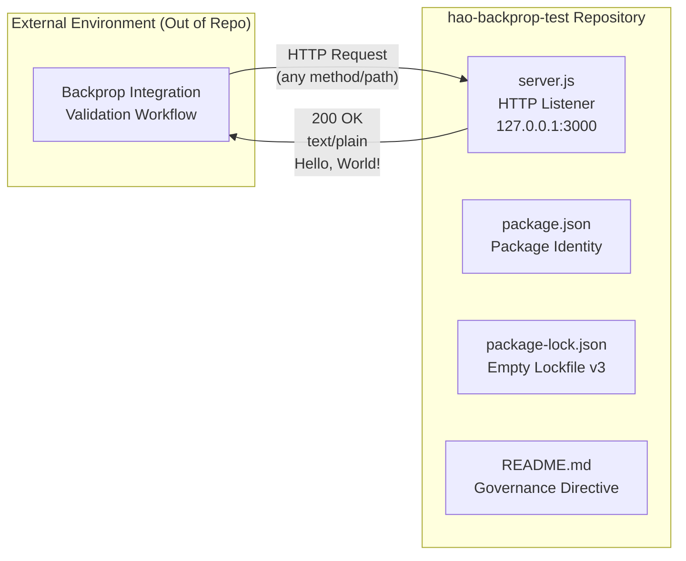

### 1.2.2 High-Level Description

#### Primary System Capabilities

The system exposes exactly four observable capabilities, each implemented in a single contiguous block of `server.js`:

| Capability | Implementation Locus | Observable Behavior |
|------------|---------------------|---------------------|
| HTTP Server Lifecycle | `http.createServer` + `server.listen` | Binds TCP socket on loopback port 3000 |
| Startup Logging | `console.log` callback to `listen` | Emits `Server running at http://127.0.0.1:3000/` to stdout |
| Request Acceptance | Anonymous handler function | Accepts every incoming HTTP request without filtering |
| Static Response Emission | `res.statusCode` + `res.setHeader` + `res.end` | Returns 200/`text/plain`/`Hello, World!\n` uniformly |

#### Major System Components

The repository contains exactly four production files plus auxiliary documentation. The runtime composition is summarized below:

| Component | File | Role |
|-----------|------|------|
| HTTP Runtime | `server.js` | Sole executable file; implements server lifecycle and request handling |
| Package Manifest | `package.json` | Declares package identity, MIT license, author `hxu`, placeholder test script |
| Dependency Lockfile | `package-lock.json` | Lockfile version 3 with empty `packages` tree confirming zero dependencies |
| Governance Document | `README.md` | Title plus "Do not touch!" immutability directive |

Auxiliary directories (`docs/` and `blitzy/documentation/`) contain analysis artifacts and engagement governance materials but are not part of the runtime surface and do not affect the executable behavior of the server.

#### Core Technical Approach

The system's technical approach is defined by a sequence of deliberate omissions as much as by its inclusions:

- **Module System**: CommonJS (`require('http')`); no ES module syntax, no `module.exports`
- **Dependencies**: None — neither `dependencies` nor `devDependencies` are declared
- **Runtime**: Node.js with built-in `http` module only; no `engines` field constrains the Node version
- **Build Pipeline**: None — no transpilation, no bundling, no minification
- **State Model**: Fully stateless; no persistence, no in-memory accumulation, no session tracking
- **Configuration Surface**: None — host (`127.0.0.1`) and port (`3000`) are hardcoded literals

The runtime sequence executed by `node server.js` is captured below:

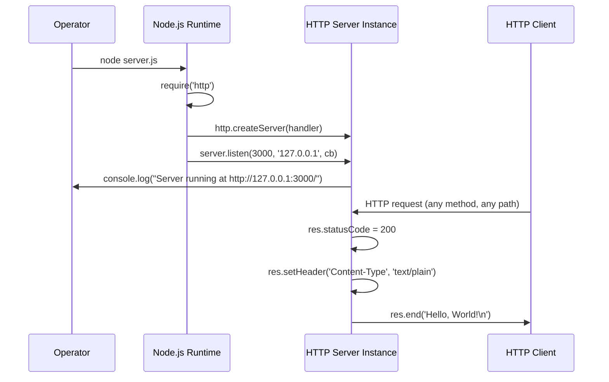

### 1.2.3 Success Criteria

#### Measurable Objectives

Success is defined exclusively in terms of behavioral conformance to the documented contract. Quantitative business metrics (revenue impact, cost savings, user growth) do not appear in any repository artifact and are therefore not part of the success definition.

| Objective | Measurement | Threshold |
|-----------|-------------|-----------|
| Server Startup | Process binds to TCP 127.0.0.1:3000 without error | Successful bind on first attempt |
| Response Status Correctness | HTTP status code emitted | Exactly `200` for every request |
| Response Body Correctness | Response body bytes | Exactly `Hello, World!\n` (14 bytes) |
| Response Header Correctness | `Content-Type` header value | Exactly `text/plain` |
| Source Immutability | Byte-level comparison of four baseline files | Zero deviation from committed state |

#### Critical Success Factors

| Critical Success Factor | Description |
|-------------------------|-------------|
| Behavioral Stability | The handler must respond identically regardless of request shape |
| Operational Availability | The server must reach the listening state when launched against an unoccupied port |
| Source Invariance | The four baseline files must remain byte-identical to satisfy the "Do not touch!" governance contract |
| Zero-Install Operability | The system must run via `node server.js` with no preceding install or build step |

#### Key Performance Indicators

No quantitative KPIs (throughput targets, latency budgets, error-rate ceilings, availability SLAs) are documented in the repository. The system's KPI surface is **qualitative pass/fail** along the dimensions enumerated in the measurable objectives table. Should KPIs be required by a consuming validation workflow, they must be defined and tracked externally to this repository.

---

## 1.3 SCOPE

### 1.3.1 In-Scope Elements

#### Core Features and Functionalities

The following capabilities are intentionally implemented and form the totality of the in-scope functional surface:

| Capability | Functional Scope |
|------------|-----------------|
| HTTP Server Lifecycle | Process startup, TCP bind to loopback, listening state, startup log emission |
| Request Acceptance | Acceptance of any HTTP request (any method, any path, any headers, any body) |
| Static Response Generation | Uniform emission of 200 / `text/plain` / `Hello, World!\n` |
| Package Identity Declaration | npm manifest with name, version, author, license, dangling `main` reference |
| Project Documentation | Two-line README establishing purpose and immutability directive |

#### Primary User Workflows

There are two recognized workflows, both operating on the system from outside:

| Workflow | Actor | Steps |
|----------|-------|-------|
| Server Launch | Operator | Execute `node server.js`; observe startup log on stdout |
| Integration Validation | Backprop Consumer | Issue HTTP request to `http://127.0.0.1:3000/`; verify response shape |

#### Essential Integrations

The only integration point in scope is **inbound HTTP traffic on the loopback interface, TCP port 3000**, served via the Node.js built-in `http` module. No other integrations (databases, message brokers, external APIs, observability backends, identity providers) are in scope.

#### Key Technical Requirements

| Requirement | Specification |
|-------------|--------------|
| Runtime | Node.js with built-in `http` module support |
| Module System | CommonJS |
| Network Binding | `127.0.0.1:3000` (hardcoded) |
| Dependency Footprint | Zero third-party packages |
| Launch Command | `node server.js` |

#### Implementation Boundaries

The system's boundaries are tight and enumerable:

| Boundary Dimension | In-Scope Coverage |
|--------------------|-------------------|
| Process Topology | One Node.js process |
| Network Reachability | Loopback interface only (`127.0.0.1`) |
| Client Population | Processes co-resident on the same host |
| Data Domain | A single static UTF-8 string (`Hello, World!\n`) |
| Licensing Coverage | MIT license terms apply to all repository content |

### 1.3.2 Out-of-Scope Elements

#### Explicitly Excluded Features and Capabilities

The following capabilities are **verified absent** from the implementation and are explicitly out of scope. Each is excluded by design and supported by direct evidence of non-presence in the source files:

| Excluded Category | Specific Exclusions |
|-------------------|---------------------|
| Web Frameworks | Express, Koa, Fastify, Hapi, or any third-party HTTP abstraction |
| Routing | Path-based, method-based, or parameter-based routing logic |
| Middleware | Request preprocessing, response postprocessing, body parsing, compression |
| Authentication & Authorization | API keys, tokens, OAuth, sessions, RBAC, ACLs |
| Configuration Management | Environment variables, config files, command-line flags, secrets management |
| Persistence | Databases, ORMs, file-based storage, in-memory caches |
| Error Handling | `try`/`catch` blocks, `'error'` event listeners, structured error responses |
| Graceful Shutdown | `SIGINT`/`SIGTERM` handlers, `server.close()` invocations, drain logic |
| Observability | Request logging, structured logs, metrics emission, distributed tracing, health endpoints |
| Quality Assurance | Automated tests, linters, formatters, type checkers (the `test` script is the npm-default placeholder) |
| Build & Delivery | Transpilation, bundling, minification, Dockerfile, CI/CD pipelines |
| Network Exposure | Public network binding, TLS termination, reverse proxy integration |
| Runtime Pinning | `engines` field in `package.json`; no Node.js version is enforced |
| Launch Convenience | `start` script in `package.json`; launch is exclusively via `node server.js` |

#### Future Phase Considerations

The "Do not touch!" directive in the README implies that **no future evolution of the four baseline files is anticipated**. No roadmap, no backlog, no version planning, no enhancement proposals exist within the repository. Augmentations performed by analytical processes (such as files added under `docs/` or `blitzy/documentation/`) are explicitly additive and do not modify the baseline. Any further-phase considerations therefore reside outside the boundary of this specification.

#### Integration Points Not Covered

| Excluded Integration | Reason for Exclusion |
|----------------------|---------------------|
| Outbound HTTP calls | No outbound client logic exists in `server.js` |
| Database connections | No driver dependencies declared; no connection logic implemented |
| Message brokers / queues | No client libraries; no producer/consumer code |
| External authentication providers | No identity integration implemented |
| Telemetry / APM backends | No instrumentation code or SDK imports |
| Container orchestration | No Dockerfile, no Kubernetes manifests, no Compose files |

#### Unsupported Use Cases

| Use Case | Reason Unsupported |
|----------|--------------------|
| Production Traffic Serving | Loopback-only binding; no resilience surface |
| High-Availability Deployment | Single process; no clustering or failover |
| Differentiated Routing | Branchless handler returns identical response to all paths |
| Stateful Interactions | No state model; each request is handled independently |
| Encrypted Transport | No TLS; HTTP only |
| Library / Module Embedding | No `module.exports`; cannot be `require`d as a library |
| Concurrent Multi-Port Operation | Single hardcoded port; no instance multiplication logic |

---

## 1.4 REFERENCES

### 1.4.1 Files Examined

- `server.js` — Sole runtime file; provided host/port/response constants, branchless handler structure, startup logging behavior, and absence of error handling, graceful shutdown, and exports
- `package.json` — Manifest source for package identity (`hello_world`), version (`1.0.0`), author (`hxu`), MIT license, placeholder test script, dangling `main: index.js` reference, and absence of dependencies and `engines` field
- `package-lock.json` — Lockfile version 3 with empty `packages` tree confirming zero third-party dependencies
- `README.md` — Three-line governance source; established repository title, self-stated purpose ("test project for backprop integration"), and "Do not touch!" immutability directive
- `docs/dead-code-analysis.md` — Confirmed zero removable dead code in baseline; documented the dangling `main` reference and idiomatic-but-unused `req` parameter
- `docs/testing-strategy.md` — Documented externally-observable contract (`200` / `text/plain` / `Hello, World!\n` / 14 bytes) and identified `EADDRINUSE` as the sole failure mode
- `blitzy/documentation/Agent Action Plan.md` — Source of engagement constraints (immutability C-001; behavioral invariants C-002 through C-004; zero-dependency C-005/C-006) used in scope definition
- `blitzy/documentation/Build Prompt.md` — Original user prompt context
- `blitzy/documentation/Technical Specifications.md` — Cross-referenced existing §1 Introduction for alignment with broader document scope and terminology
- `blitzy/documentation/Project Guide.md` — Runtime validation results (Node v20+ verified), completion status, and prerequisite confirmation

### 1.4.2 Folders Explored

- `/` (repository root) — Enumeration of four baseline files plus `docs/` and `blitzy/` subdirectories
- `docs/` — Inventory of additive analysis artifacts (dead-code report, testing strategy)
- `blitzy/` — Top-level governance folder containing `documentation/` subdirectory
- `blitzy/documentation/` — Engagement governance and specification hub containing the Agent Action Plan, Build Prompt, existing Technical Specifications draft, and Project Guide

# 2. Product Requirements

This section decomposes the `hao-backprop-test` system into discrete, testable features, formalizes their functional requirements, maps their relationships, and enumerates the implementation considerations governing each. The catalog reflects the verified surface area of the four baseline files (`server.js`, `package.json`, `package-lock.json`, `README.md`) introduced in §1.1 EXECUTIVE SUMMARY and bounded by the in-scope inventory in §1.3 SCOPE. No requirement in this section presumes functionality that is not directly observable in the committed source.

## 2.1 FEATURE CATALOG

The system surface area resolves to exactly six discrete features. Three are runtime features executed by `node server.js`; three are metadata, configuration, and governance features expressed through the manifest, lockfile, and README. The number of features is exhaustive at the current `1.0.0` version, and the "Do not touch!" directive in `README.md` precludes feature expansion absent an external authorization that overrides the immutability contract.

### 2.1.1 F-001: HTTP Server Lifecycle and TCP Binding

#### Feature Metadata

| Attribute | Value |
|-----------|-------|
| Unique ID | F-001 |
| Feature Name | HTTP Server Lifecycle and TCP Binding |
| Feature Category | Core Runtime / Network Listener |
| Priority Level | Critical |
| Status | Completed |

#### Description

- **Overview** — Instantiates an HTTP server through the Node.js core `http` module via `http.createServer(...)` and transitions it to the listening state with `server.listen(port, hostname, callback)`. The server binds to TCP `127.0.0.1:3000` on startup. The entire lifecycle is expressed across `server.js` lines 1, 3-4, 6, and 12-14.
- **Business Value** — Provides the predictable, deterministic network endpoint required by the external backprop integration tooling described in §1.1.2. Without this feature, no other runtime capability can function.
- **User Benefits** — A stable, well-known address (`http://127.0.0.1:3000/`) eliminates the need for service discovery, registration, or runtime configuration on the consumer side.
- **Technical Context** — Hostname `127.0.0.1` and port `3000` are declared as `const` literals at module scope and are not parameterized. The server instance is held in a `server` constant for subsequent `listen` invocation.

#### Dependencies

| Dependency Type | Specification |
|-----------------|--------------|
| Prerequisite Features | None |
| System Dependencies | Node.js runtime; built-in `http` core module |
| External Dependencies | None (zero npm packages, per F-005) |
| Integration Requirements | TCP port `3000` must be available on the loopback interface at startup |

### 2.1.2 F-002: Static HTTP Response Generation

#### Feature Metadata

| Attribute | Value |
|-----------|-------|
| Unique ID | F-002 |
| Feature Name | Static HTTP Response Generation |
| Feature Category | Request Handling / Response Generation |
| Priority Level | Critical |
| Status | Completed |

#### Description

- **Overview** — The request handler is deliberately non-discriminating: it ignores the `req` parameter entirely and produces an identical response for every incoming request, consisting of HTTP status code `200`, `Content-Type: text/plain` header, and the response body `"Hello, World!\n"` (14 bytes including the trailing newline; hex: `48 65 6C 6C 6F 2C 20 57 6F 72 6C 64 21 0A`).
- **Business Value** — The deterministic, byte-identical response is the precise property enabling the backprop validation workflow to operate without interference from application-layer variability. This is the system's primary observable behavior.
- **User Benefits** — A perfectly reproducible response eliminates test flakiness arising from varying payloads, status codes, or headers across requests.
- **Technical Context** — Implementation occupies `server.js` lines 6-10. The arrow-function handler signature `(req, res) => {...}` reads only `res`. Three response operations are performed in sequence: `res.statusCode = 200`, `res.setHeader('Content-Type', 'text/plain')`, and `res.end('Hello, World!\n')`.

#### Dependencies

| Dependency Type | Specification |
|-----------------|--------------|
| Prerequisite Features | F-001 (handler executes only when the server hosting it has been created) |
| System Dependencies | Node.js `http` module `IncomingMessage` / `ServerResponse` API |
| External Dependencies | None |
| Integration Requirements | HTTP/1.1 wire protocol semantics as implemented by Node.js `http` |

### 2.1.3 F-003: Startup Console Logging

#### Feature Metadata

| Attribute | Value |
|-----------|-------|
| Unique ID | F-003 |
| Feature Name | Startup Console Logging |
| Feature Category | Observability / Startup Signaling |
| Priority Level | Medium |
| Status | Completed |

#### Description

- **Overview** — Emits exactly one log line to stdout upon successful TCP bind, following the template `` `Server running at http://${hostname}:${port}/` ``, which resolves to `Server running at http://127.0.0.1:3000/`.
- **Business Value** — Provides the only built-in operational signal indicating that the fixture has reached its ready state. Per the success criteria in §1.2.3, this is the runtime witness that startup has completed.
- **User Benefits** — Allows a human operator or an automation script to deterministically detect that the server is available to receive traffic.
- **Technical Context** — Implementation is `server.js` line 13, contained within the callback passed as the third argument to `server.listen()`. There is no per-request logging, no log framework, and no log-level abstraction.

#### Dependencies

| Dependency Type | Specification |
|-----------------|--------------|
| Prerequisite Features | F-001 (the `listen` callback fires only after a successful bind) |
| System Dependencies | Node.js `console` global; attached stdout stream |
| External Dependencies | None |
| Integration Requirements | None |

### 2.1.4 F-004: Package Identity and Metadata Declaration

#### Feature Metadata

| Attribute | Value |
|-----------|-------|
| Unique ID | F-004 |
| Feature Name | Package Identity and Metadata Declaration |
| Feature Category | Configuration / Package Management |
| Priority Level | High |
| Status | Completed (with one preserved inconsistency — see Technical Context) |

#### Description

- **Overview** — Declares npm-compatible identity through `package.json`: `name = "hello_world"`, `version = "1.0.0"`, `description = "Hello world in Node.js"`, `main = "index.js"`, `author = "hxu"`, `license = "MIT"`, and a placeholder `scripts.test` value of `"echo \"Error: no test specified\" && exit 1"`.
- **Business Value** — Allows the project to participate in the npm ecosystem (introspection by `npm view`, license auditing, packaging tooling) even though no third-party packages are consumed and no publication is intended.
- **User Benefits** — Tooling expecting standard npm metadata can introspect the project without error.
- **Technical Context** — The entire `package.json` (11 lines) realizes this feature. **Preserved Inconsistency:** the `main` field references `"index.js"`, but no `index.js` file exists in the repository; the actual runtime entry is `server.js`, invoked directly via `node server.js` since no `start` script is declared. This inconsistency is preserved unchanged in conformance with the "Do not touch!" directive (see assumption A-004 and constraint C-001 in §2.6).

#### Dependencies

| Dependency Type | Specification |
|-----------------|--------------|
| Prerequisite Features | None |
| System Dependencies | npm-compatible package tooling for introspection |
| External Dependencies | None |
| Integration Requirements | Conformance to the npm `package.json` schema |

### 2.1.5 F-005: Zero-Dependency Operation

#### Feature Metadata

| Attribute | Value |
|-----------|-------|
| Unique ID | F-005 |
| Feature Name | Zero-Dependency Operation |
| Feature Category | Architecture / Dependency Posture |
| Priority Level | High |
| Status | Completed |

#### Description

- **Overview** — The project declares zero runtime and zero development dependencies. `package.json` omits both `dependencies` and `devDependencies` fields entirely, and `package-lock.json` (lockfile version 3, compatible with npm v7+) contains only the root `""` entry under `packages` — i.e., an empty dependency tree.
- **Business Value** — Eliminates supply-chain attack surface, removes the requirement for `npm install` prior to execution, and avoids transitive vulnerability exposure. Directly supports the "Operational Simplicity" and "Zero-Install Operability" success factors enumerated in §1.2.3.
- **User Benefits** — The fixture can be cloned and executed immediately on any host with a Node.js runtime, without network access and without disk allocation for a `node_modules` tree.
- **Technical Context** — The feature is expressed by absence in `package.json` (no dependency fields) and by structural emptiness in `package-lock.json` (empty `packages` tree below the root entry). The only library consumed by the runtime is the Node.js core `http` module.

#### Dependencies

| Dependency Type | Specification |
|-----------------|--------------|
| Prerequisite Features | None |
| System Dependencies | Node.js runtime providing the `http` core module |
| External Dependencies | None (by definition) |
| Integration Requirements | None |

### 2.1.6 F-006: Project Documentation and Immutability Directive

#### Feature Metadata

| Attribute | Value |
|-----------|-------|
| Unique ID | F-006 |
| Feature Name | Project Documentation and Immutability Directive |
| Feature Category | Documentation / Governance |
| Priority Level | Medium |
| Status | Completed |

#### Description

- **Overview** — A two-line `README.md` identifying the repository's purpose and imposing the governance constraint that defines the project. Line 1 (the title): `# hao-backprop-test`. Line 2 (the directive): `test project for backprop integration. Do not touch!`.
- **Business Value** — Operationalizes the source-invariance property identified in §1.1.4 and §1.2.3. Without an explicit immutability instruction, the fixture's value as a stable baseline could be compromised by well-intentioned modifications.
- **User Benefits** — Provides an unambiguous statement of intended use and change-control expectations, observable to anyone who clones or inspects the repository.
- **Technical Context** — The full content of `README.md` realizes this feature. No supplementary documentation files (`CONTRIBUTING.md`, `LICENSE.md`, `CODE_OF_CONDUCT.md`, etc.) exist at the repository root.

#### Dependencies

| Dependency Type | Specification |
|-----------------|--------------|
| Prerequisite Features | None |
| System Dependencies | None (static markdown text) |
| External Dependencies | None |
| Integration Requirements | None |

## 2.2 FUNCTIONAL REQUIREMENTS TABLE

Each feature's requirements are decomposed below using the identifier convention `F-XXX-RQ-YYY`. Per the formatting constraint of at most four columns per table, each requirement is documented across four facets — Requirement Details, Acceptance Criteria, Technical Specifications, and Validation Rules — presented as separate tables.

### 2.2.1 F-001 Functional Requirements (HTTP Server Lifecycle and TCP Binding)

#### Requirement Details

| Requirement ID | Description | Priority | Complexity |
|----------------|-------------|----------|------------|
| F-001-RQ-001 | Create an HTTP server instance via `http.createServer()` | Must-Have | Low |
| F-001-RQ-002 | Bind the server to loopback hostname `127.0.0.1` | Must-Have | Low |
| F-001-RQ-003 | Bind the server to TCP port `3000` | Must-Have | Low |
| F-001-RQ-004 | Transition the server to the listening state via `server.listen()` | Must-Have | Low |

#### Acceptance Criteria

| Requirement ID | Acceptance Criteria |
|----------------|---------------------|
| F-001-RQ-001 | Invocation returns a non-null `http.Server` instance, held in the `server` constant |
| F-001-RQ-002 | The bound TCP socket is reachable on `127.0.0.1` and not on any other interface |
| F-001-RQ-003 | The bound TCP socket is on port `3000`; `EADDRINUSE` is the only documented failure mode |
| F-001-RQ-004 | The `listen` callback executes exactly once after a successful bind |

#### Technical Specifications

| Requirement ID | Input Parameters | Output / Response | Data Requirements |
|----------------|------------------|-------------------|-------------------|
| F-001-RQ-001 | Request handler `(req, res) => {...}` | `http.Server` instance | None |
| F-001-RQ-002 | Hostname literal `'127.0.0.1'` | Socket bound to loopback interface | Module-scope `hostname` constant |
| F-001-RQ-003 | Port literal `3000` | Socket bound to port 3000 | Module-scope `port` constant |
| F-001-RQ-004 | `port`, `hostname`, listen callback | Server in listening state; callback fires | None |

#### Validation Rules

| Requirement ID | Business Rule | Data Validation | Security Requirement |
|----------------|---------------|-----------------|----------------------|
| F-001-RQ-001 | Must use Node.js core `http`, not a third-party framework | None (literal constants only) | None beyond Node.js defaults |
| F-001-RQ-002 | Loopback binding required; non-loopback exposure forbidden | Hostname must equal `127.0.0.1` | Loopback binding is the sole network access control |
| F-001-RQ-003 | Port `3000` required by integration contract | Port must equal `3000` | None |
| F-001-RQ-004 | Synchronous startup signaling expected | Callback must execute exactly once | None |

### 2.2.2 F-002 Functional Requirements (Static HTTP Response Generation)

#### Requirement Details

| Requirement ID | Description | Priority | Complexity |
|----------------|-------------|----------|------------|
| F-002-RQ-001 | Set the response status code to `200` | Must-Have | Low |
| F-002-RQ-002 | Set the `Content-Type` response header to `text/plain` | Must-Have | Low |
| F-002-RQ-003 | Emit a response body equal to `"Hello, World!\n"` (14 bytes) | Must-Have | Low |
| F-002-RQ-004 | Produce an identical response irrespective of request method, path, headers, query, or body | Must-Have | Low |

#### Acceptance Criteria

| Requirement ID | Acceptance Criteria |
|----------------|---------------------|
| F-002-RQ-001 | `curl -w "%{http_code}" http://127.0.0.1:3000/` returns `200` |
| F-002-RQ-002 | `curl -I http://127.0.0.1:3000/` shows `Content-Type: text/plain` |
| F-002-RQ-003 | `curl http://127.0.0.1:3000/` returns exactly the 14 bytes `Hello, World!\n` (hex: `48 65 6C 6C 6F 2C 20 57 6F 72 6C 64 21 0A`) |
| F-002-RQ-004 | Requests using `GET`, `POST`, `PUT`, `DELETE`, and `OPTIONS` against arbitrary paths all yield byte-identical responses |

#### Technical Specifications

| Requirement ID | Input Parameters | Output / Response | Data Requirements |
|----------------|------------------|-------------------|-------------------|
| F-002-RQ-001 | Ignored (`req` not read) | `res.statusCode = 200` | None |
| F-002-RQ-002 | Ignored | Header `Content-Type: text/plain` set via `res.setHeader` | None |
| F-002-RQ-003 | Ignored | `res.end('Hello, World!\n')` emits 14-byte body | Static UTF-8 string literal |
| F-002-RQ-004 | Any HTTP request | Same 200 / `text/plain` / `Hello, World!\n` response | None (handler is branchless) |

#### Validation Rules

| Requirement ID | Business Rule | Data Validation | Security Requirement |
|----------------|---------------|-----------------|----------------------|
| F-002-RQ-001 | Response must always be successful (no 4xx/5xx surfaces) | None (literal) | None |
| F-002-RQ-002 | Only `Content-Type` is set; no other security or framing headers | None | No CSP, HSTS, or other security headers required |
| F-002-RQ-003 | Body bytes are part of the integration contract | Body bytes immutable | Static literal eliminates injection surface |
| F-002-RQ-004 | Branchless handler is a deliberate design property | Request data must not be read or echoed | Request data is never reflected, eliminating echo-based attacks |

### 2.2.3 F-003 Functional Requirements (Startup Console Logging)

#### Requirement Details

| Requirement ID | Description | Priority | Complexity |
|----------------|-------------|----------|------------|
| F-003-RQ-001 | Emit a startup log message after successful `listen` | Should-Have | Low |
| F-003-RQ-002 | Format the message as `` `Server running at http://${hostname}:${port}/` `` | Should-Have | Low |

#### Acceptance Criteria

| Requirement ID | Acceptance Criteria |
|----------------|---------------------|
| F-003-RQ-001 | Exactly one log line appears on stdout following process startup |
| F-003-RQ-002 | The emitted line equals `Server running at http://127.0.0.1:3000/` |

#### Technical Specifications

| Requirement ID | Input Parameters | Output / Response | Data Requirements |
|----------------|------------------|-------------------|-------------------|
| F-003-RQ-001 | Triggered by `listen` callback | One line on stdout via `console.log` | None |
| F-003-RQ-002 | Module-scope `hostname` and `port` constants | Template-literal string interpolation | Shared with F-001 via lexical scope |

#### Validation Rules

| Requirement ID | Business Rule | Data Validation | Security Requirement |
|----------------|---------------|-----------------|----------------------|
| F-003-RQ-001 | One-shot log only; no per-request logging | None | Log line contains no secrets, tokens, or PII |
| F-003-RQ-002 | Hostname/port in the log must match the actual bind targets | Template variables must resolve to bound values | None |

### 2.2.4 F-004 Functional Requirements (Package Identity and Metadata Declaration)

#### Requirement Details

| Requirement ID | Description | Priority | Complexity |
|----------------|-------------|----------|------------|
| F-004-RQ-001 | Declare `name = "hello_world"` in `package.json` | Must-Have | Low |
| F-004-RQ-002 | Declare `version = "1.0.0"` in `package.json` | Must-Have | Low |
| F-004-RQ-003 | Declare `author = "hxu"` and `license = "MIT"` | Must-Have | Low |
| F-004-RQ-004 | Declare a placeholder `scripts.test` entry | Could-Have | Low |

#### Acceptance Criteria

| Requirement ID | Acceptance Criteria |
|----------------|---------------------|
| F-004-RQ-001 | `npm view ./` (or equivalent introspection) reports name `hello_world` |
| F-004-RQ-002 | The declared version is `1.0.0` and matches the lockfile root entry |
| F-004-RQ-003 | Author and license fields match across `package.json` and `package-lock.json` |
| F-004-RQ-004 | `npm test` prints `Error: no test specified` and exits with code `1` |

#### Technical Specifications

| Requirement ID | Input Parameters | Output / Response | Data Requirements |
|----------------|------------------|-------------------|-------------------|
| F-004-RQ-001 | n/a (declarative manifest) | `package.json` parses with `name = "hello_world"` | Valid JSON |
| F-004-RQ-002 | n/a | Version string `1.0.0` | Mirrors `package-lock.json` |
| F-004-RQ-003 | n/a | `author = "hxu"`, `license = "MIT"` | Consistent across manifest and lockfile |
| F-004-RQ-004 | `npm test` invocation | stdout `Error: no test specified`; exit code `1` | Placeholder npm-default value |

#### Validation Rules

| Requirement ID | Business Rule | Data Validation | Compliance Requirement |
|----------------|---------------|-----------------|------------------------|
| F-004-RQ-001 | Name `hello_world` preserved per "Do not touch!" | Must conform to npm name rules | npm `package.json` schema |
| F-004-RQ-002 | Static at `1.0.0`; no semver bumps planned | Must be valid semver | npm `package.json` schema |
| F-004-RQ-003 | MIT license governs all repository contents | License string must be a valid SPDX identifier | SPDX / MIT license terms |
| F-004-RQ-004 | Placeholder behavior is intentional; no real tests exist | `scripts.test` must remain the npm default | npm `package.json` schema |

> **Documented Inconsistency:** `package.json` line 5 declares `"main": "index.js"`, but no `index.js` file exists. Actual runtime entry is `server.js`. Preserved unchanged per constraint C-001 and assumption A-004 (§2.6). This is the "Dangling reference" verdict recorded in §2.5.2.

### 2.2.5 F-005 Functional Requirements (Zero-Dependency Operation)

#### Requirement Details

| Requirement ID | Description | Priority | Complexity |
|----------------|-------------|----------|------------|
| F-005-RQ-001 | Omit the `dependencies` field from `package.json` | Must-Have | Low |
| F-005-RQ-002 | Omit the `devDependencies` field from `package.json` | Must-Have | Low |
| F-005-RQ-003 | Use lockfile version `3` in `package-lock.json` | Must-Have | Low |
| F-005-RQ-004 | Keep the `packages` tree empty except for the root entry | Must-Have | Low |

#### Acceptance Criteria

| Requirement ID | Acceptance Criteria |
|----------------|---------------------|
| F-005-RQ-001 | JSON-parsing `package.json` yields no `dependencies` key |
| F-005-RQ-002 | JSON-parsing `package.json` yields no `devDependencies` key |
| F-005-RQ-003 | `lockfileVersion` in `package-lock.json` equals `3` |
| F-005-RQ-004 | The `packages` object contains exactly one key, the empty string `""`, with no nested entries |

#### Technical Specifications

| Requirement ID | Input Parameters | Output / Response | Data Requirements |
|----------------|------------------|-------------------|-------------------|
| F-005-RQ-001 | n/a (declarative absence) | Field not present | Valid JSON |
| F-005-RQ-002 | n/a | Field not present | Valid JSON |
| F-005-RQ-003 | n/a | `"lockfileVersion": 3` | npm v7+ compatibility |
| F-005-RQ-004 | n/a | Empty dependency tree | Lockfile schema v3 |

#### Validation Rules

| Requirement ID | Business Rule | Data Validation | Security Requirement |
|----------------|---------------|-----------------|----------------------|
| F-005-RQ-001 | Zero runtime dependencies required | Field must remain absent | Eliminates third-party supply-chain risk |
| F-005-RQ-002 | Zero development dependencies required | Field must remain absent | Eliminates dev-tooling supply-chain risk |
| F-005-RQ-003 | Lockfile must be present and at version 3 | Must be integer `3` | None |
| F-005-RQ-004 | No transitive packages tolerated | Object must contain only root entry | Closed supply-chain posture |

### 2.2.6 F-006 Functional Requirements (Project Documentation and Immutability Directive)

#### Requirement Details

| Requirement ID | Description | Priority | Complexity |
|----------------|-------------|----------|------------|
| F-006-RQ-001 | Provide a `README.md` file at the repository root | Must-Have | Low |
| F-006-RQ-002 | State the repository title as `hao-backprop-test` | Must-Have | Low |
| F-006-RQ-003 | State the purpose as "test project for backprop integration" | Must-Have | Low |
| F-006-RQ-004 | State the immutability directive "Do not touch!" | Must-Have | Low |

#### Acceptance Criteria

| Requirement ID | Acceptance Criteria |
|----------------|---------------------|
| F-006-RQ-001 | `README.md` exists at the repository root and is readable |
| F-006-RQ-002 | The first line of `README.md` equals `# hao-backprop-test` |
| F-006-RQ-003 | The second line contains the phrase `test project for backprop integration` |
| F-006-RQ-004 | The second line contains the literal phrase `Do not touch!` |

#### Technical Specifications

| Requirement ID | Input Parameters | Output / Response | Data Requirements |
|----------------|------------------|-------------------|-------------------|
| F-006-RQ-001 | n/a | File at `/README.md` | UTF-8 markdown text |
| F-006-RQ-002 | n/a | Markdown H1 header | Static literal |
| F-006-RQ-003 | n/a | Plain-text purpose declaration | Static literal |
| F-006-RQ-004 | n/a | Plain-text immutability directive | Static literal |

#### Validation Rules

| Requirement ID | Business Rule | Data Validation | Compliance Requirement |
|----------------|---------------|-----------------|------------------------|
| F-006-RQ-001 | README must be present | File must exist | None |
| F-006-RQ-002 | Title must match git repository name | First line byte-identical to `# hao-backprop-test` | None |
| F-006-RQ-003 | Purpose statement must be unambiguous | Verbatim string match | None |
| F-006-RQ-004 | Immutability directive is the operational contract | Verbatim string match | Governs constraints C-001 through C-007 in §2.6 |

## 2.3 FEATURE RELATIONSHIPS

The six features form a small, tightly bounded relationship graph. Runtime execution dependencies exist only among F-001, F-002, and F-003. The metadata features (F-004, F-005, F-006) have no runtime coupling to the executing server; F-005 enables the no-install execution model, and F-006 imposes governance over the entire repository.

### 2.3.1 Feature Dependency Map

The following diagram visualizes the dependency relationships. Solid arrows represent runtime execution dependencies; dashed arrows represent enabling or governance relationships rather than execution prerequisites.

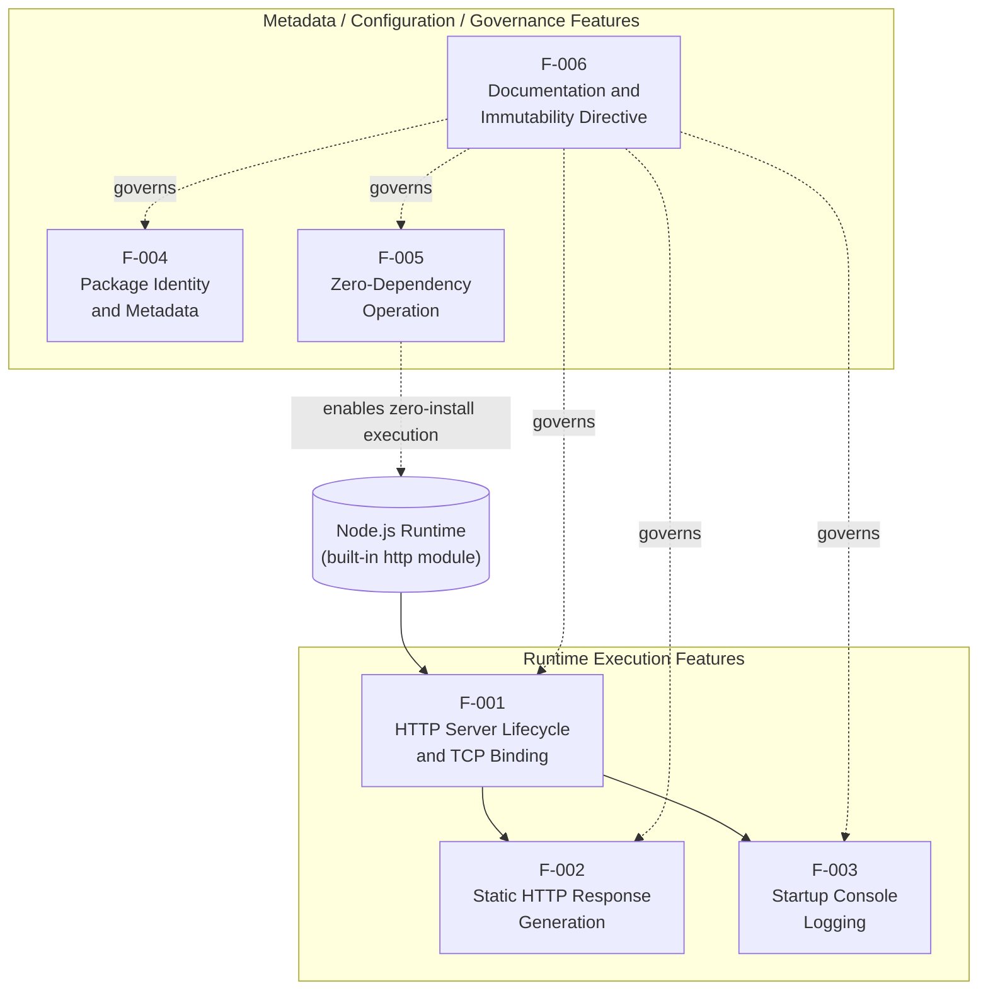

Key relationships expressed by the diagram:

- **F-002 depends on F-001** — the request handler defined for F-002 only executes within a server instance created by F-001.
- **F-003 depends on F-001** — the startup log is emitted from the callback supplied to `server.listen()`, which is the F-001 lifecycle transition.
- **F-005 enables the Node.js-only execution model** — by declaring zero dependencies, F-005 ensures the runtime environment for F-001/F-002/F-003 is simply Node.js with its built-in `http` module.
- **F-006 governs all other features** — the "Do not touch!" directive is the change-control constraint applied uniformly to every baseline file and therefore every feature.

### 2.3.2 Integration Points

| Integration Point | Direction | Protocol | Consumer / Producer |
|-------------------|-----------|----------|---------------------|
| `127.0.0.1:3000` HTTP socket | Inbound | HTTP/1.1 plaintext | Backprop integration tooling (external, undefined within repo) |

The system has **exactly one integration point** and **no outbound integrations**. There are no DNS lookups, outbound HTTP calls, database connections, message brokers, telemetry exports, or service-discovery registrations, consistent with the integration boundary described in §1.2.1 and the out-of-scope items enumerated in §1.3.2.

### 2.3.3 Shared Components

| Shared Element | Scope of Sharing | Features Coupled |
|----------------|------------------|------------------|
| Module-scope `hostname` constant (`'127.0.0.1'`) | Lexical scope of `server.js` | F-001 (bind target), F-003 (log message) |
| Module-scope `port` constant (`3000`) | Lexical scope of `server.js` | F-001 (bind target), F-003 (log message) |
| Node.js `http` core module | Process-level | F-001 (server creation), F-002 (response API) |
| MIT license | Repository-level | F-004 (declared), all features (governed) |

No internal helper modules, utility libraries, factories, service registries, or cross-cutting abstractions exist. The single source file `server.js` exposes no symbols (no `module.exports`), and the project cannot be `require`d as a library — consistent with the "Library / Module Embedding" exclusion in §1.3.2.

### 2.3.4 Common Services

The system has no common services in the conventional sense. There is no logging service, no configuration service, no telemetry service, no error-handling middleware, and no dependency-injection container. The only cross-feature service is the Node.js `http` core module itself, which is treated as part of the runtime substrate rather than an internal service.

## 2.4 IMPLEMENTATION CONSIDERATIONS

The implementation considerations enumerated here apply uniformly across the six features, because the entire system is a single 14-line source file plus a manifest, lockfile, and README. Per-feature variations are called out where they exist.

### 2.4.1 Technical Constraints

| Constraint Category | Constraint | Applies To |
|---------------------|------------|------------|
| Language | JavaScript using CommonJS (`require`); no ESM syntax | F-001, F-002, F-003 |
| Runtime | Node.js with no `engines` field; runtime version unconstrained | F-001, F-002, F-003 |
| Module System | CommonJS only — no `import`/`export`/`module.exports` | F-001, F-002, F-003 |
| Web Framework | None permitted — only Node.js core `http` | F-001, F-002 |
| Network Interface | Loopback `127.0.0.1` hardcoded; not configurable | F-001 |
| Port | `3000` hardcoded; not configurable | F-001 |
| Configuration Mechanism | None — no `process.env`, CLI args, or config files | All features |
| Build Pipeline | None — direct execution via `node server.js` | F-001, F-002, F-003 |
| Source Mutability | Files must not be modified per README directive | All features |

### 2.4.2 Performance Requirements

No quantitative performance targets (throughput, latency, error rates, availability SLAs) are documented in any repository file, consistent with §1.2.3's qualitative pass/fail KPI posture. Performance is bounded only by the natural characteristics of Node.js `http` on the host. The implicit performance posture per feature is summarized below.

| Feature | Implicit Performance Posture |
|---------|------------------------------|
| F-001 | TCP bind completes synchronously with OS socket allocation |
| F-002 | Response generation is in-memory and allocation-free of user data; constant-time |
| F-003 | A single synchronous `console.log` at startup; zero per-request logging overhead |
| F-004 | Static metadata; no runtime cost |
| F-005 | Eliminates `npm install` time and dependency-resolution startup cost |
| F-006 | Static documentation; no runtime cost |

### 2.4.3 Scalability Considerations

| Scalability Dimension | Posture |
|-----------------------|---------|
| Horizontal Scaling | Not supported (no clustering, no process manager) |
| Vertical Scaling | Bounded by single-process Node.js limits |
| Concurrency Model | Single Node.js event-loop process (no `cluster` or `worker_threads`) |
| State Migration | Not applicable (fully stateless) |
| Load Distribution | Not applicable (loopback-only binding precludes external load distribution) |

### 2.4.4 Security Implications

| Security Aspect | Posture | Mitigating Factor |
|-----------------|---------|-------------------|
| Authentication | None | Loopback binding restricts socket reach |
| Authorization | None | Same as above |
| Transport Encryption | None (plaintext HTTP) | Loopback traffic does not traverse external networks |
| Input Validation | None (request ignored) | No input consumed, eliminating injection surfaces |
| Output Encoding | Static literal | Body and headers are compile-time constants |
| Security Headers | Only `Content-Type` | No CSP, HSTS, X-Frame-Options; not required for loopback fixture |
| Dependency Vulnerabilities | None | Zero dependencies (F-005) |
| Network Exposure | Loopback only | Hardcoded `127.0.0.1` prevents external reachability |

### 2.4.5 Maintenance Requirements

| Maintenance Dimension | Posture |
|-----------------------|---------|
| Change-Control Posture | "Do not touch!" — explicit immutability per F-006 |
| Versioning | Static at `1.0.0`; no semver evolution planned |
| Custodianship | Sole declared author `hxu`; no `CODEOWNERS` or `MAINTAINERS` files |
| Defect Process | Not documented in repository |
| Documentation Maintenance | README is immutable per its own directive |
| Test Maintenance | Placeholder `scripts.test` only; no real tests to maintain |
| Dependency Updates | Not applicable (zero dependencies) |
| Runtime Upgrades | No Node.js version pin; user-managed |

## 2.5 TRACEABILITY MATRIX

### 2.5.1 Requirement-to-Feature-to-Source Mapping

The following matrix traces each requirement family to its implementing feature and the specific source location that realizes it. This mapping is complete and exhaustive for the four-file baseline.

| Requirement Family | Feature | Source File and Lines |
|--------------------|---------|------------------------|
| F-001-RQ-001..004 | F-001 | `server.js` lines 1, 3-4, 6, 12-14 |
| F-002-RQ-001..004 | F-002 | `server.js` lines 6-10 |
| F-003-RQ-001..002 | F-003 | `server.js` line 13 |
| F-004-RQ-001..004 | F-004 | `package.json` (all 11 lines) |
| F-005-RQ-001..004 | F-005 | `package.json` (absence of dep fields) and `package-lock.json` lines 3-12 |
| F-006-RQ-001..004 | F-006 | `README.md` (all 3 lines) |

### 2.5.2 Reference-Verification Matrix

Each runtime construct in `server.js` was checked for cross-references between its declaration site and any subsequent use site. The following matrix records the verification outcomes — all declared symbols are used, except for the idiomatically unused `req` parameter and the documented dangling `main` reference.

| Element | Declaration Location | Reference Check | Verdict |
|---------|---------------------|-----------------|---------|
| `http` import | `server.js` line 1 | Used by `http.createServer` (line 6) | Used |
| `hostname` const | `server.js` line 3 | Used by `server.listen` (line 12) and log template (line 13) | Used |
| `port` const | `server.js` line 4 | Used by `server.listen` (line 12) and log template (line 13) | Used |
| `server` const | `server.js` line 6 | Used by `server.listen` (line 12) | Used |
| `res` handler param | `server.js` line 6 | Used by `res.statusCode` / `setHeader` / `end` (lines 7-9) | Used |
| `req` handler param | `server.js` line 6 | Not read anywhere; handler is branchless | Idiomatically unused (preserved) |
| `"main": "index.js"` | `package.json` line 5 | No `index.js` file exists | Dangling reference (preserved per C-001) |

### 2.5.3 Cross-Section Reference Map

| Topic | Related Section |
|-------|-----------------|
| Stakeholder identity and value proposition | §1.1.3, §1.1.4 |
| System capabilities and runtime sequence diagram | §1.2.2 |
| Success criteria and pass/fail KPIs | §1.2.3 |
| In-scope inventory and explicitly excluded capabilities | §1.3.1, §1.3.2 |
| File-level evidence sources | §1.4.1 |

## 2.6 ASSUMPTIONS AND CONSTRAINTS

### 2.6.1 Assumptions

| ID | Assumption | Rationale / Source |
|----|------------|--------------------|
| A-001 | Node.js is installed on the host that runs `server.js` | No installer or runtime bundling is provided in the repository |
| A-002 | TCP port `3000` is free on loopback at startup | No fallback port logic exists; collision raises `EADDRINUSE` |
| A-003 | The backprop consumer issues HTTP/1.1 requests from a co-resident process | Loopback binding restricts reachability to the same host |
| A-004 | Readers will tolerate `main: "index.js"` despite the absence of `index.js` | The README immutability directive forbids correction |
| A-005 | No security review of plaintext HTTP / loopback binding is required | The fixture is local-only by design (see §2.4.4 mitigations) |

### 2.6.2 Constraints

| ID | Constraint | Source |
|----|------------|--------|
| C-001 | All four baseline files must remain unchanged from their committed state | `README.md` "Do not touch!" directive |
| C-002 | Hostname must remain hardcoded to `127.0.0.1` | `server.js` line 3 |
| C-003 | Port must remain hardcoded to `3000` | `server.js` line 4 |
| C-004 | Response body, status, and headers must remain byte-identical | `server.js` lines 7-9 |
| C-005 | Zero runtime and zero development dependencies | `package.json` and `package-lock.json` |
| C-006 | Project must remain executable on Node.js without prior `npm install` | Consequence of C-005 |
| C-007 | License of all repository contents is MIT | `package.json` and `package-lock.json` license fields |

### 2.6.3 Requirement Version Tracking

All requirements documented in this section correspond to `package.json` version `1.0.0` (mirrored in `package-lock.json`). No prior version exists in the repository; there is no `CHANGELOG`, no migration notes, and no version-control commentary inside the baseline files. All requirements are at their initial revision and are tracked against the single declared version `1.0.0`. Any future revision would require an override of the C-001 immutability constraint.

| Tracking Attribute | Value |
|--------------------|-------|
| Requirements Document Version | 1.0.0 (aligned with `package.json` version) |
| Lockfile Version | 3 |
| Baseline File Count | 4 (`server.js`, `package.json`, `package-lock.json`, `README.md`) |
| Total Features | 6 (F-001 through F-006) |
| Total Functional Requirements | 22 (4 + 4 + 2 + 4 + 4 + 4) |

## 2.7 REFERENCES

### 2.7.1 Files Examined

- `server.js` — Sole runtime file; provided the implementation evidence for F-001 (lines 1, 3-4, 6, 12-14), F-002 (lines 6-10), and F-003 (line 13), as well as the reference-verification entries in §2.5.2
- `package.json` — Provided the manifest evidence for F-004 (full file), the dependency-absence evidence for F-005, and the dangling `main: "index.js"` inconsistency documented in §2.2.4 and §2.5.2
- `package-lock.json` — Provided the lockfile evidence for F-005 (lockfile version 3, empty `packages` tree)
- `README.md` — Provided the title, purpose, and immutability-directive evidence for F-006 and the source of constraint C-001

### 2.7.2 Folders Explored

- `/` (repository root) — Enumerated the four baseline files (`server.js`, `package.json`, `package-lock.json`, `README.md`) plus the `docs/` and `blitzy/` documentation directories
- `docs/` — Reviewed for analytical artifacts; no runtime impact on features F-001 through F-006
- `blitzy/documentation/` — Reviewed for governance materials including the existing technical specification draft against which this section's feature catalog was cross-checked

### 2.7.3 Technical Specification Sections Cross-Referenced

- §1.1 EXECUTIVE SUMMARY — Stakeholder identity, business problem, value proposition
- §1.2 SYSTEM OVERVIEW — Primary capabilities, runtime sequence, success criteria, KPIs
- §1.3 SCOPE — In-scope feature inventory and verified out-of-scope items
- §1.4 REFERENCES — Source file inventory consistent with the feature-to-file mapping in §2.5.1

# 3. Technology Stack

## 3.1 STACK PHILOSOPHY AND OVERVIEW

The technology stack for the `hao-backprop-test` repository (npm package `hello_world` v1.0.0) is governed by an explicit minimalism principle: the system is a deliberately-constructed, byte-stable HTTP fixture whose value derives from behavioral determinism rather than feature richness. Per the Core Technical Approach defined in §1.2.2, the entire runtime stack consists of **JavaScript executed on Node.js using only the built-in `http` core module**, with no third-party dependencies, no build pipeline, no containerization, and no external service integrations.

This minimalism is not incidental — it is enforced by seven hard constraints (C-001 through C-007 defined in §2.6.2). Constraint C-001 ("All four baseline files must remain unchanged from their committed state") combined with constraint C-005 ("Zero runtime and zero development dependencies") jointly preclude any expansion of the technology stack. Constraint C-006 reinforces this by requiring the project to remain executable on Node.js without prior `npm install`.

### 3.1.1 Default Technology Stack Applicability Assessment

The default enterprise technology stack provided as guidance (AWS, Docker, Terraform, GitHub Actions, Python/Flask, Auth0, MongoDB, Langchain, React/TypeScript, TailwindCSS, React-Native, Swift, Kotlin, Objective-C, ElectronJS) is **categorically inapplicable** to this system. Per §1.3.2, every category in that stack — web frameworks, persistence, authentication, container orchestration, CI/CD pipelines — is explicitly verified absent from the repository and is enumerated as out-of-scope. Adoption of any default-stack item would violate constraint C-005 and, by extension, C-001.

### 3.1.2 Effective Technology Stack at a Glance

| Layer | Technology | Version | Rationale |
|-------|-----------|---------|-----------|
| Programming Language | JavaScript (ECMAScript) | Compatible with Node.js ≥ 20 | Sole language understood by the Node.js runtime when using core APIs |
| Module System | CommonJS | N/A (built-in) | Per §1.2.2, no `import`/`export`/`module.exports` syntax is used |
| Runtime | Node.js | v20.20.2 (verified; not pinned) | Provides the built-in `http` module without additional installs |
| HTTP Engine | Node.js core `http` module | Bundled with Node.js | Per §2.4.1, "no permitted" web framework — core `http` only |
| Package Manager | npm | 10.8.2 (bundled with Node 20) | Used solely for manifest/lockfile presence; never invoked for install |
| Lockfile Format | npm lockfile | Version 3 | npm v7+ schema; empty `packages` tree confirms zero dependencies |
| License | MIT | N/A | Per `package.json` license field and constraint C-007 |

### 3.1.3 Stack Composition Diagram

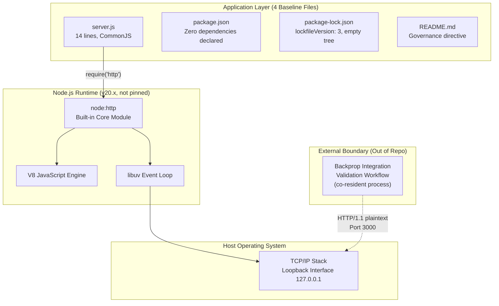

The diagram demonstrates the entire technology stack: an application layer of four immutable files calls into the Node.js built-in `http` module, which leverages libuv and V8 to bind a loopback TCP socket. There are zero intermediate layers — no framework, no middleware, no proxy, no transport security.

---

## 3.2 PROGRAMMING LANGUAGES

### 3.2.1 Language Inventory by Component

The repository contains a single executable source file and therefore exposes a single programming language. There are no separate client, server, mobile, or infrastructure tiers requiring distinct languages.

| Component | Language | File | Module System | Reference |
|-----------|----------|------|---------------|-----------|
| HTTP Runtime | JavaScript (ECMAScript) | `server.js` (14 lines) | CommonJS | §2.4.1 Language constraint |
| Package Manifest | JSON | `package.json` (11 lines) | N/A | §1.2.2 Major Components |
| Dependency Lockfile | JSON | `package-lock.json` (13 lines) | N/A | §1.2.2 Major Components |
| Documentation | Markdown | `README.md` (3 lines) | N/A | §1.2.2 Major Components |

### 3.2.2 JavaScript Selection Rationale

JavaScript is the **sole runtime language** by virtue of the implementation's exclusive use of Node.js core APIs. Per §1.2.2 "Core Technical Approach," the module system is strictly **CommonJS** — `server.js` uses `require('http')` and contains no `import`/`export`/`module.exports` syntax. Per §2.4.1 (Technical Constraints table), this CommonJS restriction applies to features F-001 (HTTP Server Lifecycle), F-002 (Request/Response Generation), and F-003 (Startup Logging).

The selection criteria, while not explicitly documented as a design decision, derive from three observable design properties:

- **Zero-install operability** (per constraint C-006 in §2.6.2): JavaScript executed by Node.js requires no compilation or transpilation step. The launch command is unambiguously `node server.js` per §1.3.1.
- **Built-in HTTP capability**: Node.js ships with a complete HTTP/1.1 server implementation as a core module, removing any need for third-party framework adoption (consistent with F-005's zero-dependency principle).
- **CommonJS compatibility**: Per §1.2.2, the module system is "CommonJS (`require('http')`); no ES module syntax, no `module.exports`," ensuring maximum runtime compatibility without requiring `"type": "module"` in `package.json` or `.mjs` file extensions.

### 3.2.3 Language Exclusions

| Language | Status | Evidence |
|----------|--------|----------|
| TypeScript | Not used | Per `docs/dead-code-analysis.md`: "this is plain JavaScript, not TypeScript"; no `tsconfig.json`, no `.ts` files |
| Python | Not used | Default-stack item; non-applicable per §1.3.2 |
| Swift / Kotlin / Objective-C | Not used | No native mobile or desktop application surface |
| ESM JavaScript | Not used | Per §1.2.2, "no ES module syntax" — only CommonJS `require` is permitted |

### 3.2.4 Language-Level Constraints and Dependencies

- **Constraint C-001** (immutability): Forbids migration to TypeScript, ESM, or any other language variant.
- **Constraint C-005** (zero dependencies): Forbids introduction of language-level tooling such as Babel, ts-node, esbuild, or SWC.
- **No `engines` field** in `package.json` (per §1.2.2): The JavaScript dialect is implicitly bounded by whatever the executing Node.js runtime supports; no minimum ECMAScript edition is pinned.

---

## 3.3 FRAMEWORKS & LIBRARIES

### 3.3.1 Core Frameworks

**There are no third-party frameworks of any kind in this system.** Per §2.4.1 (Technical Constraints), the "Web Framework" constraint is explicit: **"None permitted — only Node.js core `http`"**, applying to features F-001 and F-002.

The single framework-equivalent component used by the application is the Node.js built-in `http` core module, which is imported on line 1 of `server.js` and provides:

| Capability | API Used | Feature Reference |
|------------|----------|-------------------|
| Server instantiation | `http.createServer(handler)` | F-001 (HTTP Server Lifecycle) |
| Socket binding | `server.listen(3000, '127.0.0.1', callback)` | F-001 |
| Response status assignment | `res.statusCode = 200` | F-002 (Request/Response Generation) |
| Header emission | `res.setHeader('Content-Type', 'text/plain')` | F-002 |
| Response body finalization | `res.end('Hello, World!\n')` | F-002 |

The `http` core module is bundled with every Node.js distribution and is therefore versioned with the Node.js runtime itself rather than separately tracked in a package manifest.

### 3.3.2 Explicitly Excluded Frameworks and Libraries

Per §1.3.2 (Out-of-Scope Elements), the following framework and library categories are **verified absent** from the implementation. Each exclusion is supported by direct evidence of non-presence in `package.json` and `package-lock.json`:

| Excluded Category | Specific Exclusions |
|-------------------|---------------------|
| Web Frameworks | Express, Koa, Fastify, Hapi, or any third-party HTTP abstraction |
| Routing Libraries | Path-based, method-based, or parameter-based routing logic |
| Middleware | Body parsers, compression, CORS, request preprocessing, response postprocessing |
| Authentication Libraries | OAuth clients, JWT, session middleware, RBAC engines |
| Configuration Management | dotenv, config, convict, environment-variable loaders |
| ORM / Database Libraries | Mongoose, Sequelize, TypeORM, Knex, Prisma |
| Logging Frameworks | Winston, Pino, Bunyan, Morgan |
| Test Frameworks | Jest, Mocha, Vitest, Jasmine, AVA, Tap |
| Linters / Formatters | ESLint, Prettier, StandardJS (not installed; would violate C-005) |
| Type Checkers | TypeScript, Flow |
| Build Tools | Webpack, Vite, Rollup, esbuild, Parcel, SWC, Babel |
| HTTP Clients | Axios, node-fetch, got, superagent (no outbound calls exist) |

### 3.3.3 Justification for Zero-Framework Architecture

The decision to forgo all third-party frameworks is rooted in the system's purpose as a **deterministic counterparty** for an external validation workflow. Per §1.1.2 (referenced via the section context), "By eliminating all variability — no routing logic, no middleware, no environment-driven configuration, no persistent state, no external dependencies — the fixture provides a deterministic counterparty."

The benefits enumerated for F-005 (Zero Runtime Dependencies) in §2.1.5 directly justify the framework-free approach:

- **Eliminates supply-chain attack surface**: With no transitive dependency closure, there is no opportunity for malicious package compromise.
- **Removes the requirement for `npm install` prior to execution**: Per constraint C-006, the project must be runnable on Node.js without a prior install step.
- **Avoids transitive vulnerability exposure**: There are no upstream CVEs to track or remediate.
- **Maximizes startup determinism**: There is no module-resolution overhead beyond the built-in `http` import.

### 3.3.4 Compatibility Requirements

Because no third-party libraries are present, no compatibility matrix exists between framework versions. The only compatibility relationship is between `server.js` and the Node.js core `http` API, which is a stable, semantically-versioned core component of Node.js itself. The recommended runtime is **Node.js ≥ 20** as confirmed by `docs/testing-strategy.md`, which notes that `node:test` (a built-in module relevant to optional testing) "has been a stable, dependency-free part of the Node.js runtime since Node v20."

---

## 3.4 OPEN-SOURCE DEPENDENCIES

### 3.4.1 Runtime Dependencies

**ZERO runtime dependencies.** The `package.json` file does not declare a `dependencies` field at all. This satisfies functional requirement F-005-RQ-001 (per §2.2 Functional Requirements Table).

### 3.4.2 Development Dependencies

**ZERO development dependencies.** The `package.json` file does not declare a `devDependencies` field at all. This satisfies functional requirement F-005-RQ-002.

### 3.4.3 Package Manifest Inventory

The complete declared metadata of the npm package, drawn from `package.json`:

| Attribute | Value | Significance |
|-----------|-------|--------------|
| Package Name | `hello_world` | Distinct from repository name `hao-backprop-test`; per §1.2.1 |
| Repository Name | `hao-backprop-test` | Git repository identifier |
| Version | `1.0.0` | Mirrored in `package-lock.json`; per §2.6.3 |
| Description | `Hello world in Node.js` | Single-line descriptor |
| Main Entry | `index.js` | **Dangling reference** — no `index.js` file exists; per A-004 the directive forbids correction |
| Test Script | `echo "Error: no test specified" && exit 1` | npm-default placeholder; per §1.3.2, no QA tooling in scope |
| Start Script | Not declared | Per §1.3.2, no `start` script; launch is exclusively via `node server.js` |
| Author | `hxu` | Sole declared author; no `CODEOWNERS` per §2.4.5 |
| License | `MIT` | Per constraint C-007 |
| `dependencies` Field | **Absent** | Per F-005-RQ-001 |
| `devDependencies` Field | **Absent** | Per F-005-RQ-002 |
| `engines` Field | **Absent** | Per §1.2.2, no Node.js version pin |

### 3.4.4 Lockfile Inventory

The `package-lock.json` file confirms the zero-dependency posture through its data structure:

| Attribute | Value | Significance |
|-----------|-------|--------------|
| `name` | `hello_world` | Mirrors `package.json` |
| `version` | `1.0.0` | Mirrors `package.json` |
| `lockfileVersion` | `3` | npm v7+ schema; current standard format |
| `requires` | `true` | Standard npm metadata flag |
| `packages` | Single entry: empty key `""` containing root metadata only | **Confirms empty dependency tree** — no nested entries; per F-005-RQ-004 |

### 3.4.5 Package Registry

The package registry is **npm** (the default JavaScript package registry), as evidenced by the npm-format `package-lock.json` with `lockfileVersion: 3`. However, no packages are ever fetched from this registry because the dependency tree is empty. The registry is referenced solely by virtue of the lockfile format; no `.npmrc`, no `npm config` overrides, and no scoped registries are configured.

### 3.4.6 Dependency Tree Visualization

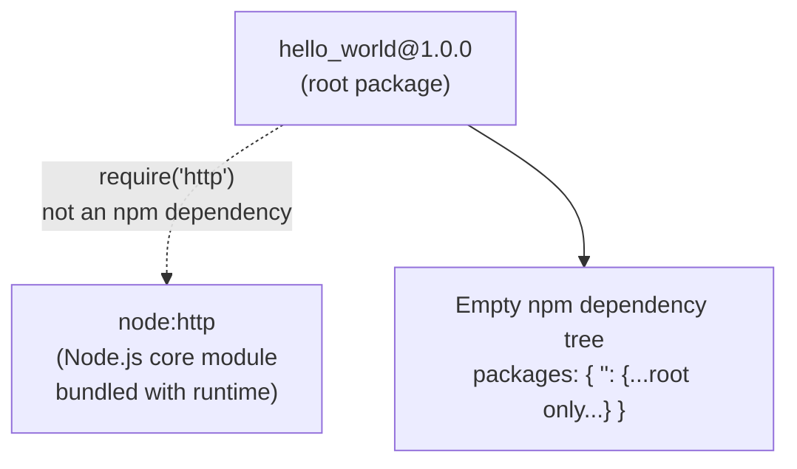

The diagram makes explicit the distinction between **npm-managed dependencies** (none) and the **Node.js built-in module** (`http`), which is provided by the runtime and is not an npm package.

---

## 3.5 THIRD-PARTY SERVICES

### 3.5.1 External Service Inventory

**No third-party services are used or integrated.** Per §2.3.2 (referenced via the section context), "The system has exactly one integration point and no outbound integrations." That single integration point is **inbound HTTP/1.1 plaintext traffic on `127.0.0.1:3000`**.

| Service Category | Status | Evidence |
|------------------|--------|----------|
| External APIs | None | `server.js` contains no outbound HTTP client code |
| Authentication Services (Auth0, Okta, Cognito) | None | Per §2.4.4, "Authentication: None"; no identity integration |
| Authorization Services (RBAC providers) | None | Per §2.4.4, "Authorization: None" |
| Monitoring / APM (Datadog, New Relic, Sentry) | None | Per §1.3.2, "no instrumentation code or SDK imports" |
| Logging Backends (Splunk, ELK, Loggly) | None | Per §1.3.2, observability is verified absent |
| Cloud Services (AWS, GCP, Azure) | None | No cloud SDK; no Dockerfile; no IaC |
| Service Discovery (Consul, etcd) | None | Hardcoded loopback binding precludes discovery |
| Message Brokers / Queues (Kafka, RabbitMQ, SQS) | None | No client libraries; no producer/consumer code |
| External Databases | None | No driver dependencies (see §3.6) |
| CDN Services | None | No static asset distribution |
| Email / SMS Services | None | No notification or transactional messaging |
| Feature Flag Services (LaunchDarkly) | None | No runtime configuration surface |

### 3.5.2 Integration Boundary

The integration boundary is restricted to a **single inbound HTTP channel** on the loopback interface. Per §1.2.1, the integration is "one-directional and protocol-based" — external consumers (co-resident processes) issue HTTP requests to the server, and the server responds with a static payload. There is:

- **No outbound network traffic** of any kind
- **No DNS lookups** (the bind address is the literal `127.0.0.1`)
- **No service discovery registration**
- **No telemetry emission** to any backend
- **No third-party SDK imports** in `server.js`

This posture satisfies assumption A-003 (per §2.6.1): "The backprop consumer issues HTTP/1.1 requests from a co-resident process; loopback binding restricts reachability to the same host."

---

## 3.6 DATABASES & STORAGE

### 3.6.1 Persistence Posture

**No databases, caches, or persistent storage are used.** Per §1.2.2 (Core Technical Approach), the "State Model" is "Fully stateless; no persistence, no in-memory accumulation, no session tracking."

| Storage Type | Status | Reference |
|--------------|--------|-----------|
| Primary Database (SQL) | None | Per §1.3.2 out-of-scope: "Databases, ORMs" |
| Primary Database (NoSQL such as MongoDB) | None | Default-stack item; non-applicable |
| Caching Layer (Redis, Memcached) | None | Per §1.3.2: "in-memory caches" verified absent |
| Object Storage (S3, GCS, Azure Blob) | None | No cloud SDKs |
| File-Based Persistence | None | Per §1.3.2: "file-based storage" verified absent |
| Session Storage | None | Per §1.3.2: "sessions" verified absent |
| In-Memory Accumulation | None | Per §1.2.2: "no in-memory accumulation" |
| State Migration Surface | Not applicable | Per §2.4.3: "Not applicable (fully stateless)" |

### 3.6.2 Static Response Data Footprint

The only "data" in the system is a **14-byte static UTF-8 string** (`Hello, World!\n`) hardcoded in `server.js` line 9. This literal is a compile-time constant, not a persistent datum; it requires no storage strategy, no schema, no migration plan, and no backup procedure. Per constraint C-004 (per §2.6.2), this response body must remain byte-identical to its committed state.

### 3.6.3 Data Persistence Strategy

Not applicable. The fully stateless model means each HTTP request is handled independently without reading from or writing to any external store. Per §1.3.2 (Unsupported Use Cases), "Stateful Interactions: No state model; each request is handled independently."

### 3.6.4 Caching Solutions

Not applicable. No caching layer exists at any tier:

- **No application-level cache** (no in-memory maps, no LRU caches)
- **No HTTP cache headers** beyond `Content-Type` (no `Cache-Control`, no `ETag`)
- **No external cache service** (no Redis client, no Memcached client)

The static response is generated freshly per request from a compile-time string literal, which is computationally cheaper than any caching mechanism would be for a 14-byte payload.

### 3.6.5 Storage Services

Not applicable. There are no cloud storage service integrations (S3, GCS, Azure Blob, etc.), no local file-system writes (no log files, no temp files, no PID files), and no database backup procedures.

---

## 3.7 DEVELOPMENT & DEPLOYMENT

### 3.7.1 Runtime Environment

The execution environment requires only a Node.js runtime, per assumption A-001 (per §2.6.1): "Node.js is installed on the host that runs `server.js`."

| Component | Version | Pinning Status | Reference |
|-----------|---------|----------------|-----------|
| Node.js | v20.20.2 (verified in Project Guide §10 Appendix D) | **Not pinned** — no `engines` field in `package.json` | §1.2.2 |
| npm | 10.8.2 (bundled with Node 20) | Not pinned | Project Guide §10 Appendix D |

The recommended minimum is **Node.js ≥ 20** per `docs/testing-strategy.md`, primarily to ensure availability of built-in modules used by the optional (unimplemented) test strategy. However, the production runtime path through `server.js` requires only the `http` core module, which has been part of Node.js since its earliest releases.

### 3.7.2 Development Tools

Per Project Guide §10 Appendix F, all permitted development tools are **built-in to Node.js with zero installation**. Third-party tooling (ESLint, Prettier, Jest, etc.) is precluded by constraint C-005 (zero dependencies, runtime or development).

| Tool | Use Case | Constraint Interaction |
|------|----------|------------------------|
| `node --check server.js` | Syntax validation | Built-in; zero dependency; satisfies C-005 |
| `node:test` | Recommended test framework | Built-in to Node ≥ 20; honors C-005/C-006 |
| `node:assert` | Test assertions | Built-in; pairs with `node:test` |
| `--experimental-test-coverage` | Coverage measurement | Built-in; `c8`/`nyc`/Jest excluded by C-005 |
| Global `fetch` | HTTP test client | Built-in since Node 18; no need for `axios`/`node-fetch` |
| `node:http` (test side) | Lower-level HTTP probing | Same core module as production |
| ESLint | Optional dead-code analysis | **NOT installed** — would require `npm install` (violates C-005) |
| Prettier | Code formatting | **NOT installed** — same rationale |

### 3.7.3 Build System

**No build pipeline exists.** Per §1.2.2 ("Build Pipeline: None — no transpilation, no bundling, no minification") and §2.4.1 ("Build Pipeline | None — direct execution via `node server.js`"), there is no build step between the source file and execution.

| Build Stage | Status |
|-------------|--------|
| Transpilation (Babel, SWC, TypeScript compiler) | None |
| Bundling (Webpack, Rollup, esbuild, Parcel) | None |
| Minification (Terser, UglifyJS) | None |
| Asset Pipeline | None |
| Source Maps | None |
| Compile-equivalent Step | `node --check server.js` (syntax validation only — does not produce output artifacts) |

The absence of a build system is a direct consequence of using only built-in Node.js APIs that require no compilation. Source files are executed verbatim by the Node.js runtime.

### 3.7.4 Containerization

**No containerization exists.** Per §1.3.2 (out-of-scope integration points): "Container orchestration | No Dockerfile, no Kubernetes manifests, no Compose files."

| Containerization Artifact | Status |
|---------------------------|--------|
| Dockerfile | Absent |
| `.dockerignore` | Absent |
| `docker-compose.yml` / `compose.yaml` | Absent |
| Kubernetes manifests (Deployment, Service, etc.) | Absent |
| Helm charts | Absent |
| Container registry references | None |

The default-stack item "Containerization: Docker" is not applicable. Introduction of containerization would violate constraint C-001 (immutability of the four baseline files) unless added strictly as additive scaffolding outside those files — but even so, no such artifacts are present in the repository.

### 3.7.5 Infrastructure as Code

**No infrastructure-as-code artifacts exist.** Per §1.2.1, the repository contains "no Dockerfile, and no CI/CD pipeline definition." No Terraform, CloudFormation, Pulumi, CDK, Ansible, or Chef artifacts are present. The default-stack item "Infrastructure as Code: Terraform" is not applicable.

### 3.7.6 CI/CD Pipeline

**No CI/CD pipeline exists.** Per §1.3.2: "CI/CD pipelines | Verified absent."

| CI/CD Artifact | Status |
|----------------|--------|
| GitHub Actions workflows (`.github/workflows/`) | Absent |
| GitLab CI configuration (`.gitlab-ci.yml`) | Absent |
| CircleCI configuration (`.circleci/`) | Absent |
| Jenkinsfile | Absent |
| Azure Pipelines (`azure-pipelines.yml`) | Absent |
| Travis CI configuration (`.travis.yml`) | Absent |
| Bitbucket Pipelines | Absent |

The default-stack item "CI/CD: GitHub Actions" is not applicable. The placeholder `test` script in `package.json` (`echo "Error: no test specified" && exit 1`) would intentionally fail any naïve CI invocation, reinforcing that no automated pipeline is anticipated.

### 3.7.7 Launch and Execution Procedure

Per §1.3.1, the canonical launch command is `node server.js`. Per F-005 and constraint C-006, the project runs without `npm install`.

| Launch Aspect | Detail |
|---------------|--------|
| Canonical Command | `node server.js` |
| Required Preceding Steps | None — no `npm install`, no build, no compile |
| Environment Variables | None — per Project Guide Appendix E: "The application reads no environment variables; host and port are hard-coded" |
| Working Directory | Repository root |
| Required Network State | TCP port 3000 free on loopback (per assumption A-002) |
| Startup Confirmation | `console.log` emission of `Server running at http://127.0.0.1:3000/` on stdout |
| Shutdown Procedure | `SIGINT` (Ctrl-C) — no graceful shutdown handler exists per §1.2.1 |

**Note on `package.json` launch fields**: Per the dead-code analysis report, the `main: "index.js"` field is a **dangling reference** (no `index.js` exists in the repository), and no `start` script is defined. The application is launched **only** via `node server.js`; `npm start` and `node .` would both fail.

### 3.7.8 Test Infrastructure

| Test Aspect | Current State | Recommended (Per `docs/testing-strategy.md`) |
|-------------|---------------|----------------------------------------------|
| Committed tests | Zero | N/A |
| Test framework | None | `node:test` (built-in Node ≥ 20) |
| Assertion library | None | `node:assert` (built-in) |
| HTTP client (test) | None | Global `fetch` (built-in Node ≥ 18) |
| Coverage tool | None | `--experimental-test-coverage` (built-in) |
| Coverage of committed code | 0% by design | 100% of reachable lines (recommended, not implemented) |
| `scripts.test` | `echo "Error: no test specified" && exit 1` (npm placeholder) | Not modified per C-001 |

The recommended test stack is **entirely zero-dependency** — every tool is built-in to Node.js — preserving compatibility with constraints C-005 and C-006. However, no tests are committed to the repository, consistent with the immutability constraint C-001.

### 3.7.9 Environment Variables

**None required or consumed.** Per Project Guide Appendix E, "The application reads no environment variables; host and port are hard-coded." There is no `.env` file, no `dotenv` library, no `process.env` reads in `server.js`, and no documented runtime configuration surface. This is reinforced by constraint C-002 (`127.0.0.1` hardcoded) and constraint C-003 (port `3000` hardcoded).

---

## 3.8 ARCHITECTURAL CONSTRAINTS GOVERNING THE STACK

The seven constraints defined in §2.6.2 collectively define the permissible boundary of the technology stack. The table below maps each constraint to its stack implication:

| ID | Constraint | Stack Implication |
|----|-----------|-------------------|
| C-001 | All four baseline files must remain unchanged | No new dependencies, frameworks, or stack additions are permitted within the baseline |
| C-002 | Hostname must remain hardcoded to `127.0.0.1` | No configuration management library can be introduced |
| C-003 | Port must remain hardcoded to `3000` | Same as C-002 |
| C-004 | Response body, status, and headers must remain byte-identical | No template engine, no content negotiation library, no compression middleware |
| C-005 | Zero runtime and zero development dependencies | NO third-party packages of any kind permitted |
| C-006 | Project must remain executable on Node.js without prior `npm install` | Reinforces C-005; precludes lazy/optional dependencies |
| C-007 | License of all repository contents is MIT | License-compatibility baseline for any future external integration |

These constraints are why every item in the default technology stack (AWS, Docker, Terraform, GitHub Actions, Python, Flask, Auth0, MongoDB, Langchain, React, TypeScript, TailwindCSS, React-Native, Swift, Kotlin, Objective-C, ElectronJS) is non-applicable: each would require either modification of a baseline file (violating C-001) or installation of dependencies (violating C-005 and C-006).

---

## 3.9 SECURITY IMPLICATIONS OF STACK CHOICES

Per §2.4.4, the security posture of the technology stack is summarized below. The minimalism of the stack produces a paradoxical security benefit: by eliminating capabilities, it also eliminates attack surface.

| Aspect | Posture | Mitigating Factor |
|--------|---------|-------------------|
| Authentication | None | Loopback binding restricts socket reach |
| Authorization | None | Same as above |
| Transport Encryption | None (plaintext HTTP) | Loopback traffic does not traverse external networks |
| Input Validation | None (request is ignored) | No input is consumed, eliminating injection surfaces |
| Output Encoding | Static literal | Body and headers are compile-time constants |
| Security Headers | Only `Content-Type` | No CSP, HSTS, X-Frame-Options — not required for loopback fixture |
| Dependency Vulnerabilities | None | Zero dependencies (per F-005); `npm audit` reports zero vulnerabilities |
| Network Exposure | Loopback only | Hardcoded `127.0.0.1` prevents external reachability |
| Supply-Chain Risk | None | No third-party packages; no transitive closure |

Per assumption A-005, "No security review of plaintext HTTP / loopback binding is required" because "the fixture is local-only by design."

---

## 3.10 DEFAULT TECHNOLOGY STACK RECONCILIATION

The following matrix explicitly reconciles each item in the prompt-provided Default Technology Stack against the actual requirements of this system. Every default item is non-applicable for the reasons documented above.

| Default Stack Category | Default Item | Applicability | Reason |
|------------------------|--------------|---------------|--------|
| Cloud Platform | AWS | **Not applicable** | No cloud services; loopback-only deployment |
| Containerization | Docker | **Not applicable** | No Dockerfile per §1.3.2; would not affect baseline |
| Infrastructure as Code | Terraform | **Not applicable** | No IaC artifacts; no provisioned infrastructure |
| CI/CD | GitHub Actions | **Not applicable** | No `.github/workflows/`; per §1.3.2 "CI/CD pipelines verified absent" |
| Backend Language | Python | **Not applicable** | JavaScript/Node.js only |
| Backend Framework | Flask | **Not applicable** | No framework; Node.js core `http` only per §2.4.1 |
| Authentication | Auth0 | **Not applicable** | No authentication per §2.4.4 |
| Database | MongoDB | **Not applicable** | No database; fully stateless per §1.2.2 |
| AI Framework | Langchain | **Not applicable** | No AI workload; pure HTTP fixture |
| Web Frontend | React + TypeScript | **Not applicable** | No UI surface; headless loopback HTTP endpoint |
| CSS Framework | TailwindCSS | **Not applicable** | No UI |
| Mobile / Cross-Platform | React-Native + TypeScript | **Not applicable** | No mobile surface |
| iOS Native | Swift | **Not applicable** | No iOS application |
| Android Native | Kotlin | **Not applicable** | No Android application |
| MacOS Native | Objective-C | **Not applicable** | No macOS native application |
| Desktop Cross-Platform | ElectronJS | **Not applicable** | No desktop application |

The **complete actual technology stack** is therefore:

- **Language**: JavaScript (CommonJS module system)
- **Runtime**: Node.js (v20.20.2 verified; not pinned via `engines`)
- **HTTP Engine**: Node.js built-in `http` core module
- **Package Manager**: npm 10.8.2 (used solely for manifest/lockfile presence; never invoked for install)
- **Lockfile Format**: npm lockfile version 3 (empty `packages` tree)
- **License**: MIT (per constraint C-007)
- **Dependencies**: ZERO (runtime), ZERO (development)
- **Build, Test, Containerization, CI/CD**: NONE

---

## 3.11 REFERENCES

### 3.11.1 Repository Files Examined

- `server.js` — The 14-line sole runtime file; provided evidence of `require('http')` usage, hardcoded `127.0.0.1:3000` binding, branchless handler, and `console.log` startup signal
- `package.json` — 11-line npm manifest; confirmed package identity, MIT license, placeholder test script, and zero declared dependencies (no `dependencies`/`devDependencies`/`engines` fields)
- `package-lock.json` — 13-line lockfile; confirmed `lockfileVersion: 3` and empty `packages` tree (root `""` entry only)
- `README.md` — 3-line governance directive; source of the "Do not touch!" immutability requirement (constraint C-001)
- `docs/dead-code-analysis.md` — Provided evidence on the absence of TypeScript usage, the dangling `main: "index.js"` reference, and the actual launch mechanism (`node server.js`)
- `docs/testing-strategy.md` — Documented the recommended zero-dependency test stack (`node:test`, `node:assert`, global `fetch`, `node:http`, `--experimental-test-coverage`) and the Node ≥ 20 baseline
- `blitzy/documentation/Project Guide.md` — Provided verified runtime versions (Node v20.20.2, npm 10.8.2) and the technology versions table in Appendix D; established that no environment variables are consumed (Appendix E)

### 3.11.2 Repository Folders Explored

- `/` (repository root) — Enumerated the four baseline files (`server.js`, `package.json`, `package-lock.json`, `README.md`) plus `docs/` and `blitzy/` subdirectories
- `docs/` — Inventory of analysis-only documentation (dead-code report, testing strategy)
- `blitzy/documentation/` — Engagement governance hub containing the Project Guide, Technical Specifications, and Agent Action Plan

### 3.11.3 Technical Specification Sections Cross-Referenced

- §1.1 Executive Summary — Project purpose and minimalism rationale
- §1.2 System Overview — Core technical approach (CommonJS, no dependencies, no build pipeline); integration boundary diagram
- §1.3 Scope — In-scope technologies (Node.js, CommonJS, zero deps) vs. explicitly excluded categories (frameworks, middleware, auth, DBs, containerization, CI/CD)
- §2.1 Feature Catalog — F-005 (Zero Runtime Dependencies) context
- §2.2 Functional Requirements Table — F-005-RQ-001 through F-005-RQ-004 verification points
- §2.3 Feature Relationships — Confirmation of single inbound integration point and no outbound integrations
- §2.4 Implementation Considerations — Technical constraints (§2.4.1), performance posture (§2.4.2), scalability (§2.4.3), security implications (§2.4.4), maintenance requirements (§2.4.5)
- §2.6 Assumptions and Constraints — Constraints C-001 through C-007 that bind the technology stack; assumptions A-001 through A-005

# 4. Process Flowchart

## 4.1 SYSTEM WORKFLOWS OVERVIEW

The `hao-backprop-test` repository implements an exceptionally narrow process surface. Per the system overview in §1.2, the runtime is a single 14-line `server.js` file that executes exactly two genuine workflows (server startup and request handling) plus one side workflow (startup logging). Per the out-of-scope enumeration in §1.3.2, many conventional process categories — error handling, authentication, persistence, batch processing, graceful shutdown, observability — are **verified absent** from the implementation. This Process Flowchart section accordingly documents both the **present workflows** as positive process artifacts and the **absent workflows** as first-class negative process artifacts, because the absence of these flows is itself a binding design contract enforced by the "Do not touch!" governance directive (F-006).

### 4.1.1 Workflow Inventory

The complete inventory of workflows is given in the following table. Workflow identifiers (WF-xxx) are introduced here as cross-section anchors. Each present workflow maps to one or more features (F-xxx) and functional requirements (F-xxx-RQ-yyy) introduced in §2.1 and §2.2.

| Workflow ID | Workflow Name | Feature Anchor | Source Location | Type |
|-------------|---------------|----------------|-----------------|------|
| WF-001 | Server Startup Workflow | F-001 | `server.js` lines 1, 3–4, 6, 12–14 | Present (one-shot per process lifetime) |
| WF-002 | Request–Response Workflow | F-002 | `server.js` lines 6–10 | Present (per HTTP request) |
| WF-003 | Startup Logging Side-Workflow | F-003 | `server.js` line 13 | Present (one-shot, nested in WF-001) |
| WF-ABSENT-001 | Error Handling / Recovery | — | Verified absent (§1.3.2, §2.4.4) | Documented Absence |
| WF-ABSENT-002 | Authentication / Authorization | — | Verified absent (§2.4.4) | Documented Absence |
| WF-ABSENT-003 | Batch / Event Processing | — | Verified absent (§2.3.2) | Documented Absence |
| WF-ABSENT-004 | State Persistence / Caching | — | Verified absent (§1.2.2, §2.3.4) | Documented Absence |

### 4.1.2 Actors and System Boundaries

Diagrams in this section use exactly four logical participants. These participants align with the integration boundary illustrated in §1.2.1 and the launch procedure described in §3.7.7.

| Participant | Role in Workflows | Touchpoints |
|-------------|-------------------|-------------|
| **Operator** | Human or automation invoking `node server.js`; observer of stdout | Process launch; terminal observation; signal delivery (SIGINT) |
| **External Client (Loopback)** | The "backprop" integration tooling issuing HTTP/1.1 requests | Inbound TCP connect to `127.0.0.1:3000`; response consumption |
| **Node.js Process (`server.js`)** | Sole runtime component; hosts both server and handler | TCP socket; stdout; `http` core module |
| **OS / TCP Layer** | Provides socket allocation and signal delivery | Loopback bind enforcement; SIGINT/SIGKILL routing |

### 4.1.3 High-Level System Workflow Diagram

The diagram below combines both genuine workflows (WF-001 and WF-002) into a single process flowchart. It surfaces the **single genuine decision diamond** that exists in the entire system — the TCP bind success/failure check during startup — and confirms the **branchless** nature of the request-response path mandated by F-002-RQ-004.

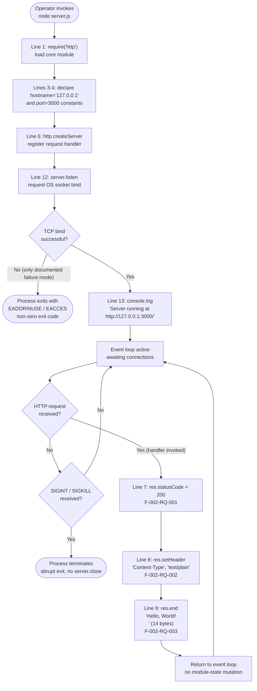

### 4.1.4 Documented Absent Workflows

The absence of the following workflows is a binding design property derived from F-006 (the "Do not touch!" directive) and constraints C-001 through C-007 in §2.6.2. Each absence is verified by direct inspection of the four baseline files.

| Absent Workflow | Evidence of Absence | Governing Constraint |
|-----------------|---------------------|----------------------|
| Error handling / recovery | No `try`/`catch`, no `'error'` listener on `http.Server`, no `process.on('SIGINT')` handler in `server.js` (per §1.3.2, §2.4.4) | C-001, C-004 |
| Authentication / authorization | No credential handling, no token verification, no `Authorization` header inspection (per §2.4.4) | C-001, C-004 |
| Batch / event processing | No job queue, no broker client, no scheduler, no batch script (per §2.3.2) | C-005 |
| State persistence / caching | No database driver, no `fs.write`, no in-memory store, no cache layer (per §1.2.2, §2.3.4) | C-005 |
| Graceful shutdown | No `server.close()` invocation, no signal handlers (per §1.3.2, §3.7.7) | C-001, C-004 |
| Observability beyond startup log | No request logging, no metrics emitter, no tracing SDK, no health endpoint (per §1.3.2) | C-001, C-005 |

---

## 4.2 CORE BUSINESS PROCESSES

This subsection decomposes each present workflow into per-step detail. Decision points, validation rules, and source-of-truth line numbers are surfaced for every step.

### 4.2.1 WF-001: Server Startup Workflow

#### Step Decomposition

The startup workflow executes exactly six steps, all triggered by the single operator invocation `node server.js`. Steps 1 through 4 are synchronous and execute in module-load order; step 5 is asynchronous, gated by OS socket allocation; step 6 fires only on bind success.

| Step | Line(s) | Operation | Synchrony | Mapped Requirement |
|------|---------|-----------|-----------|--------------------|
| 1 | 1 | `require('http')` — load core HTTP module | Synchronous | F-005 (zero deps means core only) |
| 2 | 3 | Declare `hostname = '127.0.0.1'` | Synchronous | F-001-RQ-002, C-002 |
| 3 | 4 | Declare `port = 3000` | Synchronous | F-001-RQ-003, C-003 |
| 4 | 6–10 | `http.createServer(handler)` returns `Server` instance | Synchronous; no network activity | F-001-RQ-001 |
| 5 | 12 | `server.listen(port, hostname, callback)` initiates bind | Asynchronous; OS-bounded | F-001-RQ-004 |
| 6 | 13 | `console.log('Server running at http://127.0.0.1:3000/')` fires | Executes only on successful bind | F-003-RQ-001, F-003-RQ-002 |

#### Decision Points

WF-001 contains **exactly one** genuine decision point: the TCP bind success/failure check performed by the OS networking stack in response to `server.listen()`. Per Assumption A-002 in §2.6.1, there is no fallback port logic; per F-001-RQ-003 acceptance criteria, `EADDRINUSE` is the only documented failure mode. Bind failure is **terminal** — no recovery edge exists in the source.

| Decision Point | Branch Conditions | Outcome on Success | Outcome on Failure |
|----------------|-------------------|--------------------|--------------------|
| TCP bind | Port `3000` free on loopback AND user holds privilege | Listen callback fires; WF-003 emits log line | Process exits non-zero (`EADDRINUSE` or `EACCES`); no recovery |

#### Server Startup Swim Lane Diagram

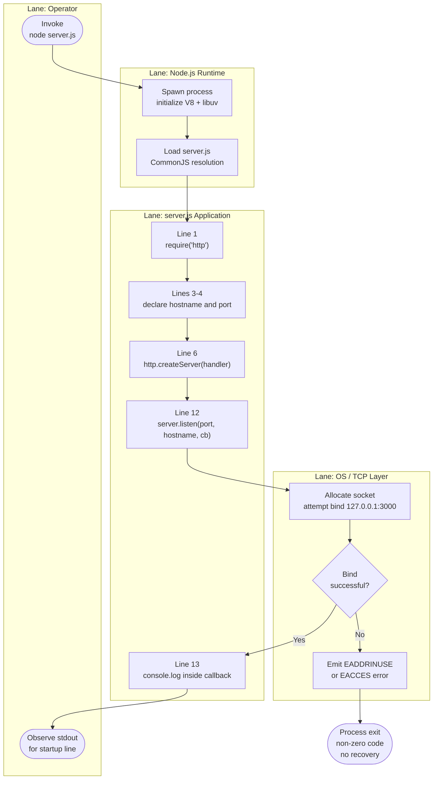

### 4.2.2 WF-002: Request–Response Workflow

#### Step Decomposition

The request-response workflow executes per inbound HTTP request. The first two steps are performed by the Node.js `http` core module (parser-level); the remaining three steps are executed by `server.js` lines 7–9. Per F-002-RQ-004, the handler must produce a byte-identical response for any HTTP method, path, headers, query, or body.

| Step | Line | Operation | Effect | Mapped Requirement |
|------|------|-----------|--------|--------------------|
| 1 | n/a | TCP connection accepted by `http` core | Connection object created | Implicit |
| 2 | n/a | Request parsed by `http` core into `req` object | Parser-level; opaque to `server.js` | Implicit |
| 3 | 6 | Handler invoked with `(req, res)` | `req` argument is **ignored** | F-002-RQ-004 |
| 4 | 7 | `res.statusCode = 200` | Sets HTTP status | F-002-RQ-001 |
| 5 | 8 | `res.setHeader('Content-Type', 'text/plain')` | Sets sole response header | F-002-RQ-002 |
| 6 | 9 | `res.end('Hello, World!\n')` | Writes 14-byte body and terminates response | F-002-RQ-003 |

#### Branchless Handler Property

WF-002 has **zero decision diamonds** in its response path. This is a load-bearing design property:

- The handler signature `(req, res) => {...}` reads only `res`; the `req` parameter is idiomatic but unused, as confirmed by the dead-code analysis described in §2.1.2.
- The acceptance criterion F-002-RQ-004 explicitly stipulates that requests using `GET`, `POST`, `PUT`, `DELETE`, and `OPTIONS` against arbitrary paths all yield byte-identical responses.
- Per the validation rules in §2.2.2, the handler must NOT branch on any property of `req` — eliminating request-shape information disclosure and rendering the response constant-time.

The conventional decision points that are **demonstrably absent** from the response path include:

| Absent Decision Point | Reason for Absence |
|-----------------------|--------------------|
| HTTP method check (GET/POST/etc.) | `req.method` is never read |
| Path / route matching | `req.url` is never read; no router |
| Header validation | `req.headers` is never read |
| Body parsing | No `req.on('data', ...)` listener registered |
| Authentication check | No credential code path (§2.4.4) |
| Authorization check | No RBAC/ACL evaluation (§2.4.4) |
| Rate limiting | No counter, no middleware |
| Request logging | No per-request log call |
| Conditional caching | No `ETag`, `Last-Modified`, or `Cache-Control` logic |
| Content negotiation | `Content-Type` is hardcoded literal `text/plain` |

#### Request–Response Swim Lane Diagram

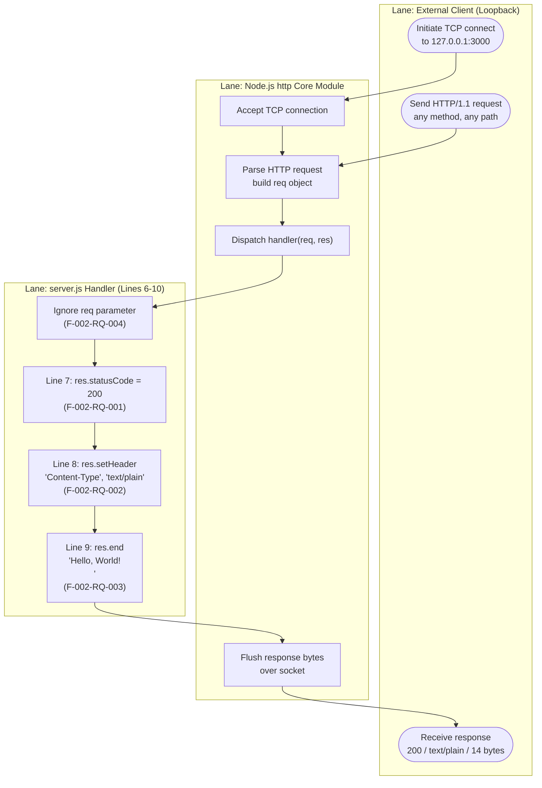

### 4.2.3 WF-003: Startup Logging Side-Workflow

WF-003 is a one-shot side workflow nested inside the WF-001 listen callback at line 13. It exists to satisfy F-003-RQ-001 (emit a startup log message after successful `listen`) and F-003-RQ-002 (format the message as `` `Server running at http://${hostname}:${port}/` ``). It interpolates the module-scope `hostname` and `port` constants shared with F-001 (see §2.3.3 shared components).

| Step | Line | Operation | Validation Rule |
|------|------|-----------|-----------------|
| 1 | 13 | `console.log(\`Server running at http://${hostname}:${port}/\`)` | Per §2.2.3, one-shot only; no per-request logging |
| 2 | n/a | stdout write to attached terminal | Per §2.2.3, log line contains no secrets, tokens, or PII |

WF-003 has no decision points and is unconditional given that step 6 of WF-001 executed (i.e., the bind succeeded). It executes exactly once per process lifetime.

---

## 4.3 INTEGRATION WORKFLOWS

### 4.3.1 Integration Topology

Per §2.3.2, the system has exactly one integration point — inbound HTTP/1.1 traffic on the loopback interface at TCP port 3000 — and no outbound integrations. The one-way component relationships used by the integration workflows are catalogued below.

| From | To | Mechanism | Direction |
|------|-----|-----------|-----------|
| Host OS | Node.js runtime | Process execution (`node` binary) | One-way (spawn) |
| Node.js runtime | `server.js` | CommonJS module loading | One-way (load) |
| `server.js` | `http` core module | `require('http')` | One-way (import) |
| `server.js` | TCP socket layer | `server.listen(3000, '127.0.0.1', ...)` | One-way (bind) |
| `server.js` | stdout | `console.log` | One-way (write) |
| External client (loopback) | `server.js` | HTTP/1.1 request to `127.0.0.1:3000` | Request/response |

### 4.3.2 Inbound HTTP Sequence Diagram

The end-to-end integration sequence below traces the system from operator invocation through bind success, startup logging, and the first request/response cycle. It demonstrates the protocol layering and lane responsibilities described in §1.2.2.

```mermaid
sequenceDiagram
    autonumber
    participant Op as Operator
    participant OS as Host OS
    participant Node as Node.js Runtime
    participant SrvJS as server.js
    participant Http as http Core Module
    participant Sock as TCP Socket Layer
    participant Cli as Loopback Client

    Op->>OS: node server.js
    OS->>Node: spawn process
    Node->>SrvJS: load module (CommonJS)
    SrvJS->>Http: require('http')
    SrvJS->>Http: http.createServer(handler)
    Http-->>SrvJS: Server instance
    SrvJS->>Http: server.listen(3000, '127.0.0.1', cb)
    Http->>Sock: bind(127.0.0.1:3000)
    Sock-->>Http: bind successful
    Http->>SrvJS: invoke listen callback (line 13)
    SrvJS->>Op: console.log('Server running at http://127.0.0.1:3000/')
    Note over SrvJS,Sock: Event loop now active; WF-001 complete
    Cli->>Sock: TCP SYN / handshake
    Cli->>Http: HTTP/1.1 request (any method/path)
    Http->>SrvJS: invoke handler(req, res)
    Note over SrvJS: req is ignored per F-002-RQ-004
    SrvJS->>SrvJS: res.statusCode = 200
    SrvJS->>SrvJS: res.setHeader('Content-Type', 'text/plain')
    SrvJS->>Http: res.end('Hello, World!\n')
    Http->>Sock: flush response bytes
    Sock-->>Cli: 200 OK / text/plain / 14 bytes
```

### 4.3.3 Absent Integration Patterns

Per the integration-points inventory in §2.3.2 and the out-of-scope enumeration in §1.3.2, the following integration patterns are **verified absent** from the implementation. Each absence is supported by the inspection of the four baseline files.

| Integration Pattern | Verification of Absence |
|---------------------|-------------------------|
| Data flow between systems | No outbound network calls in `server.js` |
| External API consumption | `http` module imported only for server construction; no client usage |
| Event processing flows | No event bus, no message broker, no streaming framework |
| Batch processing sequences | No cron, no job queue, no scheduler, no batch script |
| Service discovery registration | No discovery client in any file |
| Telemetry / observability export | No metrics emitter, no tracing SDK, no log shipper |
| Database read/write workflows | No database driver, no ORM, no connection pool |
| File I/O workflows | No `fs` module usage in `server.js` |

---

## 4.4 VALIDATION RULES AND BUSINESS LOGIC

This subsection enumerates the business rules, data validation requirements, authorization checkpoints, and regulatory compliance considerations that apply at each workflow step.

### 4.4.1 Business Rules per Workflow Step

The following table is the authoritative cross-reference between workflow steps and the validation rules defined in §2.2. The rules are stated at the granularity of the source-line operations they govern.

| Workflow | Step | Business / Data Validation Rule | Security Rule | Source |
|----------|------|----------------------------------|---------------|--------|
| WF-001 | Server construction (line 6) | Server constructed exactly once per process lifetime | No TLS material expected | F-001-RQ-001 |
| WF-001 | Hostname binding (line 3) | Hostname is hardcoded `127.0.0.1` (not parameterized) | Loopback binding is the sole network access control | F-001-RQ-002, C-002 |
| WF-001 | Port binding (line 4) | Port is hardcoded `3000` (not parameterized) | Port reachable only via loopback | F-001-RQ-003, C-003 |
| WF-001 | Listen completion (line 12) | Listen callback fires exactly once after a successful bind | None | F-001-RQ-004 |
| WF-003 | Startup log (line 13) | Logged exactly once per process lifetime | No sensitive data logged | F-003-RQ-001 |
| WF-003 | Log format | Literal scheme `http://` (not `https://`); template variables must resolve to bound values | Reflects accurate transport | F-003-RQ-002 |
| WF-002 | Status code (line 7) | Response must always be successful (no 4xx/5xx surfaces); status must equal `200` | No status-code-based information leakage | F-002-RQ-001 |
| WF-002 | Header emission (line 8) | Header value must be literal ASCII `text/plain`; only `Content-Type` is set | No security headers (CSP, HSTS, X-Frame-Options) required for loopback fixture | F-002-RQ-002 |
| WF-002 | Body emission (line 9) | Body must terminate with `\n`; exactly 14 bytes (hex `48 65 6C 6C 6F 2C 20 57 6F 72 6C 64 21 0A`) | No reflection of user input | F-002-RQ-003 |
| WF-002 | Determinism (line 6 handler) | Handler must NOT branch on any property of `req` | Eliminates request-shape information disclosure | F-002-RQ-004 |

### 4.4.2 Data Validation Requirements

Because the handler is branchless and consumes no request data, **every conventional data-validation point evaluates to "not applicable."** This is the inverse of the typical specification: validation absence is a deliberate property derived from F-002-RQ-004.

| Data Element | Validation Required? | Mechanism |
|--------------|----------------------|-----------|
| `req.method` | No | Argument ignored by handler |
| `req.url` | No | Argument ignored by handler |
| `req.headers` | No | Argument ignored by handler |
| Request body | No | No body parser registered; no `req.on('data', ...)` listener |
| Query string parameters | No | Not parsed |
| Cookies | No | Not parsed |
| Response status code | Compile-time | Literal `200` per F-002-RQ-001 |
| Response header value | Compile-time | Literal `'text/plain'` per F-002-RQ-002 |
| Response body | Compile-time | Literal `'Hello, World!\n'` (14 bytes) per F-002-RQ-003 |
| Hostname constant | Compile-time | Literal `'127.0.0.1'` per F-001-RQ-002 |
| Port constant | Compile-time | Literal `3000` per F-001-RQ-003 |

### 4.4.3 Authorization Checkpoints

Per the security posture documented in §2.4.4, the system has exactly one effective access-control checkpoint: the **OS-level loopback boundary**. All application-layer authentication and authorization primitives are absent. The diagram below illustrates the topology.

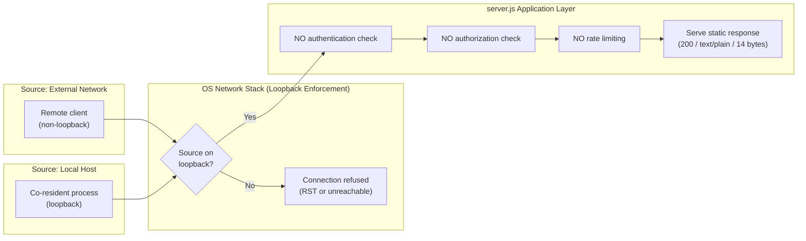

| Checkpoint | Layer | Enforcement |
|------------|-------|-------------|
| Loopback boundary | OS network stack | Rejects connections to bound interface from non-local sources (per F-001-RQ-002) |
| Application-layer authentication | Application | **None** (per §2.4.4) |
| Application-layer authorization | Application | **None** (per §2.4.4) |
| Rate limiting / throttling | Application | **None** — no middleware, no counters |
| Token / credential validation | Application | **None** — no credential code paths |
| Mutual TLS / client certificates | Transport | **None** — plaintext HTTP only |

### 4.4.4 Regulatory Compliance Considerations

No regulatory compliance regime is referenced in the repository. Per §2.4.4 and the data-domain row in §1.3.1, the system processes no personal data, stores nothing, and transmits only the static literal `Hello, World!\n`. Specifically:

| Compliance Regime | Repository Evidence | Applicability |
|-------------------|---------------------|---------------|
| GDPR | No personal-data text; no DPA references | Not applicable — no PII processed |
| HIPAA | No PHI-related text or notices | Not applicable — no health data |
| PCI-DSS | No payment-card markers | Not applicable — no payment data |
| SOC 2 | No evidence-collection artifacts | Not applicable — no controls implemented |
| MIT License (C-007) | Present in `package.json` and `package-lock.json` | Applies to all repository content |

---

## 4.5 STATE MANAGEMENT

### 4.5.1 Stateless Application Model

Per §1.2.2 ("State Model: Fully stateless; no persistence, no in-memory accumulation, no session tracking") and §2.3.4 (no common services), the application contains **zero application state**. The only mutable runtime state is the per-request transient state in the handler closure (which terminates with `res.end`) and the module-level constants (which are immutable after load).

| Concern | Status |
|---------|--------|
| Data persistence points | None — no database, no `fs.write`, no in-memory store |
| Caching layer | None — static body is a compile-time literal |
| Cache invalidation flow | Not applicable |
| Transaction boundaries | None — no DB transactions |
| Session storage | None — no cookies, no session store |
| Per-client state | None — handler ignores `req` |
| Cross-request shared state | None — only immutable constants at module level |

### 4.5.2 Process Lifecycle States

Although the application is stateless, the **hosting Node.js process** transitions through discrete lifecycle states. Each state corresponds to a point in the execution of `server.js`. This is the only state machine in the system and is summarized below.

| State | Description | Source Position |
|-------|-------------|-----------------|
| `PreStart` | Node.js process not yet spawned | n/a (operator side) |
| `Initializing` | Module load and constant declarations executing | `server.js` lines 1–10 |
| `Binding` | `server.listen()` invoked; OS socket allocation in progress | `server.js` line 12 |
| `Listening` | Bind successful; event loop active; awaiting connections | After listen callback fires (line 13) |
| `Handling` | Per-request transient state; handler body executing | `server.js` lines 7–9 |
| `Crashed` | Unhandled error during bind; process exits non-zero | Node.js default behavior |
| `Terminated` | Operator-initiated process kill (SIGINT/SIGKILL); abrupt exit | No graceful path |

### 4.5.3 Process Lifecycle State Diagram

The state diagram below shows the seven states and their transitions. The `Listening` ↔ `Handling` transition is reentrant per HTTP request; no module-level state mutates across this transition. The `Crashed` path from `Binding` is the consequence of the absent error-handling workflow documented in §4.6.

```mermaid
stateDiagram-v2
    [*] --> PreStart
    PreStart --> Initializing: node server.js invoked
    Initializing --> Binding: server.listen called (line 12)
    Binding --> Listening: bind succeeded;<br/>listen callback fires (line 13)
    Binding --> Crashed: bind failed;<br/>EADDRINUSE / EACCES;<br/>no error handler
    Listening --> Handling: HTTP request received;<br/>handler dispatched
    Handling --> Listening: res.end completes;<br/>return to event loop
    Listening --> Terminated: SIGINT / SIGKILL
    Handling --> Terminated: SIGINT / SIGKILL
    Crashed --> [*]: non-zero exit
    Terminated --> [*]: abrupt exit;<br/>no server.close
```

### 4.5.4 Persistence and Caching Absence

To make the absence of persistence/caching workflows explicit, the diagram below traces a request through every potential persistence and caching point and confirms each routes to a "skip" terminator before reaching the static-emit step. This is the negative-space counterpart to a conventional persistence workflow.

```mermaid
flowchart LR
    ReqIn(["HTTP request received"])
    Q1{"Read from<br/>persistence?"}
    Skip1["Skip — no DB driver,<br/>no fs.read"]
    Q2{"Read from cache?"}
    Skip2["Skip — no cache layer;<br/>body is compile-time literal"]
    Q3{"Begin transaction?"}
    Skip3["Skip — no transaction<br/>boundaries exist"]
    Emit["Emit static literal<br/>'Hello, World!\n'"]
    Q4{"Write to<br/>persistence?"}
    Skip4["Skip — no DB driver,<br/>no fs.write"]
    Q5{"Update cache?"}
    Skip5["Skip — no cache layer"]
    Q6{"Commit transaction?"}
    Skip6["Skip — no transaction"]
    Flush(["Response flushed<br/>to client"])

    ReqIn --> Q1
    Q1 -- "No" --> Skip1
    Skip1 --> Q2
    Q2 -- "No" --> Skip2
    Skip2 --> Q3
    Q3 -- "No" --> Skip3
    Skip3 --> Emit
    Emit --> Q4
    Q4 -- "No" --> Skip4
    Skip4 --> Q5
    Q5 -- "No" --> Skip5
    Skip5 --> Q6
    Q6 -- "No" --> Skip6
    Skip6 --> Flush
```

---

## 4.6 ERROR HANDLING

### 4.6.1 Documented Absence of Error Handling

The repository contains **no error-handling primitives**. This absence is binding under C-001 (immutability) and is the direct consequence of the design choices documented in §1.3.2 and §2.4.4. The following inventory enumerates the missing primitives:

| Error-Handling Primitive | Status |
|--------------------------|--------|
| `'error'` event listener on `http.Server` instance | Not registered |
| `try` / `catch` blocks | None in `server.js` |
| `process.on('SIGINT', ...)` handler | None |
| `process.on('SIGTERM', ...)` handler | None |
| `process.on('uncaughtException', ...)` handler | None |
| `process.on('unhandledRejection', ...)` handler | None |
| `server.close()` invocation (graceful shutdown) | None |
| Structured error response (4xx/5xx) | None — F-002-RQ-001 mandates `200` |

All errors propagate to Node.js default behavior: process termination with a non-zero exit code.

### 4.6.2 Error Categories and Terminal Behavior

Every error category recognized by the design converges to the same terminal outcome — abrupt process exit. The table below enumerates the categories and their triggers, mapped to the rationale for the absence of a handler in each case.

| Error Category | Trigger | No-Handler Rationale |
|----------------|---------|----------------------|
| `EADDRINUSE` | TCP port 3000 already bound by another process | No `'error'` listener registered on `http.Server` instance (per Assumption A-002, only documented failure mode) |
| `EACCES` | Attempt to bind privileged port without sufficient permission | No `try`/`catch` around `server.listen` |
| Synchronous handler exception | Code error inside handler body | No `try`/`catch` inside handler (no error path can exist — handler is branchless) |
| `SIGINT` / `SIGTERM` | Operator signal (Ctrl-C) | No `process.on('SIGINT')` registered (per §3.7.7, SIGINT only) |
| `EPIPE` on stdout | Terminal closed before `console.log` flush | Unhandled; Node.js default behavior |
| `uncaughtException` | Anywhere in process | No `process.on` handler registered |

### 4.6.3 Error Handling Flowchart

The flowchart below visualizes the convergence of all error categories to a single terminal exit, and the existence of an **external** recovery path that requires manual operator action (a fresh execution of WF-001). It also surfaces the absent recovery mechanisms as a side panel of negative-space inventory.


### 4.6.4 Missing Recovery Mechanisms

The "Missing Recovery Mechanisms" pane in §4.6.3 is enumerated in detail below. Each entry documents what is absent and the constraint that mandates its absence.

| Recovery Mechanism | Status | Governing Constraint |
|--------------------|--------|----------------------|
| Retry mechanism with backoff | Not implemented; no retry library imported | C-005 (zero deps) |
| Fallback port logic | Not implemented; binding to alternative port not attempted | A-002, C-003 |
| Fallback route / endpoint | Not implemented; handler is branchless | F-002-RQ-004 |
| Error notification flow | Not implemented; no notification client | C-005 (zero deps) |
| Process supervisor / restart policy | Not implemented; no PM2, no systemd unit, no Docker restart policy | C-001 (no additional baseline files) |
| Graceful shutdown | Not implemented; no `server.close()` invocation | C-001, C-004 |
| Health check endpoint | Not implemented; handler ignores `req.url` | F-002-RQ-004 |
| Circuit breaker | Not implemented; no downstream calls to break | §2.3.2 (no outbound integrations) |
| Dead-letter queue | Not implemented; no queue, no messaging | §2.3.2 |

**Recovery is exclusively external**: any recovery from a crash requires the operator to manually re-invoke `node server.js`, which is a fresh execution of WF-001. Per §3.7.7, this is the only documented operational recovery procedure.

---

## 4.7 TIMING AND SLA CONSIDERATIONS

### 4.7.1 Per-Step Timing Characteristics

Per §2.4.2, no quantitative performance targets are documented in any repository file. Timing is bounded only by the natural characteristics of Node.js `http` on the host. The implicit per-step timing posture is summarized below.

| Workflow | Step | Performance Characteristic | Mapped Requirement |
|----------|------|----------------------------|--------------------|
| WF-001 | `require('http')` | Synchronous; cached by Node.js module loader after first call | F-005 |
| WF-001 | `http.createServer()` | Synchronous; sub-millisecond | F-001-RQ-001 |
| WF-001 | `server.listen()` bind | Asynchronous; bounded by OS socket allocation | F-001-RQ-002, F-001-RQ-003 |
| WF-001 | Listen callback / `console.log` | Sub-millisecond after bind | F-003-RQ-001 |
| WF-002 | TCP accept | Driven by libuv; non-blocking | Implicit |
| WF-002 | HTTP parse | Driven by `http` core parser | Implicit |
| WF-002 | Status code assignment (line 7) | Sub-millisecond, in-memory | F-002-RQ-001 |
| WF-002 | Header emission (line 8) | Sub-millisecond, in-memory | F-002-RQ-002 |
| WF-002 | Body emission via `res.end` (line 9) | Sub-millisecond, in-memory; constant-time | F-002-RQ-003, F-002-RQ-004 |

### 4.7.2 SLA Posture

Per §1.2.3 ("No quantitative KPIs … are documented"), the system has a **qualitative pass/fail** KPI surface only. No throughput, latency, concurrency, or memory ceilings are defined. The SLA posture per dimension is summarized below.

| SLA Dimension | Documented Target |
|---------------|-------------------|
| Throughput | Not documented |
| Latency (p50/p95/p99) | Not documented |
| Availability / uptime | Not documented |
| Error-rate ceiling | Not documented (F-002-RQ-001 mandates 100% `200` responses) |
| Concurrent connection ceiling | Not documented; bounded by Node.js `http` defaults |
| Cold-start latency | Not documented; bounded by `server.listen` bind time |
| Memory ceiling | Not documented; bounded by Node.js single-process limits |

Any quantitative SLA expectations must be defined externally by the consuming backprop tooling. The implementation provides only the behavioral guarantees enumerated in the success criteria in §1.2.3: a `200` status, `text/plain` content type, and the 14-byte response body.

---

## 4.8 REFERENCES

### 4.8.1 Repository Files Examined

- `server.js` — Sole runtime file (14 lines); source of truth for WF-001, WF-002, WF-003 step decompositions, decision points, and line-level mappings to requirements
- `package.json` — Package manifest; confirmed absence of `start` script and the dangling `main: "index.js"` reference relevant to WF-001 launch procedure
- `package-lock.json` — Lockfile version 3 with empty `packages` tree; underpins F-005 zero-dependency posture used throughout this section
- `README.md` — Source of the "Do not touch!" immutability directive (F-006, C-001) that governs the absence of every WF-ABSENT workflow

### 4.8.2 Repository Folders Examined

- `/` (repository root) — Confirmed exactly four baseline runtime files; no `src/`, `lib/`, `test/`, or `config/` subdirectories that could host alternative workflows
- `docs/` — Auxiliary analysis artifacts (dead-code report, testing strategy); not part of the runtime surface
- `blitzy/documentation/` — Engagement governance materials; not part of the runtime surface

### 4.8.3 Technical Specification Sections Cross-Referenced

- §1.2 SYSTEM OVERVIEW — Integration boundary diagram, runtime sequence diagram, success criteria, fully-stateless declaration
- §1.3 SCOPE — Primary user workflows (Server Launch, Integration Validation); verified-absent inventory of out-of-scope features
- §2.1 FEATURE CATALOG — F-001 through F-006 feature definitions and dependencies anchoring WF-001/WF-002/WF-003
- §2.2 FUNCTIONAL REQUIREMENTS TABLE — 22 functional requirements (F-xxx-RQ-yyy) with acceptance criteria, technical specs, and validation rules surfaced per workflow step
- §2.3 FEATURE RELATIONSHIPS — Feature dependency map, single inbound integration point, shared module-scope constants
- §2.4 IMPLEMENTATION CONSIDERATIONS — Technical constraints, performance posture, security implications underlying §4.4 and §4.7
- §2.6 ASSUMPTIONS AND CONSTRAINTS — A-001 through A-005, C-001 through C-007 governing workflow immutability
- §3.7 DEVELOPMENT & DEPLOYMENT — Launch procedure (`node server.js`), shutdown procedure (SIGINT only), absence of supervisor/CI/CD/container infrastructure

# 5. System Architecture

## 5.1 HIGH-LEVEL ARCHITECTURE

### 5.1.1 System Overview

#### Architectural Style and Rationale

The `hao-backprop-test` repository implements a **single-process, single-file, monolithic micro-service** that exposes one stateless HTTP endpoint atop the Node.js core `http` module. The system is intentionally devoid of conventional architectural layering: there is no controller/service/repository separation, no middleware chain, no routing tier, and no internal modules. The entire runtime is contained within a single 14-line `server.js` file invoked directly by the Node.js binary.

This is not an oversight — it is the design. The repository exists exclusively as a deterministic test counterparty for an external "backprop integration" validation workflow, and its architectural value derives from **invariance and minimalism** rather than feature richness. The architecture is best understood through its deliberate omissions as much as through its inclusions.

The stack is governed by an explicit minimalism principle. The technology stack for the `hao-backprop-test` repository (npm package `hello_world` v1.0.0) is governed by an explicit minimalism principle: the system is a deliberately-constructed, byte-stable HTTP fixture whose value derives from behavioral determinism rather than feature richness. The entire runtime stack consists of JavaScript executed on Node.js using only the built-in `http` core module, with no third-party dependencies, no build pipeline, no containerization, and no external service integrations.

#### Key Architectural Principles and Patterns

The system embodies the following principles, each of which is operationalized by one or more enforceable constraints (C-001 through C-007):

- **Deliberate Minimalism**: ~40 lines of code across four baseline files; the architecture is valued for what it omits.
- **Source Immutability**: The "Do not touch!" directive in `README.md` is operational, not advisory. All four baseline files must remain byte-identical (C-001).
- **Zero-Dependency Posture**: No runtime or dev dependencies; runnable without `npm install` (F-005, C-005, C-006).
- **Hardcoded Configuration**: Host (`127.0.0.1`) and port (`3000`) are literal constants — no environment variables, no config files (C-002, C-003).
- **Branchless Determinism**: The request handler ignores the `req` object entirely and returns a byte-identical response to every request regardless of method, path, headers, or body (F-002-RQ-004, C-004).
- **Loopback-Only Network Exposure**: Binding to `127.0.0.1` is the sole effective access control.
- **Stateless by Design**: No persistence, no in-memory accumulation, no session tracking.

This minimalism is enforced by hard constraints. This minimalism is not incidental — it is enforced by seven hard constraints (C-001 through C-007 defined in §2.6.2). Constraint C-001 ("All four baseline files must remain unchanged from their committed state") combined with constraint C-005 ("Zero runtime and zero development dependencies") jointly preclude any expansion of the technology stack.

#### System Boundaries and Major Interfaces

The system's boundaries are sharply defined:

- **Inside the repository**: Four baseline files at the root (`server.js`, `package.json`, `package-lock.json`, `README.md`) plus two documentation folders (`docs/`, `blitzy/documentation/`) that are additive and analysis-only.
- **Sole runtime artifact**: `server.js`.
- **External interface**: A single inbound HTTP/1.1 channel on `127.0.0.1:3000`.
- **Outbound traffic**: None — there are zero outbound network calls of any kind.

### 5.1.2 Core Components

The system has exactly four production files and zero internal modules. The Node.js core `http` module is listed as a substrate component because it provides the entire HTTP engine.

| Component | Primary Responsibility | Key Dependencies | Critical Considerations |
|-----------|-----------------------|------------------|-------------------------|
| `server.js` (HTTP Runtime) | Implements server lifecycle, branchless request handler, TCP bind on 127.0.0.1:3000, and startup log emission | Node.js core `http` module only (`require('http')`) | Immutable per C-001; 14 lines; no `module.exports` — cannot be embedded as a library |
| `package.json` (Package Manifest) | Declares npm identity (`name: "hello_world"`, `version: "1.0.0"`, `author: "hxu"`, `license: "MIT"`) | npm package schema | Preserved inconsistency: `"main": "index.js"` references a non-existent file (per A-004); placeholder `scripts.test` |
| `package-lock.json` (Lockfile) | Deterministic dependency state; confirms zero-dependency posture | npm lockfile v3 schema | Empty `packages` tree below the root `""` entry; no transitive deps |
| `README.md` (Governance Document) | Asserts project identity and the operational immutability directive | None (static markdown) | "Do not touch!" is the operational contract (F-006); 3 lines total |
| Node.js core `http` module (substrate) | Provides server instantiation, TCP bind, HTTP parsing, and response API | V8, libuv, OS TCP/IP stack | Bundled with the Node.js runtime; not an npm dependency |

### 5.1.3 Data Flow Description

#### Primary Data Flows Between Components

The system has two unidirectional data flows and one reentrant per-request flow:

- **Inbound request flow**: External loopback client → OS TCP layer (port 3000) → Node.js `http` core parser → `server.js` handler `(req, res) => {...}` (which ignores the `req` argument entirely) → response writer.
- **Outbound response flow**: Handler sets `res.statusCode = 200`, `res.setHeader('Content-Type', 'text/plain')`, and `res.end('Hello, World!\n')` → `http` core flushes bytes → TCP socket → client.
- **Startup log flow**: A one-shot side flow inside the `server.listen` callback writes a single `console.log` line to stdout.

The integration topology is fully one-way except for the request/response cycle itself. Per §2.3.2, the system has exactly one integration point — inbound HTTP/1.1 traffic on the loopback interface at TCP port 3000 — and no outbound integrations.

#### Integration Patterns and Protocols

The system uses pure synchronous request/response over HTTP/1.1 plaintext. There is no asynchronous messaging, no event-driven pattern beyond the Node.js intrinsic event loop, no batch processing, and no scheduled task subsystem. The handler is fully branchless: it cannot route, cannot negotiate content, and cannot differentiate clients.

#### Data Transformation Points

There are **no runtime data transformations**. The response body is a compile-time UTF-8 string literal — `Hello, World!\n` — encoding 14 bytes (hex `48 65 6C 6C 6F 2C 20 57 6F 72 6C 64 21 0A`). No templating engine, no content negotiation, no encoding decisions at runtime. Per C-004, the response is byte-identical across requests.

#### Key Data Stores and Caches

There are **none**. The application contains no data persistence and no caching layer:

| Concern | Status |
|---------|--------|
| Database / ORM | None — no driver imported in `server.js` |
| File-system persistence | None — no `fs.write` calls |
| In-memory store | None — no module-level mutable state |
| Application cache | None — body is a compile-time literal; caching a 14-byte constant offers no benefit |
| HTTP response cache headers | None beyond `Content-Type` |
| External cache service (Redis/Memcached) | None |

Per §1.2.2 ("State Model: Fully stateless; no persistence, no in-memory accumulation, no session tracking") and §2.3.4 (no common services), the application contains zero application state. The only mutable runtime state is the per-request transient state in the handler closure (which terminates with `res.end`) and the module-level constants (which are immutable after load).

### 5.1.4 External Integration Points

The system has exactly **one** integration point. All other integration categories typically expected of an enterprise service are verified absent.

| System Name | Integration Type | Data Exchange Pattern | Protocol/Format |
|-------------|------------------|-----------------------|-----------------|
| External "backprop integration" validation workflow (co-resident process) | Inbound HTTP request acceptance | Synchronous client-initiated request/response; one round-trip per request | HTTP/1.1 plaintext on `127.0.0.1:3000` |

**SLA Requirements**: No quantitative SLAs are documented. The only acceptance criteria are qualitative pass/fail checks against four exact-match invariants:

- HTTP status code = `200` (exact)
- `Content-Type` header = `text/plain` (exact)
- Response body = `Hello, World!\n` (exact, 14 bytes)
- Startup log line = `Server running at http://127.0.0.1:3000/` (exact)

**Verified-absent integration categories**: External APIs, identity providers (Auth0/Okta/Cognito), APM platforms (Datadog/New Relic/Sentry), centralized logging (Splunk/ELK), cloud services (AWS/GCP/Azure), service discovery (Consul/etcd), message brokers (Kafka/RabbitMQ/SQS), external databases, CDN providers, email/SMS gateways, and feature-flag services. None of these are present in the dependency closure or the source.

---

## 5.2 COMPONENT DETAILS

### 5.2.1 `server.js` — Sole Runtime Component

#### Purpose and Responsibilities

`server.js` is the only file with executable behavior. It encapsulates three discrete features:

- **F-001** — HTTP server lifecycle and TCP binding (require, createServer, listen).
- **F-002** — Static HTTP response generation (status code, header, body via `res.end`).
- **F-003** — Startup console logging (single `console.log` inside the listen callback).

#### Technologies and Frameworks Used

- **Language**: JavaScript (ECMAScript) executed on the Node.js runtime.
- **Module system**: CommonJS (`require('http')`); no ES Module syntax is used.
- **Frameworks**: **None**. The implementation uses only the Node.js core `http` module. There is no Express, Koa, Fastify, Hapi, or any other web framework.

#### Key Interfaces and APIs Consumed

- `http.createServer(handler)` — creates the Server instance.
- `server.listen(port, hostname, callback)` — initiates TCP bind.
- `res.statusCode`, `res.setHeader(name, value)`, `res.end(body)` — response API exposed by the `http` module.
- `console.log` — built-in logging primitive for the startup log.

#### Data Persistence Requirements

**None**. The component is fully stateless. The only "data" handled is a 14-byte compile-time literal returned to every caller.

#### Scaling Considerations

- **Horizontal scaling**: Not supported. There is no clustering primitive (no `cluster` module use, no `worker_threads`), no process manager (no PM2, no systemd), and no load balancer in front of the process.
- **Vertical scaling**: Bounded by the limits of a single Node.js event-loop process on a single host.
- **Load distribution**: Not applicable — loopback-only binding precludes any external load-balancing arrangement.

### 5.2.2 `package.json` — Package Manifest

#### Purpose and Responsibilities

Declares the npm package identity so the project participates in the npm ecosystem (introspection, license auditing) without consuming or publishing any packages.

#### Notable Fields and Inconsistencies

- `name: "hello_world"` — distinct from the repository name `hao-backprop-test`.
- `version: "1.0.0"`.
- `description: "Hello world in Node.js"`.
- `main: "index.js"` — a **dangling reference** to a file that does not exist in the repository. Per assumption A-004 and constraint C-001, this is preserved as-is.
- `scripts.test: "echo \"Error: no test specified\" && exit 1"` — the npm placeholder test script; no real test target.
- `author: "hxu"`, `license: "MIT"`.
- **Absent fields**: `dependencies`, `devDependencies`, `engines`, `start` script.

### 5.2.3 `package-lock.json` — Dependency Lockfile

Confirms the zero-dependency posture and provides a reproducible install state. The file uses `lockfileVersion: 3` (the npm v7+ schema). The `packages` object contains only the root `""` entry — there are no transitive dependencies to record. Identity fields (name, version, license) mirror `package.json`.

### 5.2.4 `README.md` — Governance Document

A 3-line markdown file that establishes the project's identity and the operational immutability contract (F-006):

- Line 1: `# hao-backprop-test`
- Line 2: `test project for backprop integration. Do not touch!`

The "Do not touch!" sentence is the operational contract enforced by C-001.

### 5.2.5 Component Interaction Diagram

The diagram below depicts the full stack composition: an immutable application layer of four baseline files invokes Node.js's built-in `http` module, which in turn uses libuv and V8 to bind a loopback TCP socket. The external backprop consumer connects only via the OS loopback interface.


### 5.2.6 State Transition Diagram

Although the application data model is stateless, the hosting Node.js process traverses a small, well-defined state machine over its lifetime. Although the application is stateless, the hosting Node.js process transitions through discrete lifecycle states. Each state corresponds to a point in the execution of `server.js`.

| State | Description | Source Position |
|-------|-------------|-----------------|
| `PreStart` | Process not yet spawned | n/a (operator side) |
| `Initializing` | Module load and constant declarations executing | `server.js` lines 1–10 |
| `Binding` | `server.listen()` invoked; OS socket allocation in progress | `server.js` line 12 |
| `Listening` | Bind successful; event loop active; awaiting connections | After listen callback fires (line 13) |
| `Handling` | Per-request transient state; handler body executing | `server.js` lines 7–9 |
| `Crashed` | Unhandled error during bind; process exits non-zero | Node.js default behavior |
| `Terminated` | Operator-initiated process kill (SIGINT/SIGKILL); abrupt exit | No graceful path |

The `Listening` ↔ `Handling` transition is reentrant per HTTP request and does not mutate any module-level state. The `Crashed` path from `Binding` is the consequence of the absent error-handling primitives (see §5.4.3).


### 5.2.7 Sequence Diagram — End-to-End Inbound HTTP Flow

The sequence below traces the system from operator invocation through bind, startup logging, and the first request/response cycle. It demonstrates the lane responsibilities described in §5.1.3.

```mermaid
sequenceDiagram
    autonumber
    participant Op as Operator
    participant OS as Host OS
    participant Node as Node.js Runtime
    participant SrvJS as server.js
    participant Http as http Core Module
    participant Sock as TCP Socket Layer
    participant Cli as Loopback Client

    Op->>OS: node server.js
    OS->>Node: spawn process
    Node->>SrvJS: load module (CommonJS)
    SrvJS->>Http: require('http')
    SrvJS->>Http: http.createServer(handler)
    Http-->>SrvJS: Server instance
    SrvJS->>Http: server.listen(3000, '127.0.0.1', cb)
    Http->>Sock: bind(127.0.0.1:3000)
    Sock-->>Http: bind successful
    Http->>SrvJS: invoke listen callback (line 13)
    SrvJS->>Op: console.log('Server running at http://127.0.0.1:3000/')
    Note over SrvJS,Sock: Event loop now active; WF-001 complete
    Cli->>Sock: TCP SYN / handshake
    Cli->>Http: HTTP/1.1 request (any method/path)
    Http->>SrvJS: invoke handler(req, res)
    Note over SrvJS: req is ignored per F-002-RQ-004
    SrvJS->>SrvJS: res.statusCode = 200
    SrvJS->>SrvJS: res.setHeader('Content-Type', 'text/plain')
    SrvJS->>Http: res.end('Hello, World!\n')
    Http->>Sock: flush response bytes
    Sock-->>Cli: 200 OK / text/plain / 14 bytes
```

---

## 5.3 TECHNICAL DECISIONS

### 5.3.1 Architecture Style: Minimalist Stateless HTTP Fixture

The selected architectural style is "minimalist stateless HTTP fixture": a single process, a single file, a branchless handler, and a compile-time response literal. The decision is grounded in the system's purpose as a deterministic counterparty for an external validation workflow — the architecture's value lies in its refusal to change.

| Aspect | Decision | Tradeoff Accepted |
|--------|----------|-------------------|
| Layering | No controller/service/repository layers | No reuse across endpoints; only one endpoint exists |
| Framework | None — Node.js core `http` only | Manual handler wiring; no routing or middleware |
| Configuration | Hardcoded constants for host and port | No environment-based deployment flexibility |
| Concurrency model | Single event loop, no clustering | No horizontal scaling on a single host |
| Library exposure | No `module.exports` | Cannot be embedded into another Node.js program |

Benefits realized include predictability, minimal attack surface, operational simplicity (no `npm install` required per C-006), zero supply-chain risk, and constant-time response generation that eliminates injection surfaces. Costs accepted include unsuitability for production traffic, no resilience to operational failures, and no TLS/auth.

### 5.3.2 Communication Pattern Choice: Synchronous HTTP/1.1 Only

| Pattern Considered | Decision | Rationale |
|--------------------|----------|-----------|
| HTTP/1.1 plaintext | **Adopted** | Minimum viable protocol; supported by core `http` module without dependencies |
| HTTP/2 | Rejected | Would require additional configuration; not needed for a 14-byte response |
| gRPC | Rejected | Requires third-party libraries (violates C-005) |
| WebSockets | Rejected | Long-lived connections incompatible with the stateless fixture model |
| Message queue / broker | Rejected | Asynchronous patterns introduce dependencies (violates C-005); no batch needs |

The decision is also informed by assumption A-003 — the backprop consumer is assumed to be co-resident on the same host — which means non-loopback transport is unnecessary.

### 5.3.3 Data Storage Solution Rationale: None

No data storage solution is adopted. Each request is handled independently from a compile-time literal — there is no data to store. There is no database driver, no `fs.write`, no in-memory store, no session storage, and no transaction boundary. This decision is structural: the response is a 14-byte UTF-8 constant, and any storage layer would represent overhead with no behavioral benefit.

### 5.3.4 Caching Strategy Justification: None

No caching layer is implemented. The response is already a compile-time string literal residing in resident memory; constructing a cache abstraction over a constant would add complexity without performance benefit. No HTTP cache headers beyond `Content-Type` are emitted, and no external cache service (Redis, Memcached) is consulted. Cache invalidation is therefore also not applicable.

### 5.3.5 Security Mechanism Selection: Network-Layer Only

The system has exactly one effective access control checkpoint: the OS-level loopback boundary enforced by binding to `127.0.0.1`. All application-layer security primitives are deliberately absent.

| Security Aspect | Posture | Mitigating Factor |
|-----------------|---------|-------------------|
| Authentication | None | Loopback binding restricts reach to same-host processes |
| Authorization | None | Same — no remote actor can reach the listener |
| Transport encryption | None (plaintext HTTP) | Loopback traffic does not traverse external networks |
| Input validation | None (request ignored) | No input is consumed → no injection surface |
| Output encoding | Static literal | Body is a compile-time constant; no dynamic content |
| Security headers | Only `Content-Type` | No CSP/HSTS/X-Frame-Options needed for a loopback fixture |
| Dependency vulnerabilities | None applicable | Zero dependencies (F-005); `npm audit` reports no findings |
| Supply-chain risk | None | No third-party packages; no transitive closure |

Per assumption A-005, no security review of plaintext HTTP / loopback binding is required because the fixture is local-only by design.

### 5.3.6 Architectural Decision Records (ADRs) — Governing Constraints

The seven constraints C-001 through C-007 act as the explicit ADRs for this system. Every architectural decision can be traced to one or more of these constraints.

| ADR / Constraint | Rule | Stack & Architecture Implication |
|------------------|------|----------------------------------|
| C-001 | All four baseline files must remain byte-identical to their committed state | Precludes new dependencies, new frameworks, new files, or any baseline mutation |
| C-002 | Hostname hardcoded to `127.0.0.1` | No configuration management library; no environment variable parsing |
| C-003 | Port hardcoded to `3000` | Same — no fallback port logic permissible |
| C-004 | Response body, status, and headers must be byte-identical across all requests | No template engine, no compression, no content negotiation |
| C-005 | Zero runtime and zero development dependencies | No third-party packages of any kind |
| C-006 | Must remain executable on Node.js ≥ 20 without prior `npm install` | Reinforces C-005; lockfile must remain empty |
| C-007 | MIT license for all repository contents | License compatibility baseline preserved |

#### Decision Flow for Stack Additions

The decision tree below formalizes the question every contributor must ask before proposing any change to the architecture. Almost every branch terminates in rejection because of C-001/C-005.

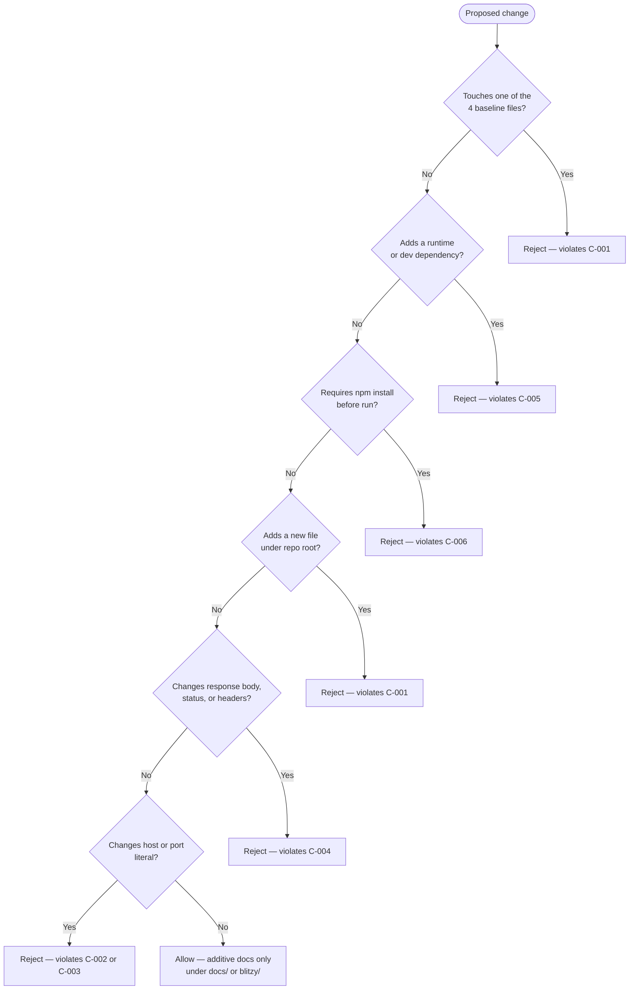

### 5.3.7 Default Technology Stack Reconciliation

Every item in the prompt-provided default enterprise stack — AWS, Docker, Terraform, GitHub Actions, Python/Flask, Auth0, MongoDB, Langchain, React/TypeScript, TailwindCSS, React-Native, Swift, Kotlin, Objective-C, ElectronJS — is categorically non-applicable here. The default enterprise technology stack provided as guidance (AWS, Docker, Terraform, GitHub Actions, Python/Flask, Auth0, MongoDB, Langchain, React/TypeScript, TailwindCSS, React-Native, Swift, Kotlin, Objective-C, ElectronJS) is categorically inapplicable to this system. Per §1.3.2, every category in that stack — web frameworks, persistence, authentication, container orchestration, CI/CD pipelines — is explicitly verified absent from the repository and is enumerated as out-of-scope. Adoption of any default-stack item would violate C-001, C-005, or C-006.

---

## 5.4 CROSS-CUTTING CONCERNS

### 5.4.1 Monitoring and Observability

The system's observability surface is intentionally minimal — a single one-shot startup log line written to stdout. All other observability primitives expected of a production service are verified absent.

| Observability Primitive | Status |
|-------------------------|--------|
| Structured logging framework (Winston/Pino/Bunyan/Morgan) | Not present (zero deps) |
| Per-request log emission | Not implemented; handler contains no `console.log` |
| Metrics emission (Prometheus, StatsD) | Not implemented |
| Distributed tracing (OpenTelemetry, Jaeger SDK) | Not implemented |
| Health-check endpoint | Not implemented; handler ignores `req.url` |
| APM integration (Datadog, New Relic, Sentry) | Absent |
| Log shipper / aggregator | Absent |

The single observability event is the startup log emitted by F-003: the literal string `Server running at http://127.0.0.1:3000/` written from the `server.listen` callback to stdout, exactly once per process lifetime.

### 5.4.2 Logging and Tracing Strategy

There is no log levelling, no log rotation, no remote shipping, and no tracing. The startup log line is the only "trace" available to consumers. Per the validation rules documented in §4.4.1, the log line contains no secrets, no tokens, and no PII — it is a static format string with hardcoded host/port values.

Future logging or tracing instrumentation would require introducing a logging library (forbidden by C-005), persisting log files (forbidden by C-001 because it would require new files or `fs` use in `server.js`), or registering tracing SDK hooks (forbidden by C-005). Therefore, the documented strategy is "no expansion of logging or tracing is permitted."

### 5.4.3 Error Handling Patterns

The repository contains no error-handling primitives. The repository contains no error-handling primitives. This absence is binding under C-001 (immutability) and is the direct consequence of the design choices documented in §1.3.2 and §2.4.4. All errors propagate to Node.js default behavior, which terminates the process with a non-zero exit code.

#### Missing Error-Handling Primitives

| Primitive | Status |
|-----------|--------|
| `'error'` event listener on `http.Server` | Not registered |
| `try`/`catch` blocks in `server.js` | None |
| `process.on('SIGINT' / 'SIGTERM' / 'uncaughtException' / 'unhandledRejection', ...)` | None |
| `server.close()` (graceful shutdown) | Not invoked |
| Structured 4xx/5xx response paths | None — F-002-RQ-001 mandates 200 for every request |

#### Error Categories and Terminal Behavior

Every error category recognized by the design converges to the same outcome: abrupt process exit. Every error category recognized by the design converges to the same terminal outcome — abrupt process exit.

| Error Category | Trigger | Documented Rationale for No Handler |
|----------------|---------|--------------------------------------|
| `EADDRINUSE` | TCP port 3000 already bound | Only documented failure mode per A-002 |
| `EACCES` | Insufficient privilege to bind | No `try`/`catch` around `server.listen` |
| Synchronous handler exception | Code error inside handler body | Cannot occur — handler is branchless |
| `SIGINT` / `SIGTERM` | Operator signal (e.g., Ctrl-C) | No `process.on('SIGINT')` registered |
| `EPIPE` on stdout | Terminal closed before `console.log` flush | Unhandled; Node.js default behavior |
| `uncaughtException` | Anywhere in the process | No `process.on` handler registered |

#### Recovery Model

Recovery is exclusively external. Following a crash, the operator must manually re-invoke `node server.js`, which is a fresh execution of workflow WF-001. There is no retry logic, no fallback port, no circuit breaker, no dead-letter queue, and no process supervisor (no PM2, no systemd unit, no Docker restart policy).

#### Error Handling Flow Diagram

The flow below visualizes the convergence of every error category to a single terminal exit, and the existence of an external recovery path that requires manual operator action.

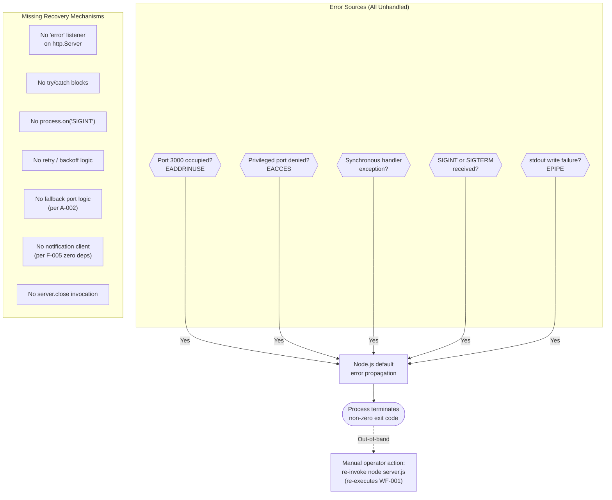

### 5.4.4 Authentication and Authorization Framework

There is no authentication or authorization at the application layer. The sole effective access-control mechanism is the OS network stack itself: by binding to `127.0.0.1`, the listener is reachable only by processes already running on the same host. Connections from any non-loopback source are refused by the OS before reaching Node.js.

| Authorization Checkpoint | Mechanism | Effect |
|--------------------------|-----------|--------|
| Network reachability | OS loopback check | Non-loopback connections refused (RST/unreachable) |
| Application-layer auth | None | Loopback callers reach the handler unfiltered |
| Application-layer authz | None | Same — no role/scope/claim check |
| Rate limiting / throttling | None | No per-client tracking exists |

This is acceptable under assumption A-005, which classifies the system as local-only by design and therefore exempt from a security review of plaintext HTTP.

### 5.4.5 Performance Requirements and SLAs

No quantitative SLAs are documented for this system. The acceptance criteria from §5.1.4 (status code, content type, body bytes, startup log) are the only contractual surface.

| KPI Dimension | Documented Target |
|---------------|-------------------|
| Throughput (requests/sec) | Not documented |
| Latency p50 / p95 / p99 | Not documented |
| Availability (uptime %) | Not documented |
| Error-rate ceiling | Not documented |
| Concurrent connections | Not documented |
| Cold-start latency | Not documented |
| Memory footprint | Not documented |

The implicit performance posture of each per-step operation is sub-millisecond except for the `server.listen` bind itself, which is bounded by OS socket allocation latency:

- `require('http')` — synchronous; cached after first load.
- `http.createServer()` — synchronous; allocates a Server instance in microseconds.
- `server.listen()` — asynchronous; bind latency dominated by OS socket-allocation.
- Per-request response operations (`res.statusCode`, `res.setHeader`, `res.end`) — sub-millisecond, in-memory, constant-time per F-002-RQ-004.

### 5.4.6 Disaster Recovery Procedures

Disaster recovery is fully external and consists of a single procedure: manual re-invocation of `node server.js` by the operator. The following mechanisms are explicitly not implemented:

- No process supervisor (no PM2, no systemd unit, no upstart, no Docker restart policy).
- No `server.close()` for graceful shutdown.
- No state to restore — the application is stateless, so there is no checkpoint, snapshot, or log to replay.
- No backup or replication — there is no data plane.
- No automated alerting or pager rotation hookup.

Because the system holds no state and serves a 14-byte constant, the recovery time objective (RTO) is bounded only by the time required to type `node server.js`, and the recovery point objective (RPO) is undefined because there is nothing to lose.

### 5.4.7 Runtime and Operational Posture Summary

For completeness, the operational posture of the system across runtime, build, container, and CI/CD dimensions is summarized below. Each row reinforces the cross-cutting story that the system's robustness model relies on simplicity and external recovery.

| Aspect | Value |
|--------|-------|
| Runtime | Node.js v20.20.2 verified (not pinned; no `engines` field) |
| Package Manager | npm 10.8.2 (bundled with Node 20; never invoked for install) |
| Build Pipeline | None — no transpilation, bundling, or minification |
| Containerization | None — no Dockerfile, docker-compose, K8s manifests, or Helm charts |
| Infrastructure as Code | None — no Terraform, CloudFormation, Pulumi, or CDK |
| CI/CD | None — no GitHub Actions, GitLab CI, CircleCI, or Jenkins |
| Launch Command | `node server.js` |
| Working Directory | Repository root |
| Required Pre-steps | None — no `npm install` required (C-006) |
| Environment Variables | None — host and port are literal constants |
| Startup Confirmation | stdout line: `Server running at http://127.0.0.1:3000/` |
| Shutdown Procedure | SIGINT (Ctrl-C); no graceful handler |
| Test Infrastructure | None committed; future recommendation is `node:test` + `node:assert` (also zero-dep) |

---

## 5.5 References

#### Repository Files Examined

- `server.js` — Sole runtime component; 14-line CommonJS module implementing the HTTP server lifecycle, the branchless request handler, and the startup log.
- `package.json` — npm manifest declaring package identity, MIT license, placeholder test script, and the dangling `main: "index.js"` reference preserved under C-001/A-004.
- `package-lock.json` — Lockfile v3 confirming an empty `packages` tree and the zero-dependency posture.
- `README.md` — Three-line governance document containing the operational "Do not touch!" immutability directive (F-006).
- `docs/dead-code-analysis.md` — Confirms zero removable dead code and documents the dangling `main` reference and the unused `req` parameter as idiomatic Node.js patterns.
- `docs/testing-strategy.md` — Risk-prioritized testing strategy proposing zero-dependency `node:test` validators.
- `blitzy/documentation/Project Guide.md` — High-level project overview.
- `blitzy/documentation/Technical Specifications.md` — Parent technical specifications document.

#### Repository Folders Explored

- `` (repository root, depth 0) — Contains the four baseline files plus the two documentation folders.
- `docs/` (depth 1) — Additive analysis-only markdown reports.
- `blitzy/` (depth 1) — Container directory whose sole child is `blitzy/documentation/`.
- `blitzy/documentation/` (depth 2) — Governance and specification markdown files.

#### Technical Specification Sections Referenced

- §1.1 Executive Summary — Project overview, stakeholders, value proposition.
- §1.2 System Overview — Integration boundary, technical approach, success criteria.
- §1.3 Scope — In-scope and out-of-scope elements.
- §2.1 Feature Catalog — Features F-001 through F-006.
- §2.2 Functional Requirements Table — Acceptance criteria, including F-002-RQ-001 and F-002-RQ-004.
- §2.3 Feature Relationships — Dependency map and integration points.
- §2.4 Implementation Considerations — Technical constraints, performance posture, scalability, and security.
- §2.6 Assumptions and Constraints — Assumptions A-001 through A-005 and constraints C-001 through C-007.
- §3.1 Stack Philosophy and Overview — Effective stack inventory and stack composition diagram.
- §3.2 Programming Languages — JavaScript/CommonJS only.
- §3.3 Frameworks & Libraries — Zero frameworks; Node.js core `http` only.
- §3.4 Open-Source Dependencies — Zero runtime and dev dependencies.
- §3.5 Third-Party Services — None.
- §3.6 Databases & Storage — None; fully stateless.
- §3.7 Development & Deployment — Runtime, build, container, and CI/CD posture (all absent except runtime).
- §3.8 Architectural Constraints Governing the Stack — Constraint-to-stack mapping.
- §3.9 Security Implications of Stack Choices — Security posture matrix.
- §3.10 Default Technology Stack Reconciliation — Default-stack non-applicability matrix.
- §4.1 System Workflows Overview — WF-001 through WF-003.
- §4.2 Core Business Processes — Workflow step decomposition.
- §4.3 Integration Workflows — Integration topology and inbound HTTP sequence diagram.
- §4.4 Validation Rules and Business Logic — Authorization checkpoints and log validation rules.
- §4.5 State Management — Stateless model and process lifecycle state diagram.
- §4.6 Error Handling — Documented absence and error category convergence flowchart.
- §4.7 Timing and SLA Considerations — Per-step timing and the absence of quantitative SLAs.

# 6. SYSTEM COMPONENTS DESIGN

## 6.1 Core Services Architecture

### 6.1.1 Applicability Statement

**Core Services Architecture is not applicable to this system.**

The `hao-backprop-test` repository implements a deliberately minimal, single-process, single-file HTTP fixture that contains no service decomposition, no inter-service communication, no scaling architecture, and no resilience patterns. Every dimension of the Core Services Architecture concern domain — service components, scalability design, and resilience patterns — is verified absent by direct repository inspection and is precluded by binding architectural constraints documented in §2.6.2.

The system is characterized in §5.1.1 as a "single-process, single-file, monolithic micro-service" whose "entire runtime is contained within a single 14-line `server.js` file invoked directly by the Node.js binary." It is "intentionally devoid of conventional architectural layering: there is no controller/service/repository separation, no middleware chain, no routing tier, and no internal modules." Because no services exist to interconnect, no scaling tier exists to operate on a service mesh, and no resilience primitives exist to coordinate across services, this section documents the verified absence of each requested sub-area and the constraints that make their introduction impossible without violating the immutability contract.

This section is structured as a "negative-space" reference: it enumerates each architectural concern from the standard Core Services Architecture prompt, records the documented absence with traceable evidence, and identifies the governing constraint that bars introduction of the concern. Readers seeking the runtime details that *are* present should consult §5.1 (architectural style), §5.2 (component details), and §5.4 (cross-cutting concerns).

### 6.1.2 System Composition Establishing Non-Applicability

#### 6.1.2.1 Runtime Footprint

The total system composition — across all baseline files and runtime artifacts — categorically forecloses the existence of a service architecture. The repository contains four immutable baseline files at the root and zero internal modules.

| Attribute | Value | Authoritative Source |
|-----------|-------|----------------------|
| Total baseline files | 4 (`server.js`, `package.json`, `package-lock.json`, `README.md`) | §5.1.1 |
| Sole runtime artifact | `server.js` (14 lines) | §5.2.1 |
| Third-party dependencies | Zero (no `dependencies`, no `devDependencies`) | §5.2.2, §5.2.3 |
| Internal modules | Zero (no `module.exports`, no local `require`) | §2.3.3 |
| Process topology | One Node.js event-loop process | §5.2.1 |
| Endpoints exposed | One implicit endpoint (branchless handler) | §5.1.3 |
| Integration points | One inbound; zero outbound | §2.3.2 |

#### 6.1.2.2 Architectural Constraints That Preclude Service Architecture

Seven hard constraints from §2.6.2 jointly preclude introducing any of the standard service-architecture patterns. Each constraint is binding under the operational "Do not touch!" directive in `README.md`.

| ID | Constraint | Impact on Service Architecture |
|----|------------|-------------------------------|
| C-001 | All four baseline files must remain unchanged | Cannot add new source files, modules, or service implementations |
| C-002 | Hostname hardcoded to `127.0.0.1` | Cannot deploy multi-host service topology |
| C-003 | Port hardcoded to `3000` | Cannot run multiple service instances on distinct ports |
| C-004 | Response body, status, headers byte-identical across requests | Cannot implement differentiated routing, degradation, or health endpoints |
| C-005 | Zero runtime and zero development dependencies | Cannot add service framework, mesh, load balancer, or circuit breaker libraries |
| C-006 | Must remain executable without prior `npm install` | Reinforces C-005; dependency installation is operationally forbidden |
| C-007 | MIT license for all repository contents | License-compatibility baseline preserved |

Per §3.1, "Constraint C-001 ('All four baseline files must remain unchanged from their committed state') combined with constraint C-005 ('Zero runtime and zero development dependencies') jointly preclude any expansion of the technology stack." This is the foundational rationale for the non-applicability of every sub-area documented in this section.

#### 6.1.2.3 Single-Component Negative-Space Topology

The diagram below visualizes the entire runtime topology of the system. It is shown here to demonstrate the categorical absence of a service plane: there is exactly one application-layer component (`server.js`), exactly one substrate (Node.js core `http`), and exactly one inbound integration point. No service-to-service edges exist anywhere in the graph.

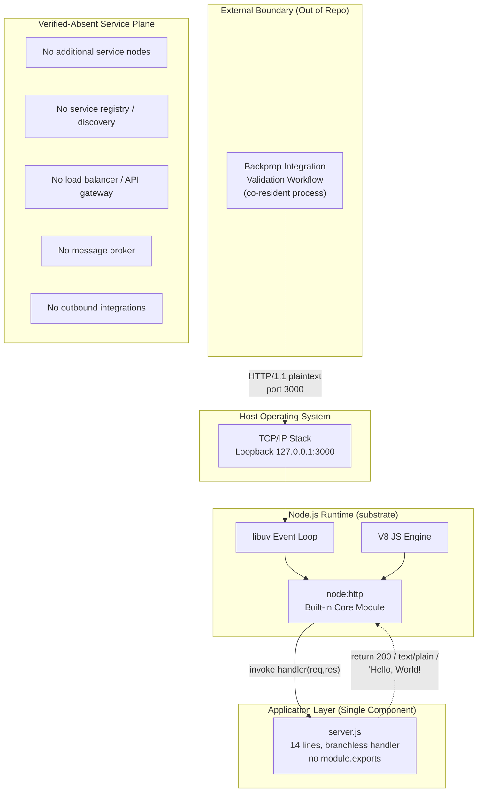

The "Verified-Absent Service Plane" subgraph is drawn deliberately disconnected from the live data path to emphasize that no member of that set is present in the runtime, the dependency closure, or the source. Every category enumerated there was verified absent during the analysis recorded in §5.1.4.

### 6.1.3 Service Components Analysis (Verified Absent)

This subsection addresses each component-level concern from the Core Services Architecture prompt and documents its absence with file-level evidence.

#### 6.1.3.1 Service Boundaries and Responsibilities

The system has no internal service boundaries because it has no internal services. The entire application is contained within a single 14-line file with no module decomposition. Per §2.3.3, "No internal helper modules, utility libraries, factories, service registries, or cross-cutting abstractions exist," and "the single source file `server.js` exposes no symbols (no `module.exports`), and the project cannot be `require`d as a library." Per §2.3.4, "the system has no common services in the conventional sense. There is no logging service, no configuration service, no telemetry service, no error-handling middleware, and no dependency-injection container."

| Service-Boundary Concern | Documented State | Governing Source |
|--------------------------|------------------|------------------|
| Domain decomposition | None — single file, single concern | §5.1.1 |
| Bounded contexts | None — no context delineation possible in 14 LOC | §5.1.1 |
| Service-to-service contracts | None — no second service exists | §2.3.4 |
| API gateway / BFF tier | None — direct HTTP listener only | §5.1.4 |
| Internal module exports | None — `server.js` has no `module.exports` | §2.3.3 |

#### 6.1.3.2 Inter-Service Communication Patterns

The system supports no inter-service communication because no second service exists in the runtime topology. Per §5.1.3, "the system uses pure synchronous request/response over HTTP/1.1 plaintext. There is no asynchronous messaging, no event-driven pattern beyond the Node.js intrinsic event loop, no batch processing, and no scheduled task subsystem." Per §5.1.3, outbound traffic is "None — there are zero outbound network calls of any kind." Per §2.3.2, the system has "exactly one integration point and no outbound integrations. There are no DNS lookups, outbound HTTP calls, database connections, message brokers, telemetry exports, or service-discovery registrations."

| Communication Concern | Documented State | Governing Source |
|-----------------------|------------------|------------------|
| Synchronous service-to-service (REST/gRPC) | Not present — no downstream targets | §5.1.3 |
| Asynchronous messaging (queue/topic) | Not present — no broker client imported | §5.1.3 |
| Event-driven choreography | Not present — only intrinsic Node.js event loop | §5.1.3 |
| Batch / scheduled task channels | Not present — no scheduler, no cron | §5.1.3 |
| Outbound HTTP calls | Zero — no `http.request`, `fetch`, or socket open | §2.3.2 |

#### 6.1.3.3 Service Discovery Mechanisms

No service discovery client, registry, or DNS-SRV consumer is present. Per §5.1.4, "Verified-absent integration categories" explicitly include "service discovery (Consul/etcd)." Per the F-001 feature specification (§2.1.1), "a stable, well-known address (`http://127.0.0.1:3000/`) eliminates the need for service discovery, registration, or runtime configuration on the consumer side." The hardcoded hostname and port pairing (constraints C-002 and C-003) is the design substitute for any dynamic discovery mechanism.

| Discovery Concern | Documented State |
|-------------------|------------------|
| Service registry (Consul, etcd, Eureka) | Not present — no registry client in any file |
| DNS-based discovery (SRV records) | Not used — host is the loopback literal `127.0.0.1` |
| Client-side resolver | Not present — no resolver library imported |
| Configuration discovery (env vars, config maps) | Not present — no `process.env` access |
| Static addressing | Sole mechanism — host/port hardcoded in `server.js` lines 3–4 |

#### 6.1.3.4 Load Balancing Strategy

No load balancing exists at any layer of the system. Per §5.2.1, "load distribution: not applicable — loopback-only binding precludes any external load-balancing arrangement." Per §2.4.3, "load distribution: not applicable (loopback-only binding precludes external load distribution)." The loopback binding mandated by C-002 ensures the listener is reachable only by processes on the same host, which structurally precludes any meaningful load-balancing arrangement.

| Load Balancing Concern | Documented State |
|------------------------|------------------|
| External load balancer (L4/L7, ALB/NLB/HAProxy/Nginx) | Not deployed — loopback binding prevents external reachability |
| Internal load balancing / client-side LB | Not present — no second instance to balance toward |
| Algorithm selection (round-robin / least-conn / weighted) | Not applicable — single replica |
| Sticky sessions / session affinity | Not applicable — fully stateless |

#### 6.1.3.5 Circuit Breaker Patterns

No circuit breaker is implemented. Per §4.6.4, "circuit breaker: not implemented; no downstream calls to break" with the governing constraint being §2.3.2 (no outbound integrations). The system has no downstream dependencies whose failure could be detected, isolated, or shed by a breaker. Circuit-breaker semantics require an upstream-to-downstream call topology that does not exist in this repository.

| Circuit Breaker Concern | Documented State |
|-------------------------|------------------|
| Library (opossum, brakes, polly-js) | Not present — C-005 forbids dependency addition |
| Custom breaker logic | Not present — no `if`/`catch` around outbound calls |
| Failure-threshold configuration | Not applicable — no calls to count failures of |
| Half-open trial-call logic | Not applicable — same |

#### 6.1.3.6 Retry and Fallback Mechanisms

No retry or fallback logic is implemented. Per §4.6.4, the following entries are explicitly recorded:

| Mechanism | Status | Governing Constraint |
|-----------|--------|----------------------|
| Retry mechanism with backoff | Not implemented; no retry library imported | C-005 (zero deps) |
| Fallback port logic | Not implemented; binding to alternative port not attempted | A-002, C-003 |
| Fallback route / endpoint | Not implemented; handler is branchless | F-002-RQ-004 |
| Error notification flow | Not implemented; no notification client | C-005 (zero deps) |

Per §5.4.3, "there is no retry logic, no fallback port, no circuit breaker, no dead-letter queue, and no process supervisor (no PM2, no systemd unit, no Docker restart policy)." Recovery is exclusively external — see §6.1.5.2 below.

### 6.1.4 Scalability Design (Verified Absent)

#### 6.1.4.1 Horizontal and Vertical Scaling Approach

The repository documents an explicit scalability posture in §2.4.3 that records every standard scaling dimension as either "not supported" or "not applicable." This is reproduced and elaborated here.

| Scalability Dimension | Posture | Rationale |
|-----------------------|---------|-----------|
| Horizontal Scaling | Not supported | No clustering primitive; no process manager |
| Vertical Scaling | Bounded by single-process Node.js limits | Single event-loop process per §5.2.1 |
| Concurrency Model | Single Node.js event-loop process | No `cluster` or `worker_threads` use per §5.2.1 |
| State Migration | Not applicable | Fully stateless application per §5.1.3 |
| Load Distribution | Not applicable | Loopback-only binding per §2.4.3 |

Per §5.2.1, "there is no clustering primitive (no `cluster` module use, no `worker_threads`), no process manager (no PM2, no systemd), and no load balancer in front of the process." This forecloses the horizontal-scaling concern at the runtime level; the loopback binding additionally forecloses it at the network level.

#### 6.1.4.2 Auto-Scaling Triggers and Rules

No auto-scaling exists. No metric is emitted that could serve as a scaling signal, no orchestrator is present to consume such a signal, and no scaling actuator is configured. Per §5.4.7, the operational posture explicitly records: "Containerization: None — no Dockerfile, docker-compose, K8s manifests, or Helm charts" and "Infrastructure as Code: None — no Terraform, CloudFormation, Pulumi, or CDK."

| Auto-Scaling Concern | Documented State |
|----------------------|------------------|
| Container orchestrator (Kubernetes, ECS, Nomad) | Not deployed — no manifests, no Dockerfile |
| Horizontal Pod Autoscaler / target tracking policies | Not applicable — no orchestrator |
| Trigger metrics (CPU, memory, request rate, queue depth) | Not emitted — no metrics endpoint, no APM |
| Scaling cooldowns / scale-out and scale-in policies | Not configured |
| Predictive / scheduled scaling | Not configured |

#### 6.1.4.3 Resource Allocation Strategy

No resource allocation strategy is documented or implemented. The process is launched with whatever CPU and memory the host operating system grants by default; no `--max-old-space-size` flag, no cgroups limits, no container resource requests/limits, and no priority class are configured. Per §5.4.5, the documented KPI table records "Concurrent connections: not documented" and "Memory footprint: not documented."

| Resource Allocation Concern | Documented State |
|-----------------------------|------------------|
| CPU pinning / affinity | Not configured |
| Memory limits / Node.js heap caps | Not configured (no `--max-old-space-size`) |
| Container resource requests / limits | Not applicable — no container |
| Worker pool sizing (`UV_THREADPOOL_SIZE`) | Default Node.js value; not overridden |
| QoS classes / priority | Not configured |

#### 6.1.4.4 Performance Optimization Techniques

No runtime performance-optimization techniques are applied because the workload — returning a 14-byte compile-time string literal — is already the minimum work required to satisfy the acceptance criteria. Per §5.4.3 conceptual context and §1.2.3 implicit posture, no caching layer is implemented because "the response is already a compile-time string literal residing in resident memory," and any caching abstraction would add cost rather than reduce it. Per §5.1.3, "there are no runtime data transformations" — no templating, no content negotiation, no encoding decision at request time.

| Optimization Concern | Documented State |
|----------------------|------------------|
| In-process cache (LRU, Map, WeakMap) | Not present — body is a compile-time literal |
| External cache (Redis, Memcached) | Not present — no client library |
| Response compression (gzip, brotli) | Not enabled — no compression middleware |
| HTTP/2 or HTTP/3 | Not enabled — `http.createServer` defaults to HTTP/1.1 |
| Keep-alive tuning | Default Node.js settings; not customized |

#### 6.1.4.5 Capacity Planning Guidelines

No quantitative capacity-planning guidance is documented. Per §5.4.5, "no quantitative SLAs are documented for this system." The full KPI table is reproduced below for completeness; every row is marked "not documented." This is consistent with the system's role as a deterministic byte-stable fixture rather than a production workload.

| KPI Dimension | Documented Target |
|---------------|-------------------|
| Throughput (requests/sec) | Not documented |
| Latency p50 / p95 / p99 | Not documented |
| Availability (uptime %) | Not documented |
| Error-rate ceiling | Not documented |
| Concurrent connections | Not documented |
| Cold-start latency | Not documented |
| Memory footprint | Not documented |

#### 6.1.4.6 Scalability Architecture Diagram

The diagram below visualizes the single-process scaling boundary. It depicts what *would* be required to support horizontal scaling (a process supervisor or cluster manager, an external load balancer, a non-loopback bind, a service registry) and shows each requirement crossed against the constraint that forbids it. This is the canonical "negative-space" scalability architecture for this system.

```mermaid
flowchart LR
    subgraph CurrentScale["Current Scalability Boundary (Implemented)"]
        Process["Single Node.js Process<br/>(server.js)"]
        Bind["Bind: 127.0.0.1:3000<br/>(C-002, C-003)"]
        Loop["Single Event Loop<br/>(no cluster, no workers)"]
        Process --> Bind
        Process --> Loop
    end
    subgraph NotImplemented["Required for Horizontal Scaling (All Verified Absent)"]
        Cluster["Process Cluster<br/>(node:cluster)<br/>X Not used"]
        PM["Process Manager<br/>(PM2 / systemd)<br/>X Forbidden by C-005"]
        LB["External Load Balancer<br/>(Nginx / HAProxy)<br/>X No non-loopback bind (C-002)"]
        Reg["Service Registry<br/>(Consul / etcd)<br/>X Forbidden by C-005"]
        K8s["Container Orchestrator<br/>(Kubernetes)<br/>X No Dockerfile / manifests"]
    end
    subgraph NoAutoScale["Auto-Scaling Inputs (Verified Absent)"]
        Metrics["No metrics emission<br/>(no Prometheus, no APM)"]
        Triggers["No scaling triggers<br/>(no HPA, no target tracking)"]
        Policies["No scaling policies<br/>(no cooldowns, no schedules)"]
    end

    Loop -.->|"would require"| Cluster
    Cluster -.->|"would require"| PM
    PM -.->|"would require"| LB
    LB -.->|"would require"| Reg
    Reg -.->|"would require"| K8s
    K8s -.->|"would require"| Metrics
    Metrics -.->|"would feed"| Triggers
    Triggers -.->|"would invoke"| Policies
```

### 6.1.5 Resilience Patterns (Verified Absent)

#### 6.1.5.1 Fault Tolerance Mechanisms

The repository contains no error-handling primitives, and therefore no fault-tolerance mechanisms. Per §4.6.1 and §5.4.3, the following inventory is binding:

| Error-Handling Primitive | Status |
|--------------------------|--------|
| `'error'` event listener on `http.Server` | Not registered |
| `try`/`catch` blocks in `server.js` | None |
| `process.on('SIGINT' / 'SIGTERM' / 'uncaughtException' / 'unhandledRejection', ...)` | None |
| `server.close()` (graceful shutdown) | Not invoked |
| Structured 4xx/5xx response paths | None — F-002-RQ-001 mandates 200 for every request |

Per §5.4.3, "all errors propagate to Node.js default behavior, which terminates the process with a non-zero exit code." Every recognized error category — `EADDRINUSE`, `EACCES`, synchronous handler exception, `SIGINT`/`SIGTERM`, `EPIPE` on stdout, and `uncaughtException` — converges to the same terminal outcome: abrupt process exit. There is no branching, no compensation, no isolation, and no recovery within the process.

#### 6.1.5.2 Disaster Recovery Procedures

Per §5.4.6, "disaster recovery is fully external and consists of a single procedure: manual re-invocation of `node server.js` by the operator." The following mechanisms are explicitly not implemented:

| DR Mechanism | Documented State |
|--------------|------------------|
| Process supervisor (PM2 / systemd / upstart) | None — would violate C-001 by adding artifacts |
| Container restart policy (Docker / K8s) | None — no container exists |
| `server.close()` for graceful shutdown | Not invoked — no signal handler registered |
| State restore (checkpoint / snapshot / log replay) | None — application is stateless |
| Backup / replication | None — there is no data plane |
| Automated alerting / pager rotation | None — no notification client |

Because the system holds no state and serves a 14-byte constant, the recovery time objective (RTO) is "bounded only by the time required to type `node server.js`," and the recovery point objective (RPO) is "undefined because there is nothing to lose" (§5.4.6).

#### 6.1.5.3 Data Redundancy Approach

No data redundancy applies because the application contains no data. Per §5.1.3, "the application contains zero application state. The only mutable runtime state is the per-request transient state in the handler closure (which terminates with `res.end`) and the module-level constants (which are immutable after load)."

| Data Plane Concern | Documented State |
|--------------------|------------------|
| Database persistence | None — no driver imported in `server.js` |
| File-system persistence | None — no `fs.write` calls |
| In-memory store | None — no module-level mutable state |
| Session storage | None — no cookies, no session store |
| Per-client state | None — handler ignores `req` per F-002-RQ-004 |
| Replication (primary/replica, multi-region) | Not applicable — no data plane to replicate |

The response body is a compile-time UTF-8 string literal embedded in the source file. There is nothing to back up, nothing to replicate, and nothing to reconcile across instances.

#### 6.1.5.4 Failover Configurations

No failover exists at any layer. The system runs as a single process bound to a single hardcoded host and port; there is no secondary instance, no standby, no warm pool, and no active-active arrangement. Per §4.6.4, "fallback port logic: not implemented; binding to alternative port not attempted" with governing constraints A-002 and C-003.

| Failover Concern | Documented State |
|------------------|------------------|
| Active-passive standby | Not configured — no second instance exists |
| Active-active replicas | Not configured — single process by C-001 |
| Hot / warm / cold spare | Not configured |
| DNS failover | Not applicable — host is the literal `127.0.0.1` |
| Multi-zone / multi-region deployment | Not applicable — single-host loopback fixture |

#### 6.1.5.5 Service Degradation Policies

No service degradation policies are implemented. The handler is described in §5.3.1 as "branchless" — it returns an identical response to every request and cannot enter a degraded mode. Per §4.6.4, "fallback route / endpoint: not implemented; handler is branchless" with the governing constraint F-002-RQ-004. The byte-identical response requirement of C-004 directly forbids the existence of differentiated response paths that would be necessary to express degradation (e.g., a 503 during overload, a feature-flagged minimal response, or a read-only mode).

| Degradation Pattern | Documented State |
|---------------------|------------------|
| Feature flag / kill switch | Not present — no flag library, no config source |
| Read-only / safe-mode toggle | Not present — no mode to toggle |
| Bulkhead / pool isolation | Not present — single shared event loop |
| Load-shedding (early 503) | Not present — handler always returns 200 |
| Graceful capacity rejection | Not present — no admission control |

#### 6.1.5.6 Resilience Pattern Implementation Diagram

The diagram below visualizes the convergence of every recognized error category to a single terminal exit, demonstrating the absence of resilience branching. It is reproduced and adapted from §4.6.3 and §5.4.3. The "Missing Recovery Mechanisms" subgraph enumerates each resilience primitive that would normally branch the flow but is verified absent.

```mermaid
flowchart TD
    subgraph Sources["Error Sources (All Unhandled)"]
        E1{{"Port 3000 occupied?<br/>EADDRINUSE"}}
        E2{{"Privileged port denied?<br/>EACCES"}}
        E3{{"Synchronous handler<br/>exception?"}}
        E4{{"SIGINT or SIGTERM<br/>received?"}}
        E5{{"stdout write failure?<br/>EPIPE"}}
        E6{{"uncaughtException<br/>anywhere?"}}
    end
    subgraph Missing["Missing Resilience Primitives (Verified Absent)"]
        NoListener["No 'error' listener<br/>on http.Server"]
        NoTryCatch["No try/catch blocks"]
        NoSignal["No process.on('SIGINT')"]
        NoRetry["No retry / backoff logic"]
        NoFallback["No fallback port<br/>(per A-002, C-003)"]
        NoBreaker["No circuit breaker<br/>(no downstream calls)"]
        NoGraceful["No server.close invocation"]
        NoSupervisor["No PM2 / systemd / restart policy"]
    end
    Default["Node.js default<br/>error propagation"]
    ExitNonZero(["Process terminates<br/>non-zero exit code"])
    ExternalRecovery["Manual operator action:<br/>re-invoke node server.js<br/>(re-executes WF-001)"]

    E1 -- "Yes" --> Default
    E2 -- "Yes" --> Default
    E3 -- "Yes" --> Default
    E4 -- "Yes" --> Default
    E5 -- "Yes" --> Default
    E6 -- "Yes" --> Default
    Default --> ExitNonZero
    ExitNonZero -.->|"Out-of-band recovery"| ExternalRecovery
```

The diagram demonstrates two structural properties of the system's resilience model:

- **No internal branching**: Every error source flows along a single edge into the Node.js default propagation path. There are no decision nodes that could route an error to a recovery strategy.
- **External recovery only**: The dashed edge from process termination to manual operator re-invocation is the entire recovery model. Per §5.4.6, this satisfies the recovery time objective bounded by manual operator action and the recovery point objective bounded by the absence of state.

### 6.1.6 Cross-Section Reference Map

For readers who need additional context on each verified-absent concern, the table below maps each Core Services Architecture sub-area to the section(s) in this Technical Specification that document the underlying architectural decisions and constraint sources.

| Sub-Area | Primary Reference | Supporting References |
|----------|-------------------|------------------------|
| Service boundaries / responsibilities | §5.1.1 | §2.3.3, §2.3.4 |
| Inter-service communication | §5.1.3 | §2.3.2, §5.1.4 |
| Service discovery | §5.1.4 | §2.1.1 (F-001), §2.6.2 (C-002, C-003) |
| Load balancing | §2.4.3 | §5.2.1 |
| Circuit breaker / retry / fallback | §4.6.4 | §5.4.3 |
| Horizontal / vertical scaling | §2.4.3 | §5.2.1 |
| Auto-scaling / resource allocation | §5.4.5 | §5.4.7 |
| Performance optimization | §5.1.3 | §5.4.5 |
| Fault tolerance | §4.6.1 | §5.4.3 |
| Disaster recovery | §5.4.6 | §4.6.4 |
| Data redundancy | §5.1.3 | §4.5 (state management) |
| Failover / degradation | §4.6.4 | §5.3.1, §5.4.3 |

### 6.1.7 Conditions Under Which This Section Would Become Applicable

For traceability, this subsection records the architectural events that would trigger reauthoring of section 6.1 as a populated (rather than non-applicable) Core Services Architecture specification. Each event corresponds to a deliberate relaxation of a binding constraint from §2.6.2.

| Triggering Event | Constraint to Relax | New Architectural Domain Introduced |
|------------------|---------------------|-------------------------------------|
| Add a second source file / module | C-001 | Internal service boundaries |
| Introduce an npm dependency | C-005, C-006 | Frameworks, mesh clients, observability SDKs |
| Bind to a non-loopback host | C-002 | External load balancing, ingress, network policies |
| Allow multiple ports / instances | C-003 | Replica topology, horizontal scaling |
| Permit differentiated response paths | C-004 | Routing, health endpoints, degradation modes |

Until at least one of these triggering events occurs and is reflected in a corresponding change to `README.md`, `server.js`, `package.json`, and `package-lock.json`, the determination of non-applicability for section 6.1 stands.

### 6.1.8 References

#### Files Examined

- `server.js` — Confirmed the 14-line single-file implementation, branchless handler, absence of `module.exports`, and absence of error-handling primitives that collectively preclude service decomposition.
- `package.json` — Confirmed the zero-dependency declaration, absence of `engines` pin, and absence of any process-manager or framework references that would enable service architecture.
- `package-lock.json` — Confirmed `lockfileVersion: 3` with an empty packages tree below the root entry, verifying the absence of transitive dependencies that could introduce service-architecture libraries.
- `README.md` — Confirmed the operational immutability directive ("Do not touch!") that is the source of constraint C-001.

#### Folders Explored

- Repository root (depth 0) — Confirmed exactly four baseline files plus the additive `docs/` and `blitzy/` documentation folders; no source subdirectories exist.
- `docs/` (depth 1) — Confirmed contents limited to analysis documents (`dead-code-analysis.md`, `testing-strategy.md`); no service code.
- `blitzy/documentation/` (depth 2) — Confirmed contents limited to governance and specification artifacts; no service code.

#### Technical Specification Sections Cross-Referenced

- §1.1 Executive Summary — ~40-line minimal scope and immutability contract context.
- §1.2 System Overview — Single-direction integration model.
- §1.3 Scope — Explicit out-of-scope enumeration of service-oriented features.
- §2.1 Feature Catalog (F-001) — Stable well-known address eliminates discovery need.
- §2.3 Feature Relationships — No internal services, no shared components, no common services.
- §2.4 Implementation Considerations — Scalability dimensions table showing all "not supported" or "not applicable."
- §2.6 Assumptions and Constraints — Seven hard constraints (C-001 through C-007) that bar service architecture introduction.
- §3.1 Stack Philosophy and Overview — Minimalism principle, joint preclusion by C-001 and C-005.
- §4.5 State Management — Zero application state, no persistence points.
- §4.6 Error Handling — Documented absence of error-handling primitives; missing recovery mechanisms inventory.
- §4.7 Timing and SLA Considerations — No quantitative SLAs documented.
- §5.1 High-Level Architecture — "Single-process, single-file, monolithic micro-service" characterization.
- §5.2 Component Details — `server.js` as sole runtime component; explicit scaling considerations.
- §5.3 Technical Decisions — ADRs C-001 through C-007 and decision flow for stack additions.
- §5.4 Cross-Cutting Concerns — Monitoring, error handling, disaster recovery absence inventories.

## 6.2 Database Design

### 6.2.1 Applicability Statement

**Database Design is not applicable to this system.**

The `hao-backprop-test` repository implements a deliberately stateless HTTP fixture that contains no database, no persistent storage of any kind, no caching layer, and no data plane whatsoever. Every dimension of the standard Database Design concern domain — schema design, data management, compliance considerations, and performance optimization — is verified absent by direct repository inspection and is precluded by binding architectural constraints documented in §2.6.2.

The authoritative position is stated in §3.6.1: "**No databases, caches, or persistent storage are used.**" This is reinforced by the system characterization in §1.2.2 as "Fully stateless; no persistence, no in-memory accumulation, no session tracking" and by §5.4.6, which records that "there is no data plane" to back up, replicate, or recover. Because no database exists to design — and because the immutability contract (C-001) combined with the zero-dependency posture (C-005) categorically forbids introducing one — this section documents the verified absence of each requested sub-area and identifies the governing constraints that bar introduction.

This section adopts the same "negative-space" structure used in §6.1: it enumerates each architectural concern from the standard Database Design prompt, records the documented absence with traceable evidence, and identifies the governing constraint that precludes the concern. Readers seeking the runtime details that *are* present should consult §3.6 (databases & storage posture), §4.5 (state management), and §5.1.3 (data flow description).

### 6.2.2 System Composition Establishing Non-Applicability

#### 6.2.2.1 Runtime Footprint Relevant to Persistence

The total system composition forecloses the existence of any database design. There are no driver imports, no connection strings, no ORM declarations, no schema files, no migration directories, and no lockfile entries for database libraries.

| Persistence Surface | Documented State | Authoritative Source |
|---------------------|------------------|----------------------|
| Database driver imports in `server.js` | None — only `require('http')` exists | §5.1.3 |
| Filesystem write operations | None — no `fs.write` calls anywhere | §4.5.1 |
| Module-level mutable state | None — only immutable constants at module level | §4.5.1 |
| Declared dependencies in `package.json` | Zero (no `dependencies`, no `devDependencies`) | §6.1.2.1 |
| Lockfile entries for DB libraries | None — `lockfileVersion: 3` with empty `packages` tree | §6.1.2.1 |
| Schema files / migration directories | None — no `migrations/`, `db/`, or `models/` folders | §6.1.8 |
| Sole runtime artifact | `server.js` (14 lines) | §5.2.1 |

#### 6.2.2.2 Architectural Constraints That Preclude Database Design

The seven binding constraints from §2.6.2 jointly preclude introducing any database. Each constraint is binding under the operational "Do not touch!" directive in `README.md`. Constraints C-001 and C-005 are the operative absence justifications for every Database Design sub-area documented in this section.

| ID | Constraint | Impact on Database Design |
|----|------------|---------------------------|
| C-001 | All four baseline files must remain unchanged | Cannot add database connection code, schema files, or new source files |
| C-002 | Hostname hardcoded to `127.0.0.1` | Loopback-only — precludes connecting to a remote DB host |
| C-003 | Port hardcoded to `3000` | No additional database port may be opened or contacted |
| C-004 | Response body, status, headers byte-identical across requests | Cannot vary response with DB-derived content |
| C-005 | Zero runtime and zero development dependencies | Cannot add DB drivers, ORMs, query builders, or cache clients |
| C-006 | Must remain executable without `npm install` | Reinforces C-005 — no out-of-band installation path |
| C-007 | MIT license of all repository contents | License compatibility baseline preserved |

Per §3.1, "Constraint C-001 ('All four baseline files must remain unchanged from their committed state') combined with constraint C-005 ('Zero runtime and zero development dependencies') jointly preclude any expansion of the technology stack." This is the foundational rationale for the non-applicability of every sub-area documented below.

#### 6.2.2.3 Static Response Data Footprint

The only "data" in the system is a **14-byte static UTF-8 string** (`Hello, World!\n`) hardcoded in `server.js` line 9. Per §3.6.2, "this literal is a compile-time constant, not a persistent datum; it requires no storage strategy, no schema, no migration plan, and no backup procedure." Per constraint C-004, this response body must remain byte-identical to its committed state, which structurally forbids the introduction of any datastore-derived response variation.

| Datum | Encoding | Bytes | Storage Class |
|-------|----------|-------|---------------|
| `Hello, World!\n` | UTF-8 | 14 | Compile-time string literal embedded in `server.js` line 9 |
| `127.0.0.1` | UTF-8 | 9 | Compile-time string literal embedded in `server.js` line 3 |
| `3000` | Number | n/a | Compile-time integer literal embedded in `server.js` line 4 |
| `Server running at http://127.0.0.1:3000/` | UTF-8 | 40 | Compile-time template literal in `server.js` line 13 |

None of these literals constitute persistent data. They are emitted directly from V8's resident heap on each invocation; no read-from-store or write-to-store operation occurs at any point in the request lifecycle.

### 6.2.3 Schema Design (Verified Absent)

This subsection addresses every schema-design concern from the standard Database Design prompt and records its absence with file-level evidence.

#### 6.2.3.1 Entity Relationships

No entities exist in the system. There are no domain objects, no aggregate roots, no value objects with persistent identity, and no relationships among such objects. The handler signature `(req, res) => {...}` accepts two transient HTTP message objects that terminate at `res.end()` and are garbage-collected immediately thereafter. Per §4.5.1, "the application contains zero application state."

| Entity-Relationship Concern | Documented State |
|-----------------------------|------------------|
| Domain entities | None — no persistent objects in any source file |
| One-to-many / many-to-many associations | Not applicable — no entities to associate |
| Aggregate boundaries | Not applicable — no entities, no aggregates |
| Foreign-key relationships | None — no schema in which to declare them |
| Referential-integrity constraints | None — no referents exist |

#### 6.2.3.2 Data Models and Structures

No data models exist. No DDL, ORM model classes, schema-definition libraries (Mongoose, Sequelize, TypeORM, Prisma), or JSON-schema validators are imported or declared in any source file. Per §6.1.2.1, "Internal modules: Zero (no `module.exports`, no local `require`)," which precludes the existence of a model layer even as internal abstractions.

| Modeling Concern | Documented State |
|------------------|------------------|
| Relational schema (DDL) | None — no SQL anywhere in the repository |
| Document schema (Mongoose / JSON Schema) | None — no schema library imported |
| ORM model classes | None — no ORM imported (C-005 forbids) |
| Type definitions for persisted records | None — no `interface`/`type` declarations exist |
| Serialization formats for storage | Not applicable — nothing to serialize |

#### 6.2.3.3 Indexing Strategy

No indexing strategy exists because no tables, collections, or indexable data structures exist. There are no primary keys, secondary indexes, composite indexes, partial indexes, full-text indexes, or expression indexes anywhere in the system.

| Index Concern | Documented State |
|---------------|------------------|
| Primary key indexes | None — no tables exist |
| Secondary / composite indexes | None — no query workload to optimize |
| Full-text / geospatial indexes | None — no such data |
| Index maintenance procedures | Not applicable |
| Index storage overhead budgeting | Not applicable |

#### 6.2.3.4 Partitioning Approach

No partitioning strategy exists. There are no shards, no partition keys, no range/hash/list partitioning schemes, and no tenant-isolation boundaries. The system runs as a single process bound to a single hardcoded host and port (C-002, C-003), and any partition topology would presuppose a multi-instance, multi-host arrangement that is structurally precluded.

| Partitioning Concern | Documented State |
|----------------------|------------------|
| Horizontal sharding (range / hash / list) | Not applicable — no data, no shards |
| Vertical partitioning (column-family / wide-table split) | Not applicable — no columns |
| Tenant isolation (schema-per-tenant, DB-per-tenant) | Not applicable — single fixture, no tenants |
| Partition key selection | Not applicable — no data to partition |
| Resharding / rebalancing procedures | Not applicable |

#### 6.2.3.5 Replication Configuration

No replication configuration exists. Per §6.1.5.3, "Replication (primary/replica, multi-region): Not applicable — no data plane to replicate." Per §5.4.6, "No backup or replication — there is no data plane."

| Replication Concern | Documented State |
|---------------------|------------------|
| Primary/replica topology | Not configured — no database to replicate |
| Synchronous vs. asynchronous replication | Not applicable |
| Multi-region / multi-master | Not applicable — single-host loopback fixture |
| Replication lag monitoring | Not applicable — no replication stream exists |
| Failover from primary to replica | Not applicable — no primary, no replica |

#### 6.2.3.6 Backup Architecture

No backup architecture exists. Per §5.4.6, the disaster-recovery posture explicitly records: "No state to restore — the application is stateless, so there is no checkpoint, snapshot, or log to replay. No backup or replication — there is no data plane." The recovery point objective (RPO) is "undefined because there is nothing to lose."

| Backup Concern | Documented State |
|----------------|------------------|
| Full / incremental / differential backups | None — no data to back up |
| Point-in-time recovery (PITR) | Not applicable — no transaction log |
| Backup retention schedule | Not applicable — no backup artifacts produced |
| Off-site / cross-region backup storage | Not applicable — no object storage integration |
| Backup restore drill / test cadence | Not applicable — no procedure to drill |

#### 6.2.3.7 Verified-Absent Entity-Relationship Diagram

The diagram below is the canonical "verified-absent" ERD for this system. It is shown as an empty schema enclosure with explicit annotations indicating that no entities, no relationships, and no constraints are defined. The diagram is intentionally drawn in this form to satisfy the documentation requirement for an ERD while accurately reflecting the system's empty schema.

```mermaid
erDiagram
    NO_ENTITY {
        none none "No tables, collections, or documents exist"
        none constraint_status "Verified absent per section 3.6.1"
        none governing_constraint "C-001 immutability and C-005 zero dependencies"
    }
```

The single placeholder entity `NO_ENTITY` carries no fields, no primary key, and no relationships. It exists solely to render the schema as an explicit, traceable absence rather than an undocumented gap. Per §3.6.1, every storage category — SQL, NoSQL, caching, object storage, file-based persistence, session storage, in-memory accumulation, and state migration surface — is recorded as "None" or "Not applicable."

### 6.2.4 Data Management (Verified Absent)

#### 6.2.4.1 Migration Procedures

No migration procedures exist because no schema exists to migrate. There are no `migrations/`, `db/migrate/`, or equivalent directories in the repository, no migration tool is declared as a dependency, and no schema-versioning convention is established.

| Migration Concern | Documented State |
|-------------------|------------------|
| Schema migration framework (Flyway, Liquibase, Knex migrations, Alembic) | None — C-005 forbids dependency addition |
| Up / down migration scripts | None — no `migrations/` directory exists |
| Migration history tracking table | Not applicable — no database |
| Forward / rollback procedures | Not applicable |
| Zero-downtime migration patterns | Not applicable |

Per §2.4.3, "State Migration: Not applicable (fully stateless)." The absence of a stateful surface to migrate is the categorical justification for the absence of migration tooling.

#### 6.2.4.2 Versioning Strategy

No data-versioning strategy exists. Per §2.6.3, "All requirements documented in this section correspond to `package.json` version `1.0.0` (mirrored in `package-lock.json`). No prior version exists in the repository; there is no `CHANGELOG`, no migration notes, and no version-control commentary inside the baseline files." Because no persisted records exist, there are no record-level version columns, no temporal tables, no soft-delete versioning, and no CDC streams.

| Versioning Concern | Documented State |
|--------------------|------------------|
| Record-level version columns | None — no records exist |
| Temporal tables / system-versioning | Not applicable — no SQL platform present |
| Soft-delete / tombstone columns | Not applicable |
| Change Data Capture (CDC) streams | Not applicable — no source DB to capture from |
| Schema-evolution policy (backwards / forwards compatibility) | Not applicable — no schema |

#### 6.2.4.3 Archival Policies

No archival policies exist because no data is generated, accumulated, or retained. The system processes each request independently, ignores `req` entirely (per F-002-RQ-004), and emits a compile-time literal response. Per §4.5.1, "Per-client state: None — handler ignores `req`."

| Archival Concern | Documented State |
|------------------|------------------|
| Hot / warm / cold storage tiers | Not applicable — no data to tier |
| Archival cutoff age | Not applicable — no records age |
| Cold-storage destination (Glacier, Coldline, Archive) | Not applicable — no cloud SDK present |
| Retrieval SLA from archive | Not applicable |
| Archival audit trail | Not applicable |

#### 6.2.4.4 Data Storage and Retrieval Mechanisms

No storage or retrieval mechanism exists at the application layer. Per §5.1.3, "Database / ORM: None — no driver imported in `server.js`. File-system persistence: None — no `fs.write` calls. In-memory store: None — no module-level mutable state." Per §4.5.1, "Data persistence points: None — no database, no `fs.write`, no in-memory store."

| Storage/Retrieval Concern | Documented State |
|---------------------------|------------------|
| SQL query interface | None — no driver, no client |
| NoSQL document API | None — no client library |
| Key-value lookup | None — no in-process Map, no external KV |
| File / blob retrieval | None — no `fs.read*`, no object storage SDK |
| Materialized view / projection | Not applicable — no source data |

The data retrieval pattern for the response body is direct in-line literal evaluation: the V8 engine evaluates the string literal `'Hello, World!\n'` from the source file's parsed AST and passes it to `res.end()` without any intervening store, cache, or transformation step.

#### 6.2.4.5 Caching Policies

No caching policies exist at any layer. Per §3.6.4, "Not applicable. No caching layer exists at any tier: No application-level cache (no in-memory maps, no LRU caches), No HTTP cache headers beyond `Content-Type` (no `Cache-Control`, no `ETag`), No external cache service (no Redis client, no Memcached client)." Per §3.6.4, "The static response is generated freshly per request from a compile-time string literal, which is computationally cheaper than any caching mechanism would be for a 14-byte payload."

| Caching Concern | Documented State |
|-----------------|------------------|
| In-process cache (LRU, TTL Map, WeakMap) | None — no map instantiated in `server.js` |
| External cache (Redis, Memcached, KeyDB) | None — no client library; C-005 forbids |
| HTTP response cache headers (`Cache-Control`, `ETag`, `Last-Modified`) | None set — only `Content-Type` is emitted |
| CDN / edge cache | None — no CDN integration; loopback-only |
| Cache invalidation strategy | Not applicable — no cache layer to invalidate |

## 6.2 5 Compliance Considerations (Verified Absent)

#### 6.2.5.1 Data Retention Rules

No data retention rules apply because no data is collected, processed, or stored. The handler receives `req` but ignores it; no fields from incoming requests are persisted, logged, or correlated. The only emitted byte stream is a compile-time literal and a one-shot startup log line that contains no request-derived content.

| Retention Concern | Documented State |
|-------------------|------------------|
| Request-payload retention window | Not applicable — `req` is ignored per F-002-RQ-004 |
| Personally Identifiable Information (PII) retention | None — no PII collected; loopback-only binding |
| Audit-log retention (regulatory minimum) | Not applicable — no audit log generated |
| Right-to-be-forgotten / GDPR Article 17 procedure | Not applicable — no subject data exists |
| Data minimization compliance | Trivially satisfied — zero data collected |

#### 6.2.5.2 Backup and Fault Tolerance Policies

No backup or fault-tolerance policies apply because no data plane exists. Per §6.1.5.3, "No data redundancy applies because the application contains no data." Per §5.4.6, "Because the system holds no state and serves a 14-byte constant, the recovery time objective (RTO) is bounded only by the time required to type `node server.js`, and the recovery point objective (RPO) is undefined because there is nothing to lose."

| Policy Concern | Documented State |
|----------------|------------------|
| Backup frequency (RPO target) | Undefined — no data to lose |
| Restore time objective (RTO) | Bounded by manual `node server.js` re-invocation (per §5.4.6) |
| Cross-region replication for DR | Not applicable — no data plane |
| Backup encryption at rest | Not applicable — no backup artifacts |
| Backup integrity verification (checksum / restore drill) | Not applicable |

#### 6.2.5.3 Privacy Controls

No privacy controls are required at the application layer because no personal data is collected, processed, or persisted. The handler ignores `req.headers`, `req.url`, `req.method`, and the request body in their entirety. Per §5.4.4, "There is no authentication or authorization at the application layer. The sole effective access-control mechanism is the OS network stack itself: by binding to `127.0.0.1`, the listener is reachable only by processes already running on the same host."

| Privacy Concern | Documented State |
|-----------------|------------------|
| PII identification and classification | Not applicable — no PII collected |
| Encryption at rest | Not applicable — nothing at rest |
| Encryption in transit | Plaintext HTTP/1.1 over loopback; acceptable under assumption A-005 |
| Data subject access request (DSAR) workflow | Not applicable — no subject data |
| Cross-border data transfer controls | Not applicable — loopback-only, no transfer occurs |

#### 6.2.5.4 Audit Mechanisms

No audit mechanisms exist for data access because no data access occurs. Per §5.4.1, "Per-request log emission: Not implemented; handler contains no `console.log`." The only observability event in the entire system is the one-shot startup line; no per-request audit record is generated, persisted, or shipped.

| Audit Concern | Documented State |
|---------------|------------------|
| Per-request audit log | None — handler emits no logs |
| Database query audit log (SQL Server Audit, pgaudit) | Not applicable — no database |
| Privileged-action audit | Not applicable — no privileged operations |
| Tamper-evident audit storage (WORM, append-only ledger) | Not applicable — no audit data |
| Audit log shipping to SIEM | Not applicable — no log shipper present |

#### 6.2.5.5 Access Controls

No application-layer access controls exist for data because no data exists to control access to. Per §5.4.4 (reproduced verbatim from the access control table): "Application-layer auth: None — Loopback callers reach the handler unfiltered. Application-layer authz: None — same — no role/scope/claim check. Rate limiting / throttling: None — No per-client tracking exists." The OS loopback bind is the sole effective access boundary, and it operates at the network layer, not the data layer.

| Access Control Concern | Documented State |
|------------------------|------------------|
| Row-level / column-level security | Not applicable — no rows, no columns |
| Role-Based Access Control (RBAC) on tables | Not applicable — no tables |
| Attribute-Based Access Control (ABAC) policies | Not applicable — no attributes |
| Database user / service account separation | Not applicable — no database |
| Connection authentication (passwords, IAM, mTLS) | Not applicable — no connection to authenticate |

### 6.2.6 Performance Optimization (Verified Absent)

#### 6.2.6.1 Query Optimization Patterns

No query optimization patterns are applied because no queries are issued. There is no SQL planner, no NoSQL aggregation pipeline, no query-plan analysis, and no query-tuning artifact in the repository. Per §5.1.3, "There are **no runtime data transformations**. The response body is a compile-time UTF-8 string literal."

| Query Optimization Concern | Documented State |
|----------------------------|------------------|
| Index selection / `EXPLAIN` analysis | Not applicable — no queries issued |
| Query rewriting / hint injection | Not applicable |
| Materialized views | Not applicable — no source data to project |
| Stored procedures / prepared statements | Not applicable — no database |
| N+1 query mitigation | Not applicable |

#### 6.2.6.2 Caching Strategy

No caching strategy is implemented because there is nothing meaningful to cache. Per §3.6.4, "The static response is generated freshly per request from a compile-time string literal, which is computationally cheaper than any caching mechanism would be for a 14-byte payload." Per §6.1.4.4, "no caching layer is implemented because 'the response is already a compile-time string literal residing in resident memory,' and any caching abstraction would add cost rather than reduce it."

| Caching Strategy Concern | Documented State |
|--------------------------|------------------|
| Cache-aside / read-through / write-through pattern | Not applicable — no cache and no source-of-truth datastore |
| Write-behind (write-back) batching | Not applicable — no writes occur |
| Time-To-Live (TTL) policy | Not applicable — no entries to expire |
| Cache stampede protection (lock, request coalescing) | Not applicable — no cache |
| Cache key namespacing / versioning | Not applicable — no keys exist |

#### 6.2.6.3 Connection Pooling

No connection pooling exists because there are no outbound connections to pool. Per §5.1.1, "Outbound traffic: None — there are zero outbound network calls of any kind." Per §2.3.2, the system has "no DNS lookups, outbound HTTP calls, database connections, message brokers, telemetry exports, or service-discovery registrations."

| Connection Pool Concern | Documented State |
|-------------------------|------------------|
| Database connection pool (pg-pool, mysql2 pool, generic-pool) | None — no driver imported; C-005 forbids |
| Pool size (min / max connections) | Not applicable |
| Idle connection eviction / keep-alive | Not applicable |
| Connection acquisition timeout | Not applicable |
| Connection-pool exhaustion handling | Not applicable |

The inbound HTTP server uses the default Node.js `http` server's intrinsic connection management; this is provided by the substrate and is unrelated to database connection pooling.

#### 6.2.6.4 Read/Write Splitting

No read/write splitting exists because the system performs neither reads from nor writes to a database. Per §5.1.3, the data flow is exclusively HTTP request → in-memory literal → HTTP response, with no datastore traversal at any step.

| Read/Write Splitting Concern | Documented State |
|------------------------------|------------------|
| Primary-for-write, replica-for-read routing | Not applicable — no primary, no replica |
| Read replica lag awareness | Not applicable |
| Per-query routing hints (`/* primary */`) | Not applicable — no SQL emitted |
| Eventually consistent read tolerance | Not applicable — no reads to tolerate |
| Cross-replica transaction coordination | Not applicable |

#### 6.2.6.5 Batch Processing Approach

No batch processing exists. Per §6.1.3.2, "Batch / scheduled task channels: Not present — no scheduler, no cron." There are no bulk-load utilities, no scheduled aggregation jobs, no ETL pipelines, no message-driven batch consumers, and no maintenance windows for data operations.

| Batch Processing Concern | Documented State |
|--------------------------|------------------|
| Scheduled batch job framework (cron, node-schedule, Bull) | None — C-005 forbids |
| Bulk insert / upsert / load APIs | Not applicable — no database |
| ETL / ELT pipeline | None — no data source, no sink |
| Message-driven batch consumer | Not applicable — no broker integration |
| Batch failure isolation / retry | Not applicable |

### 6.2.7 Required Diagrams (Negative-Space Reference)

This subsection contains the three diagrams required by the standard Database Design section prompt. Each is drawn in its "verified-absent" form to accurately represent the system's empty data plane while satisfying the documentation requirement for visual depictions of schema, data flow, and replication topology.

#### 6.2.7.1 Database Schema Diagram (Verified Absent)

The diagram below visualizes the schema surface of the system as an explicit empty enclosure. The single placeholder node carries no fields, no relationships, and no constraints; it exists to document the absence as a traceable architectural decision rather than an undocumented gap.

```mermaid
erDiagram
    SCHEMA_VOID {
        status verified_absent "No tables, collections, or documents exist"
        rationale C001_and_C005 "Immutability and zero-dependency constraints"
        reference section_3_6 "See section 3.6.1 for full storage inventory"
        only_datum static_literal "14-byte UTF-8 string in server.js line 9"
    }
```

Per §3.6.1, all eight enumerated storage categories — Primary SQL, Primary NoSQL, Caching Layer, Object Storage, File-Based Persistence, Session Storage, In-Memory Accumulation, and State Migration Surface — are recorded as "None" or "Not applicable."

#### 6.2.7.2 Data Flow Diagram (No Database Component)

The diagram below visualizes the full per-request data flow through the system, with every potential persistence and caching decision point routed to a "skip" terminator before reaching the static-emit step. This is the negative-space counterpart to a conventional persistence workflow, reproduced from §4.5.4.

```mermaid
flowchart LR
    ReqIn(["HTTP request received"])
    Q1{"Read from<br/>persistence?"}
    Skip1["Skip — no DB driver,<br/>no fs.read"]
    Q2{"Read from cache?"}
    Skip2["Skip — no cache layer;<br/>body is compile-time literal"]
    Q3{"Begin transaction?"}
    Skip3["Skip — no transaction<br/>boundaries exist"]
    Emit["Emit static literal<br/>'Hello, World!\n'"]
    Q4{"Write to<br/>persistence?"}
    Skip4["Skip — no DB driver,<br/>no fs.write"]
    Q5{"Update cache?"}
    Skip5["Skip — no cache layer"]
    Q6{"Commit transaction?"}
    Skip6["Skip — no transaction"]
    Flush(["Response flushed<br/>to client"])

    ReqIn --> Q1
    Q1 -- "No" --> Skip1
    Skip1 --> Q2
    Q2 -- "No" --> Skip2
    Skip2 --> Q3
    Q3 -- "No" --> Skip3
    Skip3 --> Emit
    Emit --> Q4
    Q4 -- "No" --> Skip4
    Skip4 --> Q5
    Q5 -- "No" --> Skip5
    Skip5 --> Q6
    Q6 -- "No" --> Skip6
    Skip6 --> Flush
```

Every decision diamond routes deterministically to a skip terminator; no edge in the diagram crosses into a datastore, cache, or transaction boundary. The flow is identical for every request because the handler is branchless (per F-002-RQ-004) and emits a byte-identical response (per C-004).

#### 6.2.7.3 Replication Architecture (Verified Absent)

The diagram below visualizes the replication topology of the system. It depicts the single Node.js process with its single inbound integration point, alongside an explicit "verified-absent" enclosure listing every replication primitive that would normally appear in a populated database design but is not present here. No edges connect the live runtime to the absent enclosure.

```mermaid
flowchart TB
    subgraph LivePlane["Live Runtime (Single Process, Stateless)"]
        Proc["Node.js Process<br/>server.js"]
        Bind["Loopback Bind<br/>127.0.0.1:3000<br/>(C-002, C-003)"]
        Literal["Compile-time literal<br/>'Hello, World!\n'<br/>resident in V8 heap"]
        Proc --> Bind
        Proc --> Literal
    end
    subgraph AbsentRepl["Verified-Absent Replication Plane"]
        NoPrimary["No primary database<br/>(no driver, no DSN)"]
        NoReplica["No read replica<br/>(no replication stream)"]
        NoSync["No synchronous replication<br/>(no quorum, no Paxos/Raft)"]
        NoAsync["No asynchronous replication<br/>(no log shipping, no WAL stream)"]
        NoMulti["No multi-region / multi-master<br/>(loopback bind precludes)"]
        NoFailover["No failover orchestration<br/>(no standby to promote)"]
        NoLagMon["No replication lag monitoring<br/>(no replication metric source)"]
    end
    subgraph AbsentBackup["Verified-Absent Backup Plane"]
        NoFull["No full backups"]
        NoIncr["No incremental backups"]
        NoPITR["No point-in-time recovery"]
        NoOffsite["No off-site / cross-region backup"]
        NoDrill["No restore drill cadence"]
    end
```

The two "Verified-Absent" enclosures are drawn deliberately disconnected from the live runtime to emphasize that no member of either set is present in the dependency closure, the source code, or the runtime topology. Per §5.4.6, "There is no data plane" — the live plane contains only a Node.js process and an in-memory literal, and there is consequently nothing to replicate or back up.

### 6.2.8 Conditions Under Which This Section Would Become Applicable

For traceability, this subsection records the architectural events that would trigger reauthoring of section 6.2 as a populated (rather than non-applicable) Database Design specification. Each event corresponds to a deliberate relaxation of a binding constraint from §2.6.2.

| Triggering Event | Constraint to Relax | New Database-Design Domain Introduced |
|------------------|---------------------|---------------------------------------|
| Introduce a database driver or ORM as a dependency | C-005, C-006 | Schema definition, connection pooling, query patterns |
| Add a `migrations/`, `db/`, or `models/` directory or file | C-001 | Schema versioning, migration procedures, model layer |
| Bind to a non-loopback host to reach a remote database | C-002 | Network-level access control, encryption-in-transit, IAM |
| Vary the HTTP response with database-derived content | C-004 | Read paths, query optimization, response caching |
| Begin persisting request data (logs, audit records, sessions) | C-001, C-005 | Retention policies, privacy controls, audit mechanisms |
| Deploy multiple instances behind a load balancer | C-001, C-002, C-003 | Replication, read/write splitting, cache coherence |

Until at least one of these triggering events occurs and is reflected in a corresponding change to `README.md`, `server.js`, `package.json`, and `package-lock.json`, the determination of non-applicability for section 6.2 stands.

### 6.2.9 Cross-Section Reference Map

For readers who need additional context on each verified-absent concern, the table below maps each Database Design sub-area to the section(s) in this Technical Specification that document the underlying architectural decisions and constraint sources.

| Sub-Area | Primary Reference | Supporting References |
|----------|-------------------|------------------------|
| Entity relationships / data models | §3.6.1 | §4.5.1, §5.1.3 |
| Indexing / partitioning | §3.6.1 | §2.4.3 |
| Replication / backup architecture | §6.1.5.3 | §5.4.6 |
| Migration procedures / versioning | §2.4.3 | §2.6.3 |
| Archival / storage and retrieval | §3.6.5 | §5.1.3 |
| Caching policies / caching strategy | §3.6.4 | §6.1.4.4 |
| Data retention / privacy controls | §5.4.4 | §1.3.2 |
| Audit mechanisms / access controls | §5.4.1 | §5.4.4 |
| Query optimization / batch processing | §5.1.3 | §6.1.3.2 |
| Connection pooling / read-write split | §2.3.2 | §5.1.1 |

### 6.2.10 References

#### Files Examined

- `server.js` — Confirmed the 14-line single-file implementation; verified `require('http')` is the only dependency expression; verified the absence of `require('fs')`, database drivers, ORMs, connection strings, query strings, or model declarations; verified the hardcoded compile-time string literal `'Hello, World!\n'` as the sole "datum."
- `package.json` — Confirmed the zero-dependency declaration (no `dependencies`, no `devDependencies`) that bars introduction of any database driver, ORM, query builder, or cache client under C-005.
- `package-lock.json` — Confirmed `lockfileVersion: 3` with an empty `packages` tree below the root `""` entry, verifying the absence of transitive dependencies that could introduce database libraries.
- `README.md` — Confirmed the operational immutability directive ("Do not touch!") that is the source of constraint C-001 and bars the addition of database connection code or schema files.

#### Folders Explored

- Repository root (depth 0) — Confirmed exactly four baseline files plus the additive `docs/` and `blitzy/` documentation folders; no `migrations/`, `db/`, `models/`, `schemas/`, or `data/` subdirectories exist.
- `docs/` (depth 1) — Confirmed contents limited to analysis documents (`dead-code-analysis.md`, `testing-strategy.md`); no database-related code or schema artifacts.
- `blitzy/documentation/` (depth 2) — Confirmed contents limited to governance and specification artifacts; no database schemas, migration scripts, or query files.

#### Technical Specification Sections Cross-Referenced

- §1.2 System Overview — "State Model: Fully stateless; no persistence, no in-memory accumulation, no session tracking."
- §1.3 Scope — Explicit out-of-scope enumeration: "Persistence: Databases, ORMs, file-based storage, in-memory caches."
- §2.3 Feature Relationships — Confirmed no shared components are databases; one inbound HTTP, zero outbound integrations.
- §2.4 Implementation Considerations — Scalability dimensions table showing "State Migration: Not applicable (fully stateless)."
- §2.6 Assumptions and Constraints — Seven binding constraints (C-001 through C-007) that bar database introduction.
- §3.1 Stack Philosophy and Overview — Joint preclusion by C-001 and C-005.
- §3.6 Databases & Storage — Authoritative section documenting every storage category as "None" or "Not applicable."
- §4.5 State Management — Negative inventory of persistence concerns; "negative-space persistence flow" Mermaid diagram source.
- §5.1 High-Level Architecture — "Single-process, single-file, monolithic micro-service"; no data plane in the data-flow description.
- §5.2 Component Details — `server.js` "Data Persistence Requirements: None. The component is fully stateless."
- §5.4 Cross-Cutting Concerns — No DR/backup ("no data plane"); RTO bounded by manual `node server.js` invocation.
- §6.1 Core Services Architecture — Canonical "negative-space" precedent structure followed by this section; §6.1.5.3 "No data redundancy applies because the application contains no data."

## 6.3 Integration Architecture

### 6.3.1 Applicability Statement

**Integration Architecture in the conventional sense is not applicable to this system.** The `hao-backprop-test` repository exposes exactly **one** integration point — inbound HTTP/1.1 plaintext traffic on `127.0.0.1:3000` — and **zero** outbound integrations. Every other Integration Architecture concern from the standard prompt (API gateway, authentication, authorization, rate limiting, versioning, message queues, event/stream/batch processing, third-party services, legacy interfaces) is verified absent by direct repository inspection and is precluded by binding architectural constraints documented in §2.6.2.

The authoritative position is recorded in §2.3.2: the system has "exactly one integration point and no outbound integrations. There are no DNS lookups, outbound HTTP calls, database connections, message brokers, telemetry exports, or service-discovery registrations." Per §1.2.1, that single integration is "one-directional and protocol-based" — external co-resident consumers initiate HTTP requests to the loopback endpoint, and the server responds with a static payload. There is no enterprise-grade integration topology to architect.

Because one trivial integration *does* exist, this section is structured as a hybrid: it documents the minimal characteristics of the single inbound HTTP channel (where details are present), and adopts the "negative-space" reference pattern established by §6.1 (Core Services Architecture) and §6.2 (Database Design) for every other concern (where they are verified absent). Each architectural concern from the prompt is enumerated, its documented state recorded with file-level evidence, and the governing constraint that precludes its expansion identified.

Readers seeking the runtime details that *are* present should consult §1.2 (system overview), §4.3 (integration workflows), §5.1.4 (external integration points), and §3.5 (third-party services posture).

### 6.3.2 System Composition Establishing the Integration Boundary

#### 6.3.2.1 Runtime Footprint Relevant to Integration

The total system composition forecloses the existence of any integration architecture beyond the single inbound HTTP channel. There are no outbound HTTP client constructions, no broker client imports, no SDK imports of any kind, and no environment-driven endpoint configuration.

| Integration Surface | Documented State | Authoritative Source |
|---------------------|------------------|----------------------|
| Imports in `server.js` | Only `require('http')` (Node.js core) | §5.1.2 |
| Outbound HTTP client calls (`http.request`, `fetch`, axios) | None | §2.3.2, §5.1.3 |
| Broker/queue client imports (Kafka, RabbitMQ, SQS, NATS) | None | §3.5.1 |
| Cloud SDK imports (AWS, GCP, Azure) | None | §3.5.1 |
| Telemetry SDK imports (Datadog, New Relic, Sentry, OTel) | None | §3.5.1 |
| Outbound TCP socket open calls (`net.connect`, `dgram`) | None | §2.3.2 |
| Environment variable reads (`process.env.*`) | None | §1.2.2 |
| Declared `dependencies` / `devDependencies` in `package.json` | Zero | §5.1.2 |
| Lockfile entries in `package-lock.json` | None (`lockfileVersion: 3` with empty `packages` tree) | §5.1.2 |
| Internal module exports (`module.exports`) | None | §2.3.3 |
| Sole inbound listener | `server.listen(3000, '127.0.0.1', ...)` in `server.js` | §5.1.4 |

#### 6.3.2.2 Integration Topology Table

Per §4.3.1, the complete one-way component relationships used by the integration are reproduced below. Only the final row constitutes an actual integration with an external party; all preceding rows are internal substrate interactions within the host.

| From | To | Mechanism | Direction |
|------|-----|-----------|-----------|
| Host OS | Node.js runtime | Process execution (`node` binary) | One-way (spawn) |
| Node.js runtime | `server.js` | CommonJS module loading | One-way (load) |
| `server.js` | `http` core module | `require('http')` | One-way (import) |
| `server.js` | TCP socket layer | `server.listen(3000, '127.0.0.1', ...)` | One-way (bind) |
| `server.js` | stdout | `console.log` | One-way (write) |
| External client (loopback) | `server.js` | HTTP/1.1 request to `127.0.0.1:3000` | Request/response |

#### 6.3.2.3 Architectural Constraints That Preclude Integration Expansion

The seven binding constraints from §2.6.2 jointly preclude introducing any of the standard integration architecture patterns. Constraints C-001, C-002, C-003, and C-005 are the operative justifications for every verified absence documented in subsequent subsections.

| ID | Constraint | Impact on Integration Architecture |
|----|------------|-----------------------------------|
| C-001 | All four baseline files must remain unchanged | Cannot add integration code, SDK imports, or new source files |
| C-002 | Hostname hardcoded to `127.0.0.1` | Cannot integrate with non-loopback (remote) systems |
| C-003 | Port hardcoded to `3000` | Cannot open additional inbound/outbound ports |
| C-004 | Response body, status, headers byte-identical across requests | Cannot vary response based on request input or downstream data |
| C-005 | Zero runtime and zero development dependencies | Cannot add HTTP clients, broker clients, gateway SDKs, authentication libraries |
| C-006 | Must remain executable without `npm install` | Reinforces C-005 — no out-of-band installation path |
| C-007 | MIT license for all repository contents | License compatibility baseline preserved |

### 6.3.3 API Design

This subsection addresses each API-design concern from the standard prompt against the single inbound HTTP channel. For attributes that are present (protocol, documented response contract), the actual implementation is documented. For attributes that are verified absent (authentication, authorization, rate limiting, versioning), the absence is recorded with file-level evidence.

#### 6.3.3.1 Protocol Specifications

The single integration uses the Node.js core `http` module's default protocol settings. No protocol negotiation, content negotiation, or upgrade path is implemented.

| Protocol Attribute | Value | Source |
|--------------------|-------|--------|
| Wire protocol | HTTP/1.1 plaintext | Node.js `http.createServer` default |
| TLS / HTTPS | Not enabled — no `https` module imported | `server.js` (only `require('http')`) |
| HTTP/2 | Not enabled — `http2` module not imported | `server.js` |
| HTTP/3 / QUIC | Not enabled — no such module imported | `server.js` |
| Bind address | `127.0.0.1` (literal IPv4 loopback) | `server.js` line 3 (C-002) |
| Bind port | `3000` (literal integer) | `server.js` line 4 (C-003) |
| Reachability | Co-resident processes on the same host only | §2.6.1 (Assumption A-003) |
| Content negotiation | None — `text/plain` emitted unconditionally | `server.js` line 8 (C-004) |
| Method routing | None — handler is branchless, ignores `req.method` | F-002-RQ-004 |
| Path routing | None — handler ignores `req.url` | F-002-RQ-004 |

The wire format is entirely defined by the Node.js core `http` module. No custom protocol layer, no upgrade negotiation (no WebSocket, no SSE), and no Server-Sent Events stream is offered.

#### 6.3.3.2 Authentication Methods — Verified Absent

Per §2.4.4 and the §3.5.1 verified-absent inventory, **no authentication mechanism of any kind is implemented**. The branchless handler does not inspect the `Authorization` header, the `Cookie` header, or any other identifying claim. The handler signature `(req, res) => {...}` discards the `req` argument entirely.

| Authentication Mechanism | Documented State | Governing Source |
|--------------------------|------------------|------------------|
| API keys (header / query) | Not implemented — `req` ignored | F-002-RQ-004 |
| Bearer tokens (JWT, opaque) | Not implemented — no token library imported | C-005 |
| OAuth 2.0 / OpenID Connect | Not implemented — no OIDC SDK imported | §3.5.1 |
| Session cookies | Not implemented — no `Set-Cookie` emitted | C-004 |
| Mutual TLS (mTLS) | Not implemented — no TLS at all | §6.3.3.1 |
| Basic / Digest authentication | Not implemented — no `WWW-Authenticate` emitted | C-004 |
| External identity providers (Auth0, Okta, Cognito) | Not integrated — no SDK present | §3.5.1 |

**Sole effective access control**: the OS loopback binding mandated by C-002. Non-loopback connections are refused by the operating system's TCP/IP stack before reaching the Node.js process. Per §2.6.1 (Assumption A-005), no security review of plaintext HTTP / loopback binding is required, as the fixture is local-only by design.

#### 6.3.3.3 Authorization Framework — Verified Absent

Per §2.4.4, no authorization framework is implemented. The handler grants identical (anonymous, unauthenticated) access to every request and emits an identical response regardless of any claim that could appear in the request.

| Authorization Mechanism | Documented State |
|-------------------------|------------------|
| Role-Based Access Control (RBAC) | Not implemented — no role evaluation logic |
| Attribute-Based Access Control (ABAC) | Not implemented — no policy engine |
| Access Control Lists (ACLs) | Not implemented |
| Scope / claim checks | Not implemented — no claims to evaluate |
| Policy-as-code engines (OPA, Cedar) | Not integrated — no client library |
| Resource-level permissions | Not applicable — no resources to permission |

#### 6.3.3.4 Rate Limiting Strategy — Verified Absent

Per §2.4.4 and §6.1.5.5, no rate limiting, throttling, or admission-control mechanism exists. The handler accepts every request unconditionally and responds with the identical 200 OK / `text/plain` / `Hello, World!\n` payload.

| Rate Limiting Mechanism | Documented State | Governing Constraint |
|-------------------------|------------------|----------------------|
| Per-client rate limiting | None — no per-client tracking exists | C-005, F-002-RQ-004 |
| Token bucket / leaky bucket | Not implemented — no algorithm in `server.js` | C-001 |
| Sliding window counters | Not implemented | C-001 |
| Distributed rate limiting (Redis-backed) | Not implemented — no Redis client | C-005 |
| Connection-level throttling | Not implemented — Node.js default settings | C-001 |
| Quota enforcement | Not implemented | C-005 |
| Backpressure signaling (429) | Not emitted — handler always returns 200 | C-004 |

The only effective rate-bounding behavior is the Node.js intrinsic event loop, which serializes request handling without explicit limit configuration.

#### 6.3.3.5 Versioning Approach — Verified Absent

Per F-002-RQ-004 (branchless handler) and §6.2.4.2 (no versioning strategy), no API versioning scheme is implemented. The handler ignores `req.url`, `req.method`, and all request headers, structurally precluding any path-based, header-based, or query-based version negotiation.

| Versioning Mechanism | Documented State |
|----------------------|------------------|
| Path versioning (`/v1/`, `/v2/`) | Not implemented — `req.url` ignored |
| Header versioning (`Accept: application/vnd.x.v1+json`) | Not implemented — headers ignored |
| Query versioning (`?version=1`) | Not implemented — query string ignored |
| Content-type versioning | Not implemented — `Content-Type: text/plain` fixed |
| Deprecation header (`Deprecation: true`, `Sunset:`) | Not emitted |
| Hypermedia version negotiation (HATEOAS) | Not implemented — no link relations emitted |

The package version is statically `1.0.0` in `package.json` per §2.6.3, and is not exposed at the HTTP layer in any form.

#### 6.3.3.6 Documentation Standards — Minimal

No machine-readable API specification (OpenAPI / Swagger, AsyncAPI, RAML, API Blueprint) is published in the repository. The only documented response contract appears in `docs/testing-strategy.md` and is reproduced from the acceptance criteria recorded in §5.1.4. The contract consists of four exact-match invariants:

| Acceptance Criterion | Exact Value |
|----------------------|-------------|
| HTTP status code | `200` |
| `Content-Type` response header | `text/plain` |
| Response body (UTF-8) | `Hello, World!\n` (14 bytes) |
| Startup log line | `Server running at http://127.0.0.1:3000/` |

| Documentation Standard | Documented State |
|------------------------|------------------|
| OpenAPI 3.x / Swagger 2.0 specification | Not published |
| AsyncAPI specification | Not applicable — no async messaging |
| Postman collection | Not published |
| API portal / developer portal | Not deployed |
| SDK code generation artifacts | Not produced |
| Versioned contract repository | Not maintained |

#### 6.3.3.7 API Architecture Diagram

The diagram below visualizes the entire API surface: a branchless three-step response composition inside a single anonymous handler, fronted by the Node.js `http` core module, with every other standard API-tier concern recorded as verified absent.

```mermaid
flowchart LR
    subgraph ClientSide["Client Side (Loopback Only)"]
        Client["Any HTTP/1.1 Client<br/>bound to 127.0.0.1"]
    end
    subgraph EngineTier["Node.js HTTP Engine"]
        HTTPCore["node:http<br/>Built-in Parser / Server<br/>(no framework)"]
    end
    subgraph HandlerTier["server.js Branchless Handler<br/>(req, res) =&gt; { ... }"]
        H1["Step 1<br/>res.statusCode = 200"]
        H2["Step 2<br/>res.setHeader('Content-Type', 'text/plain')"]
        H3["Step 3<br/>res.end('Hello, World!\n')"]
    end
    subgraph AbsentAPI["Verified-Absent API Concerns"]
        AbsAuth["No authentication<br/>(no Authorization header inspection)"]
        AbsAuthz["No authorization<br/>(no RBAC / ABAC / scopes)"]
        AbsRate["No rate limiting<br/>(no per-client tracking)"]
        AbsVer["No versioning<br/>(req.url ignored)"]
        AbsRoute["No routing<br/>(handler is branchless)"]
        AbsNeg["No content negotiation<br/>(Content-Type fixed)"]
        AbsSpec["No OpenAPI / Swagger spec"]
        AbsGW["No API gateway / reverse proxy"]
    end

    Client -->|"HTTP/1.1 request<br/>any method, any path"| HTTPCore
    HTTPCore -->|"invoke handler(req, res)"| H1
    H1 --> H2
    H2 --> H3
    H3 -->|"flush response bytes"| HTTPCore
    HTTPCore -->|"200 / text/plain / 14 bytes"| Client
```

The "Verified-Absent API Concerns" subgraph is drawn deliberately disconnected from the live request/response path to emphasize that no member of that set is present in the runtime, the dependency closure, or the source.

### 6.3.4 Message Processing — Verified Absent

This subsection addresses each message-processing concern from the standard prompt and records its absence with file-level evidence. The system implements a purely synchronous request/response pattern over HTTP/1.1; no asynchronous, event-driven, streamed, or batched messaging exists.

#### 6.3.4.1 Event Processing Patterns — Verified Absent

Per §4.3.3 and §5.1.3, no event-driven pattern is implemented beyond the Node.js intrinsic event loop. The event loop itself is a runtime substrate concern (libuv) and is not exposed as an application-level event-processing API.

| Event Processing Pattern | Documented State |
|--------------------------|------------------|
| Event-driven choreography (event bus) | Not present — no bus library imported |
| Publish / subscribe (Pub/Sub) | Not present — no broker client |
| Event sourcing | Not present — no event store, no append-only log |
| CQRS (Command Query Responsibility Segregation) | Not present — single read-only handler |
| Saga / process manager | Not present — no orchestration logic |
| Webhook handling (inbound or outbound) | Not present — handler ignores `req`; no outbound HTTP client |
| Domain events / event handlers | Not present — no domain model exists |

#### 6.3.4.2 Message Queue Architecture — Verified Absent

Per §3.5.1 and §6.1.3.2, **no message broker client library is imported in any source file, and no producer or consumer code exists**. This absence is binding under C-005 (zero dependencies) and is verified by the empty `packages` tree in `package-lock.json`.

| Message Queue Component | Documented State | Governing Constraint |
|-------------------------|------------------|----------------------|
| Apache Kafka (producer / consumer) | None — no `kafkajs`, no `node-rdkafka` imported | C-005 |
| RabbitMQ / AMQP (`amqplib`) | None — no AMQP client imported | C-005 |
| AWS SQS / SNS | None — no AWS SDK imported | C-005, §3.5.1 |
| Google Cloud Pub/Sub | None — no GCP SDK imported | C-005 |
| Azure Service Bus | None — no Azure SDK imported | C-005 |
| Redis Streams / Pub/Sub | None — no Redis client imported | C-005 |
| NATS / NATS JetStream | None — no NATS client imported | C-005 |
| Queue / topic definitions | None — no schema files exist | C-001 |
| Dead-letter queue (DLQ) | None — no DLQ topology to define | §4.6.4 |
| Message serialization (Avro, Protobuf, JSON Schema) | None — no schema registry client | C-005 |

#### 6.3.4.3 Stream Processing Design — Verified Absent

Per §3.5.1, no stream processing framework is integrated. The system serves a 14-byte static literal; there is no continuous data stream to transform, window, or aggregate.

| Stream Processing Component | Documented State |
|-----------------------------|------------------|
| Apache Kafka Streams | Not present — no `kafkajs` or Streams DSL |
| Apache Flink / Spark Streaming | Not present — JVM-based; no Node.js client |
| Reactive Streams (RxJS, Most.js) | Not present — no reactive library imported |
| Real-time analytics pipelines | Not present — no analytics emission |
| Windowing / aggregation operators | Not applicable — no stream to window |
| Backpressure handling | None beyond Node.js intrinsic event-loop scheduling |
| Stream sink (data lake, warehouse) | Not present — no sink connector |

#### 6.3.4.4 Batch Processing Flows — Verified Absent

Per §4.3.3 and §6.1.3.2, no scheduler, cron, job queue, or ETL pipeline exists. The runtime topology contains exactly one process whose entire purpose is synchronous request handling; there is no offline or scheduled processing tier.

| Batch Processing Component | Documented State | Governing Constraint |
|----------------------------|------------------|----------------------|
| Cron / scheduler (`node-cron`, `agenda`, OS cron) | None — no scheduler library imported | C-005 |
| Job queue (Bull, Bee-Queue, Resque) | None — no queue client imported | C-005 |
| Workflow engine (Temporal, Airflow, Step Functions) | None — no orchestrator integration | C-005, §3.5.1 |
| Batch script (`scripts.batch`, `cli.js`, etc.) | None — only `scripts.test` placeholder in `package.json` | C-001 |
| ETL pipeline | None — no data source, no data sink | §6.2 (no data plane) |
| Bulk data import / export endpoint | None — handler is branchless and stateless | C-004, F-002-RQ-004 |

#### 6.3.4.5 Error Handling Strategy — Verified Absent

Per §4.6.1 and §4.6.4, **no error-handling primitives exist** at any layer of the integration. All errors propagate to the Node.js default behavior, which is process termination with a non-zero exit code. There is no error envelope, no structured error response, no retry queue, and no dead-letter handling.

| Error Handling Primitive | Documented State |
|--------------------------|------------------|
| `'error'` event listener on `http.Server` | Not registered |
| `try` / `catch` blocks in `server.js` | None |
| `process.on('SIGINT' / 'SIGTERM')` handlers | Not registered |
| `process.on('uncaughtException')` handler | Not registered |
| `process.on('unhandledRejection')` handler | Not registered |
| `server.close()` graceful shutdown | Not invoked |
| Structured 4xx/5xx response paths | None — F-002-RQ-001 mandates 200 for every request |
| Retry mechanism with exponential backoff | Not implemented — no retry library imported |
| Dead-letter queue / poison-message handling | Not applicable — no queue exists |
| Circuit breaker (`opossum`, `brakes`) | Not implemented — no downstream calls to break |
| Error notification (PagerDuty, Slack webhook) | Not implemented — no notification client |

**Recovery is exclusively external**: per §4.6.4, the sole documented recovery procedure is manual operator re-invocation of `node server.js`. There is no in-process compensation, no message replay, and no automated remediation.

### 6.3.5 External Systems — Verified Absent

This subsection addresses each external-systems concern from the standard prompt. Aside from the single inbound HTTP channel documented in §6.3.3.1, every category of external integration is verified absent.

#### 6.3.5.1 Third-Party Integration Patterns — Verified Absent

Per the comprehensive inventory in §3.5.1, **no third-party services are used or integrated**. The complete verified-absent inventory is reproduced and consolidated below.

| Service Category | Status | Evidence |
|------------------|--------|----------|
| External APIs (REST, GraphQL, gRPC) | None | `server.js` contains no outbound HTTP client code |
| Identity providers (Auth0, Okta, Cognito, Keycloak) | None | No identity SDK imports anywhere |
| Authorization providers (RBAC, ReBAC, OPA Cloud) | None | No policy-engine client |
| APM / observability (Datadog, New Relic, Sentry, Honeycomb) | None | No instrumentation code or SDK imports |
| Logging backends (Splunk, ELK/Elastic, Loggly, Datadog Logs) | None | No log shipper, no transport |
| Cloud SDKs (AWS, GCP, Azure) | None | No SDK imports; no IaC; no Dockerfile |
| Service discovery (Consul, etcd, Eureka) | None | Hardcoded loopback binding precludes discovery |
| Message brokers / queues (Kafka, RabbitMQ, SQS, NATS) | None | No client libraries; no producer/consumer code |
| External databases (PostgreSQL, MySQL, MongoDB, DynamoDB) | None | No driver dependencies (see §6.2) |
| CDN services (CloudFront, Cloudflare, Fastly) | None | No static asset distribution |
| Email / SMS / notification (SendGrid, Twilio, SES, SNS) | None | No notification or transactional messaging |
| Feature flag services (LaunchDarkly, Split, Unleash) | None | No runtime configuration surface |
| Payment / billing (Stripe, Braintree, Adyen) | None | Not applicable — no commerce surface |
| Search / indexing (Elasticsearch, Algolia, Meilisearch) | None | No search index, no client library |
| Secrets managers (Vault, AWS Secrets Manager, Doppler) | None | No secret retrieval — no `process.env` access |

#### 6.3.5.2 Legacy System Interfaces — Verified Absent

No legacy integration protocols are supported. The system speaks only HTTP/1.1 plaintext via the Node.js core `http` module and exposes no interoperability surface for older protocols.

| Legacy Protocol / Interface | Documented State |
|-----------------------------|------------------|
| SOAP / WS-* services | Not implemented — no SOAP library imported |
| XML-RPC | Not implemented |
| CORBA / RMI / DCOM | Not implemented — no IIOP / ORB present |
| File-based EDI (X12, EDIFACT) | Not implemented — no `fs` operations |
| Mainframe interfaces (CICS, IMS, MQ Series) | Not implemented |
| FTP / SFTP / FTPS | Not implemented — no `ftp` or `ssh2-sftp-client` |
| MQTT / AMQP 0.9.1 brokers | Not implemented — no broker client |
| LDAP / Active Directory | Not implemented — no directory client |
| SNMP | Not implemented |

#### 6.3.5.3 API Gateway Configuration — Verified Absent

Per §6.1.2.3 and §6.1.3.1, **no API gateway, reverse proxy, load balancer, or ingress controller is deployed in front of `server.js`**. External co-resident clients reach the Node.js process directly through the loopback TCP socket. The loopback binding mandated by C-002 structurally precludes the introduction of an external gateway tier, because no non-loopback ingress path exists for a gateway to terminate.

| Gateway / Edge Component | Documented State | Governing Constraint |
|--------------------------|------------------|----------------------|
| API gateway (Kong, Tyk, AWS API Gateway, Apigee) | None — direct HTTP listener only | C-001, C-005 |
| BFF (Backend-for-Frontend) tier | None — single endpoint, no client-specific aggregation | C-001 |
| Reverse proxy (Nginx, Caddy, Traefik) | Not deployed — no proxy configuration files | C-002 (loopback-only) |
| Load balancer (HAProxy, AWS ALB/NLB, GCP LB) | Not deployed — single replica on loopback | C-002, C-003 |
| Ingress controller (NGINX Ingress, Istio Gateway) | Not applicable — no Kubernetes deployment | §6.1.4.2 |
| Service mesh (Istio, Linkerd, Consul Connect) | Not deployed — no second service to mesh | §6.1.3.2 |
| WAF (Web Application Firewall, Cloudflare WAF, AWS WAF) | Not deployed | §3.5.1 |
| API portal / developer portal | Not deployed | §6.3.3.6 |
| Mutual-TLS termination | Not configured — no TLS at all | §6.3.3.1 |

#### 6.3.5.4 External Service Contracts — Minimal

The system has exactly one external contract, and it is implicit: it consists of four exact-match invariants enumerated in §5.1.4. There is no signed SLA, no machine-readable contract artifact, and no quantitative performance guarantee.

| Contract Attribute | Documented Value |
|--------------------|------------------|
| Contracted endpoint | `http://127.0.0.1:3000/` (any HTTP method, any path) |
| Contracted status code | `200` (exact) |
| Contracted `Content-Type` header | `text/plain` (exact) |
| Contracted response body | `Hello, World!\n` (UTF-8, 14 bytes, exact) |
| Contracted startup log line | `Server running at http://127.0.0.1:3000/` (exact) |
| Quantitative SLA (latency, throughput, availability) | None documented (see §5.1.4) |
| Contract format (OpenAPI, AsyncAPI, JSON Schema) | None published |
| Versioned contract repository | Not maintained |
| Consumer-driven contract tests (Pact, Spring Cloud Contract) | None |

The single counterparty referenced by the contract is the "external backprop integration validation workflow" — a co-resident process whose own implementation is outside the scope of this repository, as recorded in §1.3.

### 6.3.6 Integration Flow and Sequence Diagrams

This subsection provides the three integration-architecture diagrams required by the section prompt. The flow and sequence diagrams describe the single inbound HTTP integration; the negative-space topology diagram in §6.3.7 enumerates verified absences.

#### 6.3.6.1 Integration Flow Diagram

The diagram below visualizes the complete integration topology of the system. There is exactly one application-layer component (`server.js`), exactly one substrate (Node.js core `http`), and exactly one inbound integration point. No service-to-service edges and no outbound edges exist anywhere in the graph.

```mermaid
flowchart TB
    subgraph ExternalBoundary["External Boundary (Out of Repo)"]
        Consumer["Backprop Integration<br/>Validation Workflow<br/>(co-resident process)"]
    end
    subgraph HostOSLayer["Host Operating System"]
        Loopback["TCP/IP Stack<br/>Loopback 127.0.0.1:3000"]
    end
    subgraph NodeRuntime["Node.js Runtime (Substrate)"]
        EventLoop["libuv Event Loop"]
        HTTPCore["node:http<br/>Core HTTP Engine"]
        V8["V8 JavaScript Engine"]
    end
    subgraph AppLayer["Application Layer (Single Component)"]
        ServerJS["server.js<br/>14-line branchless handler<br/>no module.exports"]
    end

    Consumer -->|"HTTP/1.1 plaintext request<br/>(any method, any path)"| Loopback
    Loopback --> EventLoop
    EventLoop --> HTTPCore
    V8 --> HTTPCore
    HTTPCore -->|"invoke handler(req, res)"| ServerJS
    ServerJS -.->|"200 OK / text/plain /<br/>'Hello, World!\n' (14 bytes)"| HTTPCore
    HTTPCore -.->|"flush bytes"| Loopback
    Loopback -.->|"response"| Consumer
```

Solid arrows represent the inbound request path; dashed arrows represent the response path back to the consumer. The single bidirectional edge (Consumer ↔ Loopback) is the sole integration boundary.

#### 6.3.6.2 Message Flow Sequence Diagram

The sequence diagram below traces the end-to-end inbound integration from operator invocation through bind success, startup logging, and the first request/response cycle. It is reproduced and elaborated from §4.3.2 and §5.2.7. The seven lanes correspond to the seven actors involved in the lifetime of a single integration round-trip.

```mermaid
sequenceDiagram
    autonumber
    participant Op as Operator
    participant OS as Host OS
    participant Node as Node.js Runtime
    participant SrvJS as server.js
    participant Http as node:http
    participant Sock as TCP Socket Layer
    participant Cli as Loopback Client

    Op->>OS: node server.js
    OS->>Node: spawn process
    Node->>SrvJS: load module (CommonJS)
    SrvJS->>Http: require('http')
    SrvJS->>Http: http.createServer(handler)
    Http-->>SrvJS: Server instance
    SrvJS->>Http: server.listen(3000, '127.0.0.1', cb)
    Http->>Sock: bind 127.0.0.1:3000
    Sock-->>Http: bind successful
    Http->>SrvJS: invoke listen callback
    SrvJS->>Op: console.log('Server running at http://127.0.0.1:3000/')
    Note over SrvJS,Sock: Event loop active; ready for inbound integration
    Cli->>Sock: TCP SYN / handshake
    Cli->>Http: HTTP/1.1 request (any method, any path)
    Http->>SrvJS: invoke handler(req, res)
    Note over SrvJS: req object discarded per F-002-RQ-004
    SrvJS->>SrvJS: res.statusCode = 200
    SrvJS->>SrvJS: res.setHeader('Content-Type', 'text/plain')
    SrvJS->>Http: res.end('Hello, World!\n')
    Http->>Sock: flush response bytes
    Sock-->>Cli: 200 OK / text/plain / 14 bytes
```

Two architectural properties are visible from the diagram:

- **Single round-trip per integration interaction**: There is exactly one request and one response per client invocation. No follow-up callbacks, no webhooks, no asynchronous completion notifications.
- **Branchless handler step sequence**: The three response operations (`statusCode = 200`, `setHeader`, `end`) execute unconditionally for every request without inspecting any request attribute.

### 6.3.7 Negative-Space Integration Architecture

This subsection adopts the canonical negative-space pattern established by §6.1.2.3 and §6.2.3.7. The diagram below visualizes every standard integration-architecture component that would typically front, augment, or extend a production HTTP integration — drawn deliberately disconnected from the live data path to emphasize verified absence.

```mermaid
flowchart TB
    subgraph LiveDataPath["Live Integration Data Path (Implemented)"]
        ConsumerLive["Backprop Consumer<br/>(co-resident)"]
        LoopLive["Loopback 127.0.0.1:3000"]
        SrvLive["server.js"]
        ConsumerLive -->|"HTTP/1.1"| LoopLive
        LoopLive --> SrvLive
        SrvLive -.->|"200 / text/plain / 14B"| LoopLive
        LoopLive -.-> ConsumerLive
    end
    subgraph AbsentEdge["Absent Edge / Gateway Tier"]
        NoGW["No API gateway<br/>(Kong / Tyk / Apigee)"]
        NoProxy["No reverse proxy<br/>(Nginx / Caddy)"]
        NoLB["No load balancer<br/>(HAProxy / ALB)"]
        NoWAF["No Web Application Firewall"]
        NoIngress["No Kubernetes ingress controller"]
    end
    subgraph AbsentIdentity["Absent Identity / Authorization Tier"]
        NoIdP["No identity provider<br/>(Auth0 / Okta / Cognito)"]
        NoOAuth["No OAuth 2.0 / OIDC"]
        NoRBAC["No RBAC / ABAC engine"]
        NoMTLS["No mutual TLS"]
    end
    subgraph AbsentMessaging["Absent Asynchronous Messaging"]
        NoKafka["No Kafka / RabbitMQ / SQS"]
        NoStreams["No stream processor<br/>(Flink / Spark / Kafka Streams)"]
        NoCron["No scheduler / batch jobs"]
        NoDLQ["No dead-letter queue"]
    end
    subgraph AbsentObservability["Absent Observability / Telemetry"]
        NoAPM["No APM<br/>(Datadog / New Relic / Sentry)"]
        NoLogs["No log shipper<br/>(Splunk / ELK)"]
        NoMetrics["No metrics endpoint<br/>(Prometheus / StatsD)"]
        NoTracing["No distributed tracing<br/>(OpenTelemetry / Jaeger)"]
    end
    subgraph AbsentOutbound["Absent Outbound Integrations"]
        NoOutHTTP["No outbound HTTP / fetch / axios"]
        NoSDK["No cloud SDK<br/>(AWS / GCP / Azure)"]
        NoDB["No database client<br/>(SQL / NoSQL / Redis)"]
        NoWebhook["No outbound webhook emission"]
    end

    LiveDataPath -.-x AbsentEdge
    LiveDataPath -.-x AbsentIdentity
    LiveDataPath -.-x AbsentMessaging
    LiveDataPath -.-x AbsentObservability
    LiveDataPath -.-x AbsentOutbound
```

The "x"-terminated dashed edges connecting the live data path to each absent subgraph indicate that no implemented connection exists. Each absent subgraph corresponds to a verified-absent inventory previously enumerated in §3.5.1, §6.3.3, §6.3.4, and §6.3.5.

### 6.3.8 Cross-Section Reference Map

For readers who need additional context on each integration-architecture concern, the table below maps each sub-area to the section(s) in this Technical Specification that document the underlying architectural decisions and constraint sources.

| Sub-Area | Primary Reference | Supporting References |
|----------|-------------------|------------------------|
| Protocol specifications | §5.1.4 | §1.2.2, §6.3.3.1 |
| Authentication / authorization | §2.4.4 | §3.5.1, §6.1.3 |
| Rate limiting / throttling | §6.1.5.5 | §2.4.4 |
| Versioning | §2.6.3 | §6.2.4.2 |
| API documentation standards | §5.1.4 | §6.3.3.6 |
| Event processing | §5.1.3 | §4.3.3 |
| Message queues / brokers | §3.5.1 | §6.1.3.2 |
| Stream processing | §3.5.1 | §6.1.3.2 |
| Batch processing / scheduling | §4.3.3 | §6.1.4.2 |
| Error handling | §4.6 | §6.1.5.1 |
| Third-party services | §3.5.1 | §5.1.4 |
| Legacy interfaces | §3.5.1 | §1.3.2 |
| API gateway / reverse proxy | §6.1.2.3 | §6.1.3.1 |
| External service contracts | §5.1.4 | §1.2.3 |
| Integration topology | §4.3.1 | §2.3.2 |
| Inbound HTTP sequence | §4.3.2 | §5.2.7 |

### 6.3.9 Conditions Under Which This Section Would Become Applicable

For traceability, this subsection records the architectural events that would trigger reauthoring of §6.3 as a populated (rather than minimal / non-applicable) Integration Architecture specification. Each event corresponds to a deliberate relaxation of a binding constraint from §2.6.2.

| Triggering Event | Constraint to Relax | New Integration Domain Introduced |
|------------------|---------------------|------------------------------------|
| Add an outbound HTTP client call in `server.js` | C-001 | Outbound API integration, retry/backoff, circuit breakers |
| Import a broker client (Kafka, RabbitMQ, SQS) | C-001, C-005 | Asynchronous messaging, queue topology, DLQ design |
| Bind to a non-loopback host or expose via a proxy | C-002 | API gateway, ingress, WAF, external authentication |
| Introduce an OpenAPI specification artifact | C-001 | Versioning policy, contract testing, developer portal |
| Add an authentication / authorization library | C-005 | Identity integration, RBAC/ABAC, session management |
| Add a telemetry SDK (OpenTelemetry, Datadog, Sentry) | C-005 | Observability integration, distributed tracing, error reporting |
| Introduce request-conditional response logic | C-004 | Content negotiation, routing, differentiated error responses |
| Add a scheduler / cron / job queue | C-001, C-005 | Batch processing, workflow orchestration |

Until at least one of these triggering events occurs and is reflected in a corresponding change to `README.md`, `server.js`, `package.json`, and `package-lock.json`, the determination of minimal applicability for §6.3 stands: the system retains exactly one inbound integration point with no auxiliary integration architecture.

### 6.3.10 References

#### Files Examined

- `server.js` — Confirmed the 14-line single-file implementation, branchless handler, `http.createServer` + `server.listen(3000, '127.0.0.1', ...)` pattern, absence of `module.exports`, absence of outbound HTTP client constructions, absence of authentication/authorization/rate-limiting/error-handling primitives.
- `package.json` — Confirmed zero `dependencies`, zero `devDependencies`, no `engines` field, no `start` script, MIT license, and the absence of any integration-related framework or SDK declarations.
- `package-lock.json` — Confirmed `lockfileVersion: 3` with an empty `packages` tree below the root entry, verifying the absence of transitive dependencies that could introduce integration libraries.
- `README.md` — Confirmed the 3-line content (project title plus "Do not touch!" immutability directive) that is the source of constraint C-001.

#### Folders Explored

- Repository root (depth 0) — Confirmed exactly four baseline files plus the additive `docs/` and `blitzy/documentation/` folders; no source subdirectories, no integration-related configuration files.
- `docs/` (depth 1) — Confirmed contents limited to analysis documents (`dead-code-analysis.md`, `testing-strategy.md`); no integration code, no contract specifications.
- `blitzy/documentation/` (depth 2) — Confirmed contents limited to governance and specification artifacts; no integration code, no API definitions, no service contracts.

#### Technical Specification Sections Cross-Referenced

- §1.1 Executive Summary — Project overview and core business problem (deterministic test fixture).
- §1.2 System Overview — Integration boundary diagram; primary system capabilities; "one-directional and protocol-based" characterization.
- §1.3 Scope — In-scope single inbound HTTP and out-of-scope enumeration of all other integration categories.
- §2.1 Feature Catalog — Six features (F-001 through F-006); no integration features beyond F-001/F-002/F-003.
- §2.3 Feature Relationships — Integration Points table establishing exactly one integration point; shared components inventory.
- §2.4 Implementation Considerations — Security implications (no authentication, no authorization); scalability not applicable.
- §2.6 Assumptions and Constraints — Seven hard constraints (C-001 through C-007); five assumptions (A-001 through A-005).
- §3.1 Stack Philosophy and Overview — Minimalism principle; joint preclusion by C-001 and C-005.
- §3.5 Third-Party Services — Comprehensive verified-absent inventory of all external services.
- §4.3 Integration Workflows — Integration topology table; inbound HTTP sequence diagram; absent integration patterns inventory.
- §4.6 Error Handling — Documented absence of all error-handling primitives; error flow diagram; missing recovery mechanisms.
- §5.1 High-Level Architecture — "Single-process, single-file, monolithic micro-service"; external integration points table; verified-absent integration categories.
- §5.2 Component Details — `server.js` as sole runtime component; inbound HTTP sequence diagram.
- §5.4 Cross-Cutting Concerns — Authentication/authorization framework (none); observability primitives (all absent); disaster recovery posture.
- §6.1 Core Services Architecture — Negative-space structural pattern; constraint impact tables; verified-absent diagrams.
- §6.2 Database Design — Reinforced negative-space pattern; entity-relationship absence diagram.

## 6.4 Security Architecture

### 6.4.1 Applicability Statement

**Detailed Security Architecture is not applicable for this system.**

The `hao-backprop-test` repository implements a deliberately minimal, single-process, single-file HTTP fixture whose entire runtime is a 14-line `server.js` invoked directly by the Node.js binary. Per §2.4.4 and §3.9, the system has no authentication, no authorization, no transport encryption, no input validation, no security headers beyond `Content-Type`, no dependency vulnerabilities (zero dependencies), and no network exposure beyond the loopback interface. Every dimension of a conventional Security Architecture concern domain — authentication framework, authorization system, and data protection — is verified absent by direct repository inspection and is precluded by binding architectural constraints documented in §2.6.2.

The authoritative position is recorded in §5.4.4: "There is no authentication or authorization at the application layer. The sole effective access-control mechanism is the OS network stack itself: by binding to `127.0.0.1`, the listener is reachable only by processes already running on the same host. Connections from any non-loopback source are refused by the OS before reaching Node.js." This characterization is binding under Assumption A-005 (§2.6.1): "No security review of plaintext HTTP / loopback binding is required" because "the fixture is local-only by design."

This section adopts the canonical "negative-space" reference pattern established by §6.1 (Core Services Architecture), §6.2 (Database Design), and §6.3 (Integration Architecture). It enumerates each security concern from the standard Security Architecture prompt, records the documented absence with traceable evidence, identifies the governing constraint that bars introduction of the concern, and documents the **standard security practices that the system does follow instead** — practices that derive their effectiveness from the radical elimination of attack surface rather than from the addition of defensive primitives.

#### 6.4.1.1 Standard Security Practices Followed Instead

Although no conventional security architecture exists, the system does follow a coherent set of standard practices that achieve security through deliberate elimination of capability and attack surface. Per §3.9, "the minimalism of the stack produces a paradoxical security benefit: by eliminating capabilities, it also eliminates attack surface." The practices below are the standard practices that apply:

| Standard Practice | Implementation in This System | Governing Source |
|-------------------|-------------------------------|------------------|
| Network isolation (defense in depth) | Hardcoded loopback bind to `127.0.0.1` (C-002) | §5.4.4 |
| Minimize attack surface (least functionality) | Branchless handler ignores all request input | F-002-RQ-004 |
| Eliminate supply-chain risk | Zero `dependencies`, zero `devDependencies` | §2.6.2 (C-005) |
| Eliminate secret-handling exposure | No `process.env.*` reads; no credentials material | §1.2.2 |
| Reproducible immutable baseline | Four immutable baseline files; no in-place mutation | §2.6.2 (C-001) |
| Deterministic, audit-stable output | Byte-identical response to every request | §2.6.2 (C-004) |
| Vulnerability scanning posture | `npm audit` reports zero vulnerabilities | §3.9 |

#### 6.4.1.2 Architectural Constraints That Preclude Security Architecture Expansion

The seven binding constraints from §2.6.2 jointly preclude introducing any of the standard authentication, authorization, or data-protection patterns. Constraints C-001, C-002, C-004, and C-005 are the operative justifications for every verified absence documented in subsequent subsections.

| ID | Constraint | Impact on Security Architecture |
|----|------------|---------------------------------|
| C-001 | All four baseline files must remain unchanged | Cannot add auth code, security middleware, or new security source files |
| C-002 | Hostname hardcoded to `127.0.0.1` | Loopback isolation IS the sole effective access control |
| C-003 | Port hardcoded to `3000` | Cannot expose a parallel TLS port (e.g., `443`) |
| C-004 | Response body, status, headers byte-identical across requests | Cannot emit `WWW-Authenticate`, `Set-Cookie`, CSP, HSTS, or any security header |
| C-005 | Zero runtime and zero development dependencies | Cannot add Passport, jsonwebtoken, bcrypt, helmet, or any security library |
| C-006 | Must remain executable without `npm install` | Reinforces C-005 — no out-of-band security tooling permitted |
| C-007 | MIT license for all repository contents | License-compatibility baseline preserved |

Per §3.1, "Constraint C-001 ('All four baseline files must remain unchanged from their committed state') combined with constraint C-005 ('Zero runtime and zero development dependencies') jointly preclude any expansion of the technology stack." This is the foundational rationale for the non-applicability of every sub-area documented in this section.

---

### 6.4.2 Authentication Framework (Verified Absent)

This subsection addresses each authentication concern from the standard prompt and documents its absence with file-level evidence. Per §2.4.4 and the §3.5.1 verified-absent inventory, **no authentication mechanism of any kind is implemented**. The branchless handler signature `(req, res) => {...}` discards the `req` argument entirely, structurally precluding the inspection of any identifying claim that could appear in a request.

#### 6.4.2.1 Identity Management — Verified Absent

No identity store, identity provider, or directory integration is present. The handler has no concept of "a user" — it treats every connection identically, regardless of any caller attribute that might exist at the transport, header, body, or session layer.

| Identity Management Component | Documented State | Governing Constraint |
|-------------------------------|------------------|----------------------|
| Local user store (in-memory, file, database) | None — no database, no `fs.read` of user data | C-005, §6.2 |
| External identity provider (Auth0, Okta, Cognito, Keycloak) | None — no SDK imported anywhere | §3.5.1 |
| Directory service integration (LDAP, Active Directory) | None — no directory client | C-005 |
| Federated identity (SAML 2.0, OIDC RP) | None — no federation SDK | §3.5.1 |
| User registration / account-creation API | None — handler is branchless | C-004, F-002-RQ-004 |
| Identity provisioning (SCIM, just-in-time) | None — no identity surface to provision | §3.5.1 |

#### 6.4.2.2 Multi-Factor Authentication — Verified Absent

No MFA mechanism of any kind is present. MFA presupposes a primary authentication step against which a second factor can be challenged; since no primary authentication step exists, MFA is structurally impossible.

| MFA Mechanism | Documented State |
|---------------|------------------|
| TOTP / HOTP (RFC 6238 / RFC 4226) | None — no TOTP library imported |
| SMS or voice OTP delivery | None — no SMS gateway integration |
| Email OTP delivery | None — no SMTP client |
| Push-notification factor (Duo, Okta Verify, Authy) | None — no push provider SDK |
| WebAuthn / FIDO2 (passkeys, security keys) | None — no WebAuthn library |
| Hardware token (YubiKey, RSA SecurID) | None — no token integration |
| Step-up authentication for sensitive operations | Not applicable — no sensitive operations exist |

#### 6.4.2.3 Session Management — Verified Absent

No session model exists. The handler is fully stateless per F-002-RQ-004 and emits no session-tracking artifacts of any kind. Per §1.2 (referenced in §6.2 cross-section map): "State Model: Fully stateless; no persistence, no in-memory accumulation, no session tracking."

| Session Management Concern | Documented State | Governing Constraint |
|----------------------------|------------------|----------------------|
| `Set-Cookie` header emission | None — only `Content-Type` header set | C-004 |
| Session ID generation (crypto-random) | None — no `crypto.randomBytes` use | C-001 |
| Session store (Redis, Memcached, in-memory Map) | None — no store of any kind | C-005, §6.2 |
| Session lifetime / idle timeout / absolute timeout | Not applicable — no sessions to time out |
| Session fixation protection (regenerate on auth) | Not applicable — no authentication step |
| Cookie security attributes (`HttpOnly`, `Secure`, `SameSite`) | Not applicable — no cookies emitted |
| Concurrent session limits | Not applicable — no sessions to limit |

#### 6.4.2.4 Token Handling — Verified Absent

No token-based authentication, no token issuance, no token verification, and no token revocation. The handler never inspects the `Authorization` header.

| Token Mechanism | Documented State | Governing Source |
|-----------------|------------------|------------------|
| JWT (signed/encrypted) issuance | None — no `jsonwebtoken`, no `jose`, no `node-jose` library | C-005 |
| JWT verification (signature, claims, `exp`, `aud`, `iss`) | None — `Authorization` header never read | F-002-RQ-004 |
| Opaque bearer tokens | None — no token store, no introspection endpoint | C-005, §6.2 |
| OAuth 2.0 access / refresh tokens | None — no OAuth client or AS integration | §3.5.1 |
| PASETO / Macaroons / biscuit tokens | None — no library imported | C-005 |
| Token rotation / refresh flows | Not applicable — no tokens to rotate |
| Token revocation list (CRL-style) | Not applicable — no tokens issued |

#### 6.4.2.5 Password Policies — Verified Absent

No credential surface exists; consequently, no password policy applies. There are no password fields to validate, no hashing function to select, no storage to protect, and no rotation cadence to enforce.

| Password Policy Concern | Documented State |
|-------------------------|------------------|
| Password hashing (bcrypt, Argon2, scrypt, PBKDF2) | None — no hashing library imported (C-005) |
| Minimum length / complexity rules | Not applicable — no password input |
| Password rotation / expiry policy | Not applicable — no credentials to rotate |
| Breach detection (HaveIBeenPwned, k-anonymity) | Not applicable — no credentials to check |
| Password reset workflow (token + email) | Not applicable — no accounts exist |
| Brute-force protection / account lockout | Not applicable — nothing to brute-force |
| Credential stuffing protection | Not applicable — no credential check point |

#### 6.4.2.6 Authentication Flow Diagram (Negative-Space Form)

The diagram below visualizes the entire authentication "flow" of the system. Because the application layer performs no authentication, the flow consists of a single OS-level gate (loopback reachability) followed by direct delivery to the branchless handler. Every authentication primitive that would normally branch the flow is enumerated in the deliberately disconnected "Verified-Absent Authentication Primitives" subgraph.

```mermaid
flowchart TD
    Client["HTTP Client<br/>(any process)"]
    OSGate{{"OS Loopback Check<br/>(127.0.0.1 reachable?)"}}
    Refused["Connection refused<br/>by OS TCP/IP stack<br/>(RST / unreachable)"]
    HTTPCore["node:http core<br/>parses request"]
    Handler["server.js handler<br/>(req discarded)"]
    Response["200 / text/plain /<br/>'Hello, World!\n'"]

    subgraph AbsentAuth["Verified-Absent Authentication Primitives"]
        NoAuthHdr["No Authorization<br/>header inspection"]
        NoCookie["No Cookie / session<br/>parsing"]
        NoJWT["No JWT verification<br/>(no library)"]
        NoMFA["No MFA challenge"]
        NoIdP["No IdP redirect<br/>(no OIDC / SAML)"]
        NoPwd["No password check<br/>(no credential store)"]
        NoLockout["No lockout / rate-limit<br/>on auth failures"]
    end

    Client --> OSGate
    OSGate -- "No (non-loopback)" --> Refused
    OSGate -- "Yes (co-resident)" --> HTTPCore
    HTTPCore --> Handler
    Handler --> Response
    Handler -.->|"never invokes"| AbsentAuth
```

The dashed "never invokes" edge from the handler to the absent subgraph emphasizes that the handler executes none of the authentication primitives enumerated there. The sole authentication-relevant decision in the entire flow is performed by the host operating system at the network layer, not by the application.

---

### 6.4.3 Authorization System (Verified Absent)

This subsection addresses each authorization concern from the standard prompt and documents its absence with file-level evidence. Per §2.4.4 and §6.3.3.3, **no authorization framework is implemented**. The handler grants identical access to every caller and emits an identical response regardless of any role, scope, or claim that could appear in the request.

#### 6.4.3.1 Role-Based Access Control — Verified Absent

No RBAC scheme is implemented. There are no roles to assign, no role-to-permission mappings, no role-inheritance graph, and no enforcement code in the request path.

| RBAC Component | Documented State | Governing Constraint |
|----------------|------------------|----------------------|
| Role catalog / role definitions | None — no role concept exists | C-001, §6.2 |
| Role assignment store (user→role mapping) | None — no user store; no database | C-005, §6.2 |
| Role hierarchy / inheritance | Not applicable — no roles defined |
| Role evaluation library (Casbin, AccessControl) | None — no library imported | C-005 |
| Role-based route protection | Not applicable — handler is branchless | C-004, F-002-RQ-004 |
| Privileged-role audit | Not applicable — no privileged operations |

#### 6.4.3.2 Permission Management — Verified Absent

No permission catalog, no permission grant/revoke API, no scope concept, and no fine-grained policy engine. The handler exposes a single anonymous response path with no permission gates of any kind.

| Permission Management Component | Documented State |
|---------------------------------|------------------|
| Permission catalog (resource × verb) | None — no resources, no verbs to permission |
| Attribute-Based Access Control (ABAC) attributes | None — no attribute extraction code |
| Policy engine (OPA, Cedar, Zanzibar-style) | None — no policy SDK; C-005 forbids |
| Relationship-based access control (ReBAC) | None — no relationship graph |
| Scope tokens (OAuth 2.0 scopes) | None — no OAuth flow |
| Permission grants / revocations API | Not applicable — no resources to permission |
| Delegated administration | Not applicable — no admin tier |

#### 6.4.3.3 Resource Authorization — Verified Absent

No resource model exists; consequently, no resource-level authorization applies. The system serves a single static literal, not a collection of addressable resources.

| Resource Authorization Concern | Documented State |
|--------------------------------|------------------|
| Resource ownership model (`owner_id`, `tenant_id`) | None — no resources, no ownership records |
| Multi-tenant isolation (row-level security) | Not applicable — no multi-tenancy |
| Resource ACLs (per-object permissions) | None — no objects to permission |
| Hierarchical resource authorization (parent→child) | Not applicable — no hierarchy |
| URL / path-based resource gating | Not applicable — `req.url` ignored |
| API-method-based authorization (GET vs. POST gates) | Not applicable — `req.method` ignored |

#### 6.4.3.4 Policy Enforcement Points — Single PEP at OS Layer

A Policy Enforcement Point (PEP) is the location in a request flow where a policy decision is checked. In this system, **the sole effective PEP is the host operating system's TCP/IP loopback check**, and the policy it enforces is "the source IP must be loopback." There is no application-layer PEP.

| Policy Enforcement Point | Location | Decision Enforced |
|--------------------------|----------|-------------------|
| OS TCP/IP loopback check | Host kernel network stack | Accept only connections from `127.0.0.1` |
| Node.js `http` core parser | Node.js runtime | Validate HTTP/1.1 syntax (no authorization) |
| Application handler (`server.js`) | Application layer | None — always returns 200 |
| Reverse-proxy / WAF / API-gateway PEP | Not deployed | Not applicable per §6.3.5.3 |
| Service-mesh sidecar PEP (Istio, Linkerd) | Not deployed | Not applicable per §6.1.3.2 |

Per §6.3.3.2, "Non-loopback connections are refused by the operating system's TCP/IP stack before reaching the Node.js process." This is the entire access-control story.

#### 6.4.3.5 Audit Logging — Verified Absent

No audit logging exists at any layer. Per §5.4.1: "Per-request log emission: Not implemented; handler contains no `console.log`." Per §6.2.5.4: "No audit mechanisms exist for data access because no data access occurs." The only observability event in the entire system is the one-shot startup line `Server running at http://127.0.0.1:3000/`, which per §5.4.2 "contains no secrets, no tokens, and no PII."

| Audit Logging Concern | Documented State | Governing Constraint |
|-----------------------|------------------|----------------------|
| Per-request access log | None — handler emits no logs | C-001, C-004 |
| Authentication event log (success/failure) | Not applicable — no authentication occurs |
| Authorization decision log (allow/deny) | Not applicable — no authorization decisions |
| Administrative action audit | Not applicable — no admin operations |
| Tamper-evident audit storage (WORM, append-only ledger) | None — no audit data; C-005 forbids tooling |
| Audit log shipping to SIEM (Splunk, Elastic, Sentinel) | None — no log shipper | §6.3.5.1 |
| Audit log retention policy (regulatory minimum) | Not applicable — no log to retain |

#### 6.4.3.6 Authorization Flow Diagram (Negative-Space Form)

The diagram below visualizes the authorization "flow" of the system. Because the application has no concept of authorization, every request that traverses the OS loopback gate flows directly to a single unconditional "allow" outcome. The deliberately disconnected "Verified-Absent Authorization Primitives" subgraph enumerates every authorization mechanism that would normally introduce a decision diamond.

```mermaid
flowchart TD
    Inbound["Authenticated request<br/>(actually: anonymous loopback)"]
    PEP["Sole effective PEP<br/>OS loopback bind<br/>(network layer only)"]
    Decision{{"Application-layer<br/>authorization decision?"}}
    NoDecision["No decision exists<br/>(branchless handler)"]
    Allow["Unconditional allow<br/>(handler emits 200)"]
    Audit["Audit log<br/>(not written — see §5.4.1)"]

    subgraph AbsentAuthz["Verified-Absent Authorization Primitives"]
        NoRBAC["No RBAC role check"]
        NoABAC["No ABAC attribute eval"]
        NoACL["No ACL lookup"]
        NoScope["No OAuth scope check"]
        NoOPA["No policy engine call<br/>(OPA / Cedar)"]
        NoOwner["No resource ownership check"]
        NoTenant["No tenant isolation"]
    end

    Inbound --> PEP
    PEP --> Decision
    Decision -.->|"would consult"| AbsentAuthz
    Decision --> NoDecision
    NoDecision --> Allow
    Allow -.->|"would write"| Audit
```

The two dashed edges ("would consult", "would write") indicate the conventional flow that does not occur in this system: no policy is consulted because no policy exists, and no audit record is written because no audit pipeline exists.

---

### 6.4.4 Data Protection (Verified Absent)

This subsection addresses each data-protection concern from the standard prompt. Per §6.2.5 (Compliance Considerations, Verified Absent) and the §1.3.2 out-of-scope enumeration ("Persistence: Databases, ORMs, file-based storage, in-memory caches"), **no data plane exists**. Consequently, no data-protection mechanism applies, and no compliance regime is triggered.

#### 6.4.4.1 Encryption Standards — Verified Absent

No encryption is performed at any layer of the system. No cryptographic library is imported, no symmetric or asymmetric algorithm is invoked, and no random material is generated. The transport is plaintext HTTP/1.1, and there is no payload to encrypt.

| Encryption Standard | Documented State | Governing Source |
|---------------------|------------------|------------------|
| TLS 1.2 / 1.3 transport encryption | Not enabled — `require('http')` only; no `https` module | §6.3.3.1 |
| Application-layer encryption (envelope) | None — `node:crypto` never required | C-001 |
| At-rest encryption (AES-256-GCM, ChaCha20-Poly1305) | Not applicable — no data at rest | §6.2.5.3 |
| Field-level / column-level encryption | Not applicable — no fields, no columns |
| End-to-end encryption (Signal, MLS, age) | Not applicable — no peer-to-peer surface |
| Hashing for integrity (SHA-256, SHA-3) | None — `node:crypto` never required |
| FIPS 140-2 / 140-3 module mode | Not configured — no crypto module loaded |

Per §2.4.4, the documented transport-encryption posture is "None (plaintext HTTP)" with the mitigating factor that "loopback traffic does not traverse external networks."

#### 6.4.4.2 Key Management — Verified Absent

No keys, certificates, or other cryptographic material exists in the repository or is loaded at runtime. There is no key store, no key rotation cadence, no escrow, and no HSM integration.

| Key Management Concern | Documented State |
|------------------------|------------------|
| Key store (HashiCorp Vault, AWS KMS, GCP KMS, Azure Key Vault) | None — no SDK imported per §3.5.1 |
| Hardware Security Module (HSM) integration | None — no PKCS#11 binding |
| Key rotation cadence / policy | Not applicable — no keys to rotate |
| Key escrow / split-knowledge / dual-control | Not applicable |
| Certificate lifecycle (issuance, renewal, revocation) | Not applicable — no certificates used |
| Secret rotation (database creds, API tokens) | Not applicable — no secrets exist |
| `process.env.*` secret loading | None — `process.env` never accessed |

Per the §6.3.2.1 evidence row "Environment variable reads (`process.env.*`): None": the source code does not read environment variables, so even ambient OS-level secret material cannot enter the runtime through that channel.

#### 6.4.4.3 Data Masking Rules — Verified Absent

No data masking, redaction, tokenization, or pseudonymization rules apply because no data is collected, transformed, or emitted that could require masking. The response body is a compile-time UTF-8 literal containing no caller-derived content.

| Data Masking Concern | Documented State |
|----------------------|------------------|
| PII redaction in logs / responses | Not applicable — no PII processed |
| Format-Preserving Encryption (FPE) | Not applicable — no formatted data |
| Tokenization (Vault Transform, payment tokens) | Not applicable — no sensitive data |
| Static data masking (lower environments) | Not applicable — no lower environments |
| Dynamic data masking (per-role views) | Not applicable — no roles, no views |
| Differential privacy / k-anonymity | Not applicable — no analytical surface |

#### 6.4.4.4 Secure Communication — Loopback Isolation Only

No application-layer secure-communication protocol is enabled. The wire transport is plaintext HTTP/1.1 per §6.3.3.1. The sole effective communication security is the OS-enforced loopback isolation, which prevents any non-co-resident process from reaching the listener.

| Secure Communication Mechanism | Documented State | Effective Substitute |
|--------------------------------|------------------|----------------------|
| TLS termination (1.2 / 1.3) | Not enabled per §6.3.3.1 | Loopback isolation per A-005 |
| Mutual TLS (client cert verification) | Not enabled — no TLS at all | None — co-resident trust model |
| HSTS (`Strict-Transport-Security`) | Not emitted — only `Content-Type` set | Not required for loopback fixture |
| HTTP Public Key Pinning (HPKP) | Not emitted; deprecated by standards bodies | Not required |
| Certificate transparency monitoring | Not applicable — no certificates issued | Not required |
| VPN / private-network tunneling | Not deployed | Loopback never leaves the host |
| Service-mesh mTLS (Istio, Linkerd) | Not deployed per §6.3.5.3 | Not required for single process |

#### 6.4.4.5 Compliance Controls — Not Applicable

No regulatory compliance regime is triggered by this system because no regulated data is collected, processed, or stored. Per §6.2.5.1: "No data retention rules apply because no data is collected, processed, or stored. The handler receives `req` but ignores it; no fields from incoming requests are persisted, logged, or correlated." Per §6.2.5.3: "No privacy controls are required at the application layer because no personal data is collected, processed, or persisted."

| Compliance Regime | Applicability | Rationale |
|-------------------|---------------|-----------|
| GDPR (EU 2016/679) | Not triggered | No personal data of EU data subjects collected (§6.2.5.3) |
| CCPA / CPRA (California) | Not triggered | No personal information of California residents collected |
| HIPAA (US healthcare) | Not triggered | No Protected Health Information (PHI) processed |
| PCI-DSS (cardholder data) | Not triggered | No cardholder data processed; no payment surface |
| SOC 2 (Trust Services Criteria) | Not formally claimed | No data plane, no user data, no audit log subject to attestation |
| ISO/IEC 27001 (ISMS) | Not formally claimed | No ISMS scope defined for a local-only fixture |
| FedRAMP / FISMA | Not applicable | No federal data processed; no agency authority to operate |
| NIST 800-53 / 800-171 controls | Not implemented | Not deployed into a US-Government boundary |

The system is a local-only test fixture per §1.3.1 and is consequently outside the scope of every regulatory regime listed above. Per Assumption A-005, "No security review of plaintext HTTP / loopback binding is required" because "the fixture is local-only by design."

---

### 6.4.5 Security Zone Diagram

The diagram below visualizes the complete security zone topology of the system. There are exactly three nested trust zones (external, loopback, application), each separated by exactly one effective boundary control (the OS loopback check). Every conventional perimeter and zone control that would normally appear in an enterprise security architecture is enumerated in the deliberately disconnected "Verified-Absent Security Controls" subgraphs to emphasize that no member is present in the runtime.

```mermaid
flowchart TB
    subgraph External["External Zone (Wholly Excluded by C-002)"]
        ExtClient["Any non-loopback client<br/>(remote host, other LAN)"]
        ExtBlock["Connection refused by OS<br/>(loopback bind, C-002)"]
        ExtClient -->|"TCP SYN to 127.0.0.1"| ExtBlock
    end

    subgraph Loopback["Loopback Trust Zone (Sole Effective Access Boundary)"]
        OSStack["Host OS TCP/IP Stack<br/>Loopback 127.0.0.1:3000<br/>(only boundary control)"]
        LocalClient["Co-resident process<br/>(e.g., backprop consumer)"]
        LocalClient -->|"HTTP/1.1 plaintext"| OSStack
    end

    subgraph Application["Application Zone (Branchless, No Internal Checks)"]
        HTTPCore["node:http core parser"]
        Handler["server.js handler<br/>(req discarded, no checks)"]
        Literal["Compile-time literal<br/>'Hello, World!\n'"]
        OSStack --> HTTPCore
        HTTPCore --> Handler
        Handler --> Literal
    end

    subgraph AbsentPerimeter["Verified-Absent Perimeter Controls"]
        NoTLS["No TLS termination"]
        NoWAF["No Web Application Firewall"]
        NoGW["No API gateway"]
        NoIDS["No IDS / IPS"]
        NoProxy["No reverse proxy"]
    end

    subgraph AbsentIdentity["Verified-Absent Identity Controls"]
        NoIdP["No identity provider"]
        NoRBAC["No RBAC / ABAC engine"]
        NoMFA["No MFA service"]
        NoSecrets["No secrets manager"]
    end

    subgraph AbsentObservability["Verified-Absent Security Observability"]
        NoSIEM["No SIEM forwarder"]
        NoAudit["No audit log pipeline"]
        NoVulnScan["No runtime vuln scanner"]
        NoIntrusion["No intrusion detection"]
    end

    External -.-x AbsentPerimeter
    Loopback -.-x AbsentIdentity
    Application -.-x AbsentObservability
```

The "x"-terminated dashed edges indicate that no implemented connection exists between any trust zone and any absent control set. The single solid edge from `LocalClient` to `OSStack` represents the entire effective security perimeter of the system. Per §5.4.4, this perimeter is "the sole effective access-control mechanism" because "by binding to `127.0.0.1`, the listener is reachable only by processes already running on the same host."

---

### 6.4.6 Security Control Matrices

This subsection consolidates the system's security posture into the required matrices. Each row records a security control category, the implemented state, and the mitigating factor (when present).

#### 6.4.6.1 Security Posture Matrix (Authoritative)

Reproduced from §2.4.4 and §3.9 with elaboration. This is the canonical security control matrix for the system.

| Control Domain | Implementation State | Mitigating Factor |
|----------------|----------------------|-------------------|
| Authentication | None | Loopback binding restricts socket reach |
| Authorization | None | Same as above |
| Transport Encryption | None (plaintext HTTP) | Loopback traffic does not traverse external networks |
| Input Validation | None (request ignored) | No input is consumed, eliminating injection surfaces |
| Output Encoding | Static literal | Body and headers are compile-time constants |
| Security Headers | Only `Content-Type` | No CSP, HSTS, X-Frame-Options — not required for loopback fixture |
| Dependency Vulnerabilities | None | Zero dependencies (per F-005); `npm audit` reports zero vulnerabilities |
| Network Exposure | Loopback only | Hardcoded `127.0.0.1` prevents external reachability |
| Supply-Chain Risk | None | No third-party packages; no transitive closure |

#### 6.4.6.2 OWASP Top 10 (2021) Coverage Matrix

The standard application-security risk catalog is matched against the implementation surface. Every category is recorded with the relevant posture for this fixture.

| OWASP Top 10 (2021) Category | Posture | Rationale |
|------------------------------|---------|-----------|
| A01 — Broken Access Control | Not exposed | No access control to break; loopback isolation is the only gate |
| A02 — Cryptographic Failures | Not exposed | No cryptography invoked; no sensitive data |
| A03 — Injection | Not exposed | Handler ignores `req`; no parser, no query, no template |
| A04 — Insecure Design | Mitigated by minimalism | Deliberate elimination of features eliminates design surface |
| A05 — Security Misconfiguration | Not exposed | No configurable surface; all values hardcoded |
| A06 — Vulnerable and Outdated Components | Not exposed | Zero dependencies; only Node.js core `http` used |
| A07 — Identification and Authentication Failures | Not exposed | No authentication implemented |
| A08 — Software and Data Integrity Failures | Mitigated by C-001 | Immutability directive bars unsanctioned changes |
| A09 — Security Logging and Monitoring Failures | Out of scope | No security event sources to log per §6.4.3.5 |
| A10 — Server-Side Request Forgery (SSRF) | Not exposed | No outbound HTTP client; `req` ignored |

#### 6.4.6.3 Defense-in-Depth Layer Matrix

The implementation distributes its single effective security control across exactly one layer (the host operating system network stack). Every other defense-in-depth layer is empty.

| Defense-in-Depth Layer | Control Present | Notes |
|------------------------|-----------------|-------|
| Physical / Datacenter | Out of scope | Operator-controlled host environment |
| Network Perimeter (firewall, segmentation) | Out of scope | Host networking outside repository scope |
| Network — Host (`iptables`, host firewall) | Out of scope | Operator-managed; not provisioned by this repo |
| Transport (TLS, mTLS) | None | Loopback isolation substitutes per A-005 |
| Application Boundary (WAF, API gateway) | None | Not deployed per §6.3.5.3 |
| Application Identity (authentication) | None | Verified absent per §6.4.2 |
| Application Authorization (RBAC/ABAC) | None | Verified absent per §6.4.3 |
| Data Protection (encryption, masking) | None | No data plane per §6.2 / §6.4.4 |
| Audit / SIEM | None | Verified absent per §6.4.3.5 |
| Operating System (loopback bind) | **Sole effective control** | C-002 hardcodes `127.0.0.1` bind |

---

### 6.4.7 Compliance Requirements

The compliance posture for this system is summarized below. As established in §6.4.4.5, no regulatory regime is triggered by the implementation. Each compliance dimension is mapped to its documented state and authoritative source.

| Compliance Dimension | Posture | Authoritative Source |
|----------------------|---------|----------------------|
| Personal Data Processing (GDPR / CCPA / CPRA) | Not applicable | §6.2.5.3 (no PII collected) |
| Protected Health Information (HIPAA) | Not applicable | §6.2.5.3 (no PHI processed) |
| Payment Card Data (PCI-DSS) | Not applicable | §6.2.5.1 (no payment surface) |
| Data Retention Schedules | Not applicable | §6.2.5.1 (nothing collected) |
| Right-to-be-Forgotten / Erasure (GDPR Art. 17) | Not applicable | §6.2.5.1 (no subject data) |
| Data Subject Access Requests (DSAR) | Not applicable | §6.2.5.3 (no subject data) |
| Cross-Border Data Transfer Controls (SCC, BCR) | Not applicable | §6.2.5.3 (loopback-only) |
| Audit Log Retention (regulatory minimum) | Not applicable | §6.2.5.4 (no audit log) |
| Vulnerability Disclosure Policy | Not formally published | §2.4.5 (no defect process documented) |
| Software Bill of Materials (SBOM) | Trivially empty | §3.4 / §6.3.2.1 (zero dependencies) |
| Penetration Testing Cadence | Not scheduled | A-005 (no security review required) |
| Security Incident Response Plan | Not documented | §5.4.6 (DR is manual re-invocation only) |

The trivial SBOM observation deserves brief emphasis: a Software Bill of Materials produced from this repository would contain a single entry (the root package `hello_world@1.0.0`) and no transitive entries. Per §6.3.2.1, `package-lock.json` has "`lockfileVersion: 3` with empty `packages` tree confirming zero transitive dependencies." This minimal SBOM is itself a notable security posture, as it eliminates the entire supply-chain attack surface.

---

### 6.4.8 Cross-Section Reference Map

For readers who need additional context on each verified-absent security concern, the table below maps each Security Architecture sub-area to the section(s) in this Technical Specification that document the underlying architectural decisions and constraint sources.

| Sub-Area | Primary Reference | Supporting References |
|----------|-------------------|------------------------|
| Identity management | §5.4.4 | §3.5.1, §6.3.3.2 |
| Multi-factor authentication | §6.3.3.2 | §3.5.1 |
| Session management | §5.4.4 | §6.2.5.5 |
| Token handling | §6.3.3.2 | §3.5.1 |
| Password policies | §3.5.1 | §6.2.5.5 |
| Role-based access control | §5.4.4 | §6.3.3.3 |
| Permission management | §6.3.3.3 | §6.2.5.5 |
| Resource authorization | §6.2.5.5 | §6.3.3.3 |
| Policy enforcement points | §5.4.4 | §6.3.3.2 |
| Audit logging | §5.4.1 | §6.2.5.4 |
| Encryption standards | §6.3.3.1 | §6.2.5.3 |
| Key management | §3.5.1 | §6.3.2.1 |
| Data masking rules | §6.2.5.3 | §6.2.5.1 |
| Secure communication | §6.3.3.1 | §5.4.4 |
| Compliance controls | §6.2.5 | §1.3.2 |
| Security headers | §2.4.4 | §3.9 |
| Vulnerability posture | §3.9 | §3.4 |

---

### 6.4.9 Conditions Under Which This Section Would Become Applicable

For traceability, this subsection records the architectural events that would trigger reauthoring of §6.4 as a populated (rather than non-applicable) Security Architecture specification. Each event corresponds to a deliberate relaxation of a binding constraint from §2.6.2.

| Triggering Event | Constraint to Relax | New Security Domain Introduced |
|------------------|---------------------|--------------------------------|
| Bind to a non-loopback host or expose via a proxy | C-002 | TLS termination, network policies, WAF, perimeter authn |
| Inspect request headers, body, method, or path | F-002-RQ-004 | Input validation, injection defenses, schema enforcement |
| Vary response by caller identity or claim | C-004 | RBAC/ABAC engine, session management, token handling |
| Add an authentication or authorization library | C-005 | Identity integration, MFA, federation, password policy |
| Persist user-derived data (logs, sessions, audit records) | C-001, C-005 | Encryption at rest, key management, audit pipeline, retention |
| Open an outbound HTTP call or SDK integration | C-001 | Secrets management, mTLS, certificate pinning |
| Introduce a database driver or ORM | C-005, C-006 | Connection encryption, RLS, query injection defenses |
| Add a logging framework or APM SDK | C-005 | Log sanitization, PII redaction, SIEM forwarding |
| Process regulated data (PII / PHI / cardholder) | C-004, C-005 | GDPR / HIPAA / PCI-DSS controls, DSAR workflow, DPIA |

Until at least one of these triggering events occurs and is reflected in a corresponding change to `README.md`, `server.js`, `package.json`, and `package-lock.json`, the determination of non-applicability for §6.4 stands. The complete security architecture of the system continues to be: a single OS-enforced loopback bind acting as the sole effective access boundary, behind which a branchless handler emits a byte-identical 14-byte literal response to every request, with zero dependencies and zero attack surface introduced by third-party code.

---

### 6.4.10 References

#### Files Examined

- `server.js` — Confirmed the 14-line single-file implementation; verified `require('http')` is the only module dependency (no `https`, no `crypto`, no security libraries); verified the branchless handler signature `(req, res) => {...}` that discards `req` and never reads `Authorization`, `Cookie`, or any other request attribute; verified the absence of `Set-Cookie`, `WWW-Authenticate`, CSP, HSTS, or any security header beyond `Content-Type`; verified the hardcoded loopback bind `127.0.0.1:3000` as the sole effective access boundary.
- `package.json` — Confirmed zero `dependencies`, zero `devDependencies`, no `engines` field, no `start` script, MIT license; confirmed the absence of any security framework, authentication library, hashing library, or cryptography SDK declaration.
- `package-lock.json` — Confirmed `lockfileVersion: 3` with an empty `packages` tree below the root entry, verifying the absence of transitive dependencies that could introduce security libraries; confirmed the trivial SBOM posture.
- `README.md` — Confirmed the operational immutability directive ("Do not touch!") that is the source of constraint C-001 and bars the addition of security middleware, authentication code, or policy artifacts.

#### Folders Explored

- Repository root (depth 0) — Confirmed exactly four baseline files plus the additive `docs/` and `blitzy/` documentation folders; no `auth/`, `security/`, `middleware/`, `policies/`, `certs/`, `keys/`, or other security-relevant source subdirectories exist.
- `docs/` (depth 1) — Confirmed contents limited to analysis documents (`dead-code-analysis.md`, `testing-strategy.md`); no security policies, no threat models, no audit configuration.
- `blitzy/documentation/` (depth 2) — Confirmed contents limited to governance and specification artifacts (`Agent Action Plan.md`, `Build Prompt.md`, `Technical Specifications.md`, `Project Guide.md`); no security implementations, no compliance documentation.

#### Technical Specification Sections Cross-Referenced

- §1.2 System Overview — Local-only fixture characterization; loopback integration boundary.
- §1.3 Scope — Explicit out-of-scope enumeration of Authentication & Authorization, Network Exposure (no TLS, no public binding), and Configuration Management (no secrets management).
- §2.3 Feature Relationships — Single inbound HTTP integration point; zero outbound integrations; no shared services.
- §2.4 Implementation Considerations — §2.4.4 Security Implications table (authoritative security posture); confirms no authentication, no authorization, no transport encryption, no input validation.
- §2.6 Assumptions and Constraints — Foundational Assumption A-005 ("No security review of plaintext HTTP / loopback binding is required"); seven hard constraints (C-001 through C-007) that bar security-architecture introduction.
- §3.1 Stack Philosophy and Overview — Minimalism principle; joint preclusion by C-001 and C-005.
- §3.5 Third-Party Services — Comprehensive verified-absent inventory (Auth0, Okta, Cognito, Vault, AWS Secrets Manager, all observability backends).
- §3.9 Security Implications of Stack Choices — Authoritative security posture table; "paradoxical security benefit" framing.
- §4.6 Error Handling — Documented absence of all error-handling primitives (relevant for security event handling absence).
- §5.1 High-Level Architecture — "Single-process, single-file, monolithic micro-service" with no security substrate.
- §5.4 Cross-Cutting Concerns — §5.4.1 (no per-request logging), §5.4.4 (explicit "no application-layer auth/authz"; OS loopback is sole control).
- §6.1 Core Services Architecture — Canonical negative-space precedent structure; constraint impact patterns.
- §6.2 Database Design — Reinforced negative-space pattern; §6.2.5 Compliance Considerations (Verified Absent) covering data retention, privacy, audit mechanisms, access controls.
- §6.3 Integration Architecture — §6.3.3.2 Authentication (verified absent inventory), §6.3.3.3 Authorization (verified absent inventory), §6.3.3.4 Rate Limiting (verified absent), §6.3.5.3 API Gateway / WAF (verified absent).

## 6.5 Monitoring and Observability

### 6.5.1 Applicability Statement

**Detailed Monitoring Architecture is not applicable for this system.**

The `hao-backprop-test` repository implements a deliberately minimal, single-process, single-file HTTP fixture whose entire runtime is a 14-line `server.js` invoked directly by the Node.js binary. Per §5.4.1, the system's "observability surface is intentionally minimal — a single one-shot startup log line written to stdout. All other observability primitives expected of a production service are verified absent." Every dimension of a conventional Monitoring and Observability concern domain — monitoring infrastructure (metrics, logs, traces, alerts, dashboards), observability patterns (health checks, performance, business, SLA, capacity), and incident response (alert routing, escalation, runbooks, post-mortems, improvement tracking) — is verified absent by direct repository inspection and is precluded by the binding architectural constraints documented in §2.6.2.

The authoritative position is recorded in §5.4.1: the sole observability event in the entire system is "the startup log emitted by F-003: the literal string `Server running at http://127.0.0.1:3000/` written from the `server.listen` callback to stdout, exactly once per process lifetime." Per §1.3.2, the out-of-scope enumeration explicitly includes "Observability | Request logging, structured logs, metrics emission, distributed tracing, health endpoints."

This section adopts the canonical "negative-space" reference pattern established by §6.1 (Core Services Architecture), §6.2 (Database Design), §6.3 (Integration Architecture), and §6.4 (Security Architecture). It enumerates each monitoring concern from the standard prompt, records the documented absence with traceable evidence, identifies the governing constraint that bars introduction of the concern, and documents the **basic monitoring practices that the system does follow instead** — practices grounded in stdout observation, external HTTP probing, process-exit observation, and manual operator recovery.

#### 6.5.1.1 Basic Monitoring Practices Followed Instead

Although no conventional monitoring architecture exists, the system follows a coherent set of basic practices that derive their effectiveness from the radical elimination of internal observability surface and from external out-of-band verification. These are the practices that apply, each grounded in evidence in the four immutable baseline files or in companion documentation files under `docs/`.

| Basic Practice | Implementation in This System | Governing Source |
|----------------|-------------------------------|------------------|
| Startup readiness signal | Single `console.log` line at `server.js` line 13 | F-003 (§2.1.3) |
| External HTTP probe verification | HTTP GET to `http://127.0.0.1:3000/` and verify the four invariants | §5.1.4, `docs/testing-strategy.md` |
| Process state observation | Non-zero exit code via Node.js default error propagation | §4.6.2, §5.4.3 |
| stdout / stderr channel observation | Single startup line + Node.js default error output | §5.4.1, §5.4.2 |
| Manual operator recovery | Re-invoke `node server.js` after termination | §5.4.6, §3.7.7 |
| Supply-chain vulnerability scan | `npm audit` reports zero vulnerabilities | §3.9 |
| Source immutability monitoring | Byte-level diff of the four baseline files | §2.6.2 (C-001) |

The startup readiness signal is the sole built-in observability event in the entire system. Per the F-003 feature description in §2.1.3, this line "provides the only built-in operational signal indicating that the fixture has reached its ready state" and "allows a human operator or an automation script to deterministically detect that the server is available to receive traffic." Per §5.4.1, the line "contains no secrets, no tokens, and no PII — it is a static format string with hardcoded host/port values."

#### 6.5.1.2 Architectural Constraints That Preclude Monitoring Infrastructure Expansion

The seven binding constraints from §2.6.2 jointly preclude introducing any of the standard monitoring or observability primitives. Constraints C-001, C-003, C-004, and C-005 are the operative justifications for every verified absence documented in subsequent subsections.

| ID | Constraint | Impact on Monitoring and Observability |
|----|------------|----------------------------------------|
| C-001 | All four baseline files must remain unchanged | Cannot add instrumentation, metrics endpoints, or log emission |
| C-002 | Hostname hardcoded to `127.0.0.1` | Cannot expose a monitoring port to remote scrapers |
| C-003 | Port hardcoded to `3000` | Cannot open a parallel metrics / health-check port |
| C-004 | Response body, status, headers byte-identical | Cannot emit health / status responses on differentiated paths |
| C-005 | Zero runtime and zero development dependencies | Cannot add Prometheus, OpenTelemetry, Winston, Pino, Datadog SDK |
| C-006 | Must remain executable without `npm install` | Reinforces C-005 — no out-of-band tooling permitted |
| C-007 | MIT license for all repository contents | License-compatibility baseline preserved |

Per §3.1, "Constraint C-001 ('All four baseline files must remain unchanged from their committed state') combined with constraint C-005 ('Zero runtime and zero development dependencies') jointly preclude any expansion of the technology stack." This is the foundational rationale for the non-applicability of every sub-area documented in this section.

---

### 6.5.2 System Composition Establishing Non-Applicability

#### 6.5.2.1 Observability Surface Inventory

The total observability surface of the system is enumerated below. Per §5.4.1 (the authoritative observability primitive inventory), every primitive expected of a production service is verified absent.

| Observability Primitive | Status |
|-------------------------|--------|
| Structured logging framework (Winston / Pino / Bunyan / Morgan) | Not present (zero dependencies per F-005) |
| Per-request log emission | Not implemented; handler contains no `console.log` |
| Metrics emission (Prometheus, StatsD) | Not implemented |
| Distributed tracing (OpenTelemetry, Jaeger SDK) | Not implemented |
| Health-check endpoint | Not implemented; handler ignores `req.url` per F-002-RQ-004 |
| APM integration (Datadog, New Relic, Sentry) | Absent |
| Log shipper / aggregator | Absent |

#### 6.5.2.2 The Sole Observability Event

The system emits exactly one observability event over its entire process lifetime. The event is the startup log line specified by feature F-003 (§2.1.3) and is the only built-in indicator that the fixture has reached its ready state.

| Event Attribute | Value |
|-----------------|-------|
| Source location | `server.js` line 13 (inside the `server.listen` callback) |
| Output channel | `stdout` via Node.js `console.log` |
| Emission count | Exactly once per process lifetime (on bind success) |
| Literal content | `Server running at http://127.0.0.1:3000/` (40 bytes) |

Per §5.4.2, "the startup log line is the only 'trace' available to consumers." Per the same section, "future logging or tracing instrumentation would require introducing a logging library (forbidden by C-005), persisting log files (forbidden by C-001 because it would require new files or `fs` use in `server.js`), or registering tracing SDK hooks (forbidden by C-005). Therefore, the documented strategy is 'no expansion of logging or tracing is permitted.'"

#### 6.5.2.3 The Four-Invariant External Contract

Per §5.1.4 and §6.3.3.6, the entire externally observable contract of the system consists of four exact-match invariants. These are the only contractual signals that an external monitoring system (operating from outside the repository boundary) can validate.

| Acceptance Criterion | Exact Value |
|----------------------|-------------|
| HTTP status code | `200` |
| `Content-Type` response header | `text/plain` |
| Response body (UTF-8) | `Hello, World!\n` (14 bytes) |
| Startup log line | `Server running at http://127.0.0.1:3000/` |

External monitoring practices reduce to verifying these four invariants by out-of-band probes. Three are verifiable per HTTP request via standard tooling (`curl`, `wget`, or a zero-dependency Node.js test harness using `node:test` and `node:assert`); the fourth is verifiable by observing process stdout.

---

### 6.5.3 Monitoring Infrastructure (Verified Absent)

This subsection addresses each monitoring-infrastructure concern from the standard prompt and documents its absence with file-level evidence.

#### 6.5.3.1 Metrics Collection — Verified Absent

Per §5.4.1 and §3.5.1, no metrics collection of any kind is implemented. There is no metrics SDK imported, no metrics emitted from the handler, no metrics endpoint exposed, and no metrics aggregator integration.

| Metrics Collection Component | Documented State | Governing Constraint |
|------------------------------|------------------|----------------------|
| Prometheus client library (`prom-client`) | None — no SDK imported | C-005 |
| StatsD client library | None — no SDK imported | C-005 |
| OpenMetrics text-format exposition | None — no `/metrics` endpoint | C-001, C-004 |
| Custom counters / gauges / histograms / summaries | None — handler is branchless | F-002-RQ-004 |
| Metrics endpoint (`/metrics`, `/stats`) | None — `req.url` ignored | F-002-RQ-004, C-004 |
| Push-based metrics aggregator (Telegraf, Datadog Agent) | None — no agent integration | §3.5.1 |
| RED / USE method instrumentation | None — no instrumentation primitives present | C-001 |

#### 6.5.3.2 Log Aggregation — Verified Absent

Per §5.4.1 and §5.4.2, no log aggregation of any kind is implemented. There is no structured logging framework imported, no JSON log emission, no log levels, no log rotation, and no remote log shipping. The sole stdout output is the one-line startup log emitted from F-003.

| Log Aggregation Component | Documented State | Governing Constraint |
|---------------------------|------------------|----------------------|
| Structured logging framework (Winston, Pino, Bunyan, Morgan) | None — no library imported | C-005 |
| JSON-structured log output | None — only plaintext startup line | C-001 |
| Log levels (DEBUG / INFO / WARN / ERROR / TRACE) | None — no levelling primitive | C-005 |
| Log rotation (size-based, time-based) | None — no `fs.write` to log files | C-001 |
| Remote log shipping (Splunk, ELK, Loggly, Datadog Logs) | None — no transport, no shipper | §3.5.1 |
| Correlation IDs / request IDs | None — no per-request emission | F-002-RQ-004 |
| Per-request access log | None — handler emits no logs | C-001, C-004 |
| Audit log pipeline | None — see §6.4.3.5 | C-005 |

#### 6.5.3.3 Distributed Tracing — Verified Absent

Per §3.5.1 and §5.4.1, no distributed tracing is implemented. There is no tracing SDK imported, no span emission, no trace-context propagation, and no tracing context-of-use because the system has zero outbound calls per §2.3.2 (i.e., no downstream services exist to propagate context to).

| Distributed Tracing Component | Documented State | Governing Constraint |
|-------------------------------|------------------|----------------------|
| OpenTelemetry SDK (Node.js auto-instrumentation) | None — no `@opentelemetry/*` packages | C-005 |
| Jaeger client | None — no `jaeger-client` package | C-005 |
| Zipkin client | None — no `zipkin` package | C-005 |
| W3C Trace Context propagation (`traceparent` / `tracestate`) | None — request headers never read | F-002-RQ-004 |
| Custom span emission | None — no tracing primitives in `server.js` | C-001 |
| Trace sampling configuration | Not applicable — no spans generated | C-005 |
| Service map / dependency graph | Not applicable — single component, zero outbound | §6.3.2.2 |

Per §6.3.4.1, "no event-driven pattern is implemented beyond the Node.js intrinsic event loop." Per §6.3.2.1, "Outbound HTTP client calls (`http.request`, `fetch`, axios): None." The absence of downstream targets makes distributed tracing structurally meaningless even before the C-005 constraint is invoked.

#### 6.5.3.4 Alert Management — Verified Absent

Per §4.6.4 ("Error notification flow: Not implemented; no notification client") and §5.4.6 ("No automated alerting or pager rotation hookup"), no alert management of any kind is implemented. There is no alert manager integration, no notification client, no on-call rotation, and no escalation tier configuration.

| Alert Management Component | Documented State | Governing Constraint |
|----------------------------|------------------|----------------------|
| Alert manager (Prometheus Alertmanager, Grafana Alerting) | None — no alerting backend | C-005 |
| On-call paging (PagerDuty, Opsgenie, VictorOps) | None — no SDK imported | §3.5.1 |
| Chat / collaboration webhook (Slack, Teams, Discord) | None — no webhook client | C-005 |
| Email / SMS notification (SES, Twilio, SendGrid) | None — no notification SDK | §3.5.1 |
| Generic webhook outbound client | None — no `http.request`, no `fetch` | §6.3.2.1 |
| Alert deduplication / grouping rules | Not applicable — no alerts generated | C-005 |
| Alert silencing / maintenance windows | Not applicable — no alerts to silence | C-005 |

#### 6.5.3.5 Dashboard Design — Verified Absent

Per §3.5.1, no dashboard tooling is integrated. There is no Grafana, Kibana, Datadog, or New Relic dashboard. The system emits no machine-readable metrics to drive such a dashboard, and the loopback binding (C-002) precludes any external scraper from reaching it.

| Dashboard Component | Documented State | Governing Constraint |
|---------------------|------------------|----------------------|
| Grafana integration | None — no metrics emission to scrape | §3.5.1, C-005 |
| Kibana integration | None — no log shipping pipeline | §3.5.1 |
| Datadog / New Relic dashboard | None — no APM agent integrated | §3.5.1 |
| Custom UI / panel layout | None — no `fs.read` of dashboard JSON | C-001 |
| SLO burn-down panel | None — no SLO defined; no metric to burn | §5.4.5 |
| Topology / service map | Not applicable — single component | §6.3.6.1 |

#### 6.5.3.6 Monitoring Architecture Diagram (Negative-Space Form)

The diagram below visualizes the entire monitoring surface of the system. The live observability path consists of a single solid edge from the Node.js process through stdout to the operator. Every conventional monitoring primitive that would normally fan out from the application or be scraped by an external collector is enumerated in deliberately disconnected subgraphs to emphasize verified absence.

```mermaid
flowchart TB
    subgraph LiveSurface["Live Observability Surface (Implemented)"]
        ServerProc["Node.js process<br/>server.js (14 lines)"]
        StartupLog["console.log at line 13<br/>'Server running at<br/>http://127.0.0.1:3000/'"]
        StdoutCh["Process stdout<br/>(single line, one-shot)"]
        Operator["Operator / TTY<br/>(manual observation)"]
        ExtProbe["External HTTP probe<br/>(curl / Node test harness)<br/>verifies 4 invariants"]
        ServerProc --> StartupLog
        StartupLog --> StdoutCh
        StdoutCh --> Operator
        ServerProc -.->|"HTTP/1.1 on 127.0.0.1:3000"| ExtProbe
        ExtProbe -.->|"manual pass / fail"| Operator
    end
    subgraph AbsentMetrics["Absent Metrics Collection"]
        NoPrometheus["No Prometheus client<br/>(prom-client)"]
        NoStatsD["No StatsD client"]
        NoCounters["No counters / gauges /<br/>histograms / summaries"]
        NoMetricsEP["No /metrics endpoint<br/>(req.url ignored)"]
        NoREDUSE["No RED / USE method<br/>instrumentation"]
    end
    subgraph AbsentLogs["Absent Log Aggregation"]
        NoWinston["No Winston / Pino /<br/>Bunyan / Morgan"]
        NoJSON["No JSON / structured logs"]
        NoLevels["No log levels<br/>(DEBUG / INFO / WARN / ERROR)"]
        NoShipper["No log shipper<br/>(Splunk / ELK / Loggly)"]
        NoCorrID["No correlation IDs"]
    end
    subgraph AbsentTracing["Absent Distributed Tracing"]
        NoOTel["No OpenTelemetry SDK"]
        NoJaeger["No Jaeger client"]
        NoZipkin["No Zipkin client"]
        NoTraceCtx["No W3C Trace Context<br/>propagation"]
    end
    subgraph AbsentAPM["Absent APM"]
        NoDatadog["No Datadog agent"]
        NoNewRelic["No New Relic agent"]
        NoSentry["No Sentry SDK"]
        NoHoneycomb["No Honeycomb SDK"]
    end
    subgraph AbsentHealth["Absent Health Endpoints"]
        NoHealth["No /health"]
        NoHealthz["No /healthz"]
        NoReady["No /ready"]
        NoLive["No /live"]
    end
    subgraph AbsentDashboards["Absent Dashboards"]
        NoGrafana["No Grafana panels"]
        NoKibana["No Kibana panels"]
        NoCustomUI["No custom UI"]
        NoSLOBurn["No SLO burn-down"]
    end

    LiveSurface -.-x AbsentMetrics
    LiveSurface -.-x AbsentLogs
    LiveSurface -.-x AbsentTracing
    LiveSurface -.-x AbsentAPM
    LiveSurface -.-x AbsentHealth
    LiveSurface -.-x AbsentDashboards
```

The "x"-terminated dashed edges indicate that no implemented connection exists between the live observability surface and any conventional monitoring infrastructure subsystem. The entire observability story consists of exactly one stdout line plus an externally driven HTTP probe.

---

### 6.5.4 Observability Patterns (Verified Absent)

This subsection addresses each observability-pattern concern from the standard prompt and documents its absence (or, where applicable, the minimal external substitute) with file-level evidence.

#### 6.5.4.1 Health Checks — Verified Absent

Per §4.6.4 ("Health check endpoint: Not implemented; handler ignores `req.url`") and the F-002-RQ-004 branchless-handler mandate, no health-check endpoint is implemented. The handler returns the identical 200 / `text/plain` / `Hello, World!\n` response to every request regardless of method, path, headers, or body. There is no dedicated `/health`, `/healthz`, `/ready`, or `/live` endpoint.

| Health-Check Pattern | Documented State | External Substitute |
|----------------------|------------------|---------------------|
| `/health` (liveness) | Not implemented | HTTP GET `/` and check 200 |
| `/healthz` (Kubernetes-style liveness) | Not implemented | Same as above |
| `/ready` (readiness probe) | Not implemented | Observe startup log on stdout |
| `/live` (liveness probe) | Not implemented | Observe process exit code |
| Deep health check (downstream verification) | Not applicable — zero outbound calls | Not required |
| Dependency health aggregation | Not applicable — zero downstreams | Not required |

The substitute for a health-check endpoint is the external HTTP probe defined in `docs/testing-strategy.md`: an operator or test harness issues an HTTP GET to `http://127.0.0.1:3000/` and verifies the four exact-match invariants enumerated in §6.5.2.3. Because the handler is branchless, any successful response from the listener simultaneously functions as both a liveness and a readiness signal.

#### 6.5.4.2 Performance Metrics — Verified Absent

Per §5.4.5 and §4.7.2, no quantitative performance metrics are documented or emitted. Every standard KPI dimension is recorded as "Not documented." The implicit per-step performance characteristics from §4.7.1 are bounded only by Node.js intrinsic timing rather than by an enforced ceiling.

| Performance Metric | Documented Target | Source of Bound |
|--------------------|-------------------|-----------------|
| Throughput (requests/sec) | Not documented | Node.js `http` defaults |
| Latency p50 | Not documented | Sub-millisecond in-memory ops |
| Latency p95 | Not documented | Sub-millisecond in-memory ops |
| Latency p99 | Not documented | Sub-millisecond in-memory ops |
| Concurrent connections | Not documented | Node.js `http` defaults |
| Cold-start latency | Not documented | OS socket allocation latency |
| Memory footprint | Not documented | Node.js single-process limits |

Per §4.7.1, the implicit per-step timing posture is sub-millisecond for `require('http')` (cached after first load), `http.createServer()`, and all per-request response operations (`res.statusCode`, `res.setHeader`, `res.end`), while `server.listen` bind latency is bounded by OS socket allocation. None of these characteristics are measured, recorded, or alerted on by the system.

#### 6.5.4.3 Business Metrics — Not Applicable

Per §1.2.3 ("No quantitative KPIs … are documented") and §2.1.2 (F-002 description), no business operations occur in the system. The handler emits a static compile-time literal in response to every request; no transactions are processed, no users are identified, and no revenue or conversion events occur. Consequently, no business metric exists to be tracked.

| Business-Metric Category | Applicability | Rationale |
|--------------------------|---------------|-----------|
| Transactions per second | Not applicable | No transactional surface |
| Revenue / conversion events | Not applicable | No commerce surface (§6.3.5.1) |
| Active users / DAU / MAU | Not applicable | No user identity (§6.4.2.1) |
| Feature-flag exposure metrics | Not applicable | No feature flags (§6.3.5.1) |
| Funnel / cohort analytics | Not applicable | No user journey surface |
| Customer-success metrics | Not applicable | No customer surface |

The single qualitative success signal is the pass/fail outcome of the external HTTP probe against the four invariants in §6.5.2.3. There are no business-domain metrics layered on top of this signal.

#### 6.5.4.4 SLA Monitoring — Verified Absent

Per §4.7.2 ("No quantitative SLAs are documented for this system"), no SLA is defined and consequently no SLA-monitoring infrastructure exists. The KPI table from §5.4.5 is reproduced and consolidated below with explicit non-applicability notation.

| SLA Dimension | Documented Target | Monitoring Mechanism |
|---------------|-------------------|----------------------|
| Throughput | Not documented | None |
| Latency (p50 / p95 / p99) | Not documented | None |
| Availability / uptime % | Not documented | None |
| Error-rate ceiling | Not documented (F-002-RQ-001 mandates 100% `200` responses) | None |
| Concurrent-connection ceiling | Not documented (Node.js `http` defaults) | None |
| Cold-start latency | Not documented (bounded by `server.listen` bind) | None |
| Memory ceiling | Not documented (Node.js single-process limits) | None |

Per §4.7.2, "any quantitative SLA expectations must be defined externally by the consuming backprop tooling. The implementation provides only the behavioral guarantees enumerated in the success criteria in §1.2.3: a `200` status, `text/plain` content type, and the 14-byte response body." The only contractual SLA-like commitments are the four binary exact-match invariants in §6.5.2.3.

#### 6.5.4.5 Capacity Tracking — Verified Absent

Per §6.1.4.5, "no quantitative capacity-planning guidance is documented." Per §6.1.4.3, "no resource allocation strategy is documented or implemented. The process is launched with whatever CPU and memory the host operating system grants by default; no `--max-old-space-size` flag, no cgroups limits, no container resource requests/limits, and no priority class are configured."

| Capacity-Tracking Dimension | Documented State |
|-----------------------------|------------------|
| CPU utilization tracking | Not implemented — no metric emission |
| Memory footprint tracking | Not implemented — `--max-old-space-size` not set |
| Disk I/O tracking | Not applicable — no `fs.write` calls (§6.2.4.4) |
| Network I/O tracking | Not implemented — no socket-level instrumentation |
| Event-loop lag tracking | Not implemented — no `perf_hooks` import |
| Connection-pool saturation | Not applicable — no pools (no DB, no outbound HTTP) |
| Worker / thread pool sizing | Default `UV_THREADPOOL_SIZE`; not customized (§6.1.4.3) |
| Auto-scaling trigger metric | Not applicable — no orchestrator (§6.1.4.2) |

---

### 6.5.5 Incident Response (Minimal / Verified Absent)

This subsection addresses each incident-response concern from the standard prompt. Aside from a minimal external runbook documented in `docs/testing-strategy.md` and §3.7.7, every conventional incident-response primitive is verified absent.

#### 6.5.5.1 Alert Routing — Verified Absent

Per §4.6.4 and §5.4.6, no alert routing exists. There is no notification client of any kind in `server.js`, no webhook integration, and no on-call rotation tooling. Errors do not generate alerts; they generate a non-zero process exit and nothing else.

| Alert Routing Component | Documented State | Governing Constraint |
|-------------------------|------------------|----------------------|
| PagerDuty / Opsgenie / VictorOps client | None — no SDK imported | C-005 |
| Slack / Teams / Discord webhook | None — no `http.request` for webhook | C-005, §6.3.2.1 |
| Email / SMS notification | None — no SMTP / SMS gateway | §3.5.1 |
| Generic outbound webhook | None — zero outbound calls per §2.3.2 | C-005 |
| Routing rules / labels / matchers | Not applicable — no alerts generated | C-005 |
| Multi-channel fan-out | Not applicable — no router exists | C-005 |

#### 6.5.5.2 Escalation Procedures — Not Documented

Per §2.4.5, "no defect process is documented in the repository." There is no on-call schedule, no escalation tier definition, no `CODEOWNERS` or `MAINTAINERS` file, and no response-time SLA for incident handling. The repository declares a single author (`hxu` in `package.json` per §2.1.4) and no further governance roles.

| Escalation Component | Documented State |
|----------------------|------------------|
| On-call schedule (PagerDuty schedule, Opsgenie rotation) | None |
| Escalation tiers (L1 / L2 / L3) | None |
| `CODEOWNERS` / `MAINTAINERS` files | None — only declared author is `hxu` |
| Alert response SLA (time-to-acknowledge, time-to-resolve) | None |
| War-room / Slack channel convention | None |
| Severity classification (SEV-1 through SEV-5) | None |

#### 6.5.5.3 Runbooks — Minimal

A minimal operational runbook exists, distributed across `docs/testing-strategy.md`, `blitzy/documentation/Project Guide.md`, and §3.7.7. Per §3.7.7, the documented operational procedure consists of three steps: launch with `node server.js` from the repository root, observe the startup log line on stdout, and verify HTTP behavior with an external probe. Recovery from any failure mode reduces to manual re-invocation of the same command.

| Runbook Procedure | Documented Steps | Reference |
|-------------------|------------------|-----------|
| Server startup verification | Run `node server.js`; observe stdout for the F-003 startup line | §3.7.7, F-003 |
| HTTP endpoint verification | Issue `curl http://127.0.0.1:3000/`; verify 200 / `text/plain` / 14 bytes | §5.1.4, `docs/testing-strategy.md` |
| Recovery from crash / SIGINT / port collision | Re-invoke `node server.js` after addressing root cause | §4.6.4, §5.4.6 |
| Port-collision diagnosis (`EADDRINUSE`) | Identify port-3000 owner externally (`lsof -i :3000`); free port | §4.6.2 |
| Privilege-error diagnosis (`EACCES`) | Run as a user with permission to bind port 3000 | §4.6.2 |

These external practices substitute for any in-process runbook automation. Per §5.4.6, the recovery time objective (RTO) is "bounded only by the time required to type `node server.js`," and the recovery point objective (RPO) is "undefined because there is nothing to lose."

#### 6.5.5.4 Post-Mortem Processes — Not Documented

Per §2.4.5, the repository documents no defect process and no post-mortem template. There is no incident-tracking system (Jira, ServiceNow, GitHub Issues template), no blameless review framework, no root-cause analysis cadence, and no incident knowledge base. Per §6.4.7, the "Security Incident Response Plan" is similarly "Not documented" with the same `§5.4.6 (DR is manual re-invocation only)` rationale.

| Post-Mortem Component | Documented State |
|-----------------------|------------------|
| Blameless post-mortem template | None |
| Root-cause analysis (5-whys, fishbone) | None |
| Incident tracker (Jira, ServiceNow, GitHub Issues) | None |
| Lessons-learned repository / knowledge base | None |
| Post-mortem review cadence | None |
| Action-item assignment process | None |

#### 6.5.5.5 Improvement Tracking — Explicitly Precluded

Per §1.3.2, "the 'Do not touch!' directive in the README implies that no future evolution of the four baseline files is anticipated. No roadmap, no backlog, no version planning, no enhancement proposals exist within the repository." Per the F-006 feature description (§2.1.6), the README's immutability directive "operationalizes the source-invariance property identified in §1.1.4 and §1.2.3."

| Improvement-Tracking Component | Documented State | Governing Source |
|--------------------------------|------------------|------------------|
| Product roadmap | None — explicitly precluded by F-006 | §1.3.2 |
| Backlog / issue tracker | None | §1.3.2 |
| Version planning / release schedule | None — `1.0.0` is the only version | §2.6.3 |
| Enhancement proposals (RFC, ADR) | None — ADRs documented retrospectively only | §5.3 |
| CHANGELOG | None | §2.6.3 |
| Continuous improvement metrics (MTTR, MTBF) | None — no metrics emission infrastructure | §6.5.3.1 |

Improvement tracking is structurally incompatible with the "Do not touch!" governance directive. Any improvement-tracking infrastructure would presuppose a willingness to modify the four baseline files, which is the precise property that the immutability directive bars.

#### 6.5.5.6 Alert Flow Diagram (Negative-Space Form)

The diagram below traces the entire alert "flow" of the system. The live path consists of a single error sources → process exit → manual operator recovery sequence, reproduced and adapted from §4.6.3 and §5.4.3. Every conventional alert-routing, escalation, and post-mortem primitive is enumerated in deliberately disconnected subgraphs.

```mermaid
flowchart TD
    subgraph Sources["Error Sources (All Unhandled)"]
        E1{{"Port 3000 occupied?<br/>EADDRINUSE"}}
        E2{{"Privileged port denied?<br/>EACCES"}}
        E3{{"Synchronous handler<br/>exception?"}}
        E4{{"SIGINT or SIGTERM<br/>received?"}}
        E5{{"stdout write failure?<br/>EPIPE"}}
        E6{{"uncaughtException<br/>anywhere?"}}
    end
    Default["Node.js default<br/>error propagation"]
    ExitNZ(["Process terminates<br/>non-zero exit code"])
    OperatorObs["Operator observes<br/>process exit externally"]
    ManualRecov["Manual re-invocation:<br/>node server.js<br/>(re-executes WF-001)"]

    subgraph AbsentRouting["Absent Alert Routing"]
        NoPD["No PagerDuty integration"]
        NoOpsgenie["No Opsgenie integration"]
        NoSlack["No Slack / Teams webhook"]
        NoEmail["No email / SMS gateway"]
        NoAM["No Alertmanager"]
    end
    subgraph AbsentEscalation["Absent Escalation"]
        NoOnCall["No on-call rotation"]
        NoTiers["No L1 / L2 / L3 tiers"]
        NoOwners["No CODEOWNERS<br/>(only author: 'hxu')"]
        NoSLA["No alert SLA<br/>(no ack / resolve targets)"]
        NoSev["No severity classification"]
    end
    subgraph AbsentPostMortem["Absent Post-Mortem"]
        NoBlameless["No blameless review"]
        NoRCA["No root-cause template"]
        NoTracker["No incident tracker<br/>(Jira / ServiceNow)"]
        NoFollow["No action-item tracking"]
        NoKB["No lessons-learned KB"]
    end
    subgraph AbsentImprovement["Absent Improvement Tracking"]
        NoRoadmap["No roadmap (F-006)"]
        NoBacklog["No backlog / issue tracker"]
        NoCHANGELOG["No CHANGELOG"]
        NoMTTR["No MTTR / MTBF metrics"]
    end

    E1 -- "Yes" --> Default
    E2 -- "Yes" --> Default
    E3 -- "Yes" --> Default
    E4 -- "Yes" --> Default
    E5 -- "Yes" --> Default
    E6 -- "Yes" --> Default
    Default --> ExitNZ
    ExitNZ -.->|"observed externally"| OperatorObs
    OperatorObs --> ManualRecov
    ExitNZ -.->|"would notify"| AbsentRouting
    AbsentRouting -.->|"would page"| AbsentEscalation
    ManualRecov -.->|"would produce"| AbsentPostMortem
    AbsentPostMortem -.->|"would feed"| AbsentImprovement
```

Solid edges represent the live "alert" path: every error category converges to a single Node.js default propagation, the process terminates, and the operator (manually, out-of-band) observes the exit and re-invokes the launch command. The dashed "would …" edges to absent subgraphs indicate the conventional incident-response flow that does not exist in this system.

---

### 6.5.6 Alert Threshold Matrix

Conventional monitoring documentation includes an alert threshold matrix mapping metric categories to warning / critical thresholds and configured actions. For this system, every threshold is recorded as "None — not documented" because no metric is emitted to compare against any threshold, and no action is configured to fire on threshold breach. The matrix below is provided in its inverted form to satisfy the documentation requirement while accurately reflecting verified absence.

| Metric Category | Threshold Defined | Configured Action |
|-----------------|-------------------|-------------------|
| Throughput (RPS) | None — not documented per §5.4.5 | None — no alert pipeline |
| Latency p50 | None — not documented per §5.4.5 | None |
| Latency p95 | None — not documented per §5.4.5 | None |
| Latency p99 | None — not documented per §5.4.5 | None |
| Error rate (4xx / 5xx %) | None — F-002-RQ-001 mandates 100% `200` responses | None |
| Availability / uptime % | None — RTO bounded by manual action per §5.4.6 | None |
| Memory footprint (RSS / heap) | None — not documented per §6.1.4.3 | None |
| CPU utilization | None — not documented per §6.1.4.3 | None |
| Event-loop lag | None — no `perf_hooks` instrumentation | None |
| Concurrent connections | None — bounded by Node.js `http` defaults | None |
| Process restart frequency | None — no supervisor; manual recovery only | None |
| Disk usage (log volume) | None — no `fs.write` to log files | None |

The alert-action column is uniformly "None" because, per §6.5.3.4, no alert manager, no notification client, and no webhook routing exists. The system cannot "fire" an alert because it has no outbound notification surface.

---

### 6.5.7 SLA Requirements

The SLA posture is reproduced and consolidated from §4.7.2 and §5.4.5. The system has a **qualitative pass/fail** SLA surface only; no quantitative dimensions are documented, and no measurement infrastructure exists to compute any quantitative SLA even if one were specified externally.

| SLA Dimension | Documented Target | Authoritative Source |
|---------------|-------------------|----------------------|
| Throughput | Not documented | §5.4.5 |
| Latency p50 / p95 / p99 | Not documented | §5.4.5, §4.7.2 |
| Availability / uptime % | Not documented | §5.4.5 |
| Error-rate ceiling | Not documented (100% `200` mandated by F-002-RQ-001) | §5.4.5 |
| Concurrent-connection ceiling | Not documented (Node.js `http` defaults) | §5.4.5 |
| Cold-start latency | Not documented (bounded by `server.listen` bind) | §5.4.5 |
| Memory ceiling | Not documented (Node.js single-process limits) | §5.4.5 |
| Time-to-acknowledge (incident SLA) | Not documented — no incident process | §6.5.5.2 |
| Mean-time-to-recovery (MTTR) | "Bounded only by the time required to type `node server.js`" | §5.4.6 |
| Recovery point objective (RPO) | "Undefined because there is nothing to lose" | §5.4.6 |

The qualitative SLA surface consists exclusively of the four exact-match invariants documented in §6.5.2.3: status code `200`, `Content-Type: text/plain`, body `Hello, World!\n` (14 bytes), and startup log line `Server running at http://127.0.0.1:3000/`. Per §4.7.2, "any quantitative SLA expectations must be defined externally by the consuming backprop tooling."

---

### 6.5.8 Dashboard Layout (Verified-Absent Form)

The diagram below represents the canonical "dashboard" of this system. The live dashboard is a single-pane TTY view consisting of three observation panels (the F-003 startup log line, the process exit-code observation, and the external HTTP probe outcome). Every conventional dashboard panel that would normally appear in a production observability product (metrics panels, infrastructure panels, SLA panels, alert-status panels) is enumerated in deliberately disconnected subgraphs.

```mermaid
flowchart TB
    subgraph LiveDashboard["Live 'Dashboard' (Single-Pane TTY View)"]
        StartupPanel["Startup Log Panel:<br/>'Server running at<br/>http://127.0.0.1:3000/'<br/>(emitted once at bind success)"]
        ExitStatePanel["Process State Panel:<br/>exit code via OS<br/>(observed externally)"]
        ProbePanel["External HTTP Probe Panel:<br/>curl http://127.0.0.1:3000/<br/>verify 200 / text/plain / 14 bytes"]
    end
    subgraph AbsentMetricsPanels["Absent Metrics Panels"]
        NoThroughputPanel["No Throughput Panel<br/>(req/sec)"]
        NoLatencyPanel["No Latency Panel<br/>(p50 / p95 / p99)"]
        NoErrorRatePanel["No Error-Rate Panel<br/>(4xx / 5xx %)"]
        NoConcurrencyPanel["No Concurrency Panel<br/>(active connections)"]
    end
    subgraph AbsentInfraPanels["Absent Infrastructure Panels"]
        NoCPUPanel["No CPU Utilization Panel"]
        NoMemPanel["No Memory Footprint Panel"]
        NoDiskPanel["No Disk I/O Panel"]
        NoNetPanel["No Network I/O Panel"]
        NoLoopPanel["No Event-Loop Lag Panel"]
    end
    subgraph AbsentSLAPanels["Absent SLA / SLO Panels"]
        NoAvailPanel["No Availability Panel<br/>(uptime %)"]
        NoSLOBurnPanel["No SLO Burn-Down Panel"]
        NoCapHeadPanel["No Capacity Headroom Panel"]
        NoErrorBudgetPanel["No Error Budget Panel"]
    end
    subgraph AbsentAlertPanels["Absent Alert-Status Panels"]
        NoActivePanel["No Active Alerts Panel"]
        NoAckPanel["No Acknowledged Alerts Panel"]
        NoHistPanel["No Alert History Panel"]
        NoSilencedPanel["No Silenced Alerts Panel"]
    end
    subgraph AbsentBusinessPanels["Absent Business Panels"]
        NoTxnPanel["No Transactions Panel"]
        NoRevPanel["No Revenue Panel"]
        NoUserPanel["No Active Users Panel"]
        NoFunnelPanel["No Conversion Funnel Panel"]
    end

    LiveDashboard -.-x AbsentMetricsPanels
    LiveDashboard -.-x AbsentInfraPanels
    LiveDashboard -.-x AbsentSLAPanels
    LiveDashboard -.-x AbsentAlertPanels
    LiveDashboard -.-x AbsentBusinessPanels
```

The three solid panels in the live dashboard subgraph are the totality of operator-visible information about the system at runtime. The five disconnected subgraphs enumerate the dashboard panels that would conventionally appear in a Grafana, Datadog, or Kibana deployment but are verified absent here because the underlying telemetry sources (metrics, infrastructure data, SLO definitions, alert pipelines, business events) do not exist.

---

### 6.5.9 Cross-Section Reference Map

For readers who need additional context on each verified-absent monitoring concern, the table below maps each Monitoring and Observability sub-area to the section(s) in this Technical Specification that document the underlying architectural decisions and constraint sources.

| Sub-Area | Primary Reference | Supporting References |
|----------|-------------------|------------------------|
| Metrics collection | §5.4.1 | §3.5.1, §1.3.2 |
| Log aggregation | §5.4.1, §5.4.2 | §1.3.2, §6.4.3.5 |
| Distributed tracing | §5.4.1 | §3.5.1, §6.3.4.1 |
| Alert management | §4.6.4 | §5.4.6, §3.5.1 |
| Dashboard design | §5.4.1 | §3.5.1, §6.1.4.6 |
| Health checks | §4.6.4 | §6.1.3.6, §5.1.4 |
| Performance metrics | §5.4.5 | §4.7.1, §4.7.2 |
| Business metrics | §1.2.3 | §5.4.5, §6.3.5.1 |
| SLA monitoring | §4.7.2 | §5.4.5, §1.2.3 |
| Capacity tracking | §6.1.4.3 | §6.1.4.5, §5.4.7 |
| Alert routing | §4.6.4 | §5.4.6, §6.3.4.5 |
| Escalation procedures | §2.4.5 | §5.4.6, §6.4.7 |
| Runbooks | §3.7.7 | §5.4.6, `docs/testing-strategy.md` |
| Post-mortem | §2.4.5 | §6.4.7 |
| Improvement tracking | §1.3.2 | §2.1.6 (F-006), §2.6.3 |

---

### 6.5.10 Conditions Under Which This Section Would Become Applicable

For traceability, this subsection records the architectural events that would trigger reauthoring of §6.5 as a populated (rather than non-applicable) Monitoring and Observability specification. Each event corresponds to a deliberate relaxation of a binding constraint from §2.6.2.

| Triggering Event | Constraint to Relax | New Monitoring Domain Introduced |
|------------------|---------------------|----------------------------------|
| Add a metrics SDK (Prometheus, StatsD, OpenTelemetry) | C-001, C-005 | Metrics collection, exposition format, scraping endpoint |
| Add a logging library (Winston, Pino, Bunyan, Morgan) | C-005 | Structured logging, log levels, log shipping pipeline |
| Add a health-check endpoint (`/health`, `/ready`, `/live`) | C-001, C-004 | Liveness / readiness probes, K8s integration, deep health checks |
| Open a separate metrics or admin port | C-003 | Scraping endpoint, network policy, port-level firewall |
| Add a tracing SDK (OpenTelemetry, Jaeger, Zipkin) | C-001, C-005 | Distributed tracing, span propagation, service map |
| Add an APM SDK (Datadog, New Relic, Sentry, Honeycomb) | C-005 | Application performance monitoring, error reporting |
| Add a notification client (PagerDuty, Slack webhook) | C-005 | Alert routing, escalation tiers, on-call rotation |
| Persist logs to disk | C-001 | Log rotation, retention, archival, shipping |
| Define quantitative SLAs (latency, throughput, availability) | None (documentation-only) | SLO definition, error budgets, burn-down panels |
| Introduce a process supervisor (PM2, systemd, Docker restart) | C-001 | Automated restart policy, supervisor metrics, lifecycle events |
| Bind to a non-loopback host for external scraping | C-002 | Network exposure, scraper authentication, rate limiting |

Until at least one of these triggering events occurs and is reflected in a corresponding change to `README.md`, `server.js`, `package.json`, and `package-lock.json`, the determination of non-applicability for §6.5 stands. The complete monitoring and observability surface of the system continues to be: a single one-shot startup log line emitted to stdout by F-003, supplemented by external HTTP probe verification of the four exact-match invariants in §6.5.2.3 and manual operator recovery on process termination.

---

### 6.5.11 References

#### Files Examined

- `server.js` — Confirmed the 14-line single-file implementation; verified `require('http')` is the only module dependency (no logging library, no metrics SDK, no tracing SDK); verified the branchless handler signature `(req, res) => {...}` that emits no per-request log and exposes no `/health` or `/metrics` endpoint; verified the sole `console.log` invocation is the F-003 startup line at line 13; confirmed the hardcoded loopback bind `127.0.0.1:3000` precluding external scraper reachability.
- `package.json` — Confirmed zero `dependencies`, zero `devDependencies`, no `engines` field, no `start` script, MIT license, placeholder `test` script (`"echo \"Error: no test specified\" && exit 1"`); confirmed the absence of any observability framework, metrics SDK, logging library, or APM agent declaration.
- `package-lock.json` — Confirmed `lockfileVersion: 3` with an empty `packages` tree below the root entry, verifying the absence of transitive dependencies that could introduce monitoring libraries.
- `README.md` — Confirmed the 3-line content (project title plus "Do not touch!" immutability directive) that is the source of constraint C-001 and bars the addition of instrumentation, log emission, or monitoring middleware.

#### Folders Explored

- Repository root (depth 0) — Confirmed exactly four baseline files plus the additive `docs/` and `blitzy/` documentation folders; no `monitoring/`, `observability/`, `metrics/`, `logs/`, `tracing/`, `dashboards/`, or `alerts/` source subdirectories exist.
- `docs/` (depth 1) — Confirmed contents limited to analysis documents (`dead-code-analysis.md`, `testing-strategy.md`); `docs/testing-strategy.md` is the source of the external HTTP probe verification runbook referenced in §6.5.5.3 but contains no in-process monitoring code.
- `blitzy/` (depth 1) — Confirmed single child folder `blitzy/documentation/`.
- `blitzy/documentation/` (depth 2) — Confirmed contents limited to governance and specification artifacts (`Agent Action Plan.md`, `Build Prompt.md`, `Technical Specifications.md`, `Project Guide.md`); no monitoring configuration, no dashboard definitions, no alert rules.

#### Technical Specification Sections Cross-Referenced

- §1.2 System Overview — Local fixture context; integration boundary; "No quantitative KPIs are documented" framing.
- §1.3 Scope — Explicit out-of-scope enumeration of "Observability | Request logging, structured logs, metrics emission, distributed tracing, health endpoints"; F-006 immutability framing in §1.3.2.
- §2.1 Feature Catalog — F-003 (Startup Console Logging) as the sole observability feature; F-005 (Zero-Dependency Operation) and F-006 (Project Documentation and Immutability Directive) precluding library additions.
- §2.3 Feature Relationships — No telemetry exports; no service-discovery registrations; no internal modules.
- §2.4 Implementation Considerations — §2.4.5 ("no defect process is documented"); no quantitative SLAs.
- §2.6 Assumptions and Constraints — Seven binding constraints (C-001 through C-007); five assumptions (A-001 through A-005); version `1.0.0` tracking.
- §3.5 Third-Party Services — Comprehensive verified-absent inventory of APM, logging backends, monitoring services, and notification gateways.
- §3.7 Development & Deployment — §3.7.7 operational runbook (launch + observe stdout + external probe + manual recovery).
- §3.9 Security Implications of Stack Choices — Zero dependencies; `npm audit` zero vulnerabilities; trivial SBOM.
- §4.6 Error Handling — Documented absence of all error-handling primitives; error categories converging to Node.js default exit; missing recovery mechanisms inventory (including "Error notification flow: Not implemented; no notification client").
- §4.7 Timing and SLA Considerations — Implicit per-step timing posture; "no quantitative SLAs documented for this system."
- §5.1 High-Level Architecture — Single-process, single-file monolithic micro-service; the four-invariant acceptance criteria.
- §5.2 Component Details — `server.js` as sole runtime component; lifecycle state machine.
- §5.3 Technical Decisions — ADRs C-001 through C-007 governing all decisions including observability tooling.
- §5.4 Cross-Cutting Concerns — §5.4.1 (authoritative observability primitive inventory); §5.4.2 (logging and tracing strategy: "no expansion permitted"); §5.4.3 (error handling patterns: all errors → process exit); §5.4.5 (KPI table marked "Not documented"); §5.4.6 (disaster recovery: manual re-invocation only); §5.4.7 (operational posture: no CI/CD, no IaC, no containerization).
- §6.1 Core Services Architecture — Canonical negative-space precedent pattern; constraint impact tables; resource allocation and capacity planning posture.
- §6.2 Database Design — Reinforced negative-space pattern; §6.2.5 compliance considerations (no audit mechanisms).
- §6.3 Integration Architecture — No outbound telemetry exports; verified-absent third-party integrations including APM (Datadog, New Relic, Sentry, Honeycomb), logging backends (Splunk, ELK, Loggly), and notification gateways (SendGrid, Twilio, SES, SNS); negative-space integration topology.
- §6.4 Security Architecture — Standard practices followed instead pattern; security observability absence (no SIEM, no audit log pipeline, no intrusion detection).

## 6.6 Testing Strategy

### 6.6.1 Applicability Statement

**Detailed Testing Strategy is not applicable for this system.**

The `hao-backprop-test` repository is a deliberately minimal, immutability-governed HTTP fixture whose entire runtime consists of a 14-line `server.js` invoked directly by the Node.js binary. As characterized in §5.1.1, the system is a "single-process, single-file, monolithic micro-service" that contains no service decomposition, no internal modules, no UI, no database, no outbound integrations, no third-party dependencies, and no business logic beyond emitting a 14-byte compile-time string literal. Every dimension of a conventional Testing Strategy concern domain — comprehensive unit suites, multi-layer integration scaffolding, end-to-end browser automation, performance/load testing harnesses, automated CI/CD pipelines, and flaky-test management — is verified absent and is precluded by the binding architectural constraints documented in §2.6.2.

The authoritative position is recorded in §3.7.8 (Test Infrastructure): zero tests are committed, no test framework is installed, no `test/` directory exists, no `*.test.js` or `*.spec.js` files exist, and the `scripts.test` entry in `package.json` is the npm-default placeholder (`echo "Error: no test specified" && exit 1`) that would intentionally fail any naïve CI invocation. Per §1.3.2, the out-of-scope enumeration explicitly includes "Quality Assurance | Automated tests, linters, formatters, type checkers (the `test` script is the npm-default placeholder)."

This section adopts the canonical "negative-space" reference pattern established by §6.1 (Core Services Architecture), §6.2 (Database Design), §6.3 (Integration Architecture), §6.4 (Security Architecture), and §6.5 (Monitoring and Observability). It enumerates each testing concern from the standard prompt, records the documented absence with traceable evidence, identifies the governing constraint that bars introduction of the concern, and documents the **basic unit testing approach that the system would adopt** if tests were authored — an approach grounded entirely in zero-dependency, built-in Node.js tooling consistent with constraints C-005 and C-006. The full authoritative reference for this approach is the 308-line `docs/testing-strategy.md` document, from which this section consolidates risk-prioritized recommendations.

#### 6.6.1.1 Basic Unit Testing Approach Followed Instead

Although no comprehensive testing infrastructure exists and none can be introduced without relaxing the immutability constraint, the system follows a coherent set of basic recommendations documented in `docs/testing-strategy.md`. These recommendations describe **what tests would look like** if authored, using only built-in Node.js tooling that requires no `npm install` and adds no dependencies to `package.json`.

| Basic Practice | Implementation Path | Governing Source |
|----------------|---------------------|------------------|
| Black-box API contract verification | `node:test` + global `fetch` or `node:http` probing the spawned server | `docs/testing-strategy.md` §3.2 |
| Process lifecycle integration testing | `node:child_process.spawn` + readiness-log observation on stdout | `docs/testing-strategy.md` §3.4 |
| Determinism / branchless invariant verification | Table-driven `node:test` cases varying method, path, body | `docs/testing-strategy.md` §3.3 |
| Failure-mode verification (`EADDRINUSE`) | Listener-collision test using only `node:http` | `docs/testing-strategy.md` §3.5 |
| Coverage measurement | `node --test --experimental-test-coverage` (built-in flag) | `docs/testing-strategy.md` §3.7 |
| Supply-chain vulnerability scan | `npm audit` (reports zero vulnerabilities — empty dep tree) | §3.9 |

The key insight from `docs/testing-strategy.md` §2.2 is that **the test pyramid is deliberately inverted in practice**: for a 14-line, export-less, branchless server, the cheapest *meaningful* check is a black-box HTTP request against a spawned process (an API/integration test), while a true isolated unit test of the request handler is **blocked** because there is no `module.exports` to import. The traditional unit-test layer at the pyramid's base is structurally precluded by C-001, leaving the integration and API layers as the only feasible authoring surfaces.

#### 6.6.1.2 Architectural Constraints That Preclude Comprehensive Testing

The seven binding constraints from §2.6.2 jointly preclude introducing any conventional testing infrastructure. Each constraint is binding under the operational "Do not touch!" directive in `README.md`.

| ID | Constraint | Impact on Testing Strategy |
|----|------------|----------------------------|
| C-001 | All four baseline files must remain unchanged | Cannot add `module.exports` to `server.js`; cannot wire `"test": "node --test"`; cannot add `engines` field; cannot edit `scripts.test` |
| C-002 | Hostname hardcoded to `127.0.0.1` | Tests must probe `127.0.0.1`; no remote test runner reachable |
| C-003 | Port hardcoded to `3000` | Tests must use port 3000; no parallel test instances on distinct ports |
| C-004 | Response body, status, headers byte-identical | Tests assert exactly `200`/`text/plain`/`Hello, World!\n` (14 bytes) — no contract variation possible |
| C-005 | Zero runtime and zero development dependencies | Excludes Jest, Mocha, Vitest, Jasmine, AVA, Tap, supertest, c8, nyc, Cypress, Playwright, Puppeteer, Selenium, ESLint, Prettier, TypeScript |
| C-006 | Must remain executable without prior `npm install` | Reinforces C-005; only built-in Node.js modules permitted |
| C-007 | MIT license for all repository contents | License-compatibility baseline preserved |

Per §3.1, "Constraint C-001 ('All four baseline files must remain unchanged from their committed state') combined with constraint C-005 ('Zero runtime and zero development dependencies') jointly preclude any expansion of the technology stack." This is the foundational rationale for the non-applicability of every comprehensive testing primitive documented in subsequent subsections.

---

### 6.6.2 System Composition Establishing Non-Applicability

#### 6.6.2.1 Test Infrastructure Inventory

The total test infrastructure of the system is enumerated below. Per §3.7.8, every committed artifact and tool slot is verified empty by direct repository inspection.

| Test Aspect | Current State | Recommended (Per `docs/testing-strategy.md`) |
|-------------|---------------|----------------------------------------------|
| Committed tests | Zero | N/A (recommendations only — never authored) |
| Test framework | None | `node:test` (built-in Node ≥ 20) |
| Assertion library | None | `node:assert` (built-in) |
| HTTP client (test) | None | Global `fetch` (built-in Node ≥ 18) or `node:http` |
| Coverage tool | None | `--experimental-test-coverage` (built-in flag) |
| Coverage of committed code | 0% by design | 100% of reachable lines (recommended, not implemented) |
| `scripts.test` | npm placeholder (`echo "Error: no test specified" && exit 1`) | Not modified per C-001 |
| `test/`, `tests/`, `__tests__/`, `spec/` directories | None — no source subdirectories exist | Not introduced per C-001 |

Per `docs/testing-strategy.md`, wiring a real script such as `"test": "node --test"` would modify a protected baseline file (`package.json`) and is therefore **gated by C-001 / C-005 / C-006 and requires explicit user confirmation** before it could be applied.

#### 6.6.2.2 The Four Behavioral Invariants Tests Would Preserve

Per `docs/testing-strategy.md` §5.4 and §5.1.4, the entire externally observable contract of the system consists of four exact-match invariants that any meaningful test would verify. These are the only contractual signals that an external test harness can validate without violating constraint C-001.

| Invariant | Exact Value | Source Location |
|-----------|-------------|-----------------|
| HTTP status code | `200` | `server.js` line 7 |
| `Content-Type` response header | `text/plain` | `server.js` line 8 |
| Response body (UTF-8) | `Hello, World!\n` — exactly **14 bytes** | `server.js` line 9 |
| Startup log line | `Server running at http://127.0.0.1:3000/` | `server.js` line 13 |

These invariants — the same four that govern §6.5 (Monitoring and Observability) — collectively define the entire surface area against which any test could be authored. Per F-002-RQ-004, the handler is branchless and ignores `req` entirely, which means tests need not enumerate variant inputs to achieve full behavioral coverage — a single GET probe exercises the same code path as every other HTTP verb, header set, or body payload.

#### 6.6.2.3 Risk-Prioritized Test Recommendation Matrix

Per `docs/testing-strategy.md` §3.1, the recommended (but unimplemented) test classes are prioritized P0 → P2 by business-impact value. This matrix is the canonical authority for which tests are worth authoring under what constraint-compatibility profile.

| Priority | Test Class | Recommendation | Constraint Interaction |
|----------|------------|----------------|------------------------|
| **P0** | API contract | `GET /` returns `200` / `text/plain` / `Hello, World!\n` (14 bytes) | Zero-dependency feasible |
| **P0** | Edge case / determinism | Any HTTP method/path/body yields identical response | Zero-dependency feasible |
| **P1** | Integration / lifecycle | Server binds `127.0.0.1:3000` AND emits the F-003 startup log | Zero-dependency feasible |
| **P1** | Edge case / failure mode | Startup fails with `EADDRINUSE` when port 3000 occupied | Zero-dependency feasible |
| **P2** | Unit / handler isolation | Exercise the request handler in isolation | **BLOCKED by C-001** — no `module.exports` |
| **P2** | Coverage measurement | Baseline 0% → measure with `--experimental-test-coverage` | Built-in flag; `c8`/`nyc`/Jest excluded by C-005 |

The five-class coverage cross-check below maps each rule-mandated test category (from `docs/testing-strategy.md` §4) to the priority and constraint posture documented above.

| Rule-Mandated Class | Addressed By | Constraint Posture |
|---------------------|--------------|--------------------|
| Unit test recommendations | Handler in isolation (P2) | **Blocked by C-001** (no `module.exports`) |
| Integration test recommendations | Bind + startup log (P1) | Zero-dependency feasible |
| API test scenarios | GET / response contract (P0) | Zero-dependency feasible |
| Edge case validations | Determinism (P0) + `EADDRINUSE` (P1) | Zero-dependency feasible |
| Coverage improvement | 0% baseline + `--experimental-test-coverage` (P2) | Built-in only; c8/nyc/Jest excluded |

---

### 6.6.3 Testing Approach

This subsection documents the recommended testing approach across the three conventional layers — Unit, Integration, and End-to-End — annotating each with verified-absent infrastructure and the basic zero-dependency practice that would substitute for it.

#### 6.6.3.1 Unit Testing

#### Frameworks and Tools

Per `docs/testing-strategy.md` and §3.7.2, all permitted unit-testing tools are **built-in to Node.js with zero installation**. No third-party framework is permitted under constraint C-005.

| Tool | Source | Purpose | Constraint Status |
|------|--------|---------|-------------------|
| `node:test` | Built-in (stable since Node v20) | Test runner with TAP output | Permitted (C-005 / C-006) |
| `node:assert` | Built-in | Strict equality and behavioral assertions | Permitted |
| Global `fetch` | Built-in (since Node 18) | HTTP test client | Permitted |
| `node:http` | Built-in | Lower-level HTTP probing | Permitted |
| `node:child_process.spawn` | Built-in | Spawn server as subprocess | Permitted |
| Jest / Mocha / Vitest / Jasmine / AVA / Tap | npm packages | Test runners | **Excluded by C-005** |
| supertest | npm package | HTTP testing | **Excluded by C-005** |
| Sinon / jest.mock / nock / MSW | npm packages | Mocking / spying | **Excluded by C-005** |

#### Test Organization Structure

No test organization exists today, and any future organization is **constrained by C-001**: tests cannot be added under `package.json`'s `scripts.test` wiring because that field is part of an immutable baseline file. The only constraint-compatible authoring path is **out-of-band invocation** of `node --test path/to/test-file.js` against test files placed in a non-baseline subdirectory (such as a new `tests/` folder that is additive scaffolding rather than a modification to any baseline artifact). Even this is qualified as requiring explicit user confirmation per `docs/testing-strategy.md`.

| Organization Aspect | Recommended State | Constraint Interaction |
|---------------------|-------------------|------------------------|
| Test file location | `tests/*.test.js` (additive only) | C-001 forbids editing baseline; new directories must be additive |
| Test discovery | `node --test` auto-discovers `*.test.js` / `*.test.mjs` | Built-in; no configuration file required |
| Per-test isolation | Each `test()` block executes independently | `node:test` default behavior |
| Shared setup / teardown | `before` / `after` / `beforeEach` / `afterEach` hooks | `node:test` built-in lifecycle hooks |

#### Mocking Strategy

**No mocking strategy is applicable.** The handler in `server.js` is branchless per F-002-RQ-004 — it ignores `req` entirely and produces a deterministic output that does not depend on any external collaborator, time source, randomness, file system, network call, or database. Per §6.3.2.1, the system has **zero outbound HTTP calls, zero database connections, zero message broker clients, and zero external service integrations**, so there is nothing to mock or stub.

| Mocking Concern | Applicability | Rationale |
|-----------------|---------------|-----------|
| HTTP client mocking (`nock`, `MSW`, `fetch-mock`) | Not applicable | Zero outbound HTTP calls per §6.3.2.1 |
| Function spying (`sinon`, `jest.fn`) | Not applicable | Handler ignores all inputs (F-002-RQ-004) |
| Time mocking (`sinon.useFakeTimers`) | Not applicable | No time-dependent logic |
| Filesystem mocking (`mock-fs`) | Not applicable | No `fs.read`/`fs.write` calls |
| Module-level mocking (`jest.mock`) | Not applicable | `server.js` has no `module.exports` |

#### Code Coverage Requirements

The recommended coverage approach uses Node.js's built-in `--experimental-test-coverage` flag introduced in Node 20. Per §3.7.8, the recommended coverage of committed code is **100% of reachable lines** — achievable because `server.js` contains no conditional branches (the handler is branchless and the `server.listen` callback is invoked unconditionally on successful bind).

| Coverage Aspect | Target | Tool |
|-----------------|--------|------|
| Line coverage of `server.js` | 100% (achievable due to branchless handler) | `node --test --experimental-test-coverage` |
| Branch coverage | Not applicable — handler is branchless | Same |
| Function coverage | 100% (single arrow function in handler, one callback) | Same |
| Statement coverage | 100% | Same |
| Coverage report format | TAP / lcov (built-in emitters) | Same |
| Coverage threshold gate | Not enforced (no CI to enforce) | N/A |
| `c8` / `nyc` / Istanbul / Jest `--coverage` | **Excluded by C-005** | Not used |

#### Test Naming Conventions

The recommended convention follows the format prescribed in `docs/testing-strategy.md` example snippets: descriptive test names that explicitly call out the invariant being verified.

| Convention | Pattern | Example |
|------------|---------|---------|
| API contract tests | `GET / honors the [status] / [content-type] / [byte-count] contract` | `GET / honors the 200 / text-plain / 14-byte contract` |
| Determinism tests | `[any HTTP variation] yields identical response` | `POST /any/path with arbitrary body yields identical response` |
| Lifecycle tests | `server [binds | logs | exits] when [precondition]` | `a second listener on 127.0.0.1:3000 fails with EADDRINUSE` |

#### Test Data Management

Test data management is **trivial by design**. The system has no fixtures, no seed data, no database, no test data factories, and no fixture rotation. The four behavioral invariants in §6.6.2.2 are compile-time string literals, and any HTTP request payload sent in a test is discarded by the branchless handler.

| Test Data Concern | Documented State |
|-------------------|------------------|
| Fixture files (`fixtures/*.json`, `__fixtures__/`) | None — no test data required |
| Database seeding | Not applicable — no database (§6.2) |
| Factory libraries (`factory-bot`, `faker`) | **Excluded by C-005** |
| Test data sources | Static compile-time literals only (the 14-byte body and 40-byte startup line) |
| Test data cleanup | Not required — no persistent state created by tests |

#### 6.6.3.2 Integration Testing

#### Service Integration Test Approach

The recommended integration test approach spawns `server.js` as a child process via `node:child_process.spawn`, waits for the F-003 startup log line on the child's stdout pipe (a deterministic readiness signal per §6.5.2.2), issues HTTP probes against `http://127.0.0.1:3000/` using `node:http` or global `fetch`, asserts the four invariants from §6.6.2.2, and then sends `SIGTERM`/`SIGKILL` to the child to release the port for the next test. This is the constraint-compatible substitute for the in-process unit test that C-001 forbids.

| Integration Aspect | Implementation |
|--------------------|----------------|
| Server lifecycle | `spawn('node', ['server.js'])` + `child.kill()` |
| Readiness detection | Parse child's stdout for `Server running at http://127.0.0.1:3000/` |
| Test isolation | Each test owns its own child process (or uses a shared `before`/`after` pair) |
| Port collision handling | Test must ensure 127.0.0.1:3000 is free before spawning |
| Cleanup | `child.kill()` in `after` hook to release port |

#### API Testing Strategy

The P0 API test is the highest-value test in the recommendation matrix because it verifies the core contract that the backprop integration consumes. Per `docs/testing-strategy.md` §3.2, this test issues `GET /` and asserts the four exact-match invariants.

| API Test Element | Assertion |
|------------------|-----------|
| Status code | `assert.strictEqual(statusCode, 200)` |
| Content-Type header | `assert.strictEqual(headers['content-type'], 'text/plain')` |
| Response body | `assert.strictEqual(body, 'Hello, World!\n')` |
| Body byte length | `assert.strictEqual(Buffer.byteLength(body), 14)` |

#### Database Integration Testing

**Not applicable.** Per §6.2 (Database Design), the system has no database, no persistence layer, no in-memory store, no caching tier, and no file-system persistence. There is nothing to integrate against and nothing to set up, migrate, seed, or tear down.

| Database Test Concern | Applicability |
|-----------------------|---------------|
| Schema migration testing | Not applicable — no schema (§6.2) |
| Seed data fixtures | Not applicable — no database |
| Transaction rollback testing | Not applicable — no transactions |
| Database container (Testcontainers) | Not applicable — no database driver |
| Repository pattern integration tests | Not applicable — no repositories |

#### External Service Mocking

**Not applicable.** Per §6.3.2.1, the system has zero outbound integrations — no HTTP client calls, no message broker producers/consumers, no telemetry exports, no DNS lookups, no third-party API consumption. There is no external service to mock.

| External Service Concern | Applicability |
|--------------------------|---------------|
| HTTP client mocking (`nock`, `MSW`) | Not applicable — no outbound HTTP |
| Message broker stub | Not applicable — no broker client |
| DNS mocking | Not applicable — no DNS lookups (host is literal `127.0.0.1`) |
| Third-party API stub server | Not applicable — no third-party consumption |
| Service virtualization (WireMock, Mountebank) | Not applicable — no upstream dependencies |

#### Test Environment Management

The required test environment is minimal. Per §3.7.7 and `docs/testing-strategy.md` §5.4, only four conditions must hold:

| Requirement | Specification | Source |
|-------------|---------------|--------|
| Node.js runtime | Version ≥ 20 (for `node:test` stable + `--experimental-test-coverage`) | `docs/testing-strategy.md` §5.4 |
| Working directory | Repository root | §3.7.7 |
| Network state | TCP port 3000 free on loopback (per A-002) | §2.6.1 |
| Permissions | Permission to bind to port 3000 (non-privileged) | §4.6.2 |
| `npm install` | **Not required** per C-006 | §2.6.2 |
| Environment variables | **None required** — host/port hardcoded | §3.7.9 |

#### 6.6.3.3 End-to-End Testing

**End-to-end testing is largely not applicable.** The system has no UI, no client-side code, no browser surface, no DOM, no SPA framework, and no user-facing application beyond the raw HTTP byte-stream. The "end-to-end" path of the system is identical to the integration test path documented in §6.6.3.2: an external HTTP probe verifying the four-invariant contract is simultaneously the unit, integration, and end-to-end test.

#### E2E Test Scenarios

The single end-to-end scenario is the P0 API contract test from §6.6.3.2: a black-box HTTP GET against `http://127.0.0.1:3000/` asserting all four invariants from §6.6.2.2. There is no multi-step user journey, no shopping-cart flow, no authentication round-trip, no multi-page navigation, and no cross-service orchestration to author.

| E2E Scenario | Status |
|--------------|--------|
| HTTP contract verification (GET /) | The sole E2E scenario (P0) |
| Determinism verification | Table-driven variant of the above (P0) |
| Multi-page user journey | Not applicable — no UI |
| Authentication / authorization flow | Not applicable — no authentication (§6.4) |
| Shopping cart / business workflow | Not applicable — no business surface |

#### UI Automation Approach

**Not applicable.** Per §1.2 and §5.1.1, the system exposes only a raw HTTP byte-stream. There is no browser-renderable artifact and consequently no UI to automate.

| UI Automation Tool | Applicability |
|--------------------|---------------|
| Cypress | **Excluded by C-005** and not applicable (no UI) |
| Playwright | **Excluded by C-005** and not applicable |
| Puppeteer | **Excluded by C-005** and not applicable |
| Selenium WebDriver | **Excluded by C-005** and not applicable |
| WebdriverIO / TestCafe / Nightwatch | **Excluded by C-005** and not applicable |

#### Test Data Setup / Teardown

Setup and teardown are reduced to two operations: `spawn('node', ['server.js'])` in a `before` hook and `child.kill()` in an `after` hook. No fixtures are loaded, no seed data is inserted, no migrations are run, no caches are warmed, and no external services are configured.

| Phase | Operation | Cost |
|-------|-----------|------|
| Setup (`before`) | Spawn child process; await F-003 readiness log | O(server-startup) — bounded by OS socket bind latency per §4.7.1 |
| Per-test | None — handler is stateless and deterministic | O(0) |
| Teardown (`after`) | `child.kill()` to release port 3000 | O(SIGTERM propagation) |
| Cleanup of test data | None — no test data created | O(0) |

#### Performance Testing Requirements

**No performance testing is required or documented.** Per §4.7.2 and §5.4.5, "no quantitative SLAs are documented for this system." Per §6.1.4.4, no performance-optimization techniques are applied because the workload — returning a 14-byte compile-time string literal — is already the minimum work required.

| Performance Testing Concern | Documented State |
|-----------------------------|------------------|
| Load testing (`k6`, `Gatling`, `Locust`, `Artillery`, `autocannon`, JMeter) | **Excluded by C-005**; no documented throughput target |
| Stress testing | Not documented — no stress threshold defined |
| Spike testing | Not documented |
| Soak / endurance testing | Not documented |
| Latency benchmarks (p50/p95/p99) | Not documented per §5.4.5 |
| Memory leak detection (long-running soak) | Not documented |

#### Cross-Browser Testing Strategy

**Not applicable.** The system serves a raw HTTP response with `Content-Type: text/plain`. There is no HTML, no CSS, no JavaScript delivered to a client, no DOM rendering, no cookies, no `localStorage` use, and consequently no cross-browser compatibility concern.

| Browser Concern | Applicability |
|-----------------|---------------|
| Chrome / Firefox / Safari / Edge testing | Not applicable — no client-side code |
| Mobile browser testing | Not applicable |
| Browser version matrices | Not applicable |
| Visual regression (`Percy`, `Chromatic`) | Not applicable |
| Accessibility testing (`axe`, `Pa11y`) | Not applicable — no UI |

---

### 6.6.4 Test Automation (Verified Absent)

This subsection addresses each test-automation concern from the standard prompt and documents its absence with file-level evidence.

#### 6.6.4.1 CI/CD Integration

Per §3.7.6, no CI/CD pipeline of any kind exists. The repository contains no workflow definition files for any major CI/CD platform.

| CI/CD Artifact | Status | Governing Constraint |
|----------------|--------|----------------------|
| GitHub Actions workflows (`.github/workflows/`) | Absent | C-001 (adding would not modify baselines but no automation is configured) |
| GitLab CI configuration (`.gitlab-ci.yml`) | Absent | Same |
| CircleCI configuration (`.circleci/`) | Absent | Same |
| Jenkinsfile | Absent | Same |
| Azure Pipelines (`azure-pipelines.yml`) | Absent | Same |
| Travis CI configuration (`.travis.yml`) | Absent | Same |
| Bitbucket Pipelines | Absent | Same |

Per §3.7.6, "the placeholder `test` script in `package.json` (`echo 'Error: no test specified' && exit 1`) would intentionally fail any naïve CI invocation, reinforcing that no automated pipeline is anticipated."

#### 6.6.4.2 Automated Test Triggers

No automated test triggers exist because no test framework is wired into `scripts.test`. The trigger surface — push events, pull request creation, schedule-driven runs, manual workflow_dispatch — has no consumer to invoke.

| Trigger Type | Status |
|--------------|--------|
| Push-event trigger | None — no CI configuration |
| Pull-request trigger | None |
| Scheduled (cron) trigger | None |
| Manual (workflow_dispatch) trigger | None |
| Tag / release trigger | None — version `1.0.0` is the only version per §2.6.3 |
| Pre-commit hook (Husky / pre-commit) | None — `husky` excluded by C-005 |

#### 6.6.4.3 Parallel Test Execution

**Not applicable.** Per `docs/testing-strategy.md`, the recommended test approach uses a single fixed port (3000 per C-003), which structurally serializes any test that spawns the server. Parallel test execution would require either binding to ephemeral ports (forbidden by C-003) or running multiple server instances on different ports (forbidden by C-001 because it would require source modification).

| Parallel Execution Aspect | Documented State |
|---------------------------|------------------|
| Worker-based parallelization (`node:test --test-concurrency`) | Not used — port 3000 collision would result |
| Shard-based distribution (CI matrix) | Not used — no CI |
| Test grouping by file | Sequential by default with shared port 3000 |
| Parallel runner threads | Not applicable — single test suite |

#### 6.6.4.4 Test Reporting Requirements

The recommended `node:test` runner emits TAP (Test Anything Protocol) format natively to stdout. No external test reporting tool is integrated.

| Reporting Aspect | Documented State |
|------------------|------------------|
| Default format | TAP (Node.js built-in `node:test` output) |
| JUnit XML emission | Not configured — no transformation pipeline |
| HTML report (Mochawesome, Jest HTML reporter) | **Excluded by C-005** |
| Coverage report format | Built-in `--experimental-test-coverage` text + lcov |
| Report storage (artifact upload) | Not applicable — no CI |
| Test history / trend dashboard | Not applicable — no historian |

#### 6.6.4.5 Failed Test Handling

The recommended `node:test` runner exits with a non-zero status code when any test fails. No retry policy, no quarantine mechanism, and no auto-rerun logic is configured.

| Failed Test Concern | Documented State |
|---------------------|------------------|
| Process exit code on failure | Non-zero (standard `node:test` behavior) |
| Automatic retry of failed tests | Not configured |
| Test quarantine / skip-on-failure | Not configured |
| Failure notification (Slack, email) | Not applicable — no notification client per §6.5.3.4 |
| Test bisection / blame attribution | Not applicable — no test history |

#### 6.6.4.6 Flaky Test Management

**Not applicable.** Flaky tests arise from non-determinism in the system under test (race conditions, time dependencies, network variability, external service dependencies, shared mutable state). The system under test here has **none of these characteristics**: per F-002-RQ-004 the handler is branchless and deterministic, per §6.3.2.1 there are zero outbound network calls, per §5.1.3 there is zero application state, and per §6.5.2.2 the only observability event is a deterministic startup log. The only documented flake source would be **port 3000 contention** with a co-resident process on the test host — but per §6.6.3.2, this is observable (and is itself a P1 test scenario verifying `EADDRINUSE`).

| Flake Source | Mitigation |
|--------------|------------|
| Non-deterministic handler logic | Not applicable — branchless handler per F-002-RQ-004 |
| Race conditions | Not applicable — single event loop; no shared mutable state |
| Network variability | Not applicable — loopback only per C-002 |
| External service dependencies | Not applicable — zero outbound calls per §6.3.2.1 |
| Time-of-day dependencies | Not applicable — no `Date`/`time` reads |
| Port 3000 contention | Pre-test port-availability check; `EADDRINUSE` is itself the P1 test |

---

### 6.6.5 Quality Metrics

#### 6.6.5.1 Code Coverage Targets

Per `docs/testing-strategy.md` §3.7, the recommended coverage target is **100% of reachable lines in `server.js`** — achievable because the file contains no conditional branches. The single P0 API contract test exercises every line of the handler, and the P1 integration test exercises the `server.listen` callback. Together they would achieve full line coverage of the 14-line file.

| Coverage Target | Value | Achievable Via |
|-----------------|-------|----------------|
| Line coverage | 100% | P0 API test + P1 integration test |
| Branch coverage | Not applicable | Handler is branchless (F-002-RQ-004) |
| Function coverage | 100% | Handler arrow function + `server.listen` callback both exercised |
| Statement coverage | 100% | Direct consequence of line coverage |
| Current actual coverage | **0%** | No tests committed (per §3.7.8) |

#### 6.6.5.2 Test Success Rate Requirements

In the absence of CI, no formal success-rate gate is configured. The recommended convention is that all authored tests must pass on every invocation (100% pass rate) — a target that is achievable because the system is fully deterministic per F-002-RQ-004.

| Success Rate Metric | Documented Target |
|---------------------|-------------------|
| Pass rate on every invocation | 100% (system is deterministic) |
| Flake rate ceiling | 0% (no documented flake sources per §6.6.4.6) |
| Maximum failure tolerance | 0 — any failure indicates a regression of one of the four invariants |
| Sample size requirement | 1 invocation (deterministic system needs no statistical sampling) |

#### 6.6.5.3 Performance Test Thresholds

**No performance thresholds are documented.** Per §5.4.5 and §4.7.2, every KPI dimension is marked "Not documented." Performance test thresholds presuppose quantitative SLAs that do not exist for this system.

| Performance Threshold | Documented Value |
|-----------------------|------------------|
| Throughput (RPS) ceiling | Not documented per §5.4.5 |
| Latency p50 / p95 / p99 ceiling | Not documented per §5.4.5 |
| Memory footprint ceiling | Not documented per §6.1.4.3 |
| CPU utilization ceiling | Not documented per §6.1.4.3 |
| Cold-start latency ceiling | Not documented per §5.4.5 |
| Concurrent connection ceiling | Not documented (Node.js `http` defaults) |

#### 6.6.5.4 Quality Gates

In the absence of CI/CD, no automated quality gates exist. The only de-facto quality gate is **the four-invariant contract** of §6.6.2.2: any test author confirming all four invariants pass has met the entire documented quality bar.

| Quality Gate | Configured | Mechanism |
|--------------|------------|-----------|
| Test pass rate ≥ X% | Not configured | No CI; manual confirmation only |
| Coverage ≥ X% | Not configured | No CI; advisory target of 100% |
| Lint pass (ESLint) | Not configured | **ESLint excluded by C-005** |
| Format check (Prettier) | Not configured | **Prettier excluded by C-005** |
| Type check (TypeScript / Flow) | Not configured | **TypeScript / Flow excluded by C-005** |
| Security scan (`npm audit`) pass | De-facto pass | `npm audit` reports zero vulnerabilities per §3.9 (empty dep tree) |
| Four-invariant contract verification | The only documented gate | External HTTP probe per §6.6.2.2 |

#### 6.6.5.5 Security Testing Requirements

Per §3.9 and §6.4, the security testing posture is reduced to **`npm audit` (which trivially reports zero vulnerabilities)** and **operational reliance on the loopback bind** as the sole security control. No SAST, DAST, IAST, dependency-vulnerability scanning beyond `npm audit`, or penetration testing is configured.

| Security Test Class | Status | Rationale |
|---------------------|--------|-----------|
| Supply-chain vulnerability scan (`npm audit`) | De-facto pass — empty dep tree | §3.9 |
| Static Application Security Testing (Snyk, SonarQube, Semgrep) | Not configured | C-005 excludes; nothing to scan in 14-line file |
| Dynamic Application Security Testing (OWASP ZAP, Burp Suite) | Not configured | No external attack surface (loopback only per C-002) |
| Interactive Application Security Testing (Contrast, Veracode) | Not configured | C-005 excludes runtime agents |
| Penetration testing | Not documented | Per A-005, "no security review of plaintext HTTP / loopback binding is required" |
| Secrets scanning (`git-secrets`, `truffleHog`) | Not configured | No secrets present (verified by §6.4) |
| License compliance scanning | De-facto pass | All artifacts MIT per C-007 |

#### 6.6.5.6 Documentation Requirements

The recommended documentation surface is satisfied by the existing 308-line `docs/testing-strategy.md`, which is the authoritative reference for every recommendation summarized in this section.

| Documentation Artifact | Status |
|------------------------|--------|
| Test strategy document | `docs/testing-strategy.md` (308 lines, authoritative) |
| Example test patterns | Present in `docs/testing-strategy.md` §3 |
| Test environment setup guide | §3.7.7 (operational runbook) + §6.6.3.2 |
| Behavioral invariants reference | §5.4 of `docs/testing-strategy.md` and §6.6.2.2 |
| Risk-prioritized recommendation matrix | `docs/testing-strategy.md` §3.1 and §6.6.2.3 |
| Five-class coverage cross-check | `docs/testing-strategy.md` §4 and §6.6.2.3 |
| Constraint-compatibility analysis | `docs/testing-strategy.md` §5 and §6.6.1.2 |

---

### 6.6.6 Test Execution Flow

The diagram below visualizes the recommended (but unimplemented) test execution flow. It depicts the canonical sequence that a P0 API contract test or a P1 integration test would follow when authored using the zero-dependency tooling documented in §6.6.3.1. Solid edges represent the live execution path; dashed edges represent verified-absent automation that would normally surround this flow in a production CI/CD environment.

```mermaid
flowchart TD
    Start([Test Author / Operator]) --> CheckPort{Port 3000<br/>free on loopback?}
    CheckPort -- No --> PortFail[Test prerequisite fails:<br/>port 3000 occupied]
    PortFail --> End1([Manual port cleanup<br/>or P1 EADDRINUSE test])
    CheckPort -- Yes --> RunCmd[Invoke node --test<br/>tests/server.test.js]
    RunCmd --> BeforeHook[before hook:<br/>spawn 'node', 'server.js']
    BeforeHook --> AwaitReady[Read child.stdout<br/>await 'Server running at<br/>http://127.0.0.1:3000/']
    AwaitReady --> P0Test[P0: GET / via node:http or fetch<br/>assert 200, text/plain,<br/>'Hello, World!\n', 14 bytes]
    P0Test --> DetTest[P0: determinism table<br/>method/path/body variants<br/>assert identical response]
    DetTest --> P1Test[P1: verify startup log content<br/>and process bind state]
    P1Test --> AfterHook[after hook:<br/>child.kill, release port]
    AfterHook --> Report[node:test emits TAP<br/>to stdout, exit code]
    Report --> PassFail{All tests<br/>pass?}
    PassFail -- Yes --> ExitZero([Exit code 0<br/>4 invariants confirmed])
    PassFail -- No --> ExitNZ([Exit code non-zero<br/>regression of invariants])

    subgraph AbsentCI[Verified-Absent CI Automation]
        NoTrigger[No push trigger]
        NoSchedule[No scheduled run]
        NoMatrix[No CI matrix / sharding]
        NoArtifact[No report artifact upload]
        NoNotify[No Slack / PagerDuty notify]
    end

    RunCmd -.->|would be invoked by| AbsentCI
    ExitNZ -.->|would notify via| AbsentCI
```

The flow illustrates four structural properties of the recommended testing approach:

- **Single-port serialization**: Because port 3000 is hardcoded per C-003, every test must either own the port exclusively for its duration or explicitly verify the `EADDRINUSE` failure mode. This precludes the parallel test execution path documented in §6.6.4.3.
- **Deterministic readiness signal**: The `before` hook does not poll or sleep — it deterministically detects readiness by parsing the F-003 startup log line from the child's stdout pipe, which is the same observability primitive documented in §6.5.2.2.
- **Convergent assertion pattern**: All P0 and P1 assertions converge on the four exact-match invariants of §6.6.2.2; there are no probabilistic, latency-based, or statistical assertions.
- **External recovery only**: A failed test results in a non-zero exit code with no automated notification, escalation, or rerun — consistent with the manual operator recovery model documented in §5.4.6 and §6.5.5.3.

---

### 6.6.7 Test Environment Architecture

The diagram below depicts the test environment architecture in negative-space form. The live test environment consists of the operator's TTY, a single Node.js process for the test runner, a spawned child process running `server.js`, and a loopback HTTP channel between them. Every conventional test-environment primitive — CI runners, container orchestration, ephemeral environments, test databases, service stubs — is enumerated in deliberately disconnected subgraphs to emphasize verified absence.

```mermaid
flowchart TB
    subgraph LiveTestEnv["Live Test Environment (Recommended)"]
        Operator["Operator TTY<br/>or local shell"]
        TestRunner["Node.js Process A<br/>node --test tests/*.test.js<br/>(node:test + node:assert)"]
        ServerProc["Node.js Process B<br/>spawned via node:child_process<br/>(server.js, 14 lines)"]
        LoopbackHTTP["Loopback HTTP/1.1<br/>127.0.0.1:3000"]
        StdoutPipe["child.stdout pipe<br/>(F-003 readiness signal)"]
        Operator --> TestRunner
        TestRunner -->|"spawn('node', 'server.js')"| ServerProc
        ServerProc --> StdoutPipe
        StdoutPipe --> TestRunner
        TestRunner -->|"HTTP GET probe"| LoopbackHTTP
        LoopbackHTTP --> ServerProc
        ServerProc -->|"200 / text/plain / 14 bytes"| LoopbackHTTP
        LoopbackHTTP --> TestRunner
    end

    subgraph AbsentCIInfra["Absent CI Infrastructure"]
        NoRunner["No GitHub Actions runner"]
        NoGitLab["No GitLab CI runner"]
        NoJenkins["No Jenkins agent"]
        NoCircleCI["No CircleCI executor"]
        NoMatrix["No build matrix / OS matrix"]
    end

    subgraph AbsentContainerization["Absent Containerization"]
        NoDockerfile["No Dockerfile"]
        NoCompose["No docker-compose for test env"]
        NoTestcontainers["No Testcontainers"]
        NoK8s["No Kubernetes test cluster"]
    end

    subgraph AbsentStubs["Absent Service Stubs"]
        NoWireMock["No WireMock / Mountebank"]
        NoMSW["No MSW / nock / fetch-mock"]
        NoVCR["No VCR / cassette recording"]
        NoServiceVirt["No service virtualization"]
    end

    subgraph AbsentDataStores["Absent Test Data Stores"]
        NoTestDB["No test database<br/>(no Postgres / MySQL / Mongo)"]
        NoRedis["No test cache (no Redis)"]
        NoQueue["No test message broker"]
        NoFixtures["No fixture files"]
    end

    subgraph AbsentBrowserTest["Absent Browser Test Infrastructure"]
        NoChrome["No Chrome / Chromium driver"]
        NoFirefox["No Firefox / geckodriver"]
        NoBrowserStack["No BrowserStack / Sauce Labs"]
        NoSelenium["No Selenium Grid"]
    end

    LiveTestEnv -.-x AbsentCIInfra
    LiveTestEnv -.-x AbsentContainerization
    LiveTestEnv -.-x AbsentStubs
    LiveTestEnv -.-x AbsentDataStores
    LiveTestEnv -.-x AbsentBrowserTest
```

The architecture reveals three properties of the test environment:

- **Two-process minimum**: The recommended test environment requires exactly two Node.js processes — one for the test runner and one for the system under test. Both run on the same host because C-002 mandates a loopback bind.
- **Built-in tooling only**: Every box in the live test environment subgraph is a built-in Node.js capability (`node:test`, `node:assert`, `node:child_process`, `node:http`, global `fetch`). No third-party box appears in the live path.
- **No environment provisioning**: There is no concept of an "environment" to provision — no staging, no QA, no UAT, no preview environment, no test cluster, no test database, no service stub. The entire test environment is the operator's local Node.js installation plus the repository working directory.

---

### 6.6.8 Test Data Flow

The diagram below visualizes the test data flow. Because the system under test is branchless per F-002-RQ-004 and stateless per §5.1.3, the data flow is degenerate: any request payload is discarded by the handler, and the response body is a compile-time string literal that does not vary across requests. No fixture loading, no database seeding, no mock data generation, and no per-test cleanup is required.

```mermaid
flowchart LR
    subgraph TestInputs["Test Input Sources (All Static)"]
        URLLiteral["URL literal:<br/>'http://127.0.0.1:3000/'"]
        MethodLiteral["HTTP method literal:<br/>'GET' (or any variant<br/>for determinism test)"]
        ExpectedStatus["Expected status:<br/>200 (literal in assertion)"]
        ExpectedCT["Expected Content-Type:<br/>'text/plain' (literal)"]
        ExpectedBody["Expected body:<br/>'Hello, World!\n' (14 bytes)"]
        ExpectedLog["Expected startup log:<br/>'Server running at<br/>http://127.0.0.1:3000/'"]
    end

    subgraph TestActor["Test Actor"]
        TestCase["node:test test case<br/>(no fixtures, no factories,<br/>no mock data generators)"]
    end

    subgraph SUT["System Under Test (server.js, branchless)"]
        Handler["Request handler<br/>(ignores req entirely<br/>per F-002-RQ-004)"]
        ResponseLiteral["Compile-time response:<br/>200 / text/plain /<br/>'Hello, World!\n'"]
    end

    subgraph TestAssertions["Test Assertions"]
        AssertStatus["assert.strictEqual<br/>(statusCode, 200)"]
        AssertCT["assert.strictEqual<br/>(contentType, 'text/plain')"]
        AssertBody["assert.strictEqual<br/>(body, 'Hello, World!\n')"]
        AssertBytes["assert.strictEqual<br/>(byteLength, 14)"]
    end

    subgraph DataPlaneAbsent["Verified-Absent Test Data Plane"]
        NoFixtureFiles["No fixtures/ directory"]
        NoSeedScript["No seed.sql / seed.js"]
        NoFactory["No factory-bot / faker"]
        NoSnapshot["No snapshot files<br/>(__snapshots__/)"]
        NoMockData["No mock data generators"]
        NoVCR["No HTTP cassettes (VCR)"]
    end

    URLLiteral --> TestCase
    MethodLiteral --> TestCase
    TestCase -->|"HTTP request (body discarded)"| Handler
    Handler --> ResponseLiteral
    ResponseLiteral -->|"200 / text/plain / 14 bytes"| TestCase
    TestCase --> AssertStatus
    TestCase --> AssertCT
    TestCase --> AssertBody
    TestCase --> AssertBytes
    ExpectedStatus -.-> AssertStatus
    ExpectedCT -.-> AssertCT
    ExpectedBody -.-> AssertBody
    ExpectedLog -.->|"observed from child.stdout"| TestCase

    TestCase -.-x DataPlaneAbsent
```

The data flow demonstrates three properties:

- **All test data is compile-time literal**: Every input (URL, method, expected status, expected body) and every output (the actual response body) is a string or numeric literal. There is no data sourced from a file, a database, or a generator.
- **Request body is discarded**: Because the handler is branchless per F-002-RQ-004, any payload sent in the test request flows into `req` and is ignored. The "data plane" of the test reduces to control-plane signaling (status code, content-type header, body string equality).
- **No persistence side effects**: The system under test creates no files, opens no database connections, and emits no telemetry. There are no side effects to clean up between tests beyond killing the child process to release port 3000.

---

### 6.6.9 Example Test Patterns

The patterns below are reproduced from `docs/testing-strategy.md` as illustrative, **unimplemented** templates. They show the structure that any future test author would follow under the zero-dependency tooling described in §6.6.3.1. No equivalent files exist in the repository today, and authoring them is explicitly gated by C-001 / C-005 / C-006 per `docs/testing-strategy.md` §5.3.

#### 6.6.9.1 P0 API Contract Test Pattern

The P0 API contract pattern uses `node:test` lifecycle hooks (`before`, `after`) to spawn the server as a child process, awaits the F-003 readiness signal by parsing the child's stdout pipe, issues a `GET /` request via `node:http`, and asserts the four invariants from §6.6.2.2 with `node:assert.strictEqual`. The test additionally verifies the body's exact byte length using `Buffer.byteLength` to catch any silent UTF-8 encoding drift.

| Pattern Element | Implementation |
|-----------------|----------------|
| Setup | `spawn('node', ['server.js'])` with `stdio: ['ignore', 'pipe', 'pipe']` |
| Readiness detection | Listen on `child.stdout` for the F-003 line |
| HTTP probe | `node:http.get` to `http://127.0.0.1:3000/` |
| Assertions | Four `assert.strictEqual` calls (status, content-type, body, byte length) |
| Teardown | `child.kill()` in `after` hook |

#### 6.6.9.2 P0 Determinism Test Pattern

The P0 determinism pattern is a table-driven test that varies HTTP method (`GET`, `POST`, `PUT`, `DELETE`, `PATCH`, `OPTIONS`, `HEAD`), path (`/`, `/anything`, `/very/deep/path`), and request body (empty, JSON, binary) — and asserts that **every variant yields the identical 200 / text/plain / `Hello, World!\n` response**. This pattern is the operational verification of the F-002-RQ-004 branchless invariant.

| Pattern Element | Implementation |
|-----------------|----------------|
| Test data | Cartesian product of methods × paths × bodies (all literal) |
| Driver | `node:test` with a single parameterized `test()` block per row |
| Assertions | Same four `assert.strictEqual` calls for every row |
| Expected outcome | Every row produces identical assertions — no row diverges |

#### 6.6.9.3 P1 EADDRINUSE Failure Mode Test Pattern

The P1 `EADDRINUSE` pattern creates a "blocker" HTTP server bound to `127.0.0.1:3000`, then attempts a second `http.createServer().listen(3000, '127.0.0.1')` call and asserts that the second listener emits an `'error'` event with `err.code === 'EADDRINUSE'`. This test verifies the only documented failure mode of the error-handler-free server per §4.6.2.

| Pattern Element | Implementation |
|-----------------|----------------|
| Blocker setup | First `http.createServer()` listens on `127.0.0.1:3000` |
| Probe action | Second `http.createServer()` attempts the same bind |
| Assertion | `assert.strictEqual(err.code, 'EADDRINUSE')` |
| Cleanup | Close the blocker; second server never listened |

#### 6.6.9.4 Coverage Measurement Pattern

The coverage measurement pattern uses the built-in `--experimental-test-coverage` flag, which emits coverage statistics directly to stdout alongside the TAP test output. No third-party coverage tool is invoked.

| Pattern Element | Implementation |
|-----------------|----------------|
| Invocation | `node --test --experimental-test-coverage tests/*.test.js` |
| Output format | TAP test output + tabular coverage summary |
| Coverage scope | All `require`d files (including `server.js` when spawned) |
| Threshold enforcement | None — advisory output only (no CI to enforce) |

---

### 6.6.10 Cross-Section Reference Map

For readers who need additional context on each Testing Strategy sub-area, the table below maps each concern to the section(s) in this Technical Specification that document the underlying architectural decisions and constraint sources.

| Sub-Area | Primary Reference | Supporting References |
|----------|-------------------|------------------------|
| Test infrastructure inventory | §3.7.8 | §3.7.2 |
| Behavioral invariants tests must preserve | `docs/testing-strategy.md` §5.4 | §6.5.2.3, §5.1.4 |
| Recommended test stack | `docs/testing-strategy.md` §5.4 | §3.7.2 |
| Unit test feasibility (blocked by C-001) | §2.3.3 | §5.2.1, §2.6.2 (C-001) |
| Integration test approach (spawn + probe) | `docs/testing-strategy.md` §3.4 | §6.5.5.3 |
| API contract test (P0) | `docs/testing-strategy.md` §3.2 | §5.1.4 (four invariants) |
| Determinism test (P0) | `docs/testing-strategy.md` §3.3 | F-002-RQ-004 (§2.1.2) |
| `EADDRINUSE` failure mode test (P1) | `docs/testing-strategy.md` §3.5 | §4.6.2, §5.4.3 |
| Coverage measurement | `docs/testing-strategy.md` §3.7 | §3.7.2 |
| CI/CD pipeline absence | §3.7.6 | §1.3.2 |
| Containerization absence | §3.7.4 | §1.3.2 |
| Performance / load testing absence | §4.7.2 | §5.4.5, §6.1.4.5 |
| Mocking inapplicability | §6.3.2.1 | F-002-RQ-004 |
| Database test inapplicability | §6.2 | §6.2.5 |
| UI / browser test inapplicability | §1.2 | §5.1.1 |
| Security testing posture | §3.9 | §6.4, A-005 |
| Test environment requirements | §3.7.7 | §3.7.9, §2.6.1 (A-002) |
| Flaky test inapplicability | F-002-RQ-004 | §5.1.3, §6.3.2.1 |

---

### 6.6.11 Conditions Under Which This Section Would Become Applicable

For traceability, this subsection records the architectural events that would trigger reauthoring of §6.6 as a populated (rather than non-applicable) Testing Strategy specification. Each event corresponds to a deliberate relaxation of a binding constraint from §2.6.2.

| Triggering Event | Constraint to Relax | New Testing Domain Introduced |
|------------------|---------------------|--------------------------------|
| Add `module.exports` to `server.js` | C-001 | True isolated unit testing (currently blocked) |
| Wire `"test": "node --test"` in `package.json` | C-001 | `npm test` invocation; CI-friendly entry point |
| Introduce a third-party test framework (Jest, Mocha, Vitest) | C-005 | Framework-based testing, mocking libraries, snapshot testing |
| Introduce a coverage tool (c8, nyc, Istanbul) | C-005 | Coverage gating, threshold enforcement, HTML reports |
| Introduce a CI/CD pipeline (`.github/workflows/`, etc.) | None (additive only) | Automated triggers, parallel execution, artifact upload, notifications |
| Introduce a linter or formatter (ESLint, Prettier) | C-005 | Static analysis, code style enforcement, type checking |
| Introduce a load testing tool (k6, autocannon, Gatling) | C-005 | Throughput / latency / capacity benchmarking |
| Bind to a non-loopback host | C-002 | Cross-host testing, remote test runners, distributed test execution |
| Allow differentiated response paths | C-004 | Route-specific testing, contract-by-endpoint testing |
| Add a UI layer | C-001 | Browser automation, visual regression, cross-browser matrices |
| Add a database or persistence layer | C-001 | Schema migration testing, transaction rollback testing, Testcontainers |
| Add outbound HTTP calls / message broker producers | C-001 | External service mocking, contract testing, service virtualization |

Until at least one of these triggering events occurs and is reflected in a corresponding change to `README.md`, `server.js`, `package.json`, and `package-lock.json`, the determination of non-applicability for §6.6 stands. The complete Testing Strategy surface of the system continues to be: zero committed tests, a placeholder `scripts.test`, a 308-line authoritative recommendation document (`docs/testing-strategy.md`), and the four behavioral invariants from §6.6.2.2 that any future test author would verify using built-in Node.js tooling.

---

### 6.6.12 References

#### Files Examined

- `server.js` — Confirmed the 14-line single-file implementation; verified the branchless handler signature `(req, res) => {...}` that produces a compile-time response literal; verified the absence of `module.exports` that blocks isolated unit testing; verified the hardcoded `127.0.0.1:3000` binding that constrains test environment topology; verified the sole `console.log` invocation at line 13 that serves as the F-003 readiness signal for integration tests.
- `package.json` — Confirmed zero `dependencies`, zero `devDependencies`, no `engines` field, no `start` script, MIT license, and the npm-default placeholder `test` script (`echo "Error: no test specified" && exit 1`) that would intentionally fail any naïve CI invocation.
- `package-lock.json` — Confirmed `lockfileVersion: 3` with an empty `packages` tree below the root entry, verifying the absence of any transitive testing dependencies (Jest, Mocha, supertest, c8, nyc, ESLint, etc.).
- `README.md` — Confirmed the 3-line content (project title plus "Do not touch!" immutability directive) that is the source of constraint C-001 and bars the addition of test files, test wiring, or framework dependencies.
- `docs/testing-strategy.md` — Confirmed the 308-line authoritative testing strategy document containing risk-prioritized P0→P2 recommendations, example `node:test` snippets, the five-class coverage cross-check, and the constraint-compatibility analysis that this section consolidates.
- `docs/dead-code-analysis.md` — Companion analysis document with shared C-001 governance; confirms zero removable dead code (no dead code blocks test authoring).

#### Folders Explored

- Repository root (depth 0) — Confirmed exactly four baseline files plus the additive `docs/` and `blitzy/` documentation folders; no `test/`, `tests/`, `__tests__/`, `spec/`, `e2e/`, `cypress/`, `playwright/`, or any other test-related source subdirectories exist.
- `docs/` (depth 1) — Confirmed contents limited to analysis documents (`dead-code-analysis.md`, `testing-strategy.md`); the latter is the authoritative source consolidated by §6.6.
- `blitzy/documentation/` (depth 2) — Confirmed contents limited to governance and specification artifacts; no test configuration, no test fixtures, no test reporting templates.

#### Technical Specification Sections Cross-Referenced

- §1.2 System Overview — Local fixture context; four-invariant success criteria.
- §1.3 Scope — Explicit out-of-scope enumeration of "Quality Assurance | Automated tests, linters, formatters, type checkers."
- §2.1 Feature Catalog — F-002 (Branchless HTTP Handler) per F-002-RQ-004; F-003 (Startup Console Logging) as the readiness signal; F-005 (Zero-Dependency Operation) and F-006 (Immutability Directive) precluding framework additions.
- §2.3 Feature Relationships — No internal modules; no `module.exports`; no shared test utilities possible.
- §2.4 Implementation Considerations — §2.4.5 "Test Maintenance: Placeholder `scripts.test` only; no real tests to maintain."
- §2.6 Assumptions and Constraints — Seven binding constraints (C-001 through C-007); five assumptions (A-001 through A-005) including A-002 (port 3000 free) as the test prerequisite.
- §3.1 Stack Philosophy and Overview — Minimalism principle; joint preclusion of test frameworks by C-001 and C-005.
- §3.2 Programming Languages — JavaScript CommonJS only; no TypeScript test support.
- §3.3 Frameworks & Libraries — Explicit exclusion of Jest, Mocha, Vitest, Jasmine, AVA, Tap, Cypress, Playwright, Puppeteer, Selenium.
- §3.4 Open-Source Dependencies — Zero runtime, zero dev deps; complete dependency-free baseline.
- §3.5 Third-Party Services — Comprehensive verified-absent inventory including test reporting, coverage SaaS, and CI/CD services.
- §3.7 Development & Deployment — §3.7.2 Development Tools table (built-in `node:test`, `node:assert`, global `fetch`, `--experimental-test-coverage`); §3.7.6 CI/CD pipeline absence; §3.7.7 Launch and Execution Procedure; §3.7.8 Test Infrastructure inventory.
- §3.9 Security Implications of Stack Choices — `npm audit` reports zero vulnerabilities (empty dep tree).
- §4.6 Error Handling — `EADDRINUSE` documented as the only failure mode addressable by a P1 test.
- §4.7 Timing and SLA Considerations — Sub-millisecond per-step ops; no quantitative SLAs that would necessitate performance testing.
- §5.1 High-Level Architecture — Single-process, single-file, monolithic micro-service characterization governing test topology.
- §5.2 Component Details — `server.js` as sole runtime component; lifecycle state machine.
- §5.3 Technical Decisions — ADRs C-001 through C-007.
- §5.4 Cross-Cutting Concerns — §5.4.5 KPI table marked "Not documented"; §5.4.6 disaster recovery as manual re-invocation only.
- §6.1 Core Services Architecture — Canonical negative-space precedent pattern.
- §6.2 Database Design — No database, no schema, no data fixtures, no migration tests.
- §6.3 Integration Architecture — Zero outbound integrations; no service stubs required.
- §6.4 Security Architecture — Loopback bind as the sole security control; A-005 declares no security review required.
- §6.5 Monitoring and Observability — Sole observability event (F-003 startup log) is the deterministic readiness signal that integration tests consume.

# 7. User Interface Design

**No user interface required.**

This project does not define, implement, or require any form of user interface. The repository is a server-only HTTP fixture whose sole runtime artifact is a 14-line Node.js script (`server.js`) returning a static plain-text response (`Hello, World!\n`) to a machine-to-machine consumer (an automated *backprop integration validation workflow*). There are no screens, no front-end technologies, no rendered markup, no client-side assets, no presentation-layer schemas, and no human-facing interactions anywhere in the codebase or in the system's declared scope.

The remainder of this section formally documents the absence of a UI layer, enumerates the categories of UI artifacts that have been verified non-present, and identifies the architectural constraints that preclude any UI from being introduced.

## 7.1 DETERMINATION AND RATIONALE

### 7.1.1 Section Applicability

Per the section prompt's branch logic — *"If the project doesn't define a user interface (UI), leave the section empty with the note 'No user interface required'"* — this is the applicable case. The present section therefore documents the determination and its supporting evidence rather than enumerating UI elements that do not exist. No UI usecases, UI/backend interaction boundaries, UI schemas, screens, user interactions, or visual-design considerations are documented because none exist in the repository.

### 7.1.2 System Classification

The repository implements a single-process, single-file, server-only HTTP fixture. The `hao-backprop-test` repository implements a single-process, single-file, monolithic micro-service that exposes one stateless HTTP endpoint atop the Node.js core `http` module. The system is intentionally devoid of conventional architectural layering: there is no controller/service/repository separation, no middleware chain, no routing tier, and no internal modules. The entire runtime is contained within a single 14-line `server.js` file invoked directly by the Node.js binary.

This classification — a server-only, branchless HTTP fixture — categorically excludes any presentation layer. The system has no view tier, no template renderer, no asset pipeline, and no browser-targeted output.

### 7.1.3 Consumer Profile (Machine-to-Machine)

The intended consumer is not a human user but an automated validation workflow. The repository exists exclusively as a deterministic test counterparty for an external "backprop integration" validation workflow, and its architectural value derives from invariance and minimalism rather than feature richness. The architecture is best understood through its deliberate omissions as much as through its inclusions.

The integration boundary is HTTP-only and one-directional from consumer to server. The system uses pure synchronous request/response over HTTP/1.1 plaintext. There is no asynchronous messaging, no event-driven pattern beyond the Node.js intrinsic event loop, no batch processing, and no scheduled task subsystem. The response is consumed as raw bytes for behavioral conformance checking, not rendered as a presentation artifact.

## 7.2 VERIFIED ABSENCE OF UI ARTIFACTS

### 7.2.1 Response Content Type Is Plain Text

The single HTTP endpoint emits `Content-Type: text/plain` with a literal UTF-8 body, never markup. There are **no runtime data transformations**. The response body is a compile-time UTF-8 string literal — `Hello, World!\n` — encoding 14 bytes (hex `48 65 6C 6C 6F 2C 20 57 6F 72 6C 64 21 0A`). No templating engine, no content negotiation, no encoding decisions at runtime.

Because the wire format is plain text and not HTML, no client-side rendering, parsing, or presentation logic is involved on either side of the boundary.

### 7.2.2 No Frontend Technologies in the Stack

The project declares zero third-party dependencies of any kind. **There are no third-party frameworks of any kind in this system.** The framework exclusion list is explicit and exhaustive:

| Excluded Category | Specific Exclusions |
|-------------------|---------------------|
| Web Frameworks | Express, Koa, Fastify, Hapi, or any third-party HTTP abstraction |
| Routing Libraries | Path-based, method-based, or parameter-based routing logic |
| Middleware | Body parsers, compression, CORS, request preprocessing, response postprocessing |
| Authentication Libraries | OAuth clients, JWT, session middleware, RBAC engines |
| Configuration Management | dotenv, config, convict, environment-variable loaders |
| ORM / Database Libraries | Mongoose, Sequelize, TypeORM, Knex, Prisma |
| Logging Frameworks | Winston, Pino, Bunyan, Morgan |
| Test Frameworks | Jest, Mocha, Vitest, Jasmine, AVA, Tap |
| Linters / Formatters | ESLint, Prettier, StandardJS (not installed; would violate C-005) |
| Type Checkers | TypeScript, Flow |
| Build Tools | Webpack, Vite, Rollup, esbuild, Parcel, SWC, Babel |
| HTTP Clients | Axios, node-fetch, got, superagent (no outbound calls exist) |

By extension, the following UI-specific technologies are also verified absent:

| Category | Examples Verified Absent |
|----------|--------------------------|
| Frontend Component Frameworks | React, Vue, Angular, Svelte, SolidJS, Preact, Lit |
| Templating Engines | EJS, Pug, Handlebars, Mustache, Nunjucks, Liquid |
| CSS Tooling | Sass, Less, PostCSS, Tailwind, CSS Modules |
| State Management Libraries | Redux, Zustand, Pinia, MobX |
| Client-Side Routers | React Router, Vue Router, Reach Router |
| Bundlers and Build Tools | Webpack, Vite, Rollup, esbuild, Parcel, SWC, Babel |
| PWA / Service Worker Tooling | Workbox, sw-precache |

### 7.2.3 No UI Files or Directories in the Repository

A complete inventory of the repository reveals no UI-related artifacts of any kind:

- **No markup files**: zero `.html`, `.htm`, `.xml`, `.xhtml` files
- **No styling files**: zero `.css`, `.scss`, `.sass`, `.less`, `.styl` files
- **No component files**: zero `.jsx`, `.tsx`, `.vue`, `.svelte` files
- **No UI directories**: no `public/`, `static/`, `views/`, `templates/`, `assets/`, `client/`, `frontend/`, `ui/`, `web/`, `components/`, or `pages/` folders
- **No media assets**: no images, fonts, icons, SVGs, or other binary visual resources
- **No web manifests**: no `manifest.json`, no `favicon.ico`, no service worker, no PWA configuration
- **No design-system artifacts**: no Figma exports, no Storybook configuration, no design tokens

### 7.2.4 No UI-Related Features in the Feature Catalog

All features documented for this system are server-side or metadata-related. None introduces a presentation layer or a human-facing surface:

| Feature ID | Title | Domain | UI Component? |
|------------|-------|--------|---------------|
| F-001 | HTTP Server Lifecycle and TCP Binding | Server runtime | No |
| F-002 | Static HTTP Response Generation | Server runtime (plain-text) | No |
| F-003 | Startup Console Logging | Operator stdout | No |
| F-004 | Package Identity and Metadata Declaration | Manifest | No |
| F-005 | Zero-Dependency Operation | Supply-chain posture | No |
| F-006 | Project Documentation and Immutability Directive | Repository metadata | No |

## 7.3 ARCHITECTURAL CONSTRAINTS PRECLUDING UI ADDITION

### 7.3.1 Immutability Directive (Constraint C-001)

The repository's `README.md` "Do not touch!" directive is operationalized as Constraint C-001. **Source Immutability**: The "Do not touch!" directive in `README.md` is operational, not advisory. All four baseline files must remain byte-identical (C-001). This constraint mechanically forbids modification of `server.js` to add HTML emission, templating, or any other UI-bearing logic.

### 7.3.2 Zero-Dependency Constraint (Constraint C-005)

**Zero-Dependency Posture**: No runtime or dev dependencies; runnable without `npm install` (F-005, C-005, C-006). Because every credible UI stack (frontend framework, templating engine, build tool, CSS pipeline, bundler) requires at least one external npm dependency, this constraint structurally precludes any UI layer from being introduced without violating the project's foundational invariants.

This minimalism is not incidental — it is enforced by seven hard constraints (C-001 through C-007 defined in §2.6.2). Constraint C-001 ("All four baseline files must remain unchanged from their committed state") combined with constraint C-005 ("Zero runtime and zero development dependencies") jointly preclude any expansion of the technology stack.

### 7.3.3 Branchless Handler (Constraint C-004)

**Branchless Determinism**: The request handler ignores the `req` object entirely and returns a byte-identical response to every request regardless of method, path, headers, or body (F-002-RQ-004, C-004).

Because the handler cannot differentiate requests by path, method, or content negotiation, it is structurally incapable of serving per-route UI surfaces (e.g., `/login`, `/dashboard`, `/settings`) or of negotiating an HTML representation in lieu of plain text.

### 7.3.4 Out-of-Scope Capabilities

The system's scope explicitly excludes every capability that would underpin a UI:

- **Routing**: Path-based, method-based, or parameter-based routing logic is excluded.
- **Middleware**: Request preprocessing, response postprocessing, body parsing, and compression are excluded.
- **Authentication and Authorization**: API keys, tokens, OAuth, sessions, RBAC, and ACLs are excluded.
- **Content Negotiation**: There is no Accept-header inspection and no representation selection — the response is always `text/plain`.
- **Templating**: No templating engine of any kind is present.

## 7.4 SCREEN AND INTERACTION INVENTORY

### 7.4.1 Screens Required

**None.** No screens exist in the repository, and none are required by the system's declared scope. The system has no graphical surface, no terminal UI (TUI), and no CLI prompts — its only operator-facing output is a single stdout log line emitted at startup (`Server running at http://127.0.0.1:3000/`).

### 7.4.2 User Interactions

**None.** The system supports no human-facing interactions. All interactions are programmatic HTTP request/response exchanges between an automated client (the co-resident backprop integration validation workflow) and the Node.js HTTP server. External "backprop integration" validation workflow (co-resident process) | Inbound HTTP request acceptance | Synchronous client-initiated request/response; one round-trip per request | HTTP/1.1 plaintext on `127.0.0.1:3000`

### 7.4.3 UI Schemas

**Not applicable.** Because there are no UI components, forms, view models, presentation-layer DTOs, or client-side state stores, there is no UI schema to document. The only wire-level schema in the system is the HTTP response contract documented in §1.2.3 (status `200`, header `Content-Type: text/plain`, body `Hello, World!\n`), which is a server-side contract, not a UI schema.

### 7.4.4 UI / Backend Interaction Boundaries

**Not applicable.** The system has no UI tier and therefore no UI-to-backend boundary in the conventional sense. The only relevant boundary is the HTTP integration boundary between an external automated consumer and the Node.js server, which is fully described in §5.1.4 (External Integration Points) and §6.3 (Integration Architecture).

### 7.4.5 Visual Design Considerations

**Not applicable.** There are no typography, color, spacing, iconography, motion, accessibility (WCAG), responsive-design, or theming considerations because there is no rendered visual output. The response payload is a 14-byte ASCII string with no visual semantics.

## 7.5 ARTIFACT MAP

The following diagram illustrates the absence of a UI tier in the system's overall topology. The conventional "UI" lane is drawn explicitly as empty to make the omission unambiguous.

```mermaid
flowchart LR
    subgraph UILayer["Presentation Tier (Empty by Design)"]
        NoUI["No UI artifacts<br/>No HTML / CSS / JS<br/>No screens or views"]
    end
    subgraph Consumer["External Consumer (Machine-to-Machine)"]
        Workflow["Backprop Integration<br/>Validation Workflow<br/>(automated)"]
    end
    subgraph Server["Repository Runtime"]
        ServerJS["server.js<br/>Branchless Handler<br/>127.0.0.1:3000"]
        Resp["Static Response<br/>200 / text/plain<br/>Hello, World!\n"]
        ServerJS --> Resp
    end
    Workflow -->|"HTTP/1.1 Request<br/>(any method/path)"| ServerJS
    Resp -->|"HTTP/1.1 Response<br/>14-byte plain text"| Workflow
    UILayer -.->|"No interaction —<br/>tier is absent"| Server
```

## 7.6 REFERENCES

### 7.6.1 Files Examined

- `server.js` — The sole runtime file (14 lines); confirmed to set `Content-Type: text/plain` and emit the static literal `Hello, World!\n`; contains no rendering, templating, or markup-emission logic.
- `package.json` — Package manifest; confirmed to declare zero `dependencies` and zero `devDependencies`, ruling out any UI framework, templating engine, or build tool.
- `package-lock.json` — npm lockfile v3 with an empty `packages` tree; confirms no transitive UI dependencies exist in the dependency closure.
- `README.md` — Three-line governance document containing the "Do not touch!" immutability directive; contains no UI documentation.
- `docs/dead-code-analysis.md` — Analysis-only artifact; references no UI components.
- `docs/testing-strategy.md` — Recommends only HTTP contract testing (status, header, body); no UI tests recommended or applicable.

### 7.6.2 Folders Explored

- Repository root (`/`) — Inventoried at depth 0; confirmed absence of UI-related directories (`public/`, `static/`, `views/`, `templates/`, `assets/`, `client/`, `frontend/`, `ui/`, `web/`, `components/`, `pages/`).
- `docs/` — Contains only Markdown analysis reports; no UI documentation or design artifacts.
- `blitzy/` — Contains governance and engagement-documentation artifacts only; no UI assets.

### 7.6.3 Technical Specification Sections Referenced

- §1.2 SYSTEM OVERVIEW — Establishes the system as a server-only HTTP fixture returning static plain text to a machine-to-machine consumer.
- §1.3 SCOPE — Defines in-scope/out-of-scope boundaries; explicitly excludes web frameworks, routing, middleware, authentication, and content negotiation.
- §2.1 FEATURE CATALOG — Enumerates all six features (F-001 through F-006), none of which involve a UI.
- §2.6 ASSUMPTIONS AND CONSTRAINTS — Defines constraints C-001 (immutability), C-004 (branchless determinism), and C-005 (zero dependencies) that jointly preclude a UI.
- §3.3 FRAMEWORKS & LIBRARIES — Confirms the absence of any third-party frameworks, including all frontend frameworks, templating engines, and build tools.
- §5.1 HIGH-LEVEL ARCHITECTURE — Establishes the monolithic micro-service topology with no controller/service/repository layering, no view layer, and a single inbound HTTP integration point.
- §5.2 COMPONENT DETAILS — Identifies `server.js` as the sole runtime component; no view layer or UI module exists.
- §6.3 Integration Architecture — Confirms the sole integration boundary is HTTP/1.1 over loopback, machine-to-machine.

# 8. Infrastructure

## 8.1 APPLICABILITY ASSESSMENT

### 8.1.1 Determination

**Detailed Infrastructure Architecture is not applicable for this system.**

The `hao-backprop-test` repository implements a deliberately minimal, single-process, single-file Node.js HTTP test fixture totaling approximately 40 lines of code across four immutable baseline files. It is not a deployable production service and does not require — or admit — any of the conventional infrastructure tooling typically described in this section. There is no cloud presence, no container image, no orchestration platform, no CI/CD pipeline, no Infrastructure-as-Code (IaC) artifact, and no monitoring backend integrated with this repository. Every category of infrastructure surveyed in this section is verified absent by direct repository inspection and is precluded by binding architectural constraints documented in §2.6.2.

Per the operational posture summarized in §5.4.7, the system runs as a single `node server.js` invocation on the operator's local host, bound exclusively to the loopback interface `127.0.0.1:3000`. Consumers are co-resident processes on the same host. There is no remote endpoint, no multi-host topology, no horizontal scaling, no service-discovery layer, and no externally observable infrastructure footprint. This is the canonical zero-infrastructure deployment.

This section therefore proceeds in two parts:

1. **Section 8.2** documents the only "infrastructure-adjacent" items that DO exist: the minimal build and distribution requirements — Node.js runtime version, launch command, and repository layout.
2. **Sections 8.3 through 8.8** document the verified absence of each infrastructure concern requested by the section prompt (deployment environment management, cloud services, containerization, orchestration, CI/CD, monitoring), with file-level evidence and the governing constraint that bars introduction. This "negative-space" approach is consistent with the precedent established in §6.1 (Core Services Architecture) and §6.5 (Monitoring and Observability).

### 8.1.2 Rationale for Non-Applicability

The non-applicability of an infrastructure architecture follows directly from the system's purpose. As characterized in §5.1.1, the repository is a "single-process, single-file, monolithic micro-service" whose entire runtime is contained within a 14-line `server.js` file invoked directly by the Node.js binary. Its value derives from invariance — it exists exclusively as a deterministic counterparty for an external "backprop integration" validation workflow that requires byte-stable responses at a stable loopback address.

Introducing any infrastructure tooling would defeat the system's purpose by:

- **Breaking byte-stability** of the response (any HTTP gateway, proxy, or load balancer may inject headers, alter encoding, or terminate TLS).
- **Breaking address stability** at `127.0.0.1:3000` (any orchestrator or service mesh would re-assign or virtualize the bind address).
- **Violating immutability constraints C-001 through C-007** by adding files, dependencies, or configuration surfaces.
- **Introducing cost and complexity** disproportionate to a 14-byte constant-response fixture.

### 8.1.3 Governing Constraints

The seven binding constraints from §2.6.2, reproduced below for direct traceability, jointly forbid the introduction of any infrastructure tooling. Each row identifies a class of infrastructure artifact whose addition would violate the constraint.

| Constraint ID | Constraint | Infrastructure Category Precluded |
|---------------|------------|-----------------------------------|
| C-001 | All four baseline files must remain unchanged | New IaC, CI/CD, Docker, or manifest files |
| C-002 | Hostname hardcoded to `127.0.0.1` | Multi-host, ingress, cloud-load-balancer, CDN |
| C-003 | Port hardcoded to `3000` | Multi-instance, port-mapped containers, service mesh |
| C-004 | Response body, status, headers byte-identical | Reverse proxies, WAFs, terminating gateways |
| C-005 | Zero runtime and zero development dependencies | APM SDKs, log shippers, cloud SDKs |
| C-006 | Must remain executable without prior `npm install` | Image-build steps requiring dependency resolution |
| C-007 | MIT license for all repository contents | License-incompatible infrastructure additions |

The combined effect of C-001 (immutability) and C-005 (zero dependencies), per §3.1, "jointly preclude any expansion of the technology stack." This is the foundational rationale for the non-applicability of every infrastructure concern documented in this section.

---

## 8.2 MINIMAL BUILD AND DISTRIBUTION REQUIREMENTS

This subsection documents the only infrastructure-adjacent requirements that DO apply to the system: the runtime environment substrate, the source layout, and the launch procedure. These are the minimum facts a stakeholder needs to acquire, validate, and run the fixture on a local host.

### 8.2.1 Runtime Environment Specification

The execution environment requires only a Node.js runtime, per assumption A-001 ("Node.js is installed on the host that runs `server.js`"). No additional system packages, libraries, daemons, or runtime services are required.

| Component | Version | Pinning Status |
|-----------|---------|----------------|
| Node.js | v20.20.2 (verified) | **Not pinned** — no `engines` field in `package.json` |
| npm | 10.8.2 (bundled with Node 20) | Not pinned (npm is never invoked for install) |
| OS | Any host capable of running Node.js ≥ 20 | Not specified — no platform-specific code |
| Network | TCP port 3000 free on loopback | Required per assumption A-002 |

The recommended minimum is **Node.js ≥ 20** per `docs/testing-strategy.md`, primarily to ensure availability of built-in modules referenced by the optional (unimplemented) test strategy. The production runtime path through `server.js` requires only the `node:http` core module, which has been part of Node.js since its earliest releases.

#### Resource Sizing Guidelines

No quantitative sizing requirements are documented. Per §5.4.5, every standard KPI dimension (throughput, latency, availability, error-rate, concurrent connections, memory footprint) is recorded as "not documented." The process is launched with whatever CPU and memory the host operating system grants by default, with no configured limits.

| Resource Dimension | Documented Requirement | Operational Default |
|--------------------|------------------------|---------------------|
| CPU cores | Not documented | Single event-loop process uses ≤ 1 core |
| Heap memory | Not configured (`--max-old-space-size` not set) | Node.js V8 default heap |
| File descriptors | Not configured | OS default ulimits |
| Disk space | Negligible (≈ 40 LOC source + Node.js install) | Whatever the host provides |
| Network bandwidth | Not documented | Loopback bandwidth only |
| `UV_THREADPOOL_SIZE` | Not overridden | Default (4) |

Because the workload is a 14-byte constant-response handler with no I/O beyond the inbound HTTP socket, no capacity planning is warranted; the host's defaults are sufficient for any realistic test invocation rate.

### 8.2.2 Source Acquisition and Repository Layout

The distribution model is "clone-and-run" — the operator clones the repository and immediately invokes `node server.js` from the repository root. No package publication, no npm registry presence, no binary artifact, no installer, and no signed bundle exists.

| Aspect | Detail |
|--------|--------|
| Distribution channel | Git repository (clone only) |
| npm registry presence | None — `name: "hello_world"` is not published |
| Pre-built artifacts | None — no binary, no bundled JS, no installer |
| Working directory | Repository root |
| Required baseline files | `server.js`, `package.json`, `package-lock.json`, `README.md` |

### 8.2.3 Build Pipeline (Verified Absent)

**No build pipeline exists.** Per §3.7.3, there is no build step between the source file and execution. The system uses only built-in Node.js APIs requiring no compilation; source files are executed verbatim by the Node.js runtime.

| Build Stage | Status |
|-------------|--------|
| Transpilation (Babel, SWC, TypeScript) | None |
| Bundling (Webpack, Rollup, esbuild, Parcel) | None |
| Minification (Terser, UglifyJS) | None |
| Asset pipeline | None |
| Source maps | None |
| Compile-equivalent step | `node --check server.js` (syntax validation only; produces no artifact) |

### 8.2.4 Launch and Execution Procedure

Per §3.7.7, the canonical launch is direct invocation of the Node.js binary against `server.js`. No preparatory steps are required.

| Launch Aspect | Detail |
|---------------|--------|
| Canonical command | `node server.js` |
| Required preceding steps | None — no `npm install`, no build, no compile |
| Environment variables | None — host and port are hardcoded literals |
| Working directory | Repository root |
| Required network state | TCP port 3000 free on loopback (per A-002) |
| Startup confirmation | stdout line: `Server running at http://127.0.0.1:3000/` |
| Shutdown procedure | `SIGINT` (Ctrl-C) — no graceful shutdown handler |

**Note on `package.json` launch fields**: Per the dead-code analysis report, the `main: "index.js"` field is a dangling reference (no `index.js` exists in the repository), and no `start` script is defined. The application launches **only** via `node server.js`; `npm start` and `node .` would both fail.

### 8.2.5 External Dependencies (Complete Inventory)

The complete external-dependency footprint of this system is enumerated below. There are no npm dependencies (runtime or development) and no external services of any kind.

| Dependency | Type | Notes |
|------------|------|-------|
| Node.js runtime (v20.20.2 verified) | Runtime substrate | Provides built-in `http` module; not pinned in `package.json` |
| `node:http` (built-in module) | Core module | Not an npm dependency; bundled with Node.js |
| npm `dependencies` | **ZERO** | No `dependencies` field; per F-005-RQ-001 |
| npm `devDependencies` | **ZERO** | No `devDependencies` field; per F-005-RQ-002 |

---

## 8.3 DEPLOYMENT ENVIRONMENT

### 8.3.1 Target Environment Assessment

The target environment is **the operator's local host running Node.js**. There is no cloud presence, no on-premises server inventory, no edge fleet, no hybrid topology, and no multi-cloud arrangement.

#### 8.3.1.1 Environment Type

| Environment Dimension | Value | Source |
|-----------------------|-------|--------|
| Environment type | Local host only (loopback) | §5.4.7, §1.3.1 |
| Cloud presence | None | §3.5 (Verified-Absent Third-Party Services) |
| On-premises footprint | Operator's workstation only | §1.3.1 |
| Hybrid / multi-cloud | Not applicable | §3.10 |
| Edge / IoT deployment | Not applicable | §1.3.1 |

#### 8.3.1.2 Geographic Distribution

**Not applicable.** The system binds to the loopback interface `127.0.0.1` (constraint C-002) and is reachable only by processes co-resident on the same host. No multi-region, multi-zone, or geographic-distribution concerns exist. There is no DNS configuration, no GeoIP routing, no traffic-steering policy, and no CDN.

#### 8.3.1.3 Resource Requirements

Per §6.1.4.5 ("Capacity Planning Guidelines"), no quantitative capacity-planning guidance is documented. The full KPI table records every dimension as "not documented." Resource sizing guidelines applicable to this fixture are reproduced in §8.2.1 above; in summary, the process runs comfortably within default host resources for any realistic invocation rate.

#### 8.3.1.4 Compliance and Regulatory Requirements

**Not applicable.** The system has no data plane, processes no Personally Identifiable Information (PII), handles no secrets or tokens (per §5.4.2: "no secrets, no tokens, and no PII"), and exposes no external network surface. Per assumption A-005, "no security review of plaintext HTTP / loopback binding is required" because "the fixture is local-only by design."

| Compliance Domain | Applicability |
|-------------------|---------------|
| GDPR / CCPA / privacy regulations | Not applicable — no PII processed |
| PCI-DSS | Not applicable — no payment data |
| HIPAA | Not applicable — no health data |
| SOC 2 / ISO 27001 | Not applicable — no production deployment |
| Export controls | Not applicable — MIT-licensed local fixture |

### 8.3.2 Environment Management

#### 8.3.2.1 Infrastructure as Code (IaC) Approach

**No Infrastructure-as-Code artifacts exist.** Per §3.7.5, "no Terraform, CloudFormation, Pulumi, CDK, Ansible, or Chef artifacts are present." The default-stack item "Infrastructure as Code: Terraform" (per §3.10) is marked "Not applicable" for this system.

| IaC Tool / Pattern | Status |
|--------------------|--------|
| Terraform / OpenTofu | Absent — no `.tf` files |
| AWS CloudFormation / CDK | Absent — no templates, no CDK app |
| Pulumi | Absent — no Pulumi program |
| Ansible / Chef / Puppet / Salt | Absent — no playbooks or recipes |
| Kustomize / Helm / Jsonnet | Absent — no overlays or charts |

The introduction of IaC would either (a) violate C-001 by modifying baseline files, or (b) introduce additive artifacts outside the four baseline files. Neither is present in the repository.

#### 8.3.2.2 Configuration Management Strategy

**No configuration management is implemented.** Per §3.7.9, the application reads no environment variables; host (`127.0.0.1`) and port (`3000`) are hardcoded literals. There is no `.env` file, no `dotenv` library, no `process.env` reads in `server.js`, and no documented runtime configuration surface.

| Configuration Surface | Documented State |
|-----------------------|------------------|
| Environment variables | None — host/port hardcoded |
| Configuration files (YAML / JSON / TOML) | None |
| Command-line arguments | None — `process.argv` not read |
| Remote config (Consul, etcd, AWS Systems Manager) | None |
| Feature-flag service | None |
| Secrets manager (Vault, AWS Secrets Manager, KMS) | None |

The hardcoded host/port pairing is the design substitute for any dynamic configuration mechanism (see §6.1.3.3 on service discovery).

#### 8.3.2.3 Environment Promotion Strategy

**Not applicable.** The system has no dev/staging/prod environment progression because it has no deployable targets to promote between. The single "environment" is the operator's local host, and the single promotion event is the operator typing `node server.js`.

| Promotion Stage | Status |
|-----------------|--------|
| Development environment | Operator's local host (sole environment) |
| Staging environment | Not provisioned |
| UAT / pre-production | Not provisioned |
| Production environment | Not provisioned |
| Promotion gates / approvals | Not applicable |
| Configuration drift detection | Not applicable |

#### 8.3.2.4 Backup and Disaster Recovery Plans

Per §5.4.6, disaster recovery is fully external and consists of a single procedure: **manual re-invocation of `node server.js` by the operator**.

| DR Mechanism | Documented State |
|--------------|------------------|
| Process supervisor (PM2 / systemd / upstart) | None — would violate C-001 |
| Container restart policy (Docker / Kubernetes) | None — no container exists |
| Backup / replication | None — there is no data plane |
| State restore (checkpoint / snapshot / log replay) | None — application is stateless |
| Automated alerting / pager rotation | None — no notification client |
| Multi-region failover | Not applicable — loopback-only |

**Recovery Time Objective (RTO)**: Bounded only by the time required to type `node server.js`.
**Recovery Point Objective (RPO)**: Undefined because there is nothing to lose (stateless, no data plane).

---

## 8.4 CLOUD SERVICES

### 8.4.1 Determination

**Cloud services are not used by this system.** No cloud provider account, service, SDK, credential, or API call is referenced anywhere in the repository. The default-stack item "Cloud Platform: AWS" is recorded as "Not applicable" per §3.10. This subsection is therefore documented in negative-space form, enumerating each cloud category that was verified absent during repository inspection.

The rationale is straightforward: the system binds to `127.0.0.1` (C-002), holds no data (no persistence plane), serves a 14-byte constant (C-004), and forbids dependency addition (C-005). There is no architectural surface that would benefit from — or even accept — a cloud service integration.

### 8.4.2 Verified-Absent Cloud Service Inventory

Per §3.5.1 and §3.10, the following cloud-service categories are verified absent:

| Cloud Service Category | Status | Notes |
|------------------------|--------|-------|
| Compute (EC2, GCE, Azure VMs, Lambda, Cloud Functions) | Absent | No SDK; no IaC; runs locally only |
| Storage (S3, GCS, Azure Blob) | Absent | No storage client; no persistence |
| Databases (RDS, Aurora, DynamoDB, Cloud SQL, Cosmos) | Absent | No DB driver imported |
| Networking (VPC, Route 53, CloudFront, ALB/NLB) | Absent | Loopback bind only |
| Identity (IAM, Cognito, Auth0, Okta) | Absent | No authentication layer |
| Messaging (SQS, SNS, EventBridge, Pub/Sub, Service Bus) | Absent | No broker client |
| Observability (CloudWatch, X-Ray, Stackdriver, Application Insights) | Absent | No telemetry export |
| Container services (ECS, EKS, GKE, AKS, Fargate, Cloud Run) | Absent | No container image |
| Secrets (Secrets Manager, KMS, Key Vault, Parameter Store) | Absent | No secrets to manage |
| CDN / Edge (CloudFront, Cloud CDN, Azure CDN) | Absent | Loopback fixture |

#### 8.4.2.1 Cloud Provider Selection and Justification

Not applicable — no cloud provider is selected. The system's design intent is to run locally as a deterministic loopback fixture; any cloud provisioning would violate the immutability and loopback-binding constraints (C-001, C-002).

#### 8.4.2.2 High Availability Design

Not applicable — no cloud presence; HA design is a property of multi-instance, multi-zone cloud deployments which this system explicitly forbids.

#### 8.4.2.3 Cost Optimization Strategy

**Zero cloud cost** — there are no cloud resources to optimize. The optimization is structural: by using zero cloud services, the system has zero cloud spend.

#### 8.4.2.4 Security and Compliance Considerations

Not applicable for cloud services because none are used. The system's security posture is documented in §3.9 and §5.4.4; it relies on the OS network stack and loopback binding for access control rather than any cloud-provider identity or network primitive.

---

## 8.5 CONTAINERIZATION

### 8.5.1 Determination

**Containerization is not used by this system.** No Dockerfile, container manifest, compose file, or registry reference exists in the repository. The default-stack item "Containerization: Docker" is recorded as "Not applicable" per §3.10.

Per §3.7.4: "Introduction of containerization would violate constraint C-001 (immutability of the four baseline files) unless added strictly as additive scaffolding outside those files — but even so, no such artifacts are present in the repository." This determination is binding; this subsection enumerates the absent artifacts and the rationale for their absence.

### 8.5.2 Verified-Absent Containerization Artifacts

| Containerization Artifact | Status |
|---------------------------|--------|
| `Dockerfile` | Absent |
| `.dockerignore` | Absent |
| `docker-compose.yml` / `compose.yaml` | Absent |
| Kubernetes manifests (Deployment, Service, etc.) | Absent |
| Helm charts | Absent |
| OCI image / OCI registry references | None |

#### 8.5.2.1 Container Platform Selection

Not applicable — no container platform is selected.

#### 8.5.2.2 Base Image Strategy

Not applicable — no images are built.

#### 8.5.2.3 Image Versioning Approach

Not applicable — no images exist to version.

#### 8.5.2.4 Build Optimization Techniques

Not applicable — no image build occurs. The "build" for this system is `node --check server.js` (syntax validation only), which produces no artifact.

#### 8.5.2.5 Security Scanning Requirements

Not applicable — no images, no SBOM, no scanning surface. Per §3.9, the system's supply-chain security posture is built on zero dependencies: `npm audit` reports zero vulnerabilities because there is no transitive closure.

---

## 8.6 ORCHESTRATION

### 8.6.1 Determination

**Orchestration is not used by this system.** No container orchestrator, no scheduler, and no service mesh is deployed. Per §6.1.4.2, the auto-scaling concern is verified absent in full: "no orchestrator; no scaling triggers; no scaling policies; no metrics emission."

The system runs as a single Node.js event-loop process invoked directly by the operator. There is no second instance to coordinate, no scheduling decision to make, no health probe to consume, and no scaling decision to act on. Orchestration would require relaxing C-001 (immutability), C-002 (loopback bind), C-003 (port bind), and C-005 (zero dependencies) simultaneously.

### 8.6.2 Verified-Absent Orchestration Surface

| Orchestration Concern | Status |
|-----------------------|--------|
| Container orchestrator (Kubernetes, ECS, Nomad, Swarm) | Not deployed — no manifests, no Dockerfile |
| Service mesh (Istio, Linkerd, Consul Connect) | Not deployed — no sidecar injection points |
| Horizontal Pod Autoscaler / target-tracking policy | Not applicable — no orchestrator |
| Process supervisor (PM2, systemd, upstart) | Not used — would violate C-001 / C-005 |
| Cluster module (`node:cluster`) | Not used — single event-loop process |
| Worker threads (`node:worker_threads`) | Not used — single event-loop process |

#### 8.6.2.1 Orchestration Platform Selection

Not applicable.

#### 8.6.2.2 Cluster Architecture

Not applicable — single-process topology per §5.2.1.

#### 8.6.2.3 Service Deployment Strategy

Not applicable — deployment is a single `node server.js` invocation.

#### 8.6.2.4 Auto-Scaling Configuration

Not applicable — per §6.1.4.2, no metric is emitted that could serve as a scaling signal, no orchestrator is present to consume such a signal, and no scaling actuator is configured.

| Auto-Scaling Concern | Documented State |
|----------------------|------------------|
| Trigger metrics (CPU, memory, request rate, queue depth) | Not emitted |
| Scaling cooldowns / scale-out and scale-in policies | Not configured |
| Predictive / scheduled scaling | Not configured |
| Replica minimum / maximum bounds | Not applicable |

#### 8.6.2.5 Resource Allocation Policies

Not applicable — per §6.1.4.3, no resource allocation strategy is documented or implemented. CPU pinning, memory limits, container resource requests/limits, worker pool sizing, and QoS classes are all "Not configured."

---

## 8.7 CI/CD PIPELINE

### 8.7.1 Determination

**No CI/CD pipeline exists.** Per §3.7.6, no GitHub Actions, GitLab CI, CircleCI, Jenkins, Azure Pipelines, Travis CI, or Bitbucket Pipelines configuration is present in the repository. The default-stack item "CI/CD: GitHub Actions" is recorded as "Not applicable" per §3.10.

Per §3.7.6, "the placeholder `test` script in `package.json` (`echo \"Error: no test specified\" && exit 1`) would intentionally fail any naïve CI invocation, reinforcing that no automated pipeline is anticipated."

### 8.7.2 Build Pipeline (Verified Absent)

| Build Pipeline Aspect | Documented State |
|-----------------------|------------------|
| Source control triggers (push, PR, tag) | None — no CI configuration |
| Build environment requirements | Not applicable — no build occurs |
| Dependency management (lockfile install) | Not applicable — zero dependencies (C-005) |
| Artifact generation and storage | Not applicable — no artifacts produced |
| Quality gates (lint, test, coverage thresholds) | None — no tooling installed |

#### 8.7.2.1 Source Control Triggers

Not applicable — no `.github/workflows/`, `.gitlab-ci.yml`, `Jenkinsfile`, or equivalent file exists at the repository root.

#### 8.7.2.2 Build Environment Requirements

Not applicable — no build environment is required because no build occurs. Per §3.7.3, the compile-equivalent step is `node --check server.js` (syntax validation only).

#### 8.7.2.3 Dependency Management

Per F-005-RQ-001 and F-005-RQ-002, zero dependencies are declared (runtime or development). `package-lock.json` carries `lockfileVersion: 3` with an empty packages tree, confirming no transitive closure. No `npm install`, `yarn install`, or `pnpm install` step is required.

#### 8.7.2.4 Artifact Generation and Storage

Not applicable — there are no artifacts to generate (no bundled JS, no minified output, no source maps, no container image) and no artifact store (no npm registry publication, no container registry, no S3 bucket).

#### 8.7.2.5 Quality Gates

Not applicable — no test framework is installed, no linter is configured, and no coverage threshold is enforced. Per §3.7.8, the recommended (but unimplemented) test stack is `node:test` + `node:assert` (built-in to Node ≥ 20), preserving the zero-dependency posture.

### 8.7.3 Deployment Pipeline (Verified Absent)

| Deployment Pipeline Aspect | Documented State |
|----------------------------|------------------|
| Deployment strategy (blue-green / canary / rolling) | Not applicable — no deployment target |
| Environment promotion workflow | Not applicable — no environments to promote between |
| Rollback procedures | Not applicable — no released artifact to roll back |
| Post-deployment validation | Manual `curl` probe by operator (see §8.10.2) |
| Release management process | Not applicable — no release cadence |

#### 8.7.3.1 Deployment Strategy

Not applicable. There is no blue-green pair, no canary cohort, no rolling-update window. The "deployment" is a single `node server.js` invocation by the operator.

#### 8.7.3.2 Environment Promotion Workflow

Not applicable. See §8.3.2.3 — there is no dev/staging/prod progression.

#### 8.7.3.3 Rollback Procedures

Not applicable — there is no prior version to roll back to. Git history exists for reference but is not used as a deployment-rollback mechanism. Recovery from a crash is described in §8.10.2 (re-invoke `node server.js`).

#### 8.7.3.4 Post-Deployment Validation

The only post-deployment validation is the manual probe procedure documented in §6.5.5.3 and §8.10.2: issue `curl http://127.0.0.1:3000/`; verify HTTP 200, `Content-Type: text/plain`, and 14-byte body `Hello, World!\n`.

#### 8.7.3.5 Release Management Process

Not applicable — the system is not versioned for release. `package.json` declares `version: "1.0.0"`, but there is no release tagging, no CHANGELOG, no semver progression, and no published artifact corresponding to that version.

---

## 8.8 INFRASTRUCTURE MONITORING

### 8.8.1 Determination

**Infrastructure monitoring is not implemented.** Per §5.4.1, the system's observability surface is intentionally minimal — a single one-shot startup log line written to stdout. All other observability primitives expected of a production service are verified absent. The full inventory is reproduced and elaborated below, structured by the categories requested in the section prompt.

### 8.8.2 Resource Monitoring Approach

No resource monitoring exists at any layer. There is no agent, no exporter, no sidecar, and no scrape endpoint.

| Resource Monitoring Surface | Status |
|------------------------------|--------|
| Host metrics agent (node_exporter, Telegraf, CloudWatch Agent) | Not installed |
| Process metrics (CPU, RSS, file descriptors, event-loop lag) | Not collected |
| Container metrics (cAdvisor, kube-state-metrics) | Not applicable — no container |
| Network metrics (TCP retransmits, socket states) | Not collected |
| Storage metrics (disk IO, inode pressure) | Not applicable — no persistence |

### 8.8.3 Performance Metrics Collection

No performance metrics are collected or emitted by the application. Per §5.4.5, the system has no documented SLAs and no quantitative performance targets.

| Performance Metric | Status |
|--------------------|--------|
| Request throughput (RPS) | Not measured — no counter |
| Latency p50 / p95 / p99 | Not measured — no histogram |
| Error rate | Not measured (handler always returns 200) |
| Event-loop lag | Not measured — no monitor |
| Memory pressure | Not measured — no heap snapshot |
| Prometheus / StatsD / OpenTelemetry exporter | Absent |

The sole observability event is the startup log line `Server running at http://127.0.0.1:3000/` emitted exactly once per process lifetime to stdout (per §5.4.1).

### 8.8.4 Cost Monitoring and Optimization

**Zero infrastructure cost** — there is nothing to monitor financially.

| Cost Surface | Monthly Cost (USD) | Notes |
|--------------|--------------------|-------|
| Cloud compute | $0 | No cloud presence |
| Cloud storage | $0 | No storage services |
| Container registry | $0 | No image registry usage |
| CI/CD pipeline minutes | $0 | No CI/CD configured |
| Monitoring / APM SaaS | $0 | No telemetry backend |
| Log retention | $0 | No log shipper |
| External service fees | $0 | No third-party services |
| **Total** | **$0** | **Operator host cost is external to this repository** |

The only "infrastructure" cost is the operator's host machine itself (which must have Node.js installed per assumption A-001); this cost is external to the repository and is not incurred per-deployment because the host already exists for the operator's general use.

#### Cost Optimization Strategy

The system's cost optimization is structural rather than operational: by using zero cloud services, zero containers, zero CI/CD minutes, and zero observability backends, the system has zero infrastructure spend. No additional optimization is possible or warranted.

### 8.8.5 Security Monitoring

No security monitoring is implemented. Per §3.9 and §5.4.4, the system's security posture relies on architectural reduction rather than active monitoring.

| Security Monitoring Surface | Status |
|------------------------------|--------|
| Intrusion Detection System (IDS) | Not deployed — relies on OS-level loopback restriction |
| Web Application Firewall (WAF) | Not deployed — no public endpoint |
| Dependency vulnerability scanning | Not configured (zero deps; `npm audit` reports zero CVEs) |
| Container image scanning (Trivy, Snyk) | Not applicable — no container |
| Static analysis (SAST) / dynamic analysis (DAST) | Not configured |
| Audit log collection (CloudTrail, Audit Logs) | Not applicable — no cloud presence |

The compensating controls per §3.9 and §5.4.4 are:

| Aspect | Posture | Compensating Control |
|--------|---------|----------------------|
| Network exposure | Loopback only | Hardcoded `127.0.0.1` (C-002) |
| Authentication | None | OS-level loopback access restriction |
| Transport encryption | None (plaintext HTTP) | Traffic does not traverse external networks |
| Dependency vulnerabilities | Zero deps | Empty transitive closure (C-005) |
| Supply-chain risk | None | No third-party packages |

### 8.8.6 Compliance Auditing

No compliance auditing is performed. As established in §8.3.1.4, no regulatory framework applies to this system (no PII, no payment data, no health data, no production deployment). No audit log shipping, no compliance report generation, and no third-party attestation is configured.

---

## 8.9 INFRASTRUCTURE ARCHITECTURE DIAGRAMS

The diagrams below document the system's actual infrastructure footprint (single-process runtime topology) alongside the categorical absence of conventional infrastructure planes (cloud, containers, orchestration, CI/CD, IaC, monitoring). This "negative-space" diagramming approach is consistent with the precedents established in §5.1.1, §6.1.2.3, §6.1.4.6, §6.1.5.6, §6.5.3.6, and §6.5.5.6.

### 8.9.1 Runtime Infrastructure Topology

This diagram visualizes the entire infrastructure footprint of the system. The live data path consists of a single Node.js process bound to the loopback interface; every other infrastructure plane typically expected in a Technical Specification is shown in a deliberately disconnected subgraph to emphasize its verified absence.

```mermaid
flowchart TB
    subgraph HostBoundary["Operator Host (No Cloud, No Cluster)"]
        subgraph OSStack["Host Operating System"]
            TCPStack["TCP/IP Loopback<br/>127.0.0.1:3000<br/>(C-002, C-003)"]
        end
        subgraph NodeSubstrate["Node.js v20.20.2 Substrate"]
            HttpCore["node:http<br/>Built-in Core Module"]
            EventLoop["libuv Event Loop"]
        end
        subgraph AppPlane["Application Plane (Single Process)"]
            ServerProc["node server.js<br/>14 LOC, branchless handler<br/>zero dependencies (C-005)"]
        end
        Consumer["Co-resident Consumer<br/>(Backprop Integration<br/>Validation Workflow)"]
    end
    subgraph AbsentInfra["Verified-Absent Infrastructure Planes"]
        NoCloud["No Cloud Provider<br/>(no AWS / GCP / Azure SDK)"]
        NoContainer["No Container Image<br/>(no Dockerfile, no compose)"]
        NoOrch["No Orchestrator<br/>(no K8s, no ECS, no Nomad)"]
        NoCICD["No CI/CD Pipeline<br/>(no GH Actions, no Jenkins)"]
        NoIaC["No IaC Artifacts<br/>(no Terraform, no CDK)"]
        NoMon["No Monitoring Backend<br/>(no APM, no metrics)"]
    end

    Consumer -.->|"HTTP/1.1 plaintext"| TCPStack
    TCPStack --> EventLoop
    EventLoop --> HttpCore
    HttpCore -->|"invoke handler(req,res)"| ServerProc
    ServerProc -.->|"200 / text/plain / 14 bytes"| HttpCore
```

The "Verified-Absent Infrastructure Planes" subgraph is intentionally disconnected from the live data path. No member of that set is present in the runtime, the dependency closure, or the source repository.

### 8.9.2 Deployment Workflow Diagram

This diagram depicts the complete operational lifecycle of the system from operator action through verification and recovery. It is the entire "deployment workflow" of the fixture.

```mermaid
flowchart TD
    Start(["Operator opens terminal<br/>in repository root"])
    Precheck{{"Node.js ≥ 20 installed?<br/>(A-001)"}}
    PortFree{{"TCP port 3000<br/>free on loopback?<br/>(A-002)"}}
    Invoke["Operator types:<br/>node server.js"]
    Bind["http.createServer().listen(3000, '127.0.0.1')<br/>binds loopback socket"]
    Log["stdout emits:<br/>Server running at http://127.0.0.1:3000/<br/>(F-003)"]
    Ready(["Server READY<br/>accepting requests"])
    Verify["Operator probe:<br/>curl http://127.0.0.1:3000/"]
    CheckResp{{"Response = 200,<br/>text/plain, 14 bytes?"}}
    Healthy(["Operational"])
    Failure["Process exits<br/>non-zero status"]
    Recovery["Operator diagnoses<br/>(EADDRINUSE / EACCES)<br/>and re-invokes node server.js"]
    InstallNode["Install Node.js ≥ 20<br/>(out of scope of repository)"]
    FreePort["Free port 3000<br/>(lsof -i :3000 to identify owner)"]

    Start --> Precheck
    Precheck -- "No" --> InstallNode
    InstallNode --> Precheck
    Precheck -- "Yes" --> PortFree
    PortFree -- "No" --> FreePort
    FreePort --> PortFree
    PortFree -- "Yes" --> Invoke
    Invoke --> Bind
    Bind --> Log
    Log --> Ready
    Ready --> Verify
    Verify --> CheckResp
    CheckResp -- "Yes" --> Healthy
    CheckResp -- "No" --> Failure
    Bind -.->|"EADDRINUSE / EACCES"| Failure
    Failure --> Recovery
    Recovery --> Invoke
```

This is the canonical deployment workflow. There is no automation, no pipeline, and no orchestrator — every step is performed manually by the operator.

### 8.9.3 Environment Promotion Flow

Because no dev/staging/prod progression exists (§8.3.2.3), the "promotion flow" collapses to a single environment. The diagram below documents this collapsed flow alongside the absent stages that would normally exist in a multi-environment system.

```mermaid
flowchart LR
    subgraph PresentEnv["Present Environment"]
        Local["Operator's Local Host<br/>node server.js<br/>127.0.0.1:3000"]
    end
    subgraph AbsentStages["Absent Promotion Stages (Verified)"]
        Dev["Dev Environment<br/>(not provisioned)"]
        Stage["Staging Environment<br/>(not provisioned)"]
        UAT["UAT / Pre-prod<br/>(not provisioned)"]
        Prod["Production<br/>(not provisioned)"]
        Gate1["Promotion Gate<br/>(not applicable)"]
        Gate2["Approval Workflow<br/>(not applicable)"]
    end

    Local -.->|"would promote to"| Dev
    Dev -.->|"would promote via"| Gate1
    Gate1 -.-> Stage
    Stage -.-> UAT
    UAT -.->|"would promote via"| Gate2
    Gate2 -.-> Prod
```

The dashed edges indicate stages that would exist in a conventional multi-environment infrastructure but are categorically absent here. The single present environment is the operator's local host.

### 8.9.4 Network Architecture (Loopback-Only)

This diagram documents the entire network surface of the system. Because the listener is bound to `127.0.0.1`, the network architecture is one of deliberate scope reduction: nothing outside the host can reach the process.

```mermaid
flowchart LR
    subgraph External["External Networks (No Reachability)"]
        Internet["Public Internet"]
        LAN["Host LAN / VPN"]
        OtherHost["Other Hosts on Same LAN"]
    end
    subgraph HostInterior["Operator Host Boundary"]
        Loopback["Loopback Interface<br/>lo / 127.0.0.0/8"]
        NodeProc["node server.js<br/>listening on 127.0.0.1:3000"]
        LocalClient["Co-resident Client Process<br/>(e.g., curl, fetch, test runner)"]
    end

    Internet -.->|"RST / unreachable<br/>(OS network stack)"| Loopback
    LAN -.->|"RST / unreachable"| Loopback
    OtherHost -.->|"RST / unreachable"| Loopback
    LocalClient -->|"HTTP/1.1 GET /"| Loopback
    Loopback --> NodeProc
    NodeProc -->|"200 / text/plain / 14 bytes"| Loopback
    Loopback --> LocalClient
```

Per §5.4.4, "the sole effective access-control mechanism is the OS network stack itself: by binding to `127.0.0.1`, the listener is reachable only by processes already running on the same host. Connections from any non-loopback source are refused by the OS before reaching Node.js."

---

## 8.10 OPERATIONAL PROCEDURES

Although no infrastructure tooling exists, a small set of operational procedures applies to the fixture's lifecycle. These are reproduced here for operator reference and are aligned with the runbook in §6.5.5.3.

### 8.10.1 Launch Procedure

| Step | Action | Expected Result |
|------|--------|-----------------|
| 1 | Open terminal in repository root | Working directory = repository root |
| 2 | Verify Node.js ≥ 20 (`node --version`) | Outputs v20.x or higher |
| 3 | Verify port 3000 free (`lsof -i :3000` returns empty) | No existing owner of port 3000 |
| 4 | Run `node server.js` | Process binds; stdout emits startup line |
| 5 | Confirm stdout line | `Server running at http://127.0.0.1:3000/` |

### 8.10.2 Recovery Procedures (Runbook)

Per §6.5.5.3, the operational runbook consists of a small set of manual procedures handling the documented failure modes.

| Scenario | Diagnostic Step | Recovery Action |
|----------|-----------------|-----------------|
| Server startup verification | Run `node server.js`; observe stdout for F-003 startup line | None — server is healthy |
| HTTP endpoint verification | Issue `curl http://127.0.0.1:3000/`; verify 200 / `text/plain` / 14 bytes | None — endpoint is healthy |
| Crash / SIGINT / unexpected exit | Inspect terminal for Node.js stack trace | Re-invoke `node server.js` |
| Port-collision (`EADDRINUSE`) | Run `lsof -i :3000` to identify port-3000 owner | Free port 3000 externally; re-invoke |
| Privilege error (`EACCES`) | Identify user privilege constraint | Run as a user with permission to bind port 3000 |

### 8.10.3 Maintenance Procedures

Per the operational immutability directive (`README.md`: "Do not touch!") and constraint C-001, **no maintenance is performed on the four baseline files**.

| Maintenance Category | Applicability | Rationale |
|----------------------|---------------|-----------|
| Dependency updates | Not applicable | Zero dependencies (C-005) |
| Node.js runtime upgrades | Operator's discretion | Out of scope of repository; recommend Node ≥ 20 |
| Security patching of `server.js` | **Forbidden** | C-001 forbids modification |
| Configuration changes | Not applicable | No configuration surface (§3.7.9) |
| Log rotation | Not applicable | No persistent log files |
| Backup / restore | Not applicable | No data plane (§5.4.6) |
| Certificate renewal | Not applicable | No TLS / HTTPS |

The only maintenance activity that may legitimately occur is **upgrading the operator's host Node.js runtime**, which is out of scope of this repository and does not require any change to the repository contents.

---

## 8.11 CONDITIONS UNDER WHICH INFRASTRUCTURE WOULD BECOME APPLICABLE

For traceability — and consistent with the pattern established in §6.1.7 — this subsection records the architectural events that would trigger reauthoring of this Infrastructure section as a populated (rather than non-applicable) specification. Each event corresponds to a deliberate relaxation of one or more binding constraints from §2.6.2.

| Triggering Event | Constraints Relaxed | Infrastructure Domains Introduced |
|------------------|---------------------|-----------------------------------|
| Bind to non-loopback host (e.g., `0.0.0.0`) | C-002 | Network architecture, ingress, TLS, firewalls |
| Allow multiple instances or non-3000 ports | C-003 | Load balancing, service discovery, replica topology |
| Introduce an npm dependency | C-005, C-006 | Build pipeline, SBOM, dependency scanning |
| Add Dockerfile / Compose / K8s manifest | C-001 | Containerization, orchestration, registry |
| Add `.github/workflows/` or equivalent CI config | C-001 | CI/CD pipeline, environment promotion |
| Add Terraform / CDK / Pulumi program | C-001 | IaC, cloud-provider integration |
| Persist state (file, database, cache) | C-001, C-005 | Storage, backup, replication, DR |
| Emit metrics / spans / structured logs | C-001, C-005 | Monitoring backend, APM, log aggregation |

Until at least one of these triggering events occurs and is reflected in a corresponding change to `README.md`, `server.js`, `package.json`, and `package-lock.json`, the determination of non-applicability for this section stands.

---

## 8.12 REFERENCES

### 8.12.1 Files Examined

- `server.js` — Confirmed the 14-line single-file HTTP listener bound to `127.0.0.1:3000`, the absence of build steps, the absence of error handlers, and the absence of configuration surfaces. The sole runtime artifact of the system.
- `package.json` — Confirmed zero `dependencies`, zero `devDependencies`, absence of `engines` pin, absence of `start` script, dangling `main: "index.js"` reference, placeholder `test` script, and MIT license.
- `package-lock.json` — Confirmed `lockfileVersion: 3` with an empty packages tree below the root entry, verifying the empty transitive closure that forecloses any dependency-based infrastructure tooling.
- `README.md` — Confirmed the operational immutability directive ("Do not touch!") that is the source of constraint C-001 and forbids the introduction of any infrastructure artifacts that would modify baseline files.

### 8.12.2 Folders Explored

- Repository root (depth 0) — Confirmed exactly four baseline files plus the additive `docs/` and `blitzy/` documentation folders; no infrastructure subdirectories (`.github/`, `infra/`, `terraform/`, `docker/`, `k8s/`, `.circleci/`, `ansible/`, etc.) exist.
- `docs/` (depth 1) — Contains `dead-code-analysis.md` and `testing-strategy.md`; analysis-only artifacts, no infrastructure manifests.
- `blitzy/` (depth 1) — Contains only `blitzy/documentation/` subfolder; no infrastructure artifacts.
- `blitzy/documentation/` (depth 2) — Contains governance and specification artifacts (`Agent Action Plan.md`, `Build Prompt.md`, `Technical Specifications.md`, `Project Guide.md`); no infrastructure code.

### 8.12.3 Supporting Analysis Documents

- `docs/testing-strategy.md` — Risk-prioritized testing plan using only built-in Node.js facilities (`node:test`, `node:assert`, `fetch`, `node:http`); recommends Node.js ≥ 20; reaffirms the zero-dependency constraint that forecloses CI/CD tooling.
- `docs/dead-code-analysis.md` — Formal dead-code audit confirming zero removable dead code across the four baseline files; documents the dangling `main: "index.js"` reference in `package.json`.

### 8.12.4 Technical Specification Sections Cross-Referenced

- §1.1 Executive Summary — Four-file baseline, "Do not touch!" governance contract, ~40 LOC scope.
- §1.2 System Overview — Project context, integration boundary, runtime sequence, success criteria.
- §1.3 Scope — In/out-of-scope enumeration including explicit containerization/CI/CD exclusions.
- §2.4 Implementation Considerations — Technical constraints, scalability posture, security implications, maintenance requirements.
- §2.6 Assumptions and Constraints — Assumptions A-001 through A-005 and constraints C-001 through C-007.
- §3.1 Stack Philosophy and Overview — Minimalism principle, joint preclusion by C-001 and C-005.
- §3.4 Open-Source Dependencies — Zero runtime/dev dependency confirmation.
- §3.5 Third-Party Services — Complete verified-absent inventory of external services.
- §3.7 Development & Deployment — Authoritative source for runtime version, build absence, containerization absence, IaC absence, CI/CD absence, launch procedure, environment variables.
- §3.9 Security Implications of Stack Choices — Security posture table; compensating controls.
- §3.10 Default Technology Stack Reconciliation — Each default-stack infrastructure item marked "Not applicable."
- §5.1 High-Level Architecture — Single-process monolithic micro-service characterization.
- §5.2 Component Details — `server.js` as sole runtime component.
- §5.4 Cross-Cutting Concerns — Monitoring, logging, error handling, security, disaster recovery, operational posture summary (§5.4.7).
- §6.1 Core Services Architecture — Precedent for negative-space documentation pattern; scalability and resilience absence inventories.
- §6.5 Monitoring and Observability — Verified-absent monitoring infrastructure; runbook §6.5.5.3.

# 9. Appendices

This final section consolidates supplementary technical material, terminology, and acronym expansions that support but do not duplicate the body of the Technical Specification. Three appendices are provided: **9.1 Additional Technical Information** captures granular facts that did not naturally belong in any numbered section; **9.2 Glossary** defines domain and architectural terms used throughout the document; and **9.3 Acronyms** expands every initialism appearing in the specification, including those introduced via the verified-absence (negative-space) pattern.

## 9.1 ADDITIONAL TECHNICAL INFORMATION

### 9.1.1 Repository Identity and Engagement Metadata

The following identifiers fix the precise source state against which this Technical Specification was authored, enabling future readers to reproduce the exact commit and engagement context under inspection. The repository name (`hao-backprop-test`) and the npm package name (`hello_world`) intentionally differ; both are preserved unchanged under constraint C-001.

| Attribute | Value |
|-----------|-------|
| Repository name | `hao-backprop-test` |
| npm package name | `hello_world` |
| Declared package version | `1.0.0` (mirrored in `package-lock.json`) |
| Engagement branch | `blitzy-c78fadc3-1afa-4210-a77f-762946afbe89` |
| HEAD commit | `b88a16b` |
| Baseline commit | `f4ba68e` |
| Change author identity | `agent@blitzy.com` |
| Engagement type | Documentation-only static analysis |
| Mutation policy | Zero source mutation; additive deliverables only |
| License (all artifacts) | MIT |

### 9.1.2 Verified Runtime Environment Details

The runtime versions below were observed during analysis on a Windows PowerShell host. Crucially, **none of these versions is pinned in `package.json`** — the manifest contains no `engines` field — so the observed versions document a *known-good* configuration rather than a contractual minimum. Section 6.6 Testing Strategy recommends Node.js ≥ 20 in practice.

| Component | Verified Version | Pinning Status |
|-----------|------------------|----------------|
| Node.js | v20.20.2 | Not pinned (no `engines` field) |
| npm | 10.8.2 | Bundled with Node.js 20 |
| Lockfile format | `lockfileVersion: 3` | Pinned in `package-lock.json` |
| Tested OS shell | Windows PowerShell | Not constrained by source |

### 9.1.3 File Inventory with Line Counts

The repository's complete artifact inventory is reproduced below. The four baseline files account for ~40 lines of code and configuration total. The two analysis documents under `docs/` are additive deliverables produced under the engagement scope and do not perturb the immutable baseline.

| File | Lines | Classification |
|------|-------|----------------|
| `server.js` | 14 | Baseline — sole runtime executable |
| `package.json` | 11 | Baseline — npm manifest |
| `package-lock.json` | 13 | Baseline — lockfile (v3, empty packages tree) |
| `README.md` | 3 | Baseline — governance directive |
| `docs/dead-code-analysis.md` | 158 | Additive — OBJ-1 deliverable |
| `docs/testing-strategy.md` | 307–308 | Additive — OBJ-2 deliverable |

### 9.1.4 Response Body Byte-Level Specification

The fixture's deterministic counterparty value depends on the response body remaining byte-identical (constraint C-004). The exact byte sequence is recorded here to support future validation tooling that may hash or fingerprint the response.

| Property | Value |
|----------|-------|
| Body string | `Hello, World!\n` (with trailing newline) |
| Byte length | 14 bytes (UTF-8) |
| Hex representation | `48 65 6C 6C 6F 2C 20 57 6F 72 6C 64 21 0A` |
| HTTP status | `200 OK` |
| Content-Type header | `text/plain` |
| Startup log line | `Server running at http://127.0.0.1:3000/` (exactly 40 bytes) |

### 9.1.5 Preserved Inconsistencies in Baseline Files

Two cosmetic inconsistencies exist within the baseline files. Both are preserved unchanged under constraint C-001 ("Do not touch!") and assumption A-004 ("Readers will tolerate `main: \"index.js\"` despite the absence of `index.js`"). Neither inconsistency affects runtime behavior because `node server.js` is invoked directly, bypassing the `main` resolution path.

| Inconsistency | Manifest Location | Disposition |
|---------------|-------------------|-------------|
| `main: "index.js"` references a non-existent file | `package.json` | Dangling reference; documented as accepted |
| `scripts.test` is the npm-default placeholder (`echo "Error: no test specified" && exit 1`) | `package.json` | Placeholder retained; no test suite expected |

### 9.1.6 Engagement Effort Distribution

The engagement was scoped at 15.0 total hours, of which 13.0 hours had been completed at the time of this specification's authoring. The remaining 2.0 hours are reserved for review/acceptance and scope-confirmation decisions, not for source mutation (which is forbidden by C-001).

| Effort Bucket | Hours | Percentage |
|---------------|-------|------------|
| Total scoped effort | 15.0 | 100.0% |
| Completed | 13.0 | 86.7% |
| Remaining (review + scope confirmation) | 2.0 | 13.3% |

### 9.1.7 Test Priority Band Reference

The testing strategy in `docs/testing-strategy.md` §3.1 organizes recommended tests into three priority bands (P0–P2). This appendix provides a compact cross-reference; full rationale is in the strategy document and in Section 6.6 of this specification.

| Priority | Focus | Notable Constraint |
|----------|-------|--------------------|
| P0 | API contract verification + edge-case/determinism checks | Highest business impact for fixture stability |
| P1 | Integration/lifecycle tests + `EADDRINUSE` failure mode | Exercises startup binding path |
| P2 | Unit tests + coverage measurement | **Blocked by C-001**: no `module.exports` permits unit isolation |

### 9.1.8 Compliance and Regulatory Posture Summary

The system has no compliance applicability across the common enterprise regulatory regimes. This consolidated table reflects the negative-space pattern used throughout Section 6.4 Security Architecture; it is reproduced here for indexed reference.

| Regime | Applicability |
|--------|---------------|
| GDPR | Not triggered (no personal data handled) |
| CCPA / CPRA | Not triggered (no consumer data handled) |
| HIPAA | Not triggered (no PHI handled) |
| PCI-DSS | Not triggered (no cardholder data handled) |
| SOC 2 | Not formally claimed |
| ISO/IEC 27001 | Not formally claimed |
| FedRAMP / FISMA | Not applicable |
| NIST 800-53 / 800-171 | Not implemented |

### 9.1.9 Identifier Taxonomy Cross-Reference

The Technical Specification employs several disjoint identifier namespaces. The diagram below relates them. All identifiers are stable within version `1.0.0` and would require an override of C-001 to revise.

```mermaid
flowchart LR
    subgraph IDs["Identifier Namespaces"]
        F["F-001 ... F-006<br/>6 Features"]
        RQ["F-xxx-RQ-yyy<br/>22 Functional Requirements"]
        C["C-001 ... C-007<br/>7 Constraints"]
        A["A-001 ... A-005<br/>5 Assumptions"]
        WF["WF-001 ... WF-003<br/>3 Workflows"]
        OBJ["OBJ-1 / OBJ-2<br/>2 Engagement Objectives"]
    end

    F -->|decomposes into| RQ
    C -->|governs| F
    A -->|underpins| F
    WF -->|exercises| F
    OBJ -->|delivers analysis of| F
```

#### Identifier Format Conventions

- **F-NNN** — Feature identifier (zero-padded three-digit ordinal).
- **F-NNN-RQ-MMM** — Functional Requirement under feature F-NNN (e.g., `F-002-RQ-001`).
- **C-NNN** — Constraint identifier; constraints are source-derived invariants.
- **A-NNN** — Assumption identifier; assumptions are conditions on the operating environment.
- **WF-NNN** — Workflow identifier; workflows are operator/integrator behavior sequences.
- **OBJ-N** — Engagement objective identifier (only OBJ-1 dead-code analysis and OBJ-2 testing strategy exist).

## 9.2 GLOSSARY

The following glossary defines domain-specific and architectural terms as used in this Technical Specification. Entries are alphabetical.

| Term | Definition |
|------|------------|
| **Backprop integration** | An external validation workflow referenced in `README.md` whose implementation, location, and validation logic reside outside the boundary of this codebase. |
| **Baseline files** | The four immutable files at the repository root (`server.js`, `package.json`, `package-lock.json`, `README.md`) that must remain byte-identical per constraint C-001. |
| **Branchless handler** | A request handler with no conditional paths (no `if`/`else`/`switch`/ternary); produces a deterministic, identical response regardless of request method, path, headers, or body. |
| **CommonJS** | The Node.js module system used in `server.js` (`require('http')`); distinct from ES Modules (no `import`/`export`/`module.exports` syntax appears). |
| **Compile-time literal** | A string or numeric value hardcoded in source that is emitted directly from V8's resident heap at runtime, requiring no storage strategy, schema, or migration. |
| **Co-resident process** | A process running on the same host as the server, capable of reaching the loopback bind at `127.0.0.1:3000`. |
| **Dangling reference** | A manifest field (`main: "index.js"` in `package.json`) pointing at a file that does not exist in the repository. |
| **Dead code analysis** | A formal audit reviewing all symbols and files for removability; concluded zero removable dead code in this repository. |
| **Deterministic counterparty** | A system whose value derives from refusing to change — providing predictable, invariant responses for external validation workflows. |
| **Disaster recovery** | In this system, fully external: a single manual procedure consisting of re-invocation of `node server.js` by the operator. |
| **Effective access control** | The OS-level loopback bind (`127.0.0.1`) acting as the sole security boundary, since no application-layer authentication or authorization exists. |
| **Engagement scope** | The defined boundary of analysis work, established by `blitzy/documentation/Agent Action Plan.md`. |
| **Event loop** | The Node.js intrinsic execution model, implemented by libuv, that processes asynchronous I/O. |
| **Immutability directive** | The "Do not touch!" instruction in `README.md` — the operational contract enforcing the byte-identical preservation of the four baseline files. |
| **Lockfile** | A reproducible npm package state file (`package-lock.json`) using `lockfileVersion: 3`, with an empty `packages` tree confirming zero dependencies. |
| **Loopback interface** | The TCP/IP network interface `127.0.0.1` (IPv4) accessible only by co-resident processes on the same host. |
| **Negative-space pattern** | A documentation technique used throughout the specification to enumerate verified-absent concerns with traceable evidence and governing constraints. |
| **Operational contract** | The "Do not touch!" directive that operationalizes source invariance as the project's value proposition. |
| **Operator** | A human or automation script that launches `node server.js` and observes its behavior. |
| **PEP (Policy Enforcement Point)** | The location in a request flow where a policy decision is checked; in this system, the sole effective PEP is the OS TCP/IP loopback check. |
| **Static response** | An HTTP response where status code, headers, and body are compile-time constants invariant across all requests. |
| **Stateless** | An application model with no persistence, no in-memory accumulation, and no session tracking — each request handled independently. |
| **Substrate** | An underlying component layer (Node.js core `http` module, libuv event loop, V8 JavaScript engine) that provides foundational capabilities. |
| **Supply-chain attack surface** | The risk introduced by third-party dependencies; this system has zero supply-chain attack surface due to zero dependencies. |
| **Test fixture** | A controlled artifact used to exercise an external workflow — this repository's primary purpose. |
| **Test pyramid** | A test layering model with many unit tests at base, fewer integration tests in middle, fewest E2E at top; **inverted** for this 14-line server because no `module.exports` permits unit testing. |
| **Trivial SBOM** | A Software Bill of Materials containing only the root package (`hello_world@1.0.0`) with zero transitive entries. |
| **Verified absence** | A concept supported by direct evidence of non-presence in source files, documented in the negative-space pattern. |
| **Zero-dependency operation** | The architectural property by which the project declares neither runtime nor development dependencies and runs without `npm install`. |

## 9.3 ACRONYMS

This appendix expands every initialism that appears in the Technical Specification. Because the document extensively employs the verified-absence (negative-space) pattern — enumerating concerns that are *not* present along with rationale — many acronyms below appear in the spec as part of "not applicable" or "verified absent" statements rather than as descriptions of implemented capabilities.

### 9.3.1 Project-Specific Identifier Conventions

These acronym families are unique to this Technical Specification and its engagement.

| Acronym | Expansion |
|---------|-----------|
| **AAP** | Agent Action Plan |
| **A-001 … A-005** | Assumption identifiers (zero-padded three-digit ordinals) |
| **ADR** | Architecture Decision Record |
| **C-001 … C-007** | Constraint identifiers (zero-padded three-digit ordinals) |
| **F-001 … F-006** | Feature identifiers (zero-padded three-digit ordinals) |
| **F-xxx-RQ-yyy** | Feature Requirement identifier (e.g., `F-002-RQ-001`) |
| **HEAD** | Git pointer to the current commit |
| **OBJ-1 / OBJ-2** | The two co-equal engagement objectives: dead-code report / testing strategy |
| **WF-001 … WF-003** | Workflow identifiers |

### 9.3.2 Core Protocol, Runtime, and Standards Acronyms

These acronyms reflect technologies directly observed or directly excluded in the codebase.

| Acronym | Expansion |
|---------|-----------|
| **API** | Application Programming Interface |
| **CommonJS** | Common JavaScript (module system) |
| **ECMAScript** | European Computer Manufacturers Association Script (the JavaScript standard) |
| **ESM** | ECMAScript Modules |
| **HTTP** | HyperText Transfer Protocol |
| **HTTPS** | HTTP Secure |
| **IPv4** | Internet Protocol version 4 |
| **JSON** | JavaScript Object Notation |
| **lcov** | Linux Test Coverage (report format) |
| **libuv** | Asynchronous I/O library underpinning Node.js |
| **LOC** | Lines of Code |
| **MIT** | Massachusetts Institute of Technology (license name) |
| **npm** | Node Package Manager |
| **OS** | Operating System |
| **SBOM** | Software Bill of Materials |
| **stderr / stdin / stdout** | Standard Error / Input / Output streams |
| **TAP** | Test Anything Protocol |
| **TCP** | Transmission Control Protocol |
| **TCP/IP** | Transmission Control Protocol / Internet Protocol |
| **TTY** | Teletype (terminal interface) |
| **URL** | Uniform Resource Locator |
| **UTF-8** | Unicode Transformation Format, 8-bit |
| **V8** | Google's open-source JavaScript engine that powers Node.js |

### 9.3.3 Operating System and Networking Error Acronyms

Used in failure-mode and error-handling discussions throughout the specification.

| Acronym | Expansion |
|---------|-----------|
| **EACCES** | OS error code: "permission denied" |
| **EADDRINUSE** | OS error code: "address already in use" (port binding collision) |
| **EPIPE** | OS error code: "broken pipe" |
| **RST** | TCP Reset packet |
| **SIGINT / SIGTERM / SIGKILL** | UNIX signals: interrupt / terminate / kill |
| **SYN** | TCP Synchronize packet |

### 9.3.4 Architectural Pattern Acronyms

Used in architecture, integration, and design-pattern discussions, including verified-absent patterns.

| Acronym | Expansion |
|---------|-----------|
| **BFF** | Backend-For-Frontend |
| **CDC** | Change Data Capture |
| **CQRS** | Command Query Responsibility Segregation |
| **DOM** | Document Object Model |
| **E2E** | End-to-End |
| **ETL** | Extract, Transform, Load |
| **HATEOAS** | Hypermedia as the Engine of Application State |
| **ORM** | Object-Relational Mapping |
| **REST** | Representational State Transfer |
| **RPC** | Remote Procedure Call |
| **RPS** | Requests Per Second |
| **SOAP** | Simple Object Access Protocol |
| **SPA** | Single Page Application |
| **SSE** | Server-Sent Events |

### 9.3.5 Security, Identity, and Cryptography Acronyms

Each entry below is referenced in the spec primarily through the negative-space pattern (verified absent in this fixture).

| Acronym | Expansion |
|---------|-----------|
| **ABAC** | Attribute-Based Access Control |
| **ACL** | Access Control List |
| **CORS** | Cross-Origin Resource Sharing |
| **CSP** | Content Security Policy |
| **CVE** | Common Vulnerabilities and Exposures |
| **DAST** | Dynamic Application Security Testing |
| **FIDO2** | Fast IDentity Online v2 |
| **FPE** | Format-Preserving Encryption |
| **GCM** | Galois/Counter Mode (AES mode of operation) |
| **HOTP** | HMAC-based One-Time Password |
| **HPKP** | HTTP Public Key Pinning |
| **HSM** | Hardware Security Module |
| **HSTS** | HTTP Strict Transport Security |
| **IAST** | Interactive Application Security Testing |
| **IDS / IPS** | Intrusion Detection System / Intrusion Prevention System |
| **IdP** | Identity Provider |
| **JWT** | JSON Web Token |
| **KMS** | Key Management Service |
| **MFA** | Multi-Factor Authentication |
| **mTLS** | Mutual Transport Layer Security |
| **OAuth** | Open Authorization |
| **OIDC** | OpenID Connect |
| **OPA** | Open Policy Agent |
| **OWASP** | Open Web Application Security Project |
| **PEP** | Policy Enforcement Point |
| **PKCS** | Public Key Cryptography Standards |
| **RBAC** | Role-Based Access Control |
| **ReBAC** | Relationship-Based Access Control |
| **SAML** | Security Assertion Markup Language |
| **SAST** | Static Application Security Testing |
| **SCIM** | System for Cross-domain Identity Management |
| **SHA** | Secure Hash Algorithm |
| **SIEM** | Security Information and Event Management |
| **SSRF** | Server-Side Request Forgery |
| **TLS** | Transport Layer Security |
| **TOTP** | Time-based One-Time Password |
| **WAF** | Web Application Firewall |
| **WebAuthn** | Web Authentication API |

### 9.3.6 Compliance and Regulatory Acronyms

Referenced in Section 6.4 and in Appendix 9.1.8 as the verified-absent compliance posture.

| Acronym | Expansion |
|---------|-----------|
| **CCPA** | California Consumer Privacy Act |
| **CPRA** | California Privacy Rights Act |
| **DPIA** | Data Protection Impact Assessment |
| **DSAR** | Data Subject Access Request |
| **FedRAMP** | Federal Risk and Authorization Management Program |
| **FIPS** | Federal Information Processing Standards |
| **FISMA** | Federal Information Security Management Act |
| **GDPR** | General Data Protection Regulation |
| **HIPAA** | Health Insurance Portability and Accountability Act |
| **ISMS** | Information Security Management System |
| **ISO** | International Organization for Standardization |
| **NIST** | National Institute of Standards and Technology |
| **PCI-DSS** | Payment Card Industry Data Security Standard |
| **PHI** | Protected Health Information |
| **PII** | Personally Identifiable Information |
| **SCC** | Standard Contractual Clauses |
| **SOC 2** | Service Organization Control 2 |

### 9.3.7 Infrastructure, Deployment, and Cloud Acronyms

Referenced in Sections 3 and 8 — almost exclusively as verified-absent capabilities for this fixture.

| Acronym | Expansion |
|---------|-----------|
| **APM** | Application Performance Monitoring |
| **AWS** | Amazon Web Services |
| **CDK** | Cloud Development Kit |
| **CDN** | Content Delivery Network |
| **CI/CD** | Continuous Integration / Continuous Delivery (or Deployment) |
| **DNS** | Domain Name System |
| **DR** | Disaster Recovery |
| **ELK** | Elasticsearch, Logstash, Kibana (observability stack) |
| **GCP** | Google Cloud Platform |
| **HPA** | Horizontal Pod Autoscaler |
| **IaC** | Infrastructure as Code |
| **K8s** | Kubernetes (numeronym: K + 8 letters + s) |
| **LAN** | Local Area Network |
| **MTBF** | Mean Time Between Failures |
| **MTTR** | Mean Time To Recovery (or Repair) |
| **PITR** | Point-In-Time Recovery |
| **PM2** | Process Manager 2 (Node.js process manager) |
| **RED method** | Rate, Errors, Duration (observability method) |
| **RPO** | Recovery Point Objective |
| **RTO** | Recovery Time Objective |
| **SDK** | Software Development Kit |
| **SLA** | Service Level Agreement |
| **SLO** | Service Level Objective |
| **USE method** | Utilization, Saturation, Errors (observability method) |
| **VPN** | Virtual Private Network |

### 9.3.8 Data, Messaging, and Integration Acronyms

Referenced in Sections 5 and 6 within the verified-absent data-and-integration inventories.

| Acronym | Expansion |
|---------|-----------|
| **AMQP** | Advanced Message Queuing Protocol |
| **AST** | Abstract Syntax Tree |
| **DDL** | Data Definition Language |
| **DLQ** | Dead-Letter Queue |
| **EDI** | Electronic Data Interchange |
| **ERD** | Entity Relationship Diagram |
| **FTP / SFTP / FTPS** | File Transfer Protocol / Secure FTP / FTP over SSL/TLS |
| **IIOP** | Internet Inter-ORB Protocol |
| **KV** | Key-Value |
| **LDAP** | Lightweight Directory Access Protocol |
| **LRU** | Least Recently Used |
| **MLS** | Messaging Layer Security |
| **MQTT** | Message Queuing Telemetry Transport |
| **NoSQL** | Not Only SQL |
| **QUIC** | Quick UDP Internet Connections |
| **RFC** | Request for Comments |
| **SES** | Simple Email Service (AWS) |
| **SMS** | Short Message Service |
| **SMTP** | Simple Mail Transfer Protocol |
| **SNMP** | Simple Network Management Protocol |
| **SNS** | Simple Notification Service (AWS) |
| **SQL** | Structured Query Language |
| **SQS** | Simple Queue Service (AWS) |
| **UDP** | User Datagram Protocol |
| **WORM** | Write Once Read Many |
| **WS-*** | WS-Star (Web Services protocol family) |

### 9.3.9 Business and Operational Acronyms

| Acronym | Expansion |
|---------|-----------|
| **AS** | Authorization Server |
| **DAU** | Daily Active Users |
| **KPI** | Key Performance Indicator |
| **MAU** | Monthly Active Users |
| **UAT** | User Acceptance Testing |

## 9.4 REFERENCES

### 9.4.1 Files Examined

- `server.js` — The 14-line CommonJS HTTP server; sole source of byte-level response specification (§9.1.4), confirmation of branchless handler behavior, and substrate for constraint C-002, C-003, C-004 derivations.
- `package.json` — 11-line npm manifest; source of package identity (`hello_world@1.0.0`), MIT license declaration, dangling `main: "index.js"` reference (§9.1.5), absence of `engines` field (§9.1.2), and absence of dependency declarations.
- `package-lock.json` — 13-line lockfile (`lockfileVersion: 3`) with empty packages tree; verifies zero transitive dependency closure and underpins the trivial-SBOM glossary entry (§9.2).
- `README.md` — 3-line governance document containing the "Do not touch!" immutability directive that is the source of constraint C-001 and the operational-contract glossary entry (§9.2).
- `docs/dead-code-analysis.md` — OBJ-1 deliverable; source of "dead code analysis" glossary definition and confirmation that the dangling `main` reference is documented but non-removable.
- `docs/testing-strategy.md` — OBJ-2 deliverable; source for the P0/P1/P2 priority band reference (§9.1.7), the inverted-test-pyramid concept (§9.2), and the Node.js ≥ 20 runtime recommendation (§9.1.2).
- `blitzy/documentation/Project Guide.md` — Source of engagement metadata (§9.1.1), runtime versions (§9.1.2), engagement-hours breakdown (§9.1.6), and seed terminology for the glossary (§9.2).

### 9.4.2 Folders Explored

- Repository root (depth 0) — Confirmed the exact four-file baseline plus `docs/` and `blitzy/` additive folders; no other artifacts exist.
- `docs/` (depth 1) — Contains the two analysis deliverables; no executable code.
- `blitzy/` (depth 1) — Container directory whose sole child is `blitzy/documentation/`.
- `blitzy/documentation/` (depth 2) — Contains `Agent Action Plan.md`, `Build Prompt.md`, `Technical Specifications.md`, and `Project Guide.md`.

### 9.4.3 Technical Specification Sections Cross-Referenced

- §1.1 Executive Summary — Project overview, stakeholders, value proposition supporting the glossary entries for "deterministic counterparty," "immutability directive," and "test fixture."
- §2.1 Feature Catalog — Source of feature identifiers F-001 through F-006 (§9.1.9 and §9.3.1).
- §2.6 Assumptions and Constraints — Authoritative source of A-001 through A-005 and C-001 through C-007 referenced throughout this appendix.
- §3.1 Stack Philosophy and Overview — Source of minimalism principle underlying "zero-dependency operation" (§9.2).
- §3.7 Development & Deployment — Source of runtime, build, and launch context that informs §9.1.2.
- §4.6 Error Handling — Source of EADDRINUSE / EACCES / EPIPE error acronyms (§9.3.3).
- §5.1 High-Level Architecture — Source of single-process monolithic micro-service framing referenced in the glossary.
- §6.1 Core Services Architecture — Precedent for the verified-absence (negative-space) documentation pattern (§9.2).
- §6.4 Security Architecture — Source of compliance-regime acronyms and the "effective access control" glossary entry.
- §6.5 Monitoring and Observability — Source of RED / USE / APM observability acronyms (§9.3.7).
- §6.6 Testing Strategy — Source of test-pyramid inversion and P0/P1/P2 priority band material (§9.1.7).
- §8.12 References — Established the file/folder/section reference format adopted by §9.4 of this appendix.